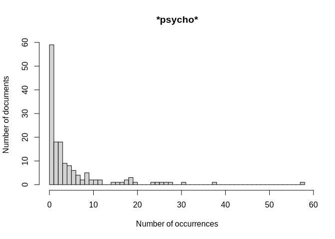

Searching words in the pdfs
================
Marius Bottin
2024-01-31

- [1 Number of pages](#1-number-of-pages)
- [2 Psycho](#2-psycho)
- [3 Papers with more than 10
  occurrences](#3-papers-with-more-than-10-occurrences)
- [4 Self-efficacy](#4-self-efficacy)
- [5 Theory of planned behavior](#5-theory-of-planned-behavior)
- [6 Hope](#6-hope)
- [7 Fear](#7-fear)
- [8 Distress](#8-distress)
- [9 anxi](#9-anxi)
- [10 Participatory action research](#10-participatory-action-research)
- [11 Action research](#11-action-research)
- [12 participatory research](#12-participatory-research)
- [13 critical research](#13-critical-research)
- [14 Subset in psychology journals](#14-subset-in-psychology-journals)
  - [14.1 Participatory action
    research](#141-participatory-action-research)
  - [14.2 Action research](#142-action-research)
  - [14.3 participatory research](#143-participatory-research)
  - [14.4 critical research](#144-critical-research)
- [15 Exporting occurrence numbers for
  psycho](#15-exporting-occurrence-numbers-for-psycho)
- [16 Checking numbers](#16-checking-numbers)

``` r
require(knitr)&require(kableExtra)
```

    ## Loading required package: knitr

    ## Loading required package: kableExtra

    ## [1] TRUE

``` r
knitr::opts_chunk$set(cache=T, fig.path="./Fig/")
dos <- normalizePath("../../extraction/")
toExclude<-c("Leckey2021a","Bopardikar2021","Trott2020","Turner2022","results_graphs_number","Ross2021")
```

# 1 Number of pages

``` r
setwd(dos)
raw <- system(paste("find",'-type d','-exec exiftool -T -filename -PageCount -s3 -ext pdf {} \\;'),intern = T)
numberPages <- as.data.frame(Reduce(rbind,strsplit(raw,"\t")))
sum(as.numeric(sapply(strsplit(raw,"\t"),function(x)x[2])))
```

    ## [1] 2723

# 2 Psycho

``` r
setwd(dos)
raw <- system(paste("find",'-name "*.pdf"','-exec pdfgrep -icH -e "psycho" {} \\;'),intern = T)
sep <- strsplit(raw,":")
excl<-gsub("\\.pdf","",basename(sapply(sep,function(x){x[1]})))%in%toExclude
sep<-sep[!excl]
```

``` r
cat("Number of papers: ", sum(sapply(sep,function(x)as.numeric(x[2])>=5)), "/", length(sep), "include the word 5 times or more\n" )
```

    ## Number of papers:  46 / 146 include the word 5 times or more

``` r
kable(Reduce(rbind,sep[sapply(sep,function(x)as.numeric(x[2])>1)]),row.names = NA)
```

|      |                                   |     |
|:-----|:----------------------------------|:----|
| init | ./Sara/Muller2021a.pdf            | 3   |
|      | ./Sara/Harker_Schuch2020.pdf      | 9   |
|      | ./Sara/Littrell2022.pdf           | 10  |
|      | ./Sara/Blaum2017.pdf              | 19  |
|      | ./Sara/Smith2019.pdf              | 4   |
|      | ./Sara/Lambert2013.pdf            | 8   |
|      | ./Ana/Sellmann2013.pdf            | 3   |
|      | ./Ana/Petersen2020.pdf            | 18  |
|      | ./Ana/Schubatzky2022.pdf          | 4   |
|      | ./Ana/Lambert2012.pdf             | 2   |
|      | ./Ana/Feierabend2012.pdf          | 3   |
|      | ./Ana/Porter2012.pdf              | 3   |
|      | ./Ana/Lombardi2013.pdf            | 11  |
|      | ./Ana/Arya2016.pdf                | 5   |
|      | ./Ana/Khadka2021.pdf              | 9   |
|      | ./Ana/Boon2016.pdf                | 6   |
|      | ./Ana/Aksut2016.pdf               | 2   |
|      | ./Ana/Bozdogan2011.pdf            | 3   |
|      | ./Ana/DeWaters2014.pdf            | 3   |
|      | ./Ana/Parant2017.pdf              | 28  |
|      | ./Ana/Aksel_Stenberdt2023.pdf     | 38  |
|      | ./Ana/Puttick2018.pdf             | 3   |
|      | ./Ana/Kubisch2022.pdf             | 2   |
|      | ./Ana/Liu2015.pdf                 | 2   |
|      | ./Ana/Bofferding2015.pdf          | 2   |
|      | ./Ana/Chang2018.pdf               | 3   |
|      | ./Ana/Bentz2020.pdf               | 6   |
|      | ./Ana/Williams2017.pdf            | 16  |
|      | ./Ana/Varma2012.pdf               | 6   |
|      | ./Sergio/Dormody2020.pdf          | 2   |
|      | ./Sergio/Levrini2021.pdf          | 4   |
|      | ./Sergio/Svihla2012.pdf           | 2   |
|      | ./Sergio/Mason1998.pdf            | 4   |
|      | ./Sergio/Reinfried2012.pdf        | 25  |
|      | ./Sergio/Zografakis2008.pdf       | 2   |
|      | ./Sergio/McGowan2022.pdf          | 20  |
|      | ./Sergio/Sternang2012.pdf         | 5   |
|      | ./Sergio/Cebesoy2019.pdf          | 3   |
|      | ./Sergio/Kolenaty2022.pdf         | 12  |
|      | ./Sergio/Kumar2023.pdf            | 3   |
|      | ./Sergio/Sellmann2013a.pdf        | 17  |
|      | ./Luisa/Skains2022.pdf            | 7   |
|      | ./Luisa/Muller2021.pdf            | 3   |
|      | ./Luisa/Stevenson2018.pdf         | 6   |
|      | ./Luisa/Nussbaum2015.pdf          | 2   |
|      | ./Luisa/Herrick2022.pdf           | 31  |
|      | ./Luisa/Jin2013.pdf               | 5   |
|      | ./Luisa/Markowitz2018.pdf         | 58  |
|      | ./Luisa/Oberauer2023.pdf          | 27  |
|      | ./Luisa/Pruneau2006a.pdf          | 6   |
|      | ./Luisa/Tasquier2017.pdf          | 7   |
|      | ./JuanGabriel/Trott2022.pdf       | 26  |
|      | ./JuanGabriel/Karpudewan2015a.pdf | 3   |
|      | ./JuanGabriel/Sutela2023.pdf      | 2   |
|      | ./JuanGabriel/Walsh2019.pdf       | 8   |
|      | ./JuanGabriel/Saribaş2016.pdf     | 2   |
|      | ./JuanGabriel/Trott2019.pdf       | 19  |
|      | ./JuanGabriel/Klosterman2010.pdf  | 2   |
|      | ./JuanGabriel/Flora2014.pdf       | 2   |
|      | ./JuanGabriel/Eggert2017.pdf      | 5   |
|      | ./JuanGabriel/Zhong2021.pdf       | 6   |
|      | ./Benjamin/Veijalainen2013.pdf    | 11  |
|      | ./Benjamin/Ruboon2012.pdf         | 2   |
|      | ./Benjamin/Roscoe2013.pdf         | 5   |
|      | ./Benjamin/Taylor2020.pdf         | 2   |
|      | ./Benjamin/Trott2020b.pdf         | 15  |
|      | ./Benjamin/Raes2016.pdf           | 10  |
|      | ./Benjamin/Wang2022.pdf           | 24  |
|      | ./Benjamin/Pruneau2003.pdf        | 4   |
|      | ./Marius/Miller2015.pdf           | 2   |
|      | ./Marius/Karpudewan2017.pdf       | 7   |
|      | ./Marius/Cebesoy2022.pdf          | 3   |
|      | ./Marius/Trott2020a.pdf           | 19  |
|      | ./Marius/Jones2021.pdf            | 7   |
|      | ./Marius/Walsh2018.pdf            | 3   |
|      | ./Marius/Sellmann2015.pdf         | 3   |
|      | ./Marius/Gutierrez2022.pdf        | 9   |
|      | ./Marius/Goulah2017.pdf           | 3   |
|      | ./Marius/Leckey2021.pdf           | 5   |
|      | ./Marius/Karpudewan2015.pdf       | 3   |
|      | ./Marius/Schrot2021a.pdf          | 2   |
|      | ./Marius/Leitao2022.pdf           | 2   |
|      | ./Marius/Hu2016.pdf               | 12  |
|      | ./Marius/Keller2019.pdf           | 9   |
|      | ./Marius/Stevenson2018a.pdf       | 9   |
|      | ./Marius/Jacobson2017.pdf         | 4   |
|      | ./Marius/Deisenrieder2020.pdf     | 18  |
|      | ./Marius/Parth2020.pdf            | 4   |
|      | ./Marius/Korsager2015.pdf         | 3   |
|      | ./Marius/Drewes2018.pdf           | 4   |

``` r
tabOccurrences<-data.frame(
  pdfName=basename(sapply(sep,function(x)x[1])),
  occurrences=as.numeric(sapply(sep,function(x)x[2]))
)
tabOccurrences$pages<-as.numeric(numberPages[match(tabOccurrences$pdfName,numberPages$V1),2])
occPerPage<-tabOccurrences$occurrences/tabOccurrences$pages

hist(tabOccurrences$occurrences,xlab="Number of occurrences",nclass=60, main='*psycho*',ylab="Number of documents")
```

<!-- -->

``` r
hist(occPerPage,xlab="Number of occurrences per page",nclass=60, main='*psycho*',ylab="Number of documents")
```

<!-- -->

``` r
listNumbersOccurrencePsycho<-
  list(
as.matrix(table(tabOccurrences$occurrences)),
as.matrix(table(occPerPage))
)
```

``` r
par(mar=c(5.1,4.1,1,1))
dat<-table(factor(tabOccurrences$occurrences,levels=0:max(tabOccurrences$occurrences)))
A<-barplot(dat,col="black",cex.names=0.71,ylim=c(0,45),xlab="Number of occurrences of *psycho* in words within each article", ylab="Number of articles")
text(A[,1][dat>0],(dat+1)[dat>0],labels=dat[dat>0],cex=.71)
```

<!-- -->

``` r
par(mar=c(5.1,4.1,1,1))


A<-hist(occPerPage,  xlab="Number of occurrences of *psycho* in words per page within each article", ylab="Number of articles",col="black",nclass=60,border="white", main="")
text(A$mids[A$counts>0],A$counts[A$counts>0]+1,A$counts[A$counts>0])
```

<!-- -->

# 3 Papers with more than 10 occurrences

``` r
(moreThan10<-sapply(sep[tabOccurrences$occurrences>10],function(x)x[1]))
```

    ##  [1] "./Sara/Blaum2017.pdf"           "./Ana/Petersen2020.pdf"        
    ##  [3] "./Ana/Lombardi2013.pdf"         "./Ana/Parant2017.pdf"          
    ##  [5] "./Ana/Aksel_Stenberdt2023.pdf"  "./Ana/Williams2017.pdf"        
    ##  [7] "./Sergio/Reinfried2012.pdf"     "./Sergio/McGowan2022.pdf"      
    ##  [9] "./Sergio/Kolenaty2022.pdf"      "./Sergio/Sellmann2013a.pdf"    
    ## [11] "./Luisa/Herrick2022.pdf"        "./Luisa/Markowitz2018.pdf"     
    ## [13] "./Luisa/Oberauer2023.pdf"       "./JuanGabriel/Trott2022.pdf"   
    ## [15] "./JuanGabriel/Trott2019.pdf"    "./Benjamin/Veijalainen2013.pdf"
    ## [17] "./Benjamin/Trott2020b.pdf"      "./Benjamin/Wang2022.pdf"       
    ## [19] "./Marius/Trott2020a.pdf"        "./Marius/Hu2016.pdf"           
    ## [21] "./Marius/Deisenrieder2020.pdf"

``` r
setwd(dos)
if(file.exists("../export_sr_cce/more10Psycho")){unlink("../export_sr_cce/more10Psycho",recursive=T)}
dir.create("../export_sr_cce/more10Psycho")
sapply(moreThan10,file.copy,to="../export_sr_cce/more10Psycho/")
```

    ##           ./Sara/Blaum2017.pdf         ./Ana/Petersen2020.pdf 
    ##                           TRUE                           TRUE 
    ##         ./Ana/Lombardi2013.pdf           ./Ana/Parant2017.pdf 
    ##                           TRUE                           TRUE 
    ##  ./Ana/Aksel_Stenberdt2023.pdf         ./Ana/Williams2017.pdf 
    ##                           TRUE                           TRUE 
    ##     ./Sergio/Reinfried2012.pdf       ./Sergio/McGowan2022.pdf 
    ##                           TRUE                           TRUE 
    ##      ./Sergio/Kolenaty2022.pdf     ./Sergio/Sellmann2013a.pdf 
    ##                           TRUE                           TRUE 
    ##        ./Luisa/Herrick2022.pdf      ./Luisa/Markowitz2018.pdf 
    ##                           TRUE                           TRUE 
    ##       ./Luisa/Oberauer2023.pdf    ./JuanGabriel/Trott2022.pdf 
    ##                           TRUE                           TRUE 
    ##    ./JuanGabriel/Trott2019.pdf ./Benjamin/Veijalainen2013.pdf 
    ##                           TRUE                           TRUE 
    ##      ./Benjamin/Trott2020b.pdf        ./Benjamin/Wang2022.pdf 
    ##                           TRUE                           TRUE 
    ##        ./Marius/Trott2020a.pdf            ./Marius/Hu2016.pdf 
    ##                           TRUE                           TRUE 
    ##  ./Marius/Deisenrieder2020.pdf 
    ##                           TRUE

``` r
setwd("../export_sr_cce/more10Psycho/")
raw <- system(paste("find",'-name "*.pdf"','-exec pdfgrep -icH -e "participatory.action.research" {} \\;'),intern = T)
sep <- strsplit(raw,":")
kable(Reduce(rbind,sep[sapply(sep,function(x)as.numeric(x[2])>1)]),row.names = NA)
```

|      |                  |     |
|:-----|:-----------------|:----|
| init | ./Trott2019.pdf  | 7   |
|      | ./Trott2020b.pdf | 3   |

# 4 Self-efficacy

“Self-efficacy” or “self efficacy”:

``` r
setwd(dos)
raw <- system(paste("find",'-name "*.pdf"','-exec pdfgrep -icH -e "self.efficacy" {} \\;'),intern = T)
sep <- strsplit(raw,":")
excl<-gsub("\\.pdf","",basename(sapply(sep,function(x){x[1]})))%in%toExclude
sep<-sep[!excl]
```

``` r
cat("Number of papers: ", sum(sapply(sep,function(x)as.numeric(x[2])>=5)), "/", length(sep), "include the word 5 times or more\n" )
```

    ## Number of papers:  11 / 146 include the word 5 times or more

``` r
kable(Reduce(rbind,sep[sapply(sep,function(x)as.numeric(x[2])>1)]),row.names = NA)
```

|      |                               |     |
|:-----|:------------------------------|:----|
| init | ./Sara/Muller2021a.pdf        | 2   |
|      | ./Ana/Petersen2020.pdf        | 25  |
|      | ./Ana/Schubatzky2022.pdf      | 48  |
|      | ./Ana/Boon2016.pdf            | 4   |
|      | ./Ana/DeWaters2014.pdf        | 21  |
|      | ./Ana/Aksel_Stenberdt2023.pdf | 41  |
|      | ./Sergio/Kolenaty2022.pdf     | 61  |
|      | ./Luisa/Muller2021.pdf        | 2   |
|      | ./Luisa/Stevenson2018.pdf     | 5   |
|      | ./Luisa/Nussbaum2015.pdf      | 6   |
|      | ./Luisa/Oberauer2023.pdf      | 2   |
|      | ./JuanGabriel/Saribaş2016.pdf | 3   |
|      | ./JuanGabriel/Trott2019.pdf   | 3   |
|      | ./JuanGabriel/Flora2014.pdf   | 14  |
|      | ./Benjamin/Wang2022.pdf       | 11  |
|      | ./Marius/Gutierrez2022.pdf    | 8   |
|      | ./Marius/Deisenrieder2020.pdf | 31  |

``` r
tabOccurrences<-data.frame(
  pdfName=basename(sapply(sep,function(x)x[1])),
  occurrences=as.numeric(sapply(sep,function(x)x[2]))
)
tabOccurrences$pages<-as.numeric(numberPages[match(tabOccurrences$pdfName,numberPages$V1),2])
occPerPage<-tabOccurrences$occurrences/tabOccurrences$pages

hist(tabOccurrences$occurrences,xlab="Number of occurrences",nclass=60, main='*self.efficacy*',ylab="Number of documents")
```

<!-- -->

``` r
hist(occPerPage,xlab="Number of occurrences per page",nclass=60, main='*self.efficacy*',ylab="Number of documents")
```

<!-- -->

# 5 Theory of planned behavior

``` r
setwd(dos)
raw <- system(paste("find",'-name "*.pdf"','-exec pdfgrep -icH -e "planned[ -]behaviou?r" {} \\;'),intern = T)
sep <- strsplit(raw,":")
excl<-gsub("\\.pdf","",basename(sapply(sep,function(x){x[1]})))%in%toExclude
sep<-sep[!excl]
```

``` r
cat("Number of papers: ", sum(sapply(sep,function(x)as.numeric(x[2])>=5)), "/", length(sep), "include the word 5 times or more\n" )
```

    ## Number of papers:  1 / 146 include the word 5 times or more

``` r
sep1<-sep
kable(Reduce(rbind,sep[sapply(sep,function(x)as.numeric(x[2])>1)]),row.names = NA)
```

|      |                           |     |
|:-----|:--------------------------|:----|
| init | ./Ana/Williams2017.pdf    | 3   |
|      | ./Sergio/Kolenaty2022.pdf | 2   |
|      | ./Marius/Hu2016.pdf       | 5   |

``` r
tabOccurrences<-data.frame(
  pdfName=basename(sapply(sep,function(x)x[1])),
  occurrences=as.numeric(sapply(sep,function(x)x[2]))
)
tabOccurrences$pages<-as.numeric(numberPages[match(tabOccurrences$pdfName,numberPages$V1),2])
occPerPage<-tabOccurrences$occurrences/tabOccurrences$pages

hist(tabOccurrences$occurrences,xlab="Number of occurrences",nclass=60, main='*planned.behaviou?r*',ylab="Number of documents")
```

<!-- -->

``` r
hist(occPerPage,xlab="Number of occurrences per page",nclass=60, main='*planned.behaviou?r*',ylab="Number of documents")
```

<!-- -->

# 6 Hope

``` r
setwd(dos)
raw <- system(paste("find",'-name "*.pdf"','-exec pdfgrep -icH -e "hope" {} \\;'),intern = T)
sep <- strsplit(raw,":")
excl<-gsub("\\.pdf","",basename(sapply(sep,function(x){x[1]})))%in%toExclude
sep<-sep[!excl]
```

``` r
cat("Number of papers: ", sum(sapply(sep,function(x)as.numeric(x[2])>=5)), "/", length(sep), "include the word 5 times or more\n" )
```

    ## Number of papers:  16 / 146 include the word 5 times or more

``` r
kable(Reduce(rbind,sep[sapply(sep,function(x)as.numeric(x[2])>1)]),row.names = NA)
```

|      |                                 |     |
|:-----|:--------------------------------|:----|
| init | ./Sara/Muller2021a.pdf          | 2   |
|      | ./Sara/Harker_Schuch2020.pdf    | 2   |
|      | ./Sara/Littrell2022.pdf         | 3   |
|      | ./Sara/Lambert2013.pdf          | 2   |
|      | ./Ana/Gladwin2022.pdf           | 12  |
|      | ./Ana/Holthuis2014.pdf          | 2   |
|      | ./Ana/Feierabend2012.pdf        | 2   |
|      | ./Ana/Khadka2021.pdf            | 28  |
|      | ./Ana/Puttick2018.pdf           | 4   |
|      | ./Ana/Roychoudhury2017.pdf      | 2   |
|      | ./Ana/Nicholas_Figueroa2017.pdf | 2   |
|      | ./Ana/Bentz2020.pdf             | 10  |
|      | ./Sergio/Levrini2021.pdf        | 12  |
|      | ./Sergio/Siegner2018.pdf        | 3   |
|      | ./Sergio/McGowan2022.pdf        | 14  |
|      | ./Sergio/Kolenaty2022.pdf       | 17  |
|      | ./Luisa/Skains2022.pdf          | 2   |
|      | ./Luisa/Muller2021.pdf          | 2   |
|      | ./Luisa/Stevenson2018.pdf       | 60  |
|      | ./Luisa/Lawson2019a.pdf         | 2   |
|      | ./Luisa/Herrick2022.pdf         | 21  |
|      | ./Luisa/Oberauer2023.pdf        | 20  |
|      | ./JuanGabriel/Trott2022.pdf     | 2   |
|      | ./JuanGabriel/Sutela2023.pdf    | 2   |
|      | ./JuanGabriel/Walsh2019.pdf     | 5   |
|      | ./JuanGabriel/Trott2019.pdf     | 10  |
|      | ./JuanGabriel/da_Rocha2020.pdf  | 4   |
|      | ./Benjamin/Trott2020b.pdf       | 3   |
|      | ./Benjamin/Sumrall2021.pdf      | 2   |
|      | ./Benjamin/Wang2022.pdf         | 55  |
|      | ./Marius/Trott2020a.pdf         | 16  |
|      | ./Marius/Jones2021.pdf          | 18  |
|      | ./Marius/Leckey2021.pdf         | 2   |
|      | ./Marius/Park2020.pdf           | 3   |
|      | ./Marius/Stevenson2018a.pdf     | 44  |
|      | ./Marius/Jacobson2017.pdf       | 5   |
|      | ./Marius/Deisenrieder2020.pdf   | 3   |
|      | ./Marius/Drewes2018.pdf         | 4   |

``` r
tabOccurrences<-data.frame(
  pdfName=basename(sapply(sep,function(x)x[1])),
  occurrences=as.numeric(sapply(sep,function(x)x[2]))
)
tabOccurrences$pages<-as.numeric(numberPages[match(tabOccurrences$pdfName,numberPages$V1),2])
occPerPage<-tabOccurrences$occurrences/tabOccurrences$pages

hist(tabOccurrences$occurrences,xlab="Number of occurrences",nclass=60, main='*hope*',ylab="Number of documents")
```

<!-- -->

``` r
hist(occPerPage,xlab="Number of occurrences per page",nclass=60, main='*hope*',ylab="Number of documents")
```

<!-- -->

# 7 Fear

``` r
setwd(dos)
raw <- system(paste("find",'-name "*.pdf"','-exec pdfgrep -icH -e "fear" {} \\;'),intern = T)
sep <- strsplit(raw,":")
excl<-gsub("\\.pdf","",basename(sapply(sep,function(x){x[1]})))%in%toExclude
sep<-sep[!excl]
```

``` r
cat("Number of papers: ", sum(sapply(sep,function(x)as.numeric(x[2])>=5)), "/", length(sep), "include the word 5 times or more\n" )
```

    ## Number of papers:  5 / 146 include the word 5 times or more

``` r
kable(Reduce(rbind,sep[sapply(sep,function(x)as.numeric(x[2])>1)]),row.names = NA)
```

|      |                              |     |
|:-----|:-----------------------------|:----|
| init | ./Sara/Harker_Schuch2020.pdf | 2   |
|      | ./Sara/Lozano2022.pdf        | 4   |
|      | ./Ana/Gladwin2022.pdf        | 2   |
|      | ./Ana/Baker2013.pdf          | 2   |
|      | ./Ana/Steffensen2022.pdf     | 2   |
|      | ./Ana/Parant2017.pdf         | 20  |
|      | ./Ana/Williams2017.pdf       | 3   |
|      | ./Sergio/Levrini2021.pdf     | 8   |
|      | ./Luisa/Nussbaum2015.pdf     | 3   |
|      | ./Luisa/Herrick2022.pdf      | 4   |
|      | ./Luisa/Markowitz2018.pdf    | 3   |
|      | ./Luisa/Oberauer2023.pdf     | 8   |
|      | ./Luisa/Tasquier2017.pdf     | 2   |
|      | ./JuanGabriel/Trott2022.pdf  | 2   |
|      | ./Benjamin/Wang2022.pdf      | 56  |
|      | ./Marius/Jones2021.pdf       | 6   |

``` r
tabOccurrences<-data.frame(
  pdfName=basename(sapply(sep,function(x)x[1])),
  occurrences=as.numeric(sapply(sep,function(x)x[2]))
)
tabOccurrences$pages<-as.numeric(numberPages[match(tabOccurrences$pdfName,numberPages$V1),2])
occPerPage<-tabOccurrences$occurrences/tabOccurrences$pages

hist(tabOccurrences$occurrences,xlab="Number of occurrences",nclass=60, main='*fear*',ylab="Number of documents")
```

<!-- -->

``` r
hist(occPerPage,xlab="Number of occurrences per page",nclass=60, main='*fear*',ylab="Number of documents")
```

<!-- -->

# 8 Distress

``` r
setwd(dos)
raw <- system(paste("find",'-name "*.pdf"','-exec pdfgrep -icH -e "distress" {} \\;'),intern = T)
sep <- strsplit(raw,":")
excl<-gsub("\\.pdf","",basename(sapply(sep,function(x){x[1]})))%in%toExclude
sep<-sep[!excl]
```

``` r
cat("Number of papers: ", sum(sapply(sep,function(x)as.numeric(x[2])>=5)), "/", length(sep), "include the word 5 times or more\n" )
```

    ## Number of papers:  0 / 146 include the word 5 times or more

``` r
kable(Reduce(rbind,sep[sapply(sep,function(x)as.numeric(x[2])>1)]),row.names = NA)
```

``` r
tabOccurrences<-data.frame(
  pdfName=basename(sapply(sep,function(x)x[1])),
  occurrences=as.numeric(sapply(sep,function(x)x[2]))
)
tabOccurrences$pages<-as.numeric(numberPages[match(tabOccurrences$pdfName,numberPages$V1),2])
occPerPage<-tabOccurrences$occurrences/tabOccurrences$pages

hist(tabOccurrences$occurrences,xlab="Number of occurrences",nclass=60, main='*distress*',ylab="Number of documents")
```

<!-- -->

``` r
hist(occPerPage,xlab="Number of occurrences per page",nclass=60, main='*distress*',ylab="Number of documents")
```

<!-- -->

# 9 anxi

``` r
setwd(dos)
raw <- system(paste("find",'-name "*.pdf"','-exec pdfgrep -icH -e "anxi" {} \\;'),intern = T)
sep <- strsplit(raw,":")
excl<-gsub("\\.pdf","",basename(sapply(sep,function(x){x[1]})))%in%toExclude
sep<-sep[!excl]
```

``` r
cat("Number of papers: ", sum(sapply(sep,function(x)as.numeric(x[2])>=5)), "/", length(sep), "include the word 5 times or more\n" )
```

    ## Number of papers:  4 / 146 include the word 5 times or more

``` r
kable(Reduce(rbind,sep[sapply(sep,function(x)as.numeric(x[2])>1)]),row.names = NA)
```

|      |                              |     |
|:-----|:-----------------------------|:----|
| init | ./Sara/Muller2021a.pdf       | 3   |
|      | ./Sara/Harker_Schuch2020.pdf | 3   |
|      | ./Sara/Lozano2022.pdf        | 2   |
|      | ./Ana/Baker2013.pdf          | 2   |
|      | ./Ana/Bentz2020.pdf          | 2   |
|      | ./Sergio/Levrini2021.pdf     | 3   |
|      | ./Sergio/McGowan2022.pdf     | 4   |
|      | ./Sergio/Kolenaty2022.pdf    | 5   |
|      | ./Luisa/Muller2021.pdf       | 3   |
|      | ./Luisa/Markowitz2018.pdf    | 5   |
|      | ./Luisa/Oberauer2023.pdf     | 4   |
|      | ./JuanGabriel/Trott2022.pdf  | 6   |
|      | ./JuanGabriel/Sutela2023.pdf | 2   |
|      | ./Benjamin/Taylor2020.pdf    | 2   |
|      | ./Benjamin/Wang2022.pdf      | 2   |
|      | ./Marius/Trott2020a.pdf      | 2   |
|      | ./Marius/Jones2021.pdf       | 12  |
|      | ./Marius/Leitao2022.pdf      | 3   |

``` r
tabOccurrences<-data.frame(
  pdfName=basename(sapply(sep,function(x)x[1])),
  occurrences=as.numeric(sapply(sep,function(x)x[2]))
)
tabOccurrences$pages<-as.numeric(numberPages[match(tabOccurrences$pdfName,numberPages$V1),2])
occPerPage<-tabOccurrences$occurrences/tabOccurrences$pages

hist(tabOccurrences$occurrences,xlab="Number of occurrences",nclass=60, main='*anxi*',ylab="Number of documents")
```

<!-- -->

``` r
hist(occPerPage,xlab="Number of occurrences per page",nclass=60, main='*anxi*',ylab="Number of documents")
```

<!-- -->

# 10 Participatory action research

``` r
setwd(dos)
raw <- system(paste("find",'-name "*.pdf"','-exec pdfgrep -icH -e "participatory.action.research" {} \\;'),intern = T)
sep <- strsplit(raw,":")
excl<-gsub("\\.pdf","",basename(sapply(sep,function(x){x[1]})))%in%toExclude
sep<-sep[!excl]
```

``` r
cat("Number of papers: ", sum(sapply(sep,function(x)as.numeric(x[2])>=5)), "/", length(sep), "include the word 5 times or more\n" )
```

    ## Number of papers:  3 / 146 include the word 5 times or more

``` r
kable(Reduce(rbind,sep[sapply(sep,function(x)as.numeric(x[2])>1)]),row.names = NA)
```

|      |                             |     |
|:-----|:----------------------------|:----|
| init | ./Sara/Muller2021a.pdf      | 6   |
|      | ./Ana/Feierabend2012.pdf    | 4   |
|      | ./Luisa/Muller2021.pdf      | 6   |
|      | ./JuanGabriel/Trott2019.pdf | 7   |
|      | ./Benjamin/Trott2020b.pdf   | 3   |

``` r
tabOccurrences<-data.frame(
  pdfName=basename(sapply(sep,function(x)x[1])),
  occurrences=as.numeric(sapply(sep,function(x)x[2]))
)
tabOccurrences$pages<-as.numeric(numberPages[match(tabOccurrences$pdfName,numberPages$V1),2])
occPerPage<-tabOccurrences$occurrences/tabOccurrences$pages

hist(tabOccurrences$occurrences,xlab="Number of occurrences",nclass=60, main='*participatory.action.research*',ylab="Number of documents")
```

<!-- -->

``` r
hist(occPerPage,xlab="Number of occurrences per page",nclass=60, main='*participatory*',ylab="Number of documents")
```

<!-- -->

# 11 Action research

``` r
setwd(dos)
raw <- system(paste("find",'-name "*.pdf"','-exec pdfgrep -icH -e "action.research" {} \\;'),intern = T)
sep <- strsplit(raw,":")
excl<-gsub("\\.pdf","",basename(sapply(sep,function(x){x[1]})))%in%toExclude
sep<-sep[!excl]
```

``` r
cat("Number of papers: ", sum(sapply(sep,function(x)as.numeric(x[2])>=5)), "/", length(sep), "include the word 5 times or more\n" )
```

    ## Number of papers:  4 / 146 include the word 5 times or more

``` r
kable(Reduce(rbind,sep[sapply(sep,function(x)as.numeric(x[2])>1)]),row.names = NA)
```

|      |                             |     |
|:-----|:----------------------------|:----|
| init | ./Sara/Muller2021a.pdf      | 10  |
|      | ./Ana/Feierabend2012.pdf    | 5   |
|      | ./Ana/Chang2018.pdf         | 2   |
|      | ./Sergio/Siegner2018.pdf    | 3   |
|      | ./Luisa/Muller2021.pdf      | 10  |
|      | ./JuanGabriel/Trott2022.pdf | 2   |
|      | ./JuanGabriel/Trott2019.pdf | 26  |
|      | ./Benjamin/Trott2020b.pdf   | 3   |
|      | ./Marius/Trott2020a.pdf     | 4   |
|      | ./Marius/Goulah2017.pdf     | 2   |

``` r
tabOccurrences<-data.frame(
  pdfName=basename(sapply(sep,function(x)x[1])),
  occurrences=as.numeric(sapply(sep,function(x)x[2]))
)
tabOccurrences$pages<-as.numeric(numberPages[match(tabOccurrences$pdfName,numberPages$V1),2])
occPerPage<-tabOccurrences$occurrences/tabOccurrences$pages

hist(tabOccurrences$occurrences,xlab="Number of occurrences",nclass=60, main='*action.research*',ylab="Number of documents")
```

<!-- -->

``` r
hist(occPerPage,xlab="Number of occurrences per page",nclass=60, main='*action.research*',ylab="Number of documents")
```

<!-- -->

# 12 participatory research

``` r
setwd(dos)
raw <- system(paste("find",'-name "*.pdf"','-exec pdfgrep -icH -e "participatory.research" {} \\;'),intern = T)
sep <- strsplit(raw,":")
excl<-gsub("\\.pdf","",basename(sapply(sep,function(x){x[1]})))%in%toExclude
sep<-sep[!excl]
```

``` r
cat("Number of papers: ", sum(sapply(sep,function(x)as.numeric(x[2])>=5)), "/", length(sep), "include the word 5 times or more\n" )
```

    ## Number of papers:  0 / 146 include the word 5 times or more

``` r
kable(Reduce(rbind,sep[sapply(sep,function(x)as.numeric(x[2])>1)]),row.names = NA)
```

|      |                          |     |
|:-----|:-------------------------|:----|
| init | ./Ana/Williams2017.pdf   | 2   |
|      | ./Sergio/Siegner2018.pdf | 2   |

``` r
tabOccurrences<-data.frame(
  pdfName=basename(sapply(sep,function(x)x[1])),
  occurrences=as.numeric(sapply(sep,function(x)x[2]))
)
tabOccurrences$pages<-as.numeric(numberPages[match(tabOccurrences$pdfName,numberPages$V1),2])
occPerPage<-tabOccurrences$occurrences/tabOccurrences$pages

hist(tabOccurrences$occurrences,xlab="Number of occurrences",nclass=60, main='*participatory.research*',ylab="Number of documents")
```

<!-- -->

``` r
hist(occPerPage,xlab="Number of occurrences per page",nclass=60, main='*participatory.research*',ylab="Number of documents")
```

<!-- -->

# 13 critical research

``` r
setwd(dos)
raw <- system(paste("find",'-name "*.pdf"','-exec pdfgrep -icH -e "critical.research" {} \\;'),intern = T)
sep <- strsplit(raw,":")
excl<-gsub("\\.pdf","",basename(sapply(sep,function(x){x[1]})))%in%toExclude
sep<-sep[!excl]
```

``` r
cat("Number of papers: ", sum(sapply(sep,function(x)as.numeric(x[2])>=5)), "/", length(sep), "include the word 5 times or more\n" )
```

    ## Number of papers:  0 / 146 include the word 5 times or more

``` r
kable(Reduce(rbind,sep[sapply(sep,function(x)as.numeric(x[2])>1)]),row.names = NA)
```

``` r
tabOccurrences<-data.frame(
  pdfName=basename(sapply(sep,function(x)x[1])),
  occurrences=as.numeric(sapply(sep,function(x)x[2]))
)
tabOccurrences$pages<-as.numeric(numberPages[match(tabOccurrences$pdfName,numberPages$V1),2])
occPerPage<-tabOccurrences$occurrences/tabOccurrences$pages

hist(tabOccurrences$occurrences,xlab="Number of occurrences",nclass=60, main='*critical.research*',ylab="Number of documents")
```

<!-- -->

``` r
hist(occPerPage,xlab="Number of occurrences per page",nclass=60, main='*critical.research*',ylab="Number of documents")
```

<!-- -->

# 14 Subset in psychology journals

``` r
dosPsycho <- normalizePath("../../CCE and Psychology/")
setwd(dosPsycho)
raw <- system(paste("find",'-name "*.pdf"','-exec pdfgrep -icH -e "psycho" {} \\;'),intern = T)
sep <- strsplit(raw,":")
excl<-gsub("\\.pdf","",basename(sapply(sep,function(x){x[1]})))%in%toExclude
sep<-sep[!excl]
```

``` r
tabOccurrences<-data.frame(
  pdfName=basename(sapply(sep,function(x)x[1])),
  occurrences=as.numeric(sapply(sep,function(x)x[2]))
)
tabOccurrences$pages<-as.numeric(numberPages[match(tabOccurrences$pdfName,numberPages$V1),2])
occPerPage<-tabOccurrences$occurrences/tabOccurrences$pages

hist(tabOccurrences$occurrences,xlab="Number of occurrences",nclass=60, main='*psycho*',ylab="Number of documents")
```

<!-- -->

``` r
hist(occPerPage,xlab="Number of occurrences per page",nclass=60, main='*psycho*',ylab="Number of documents")
```

<!-- -->

``` r
par(mar=c(5.1,4.1,1,1))
dat<-table(factor(tabOccurrences$occurrences,levels=0:max(tabOccurrences$occurrences)))
A<-barplot(dat,col="black",cex.names=0.71,ylim=c(0,8),xlab="Number of occurrences of *psycho* in words within each article", ylab="Number of articles")
text(A[,1][dat>0],(dat+.2)[dat>0],labels=dat[dat>0],cex=.71)
```

<!-- -->

``` r
par(mar=c(5.1,4.1,1.5,1))


A<-hist(occPerPage,  xlab="Number of occurrences of *psycho* in words per page within each article", ylab="Number of articles",col="black",nclass=30,border="white", main="",ylim=c(0,6.5))
text(A$mids[A$counts>0],A$counts[A$counts>0]+.2,A$counts[A$counts>0])
```

<!-- -->

``` r
dosPsycho <- normalizePath("../../CCE and Psychology/Education journals/")
setwd(dosPsycho)
raw <- system(paste("find",'-name "*.pdf"','-exec pdfgrep -icH -e "psycho" {} \\;'),intern = T)
sep <- strsplit(raw,":")
excl<-gsub("\\.pdf","",basename(sapply(sep,function(x){x[1]})))%in%toExclude
sep<-sep[!excl]
```

``` r
tabOccurrences<-data.frame(
  pdfName=basename(sapply(sep,function(x)x[1])),
  occurrences=as.numeric(sapply(sep,function(x)x[2]))
)
tabOccurrences$pages<-as.numeric(numberPages[match(tabOccurrences$pdfName,numberPages$V1),2])
occPerPage<-tabOccurrences$occurrences/tabOccurrences$pages

hist(tabOccurrences$occurrences,xlab="Number of occurrences",nclass=, main='*psycho*',ylab="Number of documents")
```

<!-- -->

``` r
hist(occPerPage,xlab="Number of occurrences per page",nclass=60, main='*psycho*',ylab="Number of documents")
```

<!-- -->

``` r
listNumbersOccurrencePsycho<-
  c(listNumbersOccurrencePsycho,list(
as.matrix(table(tabOccurrences$occurrences)),
as.matrix(table(occPerPage))
))
```

## 14.1 Participatory action research

``` r
setwd(dosPsycho)
raw <- system(paste("find",'-name "*.pdf"','-exec pdfgrep -icH -e "participatory.action.research" {} \\;'),intern = T)
sep <- strsplit(raw,":")
excl<-gsub("\\.pdf","",basename(sapply(sep,function(x){x[1]})))%in%toExclude
sep<-sep[!excl]
```

``` r
cat("Number of papers: ", sum(sapply(sep,function(x)as.numeric(x[2])>=5)), "/", length(sep), "include the word 5 times or more\n" )
```

    ## Number of papers:  0 / 9 include the word 5 times or more

``` r
kable(Reduce(rbind,sep[sapply(sep,function(x)as.numeric(x[2])>1)]),row.names = NA)
```

``` r
tabOccurrences<-data.frame(
  pdfName=basename(sapply(sep,function(x)x[1])),
  occurrences=as.numeric(sapply(sep,function(x)x[2]))
)
tabOccurrences$pages<-as.numeric(numberPages[match(tabOccurrences$pdfName,numberPages$V1),2])
occPerPage<-tabOccurrences$occurrences/tabOccurrences$pages

hist(tabOccurrences$occurrences,xlab="Number of occurrences",nclass=60, main='*participatory.action.research*',ylab="Number of documents")
```

<!-- -->

``` r
hist(occPerPage,xlab="Number of occurrences per page",nclass=60, main='*participatory*',ylab="Number of documents")
```

<!-- -->

## 14.2 Action research

``` r
setwd(dosPsycho)
raw <- system(paste("find",'-name "*.pdf"','-exec pdfgrep -icH -e "action.research" {} \\;'),intern = T)
sep <- strsplit(raw,":")
excl<-gsub("\\.pdf","",basename(sapply(sep,function(x){x[1]})))%in%toExclude
sep<-sep[!excl]
```

``` r
cat("Number of papers: ", sum(sapply(sep,function(x)as.numeric(x[2])>=5)), "/", length(sep), "include the word 5 times or more\n" )
```

    ## Number of papers:  0 / 9 include the word 5 times or more

``` r
kable(Reduce(rbind,sep[sapply(sep,function(x)as.numeric(x[2])>1)]),row.names = NA)
```

``` r
tabOccurrences<-data.frame(
  pdfName=basename(sapply(sep,function(x)x[1])),
  occurrences=as.numeric(sapply(sep,function(x)x[2]))
)
tabOccurrences$pages<-as.numeric(numberPages[match(tabOccurrences$pdfName,numberPages$V1),2])
occPerPage<-tabOccurrences$occurrences/tabOccurrences$pages

hist(tabOccurrences$occurrences,xlab="Number of occurrences",nclass=60, main='*action.research*',ylab="Number of documents")
```

<!-- -->

``` r
hist(occPerPage,xlab="Number of occurrences per page",nclass=60, main='*action.research*',ylab="Number of documents")
```

<!-- -->

## 14.3 participatory research

``` r
setwd(dosPsycho)
raw <- system(paste("find",'-name "*.pdf"','-exec pdfgrep -icH -e "participatory.research" {} \\;'),intern = T)
sep <- strsplit(raw,":")
excl<-gsub("\\.pdf","",basename(sapply(sep,function(x){x[1]})))%in%toExclude
sep<-sep[!excl]
```

``` r
cat("Number of papers: ", sum(sapply(sep,function(x)as.numeric(x[2])>=5)), "/", length(sep), "include the word 5 times or more\n" )
```

    ## Number of papers:  0 / 9 include the word 5 times or more

``` r
kable(Reduce(rbind,sep[sapply(sep,function(x)as.numeric(x[2])>1)]),row.names = NA)
```

``` r
tabOccurrences<-data.frame(
  pdfName=basename(sapply(sep,function(x)x[1])),
  occurrences=as.numeric(sapply(sep,function(x)x[2]))
)
tabOccurrences$pages<-as.numeric(numberPages[match(tabOccurrences$pdfName,numberPages$V1),2])
occPerPage<-tabOccurrences$occurrences/tabOccurrences$pages

hist(tabOccurrences$occurrences,xlab="Number of occurrences",nclass=60, main='*participatory.research*',ylab="Number of documents")
```

<!-- -->

``` r
hist(occPerPage,xlab="Number of occurrences per page",nclass=60, main='*participatory.research*',ylab="Number of documents")
```

<!-- -->

## 14.4 critical research

``` r
setwd(dosPsycho)
raw <- system(paste("find",'-name "*.pdf"','-exec pdfgrep -icH -e "critical.research" {} \\;'),intern = T)
sep <- strsplit(raw,":")
excl<-gsub("\\.pdf","",basename(sapply(sep,function(x){x[1]})))%in%toExclude
sep<-sep[!excl]
```

``` r
cat("Number of papers: ", sum(sapply(sep,function(x)as.numeric(x[2])>=5)), "/", length(sep), "include the word 5 times or more\n" )
```

    ## Number of papers:  0 / 9 include the word 5 times or more

``` r
kable(Reduce(rbind,sep[sapply(sep,function(x)as.numeric(x[2])>1)]),row.names = NA)
```

``` r
tabOccurrences<-data.frame(
  pdfName=basename(sapply(sep,function(x)x[1])),
  occurrences=as.numeric(sapply(sep,function(x)x[2]))
)
tabOccurrences$pages<-as.numeric(numberPages[match(tabOccurrences$pdfName,numberPages$V1),2])
occPerPage<-tabOccurrences$occurrences/tabOccurrences$pages

hist(tabOccurrences$occurrences,xlab="Number of occurrences",nclass=60, main='*critical.research*',ylab="Number of documents")
```

<!-- -->

``` r
hist(occPerPage,xlab="Number of occurrences per page",nclass=60, main='*critical.research*',ylab="Number of documents")
```

<!-- -->

# 15 Exporting occurrence numbers for psycho

``` r
write.csv(file="../../export_sr_cce/allDocsOccurrences.csv",x = listNumbersOccurrencePsycho[[1]])
write.csv(file="../../export_sr_cce/allDocsOccurrencesPerPage.csv",x = listNumbersOccurrencePsycho[[2]])
write.csv(file="../../export_sr_cce/21docsOccurrences.csv",x = listNumbersOccurrencePsycho[[3]])
write.csv(file="../../export_sr_cce/21DocsOccurrencesPerPage.csv",x = listNumbersOccurrencePsycho[[4]])
```

# 16 Checking numbers

``` r
library(openxlsx)
rawExtract<-read.xlsx("../../extraction/20240116_journals.xlsx",sheet = "extraction ",startRow = 2)
setwd(dos)
raw <- system(paste("find",'-name "*.pdf"'),intern = T)
namesPdf<-gsub("\\.pdf","",basename(raw))
namesPdf[!namesPdf%in%rawExtract$id]
```

    ## [1] "Leckey2021a"           "Bopardikar2021"        "Trott2020"            
    ## [4] "Turner2022"            "results_graphs_number" "Saribaş2016"          
    ## [7] "Ross2021"

``` r
rawExtract$id[!rawExtract$id%in%namesPdf]
```

    ## [1] "Saribaş2016 "
