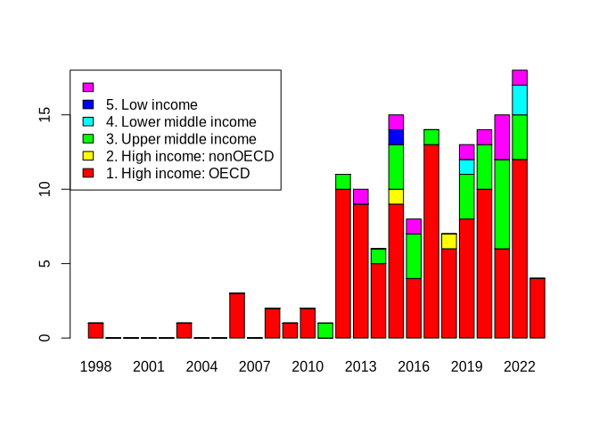
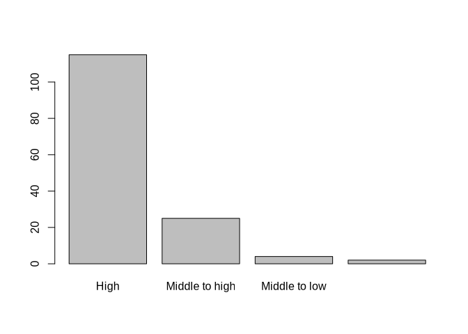

Results from the extraction: graphs and numbers
================
Marius Bottin
2023-09-27

- [1 Missing extractions](#1-missing-extractions)
- [2 Dates](#2-dates)
- [3 Countries](#3-countries)
  - [3.1 Making the map](#31-making-the-map)
- [4 Years/Region of the world](#4-yearsregion-of-the-world)
- [5 Outcomes](#5-outcomes)
- [6 Population](#6-population)
- [7 Controversy](#7-controversy)
- [8 Mitigation/Adaptation](#8-mitigationadaptation)
- [9 Educational framework](#9-educational-framework)
- [10 Monroe categories](#10-monroe-categories)
- [11 Theoretical framework](#11-theoretical-framework)

``` r
require(openxlsx)&require(knitr)&require(kableExtra)
```

    ## Loading required package: openxlsx

    ## Loading required package: knitr

    ## Loading required package: kableExtra

    ## [1] TRUE

``` r
names(loadWorkbook("../../extraction/20230927.xlsx"))
```

    ## [1] "Guidance for search strategy" "Search strategy"             
    ## [3] "Feuille 3"                    "Inclusion-exclusion criteria"
    ## [5] "searches"                     "extraction "                 
    ## [7] "ColorCode"

``` r
rawExtract<-read.xlsx("../../extraction/20230927.xlsx",sheet = "extraction ",startRow = 2)
extract<-rawExtract
load("../../extraction/docExtract.RData")
```

# 1 Missing extractions

``` r
missin<-unlist(docExtract)[!unlist(docExtract)%in%extract$id]
missin<-missin[missin!="Saribaş2016"]
missin
```

    ##            Ana19            Ana29            Ana32            Ana36 
    ##    "Leckey2021a"    "Gladwin2022" "Bopardikar2021"      "Trott2020" 
    ##            Ana38          Marius6         Marius10         Marius25 
    ##    "Puttick2018"  "Gutierrez2022"       "Ross2021"     "Goulah2017" 
    ##         Marius32          Luisa11          Luisa15       Benjamin15 
    ##     "Miller2015"     "Turner2022"   "Nussbaum2015"   "Schuster2018"

# 2 Dates

``` r
rawExtract$datepubl
```

    ##   [1] "2023.0"         "2016.0"         "2016.0"         "2013.0"        
    ##   [5] "2020.0"         "2021.0"         "2015.0"         "2016.0"        
    ##   [9] "2011.0"         "2018.0"         "2015.0"         "2021.0"        
    ##  [13] "2014.0"         "2021.0"         "2012.0"         "2014.0"        
    ##  [17] "2021.0"         "2012.0"         "2022.0"         "2012.0"        
    ##  [21] "2006.0"         "2015.0"         "2013.0"         "2016.0"        
    ##  [25] "2019.0"         "2017.0"         "2017.0"         "2020.0"        
    ##  [29] "2020.0"         "2017.0"         "2021.0"         "2022.0"        
    ##  [33] "2012.0"         "2016.0"         "2022.0"         "2009.0"        
    ##  [37] "2012.0"         "2015.0"         "2016.0"         "2017.0"        
    ##  [41] "2017.0"         "2017.0"         "2020.0"         "2015.0"        
    ##  [45] "2020.0"         "2020.0"         "2015.0"         "2022.0"        
    ##  [49] "2022.0"         "2017.0"         "January 2022"   "March 2019"    
    ##  [53] "September 2022" "2019.0"         "November 2012"  "March 2013"    
    ##  [57] "2020.0"         "2020.0"         "2022.0"         "2023.0"        
    ##  [61] "2021.0"         "2006.0"         "2021.0"         "2003.0"        
    ##  [65] "2021.0"         "1998.0"         "2013.0"         "2014.0"        
    ##  [69] "2021.0"         "2020.0"         "2022.0"         "2022.0"        
    ##  [73] "2013.0"         "2012.0"         "2021.0"         "2014.0"        
    ##  [77] "2020.0"         "2012.0"         "2015.0"         "2020.0"        
    ##  [81] "2021.0"         "2022.0"         "2020.0"         "2017.0"        
    ##  [85] "2013.0"         "2010.0"         "2019.0"         "2016.0"        
    ##  [89] "2017.0"         "2018.0"         "2020.0"         "2012.0"        
    ##  [93] "2020.0"         "2013.0"         "2019.0"         "2019.0"        
    ##  [97] "2019.0"         "2019.0"         "2019.0"         "2018.0"        
    ## [101] "2008.0"         "2018.0"         "2017.0"         "2017.0"        
    ## [105] "2012.0"         "2023.0"         "2017.0"         "2012.0"        
    ## [109] "2017.0"         "2014.0"         "2008.0"         "2021.0"        
    ## [113] "2019.0"         "2022.0"         "2015.0"         "2019.0"        
    ## [117] "2018.0"         "2017.0"         "2014.0"         "2021.0"        
    ## [121] "2016.0"         "2022.0"         "2019.0"         "2023.0"        
    ## [125] "2010.0"         "2013.0"         "2022.0"         "2021.0"        
    ## [129] "2015.0"         "2013.0"         "2019.0"         "2015.0"        
    ## [133] "2013.0"         "2022.0"         "2021.0"         "2015.0"        
    ## [137] "2015.0"         "2006.0"         "2022.0"         "2018.0"        
    ## [141] "2022.0"         "2017.0"         "2015.0"         "2019.0"        
    ## [145] "2015.0"         NA

``` r
extract$datepubl<-as.integer(gsub("\\.0$","",gsub("^([A-Z][a-z]+ )([12][0-9]{3})","\\2",rawExtract$datepubl)))

(datesById<-tapply(extract$datepubl,extract$id,unique))
```

    ##           Akaygun2021   Aksel_Stenberdt2023             Aksut2016 
    ##                  2020                  2023                  2016 
    ##              Arya2016             Baker2013             Bentz2020 
    ##                  2016                  2013                  2020 
    ##      Bhattacharya2021             Blaum2017            Bodzin2014 
    ##                  2021                  2017                  2013 
    ##        Bofferding2015              Boon2016          Bozdogan2011 
    ##                  2015                  2016                  2011 
    ##           Breslyn2019           Cebesoy2019           Cebesoy2022 
    ##                  2019                  2019                  2020 
    ##             Chang2018        Chattuchai2015              Chin2016 
    ##                  2018                  2015                  2015 
    ##              Choi2021             Cibik2022          da_Rocha2020 
    ##                  2021                  2022                  2020 
    ##              Dal2015a      Deisenrieder2020          DeWaters2014 
    ##                  2015                  2020                  2014 
    ##           Dormody2020           Dormody2021            Drewes2018 
    ##                  2020                  2021                  2017 
    ##            Eggert2017             Faria2015        Feierabend2012 
    ##                  2017                  2017                  2012 
    ## Feldpausch_Parker2013             Flora2014             Gold2015a 
    ##                  2013                  2014                  2015 
    ##     Harker_Schuch2013     Harker_Schuch2020           Herrick2022 
    ##                  2013                  2019                  2022 
    ##          Holthuis2014                Hu2016          Jacobson2017 
    ##                  2014                  2016                  2017 
    ##               Jin2013             Jones2021             Kabir2015 
    ##                  2013                  2021                  2015 
    ##        Karpudewan2015       Karpudewan2015a        Karpudewan2017 
    ##                  2015                  2014                  2017 
    ##            Keller2019              Kern2017            Khadka2021 
    ##                  2019                  2017                  2021 
    ##            Kinsey2012        Klosterman2010          Kolenaty2022 
    ##                  2012                  2010                  2022 
    ##           Korfgen2017          Korsager2015           Kubisch2022 
    ##                  2017                  2015                  2022 
    ##             Kumar2023           Lambert2012           Lambert2013 
    ##                  2023                  2012                  2013 
    ##           Lawson2019a            Leckey2021            Leitao2022 
    ##                  2019                  2021                  2021 
    ##            Lester2006           Levrini2021                Li2022 
    ##                  2006                  2021                  2022 
    ##          Littrell2022               Liu2015          Lombardi2013 
    ##                  2022                  2015                  2013 
    ##            Lozano2022         Markowitz2018             Mason1998 
    ##                  2022                  2018                  1998 
    ##           McGowan2022           McNeal2014a           McNeill2012 
    ##                  2022                  2014                  2010 
    ##              Meya2018           Miller 2015            Monroe2016 
    ##                  2018                  2015                  2016 
    ##            Muller2021           Muller2021a           Nafisah2022 
    ##                  2021                  2021                  2022 
    ##          Nakamura2019 Nicholas_Figueroa2017            Nkoana2020 
    ##                  2019                  2017                  2019 
    ##          Oberauer2023            Parant2017              Park2020 
    ##                  2023                  2017                  2020 
    ##             Parth2020             Pekel2019          Petersen2020 
    ##                  2020                  2019                  2020 
    ##            Porter2012           Pruneau2003           Pruneau2006 
    ##                  2020                  2003                  2006 
    ##          Pruneau2006a              Raes2016           Ratinen2013 
    ##                  2006                  2015                  2012 
    ##         Reinfried2012            Roscoe2013      Roychoudhury2017 
    ##                  2012                  2012                  2017 
    ##            Ruboon2012       Salas_Rueda2021         Salsabila2019 
    ##                  2012                  2021                  2019 
    ##          Saribaş2016            Schrot2021a        Schubatzky2022 
    ##                  2016                  2020                  2022 
    ##          Schuster2008          Sellmann2013         Sellmann2013a 
    ##                  2008                  2012                  2013 
    ##          Sellmann2015              Shea2016           Siegner2018 
    ##                  2015                  2016                  2018 
    ##             Silva2021            Skains2022             Smith2019 
    ##                  2021                  2022                  2019 
    ##        Steffensen2022          Sternang2012         Stevenson2018 
    ##                  2022                  2012                  2018 
    ##        Stevenson2018a           Sukardi2022           Sumrall2021 
    ##                  2017                  2022                  2021 
    ##          Sundberg2013            Sutela2023            Svihla2012 
    ##                  2013                  2023                  2012 
    ##             Taber2009          Tasquier2015          Tasquier2017 
    ##                  2009                  2015                  2017 
    ##             Tasti2021            Taylor2020             Trott2019 
    ##                  2021                  2020                  2019 
    ##            Trott2020a            Trott2020b             Trott2022 
    ##                  2019                  2020                  2022 
    ##             Varma2012       Veijalainen2013           Vicente2020 
    ##                  2012                  2013                  2020 
    ##       Visintainer2015             Walsh2018             Walsh2019 
    ##                  2015                  2018                  2019 
    ##              Wang2022             White2022          Williams2017 
    ##                  2022                  2022                  2016 
    ##               Xie2014             Zhong2021        Zografakis2008 
    ##                  2014                  2021                  2008

``` r
barplot(table(factor(datesById,levels=min(datesById):max(datesById))), las=2, main="Number of documents included in the analysis by year")
```

<!-- -->

# 3 Countries

``` r
library(stringr)
rawExtract$Countries.STUDY
```

    ##   [1] "Denmark"                                   
    ##   [2] "Turkey"                                    
    ##   [3] "United States; China; New Zealand;  Norway"
    ##   [4] "CANADA"                                    
    ##   [5] "PORTUGAL"                                  
    ##   [6] "United States"                             
    ##   [7] "United States"                             
    ##   [8] "Australia"                                 
    ##   [9] "Turkey"                                    
    ##  [10] "Singapore"                                 
    ##  [11] "Thailand"                                  
    ##  [12] "South korea, Australia"                    
    ##  [13] "United States"                             
    ##  [14] "United States"                             
    ##  [15] "Germany"                                   
    ##  [16] "United States"                             
    ##  [17] "United States"                             
    ##  [18] "United States"                             
    ##  [19] "Austria"                                   
    ##  [20] "United States"                             
    ##  [21] "United States"                             
    ##  [22] "United States"                             
    ##  [23] "United States"                             
    ##  [24] "United States"                             
    ##  [25] "Japan"                                     
    ##  [26] "United States"                             
    ##  [27] "France"                                    
    ##  [28] "Denmark"                                   
    ##  [29] "Canada"                                    
    ##  [30] "United States"                             
    ##  [31] "Mexico"                                    
    ##  [32] "Austria"                                   
    ##  [33] "Germany"                                   
    ##  [34] "United States"                             
    ##  [35] "Norway"                                    
    ##  [36] "Australia"                                 
    ##  [37] "United States"                             
    ##  [38] "United States"                             
    ##  [39] "United Kingdom"                            
    ##  [40] "Austria"                                   
    ##  [41] "United States"                             
    ##  [42] "United States"                             
    ##  [43] "BRASIL"                                    
    ##  [44] "Turkey"                                    
    ##  [45] "Spain"                                     
    ##  [46] "Turkey"                                    
    ##  [47] "United States"                             
    ##  [48] "Indonesia"                                 
    ##  [49] "United States"                             
    ##  [50] "Germany"                                   
    ##  [51] "United States"                             
    ##  [52] "Turkey"                                    
    ##  [53] "China"                                     
    ##  [54] "Indonesia"                                 
    ##  [55] "Finland"                                   
    ##  [56] "Finland"                                   
    ##  [57] "USA"                                       
    ##  [58] "Turkey"                                    
    ##  [59] "Czech Republic"                            
    ##  [60] "UK"                                        
    ##  [61] "United Kingdom;Portugal"                   
    ##  [62] "Canada"                                    
    ##  [63] "United Kingdom"                            
    ##  [64] "Canada"                                    
    ##  [65] "Italy, Finland, Iceland"                   
    ##  [66] "Italy "                                    
    ##  [67] "USA"                                       
    ##  [68] "USA"                                       
    ##  [69] "Puerto Rico (United States)"               
    ##  [70] "United States"                             
    ##  [71] "China"                                     
    ##  [72] "China"                                     
    ##  [73] "United States"                             
    ##  [74] "Thailand"                                  
    ##  [75] "United States"                             
    ##  [76] "Malaysia"                                  
    ##  [77] "New Zealand"                               
    ##  [78] "United States"                             
    ##  [79] "Belgium"                                   
    ##  [80] "Austria"                                   
    ##  [81] "Turkey"                                    
    ##  [82] "USA"                                       
    ##  [83] "Germany"                                   
    ##  [84] "United States"                             
    ##  [85] "United States"                             
    ##  [86] "USA"                                       
    ##  [87] "South Africa"                              
    ##  [88] "Turkey"                                    
    ##  [89] "United States"                             
    ##  [90] "Germany"                                   
    ##  [91] "South Korea"                               
    ##  [92] "Switzerland"                               
    ##  [93] "Germany; Austria"                          
    ##  [94] "Germany"                                   
    ##  [95] "Austria"                                   
    ##  [96] "United States"                             
    ##  [97] "United States"                             
    ##  [98] "United States"                             
    ##  [99] "United States"                             
    ## [100] "United States"                             
    ## [101] "USA"                                       
    ## [102] "USA"                                       
    ## [103] "United States"                             
    ## [104] "United States"                             
    ## [105] "Sweden"                                    
    ## [106] "Finland"                                   
    ## [107] "United States"                             
    ## [108] "USA"                                       
    ## [109] "Australia"                                 
    ## [110] "USA"                                       
    ## [111] "Greece"                                    
    ## [112] "Brazil"                                    
    ## [113] "USA"                                       
    ## [114] "USA"                                       
    ## [115] "Malaysia"                                  
    ## [116] "USA"                                       
    ## [117] "Estados Unidos"                            
    ## [118] "Malaysia"                                  
    ## [119] "United States"                             
    ## [120] "South Africa"                              
    ## [121] "China"                                     
    ## [122] "Spain"                                     
    ## [123] "United States"                             
    ## [124] "Austria"                                   
    ## [125] "United States"                             
    ## [126] "United States"                             
    ## [127] "Turkey"                                    
    ## [128] "CHINA"                                     
    ## [129] "Taiwan"                                    
    ## [130] "Austria; Denmark"                          
    ## [131] "Austria; Australia"                        
    ## [132] "Bangladesh"                                
    ## [133] "United States"                             
    ## [134] "United States"                             
    ## [135] "South Africa"                              
    ## [136] "Norway"                                    
    ## [137] "Italy"                                     
    ## [138] "Canada"                                    
    ## [139] "United Kingdom"                            
    ## [140] "United States"                             
    ## [141] "Indonesia"                                 
    ## [142] "Italy"                                     
    ## [143] "Germany"                                   
    ## [144] "Turkey"                                    
    ## [145] "Greenland; Denmark; United States"         
    ## [146] NA

``` r
extract$Countries.STUDY[extract$id=="Arya2016"]<-"United States;China;New Zealand;Norway"
extract$Countries.STUDY<-gsub("Puerto Rico \\(United States\\)","United States",gsub("Estados Unidos","United States",gsub("BRASIL","Brazil",gsub("UK","United Kingdom",gsub("USA","United States",extract$Countries.STUDY)))))
sepCountry <- strsplit(extract$Countries.STUDY,"[,;]")
countryStudy<-data.frame(id=rep(rawExtract$id,sapply(sepCountry,length)),
           country=unlist(sepCountry))
countryStudy$country<-str_to_title(gsub(" +$","",gsub("^and ","",gsub("^ +","",countryStudy$country))))
(nbBycountry<-sort(tapply(countryStudy$id,countryStudy$country,function(x)length(unique(x))),decreasing = T))
```

    ##  United States         Turkey        Austria        Germany      Australia 
    ##             57             10              9              8              5 
    ##         Canada          China United Kingdom        Denmark        Finland 
    ##              5              5              5              4              4 
    ##          Italy      Indonesia       Malaysia         Norway   South Africa 
    ##              4              3              3              3              3 
    ##         Brazil    New Zealand       Portugal    South Korea          Spain 
    ##              2              2              2              2              2 
    ##       Thailand     Bangladesh        Belgium Czech Republic         France 
    ##              2              1              1              1              1 
    ##         Greece      Greenland        Iceland          Japan         Mexico 
    ##              1              1              1              1              1 
    ##      Singapore         Sweden    Switzerland         Taiwan 
    ##              1              1              1              1

## 3.1 Making the map

``` r
require(rnaturalearth)
```

    ## Loading required package: rnaturalearth

    ## The legacy packages maptools, rgdal, and rgeos, underpinning the sp package,
    ## which was just loaded, will retire in October 2023.
    ## Please refer to R-spatial evolution reports for details, especially
    ## https://r-spatial.org/r/2023/05/15/evolution4.html.
    ## It may be desirable to make the sf package available;
    ## package maintainers should consider adding sf to Suggests:.
    ## The sp package is now running under evolution status 2
    ##      (status 2 uses the sf package in place of rgdal)

    ## Support for Spatial objects (`sp`) will be deprecated in {rnaturalearth} and will be removed in a future release of the package. Please use `sf` objects with {rnaturalearth}. For example: `ne_download(returnclass = 'sf')`

``` r
require(sf)
```

    ## Loading required package: sf

    ## Linking to GEOS 3.11.0, GDAL 3.7.0, PROJ 9.2.1; sf_use_s2() is TRUE

``` r
worldMap_tot<-ne_countries(returnclass = "sf")
namesCountries<-names(nbBycountry)
pbs<-namesCountries[!(namesCountries%in%worldMap_tot$name_long|namesCountries%in%worldMap_tot$name)]
if(length(pbs>0)){warning("the following countries are not found and will be ignored:",pbs)}
```

    ## Warning: the following countries are not found and will be ignored:Singapore

``` r
nbBycountry<-nbBycountry[!namesCountries%in%pbs]
namesCountries<-names(nbBycountry)
orderCt<-match(namesCountries,worldMap_tot$name_long)
orderCt[is.na(orderCt)]<-match(namesCountries[is.na(orderCt)],worldMap_tot$name)
#Colors
scaleNb<-rep(NA,length(nbBycountry))
scaleNb[nbBycountry==1]<-1
scaleNb[nbBycountry>1]<-2
scaleNb[nbBycountry>3]<-3
scaleNb[nbBycountry>5]<-4
scaleNb[nbBycountry>10]<-5
colorsScale<-c("#fafa6e","#f8cf55","#f6993c","#f35824","#ee0e0e")
par(mar=c(1,1,1,1))
plot(st_geometry(worldMap_tot),border="grey",lwd=0.5)
plot(st_geometry(worldMap_tot[orderCt,]),border="black",lwd=0.7,col=colorsScale[scaleNb],add=T)
legend("bottomleft",title="# Documents",fill=colorsScale,legend=c("1","2-3","4-5","5-10",">10"))
```

<!-- -->

``` r
countryStudy$FinalName<-NA
countryStudy$FinalName<-worldMap_tot[match(countryStudy$country,worldMap_tot$name),]$name
countryStudy$FinalName[is.na(countryStudy$FinalName)]<-worldMap_tot[match(countryStudy$country[is.na(countryStudy$FinalName)],worldMap_tot$name_long),]$name

countryDoc <- tapply(countryStudy$FinalName,countryStudy$id,function(x)
  {
  if(length(unique(x))==1){return(x[1])}else{return("Multiple")}
})
```

# 4 Years/Region of the world

``` r
REG<-factor(worldMap_tot$region_wb[worldMap_tot$region_wb!="Antarctica"])
plot(st_geometry(worldMap_tot[worldMap_tot$region_wb!="Antarctica",]),col=rainbow(nlevels(REG))[REG])
```

<!-- -->

``` r
countryStudy$region<-NA
countryStudy$region<-worldMap_tot[match(countryStudy$country,worldMap_tot$name_long),"region_wb"]$region_wb
countryStudy$region[is.na(countryStudy$region)]<-worldMap_tot[match(countryStudy$country[is.na(countryStudy$region)],worldMap_tot$name),"region_wb"]$region_wb
regionPapers<-factor(tapply(countryStudy$region,countryStudy$id,function(x){
  if(length(unique(x))==1){return(x[1])}else{return("Multiple")}
}),levels=c(levels(REG),"Multiple"))
yearPaper<-factor(datesById,levels=min(datesById):max(datesById))
TAB_year_region<-table(regionPapers,yearPaper[names(regionPapers)])
TAB_year_region<-TAB_year_region[as.logical(rowSums(TAB_year_region)),]
TAB_year_region<-TAB_year_region[order(rowSums(TAB_year_region),decreasing=T),]

A<-barplot(TAB_year_region,las=2,col=rainbow(nrow(TAB_year_region)),legend=T,args.legend = list(x="topleft"))
events <- c("United nations: Climate\nchange education framework","UNESCO: Climate Change\nEducation for Sustainable\nDevelopment program","Paris Agreement\nand SDG adoption")
dates <- c(1994,2010,2015)
events <-events[dates>min(as.numeric(colnames(TAB_year_region)))]
dates<-dates[dates>min(as.numeric(colnames(TAB_year_region)))]
datesOnGraph <-A[dates - as.numeric(min(as.numeric(colnames(TAB_year_region)), na.rm = T)) +1]
arrows(x0=datesOnGraph,y0=c(5,13),y1=rep(0,2),x1=datesOnGraph,length = .2,col="black", lwd=2)
text(datesOnGraph,c(6,13.5),events, cex=.7)
```

<!-- -->

# 5 Outcomes

``` r
didItWork_col<-colnames(extract)[grep("it.work",colnames(extract))]
barplot(colSums(!is.na(extract[c("knowledge","awareness","intention","emotion","action","habit","Other")])))
```

<!-- -->

``` r
withOutcome<-which(!is.na(extract[c("knowledge","awareness","intention","emotion","action","habit","Other")]),arr.ind=T)
outcomeEffect<-data.frame(id=extract$id[withOutcome[,1]],
           outcome=c("knowledge","awareness","intention","emotion","action","habit","Other")[withOutcome[,2]],
           effect=extract[didItWork_col][withOutcome]
           )
outcomeEffect$effect_simp<-NA
outcomeEffect$effect_simp[outcomeEffect$effect%in%c("yes","YES","Yes")]<-"Yes"
outcomeEffect$effect_simp[outcomeEffect$effect%in%c("no","No","NO")]<-"No"
outcomeEffect$effect_simp[is.na(outcomeEffect$effect_simp)]<-"Unclear"
barplot(t(table(factor(outcomeEffect$outcome,levels=c("knowledge","awareness","intention","emotion","action","habit","Other")),factor(outcomeEffect$effect_simp,levels=c("Yes","Unclear","No")))),las=2, legend=T, args.legend = list(title="Efficient:"))
```

<!-- -->

# 6 Population

``` r
extract$TARGETED.SAMPLE<-gsub(" $","",extract$TARGETED.SAMPLE)
sort(table(extract$TARGETED.SAMPLE),decreasing=T)
```

    ## 
    ##              students  Entourage (Teachers)  pre-service teachers 
    ##                   111                    16                     9 
    ##   Entourage (parents) students and teachers              Students 
    ##                     4                     2                     1 
    ##  students and parents students and Teachers 
    ##                     1                     1

``` r
extract$student<-extract$TARGETED.SAMPLE%in%c("Students","students")
extract$age_min[extract$student]
```

    ##   [1] NA     "13.0" NA     "16.0" NA     "11.0" NA     NA     NA     NA    
    ##  [11] NA     NA     NA     "15.0" NA     "13.0" NA     NA     "13.0" "14.0"
    ##  [21] NA     NA     NA     NA     NA     "15.0" "15.0" "15.0" NA     NA    
    ##  [31] NA     "7.0"  "13.0" NA     "10.0" "10.0" NA     NA     NA     "11.0"
    ##  [41] "13.0" "16.0" NA     "12.0" "9.0"  "11.0" "9.0"  "9.0"  "13.0" "16.0"
    ##  [51] "10.0" "11.0" NA     "12.0" "10.0" NA     NA     NA     "16.0" NA    
    ##  [61] NA     "14.0" "17.0" "15.0" NA     NA     NA     NA     "13.0" "ND"  
    ##  [71] NA     "11.0" "15.0" "13.0" "10.0" NA     NA     NA     NA     "15.0"
    ##  [81] NA     "11.0" NA     NA     "10.0" "10.0" NA     "16.0" "16.0" NA    
    ##  [91] NA     "10.0" "15.0" NA     "10.0" NA     "8.0"  NA     "16.0" "12.0"
    ## [101] NA     NA     NA     "17.0" "16.0" "12.0" "11.0" NA     "16.0" "15.0"
    ## [111] "15.0" NA

``` r
extract$age_max[extract$student]
```

    ##   [1] NA             "17.0"         NA             "18.0"         NA            
    ##   [6] "18.0"         NA             NA             NA             NA            
    ##  [11] NA             NA             NA             "16.0"         NA            
    ##  [16] "16.0"         NA             NA             "14.0"         "15.0"        
    ##  [21] NA             "16.0"         NA             NA             NA            
    ##  [26] "18.0"         "19.0"         "16.0"         NA             NA            
    ##  [31] NA             "9.0"          "15.0"         NA             "11.0"        
    ##  [36] "11.0"         NA             NA             NA             "15.0"        
    ##  [41] "14.0"         "18.0"         NA             "17.0"         "14.0"        
    ##  [46] "14.0"         "17.0"         "10.0"         "14.0"         "19.0"        
    ##  [51] "11.0"         "14.0"         NA             "17.0"         "12.0"        
    ##  [56] NA             NA             NA             "17.0"         NA            
    ##  [61] NA             "17.0"         "18.0"         "18.0"         NA            
    ##  [66] NA             NA             NA             "16.0"         "ND"          
    ##  [71] NA             "16.0"         "19.0"         "15.0"         "12.0"        
    ##  [76] NA             NA             NA             NA             "16.0"        
    ##  [81] NA             "12.0"         NA             NA             "12.0"        
    ##  [86] "12.0"         NA             "18.0"         "16.0"         NA            
    ##  [91] NA             "13.0"         "17.0"         NA             "19.0"        
    ##  [96] NA             "12.0"         NA             "17.0"         "13.0"        
    ## [101] NA             NA             NA             "17.0"         "17.0"        
    ## [106] "15.0"         "15 and older" NA             "18.0"         "19.0"        
    ## [111] "16.0"         NA

``` r
extract$mean.age[extract$student]
```

    ##   [1] "17.68 " NA       NA       NA       NA       NA       NA       NA      
    ##   [9] NA       NA       NA       NA       NA       NA       NA       NA      
    ##  [17] NA       NA       NA       NA       NA       "16.0"   NA       NA      
    ##  [25] NA       "17.0"   NA       NA       NA       NA       NA       NA      
    ##  [33] NA       NA       NA       NA       "14.0"   "17.16"  NA       NA      
    ##  [41] NA       NA       NA       NA       NA       NA       NA       NA      
    ##  [49] NA       NA       NA       NA       NA       NA       "11.1"   "10.5"  
    ##  [57] NA       "13.5"   NA       "13.5"   "12.5"   "15.55"  NA       NA      
    ##  [65] NA       "13.2"   NA       NA       "15.5"   NA       "14.0"   NA      
    ##  [73] NA       NA       NA       NA       NA       NA       NA       NA      
    ##  [81] NA       NA       "14.0"   NA       "11.1"   "11.1"   "11.0"   " "     
    ##  [89] "16.0"   NA       NA       NA       "16.0"   NA       NA       NA      
    ##  [97] NA       NA       NA       NA       NA       NA       NA       "17.0"  
    ## [105] NA       NA       NA       NA       NA       NA       "ND"     NA

``` r
extract$age_min_stud<-NA
extract$age_max_stud<-NA
extract$age_aver_stud<-NA
extract$age_stud_no_info<-NA
extract$age_min_stud[extract$student]<-as.numeric(gsub(" \\[Extracted from grade\\]","",extract$age_min[extract$student]))
```

    ## Warning: NAs introduced by coercion

``` r
extract$age_max_stud[extract$student]<-as.numeric(gsub(" \\[Extracted from grade\\]","",extract$age_max[extract$student]))
```

    ## Warning: NAs introduced by coercion

``` r
extract$age_aver_stud[extract$student]<-as.numeric(gsub("\\[Extracted from grade\\]","",extract$mean.age[extract$student]))
```

    ## Warning: NAs introduced by coercion

``` r
extract[extract$student,"age_stud_no_info"]<-apply(extract[extract$student,c("age_min_stud","age_max_stud","age_aver_stud")],1,function(x)all(is.na(x)))
extract[extract$student,"age_stud_type_info"]<-apply(extract[extract$student,c("age_min_stud","age_max_stud","age_aver_stud")],1,function(x){
    if(!is.na(x[1]) & !is.na(x[2]) & !is.na(x[3])){return("all")}
    if(!is.na(x[1]) & !is.na(x[2]) & is.na(x[3])){return("minmax")}
    if(is.na(x[1]) & is.na(x[2]) & !is.na(x[3])){return("mean")}
    if(sum(!is.na(x[1]) & !is.na(x[2]))==1 ){return("missingminmax")}else{return(NA)}
    
  })

#extract[extract$student,c("age_min","age_max","mean.age","age_min_stud","age_max_stud","age_aver_stud","age_stud_no_info","age_stud_type_info")]
table(extract$age_stud_type_info[extract$student],useNA = "always")
```

    ## 
    ##    all   mean minmax   <NA> 
    ##      9     11     46     46

``` r
age_order<- rep(NA,sum(!is.na(extract$age_stud_type_info)))
age_order[extract$age_stud_type_info[!is.na(extract$age_stud_type_info)]%in%c("all","mean")]<- extract[!is.na(extract$age_stud_type_info)&extract$age_stud_type_info%in%c("all","mean"),"age_aver_stud"]
age_order[extract$age_stud_type_info[!is.na(extract$age_stud_type_info)]%in%c("minmax")]<-rowMeans( extract[!is.na(extract$age_stud_type_info)&extract$age_stud_type_info%in%c("minmax"),c("age_min_stud","age_max_stud")])
order(age_order)
```

    ##  [1] 12 25 58 14 15 28 32 46 52 31 50 51 22 48 55 23 29 36 60 18 24 40  7 19 26
    ## [26] 33 35 43 63 13 16 42 45 49  4  6  8 21 30 57  2  5 11 41 47 66 37 54 56 34
    ## [51] 39 59 62  3  9 10 20 44 53 61 64 65 17 27 38  1

``` r
tabForPlot<-extract[!is.na(extract$age_stud_type_info),c("age_min_stud","age_max_stud","age_aver_stud","age_stud_no_info","age_stud_type_info")][order(age_order),]
plot(x=age_order[order(age_order)],y=1:nrow(tabForPlot),type="n",xlim=range(tabForPlot[,c("age_min_stud","age_max_stud")],na.rm=T), xlab="Age",ylab="",yaxt="n")
segments(tabForPlot$age_min_stud[tabForPlot$age_stud_type_info%in%c("minmax","all")],(1:nrow(tabForPlot))[tabForPlot$age_stud_type_info%in%c("minmax","all")], tabForPlot$age_max_stud[tabForPlot$age_stud_type_info%in%c("minmax","all")])
points(tabForPlot$age_aver_stud[tabForPlot$age_stud_type_info%in%c("mean","all")],(1:nrow(tabForPlot))[tabForPlot$age_stud_type_info%in%c("mean","all")],pch=3,cex=.5)
```

<!-- -->

# 7 Controversy

``` r
table(extract$Controversy,useNA="always")
```

    ## 
    ##   no   No   NO  no   yes  Yes <NA> 
    ##   29   80    3    1    5   26    2

``` r
extract$controv_clean<-NA
extract$controv_clean[grep("no",extract$Controversy,ignore.case=T)]<-"No"
extract$controv_clean[grep("yes",extract$Controversy,ignore.case=T)]<-"Yes"
#extract[c("controv_clean","Controversy")]
table(extract$controv_clean,useNA="ifany")
```

    ## 
    ##   No  Yes <NA> 
    ##  113   31    2

``` r
controvByDoc<-tapply(extract$controv_clean,extract$id,function(x)
  {
    if(any(na.omit(x)=="Yes")){return("Yes")}else if(any(na.omit(x)=="No")){return("No")}else{return(NA)}
  })
(A<-table(countryDoc[names(controvByDoc)],factor(controvByDoc,levels=c("No","Yes")),useNA="ifany"))
```

    ##                           
    ##                            No Yes <NA>
    ##   Australia                 3   0    0
    ##   Austria                   5   1    0
    ##   Bangladesh                1   0    0
    ##   Belgium                   1   0    0
    ##   Brazil                    2   0    0
    ##   Canada                    5   0    0
    ##   China                     4   0    0
    ##   Czechia                   1   0    0
    ##   Denmark                   2   0    0
    ##   Finland                   3   0    0
    ##   France                    1   0    0
    ##   Germany                   6   0    1
    ##   Greece                    1   0    0
    ##   Indonesia                 3   0    0
    ##   Italy                     1   2    0
    ##   Japan                     1   0    0
    ##   Malaysia                  3   0    0
    ##   Mexico                    1   0    0
    ##   Multiple                  5   3    0
    ##   New Zealand               1   0    0
    ##   Norway                    2   0    0
    ##   Portugal                  1   0    0
    ##   South Africa              3   0    0
    ##   South Korea               1   0    0
    ##   Spain                     2   0    0
    ##   Sweden                    1   0    0
    ##   Switzerland               1   0    0
    ##   Taiwan                    1   0    0
    ##   Thailand                  2   0    0
    ##   Turkey                   10   0    0
    ##   United Kingdom            4   0    0
    ##   United States of America 33  22    0
    ##   <NA>                      0   1    0

``` r
(PercentageControversy<-A[,2]/rowSums(A))
```

    ##                Australia                  Austria               Bangladesh 
    ##                0.0000000                0.1666667                0.0000000 
    ##                  Belgium                   Brazil                   Canada 
    ##                0.0000000                0.0000000                0.0000000 
    ##                    China                  Czechia                  Denmark 
    ##                0.0000000                0.0000000                0.0000000 
    ##                  Finland                   France                  Germany 
    ##                0.0000000                0.0000000                0.0000000 
    ##                   Greece                Indonesia                    Italy 
    ##                0.0000000                0.0000000                0.6666667 
    ##                    Japan                 Malaysia                   Mexico 
    ##                0.0000000                0.0000000                0.0000000 
    ##                 Multiple              New Zealand                   Norway 
    ##                0.3750000                0.0000000                0.0000000 
    ##                 Portugal             South Africa              South Korea 
    ##                0.0000000                0.0000000                0.0000000 
    ##                    Spain                   Sweden              Switzerland 
    ##                0.0000000                0.0000000                0.0000000 
    ##                   Taiwan                 Thailand                   Turkey 
    ##                0.0000000                0.0000000                0.0000000 
    ##           United Kingdom United States of America                     <NA> 
    ##                0.0000000                0.4000000                1.0000000

``` r
barplot(PercentageControversy,las=2)
```

<!-- -->

``` r
sum(controvByDoc=="Yes"&countryDoc[names(controvByDoc)]=="United States of America",na.rm = T)/sum(controvByDoc=="Yes",na.rm=T)
```

    ## [1] 0.7586207

``` r
sum(countryDoc[names(controvByDoc)]=="United States of America",na.rm=T)/length(countryDoc)
```

    ## [1] 0.3900709

``` r
sum(controvByDoc=="Yes"&countryDoc[names(controvByDoc)]=="United States of America",na.rm = T)/sum(countryDoc[names(controvByDoc)]=="United States of America",na.rm=T)
```

    ## [1] 0.4

``` r
par(mar=c(11,4,1,1))
barplot(t(A[order(A[,2],A[,1],decreasing=T),1:2]),beside=T,col=c("blue","red"),las=2,legend=T,args.legend = list(title="Controversy"))
```

<!-- -->

# 8 Mitigation/Adaptation

``` r
table(extract$`Final.mitigation/adaptation`,useNA = 'always')/sum(table(extract$`Final.mitigation/adaptation`,useNA = 'always'))
```

    ## 
    ## Adaptation       Both Mitigation    Neither       <NA> 
    ## 0.03424658 0.27397260 0.61643836 0.04109589 0.03424658

``` r
barplot(table(factor(extract$`Final.mitigation/adaptation`,levels=c("Mitigation","Adaptation","Both","Neither"))))
```

<!-- -->

# 9 Educational framework

We’ve got a problem, most of the extracted papers just do not have the
information:

``` r
edFrameNb<-table(extract$`Normative.Climate.Change.EDUCATIONAL.framework.(global/local)`,useNA="ifany")
edFrameNb<-edFrameNb[order(edFrameNb,decreasing=T)]

tabEdFrame<-data.frame(
    EducationalFramework=names(edFrameNb),
    nb=as.numeric(edFrameNb),
    ids=sapply(names(edFrameNb),function(x,tab)paste(na.omit(tab$id[tab$`Normative.Climate.Change.EDUCATIONAL.framework.(global/local)`==x]),collapse=", "), tab=extract)
  ,row.names = NULL)
tabEdFrame[is.na(tabEdFrame$EducationalFramework),3]<-paste(extract$id[is.na(extract$`Normative.Climate.Change.EDUCATIONAL.framework.(global/local)`)],collapse=", ")
kable(tabEdFrame)
```

<table>
<thead>
<tr>
<th style="text-align:left;">

EducationalFramework

</th>
<th style="text-align:right;">

nb

</th>
<th style="text-align:left;">

ids

</th>
</tr>
</thead>
<tbody>
<tr>
<td style="text-align:left;">

NA

</td>
<td style="text-align:right;">

49

</td>
<td style="text-align:left;">

Baker2013, Bentz2020, Bozdogan2011, Chang2018, Feierabend2012,
Holthuis2014, Kinsey2012, Lambert2012, Lombardi2013,
Nicholas_Figueroa2017, Petersen2020, Salas_Rueda2021, Schubatzky2022,
Sellmann2013, Shea2016, Steffensen2022, Taber2009, Varma2012,
Williams2017, Korfgen2017, Dormody2020, Kolenaty2022, Kumar2023,
Mason1998, Feldpausch_Parker2013, Roscoe2013, Raes2016, McGowan2022,
Klosterman2010, Saribaş2016 , Reinfried2012, Sellmann2013a,
Sternang2012, Sutela2023, Stevenson2018a, Xie2014, Trott2019, Trott2022,
Markowitz2018, Zhong2021, Harker_Schuch2013, Harker_Schuch2020,
Lambert2013, Littrell2022, Skains2022, Stevenson2018, Sukardi2022,
Pekel2019, NA

</td>
</tr>
<tr>
<td style="text-align:left;">

Local

</td>
<td style="text-align:right;">

34

</td>
<td style="text-align:left;">

Visintainer2015, Vicente2020, Gold2015a, Nafisah2022, White2022,
Eggert2017, Herrick2022, Salsabila2019, Leitao2022, Pruneau2006,
Jones2021, Pruneau2003, Flora2014, Leckey2021, Trott2020b, Li2022,
Li2022, Sumrall2021, Taylor2020, Parth2020, Jin2013, Kern2017, Park2020,
Deisenrieder2020, Trott2020a, Walsh2018, Drewes2018, Drewes2018,
Karpudewan2015, Lozano2022, Smith2019, McNeill2012, Chin2016,
Pruneau2006a

</td>
</tr>
<tr>
<td style="text-align:left;">

global

</td>
<td style="text-align:right;">

12

</td>
<td style="text-align:left;">

Aksel_Stenberdt2023, Aksut2016, Arya2016, Bhattacharya2021, Boon2016,
Choi2021, Khadka2021, Monroe2016, Parant2017, Roychoudhury2017,
Veijalainen2013, Meya2018

</td>
</tr>
<tr>
<td style="text-align:left;">

Global

</td>
<td style="text-align:right;">

10

</td>
<td style="text-align:left;">

Kubisch2022, da_Rocha2020, Wang2022, Cebesoy2022, Schrot2021a,
Lawson2019a, Zografakis2008, Tasquier2015, Tasquier2017, Miller 2015

</td>
</tr>
<tr>
<td style="text-align:left;">

local

</td>
<td style="text-align:right;">

10

</td>
<td style="text-align:left;">

Bofferding2015, Dormody2021, Lester2006, Liu2015, Nakamura2019,
Faria2015, Faria2015, Ratinen2013, Breslyn2019, Sellmann2015

</td>
</tr>
<tr>
<td style="text-align:left;">

National

</td>
<td style="text-align:right;">

4

</td>
<td style="text-align:left;">

Svihla2012, Jacobson2017, Silva2021, Walsh2019

</td>
</tr>
<tr>
<td style="text-align:left;">

both

</td>
<td style="text-align:right;">

2

</td>
<td style="text-align:left;">

DeWaters2014, Porter2012

</td>
</tr>
<tr>
<td style="text-align:left;">

Local and global

</td>
<td style="text-align:right;">

2

</td>
<td style="text-align:left;">

Ruboon2012, Karpudewan2015a

</td>
</tr>
<tr>
<td style="text-align:left;">

Local/Global

</td>
<td style="text-align:right;">

2

</td>
<td style="text-align:left;">

Karpudewan2017, Korsager2015

</td>
</tr>
<tr>
<td style="text-align:left;">

2008 United Nations Children’s Fund (UNICEF) report and United Nations
Educational, Scientific and Cultural Organization (UNESCO)

</td>
<td style="text-align:right;">

1

</td>
<td style="text-align:left;">

Muller2021a

</td>
</tr>
<tr>
<td style="text-align:left;">

2008 World Health Organization (WHO) manual

</td>
<td style="text-align:right;">

1

</td>
<td style="text-align:left;">

Kabir2015

</td>
</tr>
<tr>
<td style="text-align:left;">

Both

</td>
<td style="text-align:right;">

1

</td>
<td style="text-align:left;">

Sundberg2013

</td>
</tr>
<tr>
<td style="text-align:left;">

Critical pegagogy

</td>
<td style="text-align:right;">

1

</td>
<td style="text-align:left;">

Siegner2018

</td>
</tr>
<tr>
<td style="text-align:left;">

European

</td>
<td style="text-align:right;">

1

</td>
<td style="text-align:left;">

Levrini2021

</td>
</tr>
<tr>
<td style="text-align:left;">

GEMS (Great Explorations in Math and Science) curriculum (Hocking et
al., 1990)

</td>
<td style="text-align:right;">

1

</td>
<td style="text-align:left;">

Schuster2008

</td>
</tr>
<tr>
<td style="text-align:left;">

Geography education standards project, 1994

</td>
<td style="text-align:right;">

1

</td>
<td style="text-align:left;">

McNeal2014a

</td>
</tr>
<tr>
<td style="text-align:left;">

global

</td>
<td style="text-align:right;">

1

</td>
<td style="text-align:left;">

Chattuchai2015

</td>
</tr>
<tr>
<td style="text-align:left;">

Global and Local

</td>
<td style="text-align:right;">

1

</td>
<td style="text-align:left;">

Nkoana2020

</td>
</tr>
<tr>
<td style="text-align:left;">

Global/European

</td>
<td style="text-align:right;">

1

</td>
<td style="text-align:left;">

Akaygun2021

</td>
</tr>
<tr>
<td style="text-align:left;">

Global/local

</td>
<td style="text-align:right;">

1

</td>
<td style="text-align:left;">

Lawson2019a

</td>
</tr>
<tr>
<td style="text-align:left;">

Global/Local

</td>
<td style="text-align:right;">

1

</td>
<td style="text-align:left;">

Keller2019

</td>
</tr>
<tr>
<td style="text-align:left;">

local

</td>
<td style="text-align:right;">

1

</td>
<td style="text-align:left;">

Oberauer2023

</td>
</tr>
<tr>
<td style="text-align:left;">

Local

</td>
<td style="text-align:right;">

1

</td>
<td style="text-align:left;">

Blaum2017

</td>
</tr>
<tr>
<td style="text-align:left;">

Local, European

</td>
<td style="text-align:right;">

1

</td>
<td style="text-align:left;">

Tasti2021

</td>
</tr>
<tr>
<td style="text-align:left;">

NA European

</td>
<td style="text-align:right;">

1

</td>
<td style="text-align:left;">

Cebesoy2019

</td>
</tr>
<tr>
<td style="text-align:left;">

NA local

</td>
<td style="text-align:right;">

1

</td>
<td style="text-align:left;">

Dal2015a

</td>
</tr>
<tr>
<td style="text-align:left;">

This is a chinese programme, but no real educational framework is
mentionned

</td>
<td style="text-align:right;">

1

</td>
<td style="text-align:left;">

Hu2016

</td>
</tr>
<tr>
<td style="text-align:left;">

Unesco, Unicef, ESD

</td>
<td style="text-align:right;">

1

</td>
<td style="text-align:left;">

Muller2021

</td>
</tr>
<tr>
<td style="text-align:left;">

United Nations’ agenda

</td>
<td style="text-align:right;">

1

</td>
<td style="text-align:left;">

Cibik2022

</td>
</tr>
<tr>
<td style="text-align:left;">

US reform documents

</td>
<td style="text-align:right;">

1

</td>
<td style="text-align:left;">

Bodzin2014

</td>
</tr>
</tbody>
</table>

# 10 Monroe categories

How many include “5:target climate science misconceptions”:

``` r
sum(grepl("5",extract$`Monroe.categories.(ONLY.1,2,3,4,5,6,7)`))
```

    ## [1] 35

Which:

``` r
extract$id[grepl("5",extract$`Monroe.categories.(ONLY.1,2,3,4,5,6,7)`)]
```

    ##  [1] "Bhattacharya2021"  "Schubatzky2022"    "da_Rocha2020"     
    ##  [4] "Akaygun2021"       "White2022"         "Cebesoy2019"      
    ##  [7] "Ratinen2013"       "Pruneau2003"       "Karpudewan2015a"  
    ## [10] "Taylor2020"        "McGowan2022"       "Jin2013"          
    ## [13] "Kern2017"          "Reinfried2012"     "Sellmann2013a"    
    ## [16] "Lawson2019a"       "Lawson2019a"       "Walsh2018"        
    ## [19] "Drewes2018"        "Drewes2018"        "Svihla2012"       
    ## [22] "Silva2021"         "Markowitz2018"     "Smith2019"        
    ## [25] "McNeill2012"       "Bodzin2014"        "Harker_Schuch2013"
    ## [28] "Harker_Schuch2020" "Kabir2015"         "Lambert2013"      
    ## [31] "Littrell2022"      "Tasquier2015"      "Tasquier2017"     
    ## [34] "Sellmann2015"      "Pekel2019"

# 11 Theoretical framework

``` r
#sort(table(extract$`Theoretical.framework.(big.categories)`))
clean<-function(x)
{
  if(grepl("^ *$",x)){x<-NA}
  x<-gsub("^ +","",x)
  x<-gsub(" +$","",x)
  x<-gsub("^([a-z])","\\U\\1",x,perl=T)
  return(x)
}
listTheoBack<-lapply(strsplit(extract$`Theoretical.framework.(big.categories)`,";"),sapply,clean)
tabTheoBack<-data.frame(id=rep(extract$id,sapply(listTheoBack,length)),
           theoBack=unlist(listTheoBack)
           )
tabTheoBack$consistentWith[grepl("consistent with",tabTheoBack$theoBack)]<-T
tabTheoBack$consistentWith[!grepl("consistent with",tabTheoBack$theoBack)]<-F
tabTheoBack$theoBack<-gsub(" \\(consistent with\\)","",tabTheoBack$theoBack)
#sort(table(tabTheoBack$theoBack,useNA="ifany"))

#Temporary plot
forTempPlot<-table(tabTheoBack$theoBack,tabTheoBack$consistentWith)
forTempPlot<-forTempPlot[order(rowSums(forTempPlot),decreasing=T),]
other<-colSums(forTempPlot[6:nrow(forTempPlot),])
forTempPlot<-forTempPlot[1:5,]
forTempPlot<-rbind(forTempPlot,other)
par(mar=c(15,4,1,1))
bp<-barplot(t(forTempPlot),las=2, density=c(0,20))
legend("topleft",density=18,"consistent with")
text(bp[round(nrow(forTempPlot)/2)+1],max(forTempPlot),paste("To evaluate:",sum(is.na(tabTheoBack$theoBack))))
```

<!-- -->
