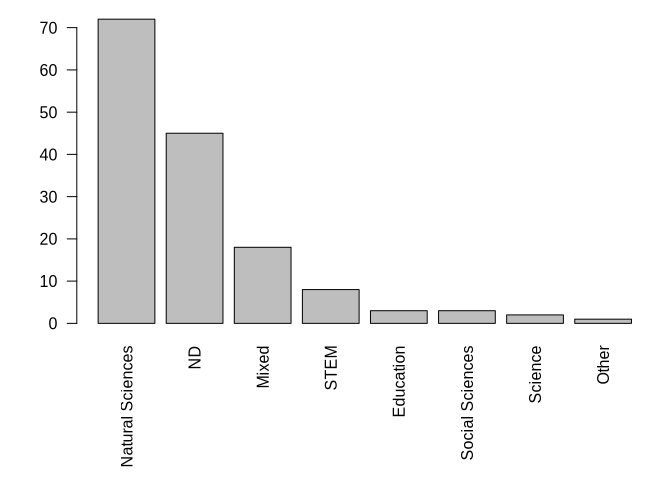
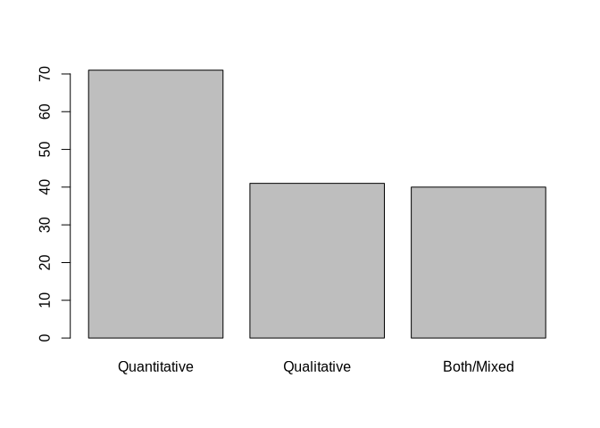
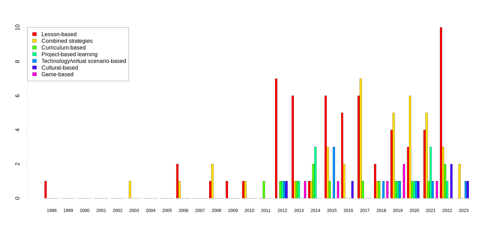

Results from the extraction: graphs and numbers
================
Marius Bottin
2023-10-20

- [1 Missing extractions](#1-missing-extractions)
- [2 Dates](#2-dates)
- [3 Countries](#3-countries)
  - [3.1 Making the map](#31-making-the-map)
- [4 Years/Region of the world](#4-yearsregion-of-the-world)
  - [4.1 Income group](#41-income-group)
- [5 Outcomes](#5-outcomes)
- [6 Population](#6-population)
  - [6.1 Rural/urban](#61-ruralurban)
  - [6.2 categories](#62-categories)
  - [6.3 Age](#63-age)
    - [6.3.1 Adding ages from grades](#631-adding-ages-from-grades)
  - [6.4 Population final categories](#64-population-final-categories)
- [7 Controversy](#7-controversy)
- [8 Mitigation/Adaptation](#8-mitigationadaptation)
- [9 Educational framework](#9-educational-framework)
- [10 Monroe categories](#10-monroe-categories)
- [11 Theoretical framework](#11-theoretical-framework)
  - [11.1 Comparison with population](#111-comparison-with-population)
  - [11.2 Comparison with pedagogical
    tools](#112-comparison-with-pedagogical-tools)
  - [11.3 Subcategorias](#113-subcategorias)
  - [11.4](#114)
- [12 Methods & design](#12-methods--design)
  - [12.1 Quanti/Quali](#121-quantiquali)
  - [12.2 Pre-post](#122-pre-post)
- [13 Characteristics of
  interventions](#13-characteristics-of-interventions)
  - [13.1 Pedagogical tools](#131-pedagogical-tools)
    - [13.1.1 From manuscript 1 text](#1311-from-manuscript-1-text)
    - [13.1.2 From table](#1312-from-table)
    - [13.1.3 Over time](#1313-over-time)
  - [13.2 Curricular/extracurricular](#132-curricularextracurricular)
  - [13.3 Indoor/outdoor](#133-indooroutdoor)
- [14 Time variables](#14-time-variables)
  - [14.1 intervention time
    categories](#141-intervention-time-categories)
  - [14.2 Horizon of change](#142-horizon-of-change)
  - [14.3 Comparison](#143-comparison)
    - [14.3.1 Between time aspects](#1431-between-time-aspects)
    - [14.3.2 With outcomes](#1432-with-outcomes)
    - [14.3.3 Simplified](#1433-simplified)
- [15 Analisis](#15-analisis)
- [16 SQL style](#16-sql-style)
  - [16.1 Innovative?](#161-innovative)
  - [16.2 problem profesor](#162-problem-profesor)

``` r
require(openxlsx)&require(knitr)&require(kableExtra)
```

    ## Loading required package: openxlsx

    ## Loading required package: knitr

    ## Loading required package: kableExtra

    ## [1] TRUE

``` r
names(loadWorkbook("../../extraction/20231019_3.xlsx"))
```

    ## [1] "Guidance for search strategy" "Search strategy"             
    ## [3] "Feuille 3"                    "Inclusion-exclusion criteria"
    ## [5] "searches"                     "extraction "                 
    ## [7] "ColorCode"

``` r
rawExtract<-read.xlsx("../../extraction/20231019_3.xlsx",sheet = "extraction ",startRow = 2)
extract<-rawExtract
load("../../extraction/docExtract.RData")
```

# 1 Missing extractions

``` r
missin<-unlist(docExtract)[!unlist(docExtract)%in%extract$id]
missin<-missin[missin!="Saribaş2016"]
missin
```

    ##            Ana19            Ana32            Ana36         Marius10 
    ##    "Leckey2021a" "Bopardikar2021"      "Trott2020"       "Ross2021" 
    ##          Luisa11       Benjamin15 
    ##     "Turner2022"   "Schuster2018"

# 2 Dates

``` r
rawExtract$datepubl
```

    ##   [1] "2023.0"         "2016.0"         "2016.0"         "2013.0"        
    ##   [5] "2020.0"         "2021.0"         "2015.0"         "2016.0"        
    ##   [9] "2011.0"         "2018.0"         "2015.0"         "2021.0"        
    ##  [13] "2014.0"         "2014.0"         "2021.0"         "2012.0"        
    ##  [17] "2021.0"         "2012.0"         "2022.0"         "2012.0"        
    ##  [21] "2006.0"         "2015.0"         "2013.0"         "2016.0"        
    ##  [25] "2019.0"         "2017.0"         "2017.0"         "2020.0"        
    ##  [29] "2020.0"         "2018.0"         "2017.0"         "2021.0"        
    ##  [33] "2022.0"         "2012.0"         "2016.0"         "2022.0"        
    ##  [37] "2009.0"         "2012.0"         "2015.0"         "2016.0"        
    ##  [41] "2017.0"         "2017.0"         "2017.0"         "2020.0"        
    ##  [45] "2015.0"         "2020.0"         "2020.0"         "2015.0"        
    ##  [49] "2022.0"         "2022.0"         "2017.0"         "January 2022"  
    ##  [53] "March 2019"     "September 2022" "2019.0"         "November 2012" 
    ##  [57] "March 2013"     "2020.0"         "2020.0"         "2022.0"        
    ##  [61] "2023.0"         "2021.0"         "2006.0"         "2021.0"        
    ##  [65] "2003.0"         "2021.0"         "1998.0"         "2013.0"        
    ##  [69] "2014.0"         "2021.0"         "2020.0"         "2022.0"        
    ##  [73] "2022.0"         "2013.0"         "2012.0"         "2021.0"        
    ##  [77] "2014.0"         "2020.0"         "2012.0"         "2015.0"        
    ##  [81] "2020.0"         "2021.0"         "2022.0"         "2020.0"        
    ##  [85] "2017.0"         "2013.0"         "2010.0"         "2019.0"        
    ##  [89] "2016.0"         "2017.0"         "2018.0"         "2020.0"        
    ##  [93] "2012.0"         "2020.0"         "2013.0"         "2019.0"        
    ##  [97] "2019.0"         "2019.0"         "2019.0"         "2019.0"        
    ## [101] "2018.0"         "2008.0"         "2018.0"         "2017.0"        
    ## [105] "2017.0"         "2012.0"         "2023.0"         "2017.0"        
    ## [109] "2012.0"         "2017.0"         "2014.0"         "2014.0"        
    ## [113] "2008.0"         "2008.0"         "2021.0"         "2019.0"        
    ## [117] "2022.0"         "2015.0"         "2019.0"         "2018.0"        
    ## [121] "2017.0"         "2014.0"         "2021.0"         "2016.0"        
    ## [125] "2022.0"         "2019.0"         "2023.0"         "2010.0"        
    ## [129] "2013.0"         "2022.0"         "2021.0"         "2015.0"        
    ## [133] "2013.0"         "2019.0"         "2015.0"         "2013.0"        
    ## [137] "2022.0"         "2021.0"         "2015.0"         "2015.0"        
    ## [141] "2006.0"         "2022.0"         "2018.0"         "2022.0"        
    ## [145] "2017.0"         "2015.0"         "2019.0"         "2015.0"        
    ## [149] "2022.0"         "2017.0"         "2022.0"         "2015.0"

``` r
extract$datepubl<-as.integer(gsub("\\.0$","",gsub("^([A-Z][a-z]+ )([12][0-9]{3})","\\2",rawExtract$datepubl)))

(datesById<-tapply(extract$datepubl,extract$id,unique))
```

    ##           Akaygun2021   Aksel_Stenberdt2023             Aksut2016 
    ##                  2020                  2023                  2016 
    ##              Arya2016             Baker2013             Bentz2020 
    ##                  2016                  2013                  2020 
    ##      Bhattacharya2021             Blaum2017            Bodzin2014 
    ##                  2021                  2017                  2013 
    ##        Bofferding2015              Boon2016          Bozdogan2011 
    ##                  2015                  2016                  2011 
    ##           Breslyn2019           Cebesoy2019           Cebesoy2022 
    ##                  2019                  2019                  2020 
    ##             Chang2018        Chattuchai2015              Chin2016 
    ##                  2018                  2015                  2015 
    ##              Choi2021             Cibik2022          da_Rocha2020 
    ##                  2021                  2022                  2020 
    ##              Dal2015a      Deisenrieder2020          DeWaters2014 
    ##                  2015                  2020                  2014 
    ##           Dormody2020           Dormody2021            Drewes2018 
    ##                  2020                  2021                  2017 
    ##            Eggert2017             Faria2015        Feierabend2012 
    ##                  2017                  2017                  2012 
    ## Feldpausch_Parker2013             Flora2014           Gladwin2022 
    ##                  2013                  2014                  2022 
    ##             Gold2015a            Goulah2017         Gutierrez2022 
    ##                  2015                  2017                  2022 
    ##     Harker_Schuch2013     Harker_Schuch2020           Herrick2022 
    ##                  2013                  2019                  2022 
    ##          Holthuis2014                Hu2016          Jacobson2017 
    ##                  2014                  2016                  2017 
    ##               Jin2013             Jones2021             Kabir2015 
    ##                  2013                  2021                  2015 
    ##        Karpudewan2015       Karpudewan2015a        Karpudewan2017 
    ##                  2015                  2014                  2017 
    ##            Keller2019              Kern2017            Khadka2021 
    ##                  2019                  2017                  2021 
    ##            Kinsey2012        Klosterman2010          Kolenaty2022 
    ##                  2012                  2010                  2022 
    ##           Korfgen2017          Korsager2015           Kubisch2022 
    ##                  2017                  2015                  2022 
    ##             Kumar2023           Lambert2012           Lambert2013 
    ##                  2023                  2012                  2013 
    ##           Lawson2019a            Leckey2021            Leitao2022 
    ##                  2019                  2021                  2021 
    ##            Lester2006           Levrini2021                Li2022 
    ##                  2006                  2021                  2022 
    ##          Littrell2022               Liu2015          Lombardi2013 
    ##                  2022                  2015                  2013 
    ##            Lozano2022         Markowitz2018             Mason1998 
    ##                  2022                  2018                  1998 
    ##           McGowan2022           McNeal2014a           McNeill2012 
    ##                  2022                  2014                  2010 
    ##              Meya2018            Miller2015            Monroe2016 
    ##                  2018                  2015                  2016 
    ##            Muller2021           Muller2021a           Nafisah2022 
    ##                  2021                  2021                  2022 
    ##          Nakamura2019 Nicholas_Figueroa2017            Nkoana2020 
    ##                  2019                  2017                  2019 
    ##          Nussbaum2015          Oberauer2023            Parant2017 
    ##                  2015                  2023                  2017 
    ##              Park2020             Parth2020             Pekel2019 
    ##                  2020                  2020                  2019 
    ##          Petersen2020            Porter2012           Pruneau2003 
    ##                  2020                  2020                  2003 
    ##           Pruneau2006          Pruneau2006a           Puttick2018 
    ##                  2006                  2006                  2018 
    ##              Raes2016           Ratinen2013         Reinfried2012 
    ##                  2015                  2012                  2012 
    ##            Roscoe2013      Roychoudhury2017            Ruboon2012 
    ##                  2012                  2017                  2012 
    ##       Salas_Rueda2021         Salsabila2019          Saribaş2016  
    ##                  2021                  2019                  2016 
    ##           Schrot2021a        Schubatzky2022          Schuster2008 
    ##                  2020                  2022                  2008 
    ##          Sellmann2013         Sellmann2013a          Sellmann2015 
    ##                  2012                  2013                  2015 
    ##              Shea2016           Siegner2018             Silva2021 
    ##                  2016                  2018                  2021 
    ##            Skains2022             Smith2019        Steffensen2022 
    ##                  2022                  2019                  2022 
    ##          Sternang2012         Stevenson2018        Stevenson2018a 
    ##                  2012                  2018                  2017 
    ##           Sukardi2022           Sumrall2021          Sundberg2013 
    ##                  2022                  2021                  2013 
    ##            Sutela2023            Svihla2012             Taber2009 
    ##                  2023                  2012                  2009 
    ##          Tasquier2015          Tasquier2017             Tasti2021 
    ##                  2015                  2017                  2021 
    ##            Taylor2020             Trott2019            Trott2020a 
    ##                  2020                  2019                  2019 
    ##            Trott2020b             Trott2022             Varma2012 
    ##                  2020                  2022                  2012 
    ##       Veijalainen2013           Vicente2020       Visintainer2015 
    ##                  2013                  2020                  2015 
    ##             Walsh2018             Walsh2019              Wang2022 
    ##                  2018                  2019                  2022 
    ##             White2022          Williams2017               Xie2014 
    ##                  2022                  2016                  2014 
    ##             Zhong2021        Zografakis2008 
    ##                  2021                  2008

``` r
barplot(table(factor(datesById,levels=min(datesById):max(datesById))), las=2, main="Number of documents included in the analysis by year")
```

<!-- -->

``` r
A <- table(factor(datesById,levels=min(datesById):max(datesById)))
A[as.numeric(names(A))>=2012]
```

    ## 
    ## 2012 2013 2014 2015 2016 2017 2018 2019 2020 2021 2022 2023 
    ##   11   10    6   15    8   14    7   13   14   15   18    4

``` r
sum(A[as.numeric(names(A))>=2012])/sum(A)
```

    ## [1] 0.9246575

# 3 Countries

``` r
library(stringr)
rawExtract$Countries.STUDY
```

    ##   [1] "Denmark"                                                                                                                                                       
    ##   [2] "Turkey"                                                                                                                                                        
    ##   [3] "United States; China; New Zealand;  Norway"                                                                                                                    
    ##   [4] "CANADA"                                                                                                                                                        
    ##   [5] "PORTUGAL"                                                                                                                                                      
    ##   [6] "United States"                                                                                                                                                 
    ##   [7] "United States"                                                                                                                                                 
    ##   [8] "Australia"                                                                                                                                                     
    ##   [9] "Turkey"                                                                                                                                                        
    ##  [10] "Singapore"                                                                                                                                                     
    ##  [11] "Thailand"                                                                                                                                                      
    ##  [12] "South korea, Australia"                                                                                                                                        
    ##  [13] "United States"                                                                                                                                                 
    ##  [14] "United States"                                                                                                                                                 
    ##  [15] "United States"                                                                                                                                                 
    ##  [16] "Germany"                                                                                                                                                       
    ##  [17] "United States"                                                                                                                                                 
    ##  [18] "United States"                                                                                                                                                 
    ##  [19] "Austria"                                                                                                                                                       
    ##  [20] "United States"                                                                                                                                                 
    ##  [21] "United States"                                                                                                                                                 
    ##  [22] "United States"                                                                                                                                                 
    ##  [23] "United States"                                                                                                                                                 
    ##  [24] "United States"                                                                                                                                                 
    ##  [25] "Japan"                                                                                                                                                         
    ##  [26] "United States"                                                                                                                                                 
    ##  [27] "France"                                                                                                                                                        
    ##  [28] "Denmark"                                                                                                                                                       
    ##  [29] "Canada"                                                                                                                                                        
    ##  [30] "USA"                                                                                                                                                           
    ##  [31] "United States"                                                                                                                                                 
    ##  [32] "Mexico"                                                                                                                                                        
    ##  [33] "Austria"                                                                                                                                                       
    ##  [34] "Germany"                                                                                                                                                       
    ##  [35] "United States"                                                                                                                                                 
    ##  [36] "Norway"                                                                                                                                                        
    ##  [37] "Australia"                                                                                                                                                     
    ##  [38] "United States"                                                                                                                                                 
    ##  [39] "United States"                                                                                                                                                 
    ##  [40] "United Kingdom"                                                                                                                                                
    ##  [41] "Austria"                                                                                                                                                       
    ##  [42] "United States"                                                                                                                                                 
    ##  [43] "United States"                                                                                                                                                 
    ##  [44] "BRASIL"                                                                                                                                                        
    ##  [45] "Turkey"                                                                                                                                                        
    ##  [46] "Spain"                                                                                                                                                         
    ##  [47] "Turkey"                                                                                                                                                        
    ##  [48] "United States"                                                                                                                                                 
    ##  [49] "Indonesia"                                                                                                                                                     
    ##  [50] "United States"                                                                                                                                                 
    ##  [51] "Germany"                                                                                                                                                       
    ##  [52] "United States"                                                                                                                                                 
    ##  [53] "Turkey"                                                                                                                                                        
    ##  [54] "China"                                                                                                                                                         
    ##  [55] "Indonesia"                                                                                                                                                     
    ##  [56] "Finland"                                                                                                                                                       
    ##  [57] "Finland"                                                                                                                                                       
    ##  [58] "United States"                                                                                                                                                 
    ##  [59] "Turkey"                                                                                                                                                        
    ##  [60] "Czech Republic"                                                                                                                                                
    ##  [61] "UK"                                                                                                                                                            
    ##  [62] "United Kingdom;Portugal"                                                                                                                                       
    ##  [63] "Canada"                                                                                                                                                        
    ##  [64] "United Kingdom"                                                                                                                                                
    ##  [65] "Canada"                                                                                                                                                        
    ##  [66] "Italy, Finland, Iceland"                                                                                                                                       
    ##  [67] "Italy "                                                                                                                                                        
    ##  [68] "USA"                                                                                                                                                           
    ##  [69] "USA"                                                                                                                                                           
    ##  [70] "Puerto Rico (United States)"                                                                                                                                   
    ##  [71] "United States"                                                                                                                                                 
    ##  [72] "China"                                                                                                                                                         
    ##  [73] "China"                                                                                                                                                         
    ##  [74] "United States"                                                                                                                                                 
    ##  [75] "Thailand"                                                                                                                                                      
    ##  [76] "United States"                                                                                                                                                 
    ##  [77] "Malaysia"                                                                                                                                                      
    ##  [78] "New Zealand"                                                                                                                                                   
    ##  [79] "United States"                                                                                                                                                 
    ##  [80] "Belgium"                                                                                                                                                       
    ##  [81] "Austria"                                                                                                                                                       
    ##  [82] "Turkey"                                                                                                                                                        
    ##  [83] "United States"                                                                                                                                                 
    ##  [84] "Germany"                                                                                                                                                       
    ##  [85] "United States"                                                                                                                                                 
    ##  [86] "United States"                                                                                                                                                 
    ##  [87] "USA"                                                                                                                                                           
    ##  [88] "South Africa"                                                                                                                                                  
    ##  [89] "Turkey"                                                                                                                                                        
    ##  [90] "United States"                                                                                                                                                 
    ##  [91] "Germany"                                                                                                                                                       
    ##  [92] "South Korea"                                                                                                                                                   
    ##  [93] "Switzerland"                                                                                                                                                   
    ##  [94] "Germany; Austria"                                                                                                                                              
    ##  [95] "Germany"                                                                                                                                                       
    ##  [96] "Austria"                                                                                                                                                       
    ##  [97] "United States"                                                                                                                                                 
    ##  [98] "United States"                                                                                                                                                 
    ##  [99] "United States"                                                                                                                                                 
    ## [100] "United States"                                                                                                                                                 
    ## [101] "United States"                                                                                                                                                 
    ## [102] "USA"                                                                                                                                                           
    ## [103] "United States"                                                                                                                                                 
    ## [104] "United States"                                                                                                                                                 
    ## [105] "United States"                                                                                                                                                 
    ## [106] "Sweden"                                                                                                                                                        
    ## [107] "Finland"                                                                                                                                                       
    ## [108] "United States"                                                                                                                                                 
    ## [109] "United States"                                                                                                                                                 
    ## [110] "Australia"                                                                                                                                                     
    ## [111] "United States"                                                                                                                                                 
    ## [112] "United States"                                                                                                                                                 
    ## [113] "Greece"                                                                                                                                                        
    ## [114] "Greece"                                                                                                                                                        
    ## [115] "Brazil"                                                                                                                                                        
    ## [116] "USA"                                                                                                                                                           
    ## [117] "USA"                                                                                                                                                           
    ## [118] "Malaysia"                                                                                                                                                      
    ## [119] "USA"                                                                                                                                                           
    ## [120] "United States"                                                                                                                                                 
    ## [121] "Malaysia"                                                                                                                                                      
    ## [122] "United States"                                                                                                                                                 
    ## [123] "South Africa"                                                                                                                                                  
    ## [124] "China"                                                                                                                                                         
    ## [125] "Spain"                                                                                                                                                         
    ## [126] "United States"                                                                                                                                                 
    ## [127] "Austria"                                                                                                                                                       
    ## [128] "United States"                                                                                                                                                 
    ## [129] "United States"                                                                                                                                                 
    ## [130] "Turkey"                                                                                                                                                        
    ## [131] "CHINA"                                                                                                                                                         
    ## [132] "Taiwan"                                                                                                                                                        
    ## [133] "Austria; Denmark"                                                                                                                                              
    ## [134] "Austria; Australia"                                                                                                                                            
    ## [135] "Bangladesh"                                                                                                                                                    
    ## [136] "United States"                                                                                                                                                 
    ## [137] "United States"                                                                                                                                                 
    ## [138] "South Africa"                                                                                                                                                  
    ## [139] "Norway"                                                                                                                                                        
    ## [140] "Italy"                                                                                                                                                         
    ## [141] "Canada"                                                                                                                                                        
    ## [142] "United Kingdom"                                                                                                                                                
    ## [143] "United States"                                                                                                                                                 
    ## [144] "Indonesia"                                                                                                                                                     
    ## [145] "Italy"                                                                                                                                                         
    ## [146] "Germany"                                                                                                                                                       
    ## [147] "Turkey"                                                                                                                                                        
    ## [148] "Greenland; Denmark; United States"                                                                                                                             
    ## [149] "United States"                                                                                                                                                 
    ## [150] "United States"                                                                                                                                                 
    ## [151] "Brazil; Canada; Colombia; Costa Rica; Finland; Ghana; India; Indonesia; Kenya; Kuwait; Nigeria; Oman; Peru; Philippines; Poland; Slovenia; South Korea; Uganda"
    ## [152] "United States"

``` r
extract$Countries.STUDY[extract$id=="Arya2016"]<-"United States;China;New Zealand;Norway"
extract$Countries.STUDY<-gsub("Puerto Rico \\(United States\\)","United States",gsub("Estados Unidos","United States",gsub("BRASIL","Brazil",gsub("UK","United Kingdom",gsub("USA","United States",extract$Countries.STUDY)))))
sepCountry <- strsplit(extract$Countries.STUDY,"[,;]")
countryStudy<-data.frame(id=rep(rawExtract$id,sapply(sepCountry,length)),
           country=unlist(sepCountry))
countryStudy$country<-str_to_title(gsub(" +$","",gsub("^and ","",gsub("^ +","",countryStudy$country))))
(nbBycountry<-sort(tapply(countryStudy$id,countryStudy$country,function(x)length(unique(x))),decreasing = T))
```

    ##  United States         Turkey        Austria        Germany         Canada 
    ##             61             10              9              8              6 
    ##      Australia          China        Finland United Kingdom        Denmark 
    ##              5              5              5              5              4 
    ##      Indonesia          Italy         Brazil       Malaysia         Norway 
    ##              4              4              3              3              3 
    ##   South Africa    South Korea    New Zealand       Portugal          Spain 
    ##              3              3              2              2              2 
    ##       Thailand     Bangladesh        Belgium       Colombia     Costa Rica 
    ##              2              1              1              1              1 
    ## Czech Republic         France          Ghana         Greece      Greenland 
    ##              1              1              1              1              1 
    ##        Iceland          India          Japan          Kenya         Kuwait 
    ##              1              1              1              1              1 
    ##         Mexico        Nigeria           Oman           Peru    Philippines 
    ##              1              1              1              1              1 
    ##         Poland      Singapore       Slovenia         Sweden    Switzerland 
    ##              1              1              1              1              1 
    ##         Taiwan         Uganda 
    ##              1              1

## 3.1 Making the map

``` r
require(rnaturalearth)
```

    ## Loading required package: rnaturalearth

    ## Support for Spatial objects (`sp`) will be deprecated in {rnaturalearth} and will be removed in a future release of the package. Please use `sf` objects with {rnaturalearth}. For example: `ne_download(returnclass = 'sf')`

``` r
require(sf)
```

    ## Loading required package: sf

    ## Linking to GEOS 3.11.0, GDAL 3.7.0, PROJ 9.2.1; sf_use_s2() is TRUE

``` r
worldMap_tot<-ne_countries(returnclass = "sf")
tinyCountries<-ne_download(type="admin_0_tiny_countries",returnclass = "sf")
namesCountries<-names(nbBycountry)
pbs<-namesCountries[!(namesCountries%in%worldMap_tot$name_long|namesCountries%in%worldMap_tot$name|namesCountries%in%tinyCountries$NAME)]
InTinyCountries <- namesCountries[!(namesCountries%in%worldMap_tot$name_long|namesCountries%in%worldMap_tot$name)&namesCountries %in% tinyCountries$NAME]

if(length(pbs>0)){warning("the following countries are not found and will be ignored:",pbs)}
nbBycountry<-nbBycountry[!namesCountries%in%pbs]
namesCountries<-names(nbBycountry)
orderCt<-match(namesCountries,worldMap_tot$name_long)
orderCt[is.na(orderCt)]<-match(namesCountries[is.na(orderCt)],worldMap_tot$name)
orderTinyCountries<-match(InTinyCountries,tinyCountries$NAME)
indexTinyCountries<-which(names(nbBycountry)%in%InTinyCountries)
#Colors
scaleNb<-rep(NA,length(nbBycountry))
scaleNb[nbBycountry==1]<-1
scaleNb[nbBycountry>1]<-2
scaleNb[nbBycountry>3]<-3
scaleNb[nbBycountry>5]<-4
scaleNb[nbBycountry>10]<-5
colorsScale<-c("#fafa6e","#f8cf55","#f6993c","#f35824","#ee0e0e")
par(mar=c(1,1,1,1))
plot(st_geometry(worldMap_tot),border="grey",lwd=0.5)
plot(st_geometry(worldMap_tot[orderCt,]),border="black",lwd=0.7,col=colorsScale[scaleNb],add=T)
plot(st_geometry(tinyCountries[orderTinyCountries,]),pch=22,bg = colorsScale[scaleNb[indexTinyCountries]],add=T,cex=.7)
legend("bottomleft",title="# Documents",fill=colorsScale,legend=c("1","2-3","4-5","5-10",">10"))
```

<!-- -->

``` r
countryStudy$FinalName<-NA
countryStudy$FinalName<-worldMap_tot[match(countryStudy$country,worldMap_tot$name),]$name
countryStudy$FinalName[countryStudy$country%in%InTinyCountries] <- tinyCountries$NAME[match(countryStudy$country[countryStudy$country%in%InTinyCountries],tinyCountries$NAME)]
countryStudy$FinalName[is.na(countryStudy$FinalName)]<-worldMap_tot[match(countryStudy$country[is.na(countryStudy$FinalName)],worldMap_tot$name_long),]$name

countryDoc <- tapply(countryStudy$FinalName,countryStudy$id,function(x)
  {
  if(length(unique(x))==1){return(x[1])}else{return("Multiple")}
})
```

# 4 Years/Region of the world

``` r
REG<-factor(worldMap_tot$region_wb[worldMap_tot$region_wb!="Antarctica"])
plot(st_geometry(worldMap_tot[worldMap_tot$region_wb!="Antarctica",]),col=rainbow(nlevels(REG))[REG])
```

<!-- -->

``` r
countryStudy$region<-NA
countryStudy$region<-worldMap_tot[match(countryStudy$country,worldMap_tot$name_long),"region_wb"]$region_wb
countryStudy$region[countryStudy$country%in%InTinyCountries] <- tinyCountries[match(countryStudy$country[countryStudy$country%in%InTinyCountries],tinyCountries$NAME),"REGION_WB"]$REGION_WB
countryStudy$region[is.na(countryStudy$region)]<-worldMap_tot[match(countryStudy$country[is.na(countryStudy$region)],worldMap_tot$name),"region_wb"]$region_wb
regionPapers<-factor(tapply(countryStudy$region,countryStudy$id,function(x){
  if(length(unique(x))==1){return(x[1])}else{return("Multiple")}
}),levels=c(levels(REG),"Multiple"))
yearPaper<-factor(datesById,levels=min(datesById):max(datesById))
TAB_year_region<-table(regionPapers,yearPaper[names(regionPapers)])
TAB_year_region<-TAB_year_region[as.logical(rowSums(TAB_year_region)),]
TAB_year_region<-TAB_year_region[order(rowSums(TAB_year_region),decreasing=T),]

A<-barplot(TAB_year_region,las=2,col=rainbow(nrow(TAB_year_region)),legend=T,args.legend = list(x="topleft"))
events <- c("United nations: Climate\nchange education framework","UNESCO: Climate Change\nEducation for Sustainable\nDevelopment program","Paris Agreement\nand SDG adoption")
dates <- c(1994,2010,2015)
events <-events[dates>min(as.numeric(colnames(TAB_year_region)))]
dates<-dates[dates>min(as.numeric(colnames(TAB_year_region)))]
datesOnGraph <-A[dates - as.numeric(min(as.numeric(colnames(TAB_year_region)), na.rm = T)) +1]
arrows(x0=datesOnGraph,y0=c(5,16),y1=rep(0,2),x1=datesOnGraph,length = .2,col="black", lwd=2)
text(datesOnGraph,c(6,16.5),events, cex=.7)
```

<!-- -->

## 4.1 Income group

``` r
countryDoc
```

    ##                Akaygun2021        Aksel_Stenberdt2023 
    ##                   "Turkey"                  "Denmark" 
    ##                  Aksut2016                   Arya2016 
    ##                   "Turkey"                 "Multiple" 
    ##                  Baker2013                  Bentz2020 
    ##                   "Canada"                 "Portugal" 
    ##           Bhattacharya2021                  Blaum2017 
    ## "United States of America" "United States of America" 
    ##                 Bodzin2014             Bofferding2015 
    ## "United States of America" "United States of America" 
    ##                   Boon2016               Bozdogan2011 
    ##                "Australia"                   "Turkey" 
    ##                Breslyn2019                Cebesoy2019 
    ## "United States of America"                   "Turkey" 
    ##                Cebesoy2022                  Chang2018 
    ##                   "Turkey"                "Singapore" 
    ##             Chattuchai2015                   Chin2016 
    ##                 "Thailand"                   "Taiwan" 
    ##                   Choi2021                  Cibik2022 
    ##                 "Multiple"                   "Turkey" 
    ##               da_Rocha2020                   Dal2015a 
    ##                   "Brazil"                   "Turkey" 
    ##           Deisenrieder2020               DeWaters2014 
    ##                 "Multiple" "United States of America" 
    ##                Dormody2020                Dormody2021 
    ## "United States of America" "United States of America" 
    ##                 Drewes2018                 Eggert2017 
    ## "United States of America"                  "Germany" 
    ##                  Faria2015             Feierabend2012 
    ## "United States of America"                  "Germany" 
    ##      Feldpausch_Parker2013                  Flora2014 
    ## "United States of America" "United States of America" 
    ##                Gladwin2022                  Gold2015a 
    ##                 "Multiple" "United States of America" 
    ##                 Goulah2017              Gutierrez2022 
    ## "United States of America" "United States of America" 
    ##          Harker_Schuch2013          Harker_Schuch2020 
    ##                 "Multiple"                 "Multiple" 
    ##                Herrick2022               Holthuis2014 
    ## "United States of America" "United States of America" 
    ##                     Hu2016               Jacobson2017 
    ##                    "China"                "Australia" 
    ##                    Jin2013                  Jones2021 
    ## "United States of America"           "United Kingdom" 
    ##                  Kabir2015             Karpudewan2015 
    ##               "Bangladesh"                 "Malaysia" 
    ##            Karpudewan2015a             Karpudewan2017 
    ##                 "Malaysia"                 "Malaysia" 
    ##                 Keller2019                   Kern2017 
    ##                  "Austria" "United States of America" 
    ##                 Khadka2021                 Kinsey2012 
    ## "United States of America" "United States of America" 
    ##             Klosterman2010               Kolenaty2022 
    ## "United States of America"                  "Czechia" 
    ##                Korfgen2017               Korsager2015 
    ##                  "Austria"                   "Norway" 
    ##                Kubisch2022                  Kumar2023 
    ##                  "Austria"           "United Kingdom" 
    ##                Lambert2012                Lambert2013 
    ## "United States of America" "United States of America" 
    ##                Lawson2019a                 Leckey2021 
    ## "United States of America" "United States of America" 
    ##                 Leitao2022                 Lester2006 
    ##                 "Multiple" "United States of America" 
    ##                Levrini2021                     Li2022 
    ##                 "Multiple"                    "China" 
    ##               Littrell2022                    Liu2015 
    ## "United States of America" "United States of America" 
    ##               Lombardi2013                 Lozano2022 
    ## "United States of America"                    "Spain" 
    ##              Markowitz2018                  Mason1998 
    ## "United States of America"                    "Italy" 
    ##                McGowan2022                McNeal2014a 
    ## "United States of America" "United States of America" 
    ##                McNeill2012                   Meya2018 
    ## "United States of America"                  "Germany" 
    ##                 Miller2015                 Monroe2016 
    ##                 "Multiple" "United States of America" 
    ##                 Muller2021                Muller2021a 
    ##             "South Africa"             "South Africa" 
    ##                Nafisah2022               Nakamura2019 
    ##                "Indonesia"                    "Japan" 
    ##      Nicholas_Figueroa2017                 Nkoana2020 
    ## "United States of America"             "South Africa" 
    ##               Nussbaum2015               Oberauer2023 
    ## "United States of America"                  "Austria" 
    ##                 Parant2017                   Park2020 
    ##                   "France"              "South Korea" 
    ##                  Parth2020                  Pekel2019 
    ##                  "Germany"                   "Turkey" 
    ##               Petersen2020                 Porter2012 
    ##                  "Denmark"                   "Canada" 
    ##                Pruneau2003                Pruneau2006 
    ##                   "Canada"                   "Canada" 
    ##               Pruneau2006a                Puttick2018 
    ##                   "Canada" "United States of America" 
    ##                   Raes2016                Ratinen2013 
    ##                  "Belgium"                  "Finland" 
    ##              Reinfried2012                 Roscoe2013 
    ##              "Switzerland" "United States of America" 
    ##           Roychoudhury2017                 Ruboon2012 
    ## "United States of America"                 "Thailand" 
    ##            Salas_Rueda2021              Salsabila2019 
    ##                   "Mexico"                "Indonesia" 
    ##               Saribaş2016                 Schrot2021a 
    ##                   "Turkey"                  "Austria" 
    ##             Schubatzky2022               Schuster2008 
    ##                  "Austria" "United States of America" 
    ##               Sellmann2013              Sellmann2013a 
    ##                  "Germany"                  "Germany" 
    ##               Sellmann2015                   Shea2016 
    ##                  "Germany" "United States of America" 
    ##                Siegner2018                  Silva2021 
    ## "United States of America"                   "Brazil" 
    ##                 Skains2022                  Smith2019 
    ##           "United Kingdom" "United States of America" 
    ##             Steffensen2022               Sternang2012 
    ##                   "Norway"                   "Sweden" 
    ##              Stevenson2018             Stevenson2018a 
    ## "United States of America" "United States of America" 
    ##                Sukardi2022                Sumrall2021 
    ##                "Indonesia" "United States of America" 
    ##               Sundberg2013                 Sutela2023 
    ## "United States of America"                  "Finland" 
    ##                 Svihla2012                  Taber2009 
    ## "United States of America"                "Australia" 
    ##               Tasquier2015               Tasquier2017 
    ##                    "Italy"                    "Italy" 
    ##                  Tasti2021                 Taylor2020 
    ##                   "Turkey"              "New Zealand" 
    ##                  Trott2019                 Trott2020a 
    ## "United States of America" "United States of America" 
    ##                 Trott2020b                  Trott2022 
    ## "United States of America" "United States of America" 
    ##                  Varma2012            Veijalainen2013 
    ## "United States of America"                  "Finland" 
    ##                Vicente2020            Visintainer2015 
    ##                    "Spain" "United States of America" 
    ##                  Walsh2018                  Walsh2019 
    ## "United States of America" "United States of America" 
    ##                   Wang2022                  White2022 
    ##                    "China" "United States of America" 
    ##               Williams2017                    Xie2014 
    ##           "United Kingdom" "United States of America" 
    ##                  Zhong2021             Zografakis2008 
    ##                    "China"                   "Greece"

``` r
incomeGrpDoc<-worldMap_tot[match(countryDoc,worldMap_tot$name),"income_grp"]$income_grp
incomeGrpDoc[is.na(incomeGrpDoc)&countryDoc%in%tinyCountries$NAME]<-tinyCountries[match(countryDoc[is.na(incomeGrpDoc)&countryDoc%in%tinyCountries$NAME],tinyCountries$NAME),"INCOME_GRP"]$INCOME_GRP
table(incomeGrpDoc,useNA="ifany")
```

    ## incomeGrpDoc
    ##    1. High income: OECD 2. High income: nonOECD  3. Upper middle income 
    ##                     106                       2                      25 
    ##  4. Lower middle income           5. Low income                    <NA> 
    ##                       3                       1                       9

``` r
par(mar=c(12,4,1,1))
barplot(table(incomeGrpDoc,useNA="ifany"),las=2)
```

<!-- -->

# 5 Outcomes

``` r
didItWork_col<-colnames(extract)[grep("it.work",colnames(extract))]
barplot(colSums(!is.na(extract[c("knowledge","awareness","intention","emotion","action","habit","Other")])))
```

<!-- -->

``` r
withOutcome<-which(!is.na(extract[c("knowledge","awareness","intention","emotion","action","habit","Other")]),arr.ind=T)
outcomeEffect<-data.frame(id=extract$id[withOutcome[,1]],
           outcome=c("knowledge","awareness","intention","emotion","action","habit","Other")[withOutcome[,2]],
           effect=extract[didItWork_col][withOutcome]
           )
outcomeEffect$effect_simp<-NA
outcomeEffect$effect_simp[outcomeEffect$effect%in%c("yes","YES","Yes")]<-"Yes"
outcomeEffect$effect_simp[outcomeEffect$effect%in%c("no","No","NO")]<-"No"
outcomeEffect$effect_simp[is.na(outcomeEffect$effect_simp)]<-"Unclear"
barplot(t(table(factor(outcomeEffect$outcome,levels=c("knowledge","awareness","intention","emotion","action","habit","Other")),factor(outcomeEffect$effect_simp,levels=c("Yes","Unclear","No")))),las=2, legend=T, args.legend = list(title="Efficient:"))
```

<!-- -->

# 6 Population

## 6.1 Rural/urban

``` r
sort(table(extract$urban.vs.rural))
```

    ## 
    ##                                                                                          ND 
    ##                                                                                           1 
    ##                               one urban and three rural schools\nparticipated in this study 
    ##                                                                                           1 
    ## one was located in a small coastal village and the other situated in a town further inland. 
    ##                                                                                           1 
    ##                                                                                       rural 
    ##                                                                                           1 
    ##                                                     school that is located close to the sea 
    ##                                                                                           1 
    ##                                                                 Sub-urban and rural schools 
    ##                                                                                           1 
    ##                                                                                    suburban 
    ##                                                                                           1 
    ##                                                                                     Unknown 
    ##                                                                                           1 
    ##                                                                  urban, suburban, and rural 
    ##                                                                                           1 
    ##                                                                             Urban and rural 
    ##                                                                                           2 
    ##                                                                                      Urban  
    ##                                                                                           3 
    ##                                                                                        both 
    ##                                                                                           4 
    ##                                                                                       Rural 
    ##                                                                                           6 
    ##                                                                                        Both 
    ##                                                                                           8 
    ##                                                                                       urban 
    ##                                                                                          38 
    ##                                                                                       Urban 
    ##                                                                                          50

``` r
rururbClean<-factor(rep(NA,nrow(extract)),levels=c("Urban","Rural","Both","Not given"))
rururbClean[grep("^ ?urban ?$",extract$urban.vs.rural,ignore.case = T)]<-"Urban"
rururbClean[grep("^ ?rural ?$",extract$urban.vs.rural,ignore.case = T)]<-"Rural"
rururbClean[grep("^ ?both ?$",extract$urban.vs.rural,ignore.case = T)]<-"Both"
rururbClean[grepl("urban",extract$urban.vs.rural,ignore.case = T)&grepl("rural",extract$urban.vs.rural,ignore.case = T)]<-"Both"
table(extract$urban.vs.rural[is.na(rururbClean)])
```

    ## 
    ##                                                                                          ND 
    ##                                                                                           1 
    ## one was located in a small coastal village and the other situated in a town further inland. 
    ##                                                                                           1 
    ##                                                     school that is located close to the sea 
    ##                                                                                           1 
    ##                                                                                    suburban 
    ##                                                                                           1 
    ##                                                                                     Unknown 
    ##                                                                                           1

``` r
table(rururbClean,useNA="ifany")
```

    ## rururbClean
    ##     Urban     Rural      Both Not given      <NA> 
    ##        91         7        17         0        37

``` r
rururbClean[is.na(rururbClean)]<-"Not given"
barplot(table(rururbClean))
```

<!-- -->

## 6.2 categories

``` r
extract$TARGETED.SAMPLE<-gsub(" $","",extract$TARGETED.SAMPLE)
sort(table(extract$TARGETED.SAMPLE,useNA="ifany"),decreasing=T)
```

    ## 
    ##              students  Entourage (Teachers)  pre-service teachers 
    ##                   114                    16                     9 
    ##              Students   Entourage (parents)               parents 
    ##                     5                     4                     1 
    ## students and teachers              teachers Teachers and students 
    ##                     1                     1                     1

``` r
#For student ages
extract$student<-extract$TARGETED.SAMPLE%in%c("Students","students")

# For population categories
extract$students<-grepl("student",extract$TARGETED.SAMPLE,ignore.case = T)
extract$teachers<-grepl("teacher",extract$TARGETED.SAMPLE,ignore.case = T)&extract$TARGETED.SAMPLE!="pre-service teachers"
extract$PS_teachers<-extract$TARGETED.SAMPLE=="pre-service teachers"
extract$parents<-grepl("parent",extract$TARGETED.SAMPLE,ignore.case = T)
resPopul<-by(extract[c("students","teachers","PS_teachers","parents")],extract$id,function(tab)
{
  popul<-apply(tab,2,any)
  if(length(popul[popul])>1){return("mixed")}else{return(names(popul)[popul])}
},simplify = T
  )
populClean<-Reduce(c,resPopul)
names(populClean)<-names(resPopul)
populClean[populClean=="students"]<-"Students"
populClean[populClean=="teachers"]<-"Teachers"
populClean[populClean=="PS_teachers"]<-"Pre-service teachers"
populClean[populClean=="parents"]<-"Parents"
populClean[populClean=="mixed"]<-"Mixed"
populClean<-factor(populClean,levels=names(sort(table(populClean),decreasing = T)))
par(mar=c(10,4,1,1))
barplot(table(populClean,useNA = "ifany"),las=2)
```

<!-- -->

**Calculated for manuscript**:

``` r
table(populClean,useNA = "ifany")
```

    ## populClean
    ##             Students             Teachers Pre-service teachers 
    ##                  114                   14                    9 
    ##                Mixed              Parents 
    ##                    7                    2

``` r
table(populClean,useNA = "ifany")/sum(table(populClean,useNA = "ifany"))
```

    ## populClean
    ##             Students             Teachers Pre-service teachers 
    ##           0.78082192           0.09589041           0.06164384 
    ##                Mixed              Parents 
    ##           0.04794521           0.01369863

``` r
sum(table(populClean,useNA = "ifany")[c("Teachers","Pre-service teachers")])/sum(table(populClean,useNA = "ifany"))
```

    ## [1] 0.1575342

## 6.3 Age

``` r
extract$age_min[extract$student]
```

    ##   [1] NA     "13.0" NA     "16.0" NA     "11.0" NA     NA     NA     NA    
    ##  [11] NA     NA     NA     "15.0" NA     "13.0" NA     NA     "13.0" "14.0"
    ##  [21] NA     NA     NA     NA     NA     NA     "15.0" "15.0" "15.0" NA    
    ##  [31] NA     NA     "7.0"  "13.0" NA     "10.0" "10.0" NA     NA     NA    
    ##  [41] "11.0" "13.0" "16.0" NA     "12.0" "9.0"  "11.0" "9.0"  "9.0"  "13.0"
    ##  [51] "16.0" "10.0" "11.0" NA     "12.0" "10.0" NA     NA     NA     "16.0"
    ##  [61] NA     NA     "14.0" "17.0" "15.0" NA     NA     NA     NA     "13.0"
    ##  [71] "ND"   NA     "11.0" "15.0" "13.0" "10.0" NA     NA     NA     NA    
    ##  [81] "15.0" NA     "11.0" NA     NA     "13.0" NA     "10.0" "10.0" NA    
    ##  [91] "16.0" "16.0" NA     NA     "10.0" "15.0" NA     "10.0" NA     "8.0" 
    ## [101] NA     "16.0" "12.0" NA     NA     NA     "17.0" "16.0" "12.0" "11.0"
    ## [111] NA     "16.0" "15.0" "15.0" NA     "11.0" "17.0" "14.0" NA

``` r
extract$age_max[extract$student]
```

    ##   [1] NA             "17.0"         NA             "18.0"         NA            
    ##   [6] "18.0"         NA             NA             NA             NA            
    ##  [11] NA             NA             NA             "16.0"         NA            
    ##  [16] "16.0"         NA             NA             "14.0"         "15.0"        
    ##  [21] NA             "16.0"         NA             NA             NA            
    ##  [26] NA             "18.0"         "19.0"         "16.0"         NA            
    ##  [31] NA             NA             "9.0"          "15.0"         NA            
    ##  [36] "11.0"         "11.0"         NA             NA             NA            
    ##  [41] "15.0"         "14.0"         "18.0"         NA             "17.0"        
    ##  [46] "14.0"         "14.0"         "17.0"         "10.0"         "14.0"        
    ##  [51] "19.0"         "11.0"         "14.0"         NA             "17.0"        
    ##  [56] "12.0"         NA             NA             NA             "17.0"        
    ##  [61] NA             NA             "17.0"         "18.0"         "18.0"        
    ##  [66] NA             NA             NA             NA             "16.0"        
    ##  [71] "ND"           NA             "16.0"         "19.0"         "15.0"        
    ##  [76] "12.0"         NA             NA             NA             NA            
    ##  [81] "16.0"         NA             "12.0"         NA             NA            
    ##  [86] "18.0"         NA             "12.0"         "12.0"         NA            
    ##  [91] "18.0"         "16.0"         NA             NA             "13.0"        
    ##  [96] "17.0"         NA             "19.0"         NA             "12.0"        
    ## [101] NA             "17.0"         "13.0"         NA             NA            
    ## [106] NA             "17.0"         "17.0"         "15.0"         "15 and older"
    ## [111] NA             "18.0"         "19.0"         "16.0"         NA            
    ## [116] "14.0"         "17.0"         "18.0"         NA

``` r
extract$mean.age[extract$student]
```

    ##   [1] "17.68 " NA       NA       NA       NA       NA       NA       NA      
    ##   [9] NA       NA       NA       NA       NA       NA       NA       NA      
    ##  [17] NA       NA       NA       NA       NA       "16.0"   NA       NA      
    ##  [25] NA       NA       "17.0"   NA       NA       NA       NA       NA      
    ##  [33] NA       NA       NA       NA       NA       "14.0"   "17.16"  NA      
    ##  [41] NA       NA       NA       NA       NA       NA       NA       NA      
    ##  [49] NA       NA       NA       NA       NA       NA       NA       "11.1"  
    ##  [57] "10.5"   NA       "13.5"   NA       "13.5"   "12.5"   "15.55"  NA      
    ##  [65] NA       NA       "13.2"   NA       NA       "15.5"   NA       "14.0"  
    ##  [73] NA       NA       NA       NA       NA       NA       NA       NA      
    ##  [81] NA       NA       NA       "14.0"   NA       NA       NA       "11.1"  
    ##  [89] "11.1"   "11.0"   NA       "16.0"   NA       NA       NA       "16.0"  
    ##  [97] NA       NA       NA       NA       NA       NA       NA       NA      
    ## [105] NA       NA       "17.0"   NA       NA       NA       NA       NA      
    ## [113] NA       NA       NA       NA       "17.0"   NA       NA

``` r
extract$age_min_stud<-NA
extract$age_max_stud<-NA
extract$age_aver_stud<-NA
extract$age_stud_no_info<-NA
extract$age_min_stud[extract$student]<-as.numeric(gsub(" \\[Extracted from grade\\]","",extract$age_min[extract$student]))
```

    ## Warning: NAs introduced by coercion

``` r
extract$age_max_stud[extract$student]<-as.numeric(gsub(" \\[Extracted from grade\\]","",extract$age_max[extract$student]))
```

    ## Warning: NAs introduced by coercion

``` r
extract$age_aver_stud[extract$student]<-as.numeric(gsub("\\[Extracted from grade\\]","",extract$mean.age[extract$student]))
extract[extract$student,"age_stud_no_info"]<-apply(extract[extract$student,c("age_min_stud","age_max_stud","age_aver_stud")],1,function(x)all(is.na(x)))
extract[extract$student,"age_stud_type_info"]<-apply(extract[extract$student,c("age_min_stud","age_max_stud","age_aver_stud")],1,function(x){
    if(!is.na(x[1]) & !is.na(x[2]) & !is.na(x[3])){return("all")}
    if(!is.na(x[1]) & !is.na(x[2]) & is.na(x[3])){return("minmax")}
    if(is.na(x[1]) & is.na(x[2]) & !is.na(x[3])){return("mean")}
    if(sum(!is.na(x[1]) & !is.na(x[2]))==1 ){return("missingminmax")}else{return(NA)}
    
  })

#extract[extract$student,c("age_min","age_max","mean.age","age_min_stud","age_max_stud","age_aver_stud","age_stud_no_info","age_stud_type_info")]
table(extract$age_stud_type_info[extract$student],useNA = "always")
```

    ## 
    ##    all   mean minmax   <NA> 
    ##     10     11     49     49

``` r
age_order<- rep(NA,sum(!is.na(extract$age_stud_type_info)))
age_order[extract$age_stud_type_info[!is.na(extract$age_stud_type_info)]%in%c("all","mean")]<- extract[!is.na(extract$age_stud_type_info)&extract$age_stud_type_info%in%c("all","mean"),"age_aver_stud"]
age_order[extract$age_stud_type_info[!is.na(extract$age_stud_type_info)]%in%c("minmax")]<-rowMeans( extract[!is.na(extract$age_stud_type_info)&extract$age_stud_type_info%in%c("minmax"),c("age_min_stud","age_max_stud")])
order(age_order)
```

    ##  [1] 12 25 59 14 15 28 32 46 53 31 51 52 22 48 56 23 29 36 61 68 18 24 40  7 19
    ## [26] 26 33 35 43 64 13 16 42 45 49  4  6  8 21 30 58  2  5 11 41 47 50 67 37 55
    ## [51] 57 70 34 39 60 63  3  9 10 20 44 54 62 65 66 69 17 27 38  1

``` r
tabForPlot<-extract[!is.na(extract$age_stud_type_info),c("age_min_stud","age_max_stud","age_aver_stud","age_stud_no_info","age_stud_type_info")][order(age_order),]
plot(x=age_order[order(age_order)],y=1:nrow(tabForPlot),type="n",xlim=range(tabForPlot[,c("age_min_stud","age_max_stud")],na.rm=T), xlab="Age",ylab="",yaxt="n")
segments(tabForPlot$age_min_stud[tabForPlot$age_stud_type_info%in%c("minmax","all")],(1:nrow(tabForPlot))[tabForPlot$age_stud_type_info%in%c("minmax","all")], tabForPlot$age_max_stud[tabForPlot$age_stud_type_info%in%c("minmax","all")])
points(tabForPlot$age_aver_stud[tabForPlot$age_stud_type_info%in%c("mean","all")],(1:nrow(tabForPlot))[tabForPlot$age_stud_type_info%in%c("mean","all")],pch=3,cex=.5)
```

<!-- -->

### 6.3.1 Adding ages from grades

``` r
extract[is.na(extract[,"age_stud_type_info"])&!is.na(as.numeric(extract$Age_min.from.grade.))&!is.na(as.numeric(extract$Age_max.from.grade)),"age_stud_type_info"]<-"minmaxFromGrade"
tabForPlot<-rbind(
  tabForPlot,
  data.frame(age_min_stud=as.numeric(extract$Age_min.from.grade.[!is.na(extract$age_stud_type_info)&extract$age_stud_type_info=="minmaxFromGrade"]),
             age_max_stud=as.numeric(extract$Age_max.from.grade[!is.na(extract$age_stud_type_info)&extract$age_stud_type_info=="minmaxFromGrade"]),
             age_aver_stud=NA,
             age_stud_no_info=T,
             age_stud_type_info="minmaxFromGrade")
)
tabForPlot$age_min_stud<-as.integer(tabForPlot$age_min_stud)
tabForPlot$age_max_stud<-as.integer(tabForPlot$age_max_stud)

age_order<- rep(NA,sum(!is.na(tabForPlot$age_stud_type_info)))
age_order[tabForPlot$age_stud_type_info[!is.na(tabForPlot$age_stud_type_info)]%in%c("all","mean")]<- tabForPlot[!is.na(tabForPlot$age_stud_type_info)&tabForPlot$age_stud_type_info%in%c("all","mean"),"age_aver_stud"]
age_order[tabForPlot$age_stud_type_info[!is.na(tabForPlot$age_stud_type_info)]%in%c("minmax","minmaxFromGrade")]<-rowMeans( tabForPlot[!is.na(tabForPlot$age_stud_type_info)&tabForPlot$age_stud_type_info%in%c("minmax","minmaxFromGrade"),c("age_min_stud","age_max_stud")])
order(age_order)
```

    ##   [1] 129   1  90 107 110  71 101   2   3   4   5   6   7  96   8   9  86  94
    ##  [19]  97  10  11  12  13  14  15 114 115 116 118 119 127  77  78  79  80  87
    ##  [37]  89  91  92  99 111 121 122  16  17  18  19  20  81  85 124 131 132 133
    ##  [55]  21  22  23  24  25  26  27  28  29  30  84  95  98 104 105  31  32  33
    ##  [73]  34  35 128  36  37  38  39  40  41  83 102 103 130  42  73  74  76  43
    ##  [91]  44  45  46  47  48  82  88  93 108 109 120  49  50  51  52  72 100 106
    ## [109] 112 117 123 125  53  54  55  56  75  57  58  59  60  61  62  63  64  65
    ## [127]  66 113 126 134  67  68  69  70

``` r
tabForPlot<-tabForPlot[order(age_order),]
plot(x=age_order[order(age_order)],y=1:nrow(tabForPlot),type="n",xlim=range(tabForPlot[,c("age_min_stud","age_max_stud")],na.rm=T), xlab="Age",ylab="",yaxt="n")
segments(
  x0=tabForPlot$age_min_stud[tabForPlot$age_stud_type_info%in%c("minmax","all")],
  y0=(1:nrow(tabForPlot))[tabForPlot$age_stud_type_info%in%c("minmax","all")],
  x1=tabForPlot$age_max_stud[tabForPlot$age_stud_type_info%in%c("minmax","all")])
segments(
  x0=tabForPlot$age_min_stud[tabForPlot$age_stud_type_info%in%c("minmaxFromGrade")],
  y0=(1:nrow(tabForPlot))[tabForPlot$age_stud_type_info%in%c("minmaxFromGrade")],
  x1=tabForPlot$age_max_stud[tabForPlot$age_stud_type_info%in%c("minmaxFromGrade")],lty=3,lwd=.5)

points(tabForPlot$age_aver_stud[tabForPlot$age_stud_type_info%in%c("mean","all")],(1:nrow(tabForPlot))[tabForPlot$age_stud_type_info%in%c("mean","all")],pch=3,cex=.5)
legend("topleft",lwd=c(1,.5,NA),lty=c(1,3,NA),pch=c(NA,NA,3),legend=c("Range given","Range from grades","Average given"))
```

<!-- -->

## 6.4 Population final categories

``` r
extract[c("age_stud_type_info","age_min_stud","age_max_stud","age_aver_stud","TARGETED.SAMPLE")]
```

    ##     age_stud_type_info age_min_stud age_max_stud age_aver_stud
    ## 1                 mean           NA           NA         17.68
    ## 2                 <NA>           NA           NA            NA
    ## 3               minmax           13           17            NA
    ## 4      minmaxFromGrade           NA           NA            NA
    ## 5               minmax           16           18            NA
    ## 6      minmaxFromGrade           NA           NA            NA
    ## 7               minmax           11           18            NA
    ## 8                 <NA>           NA           NA            NA
    ## 9                 <NA>           NA           NA            NA
    ## 10     minmaxFromGrade           NA           NA            NA
    ## 11     minmaxFromGrade           NA           NA            NA
    ## 12     minmaxFromGrade           NA           NA            NA
    ## 13     minmaxFromGrade           NA           NA            NA
    ## 14     minmaxFromGrade           NA           NA            NA
    ## 15     minmaxFromGrade           NA           NA            NA
    ## 16                <NA>           NA           NA            NA
    ## 17              minmax           15           16            NA
    ## 18     minmaxFromGrade           NA           NA            NA
    ## 19              minmax           13           16            NA
    ## 20                <NA>           NA           NA            NA
    ## 21     minmaxFromGrade           NA           NA            NA
    ## 22                <NA>           NA           NA            NA
    ## 23     minmaxFromGrade           NA           NA            NA
    ## 24              minmax           13           14            NA
    ## 25              minmax           14           15            NA
    ## 26     minmaxFromGrade           NA           NA            NA
    ## 27     minmaxFromGrade           NA           16         16.00
    ## 28     minmaxFromGrade           NA           NA            NA
    ## 29     minmaxFromGrade           NA           NA            NA
    ## 30     minmaxFromGrade           NA           NA            NA
    ## 31     minmaxFromGrade           NA           NA            NA
    ## 32                 all           15           18         17.00
    ## 33     minmaxFromGrade           NA           NA            NA
    ## 34              minmax           15           19            NA
    ## 35     minmaxFromGrade           NA           NA            NA
    ## 36              minmax           15           16            NA
    ## 37     minmaxFromGrade           NA           NA            NA
    ## 38     minmaxFromGrade           NA           NA            NA
    ## 39     minmaxFromGrade           NA           NA            NA
    ## 40              minmax            7            9            NA
    ## 41              minmax           13           15            NA
    ## 42     minmaxFromGrade           NA           NA            NA
    ## 43     minmaxFromGrade           NA           NA            NA
    ## 44                <NA>           NA           NA            NA
    ## 45                <NA>           NA           NA            NA
    ## 46              minmax           10           11            NA
    ## 47              minmax           10           11            NA
    ## 48                <NA>           NA           NA            NA
    ## 49                mean           NA           NA         14.00
    ## 50     minmaxFromGrade           NA           NA            NA
    ## 51                mean           NA           NA         17.16
    ## 52     minmaxFromGrade           NA           NA            NA
    ## 53                <NA>           NA           NA            NA
    ## 54              minmax           11           15            NA
    ## 55              minmax           13           14            NA
    ## 56     minmaxFromGrade           NA           NA            NA
    ## 57              minmax           16           18            NA
    ## 58     minmaxFromGrade           NA           NA            NA
    ## 59     minmaxFromGrade           NA           NA            NA
    ## 60              minmax           12           17            NA
    ## 61              minmax            9           14            NA
    ## 62              minmax           11           14            NA
    ## 63              minmax            9           17            NA
    ## 64              minmax            9           10            NA
    ## 65              minmax           13           14            NA
    ## 66              minmax           16           19            NA
    ## 67              minmax           10           11            NA
    ## 68              minmax           11           14            NA
    ## 69     minmaxFromGrade           NA           NA            NA
    ## 70              minmax           12           17            NA
    ## 71                 all           10           12         11.10
    ## 72                mean           NA           NA         10.50
    ## 73     minmaxFromGrade           NA           NA            NA
    ## 74     minmaxFromGrade           NA           NA            NA
    ## 75                <NA>           NA           NA            NA
    ## 76                mean           NA           NA         13.50
    ## 77              minmax           16           17            NA
    ## 78                mean           NA           NA         13.50
    ## 79                mean           NA           NA         12.50
    ## 80                 all           14           17         15.55
    ## 81              minmax           17           18            NA
    ## 82              minmax           15           18            NA
    ## 83     minmaxFromGrade           NA           NA            NA
    ## 84     minmaxFromGrade           NA           NA            NA
    ## 85                mean           NA           NA         13.20
    ## 86     minmaxFromGrade           NA           NA            NA
    ## 87     minmaxFromGrade           NA           NA            NA
    ## 88                <NA>           NA           NA            NA
    ## 89     minmaxFromGrade           NA           NA            NA
    ## 90     minmaxFromGrade           NA           NA            NA
    ## 91                 all           13           16         15.50
    ## 92     minmaxFromGrade           NA           NA            NA
    ## 93                mean           NA           NA         14.00
    ## 94              minmax           11           16            NA
    ## 95              minmax           15           19            NA
    ## 96              minmax           13           15            NA
    ## 97              minmax           10           12            NA
    ## 98     minmaxFromGrade           NA           NA            NA
    ## 99                <NA>           NA           NA            NA
    ## 100    minmaxFromGrade           NA           NA            NA
    ## 101    minmaxFromGrade           NA           NA            NA
    ## 102    minmaxFromGrade           NA           NA            NA
    ## 103    minmaxFromGrade           NA           NA            NA
    ## 104    minmaxFromGrade           NA           NA            NA
    ## 105    minmaxFromGrade           NA           NA            NA
    ## 106             minmax           15           16            NA
    ## 107               <NA>           NA           NA            NA
    ## 108    minmaxFromGrade           NA           NA            NA
    ## 109             minmax           11           12            NA
    ## 110               mean           NA           NA         14.00
    ## 111    minmaxFromGrade           NA           NA            NA
    ## 112    minmaxFromGrade           NA           NA            NA
    ## 113             minmax           13           18            NA
    ## 114    minmaxFromGrade           NA           NA            NA
    ## 115    minmaxFromGrade           NA           NA            NA
    ## 116                all           10           12         11.10
    ## 117                all           10           12         11.10
    ## 118               mean           NA           NA         11.00
    ## 119    minmaxFromGrade           NA           NA            NA
    ## 120             minmax           16           18            NA
    ## 121                all           16           16         16.00
    ## 122    minmaxFromGrade           NA           NA            NA
    ## 123    minmaxFromGrade           NA           NA            NA
    ## 124             minmax           10           13            NA
    ## 125                all           15           17         16.00
    ## 126    minmaxFromGrade           NA           NA            NA
    ## 127             minmax           10           19            NA
    ## 128    minmaxFromGrade           NA           NA            NA
    ## 129               <NA>           NA           NA            NA
    ## 130               <NA>           NA           NA            NA
    ## 131             minmax            8           12            NA
    ## 132    minmaxFromGrade           NA           NA            NA
    ## 133             minmax           16           17            NA
    ## 134             minmax           12           13            NA
    ## 135    minmaxFromGrade           NA           NA            NA
    ## 136    minmaxFromGrade           NA           NA            NA
    ## 137    minmaxFromGrade           NA           NA            NA
    ## 138    minmaxFromGrade           NA           NA            NA
    ## 139                all           17           17         17.00
    ## 140             minmax           16           17            NA
    ## 141               <NA>           NA           NA            NA
    ## 142             minmax           12           15            NA
    ## 143    minmaxFromGrade           11           NA            NA
    ## 144    minmaxFromGrade           NA           NA            NA
    ## 145             minmax           16           18            NA
    ## 146             minmax           15           19            NA
    ## 147             minmax           15           16            NA
    ## 148    minmaxFromGrade           NA           NA            NA
    ## 149             minmax           11           14            NA
    ## 150                all           17           17         17.00
    ## 151             minmax           14           18            NA
    ## 152               <NA>           NA           NA            NA
    ##           TARGETED.SAMPLE
    ## 1                students
    ## 2    Entourage (Teachers)
    ## 3                students
    ## 4                students
    ## 5                students
    ## 6                students
    ## 7                students
    ## 8    pre-service teachers
    ## 9    pre-service teachers
    ## 10               students
    ## 11               students
    ## 12               students
    ## 13               students
    ## 14               students
    ## 15               students
    ## 16               students
    ## 17               students
    ## 18               students
    ## 19               students
    ## 20   Entourage (Teachers)
    ## 21               students
    ## 22   Entourage (Teachers)
    ## 23               students
    ## 24               students
    ## 25               students
    ## 26               students
    ## 27               students
    ## 28               students
    ## 29               students
    ## 30               students
    ## 31               students
    ## 32               students
    ## 33   Entourage (Teachers)
    ## 34               students
    ## 35   Entourage (Teachers)
    ## 36               students
    ## 37               students
    ## 38               students
    ## 39               students
    ## 40               students
    ## 41               students
    ## 42               students
    ## 43   Entourage (Teachers)
    ## 44   Entourage (Teachers)
    ## 45   Entourage (Teachers)
    ## 46               students
    ## 47               students
    ## 48   Entourage (Teachers)
    ## 49               students
    ## 50   Entourage (Teachers)
    ## 51               students
    ## 52               students
    ## 53   Entourage (Teachers)
    ## 54               students
    ## 55               students
    ## 56   pre-service teachers
    ## 57               students
    ## 58               students
    ## 59   pre-service teachers
    ## 60               students
    ## 61               students
    ## 62               students
    ## 63               students
    ## 64               students
    ## 65               students
    ## 66               students
    ## 67               students
    ## 68               students
    ## 69               students
    ## 70               students
    ## 71               students
    ## 72               students
    ## 73    Entourage (parents)
    ## 74               Students
    ## 75   Entourage (Teachers)
    ## 76               students
    ## 77               students
    ## 78               students
    ## 79               students
    ## 80               students
    ## 81               students
    ## 82               students
    ## 83               students
    ## 84    Entourage (parents)
    ## 85               students
    ## 86               students
    ## 87               students
    ## 88   Entourage (Teachers)
    ## 89   pre-service teachers
    ## 90   pre-service teachers
    ## 91               students
    ## 92               students
    ## 93               students
    ## 94               students
    ## 95               students
    ## 96               students
    ## 97               students
    ## 98   pre-service teachers
    ## 99    Entourage (parents)
    ## 100   Entourage (parents)
    ## 101              students
    ## 102              students
    ## 103              students
    ## 104  Entourage (Teachers)
    ## 105              students
    ## 106              students
    ## 107  Entourage (Teachers)
    ## 108              students
    ## 109              students
    ## 110              students
    ## 111              students
    ## 112              teachers
    ## 113              students
    ## 114               parents
    ## 115              students
    ## 116              students
    ## 117              students
    ## 118              students
    ## 119 students and teachers
    ## 120              students
    ## 121              students
    ## 122              students
    ## 123              students
    ## 124              students
    ## 125              students
    ## 126              students
    ## 127              students
    ## 128              students
    ## 129 Teachers and students
    ## 130  pre-service teachers
    ## 131              students
    ## 132              students
    ## 133              students
    ## 134              students
    ## 135              students
    ## 136  pre-service teachers
    ## 137              students
    ## 138              students
    ## 139              students
    ## 140              students
    ## 141  Entourage (Teachers)
    ## 142              students
    ## 143              students
    ## 144              students
    ## 145              students
    ## 146              students
    ## 147              students
    ## 148              Students
    ## 149              Students
    ## 150              Students
    ## 151              Students
    ## 152              students

``` r
table(extract$age_stud_type_info,tolower(extract$TARGETED.SAMPLE))
```

    ##                  
    ##                   entourage (parents) entourage (teachers) parents
    ##   all                               0                    0       0
    ##   mean                              0                    0       0
    ##   minmax                            0                    0       0
    ##   minmaxFromGrade                   3                    5       1
    ##                  
    ##                   pre-service teachers students students and teachers teachers
    ##   all                                0       10                     0        0
    ##   mean                               0       11                     0        0
    ##   minmax                             0       49                     0        0
    ##   minmaxFromGrade                    6       47                     1        1
    ##                  
    ##                   teachers and students
    ##   all                                 0
    ##   mean                                0
    ##   minmax                              0
    ##   minmaxFromGrade                     0

``` r
pop <- factor(rep(NA,nrow(extract)),c("Students","Teachers","Pre-service teachers","Parents"))
pop[tolower(extract$TARGETED.SAMPLE)=="students"]<-"Students"
pop[tolower(extract$TARGETED.SAMPLE)%in%c("teachers","entourage (teachers)")] <- "Teachers"
pop[tolower(extract$TARGETED.SAMPLE)%in%c("pre-service teachers")] <- "Pre-service teachers"
pop[tolower(extract$TARGETED.SAMPLE)%in%c("parents","entourage (parents)")] <- "Parents"
table(extract$age_stud_type_info,pop,useNA="ifany")
```

    ##                  pop
    ##                   Students Teachers Pre-service teachers Parents <NA>
    ##   all                   10        0                    0       0    0
    ##   mean                  11        0                    0       0    0
    ##   minmax                49        0                    0       0    0
    ##   minmaxFromGrade       47        6                    6       4    1
    ##   <NA>                   2       11                    3       1    1

``` r
extract$age_min_stud[is.na(extract$age_min_stud)]<-as.integer(extract$Age_min.from.grade.[is.na(extract$age_min_stud)])
extract$age_max_stud[is.na(extract$age_max_stud)]<-as.integer(extract$Age_max.from.grade[is.na(extract$age_max_stud)])
ageConcerned<-t(sapply(
  mapply(function(a,b)if(is.na(a)){return(NA)}else{return(a:b)},extract$age_min_stud,extract$age_max_stud),
  function(x,a,b)a:b%in%x,a=min(extract$age_min_stud,na.rm = T),b=max(extract$age_max_stud, na.rm = T)
                                ))
colnames(ageConcerned)<- min(extract$age_min_stud,na.rm = T): max(extract$age_max_stud, na.rm = T)
stopifnot(nrow(ageConcerned[is.na(extract$age_min_stud)&!is.na(extract$age_aver_stud),])==0)
agesThreshold<-c(4,11,15,19)
categoriesCol <- cut(
  min(extract$age_min_stud,na.rm = T): max(extract$age_max_stud, na.rm = T),
  breaks=agesThreshold+c(rep(0,length(agesThreshold)-1),0.0000001),
  right = T,include.lowest = T,
  labels=paste(agesThreshold[1:(length(agesThreshold)-1)]+c(0,rep(1,length(agesThreshold)-2)),agesThreshold[2:length(agesThreshold)],sep="-")
                  )
catAgeConcerned<-sapply(tapply(colnames(ageConcerned),categoriesCol,function(x)x),
       function(x,mat)apply(mat[,x],1,any),mat=ageConcerned)
catAgeConcernedWeight<-sapply(tapply(colnames(ageConcerned),categoriesCol,function(x)x),
       function(x,mat)apply(mat[,x],1,sum),mat=ageConcerned)
```

``` r
barplot(colSums(catAgeConcerned))
```

<!-- -->

Number of age categories by study:

``` r
barplot(table(rowSums(catAgeConcerned)))
```

<!-- -->

``` r
rangeByStudyText<-apply(catAgeConcerned,1,function(x,cat)paste(paste(cat[x],sep=""),collapse=", "),cat=colnames(catAgeConcerned))
popTot<-mapply(function(a,b)
  {
    if(is.na(a)){return(NA)}
    if(a=="Students"){return(paste0("Students (",ifelse(b=="","no age information",b),")"))}else{return(as.character(a))}
  },pop,rangeByStudyText)
par(mar=c(12,4,1,1))
unique(popTot)
```

    ##  [1] "Students (12-15, 16-19)"       "Teachers"                     
    ##  [3] "Students (4-11)"               "Students (16-19)"             
    ##  [5] "Students (4-11, 12-15, 16-19)" "Pre-service teachers"         
    ##  [7] "Students (4-11, 12-15)"        "Students (no age information)"
    ##  [9] "Students (12-15)"              "Parents"                      
    ## [11] NA

``` r
popTot<-factor(popTot,
               levels=c("Students (4-11)",
                        "Students (4-11, 12-15)",
                        "Students (4-11, 12-15, 16-19)",
                        "Students (12-15)",
                        "Students (12-15, 16-19)",
                        "Students (16-19)",
                        "Students (no age information)",
                        "Teachers",
                        "Pre-service teachers",
                        "Parents"
                        ),
               labels=c("Students (4-11)",
                        "Students (4-15)",
                        "Students (4-19)",
                        "Students (12-15)",
                        "Students (12-19)",
                        "Students (16-19)",
                        "Students (no age information)",
                        "Teachers",
                        "Pre-service teachers",
                        "Parents"
                        ))
barplot(table(popTot,useNA = "ifany"),las=2)
```

<!-- -->

``` r
catAgeConcerned<-cbind(catAgeConcerned,`No age information`=(apply(catAgeConcerned,1,sum)==0))
w_age<-which(catAgeConcerned,arr.ind=T)
AgeByRow<-data.frame(
  idRow=w_age[,"row"],
  ageCat=colnames(catAgeConcerned)[w_age[,"col"]]
)
```

# 7 Controversy

``` r
table(extract$Controversy,useNA="always")
```

    ## 
    ##   no   No   NO  no   yes  Yes <NA> 
    ##   30   81    4    1    6   30    0

``` r
extract$controv_clean<-NA
extract$controv_clean[grep("no",extract$Controversy,ignore.case=T)]<-"No"
extract$controv_clean[grep("yes",extract$Controversy,ignore.case=T)]<-"Yes"
#extract[c("controv_clean","Controversy")]
table(extract$controv_clean,useNA="ifany")
```

    ## 
    ##  No Yes 
    ## 116  36

``` r
controvByDoc<-tapply(extract$controv_clean,extract$id,function(x)
  {
    if(any(na.omit(x)=="Yes")){return("Yes")}else if(any(na.omit(x)=="No")){return("No")}else{return(NA)}
  })
(A<-table(countryDoc[names(controvByDoc)],factor(controvByDoc,levels=c("No","Yes")),useNA="ifany"))
```

    ##                           
    ##                            No Yes
    ##   Australia                 3   0
    ##   Austria                   5   1
    ##   Bangladesh                1   0
    ##   Belgium                   0   1
    ##   Brazil                    2   0
    ##   Canada                    5   0
    ##   China                     4   0
    ##   Czechia                   1   0
    ##   Denmark                   2   0
    ##   Finland                   2   1
    ##   France                    1   0
    ##   Germany                   6   1
    ##   Greece                    1   0
    ##   Indonesia                 3   0
    ##   Italy                     1   2
    ##   Japan                     1   0
    ##   Malaysia                  3   0
    ##   Mexico                    1   0
    ##   Multiple                  6   3
    ##   New Zealand               1   0
    ##   Norway                    2   0
    ##   Portugal                  1   0
    ##   Singapore                 0   1
    ##   South Africa              3   0
    ##   South Korea               1   0
    ##   Spain                     2   0
    ##   Sweden                    1   0
    ##   Switzerland               1   0
    ##   Taiwan                    1   0
    ##   Thailand                  2   0
    ##   Turkey                   10   0
    ##   United Kingdom            4   0
    ##   United States of America 35  24

``` r
(PercentageControversy<-A[,2]/rowSums(A))
```

    ##                Australia                  Austria               Bangladesh 
    ##                0.0000000                0.1666667                0.0000000 
    ##                  Belgium                   Brazil                   Canada 
    ##                1.0000000                0.0000000                0.0000000 
    ##                    China                  Czechia                  Denmark 
    ##                0.0000000                0.0000000                0.0000000 
    ##                  Finland                   France                  Germany 
    ##                0.3333333                0.0000000                0.1428571 
    ##                   Greece                Indonesia                    Italy 
    ##                0.0000000                0.0000000                0.6666667 
    ##                    Japan                 Malaysia                   Mexico 
    ##                0.0000000                0.0000000                0.0000000 
    ##                 Multiple              New Zealand                   Norway 
    ##                0.3333333                0.0000000                0.0000000 
    ##                 Portugal                Singapore             South Africa 
    ##                0.0000000                1.0000000                0.0000000 
    ##              South Korea                    Spain                   Sweden 
    ##                0.0000000                0.0000000                0.0000000 
    ##              Switzerland                   Taiwan                 Thailand 
    ##                0.0000000                0.0000000                0.0000000 
    ##                   Turkey           United Kingdom United States of America 
    ##                0.0000000                0.0000000                0.4067797

``` r
barplot(PercentageControversy,las=2)
```

<!-- -->

``` r
sum(controvByDoc=="Yes"&countryDoc[names(controvByDoc)]=="United States of America",na.rm = T)/sum(controvByDoc=="Yes",na.rm=T)
```

    ## [1] 0.7058824

``` r
sum(countryDoc[names(controvByDoc)]=="United States of America",na.rm=T)/length(countryDoc)
```

    ## [1] 0.4041096

``` r
sum(controvByDoc=="Yes"&countryDoc[names(controvByDoc)]=="United States of America",na.rm = T)/sum(countryDoc[names(controvByDoc)]=="United States of America",na.rm=T)
```

    ## [1] 0.4067797

``` r
par(mar=c(11,4,1,1))
barplot(t(A[order(A[,2],A[,1],decreasing=T),1:2]),beside=T,col=c("blue","red"),las=2,legend=T,args.legend = list(title="Controversy"))
```

<!-- -->

**Calculations for text**

``` r
A["United States of America","Yes"]/sum(A[,"Yes"])
```

    ## [1] 0.7058824

``` r
sum(A["United States of America",])/sum(A)
```

    ## [1] 0.4041096

``` r
A["United States of America",]/sum(A["United States of America",])
```

    ##        No       Yes 
    ## 0.5932203 0.4067797

``` r
A[as.logical(A[,"Yes"]),]
```

    ##                           
    ##                            No Yes
    ##   Austria                   5   1
    ##   Belgium                   0   1
    ##   Finland                   2   1
    ##   Germany                   6   1
    ##   Italy                     1   2
    ##   Multiple                  6   3
    ##   Singapore                 0   1
    ##   United States of America 35  24

``` r
docMultipleCountries <- names(countryDoc)[countryDoc=="Multiple"]
countriesMultipleCountries<-countryStudy[countryStudy$id %in% docMultipleCountries,]
kbl(data.frame(
  controversy=controvByDoc[docMultipleCountries],
  countries=tapply(countriesMultipleCountries$country,countriesMultipleCountries$id,paste,collapse=", ")[docMultipleCountries],
  row.names = docMultipleCountries
))
```

<table>
<thead>
<tr>
<th style="text-align:left;">
</th>
<th style="text-align:left;">

controversy

</th>
<th style="text-align:left;">

countries

</th>
</tr>
</thead>
<tbody>
<tr>
<td style="text-align:left;">

Arya2016

</td>
<td style="text-align:left;">

Yes

</td>
<td style="text-align:left;">

United States, China, New Zealand, Norway

</td>
</tr>
<tr>
<td style="text-align:left;">

Choi2021

</td>
<td style="text-align:left;">

Yes

</td>
<td style="text-align:left;">

South Korea, Australia

</td>
</tr>
<tr>
<td style="text-align:left;">

Deisenrieder2020

</td>
<td style="text-align:left;">

No

</td>
<td style="text-align:left;">

Germany, Austria

</td>
</tr>
<tr>
<td style="text-align:left;">

Gladwin2022

</td>
<td style="text-align:left;">

No

</td>
<td style="text-align:left;">

Brazil, Canada, Colombia, Costa Rica, Finland, Ghana, India, Indonesia,
Kenya, Kuwait, Nigeria, Oman, Peru, Philippines, Poland, Slovenia, South
Korea, Uganda

</td>
</tr>
<tr>
<td style="text-align:left;">

Harker_Schuch2013

</td>
<td style="text-align:left;">

Yes

</td>
<td style="text-align:left;">

Austria, Denmark

</td>
</tr>
<tr>
<td style="text-align:left;">

Harker_Schuch2020

</td>
<td style="text-align:left;">

No

</td>
<td style="text-align:left;">

Austria, Australia

</td>
</tr>
<tr>
<td style="text-align:left;">

Leitao2022

</td>
<td style="text-align:left;">

No

</td>
<td style="text-align:left;">

United Kingdom, Portugal

</td>
</tr>
<tr>
<td style="text-align:left;">

Levrini2021

</td>
<td style="text-align:left;">

No

</td>
<td style="text-align:left;">

Italy, Finland, Iceland

</td>
</tr>
<tr>
<td style="text-align:left;">

Miller2015

</td>
<td style="text-align:left;">

No

</td>
<td style="text-align:left;">

Greenland, Denmark, United States

</td>
</tr>
</tbody>
</table>

# 8 Mitigation/Adaptation

``` r
table(extract$`Final.mitigation/adaptation`,useNA = 'always')/sum(table(extract$`Final.mitigation/adaptation`,useNA = 'always'))
```

    ## 
    ## Adaptation       Both Mitigation    Neither       <NA> 
    ## 0.03289474 0.27631579 0.63815789 0.03947368 0.01315789

``` r
barplot(table(factor(extract$`Final.mitigation/adaptation`,levels=c("Mitigation","Adaptation","Both","Neither"))))
```

<!-- -->
\# Disciplines

``` r
par(mar=c(8,4,1,1))
sort(table(extract$Disciplin_2))
```

    ## 
    ##            Other  Social Sciences          Science  Social sciences 
    ##                1                1                2                2 
    ##            STEAM        Education             STEM            Mixed 
    ##                2                3                8               16 
    ##              NA  Natural Sciences 
    ##               18               72

``` r
disciplineClean<- extract$Disciplin_2
disciplineClean[grepl("^Social",extract$Disciplin_2)]<-"Social Sciences"
disciplineClean[grepl("STEAM",extract$Disciplin_2)]<-"Mixed"
disciplineClean[grepl("NA",extract$Disciplin_2)|is.na(extract$Disciplin_2)]<-"ND"
barplot(sort(table(disciplineClean),decreasing=T), las=2)
```

<!-- -->

# 9 Educational framework

We’ve got a problem, most of the extracted papers just do not have the
information:

``` r
edFrameNb<-table(extract$`Normative.Climate.Change.EDUCATIONAL.framework.(global/local)`,useNA="ifany")
edFrameNb<-edFrameNb[order(edFrameNb,decreasing=T)]

tabEdFrame<-data.frame(
    EducationalFramework=names(edFrameNb),
    nb=as.numeric(edFrameNb),
    ids=sapply(names(edFrameNb),function(x,tab)paste(na.omit(tab$id[tab$`Normative.Climate.Change.EDUCATIONAL.framework.(global/local)`==x]),collapse=", "), tab=extract)
  ,row.names = NULL)
tabEdFrame[is.na(tabEdFrame$EducationalFramework),3]<-paste(extract$id[is.na(extract$`Normative.Climate.Change.EDUCATIONAL.framework.(global/local)`)],collapse=", ")
kable(tabEdFrame)
```

<table>
<thead>
<tr>
<th style="text-align:left;">

EducationalFramework

</th>
<th style="text-align:right;">

nb

</th>
<th style="text-align:left;">

ids

</th>
</tr>
</thead>
<tbody>
<tr>
<td style="text-align:left;">

NA

</td>
<td style="text-align:right;">

50

</td>
<td style="text-align:left;">

Baker2013, Bentz2020, Chang2018, Holthuis2014, Kinsey2012, Lambert2012,
Lombardi2013, Nicholas_Figueroa2017, Petersen2020, Puttick2018,
Salas_Rueda2021, Schubatzky2022, Sellmann2013, Shea2016, Steffensen2022,
Taber2009, Varma2012, Williams2017, Korfgen2017, Cebesoy2019,
Dormody2020, Kolenaty2022, Kumar2023, Mason1998, Feldpausch_Parker2013,
Roscoe2013, Raes2016, McGowan2022, Klosterman2010, Saribaş2016 ,
Reinfried2012, Sellmann2013a, Sternang2012, Sutela2023, Stevenson2018a,
Xie2014, Xie2014, Trott2019, Trott2022, Markowitz2018, Zhong2021,
Harker_Schuch2013, Harker_Schuch2020, Lambert2013, Littrell2022,
Skains2022, Stevenson2018, Sukardi2022, Pekel2019, Nussbaum2015

</td>
</tr>
<tr>
<td style="text-align:left;">

Local

</td>
<td style="text-align:right;">

34

</td>
<td style="text-align:left;">

Visintainer2015, Vicente2020, Gold2015a, Nafisah2022, White2022,
Eggert2017, Herrick2022, Salsabila2019, Leitao2022, Pruneau2006,
Jones2021, Pruneau2003, Flora2014, Leckey2021, Trott2020b, Li2022,
Li2022, Sumrall2021, Taylor2020, Parth2020, Jin2013, Kern2017, Park2020,
Deisenrieder2020, Trott2020a, Walsh2018, Drewes2018, Drewes2018,
Karpudewan2015, Lozano2022, Smith2019, McNeill2012, Chin2016,
Pruneau2006a

</td>
</tr>
<tr>
<td style="text-align:left;">

local

</td>
<td style="text-align:right;">

13

</td>
<td style="text-align:left;">

Bofferding2015, Bozdogan2011, Dormody2021, Feierabend2012, Lester2006,
Liu2015, Nakamura2019, Faria2015, Faria2015, Ratinen2013, Breslyn2019,
Sellmann2015, Goulah2017

</td>
</tr>
<tr>
<td style="text-align:left;">

global

</td>
<td style="text-align:right;">

12

</td>
<td style="text-align:left;">

Aksel_Stenberdt2023, Aksut2016, Arya2016, Bhattacharya2021, Choi2021,
Khadka2021, Monroe2016, Parant2017, Roychoudhury2017, Veijalainen2013,
Meya2018, Gutierrez2022

</td>
</tr>
<tr>
<td style="text-align:left;">

Global

</td>
<td style="text-align:right;">

11

</td>
<td style="text-align:left;">

Kubisch2022, da_Rocha2020, Wang2022, Cebesoy2022, Schrot2021a,
Zografakis2008, Zografakis2008, Tasquier2015, Tasquier2017, Miller2015,
Gladwin2022

</td>
</tr>
<tr>
<td style="text-align:left;">

National

</td>
<td style="text-align:right;">

4

</td>
<td style="text-align:left;">

Svihla2012, Jacobson2017, Silva2021, Walsh2019

</td>
</tr>
<tr>
<td style="text-align:left;">

both

</td>
<td style="text-align:right;">

2

</td>
<td style="text-align:left;">

DeWaters2014, Porter2012

</td>
</tr>
<tr>
<td style="text-align:left;">

Both

</td>
<td style="text-align:right;">

2

</td>
<td style="text-align:left;">

Sundberg2013, Lawson2019a

</td>
</tr>
<tr>
<td style="text-align:left;">

Local and global

</td>
<td style="text-align:right;">

2

</td>
<td style="text-align:left;">

Ruboon2012, Karpudewan2015a

</td>
</tr>
<tr>
<td style="text-align:left;">

Local/Global

</td>
<td style="text-align:right;">

2

</td>
<td style="text-align:left;">

Karpudewan2017, Korsager2015

</td>
</tr>
<tr>
<td style="text-align:left;">

2008 United Nations Children’s Fund (UNICEF) report and United Nations
Educational, Scientific and Cultural Organization (UNESCO)

</td>
<td style="text-align:right;">

1

</td>
<td style="text-align:left;">

Muller2021a

</td>
</tr>
<tr>
<td style="text-align:left;">

Climate and Energy Awareness Network (CLEAN) Geography education
standards project, 1994

</td>
<td style="text-align:right;">

1

</td>
<td style="text-align:left;">

McNeal2014a

</td>
</tr>
<tr>
<td style="text-align:left;">

Critical pegagogy

</td>
<td style="text-align:right;">

1

</td>
<td style="text-align:left;">

Siegner2018

</td>
</tr>
<tr>
<td style="text-align:left;">

Education for Climate Action (EfCA)

</td>
<td style="text-align:right;">

1

</td>
<td style="text-align:left;">

Cibik2022

</td>
</tr>
<tr>
<td style="text-align:left;">

European

</td>
<td style="text-align:right;">

1

</td>
<td style="text-align:left;">

Levrini2021

</td>
</tr>
<tr>
<td style="text-align:left;">

GEMS (Great Explorations in Math and Science) curriculum (Hocking et
al., 1990)

</td>
<td style="text-align:right;">

1

</td>
<td style="text-align:left;">

Schuster2008

</td>
</tr>
<tr>
<td style="text-align:left;">

global

</td>
<td style="text-align:right;">

1

</td>
<td style="text-align:left;">

Chattuchai2015

</td>
</tr>
<tr>
<td style="text-align:left;">

Global and Local

</td>
<td style="text-align:right;">

1

</td>
<td style="text-align:left;">

Nkoana2020

</td>
</tr>
<tr>
<td style="text-align:left;">

global; local

</td>
<td style="text-align:right;">

1

</td>
<td style="text-align:left;">

Boon2016

</td>
</tr>
<tr>
<td style="text-align:left;">

Global/European

</td>
<td style="text-align:right;">

1

</td>
<td style="text-align:left;">

Akaygun2021

</td>
</tr>
<tr>
<td style="text-align:left;">

Global/local

</td>
<td style="text-align:right;">

1

</td>
<td style="text-align:left;">

Lawson2019a

</td>
</tr>
<tr>
<td style="text-align:left;">

Global/Local

</td>
<td style="text-align:right;">

1

</td>
<td style="text-align:left;">

Keller2019

</td>
</tr>
<tr>
<td style="text-align:left;">

In 2008 the South East Asia Regional Office of the World Health
Organization (WHO) developed a manual for school children to promote a
child-centred approach to achieve a lifestyle adaptation for reducing
the health vulnerability.

</td>
<td style="text-align:right;">

1

</td>
<td style="text-align:left;">

Kabir2015

</td>
</tr>
<tr>
<td style="text-align:left;">

local

</td>
<td style="text-align:right;">

1

</td>
<td style="text-align:left;">

Oberauer2023

</td>
</tr>
<tr>
<td style="text-align:left;">

Local

</td>
<td style="text-align:right;">

1

</td>
<td style="text-align:left;">

Blaum2017

</td>
</tr>
<tr>
<td style="text-align:left;">

Local, European

</td>
<td style="text-align:right;">

1

</td>
<td style="text-align:left;">

Tasti2021

</td>
</tr>
<tr>
<td style="text-align:left;">

NA local

</td>
<td style="text-align:right;">

1

</td>
<td style="text-align:left;">

Dal2015a

</td>
</tr>
<tr>
<td style="text-align:left;">

This is a chinese programme, but no real educational framework is
mentionned

</td>
<td style="text-align:right;">

1

</td>
<td style="text-align:left;">

Hu2016

</td>
</tr>
<tr>
<td style="text-align:left;">

Unesco, Unicef, ESD

</td>
<td style="text-align:right;">

1

</td>
<td style="text-align:left;">

Muller2021

</td>
</tr>
<tr>
<td style="text-align:left;">

US science education curriculum frameworks

</td>
<td style="text-align:right;">

1

</td>
<td style="text-align:left;">

Bodzin2014

</td>
</tr>
</tbody>
</table>

# 10 Monroe categories

How many include “5:target climate science misconceptions”:

``` r
sum(grepl("5",extract$`Monroe.categories.(ONLY.1,2,3,4,5,6,7)`))
```

    ## [1] 39

Which:

``` r
extract$id[grepl("5",extract$`Monroe.categories.(ONLY.1,2,3,4,5,6,7)`)]
```

    ##  [1] "Bhattacharya2021"  "Schubatzky2022"    "da_Rocha2020"     
    ##  [4] "Akaygun2021"       "Gold2015a"         "White2022"        
    ##  [7] "Cebesoy2019"       "Ratinen2013"       "Pruneau2003"      
    ## [10] "Karpudewan2015a"   "Taylor2020"        "McGowan2022"      
    ## [13] "Jin2013"           "Kern2017"          "Reinfried2012"    
    ## [16] "Sellmann2013a"     "Lawson2019a"       "Lawson2019a"      
    ## [19] "Walsh2018"         "Drewes2018"        "Drewes2018"       
    ## [22] "Svihla2012"        "Silva2021"         "Markowitz2018"    
    ## [25] "McNeal2014a"       "Smith2019"         "McNeill2012"      
    ## [28] "Bodzin2014"        "Harker_Schuch2013" "Harker_Schuch2020"
    ## [31] "Kabir2015"         "Lambert2013"       "Littrell2022"     
    ## [34] "Tasquier2015"      "Tasquier2017"      "Sellmann2015"     
    ## [37] "Pekel2019"         "Gutierrez2022"     "Nussbaum2015"

# 11 Theoretical framework

``` r
#sort(table(extract$`Theoretical.framework.(big.categories)`))
clean<-function(x)
{
  if(grepl("^ *$",x)){x<-NA}
  x<-gsub("^ +","",x)
  x<-gsub(" +$","",x)
  x<-gsub("^([a-z])","\\U\\1",x,perl=T)
  return(x)
}
extract$`Theoretical.framework.(big.categories)`<-gsub("^ ","",gsub(" $","",gsub("^([a-zA-Z])(.*)","\\U\\1\\L\\2",extract$`Theoretical.framework.(big.categories)`,perl=T),perl=T),perl=T)
listTheoBack<-lapply(strsplit(extract$`Theoretical.framework.(big.categories)`,"[,;]"),sapply,clean)
tabTheoBack<-data.frame(
  idRow=rep(rownames(extract),sapply(listTheoBack,length)),
  id=rep(extract$id,sapply(listTheoBack,length)),
           theoBack=unlist(listTheoBack)
           )
#Temporary plot
forTempPlot<-table(tabTheoBack$theoBack)
forTempPlot<-forTempPlot[order(forTempPlot,decreasing=T)]
#other<-(forTempPlot[6:nrow(forTempPlot)])
#forTempPlot<-forTempPlot[1:5]
#forTempPlot<-c(forTempPlot,other)
par(mar=c(15,4,1,1))
bp<-barplot(forTempPlot,las=2)
#legend("topright",density=18,"consistent with")
text(bp[round(nrow(forTempPlot)/4)+1],max(forTempPlot)-5,paste("To evaluate:",sum(is.na(tabTheoBack$theoBack))))
```

<!-- -->

``` r
kable(sort(table(tabTheoBack$theoBack),decreasing=T))
```

<table>
<thead>
<tr>
<th style="text-align:left;">

Var1

</th>
<th style="text-align:right;">

Freq

</th>
</tr>
</thead>
<tbody>
<tr>
<td style="text-align:left;">

Learner centered approach

</td>
<td style="text-align:right;">

64

</td>
</tr>
<tr>
<td style="text-align:left;">

Alternative

</td>
<td style="text-align:right;">

34

</td>
</tr>
<tr>
<td style="text-align:left;">

Teacher centered approach

</td>
<td style="text-align:right;">

19

</td>
</tr>
<tr>
<td style="text-align:left;">

Professional development workshop

</td>
<td style="text-align:right;">

14

</td>
</tr>
<tr>
<td style="text-align:left;">

Relational

</td>
<td style="text-align:right;">

11

</td>
</tr>
<tr>
<td style="text-align:left;">

Promoting social awareness

</td>
<td style="text-align:right;">

6

</td>
</tr>
</tbody>
</table>

## 11.1 Comparison with population

``` r
par(mar=c(15,4,1,1))
barplot(as.matrix(table(popTot,extract$`Theoretical.framework.(big.categories)`)),col=rainbow(nlevels(popTot)), las=2, legend=T)
```

<!-- -->

``` r
kable(as.matrix(table(popTot,extract$`Theoretical.framework.(big.categories)`,useNA="ifany")))
```

<table>
<thead>
<tr>
<th style="text-align:left;">
</th>
<th style="text-align:right;">

Alternative

</th>
<th style="text-align:right;">

Learner centered approach

</th>
<th style="text-align:right;">

Professional development workshop

</th>
<th style="text-align:right;">

Promoting social awareness

</th>
<th style="text-align:right;">

Relational

</th>
<th style="text-align:right;">

Teacher centered approach

</th>
<th style="text-align:right;">

NA

</th>
</tr>
</thead>
<tbody>
<tr>
<td style="text-align:left;">

Students (4-11)

</td>
<td style="text-align:right;">

2

</td>
<td style="text-align:right;">

6

</td>
<td style="text-align:right;">

0

</td>
<td style="text-align:right;">

0

</td>
<td style="text-align:right;">

0

</td>
<td style="text-align:right;">

0

</td>
<td style="text-align:right;">

0

</td>
</tr>
<tr>
<td style="text-align:left;">

Students (4-15)

</td>
<td style="text-align:right;">

7

</td>
<td style="text-align:right;">

13

</td>
<td style="text-align:right;">

0

</td>
<td style="text-align:right;">

2

</td>
<td style="text-align:right;">

1

</td>
<td style="text-align:right;">

5

</td>
<td style="text-align:right;">

1

</td>
</tr>
<tr>
<td style="text-align:left;">

Students (4-19)

</td>
<td style="text-align:right;">

1

</td>
<td style="text-align:right;">

5

</td>
<td style="text-align:right;">

0

</td>
<td style="text-align:right;">

1

</td>
<td style="text-align:right;">

0

</td>
<td style="text-align:right;">

3

</td>
<td style="text-align:right;">

0

</td>
</tr>
<tr>
<td style="text-align:left;">

Students (12-15)

</td>
<td style="text-align:right;">

2

</td>
<td style="text-align:right;">

12

</td>
<td style="text-align:right;">

0

</td>
<td style="text-align:right;">

1

</td>
<td style="text-align:right;">

3

</td>
<td style="text-align:right;">

1

</td>
<td style="text-align:right;">

0

</td>
</tr>
<tr>
<td style="text-align:left;">

Students (12-19)

</td>
<td style="text-align:right;">

11

</td>
<td style="text-align:right;">

17

</td>
<td style="text-align:right;">

0

</td>
<td style="text-align:right;">

1

</td>
<td style="text-align:right;">

3

</td>
<td style="text-align:right;">

3

</td>
<td style="text-align:right;">

2

</td>
</tr>
<tr>
<td style="text-align:left;">

Students (16-19)

</td>
<td style="text-align:right;">

4

</td>
<td style="text-align:right;">

4

</td>
<td style="text-align:right;">

0

</td>
<td style="text-align:right;">

0

</td>
<td style="text-align:right;">

3

</td>
<td style="text-align:right;">

3

</td>
<td style="text-align:right;">

0

</td>
</tr>
<tr>
<td style="text-align:left;">

Students (no age information)

</td>
<td style="text-align:right;">

0

</td>
<td style="text-align:right;">

1

</td>
<td style="text-align:right;">

0

</td>
<td style="text-align:right;">

1

</td>
<td style="text-align:right;">

0

</td>
<td style="text-align:right;">

0

</td>
<td style="text-align:right;">

0

</td>
</tr>
<tr>
<td style="text-align:left;">

Teachers

</td>
<td style="text-align:right;">

1

</td>
<td style="text-align:right;">

4

</td>
<td style="text-align:right;">

8

</td>
<td style="text-align:right;">

0

</td>
<td style="text-align:right;">

1

</td>
<td style="text-align:right;">

2

</td>
<td style="text-align:right;">

1

</td>
</tr>
<tr>
<td style="text-align:left;">

Pre-service teachers

</td>
<td style="text-align:right;">

1

</td>
<td style="text-align:right;">

2

</td>
<td style="text-align:right;">

6

</td>
<td style="text-align:right;">

0

</td>
<td style="text-align:right;">

0

</td>
<td style="text-align:right;">

0

</td>
<td style="text-align:right;">

0

</td>
</tr>
<tr>
<td style="text-align:left;">

Parents

</td>
<td style="text-align:right;">

4

</td>
<td style="text-align:right;">

0

</td>
<td style="text-align:right;">

0

</td>
<td style="text-align:right;">

0

</td>
<td style="text-align:right;">

0

</td>
<td style="text-align:right;">

1

</td>
<td style="text-align:right;">

0

</td>
</tr>
<tr>
<td style="text-align:left;">

NA

</td>
<td style="text-align:right;">

1

</td>
<td style="text-align:right;">

0

</td>
<td style="text-align:right;">

0

</td>
<td style="text-align:right;">

0

</td>
<td style="text-align:right;">

0

</td>
<td style="text-align:right;">

1

</td>
<td style="text-align:right;">

0

</td>
</tr>
</tbody>
</table>

There are some professional development workshop for young students:

``` r
extract$id[grepl("Students",popTot)&extract$`Theoretical.framework.(big.categories)`=="Professional development workshop"]
```

    ## [1] NA NA NA

## 11.2 Comparison with pedagogical tools

``` r
par(mar=c(15,4,1,1))
extract$Categories.type.of.intervention<-factor(extract$Categories.type.of.intervention)
barplot(table(extract$Categories.type.of.intervention,extract$`Theoretical.framework.(big.categories)`),col=rainbow(nlevels(extract$Categories.type.of.intervention)),las=2,legend=T)
```

<!-- -->

## 11.3 Subcategorias

``` r
kable(sort(table(subcatLearnerCentered<-factor(extract$X38)),decreasing = T))
```

<table>
<thead>
<tr>
<th style="text-align:left;">

Var1

</th>
<th style="text-align:right;">

Freq

</th>
</tr>
</thead>
<tbody>
<tr>
<td style="text-align:left;">

Lectures/lessons/instruction

</td>
<td style="text-align:right;">

17

</td>
</tr>
<tr>
<td style="text-align:left;">

Constructivism

</td>
<td style="text-align:right;">

14

</td>
</tr>
<tr>
<td style="text-align:left;">

Socio-scientific/socio-constructivist/socio-ecological

</td>
<td style="text-align:right;">

8

</td>
</tr>
<tr>
<td style="text-align:left;">

Combination of active-learning/experiential learning strategies

</td>
<td style="text-align:right;">

7

</td>
</tr>
<tr>
<td style="text-align:left;">

Conceptual change

</td>
<td style="text-align:right;">

7

</td>
</tr>
<tr>
<td style="text-align:left;">

Inquiry-based learning

</td>
<td style="text-align:right;">

7

</td>
</tr>
<tr>
<td style="text-align:left;">

Intergenerational learning

</td>
<td style="text-align:right;">

7

</td>
</tr>
<tr>
<td style="text-align:left;">

Technology enhanced

</td>
<td style="text-align:right;">

7

</td>
</tr>
<tr>
<td style="text-align:left;">

Active learning

</td>
<td style="text-align:right;">

6

</td>
</tr>
<tr>
<td style="text-align:left;">

Experiential learning

</td>
<td style="text-align:right;">

6

</td>
</tr>
<tr>
<td style="text-align:left;">

Visual arts

</td>
<td style="text-align:right;">

6

</td>
</tr>
<tr>
<td style="text-align:left;">

Arts-based

</td>
<td style="text-align:right;">

5

</td>
</tr>
<tr>
<td style="text-align:left;">

combination of active-learning/experiential learning strategies

</td>
<td style="text-align:right;">

5

</td>
</tr>
<tr>
<td style="text-align:left;">

Gaming/gamification

</td>
<td style="text-align:right;">

5

</td>
</tr>
<tr>
<td style="text-align:left;">

Argument-driven

</td>
<td style="text-align:right;">

4

</td>
</tr>
<tr>
<td style="text-align:left;">

Moderate constructivism

</td>
<td style="text-align:right;">

4

</td>
</tr>
<tr>
<td style="text-align:left;">

Expert learner

</td>
<td style="text-align:right;">

2

</td>
</tr>
<tr>
<td style="text-align:left;">

Future-oriented imagery

</td>
<td style="text-align:right;">

2

</td>
</tr>
<tr>
<td style="text-align:left;">

Place/community-based

</td>
<td style="text-align:right;">

2

</td>
</tr>
<tr>
<td style="text-align:left;">

individual worksheets

</td>
<td style="text-align:right;">

1

</td>
</tr>
<tr>
<td style="text-align:left;">

Buddhist principles of instruction

</td>
<td style="text-align:right;">

1

</td>
</tr>
<tr>
<td style="text-align:left;">

Collaborative-learning

</td>
<td style="text-align:right;">

1

</td>
</tr>
<tr>
<td style="text-align:left;">

Entertainment education

</td>
<td style="text-align:right;">

1

</td>
</tr>
<tr>
<td style="text-align:left;">

Experiential learning

</td>
<td style="text-align:right;">

1

</td>
</tr>
<tr>
<td style="text-align:left;">

Gestalt and Behaviorist learning theories

</td>
<td style="text-align:right;">

1

</td>
</tr>
<tr>
<td style="text-align:left;">

Problem-based learning

</td>
<td style="text-align:right;">

1

</td>
</tr>
<tr>
<td style="text-align:left;">

Project-based learning

</td>
<td style="text-align:right;">

1

</td>
</tr>
<tr>
<td style="text-align:left;">

Socio-constructivism

</td>
<td style="text-align:right;">

1

</td>
</tr>
<tr>
<td style="text-align:left;">

Visual Material

</td>
<td style="text-align:right;">

1

</td>
</tr>
<tr>
<td style="text-align:left;">

Workshop

</td>
<td style="text-align:right;">

1

</td>
</tr>
</tbody>
</table>

``` r
subcatLearnerCentered
```

    ##   [1] Technology enhanced                                            
    ##   [2] Lectures/lessons/instruction                                   
    ##   [3] Lectures/lessons/instruction                                   
    ##   [4] Arts-based                                                     
    ##   [5] Arts-based                                                     
    ##   [6] Constructivism                                                 
    ##   [7] Lectures/lessons/instruction                                   
    ##   [8] <NA>                                                           
    ##   [9] Visual Material                                                
    ##  [10] Conceptual change                                              
    ##  [11] Buddhist principles of instruction                             
    ##  [12] Combination of active-learning/experiential learning strategies
    ##  [13] Conceptual change                                              
    ##  [14] Inquiry-based learning                                         
    ##  [15] Experiential learning                                          
    ##  [16] Argument-driven                                                
    ##  [17] Place/community-based                                          
    ##  [18] <NA>                                                           
    ##  [19] Constructivism                                                 
    ##  [20] Inquiry-based learning                                         
    ##  [21] Arts-based                                                     
    ##  [22] Workshop                                                       
    ##  [23] Conceptual change                                              
    ##  [24] Lectures/lessons/instruction                                   
    ##  [25] Experiential learning                                          
    ##  [26] Place/community-based                                          
    ##  [27] <NA>                                                           
    ##  [28] Technology enhanced                                            
    ##  [29] Conceptual change                                              
    ##  [30] Socio-scientific/socio-constructivist/socio-ecological         
    ##  [31] Active learning                                                
    ##  [32] Active learning                                                
    ##  [33] <NA>                                                           
    ##  [34] Experiential learning                                          
    ##  [35] combination of active-learning/experiential learning strategies
    ##  [36] Socio-scientific/socio-constructivist/socio-ecological         
    ##  [37] Constructivism                                                 
    ##  [38] Socio-scientific/socio-constructivist/socio-ecological         
    ##  [39] Constructivism                                                 
    ##  [40] Intergenerational learning                                     
    ##  [41] Moderate constructivism                                        
    ##  [42] <NA>                                                           
    ##  [43] <NA>                                                           
    ##  [44] <NA>                                                           
    ##  [45] <NA>                                                           
    ##  [46] Constructivism                                                 
    ##  [47] Constructivism                                                 
    ##  [48] Combination of active-learning/experiential learning strategies
    ##  [49] Gestalt and Behaviorist learning theories                      
    ##  [50] <NA>                                                           
    ##  [51] Socio-scientific/socio-constructivist/socio-ecological         
    ##  [52] Experiential learning                                          
    ##  [53] combination of active-learning/experiential learning strategies
    ##  [54] Lectures/lessons/instruction                                   
    ##  [55] Argument-driven                                                
    ##  [56] <NA>                                                           
    ##  [57] <NA>                                                           
    ##  [58] Combination of active-learning/experiential learning strategies
    ##  [59] Conceptual change                                              
    ##  [60] Moderate constructivism                                        
    ##  [61] Active learning                                                
    ##  [62] Gaming/gamification                                            
    ##  [63] <NA>                                                           
    ##  [64] Expert learner                                                 
    ##  [65] Conceptual change                                              
    ##  [66] Socio-scientific/socio-constructivist/socio-ecological         
    ##  [67] Socio-scientific/socio-constructivist/socio-ecological         
    ##  [68] Gaming/gamification                                            
    ##  [69] Entertainment education                                        
    ##  [70] Visual arts                                                    
    ##  [71] Visual arts                                                    
    ##  [72] Lectures/lessons/instruction                                   
    ##  [73] Lectures/lessons/instruction                                   
    ##  [74] combination of active-learning/experiential learning strategies
    ##  [75] combination of active-learning/experiential learning strategies
    ##  [76] Active learning                                                
    ##  [77] Constructivism                                                 
    ##  [78] Future-oriented imagery                                        
    ##  [79] Technology enhanced                                            
    ##  [80] Technology enhanced                                            
    ##  [81] Future-oriented imagery                                        
    ##  [82] combination of active-learning/experiential learning strategies
    ##  [83] Socio-scientific/socio-constructivist/socio-ecological         
    ##  [84] Intergenerational learning                                     
    ##  [85] Inquiry-based learning                                         
    ##  [86] Inquiry-based learning                                         
    ##  [87] Socio-scientific/socio-constructivist/socio-ecological         
    ##  [88] <NA>                                                           
    ##  [89] Lectures/lessons/instruction                                   
    ##  [90] Experiential learning                                          
    ##  [91] Gaming/gamification                                            
    ##  [92] Lectures/lessons/instruction                                   
    ##  [93] Constructivism                                                 
    ##  [94] Moderate constructivism                                        
    ##  [95] Active learning                                                
    ##  [96] Moderate constructivism                                        
    ##  [97] Visual arts                                                    
    ##  [98] Lectures/lessons/instruction                                   
    ##  [99] Intergenerational learning                                     
    ## [100] Project-based learning                                         
    ## [101] Expert learner                                                 
    ## [102] Combination of active-learning/experiential learning strategies
    ## [103] Lectures/lessons/instruction                                   
    ## [104] Inquiry-based learning                                         
    ## [105] <NA>                                                           
    ## [106] Problem-based learning                                         
    ## [107] Arts-based                                                     
    ## [108] <NA>                                                           
    ## [109] Inquiry-based learning                                         
    ## [110] Technology enhanced                                            
    ## [111] Combination of active-learning/experiential learning strategies
    ## [112] Combination of active-learning/experiential learning strategies
    ## [113] Intergenerational learning                                     
    ## [114] Intergenerational learning                                     
    ## [115] Lectures/lessons/instruction                                   
    ## [116] Visual arts                                                    
    ## [117] Visual arts                                                    
    ## [118] Inquiry-based learning                                         
    ## [119] Arts-based                                                     
    ## [120] Technology enhanced                                            
    ## [121] Experiential learning                                          
    ## [122] Constructivism                                                 
    ## [123] Socio-constructivism                                           
    ## [124] Intergenerational learning                                     
    ## [125] Constructivism                                                 
    ## [126] Gaming/gamification                                            
    ## [127] Constructivism                                                 
    ## [128] Intergenerational learning                                     
    ## [129] Technology enhanced                                            
    ## [130]  individual worksheets                                         
    ## [131] Lectures/lessons/instruction                                   
    ## [132] Argument-driven                                                
    ## [133] Lectures/lessons/instruction                                   
    ## [134] Gaming/gamification                                            
    ## [135] Lectures/lessons/instruction                                   
    ## [136] Lectures/lessons/instruction                                   
    ## [137] Visual arts                                                    
    ## [138] Experiential learning                                          
    ## [139] Constructivism                                                 
    ## [140] Lectures/lessons/instruction                                   
    ## [141] Collaborative-learning                                         
    ## [142] <NA>                                                           
    ## [143] <NA>                                                           
    ## [144] Constructivism                                                 
    ## [145] <NA>                                                           
    ## [146] Conceptual change                                              
    ## [147] Argument-driven                                                
    ## [148] Combination of active-learning/experiential learning strategies
    ## [149] Constructivism                                                 
    ## [150] <NA>                                                           
    ## [151] <NA>                                                           
    ## [152] Active learning                                                
    ## 30 Levels:  individual worksheets Active learning ... Workshop

``` r
par(mar=c(13,4,1,1))
barplot(table(subcatLearnerCentered,extract$`Theoretical.framework.(big.categories)`),col=rainbow(nlevels(subcatLearnerCentered)),las=2,legend=T)
```

<!-- -->

## 11.4

# 12 Methods & design

## 12.1 Quanti/Quali

``` r
sort(table(extract$study.type),decreasing = T)
```

    ## 
    ##  Quantitative  quantitative   Qualitative          Both         Mixed 
    ##            36            33            31            19            12 
    ##         mixed   qualitative          both  qualitative  quantitative  
    ##             5             5             4             4             2 
    ##            ND 
    ##             1

``` r
extract$QuantQualClean<-NA
extract$QuantQualClean[grep("quantitative",ignore.case = T, extract$study.type)]<-"Quantitative"
extract$QuantQualClean[grep("qualitative",ignore.case = T, extract$study.type)]<-"Qualitative"
extract$QuantQualClean[grepl("mixed",ignore.case = T, extract$study.type) | grepl("both",ignore.case = T, extract$study.type)]<-"Both/Mixed"
sort(table(extract$QuantQualClean,useNA = "ifany"),decreasing = T)
```

    ## 
    ## Quantitative   Both/Mixed  Qualitative         <NA> 
    ##           71           40           40            1

``` r
barplot(sort(table(extract$QuantQualClean),decreasing = T))
```

<!-- -->

## 12.2 Pre-post

``` r
table(extract$`Pre/Post`)
```

    ## 
    ##     FALSE     Falso      FAUX        no        No      TRUE     TRUE  Verdadero 
    ##        27         1         1         1         1        98         1         4 
    ## VERDADERO      VRAI       yes       Yes       YES 
    ##         4        10         1         1         1

``` r
extract$`Pre/Post`<-(grepl("true",extract$`Pre/Post`, ignore.case = T) | grepl("verdadero",extract$`Pre/Post`, ignore.case = T) | grepl("vrai",extract$`Pre/Post`, ignore.case = T) | grepl("yes",extract$`Pre/Post`, ignore.case = T))
(tabMetodosAnalyses <- table(extract$`Pre/Post`,extract$QuantQualClean,useNA="ifany"))
```

    ##        
    ##         Both/Mixed Qualitative Quantitative <NA>
    ##   FALSE          5          22            4    1
    ##   TRUE          35          18           67    0

``` r
colSums(tabMetodosAnalyses)/sum(tabMetodosAnalyses)
```

    ##   Both/Mixed  Qualitative Quantitative         <NA> 
    ##  0.263157895  0.263157895  0.467105263  0.006578947

``` r
barplot(table(extract$`Pre/Post`,extract$QuantQualClean,useNA="ifany"), legend=T,args.legend = list(x="topleft",title="Pre/post"))
```

<!-- -->

``` r
A<-sort(table(extract$design),decreasing=T)
names(A)[nchar(names(A))>40]<-paste(substr(names(A)[nchar(names(A))>40],1,40),"...")
A
```

    ##                                     Pre-post 
    ##                                           84 
    ##                                     pre-post 
    ##                                            5 
    ##                                   Case study 
    ##                                            4 
    ##                           Pre-post + control 
    ##                                            4 
    ##                          Pre-post + control  
    ##                                            4 
    ##                            Pre-post + during 
    ##                                            3 
    ##                          Pre -post + control 
    ##                                            2 
    ##                                    Pre-post  
    ##                                            2 
    ##                  Pre-post + control + factor 
    ##                                            2 
    ##                            Pre-post + factor 
    ##                                            2 
    ## 2 (methodology: problem-based learning,  ... 
    ##                                            1 
    ##                              Action research 
    ##                                            1 
    ##               Case study, quasi-experimental 
    ##                                            1 
    ##                               cluster random 
    ##                                            1 
    ##            Computational behavioral patterns 
    ##                                            1 
    ##                                Correlational 
    ##                                            1 
    ##                                 Critical PAR 
    ##                                            1 
    ##                        Cross-sectional study 
    ##                                            1 
    ## Descriptive, follows students improvemen ... 
    ##                                            1 
    ## Design was different for each of the 3 o ... 
    ##                                            1 
    ##                           Discourse analysis 
    ##                                            1 
    ## Discourse analysis/Qualitative interpret ... 
    ##                                            1 
    ##                           Ethnographic study 
    ##                                            1 
    ## Experiment --- The experiment used a 2 D ... 
    ##                                            1 
    ##                             Factorial design 
    ##                                            1 
    ##                  Factorial design, only post 
    ##                                            1 
    ##                                 Longitudinal 
    ##                                            1 
    ##                        Mathematical modeling 
    ##                                            1 
    ##                       Mixed-methods research 
    ##                                            1 
    ## Multi-level assessment design with pre-p ... 
    ##                                            1 
    ## Music composing project. Not describe a  ... 
    ##                                            1 
    ## Observational study (they made a compari ... 
    ##                                            1 
    ##                Participatory action research 
    ##                                            1 
    ##                                    pre-post  
    ##                                            1 
    ##                          Pre-post +  control 
    ##                                            1 
    ##                Pre-post + discourse analysis 
    ##                                            1 
    ##                            pre-post + factor 
    ##                                            1 
    ##                         Pre-post + interview 
    ##                                            1 
    ## Pre-post on activity 1, with additional  ... 
    ##                                            1 
    ##                 Pre-post with two iterations 
    ##                                            1 
    ##                             pre-post+ factor 
    ##                                            1 
    ##                  Pre/post quasi-experimental 
    ##                                            1 
    ## Qualitative analysis using concept maps  ... 
    ##                                            1 
    ## Qualitative analysis, pre- post- questio ... 
    ##                                            1 
    ##                     Qualitative case studies 
    ##                                            1 
    ##                           Quasi-experimental 
    ##                                            1 
    ## Quasi-experimental design involving expe ... 
    ##                                            1 
    ## Quasi-experimental design with controlle ... 
    ##                                            1 
    ## Randomized Control Trial with 2 experime ... 
    ##                                            1 
    ##         Systematic phenomenological analysis 
    ##                                            1

``` r
extract$prepostClean<-NA
extract$`Pre/Post`[!extract$`Pre/Post`%in%c("TRUE","TRUE ","VRAI","verdadero","VERDADERO","Verdadero","Yes","yes","YES","FALSE","FALSO","FAUX","Falso","No","no")]
```

    ## logical(0)

``` r
extract$prepostClean[extract$`Pre/Post`%in%c("TRUE","TRUE ","VRAI","verdadero","VERDADERO","Verdadero","Yes","yes","YES")]<-T
extract$prepostClean[extract$`Pre/Post`%in%c("FALSE","FALSO","FAUX","Falso","No","no")]<-F

#table(extract$design[extract$prepostClean])
#table(extract$design[!extract$prepostClean])

#extract$design[grepl("pre ?-? ?post",extract$design,ignore.case = T)]
desPrePost<-grepl("pre ?-? ?post",extract$design,ignore.case = T)
pControl<-grepl("pre ?-? ?post",extract$design,ignore.case = T) & grepl("\\+",extract$design) & grepl("control",extract$design,ignore.case = T)
pFactor <-grepl("pre ?-? ?post",extract$design,ignore.case = T) & grepl("\\+",extract$design) & grepl("factor",extract$design,ignore.case = T)
pDuring <-grepl("pre ?-? ?post",extract$design,ignore.case = T) & grepl("\\+",extract$design) & grepl("during",extract$design,ignore.case = T)
designClean<-character(nrow(extract))
designClean[desPrePost &! pControl &! pFactor & !pDuring]<- "Pre-post"
designClean[desPrePost & pControl & !pFactor & !pDuring]<- "Pre-post + Control"
designClean[desPrePost & !pControl & pFactor & !pDuring]<- "Pre-post + Factor"
designClean[desPrePost & !pControl & !pFactor & pDuring]<- "Pre-post + During"
designClean[desPrePost & pControl & pFactor & !pDuring]<- "Pre-post + Factor + Control"
extract$design[desPrePost&designClean==""]
```

    ## character(0)

``` r
table(extract$design[!desPrePost])[table(extract$design[!desPrePost])>1]
```

    ## Case study 
    ##          4

``` r
designClean[designClean==""&grepl("case study",extract$design,ignore.case = T)]<-"Case study"
designClean[designClean==""&grepl("discourse analysis",extract$design,ignore.case = T)]<-"Discourse analysis"
designClean[designClean==""]<-"Other"
designClean<-factor(designClean,levels=c("Pre-post", "Pre-post + Control", "Pre-post + Factor", "Pre-post + Factor + Control", "Pre-post + During", "Case study",  "Discourse analysis", "Other"))
barplot(table(designClean),las=2)
```

<!-- -->

``` r
par(mfrow=c(1,2))
par(mar=c(11,4,1,1))
barplot(table(designClean),las=2)
barplot(sort(table(extract$QuantQualClean),decreasing = T),las=2)
```

<!-- -->

# 13 Characteristics of interventions

## 13.1 Pedagogical tools

### 13.1.1 From manuscript 1 text

``` r
par(mar=c(9,4,1,1))
barplot(c(
  `Lesson based`=40,
  `Combined strategy`=38,
  `Project based`=19,
  `Curriculum based`=15,
  `Technology/Virtual`=9,
  `Cultural based`=8,
  `Game based`=4
), las = 2
)
```

<!-- -->

### 13.1.2 From table

``` r
par(mar=c(14,4,1,1))
barplot(sort(table(extract$Categories.type.of.intervention),decreasing=T),las=2)
```

<!-- -->

``` r
extract$Categories.type.of.intervention <- extract$Categories.type.of.intervention <-factor(extract$Categories.type.of.intervention, levels = names(sort(table(extract$Categories.type.of.intervention), decreasing=T)))
```

### 13.1.3 Over time

``` r
opar <- par(lwd = 0.4)
barplot(table(extract$Categories.type.of.intervention,factor(extract$datepubl,levels=min(extract$datepubl):max(extract$datepubl))),beside=T,col=rainbow(nlevels(extract$Categories.type.of.intervention)), legend=T, args.legend=list(x="topleft"), lwd=.1, cex.names=.8)
```

<!-- -->

## 13.2 Curricular/extracurricular

``` r
table(extract$`Curricular/Extracurricular`)
```

    ## 
    ##                                                                                                                                                     Curricular 
    ##                                                                                                                                                             80 
    ##                                                  Curricular[supported by teachers, it might even be part of the study plan, but that is not clear in the paper 
    ##                                                                                                                                                              1 
    ##                                                                                                                                   CurricularandExtracurricular 
    ##                                                                                                                                                              4 
    ##                                                                                                                                                Extracurricular 
    ##                                                                                                                                                             49 
    ## Extracurricular, but I have a doubt:"we introduced an educational programme for climate change that included inviting adolescents to communicate with seniors" 
    ##                                                                                                                                                              1 
    ##                                                                                                                        Portugal:Extracurricular\nUK:Curricular 
    ##                                                                                                                                                              1 
    ##                                                                                                                                        ProfessionalDevelopment 
    ##                                                                                                                                                             11

``` r
curExtraCur<-rep(NA,nrow(extract))
curExtraCur[extract$`Curricular/Extracurricular`%in%c("Curricular","Extracurricular")]<-extract$`Curricular/Extracurricular`[extract$`Curricular/Extracurricular`%in%c("Curricular","Extracurricular")]
curExtraCur[extract$`Curricular/Extracurricular`%in%c("CurricularandExtracurricular")] <- "Curricular/Extracurricular" 
curExtraCur[extract$`Curricular/Extracurricular`%in%c("ProfessionalDevelopment")] <- "Professional development" 
extract[c("Curricular/Extracurricular","id")][is.na(curExtraCur),][c(3,6,7),]
```

    ##                                                                                                                                         Curricular/Extracurricular
    ## 62                                                                                                                         Portugal:Extracurricular\nUK:Curricular
    ## 124 Extracurricular, but I have a doubt:"we introduced an educational programme for climate change that included inviting adolescents to communicate with seniors"
    ## 139                                                  Curricular[supported by teachers, it might even be part of the study plan, but that is not clear in the paper
    ##               id
    ## 62    Leitao2022
    ## 124       Hu2016
    ## 139 Korsager2015

``` r
curExtraCur[extract$id=="Leitao2022"]<- c("Curricular/Extracurricular")
curExtraCur[extract$id=="Hu2016"]<-"Extracurricular"
curExtraCur[extract$id=="Korsager2015"]<-"Curricular"
par(mar=c(12,4,1,1))
barplot(table(curExtraCur,useNA="ifany"),las=2)
```

<!-- -->

## 13.3 Indoor/outdoor

``` r
extract$`Outdoor/Indoor/Both`<-gsub("^([a-zA-Z])(.*)$","\\U\\1\\L\\2",extract$`Outdoor/Indoor/Both`,perl=T)
table(extract$`Outdoor/Indoor/Both`,useNA="ifany")
```

    ## 
    ##    Both  Indoor Outdoor    <NA> 
    ##      38     105       7       2

# 14 Time variables

``` r
extract$Total.duration.of.the.intervention
```

    ##   [1] "24min"    "60min"    "8h"       "6h"       "~40h"     NA        
    ##   [7] "~10h"     NA         "28h"      NA         "15h"      "1h"      
    ##  [13] NA         NA         "5h"       NA         NA         NA        
    ##  [19] NA         "4h10min"  "24h"      "~49h"     "1h30min"  "2h45min" 
    ##  [25] "4h10min"  "~60h"     "1h40min"  "1h"       NA         "24h"     
    ##  [31] NA         "2h30min"  NA         "~7h"      "64h"      "2h"      
    ##  [37] NA         "5h"       NA         "30min"    NA         "~35h"    
    ##  [43] "~14h"     NA         "~21h"     "12h30min" "12h"      "~7h"     
    ##  [49] NA         "~21h"     "6h"       NA         "8h30min"  "1h"      
    ##  [55] NA         "7h"       "6h"       "5h"       "~14h"     NA        
    ##  [61] "2h30min"  "~1h30"    NA         NA         "20h"      "32H"     
    ##  [67] "40min"    "45min"    "50min"    "~50h"     "15h"      NA        
    ##  [73] NA         NA         NA         "20h"      "10h"      NA        
    ##  [79] "~15h"     "3h40min"  "15h"      "30h"      "~80h"     NA        
    ##  [85] "~4h"      NA         "15h"      NA         NA         NA        
    ##  [91] "1h"       NA         "1H15min"  NA         "~8H"      "150h"    
    ##  [97] "~20h"     "5h30min"  NA         NA         "~40h"     "~30h"    
    ## [103] "~6h"      "60h"      NA         "~2h"      "40h"      "10min"   
    ## [109] "~10h"     "4h"       "~8h"      "~8h"      NA         NA        
    ## [115] NA         NA         NA         "~7h30min" NA         "~6h"     
    ## [121] "12h"      "9h or 7S" "3D"       "1h"       "600min"   NA        
    ## [127] NA         "~23h"     NA         NA         NA         "8h"      
    ## [133] "~45min"   "50min"    "~18h"     NA         "40h"      NA        
    ## [139] NA         "15h"      "~42h"     "~3h"      NA         NA        
    ## [145] NA         "~14h"     "4h"       "~20h"     "6h"       "~35h"    
    ## [151] NA         "50min"

``` r
extract$Period.length
```

    ##   [1] "1H"       "2H"       "2M"       NA         "5M"       "21D"     
    ##   [7] "~1M"      "1Y"       "4M"       NA         "21D"      "1H"      
    ##  [13] "~21D"     "1Y"       "~5M"      NA         "7D"       "1Y"      
    ##  [19] "1Y"       "1M"       "3M"       "7D"       "2D"       "1D"      
    ##  [25] "5D"       "14D"      "14D"      "1H"       "14D"      "4D"      
    ##  [31] "2M21D"    NA         NA         "1D"       "7D"       "2H"      
    ##  [37] "2M"       "7D"       "7D"       "1H"       "5D"       "5D"      
    ##  [43] "2D"       "6M"       "3D"       "2M"       NA         "1D"      
    ##  [49] NA         "3D"       NA         "2M"       "1Y"       "14D"     
    ##  [55] NA         "1M"       "~1D"      "6D"       "2D"       "1Y"      
    ##  [61] "~7M"      "~2H"      "2M"       "1D"       "10M"      "4D"      
    ##  [67] "1H"       "1H"       "1H"       "7D"       "4M"       "5M"      
    ##  [73] "5M"       "1Y"       NA         "4D"       "1M5D"     "3M"      
    ##  [79] "~1M"      "1M"       "5D"       "1Y"       "2M14D"    "11M"     
    ##  [85] "2D"       "~1Y"      "20D"      NA         "~3M"      "3Y"      
    ##  [91] "1H"       "1M20D"    "2H"       "1Y"       "~8H"      "1Y"      
    ##  [97] "4M"       "14D"      "2Y"       "2Y"       "1M14D"    "7D"      
    ## [103] "1M14D"    "1Y"       NA         "2H"       "3M"       "1H"      
    ## [109] "6 months" "~5D"      "1D"       "1D"       "1Y"       "1Y"      
    ## [115] "5M"       "3M13D"    "3M13D"    "1M7D"     "~2M"      "1M8D"    
    ## [121] "1M14D"    "1M3W"     NA         "2D"       "10M"      "10M"     
    ## [127] "1Y"       "~1M14D"   "20D"      "2M"       NA         "1M"      
    ## [133] "1H"       "1H"       "6M"       "4M"       "7D"       NA        
    ## [139] "1M14D"    "1M7D"     "16D"      NA         "6M"       NA        
    ## [145] NA         "2D"       "14D"      "1M"       "2M"       "49D"     
    ## [151] "7M"       "3D"

``` r
extract$Number.of.sessions
```

    ##   [1] "1.0"  "1.0"  "8.0"  "3.0"  "~40"  "~15"  "~15"  "2.0"  "14.0" "4.0" 
    ##  [11] "5.0"  "1.0"  NA     "3.0"  "5.0"  NA     NA     NA     NA     "10.0"
    ##  [21] "12.0" "7.0"  "2.0"  "2.0"  "5.0"  "~10"  "1.0"  "1.0"  "2.0"  "4.0" 
    ##  [31] NA     "3.0"  NA     "1.0"  "~10"  "1.0"  NA     "5.0"  NA     "1.0" 
    ##  [41] NA     "10.0" "4.0"  "6.0"  "6.0"  "15.0" "6.0"  "1.0"  NA     "~3"  
    ##  [51] "4.0"  NA     "5.0"  "4.0"  "2.0"  "3.0"  "~1"   "6.0"  "2.0"  NA    
    ##  [61] "5.0"  "1.0"  NA     NA     "10.0" "~4"   "1.0"  "1.0"  "1.0"  "7.0" 
    ##  [71] "15.0" "~40"  "~40"  NA     NA     "24.0" "5.0"  NA     "8.0"  "4.0" 
    ##  [81] "5.0"  "20.0" "5.0"  NA     "2.0"  NA     "7.0"  NA     NA     NA    
    ##  [91] "1.0"  NA     "1.0"  NA     "1.0"  NA     "15.0" "2.0"  NA     "~5"  
    ## [101] NA     "~10"  "6.0"  "~20"  NA     "1.0"  NA     "1.0"  "5.0"  "4.0" 
    ## [111] "1.0"  "1.0"  NA     NA     NA     NA     NA     "~5"   NA     "3.0" 
    ## [121] "6.0"  "7.0"  "3.0"  "2.0"  "12.0" NA     NA     "11.0" "20.0" NA    
    ## [131] NA     "4.0"  "~1"   "1.0"  "24.0" NA     NA     NA     NA     "5.0" 
    ## [141] "6.0"  NA     NA     NA     "5.0"  "2.0"  "6.0"  "~10"  "3.0"  "~35" 
    ## [151] NA     "2.0"

``` r
hist(as.integer(gsub("^~","",extract$Number.of.sessions)),main="",xlab="Number of sessions", ylab="Number of studies",nclass=50)
legend("topright",legend=paste(c("n="),c(sum(!is.na(extract$Number.of.sessions)))),bty = "n")
```

<!-- -->

``` r
extract$Total.duration.of.the.intervention
```

    ##   [1] "24min"    "60min"    "8h"       "6h"       "~40h"     NA        
    ##   [7] "~10h"     NA         "28h"      NA         "15h"      "1h"      
    ##  [13] NA         NA         "5h"       NA         NA         NA        
    ##  [19] NA         "4h10min"  "24h"      "~49h"     "1h30min"  "2h45min" 
    ##  [25] "4h10min"  "~60h"     "1h40min"  "1h"       NA         "24h"     
    ##  [31] NA         "2h30min"  NA         "~7h"      "64h"      "2h"      
    ##  [37] NA         "5h"       NA         "30min"    NA         "~35h"    
    ##  [43] "~14h"     NA         "~21h"     "12h30min" "12h"      "~7h"     
    ##  [49] NA         "~21h"     "6h"       NA         "8h30min"  "1h"      
    ##  [55] NA         "7h"       "6h"       "5h"       "~14h"     NA        
    ##  [61] "2h30min"  "~1h30"    NA         NA         "20h"      "32H"     
    ##  [67] "40min"    "45min"    "50min"    "~50h"     "15h"      NA        
    ##  [73] NA         NA         NA         "20h"      "10h"      NA        
    ##  [79] "~15h"     "3h40min"  "15h"      "30h"      "~80h"     NA        
    ##  [85] "~4h"      NA         "15h"      NA         NA         NA        
    ##  [91] "1h"       NA         "1H15min"  NA         "~8H"      "150h"    
    ##  [97] "~20h"     "5h30min"  NA         NA         "~40h"     "~30h"    
    ## [103] "~6h"      "60h"      NA         "~2h"      "40h"      "10min"   
    ## [109] "~10h"     "4h"       "~8h"      "~8h"      NA         NA        
    ## [115] NA         NA         NA         "~7h30min" NA         "~6h"     
    ## [121] "12h"      "9h or 7S" "3D"       "1h"       "600min"   NA        
    ## [127] NA         "~23h"     NA         NA         NA         "8h"      
    ## [133] "~45min"   "50min"    "~18h"     NA         "40h"      NA        
    ## [139] NA         "15h"      "~42h"     "~3h"      NA         NA        
    ## [145] NA         "~14h"     "4h"       "~20h"     "6h"       "~35h"    
    ## [151] NA         "50min"

``` r
extract$Total.duration.of.the.intervention[!is.na(extract$Total.duration.of.the.intervention)&!grepl("^(~)?(([0-9]+)([hH]))?(([0-9]+)(min))?",extract$Total.duration.of.the.intervention)]
```

    ## character(0)

``` r
totalDur<-data.frame(
  id=extract$id,
  raw=extract$Total.duration.of.the.intervention,
  ND=is.na(extract$Total.duration.of.the.intervention),
  approx=gsub("^(~)?(([0-9]+)([hH]))?(([0-9]+)(min))?","\\1",extract$Total.duration.of.the.intervention,perl=T)=="~",
  h=as.integer(gsub("^(~)?(([0-9]+)([hH]))?(([0-9]+)(min))?","\\3",extract$Total.duration.of.the.intervention,perl=T)),
  min=as.integer(gsub("^(~)?(([0-9]+)([hH]))?(([0-9]+)(min))?","\\6",extract$Total.duration.of.the.intervention,perl=T))
)
```

    ## Warning in data.frame(id = extract$id, raw =
    ## extract$Total.duration.of.the.intervention, : NAs introduced by coercion

    ## Warning in data.frame(id = extract$id, raw =
    ## extract$Total.duration.of.the.intervention, : NAs introduced by coercion

``` r
totalDur$totalMin=ifelse(totalDur$ND,NA,(60*ifelse(is.na(totalDur$h),0,totalDur$h))+ifelse(is.na(totalDur$min),0,totalDur$min))
kbl(totalDur[!totalDur$ND,])
```

<table>
<thead>
<tr>
<th style="text-align:left;">
</th>
<th style="text-align:left;">

id

</th>
<th style="text-align:left;">

raw

</th>
<th style="text-align:left;">

ND

</th>
<th style="text-align:left;">

approx

</th>
<th style="text-align:right;">

h

</th>
<th style="text-align:right;">

min

</th>
<th style="text-align:right;">

totalMin

</th>
</tr>
</thead>
<tbody>
<tr>
<td style="text-align:left;">

1

</td>
<td style="text-align:left;">

Aksel_Stenberdt2023

</td>
<td style="text-align:left;">

24min

</td>
<td style="text-align:left;">

FALSE

</td>
<td style="text-align:left;">

FALSE

</td>
<td style="text-align:right;">

NA

</td>
<td style="text-align:right;">

24

</td>
<td style="text-align:right;">

24

</td>
</tr>
<tr>
<td style="text-align:left;">

2

</td>
<td style="text-align:left;">

Aksut2016

</td>
<td style="text-align:left;">

60min

</td>
<td style="text-align:left;">

FALSE

</td>
<td style="text-align:left;">

FALSE

</td>
<td style="text-align:right;">

NA

</td>
<td style="text-align:right;">

60

</td>
<td style="text-align:right;">

60

</td>
</tr>
<tr>
<td style="text-align:left;">

3

</td>
<td style="text-align:left;">

Arya2016

</td>
<td style="text-align:left;">

8h

</td>
<td style="text-align:left;">

FALSE

</td>
<td style="text-align:left;">

FALSE

</td>
<td style="text-align:right;">

8

</td>
<td style="text-align:right;">

NA

</td>
<td style="text-align:right;">

480

</td>
</tr>
<tr>
<td style="text-align:left;">

4

</td>
<td style="text-align:left;">

Baker2013

</td>
<td style="text-align:left;">

6h

</td>
<td style="text-align:left;">

FALSE

</td>
<td style="text-align:left;">

FALSE

</td>
<td style="text-align:right;">

6

</td>
<td style="text-align:right;">

NA

</td>
<td style="text-align:right;">

360

</td>
</tr>
<tr>
<td style="text-align:left;">

5

</td>
<td style="text-align:left;">

Bentz2020

</td>
<td style="text-align:left;">

~40h

</td>
<td style="text-align:left;">

FALSE

</td>
<td style="text-align:left;">

TRUE

</td>
<td style="text-align:right;">

40

</td>
<td style="text-align:right;">

NA

</td>
<td style="text-align:right;">

2400

</td>
</tr>
<tr>
<td style="text-align:left;">

7

</td>
<td style="text-align:left;">

Bofferding2015

</td>
<td style="text-align:left;">

~10h

</td>
<td style="text-align:left;">

FALSE

</td>
<td style="text-align:left;">

TRUE

</td>
<td style="text-align:right;">

10

</td>
<td style="text-align:right;">

NA

</td>
<td style="text-align:right;">

600

</td>
</tr>
<tr>
<td style="text-align:left;">

9

</td>
<td style="text-align:left;">

Bozdogan2011

</td>
<td style="text-align:left;">

28h

</td>
<td style="text-align:left;">

FALSE

</td>
<td style="text-align:left;">

FALSE

</td>
<td style="text-align:right;">

28

</td>
<td style="text-align:right;">

NA

</td>
<td style="text-align:right;">

1680

</td>
</tr>
<tr>
<td style="text-align:left;">

11

</td>
<td style="text-align:left;">

Chattuchai2015

</td>
<td style="text-align:left;">

15h

</td>
<td style="text-align:left;">

FALSE

</td>
<td style="text-align:left;">

FALSE

</td>
<td style="text-align:right;">

15

</td>
<td style="text-align:right;">

NA

</td>
<td style="text-align:right;">

900

</td>
</tr>
<tr>
<td style="text-align:left;">

12

</td>
<td style="text-align:left;">

Choi2021

</td>
<td style="text-align:left;">

1h

</td>
<td style="text-align:left;">

FALSE

</td>
<td style="text-align:left;">

FALSE

</td>
<td style="text-align:right;">

1

</td>
<td style="text-align:right;">

NA

</td>
<td style="text-align:right;">

60

</td>
</tr>
<tr>
<td style="text-align:left;">

15

</td>
<td style="text-align:left;">

Dormody2021

</td>
<td style="text-align:left;">

5h

</td>
<td style="text-align:left;">

FALSE

</td>
<td style="text-align:left;">

FALSE

</td>
<td style="text-align:right;">

5

</td>
<td style="text-align:right;">

NA

</td>
<td style="text-align:right;">

300

</td>
</tr>
<tr>
<td style="text-align:left;">

20

</td>
<td style="text-align:left;">

Lambert2012

</td>
<td style="text-align:left;">

4h10min

</td>
<td style="text-align:left;">

FALSE

</td>
<td style="text-align:left;">

FALSE

</td>
<td style="text-align:right;">

4

</td>
<td style="text-align:right;">

10

</td>
<td style="text-align:right;">

250

</td>
</tr>
<tr>
<td style="text-align:left;">

21

</td>
<td style="text-align:left;">

Lester2006

</td>
<td style="text-align:left;">

24h

</td>
<td style="text-align:left;">

FALSE

</td>
<td style="text-align:left;">

FALSE

</td>
<td style="text-align:right;">

24

</td>
<td style="text-align:right;">

NA

</td>
<td style="text-align:right;">

1440

</td>
</tr>
<tr>
<td style="text-align:left;">

22

</td>
<td style="text-align:left;">

Liu2015

</td>
<td style="text-align:left;">

~49h

</td>
<td style="text-align:left;">

FALSE

</td>
<td style="text-align:left;">

TRUE

</td>
<td style="text-align:right;">

49

</td>
<td style="text-align:right;">

NA

</td>
<td style="text-align:right;">

2940

</td>
</tr>
<tr>
<td style="text-align:left;">

23

</td>
<td style="text-align:left;">

Lombardi2013

</td>
<td style="text-align:left;">

1h30min

</td>
<td style="text-align:left;">

FALSE

</td>
<td style="text-align:left;">

FALSE

</td>
<td style="text-align:right;">

1

</td>
<td style="text-align:right;">

30

</td>
<td style="text-align:right;">

90

</td>
</tr>
<tr>
<td style="text-align:left;">

24

</td>
<td style="text-align:left;">

Monroe2016

</td>
<td style="text-align:left;">

2h45min

</td>
<td style="text-align:left;">

FALSE

</td>
<td style="text-align:left;">

FALSE

</td>
<td style="text-align:right;">

2

</td>
<td style="text-align:right;">

45

</td>
<td style="text-align:right;">

165

</td>
</tr>
<tr>
<td style="text-align:left;">

25

</td>
<td style="text-align:left;">

Nakamura2019

</td>
<td style="text-align:left;">

4h10min

</td>
<td style="text-align:left;">

FALSE

</td>
<td style="text-align:left;">

FALSE

</td>
<td style="text-align:right;">

4

</td>
<td style="text-align:right;">

10

</td>
<td style="text-align:right;">

250

</td>
</tr>
<tr>
<td style="text-align:left;">

26

</td>
<td style="text-align:left;">

Nicholas_Figueroa2017

</td>
<td style="text-align:left;">

~60h

</td>
<td style="text-align:left;">

FALSE

</td>
<td style="text-align:left;">

TRUE

</td>
<td style="text-align:right;">

60

</td>
<td style="text-align:right;">

NA

</td>
<td style="text-align:right;">

3600

</td>
</tr>
<tr>
<td style="text-align:left;">

27

</td>
<td style="text-align:left;">

Parant2017

</td>
<td style="text-align:left;">

1h40min

</td>
<td style="text-align:left;">

FALSE

</td>
<td style="text-align:left;">

FALSE

</td>
<td style="text-align:right;">

1

</td>
<td style="text-align:right;">

40

</td>
<td style="text-align:right;">

100

</td>
</tr>
<tr>
<td style="text-align:left;">

28

</td>
<td style="text-align:left;">

Petersen2020

</td>
<td style="text-align:left;">

1h

</td>
<td style="text-align:left;">

FALSE

</td>
<td style="text-align:left;">

FALSE

</td>
<td style="text-align:right;">

1

</td>
<td style="text-align:right;">

NA

</td>
<td style="text-align:right;">

60

</td>
</tr>
<tr>
<td style="text-align:left;">

30

</td>
<td style="text-align:left;">

Puttick2018

</td>
<td style="text-align:left;">

24h

</td>
<td style="text-align:left;">

FALSE

</td>
<td style="text-align:left;">

FALSE

</td>
<td style="text-align:right;">

24

</td>
<td style="text-align:right;">

NA

</td>
<td style="text-align:right;">

1440

</td>
</tr>
<tr>
<td style="text-align:left;">

32

</td>
<td style="text-align:left;">

Salas_Rueda2021

</td>
<td style="text-align:left;">

2h30min

</td>
<td style="text-align:left;">

FALSE

</td>
<td style="text-align:left;">

FALSE

</td>
<td style="text-align:right;">

2

</td>
<td style="text-align:right;">

30

</td>
<td style="text-align:right;">

150

</td>
</tr>
<tr>
<td style="text-align:left;">

34

</td>
<td style="text-align:left;">

Sellmann2013

</td>
<td style="text-align:left;">

~7h

</td>
<td style="text-align:left;">

FALSE

</td>
<td style="text-align:left;">

TRUE

</td>
<td style="text-align:right;">

7

</td>
<td style="text-align:right;">

NA

</td>
<td style="text-align:right;">

420

</td>
</tr>
<tr>
<td style="text-align:left;">

35

</td>
<td style="text-align:left;">

Shea2016

</td>
<td style="text-align:left;">

64h

</td>
<td style="text-align:left;">

FALSE

</td>
<td style="text-align:left;">

FALSE

</td>
<td style="text-align:right;">

64

</td>
<td style="text-align:right;">

NA

</td>
<td style="text-align:right;">

3840

</td>
</tr>
<tr>
<td style="text-align:left;">

36

</td>
<td style="text-align:left;">

Steffensen2022

</td>
<td style="text-align:left;">

2h

</td>
<td style="text-align:left;">

FALSE

</td>
<td style="text-align:left;">

FALSE

</td>
<td style="text-align:right;">

2

</td>
<td style="text-align:right;">

NA

</td>
<td style="text-align:right;">

120

</td>
</tr>
<tr>
<td style="text-align:left;">

38

</td>
<td style="text-align:left;">

Varma2012

</td>
<td style="text-align:left;">

5h

</td>
<td style="text-align:left;">

FALSE

</td>
<td style="text-align:left;">

FALSE

</td>
<td style="text-align:right;">

5

</td>
<td style="text-align:right;">

NA

</td>
<td style="text-align:right;">

300

</td>
</tr>
<tr>
<td style="text-align:left;">

40

</td>
<td style="text-align:left;">

Williams2017

</td>
<td style="text-align:left;">

30min

</td>
<td style="text-align:left;">

FALSE

</td>
<td style="text-align:left;">

FALSE

</td>
<td style="text-align:right;">

NA

</td>
<td style="text-align:right;">

30

</td>
<td style="text-align:right;">

30

</td>
</tr>
<tr>
<td style="text-align:left;">

42

</td>
<td style="text-align:left;">

Faria2015

</td>
<td style="text-align:left;">

~35h

</td>
<td style="text-align:left;">

FALSE

</td>
<td style="text-align:left;">

TRUE

</td>
<td style="text-align:right;">

35

</td>
<td style="text-align:right;">

NA

</td>
<td style="text-align:right;">

2100

</td>
</tr>
<tr>
<td style="text-align:left;">

43

</td>
<td style="text-align:left;">

Faria2015

</td>
<td style="text-align:left;">

~14h

</td>
<td style="text-align:left;">

FALSE

</td>
<td style="text-align:left;">

TRUE

</td>
<td style="text-align:right;">

14

</td>
<td style="text-align:right;">

NA

</td>
<td style="text-align:right;">

840

</td>
</tr>
<tr>
<td style="text-align:left;">

45

</td>
<td style="text-align:left;">

Dal2015a

</td>
<td style="text-align:left;">

~21h

</td>
<td style="text-align:left;">

FALSE

</td>
<td style="text-align:left;">

TRUE

</td>
<td style="text-align:right;">

21

</td>
<td style="text-align:right;">

NA

</td>
<td style="text-align:right;">

1260

</td>
</tr>
<tr>
<td style="text-align:left;">

46

</td>
<td style="text-align:left;">

Vicente2020

</td>
<td style="text-align:left;">

12h30min

</td>
<td style="text-align:left;">

FALSE

</td>
<td style="text-align:left;">

FALSE

</td>
<td style="text-align:right;">

12

</td>
<td style="text-align:right;">

30

</td>
<td style="text-align:right;">

750

</td>
</tr>
<tr>
<td style="text-align:left;">

47

</td>
<td style="text-align:left;">

Akaygun2021

</td>
<td style="text-align:left;">

12h

</td>
<td style="text-align:left;">

FALSE

</td>
<td style="text-align:left;">

FALSE

</td>
<td style="text-align:right;">

12

</td>
<td style="text-align:right;">

NA

</td>
<td style="text-align:right;">

720

</td>
</tr>
<tr>
<td style="text-align:left;">

48

</td>
<td style="text-align:left;">

Gold2015a

</td>
<td style="text-align:left;">

~7h

</td>
<td style="text-align:left;">

FALSE

</td>
<td style="text-align:left;">

TRUE

</td>
<td style="text-align:right;">

7

</td>
<td style="text-align:right;">

NA

</td>
<td style="text-align:right;">

420

</td>
</tr>
<tr>
<td style="text-align:left;">

50

</td>
<td style="text-align:left;">

White2022

</td>
<td style="text-align:left;">

~21h

</td>
<td style="text-align:left;">

FALSE

</td>
<td style="text-align:left;">

TRUE

</td>
<td style="text-align:right;">

21

</td>
<td style="text-align:right;">

NA

</td>
<td style="text-align:right;">

1260

</td>
</tr>
<tr>
<td style="text-align:left;">

51

</td>
<td style="text-align:left;">

Eggert2017

</td>
<td style="text-align:left;">

6h

</td>
<td style="text-align:left;">

FALSE

</td>
<td style="text-align:left;">

FALSE

</td>
<td style="text-align:right;">

6

</td>
<td style="text-align:right;">

NA

</td>
<td style="text-align:right;">

360

</td>
</tr>
<tr>
<td style="text-align:left;">

53

</td>
<td style="text-align:left;">

Cebesoy2019

</td>
<td style="text-align:left;">

8h30min

</td>
<td style="text-align:left;">

FALSE

</td>
<td style="text-align:left;">

FALSE

</td>
<td style="text-align:right;">

8

</td>
<td style="text-align:right;">

30

</td>
<td style="text-align:right;">

510

</td>
</tr>
<tr>
<td style="text-align:left;">

54

</td>
<td style="text-align:left;">

Wang2022

</td>
<td style="text-align:left;">

1h

</td>
<td style="text-align:left;">

FALSE

</td>
<td style="text-align:left;">

FALSE

</td>
<td style="text-align:right;">

1

</td>
<td style="text-align:right;">

NA

</td>
<td style="text-align:right;">

60

</td>
</tr>
<tr>
<td style="text-align:left;">

56

</td>
<td style="text-align:left;">

Ratinen2013

</td>
<td style="text-align:left;">

7h

</td>
<td style="text-align:left;">

FALSE

</td>
<td style="text-align:left;">

FALSE

</td>
<td style="text-align:right;">

7

</td>
<td style="text-align:right;">

NA

</td>
<td style="text-align:right;">

420

</td>
</tr>
<tr>
<td style="text-align:left;">

57

</td>
<td style="text-align:left;">

Veijalainen2013

</td>
<td style="text-align:left;">

6h

</td>
<td style="text-align:left;">

FALSE

</td>
<td style="text-align:left;">

FALSE

</td>
<td style="text-align:right;">

6

</td>
<td style="text-align:right;">

NA

</td>
<td style="text-align:right;">

360

</td>
</tr>
<tr>
<td style="text-align:left;">

58

</td>
<td style="text-align:left;">

Dormody2020

</td>
<td style="text-align:left;">

5h

</td>
<td style="text-align:left;">

FALSE

</td>
<td style="text-align:left;">

FALSE

</td>
<td style="text-align:right;">

5

</td>
<td style="text-align:right;">

NA

</td>
<td style="text-align:right;">

300

</td>
</tr>
<tr>
<td style="text-align:left;">

59

</td>
<td style="text-align:left;">

Cebesoy2022

</td>
<td style="text-align:left;">

~14h

</td>
<td style="text-align:left;">

FALSE

</td>
<td style="text-align:left;">

TRUE

</td>
<td style="text-align:right;">

14

</td>
<td style="text-align:right;">

NA

</td>
<td style="text-align:right;">

840

</td>
</tr>
<tr>
<td style="text-align:left;">

61

</td>
<td style="text-align:left;">

Kumar2023

</td>
<td style="text-align:left;">

2h30min

</td>
<td style="text-align:left;">

FALSE

</td>
<td style="text-align:left;">

FALSE

</td>
<td style="text-align:right;">

2

</td>
<td style="text-align:right;">

30

</td>
<td style="text-align:right;">

150

</td>
</tr>
<tr>
<td style="text-align:left;">

62

</td>
<td style="text-align:left;">

Leitao2022

</td>
<td style="text-align:left;">

~1h30

</td>
<td style="text-align:left;">

FALSE

</td>
<td style="text-align:left;">

FALSE

</td>
<td style="text-align:right;">

130

</td>
<td style="text-align:right;">

30

</td>
<td style="text-align:right;">

7830

</td>
</tr>
<tr>
<td style="text-align:left;">

65

</td>
<td style="text-align:left;">

Pruneau2003

</td>
<td style="text-align:left;">

20h

</td>
<td style="text-align:left;">

FALSE

</td>
<td style="text-align:left;">

FALSE

</td>
<td style="text-align:right;">

20

</td>
<td style="text-align:right;">

NA

</td>
<td style="text-align:right;">

1200

</td>
</tr>
<tr>
<td style="text-align:left;">

66

</td>
<td style="text-align:left;">

Levrini2021

</td>
<td style="text-align:left;">

32H

</td>
<td style="text-align:left;">

FALSE

</td>
<td style="text-align:left;">

FALSE

</td>
<td style="text-align:right;">

32

</td>
<td style="text-align:right;">

NA

</td>
<td style="text-align:right;">

1920

</td>
</tr>
<tr>
<td style="text-align:left;">

67

</td>
<td style="text-align:left;">

Mason1998

</td>
<td style="text-align:left;">

40min

</td>
<td style="text-align:left;">

FALSE

</td>
<td style="text-align:left;">

FALSE

</td>
<td style="text-align:right;">

NA

</td>
<td style="text-align:right;">

40

</td>
<td style="text-align:right;">

40

</td>
</tr>
<tr>
<td style="text-align:left;">

68

</td>
<td style="text-align:left;">

Feldpausch_Parker2013

</td>
<td style="text-align:left;">

45min

</td>
<td style="text-align:left;">

FALSE

</td>
<td style="text-align:left;">

FALSE

</td>
<td style="text-align:right;">

NA

</td>
<td style="text-align:right;">

45

</td>
<td style="text-align:right;">

45

</td>
</tr>
<tr>
<td style="text-align:left;">

69

</td>
<td style="text-align:left;">

Flora2014

</td>
<td style="text-align:left;">

50min

</td>
<td style="text-align:left;">

FALSE

</td>
<td style="text-align:left;">

FALSE

</td>
<td style="text-align:right;">

NA

</td>
<td style="text-align:right;">

50

</td>
<td style="text-align:right;">

50

</td>
</tr>
<tr>
<td style="text-align:left;">

70

</td>
<td style="text-align:left;">

Leckey2021

</td>
<td style="text-align:left;">

~50h

</td>
<td style="text-align:left;">

FALSE

</td>
<td style="text-align:left;">

TRUE

</td>
<td style="text-align:right;">

50

</td>
<td style="text-align:right;">

NA

</td>
<td style="text-align:right;">

3000

</td>
</tr>
<tr>
<td style="text-align:left;">

71

</td>
<td style="text-align:left;">

Trott2020b

</td>
<td style="text-align:left;">

15h

</td>
<td style="text-align:left;">

FALSE

</td>
<td style="text-align:left;">

FALSE

</td>
<td style="text-align:right;">

15

</td>
<td style="text-align:right;">

NA

</td>
<td style="text-align:right;">

900

</td>
</tr>
<tr>
<td style="text-align:left;">

76

</td>
<td style="text-align:left;">

Sumrall2021

</td>
<td style="text-align:left;">

20h

</td>
<td style="text-align:left;">

FALSE

</td>
<td style="text-align:left;">

FALSE

</td>
<td style="text-align:right;">

20

</td>
<td style="text-align:right;">

NA

</td>
<td style="text-align:right;">

1200

</td>
</tr>
<tr>
<td style="text-align:left;">

77

</td>
<td style="text-align:left;">

Karpudewan2015a

</td>
<td style="text-align:left;">

10h

</td>
<td style="text-align:left;">

FALSE

</td>
<td style="text-align:left;">

FALSE

</td>
<td style="text-align:right;">

10

</td>
<td style="text-align:right;">

NA

</td>
<td style="text-align:right;">

600

</td>
</tr>
<tr>
<td style="text-align:left;">

79

</td>
<td style="text-align:left;">

Roscoe2013

</td>
<td style="text-align:left;">

~15h

</td>
<td style="text-align:left;">

FALSE

</td>
<td style="text-align:left;">

TRUE

</td>
<td style="text-align:right;">

15

</td>
<td style="text-align:right;">

NA

</td>
<td style="text-align:right;">

900

</td>
</tr>
<tr>
<td style="text-align:left;">

80

</td>
<td style="text-align:left;">

Raes2016

</td>
<td style="text-align:left;">

3h40min

</td>
<td style="text-align:left;">

FALSE

</td>
<td style="text-align:left;">

FALSE

</td>
<td style="text-align:right;">

3

</td>
<td style="text-align:right;">

40

</td>
<td style="text-align:right;">

220

</td>
</tr>
<tr>
<td style="text-align:left;">

81

</td>
<td style="text-align:left;">

Schrot2021a

</td>
<td style="text-align:left;">

15h

</td>
<td style="text-align:left;">

FALSE

</td>
<td style="text-align:left;">

FALSE

</td>
<td style="text-align:right;">

15

</td>
<td style="text-align:right;">

NA

</td>
<td style="text-align:right;">

900

</td>
</tr>
<tr>
<td style="text-align:left;">

82

</td>
<td style="text-align:left;">

Tasti2021

</td>
<td style="text-align:left;">

30h

</td>
<td style="text-align:left;">

FALSE

</td>
<td style="text-align:left;">

FALSE

</td>
<td style="text-align:right;">

30

</td>
<td style="text-align:right;">

NA

</td>
<td style="text-align:right;">

1800

</td>
</tr>
<tr>
<td style="text-align:left;">

83

</td>
<td style="text-align:left;">

McGowan2022

</td>
<td style="text-align:left;">

~80h

</td>
<td style="text-align:left;">

FALSE

</td>
<td style="text-align:left;">

TRUE

</td>
<td style="text-align:right;">

80

</td>
<td style="text-align:right;">

NA

</td>
<td style="text-align:right;">

4800

</td>
</tr>
<tr>
<td style="text-align:left;">

85

</td>
<td style="text-align:left;">

Blaum2017

</td>
<td style="text-align:left;">

~4h

</td>
<td style="text-align:left;">

FALSE

</td>
<td style="text-align:left;">

TRUE

</td>
<td style="text-align:right;">

4

</td>
<td style="text-align:right;">

NA

</td>
<td style="text-align:right;">

240

</td>
</tr>
<tr>
<td style="text-align:left;">

87

</td>
<td style="text-align:left;">

Klosterman2010

</td>
<td style="text-align:left;">

15h

</td>
<td style="text-align:left;">

FALSE

</td>
<td style="text-align:left;">

FALSE

</td>
<td style="text-align:right;">

15

</td>
<td style="text-align:right;">

NA

</td>
<td style="text-align:right;">

900

</td>
</tr>
<tr>
<td style="text-align:left;">

91

</td>
<td style="text-align:left;">

Meya2018

</td>
<td style="text-align:left;">

1h

</td>
<td style="text-align:left;">

FALSE

</td>
<td style="text-align:left;">

FALSE

</td>
<td style="text-align:right;">

1

</td>
<td style="text-align:right;">

NA

</td>
<td style="text-align:right;">

60

</td>
</tr>
<tr>
<td style="text-align:left;">

93

</td>
<td style="text-align:left;">

Reinfried2012

</td>
<td style="text-align:left;">

1H15min

</td>
<td style="text-align:left;">

FALSE

</td>
<td style="text-align:left;">

FALSE

</td>
<td style="text-align:right;">

1

</td>
<td style="text-align:right;">

15

</td>
<td style="text-align:right;">

75

</td>
</tr>
<tr>
<td style="text-align:left;">

95

</td>
<td style="text-align:left;">

Sellmann2013a

</td>
<td style="text-align:left;">

~8H

</td>
<td style="text-align:left;">

FALSE

</td>
<td style="text-align:left;">

TRUE

</td>
<td style="text-align:right;">

8

</td>
<td style="text-align:right;">

NA

</td>
<td style="text-align:right;">

480

</td>
</tr>
<tr>
<td style="text-align:left;">

96

</td>
<td style="text-align:left;">

Keller2019

</td>
<td style="text-align:left;">

150h

</td>
<td style="text-align:left;">

FALSE

</td>
<td style="text-align:left;">

FALSE

</td>
<td style="text-align:right;">

150

</td>
<td style="text-align:right;">

NA

</td>
<td style="text-align:right;">

9000

</td>
</tr>
<tr>
<td style="text-align:left;">

97

</td>
<td style="text-align:left;">

Trott2020a

</td>
<td style="text-align:left;">

~20h

</td>
<td style="text-align:left;">

FALSE

</td>
<td style="text-align:left;">

TRUE

</td>
<td style="text-align:right;">

20

</td>
<td style="text-align:right;">

NA

</td>
<td style="text-align:right;">

1200

</td>
</tr>
<tr>
<td style="text-align:left;">

98

</td>
<td style="text-align:left;">

Breslyn2019

</td>
<td style="text-align:left;">

5h30min

</td>
<td style="text-align:left;">

FALSE

</td>
<td style="text-align:left;">

FALSE

</td>
<td style="text-align:right;">

5

</td>
<td style="text-align:right;">

30

</td>
<td style="text-align:right;">

330

</td>
</tr>
<tr>
<td style="text-align:left;">

101

</td>
<td style="text-align:left;">

Walsh2018

</td>
<td style="text-align:left;">

~40h

</td>
<td style="text-align:left;">

FALSE

</td>
<td style="text-align:left;">

TRUE

</td>
<td style="text-align:right;">

40

</td>
<td style="text-align:right;">

NA

</td>
<td style="text-align:right;">

2400

</td>
</tr>
<tr>
<td style="text-align:left;">

102

</td>
<td style="text-align:left;">

Schuster2008

</td>
<td style="text-align:left;">

~30h

</td>
<td style="text-align:left;">

FALSE

</td>
<td style="text-align:left;">

TRUE

</td>
<td style="text-align:right;">

30

</td>
<td style="text-align:right;">

NA

</td>
<td style="text-align:right;">

1800

</td>
</tr>
<tr>
<td style="text-align:left;">

103

</td>
<td style="text-align:left;">

Siegner2018

</td>
<td style="text-align:left;">

~6h

</td>
<td style="text-align:left;">

FALSE

</td>
<td style="text-align:left;">

TRUE

</td>
<td style="text-align:right;">

6

</td>
<td style="text-align:right;">

NA

</td>
<td style="text-align:right;">

360

</td>
</tr>
<tr>
<td style="text-align:left;">

104

</td>
<td style="text-align:left;">

Drewes2018

</td>
<td style="text-align:left;">

60h

</td>
<td style="text-align:left;">

FALSE

</td>
<td style="text-align:left;">

FALSE

</td>
<td style="text-align:right;">

60

</td>
<td style="text-align:right;">

NA

</td>
<td style="text-align:right;">

3600

</td>
</tr>
<tr>
<td style="text-align:left;">

106

</td>
<td style="text-align:left;">

Sternang2012

</td>
<td style="text-align:left;">

~2h

</td>
<td style="text-align:left;">

FALSE

</td>
<td style="text-align:left;">

TRUE

</td>
<td style="text-align:right;">

2

</td>
<td style="text-align:right;">

NA

</td>
<td style="text-align:right;">

120

</td>
</tr>
<tr>
<td style="text-align:left;">

107

</td>
<td style="text-align:left;">

Sutela2023

</td>
<td style="text-align:left;">

40h

</td>
<td style="text-align:left;">

FALSE

</td>
<td style="text-align:left;">

FALSE

</td>
<td style="text-align:right;">

40

</td>
<td style="text-align:right;">

NA

</td>
<td style="text-align:right;">

2400

</td>
</tr>
<tr>
<td style="text-align:left;">

108

</td>
<td style="text-align:left;">

Stevenson2018a

</td>
<td style="text-align:left;">

10min

</td>
<td style="text-align:left;">

FALSE

</td>
<td style="text-align:left;">

FALSE

</td>
<td style="text-align:right;">

NA

</td>
<td style="text-align:right;">

10

</td>
<td style="text-align:right;">

10

</td>
</tr>
<tr>
<td style="text-align:left;">

109

</td>
<td style="text-align:left;">

Svihla2012

</td>
<td style="text-align:left;">

~10h

</td>
<td style="text-align:left;">

FALSE

</td>
<td style="text-align:left;">

TRUE

</td>
<td style="text-align:right;">

10

</td>
<td style="text-align:right;">

NA

</td>
<td style="text-align:right;">

600

</td>
</tr>
<tr>
<td style="text-align:left;">

110

</td>
<td style="text-align:left;">

Jacobson2017

</td>
<td style="text-align:left;">

4h

</td>
<td style="text-align:left;">

FALSE

</td>
<td style="text-align:left;">

FALSE

</td>
<td style="text-align:right;">

4

</td>
<td style="text-align:right;">

NA

</td>
<td style="text-align:right;">

240

</td>
</tr>
<tr>
<td style="text-align:left;">

111

</td>
<td style="text-align:left;">

Xie2014

</td>
<td style="text-align:left;">

~8h

</td>
<td style="text-align:left;">

FALSE

</td>
<td style="text-align:left;">

TRUE

</td>
<td style="text-align:right;">

8

</td>
<td style="text-align:right;">

NA

</td>
<td style="text-align:right;">

480

</td>
</tr>
<tr>
<td style="text-align:left;">

112

</td>
<td style="text-align:left;">

Xie2014

</td>
<td style="text-align:left;">

~8h

</td>
<td style="text-align:left;">

FALSE

</td>
<td style="text-align:left;">

TRUE

</td>
<td style="text-align:right;">

8

</td>
<td style="text-align:right;">

NA

</td>
<td style="text-align:right;">

480

</td>
</tr>
<tr>
<td style="text-align:left;">

118

</td>
<td style="text-align:left;">

Karpudewan2015

</td>
<td style="text-align:left;">

~7h30min

</td>
<td style="text-align:left;">

FALSE

</td>
<td style="text-align:left;">

TRUE

</td>
<td style="text-align:right;">

7

</td>
<td style="text-align:right;">

30

</td>
<td style="text-align:right;">

450

</td>
</tr>
<tr>
<td style="text-align:left;">

120

</td>
<td style="text-align:left;">

Markowitz2018

</td>
<td style="text-align:left;">

~6h

</td>
<td style="text-align:left;">

FALSE

</td>
<td style="text-align:left;">

TRUE

</td>
<td style="text-align:right;">

6

</td>
<td style="text-align:right;">

NA

</td>
<td style="text-align:right;">

360

</td>
</tr>
<tr>
<td style="text-align:left;">

121

</td>
<td style="text-align:left;">

Karpudewan2017

</td>
<td style="text-align:left;">

12h

</td>
<td style="text-align:left;">

FALSE

</td>
<td style="text-align:left;">

FALSE

</td>
<td style="text-align:right;">

12

</td>
<td style="text-align:right;">

NA

</td>
<td style="text-align:right;">

720

</td>
</tr>
<tr>
<td style="text-align:left;">

122

</td>
<td style="text-align:left;">

McNeal2014a

</td>
<td style="text-align:left;">

9h or 7S

</td>
<td style="text-align:left;">

FALSE

</td>
<td style="text-align:left;">

FALSE

</td>
<td style="text-align:right;">

NA

</td>
<td style="text-align:right;">

NA

</td>
<td style="text-align:right;">

0

</td>
</tr>
<tr>
<td style="text-align:left;">

123

</td>
<td style="text-align:left;">

Muller2021

</td>
<td style="text-align:left;">

3D

</td>
<td style="text-align:left;">

FALSE

</td>
<td style="text-align:left;">

FALSE

</td>
<td style="text-align:right;">

NA

</td>
<td style="text-align:right;">

NA

</td>
<td style="text-align:right;">

0

</td>
</tr>
<tr>
<td style="text-align:left;">

124

</td>
<td style="text-align:left;">

Hu2016

</td>
<td style="text-align:left;">

1h

</td>
<td style="text-align:left;">

FALSE

</td>
<td style="text-align:left;">

FALSE

</td>
<td style="text-align:right;">

1

</td>
<td style="text-align:right;">

NA

</td>
<td style="text-align:right;">

60

</td>
</tr>
<tr>
<td style="text-align:left;">

125

</td>
<td style="text-align:left;">

Lozano2022

</td>
<td style="text-align:left;">

600min

</td>
<td style="text-align:left;">

FALSE

</td>
<td style="text-align:left;">

FALSE

</td>
<td style="text-align:right;">

NA

</td>
<td style="text-align:right;">

600

</td>
<td style="text-align:right;">

600

</td>
</tr>
<tr>
<td style="text-align:left;">

128

</td>
<td style="text-align:left;">

McNeill2012

</td>
<td style="text-align:left;">

~23h

</td>
<td style="text-align:left;">

FALSE

</td>
<td style="text-align:left;">

TRUE

</td>
<td style="text-align:right;">

23

</td>
<td style="text-align:right;">

NA

</td>
<td style="text-align:right;">

1380

</td>
</tr>
<tr>
<td style="text-align:left;">

132

</td>
<td style="text-align:left;">

Chin2016

</td>
<td style="text-align:left;">

8h

</td>
<td style="text-align:left;">

FALSE

</td>
<td style="text-align:left;">

FALSE

</td>
<td style="text-align:right;">

8

</td>
<td style="text-align:right;">

NA

</td>
<td style="text-align:right;">

480

</td>
</tr>
<tr>
<td style="text-align:left;">

133

</td>
<td style="text-align:left;">

Harker_Schuch2013

</td>
<td style="text-align:left;">

~45min

</td>
<td style="text-align:left;">

FALSE

</td>
<td style="text-align:left;">

TRUE

</td>
<td style="text-align:right;">

NA

</td>
<td style="text-align:right;">

45

</td>
<td style="text-align:right;">

45

</td>
</tr>
<tr>
<td style="text-align:left;">

134

</td>
<td style="text-align:left;">

Harker_Schuch2020

</td>
<td style="text-align:left;">

50min

</td>
<td style="text-align:left;">

FALSE

</td>
<td style="text-align:left;">

FALSE

</td>
<td style="text-align:right;">

NA

</td>
<td style="text-align:right;">

50

</td>
<td style="text-align:right;">

50

</td>
</tr>
<tr>
<td style="text-align:left;">

135

</td>
<td style="text-align:left;">

Kabir2015

</td>
<td style="text-align:left;">

~18h

</td>
<td style="text-align:left;">

FALSE

</td>
<td style="text-align:left;">

TRUE

</td>
<td style="text-align:right;">

18

</td>
<td style="text-align:right;">

NA

</td>
<td style="text-align:right;">

1080

</td>
</tr>
<tr>
<td style="text-align:left;">

137

</td>
<td style="text-align:left;">

Littrell2022

</td>
<td style="text-align:left;">

40h

</td>
<td style="text-align:left;">

FALSE

</td>
<td style="text-align:left;">

FALSE

</td>
<td style="text-align:right;">

40

</td>
<td style="text-align:right;">

NA

</td>
<td style="text-align:right;">

2400

</td>
</tr>
<tr>
<td style="text-align:left;">

140

</td>
<td style="text-align:left;">

Tasquier2015

</td>
<td style="text-align:left;">

15h

</td>
<td style="text-align:left;">

FALSE

</td>
<td style="text-align:left;">

FALSE

</td>
<td style="text-align:right;">

15

</td>
<td style="text-align:right;">

NA

</td>
<td style="text-align:right;">

900

</td>
</tr>
<tr>
<td style="text-align:left;">

141

</td>
<td style="text-align:left;">

Pruneau2006a

</td>
<td style="text-align:left;">

~42h

</td>
<td style="text-align:left;">

FALSE

</td>
<td style="text-align:left;">

TRUE

</td>
<td style="text-align:right;">

42

</td>
<td style="text-align:right;">

NA

</td>
<td style="text-align:right;">

2520

</td>
</tr>
<tr>
<td style="text-align:left;">

142

</td>
<td style="text-align:left;">

Skains2022

</td>
<td style="text-align:left;">

~3h

</td>
<td style="text-align:left;">

FALSE

</td>
<td style="text-align:left;">

TRUE

</td>
<td style="text-align:right;">

3

</td>
<td style="text-align:right;">

NA

</td>
<td style="text-align:right;">

180

</td>
</tr>
<tr>
<td style="text-align:left;">

146

</td>
<td style="text-align:left;">

Sellmann2015

</td>
<td style="text-align:left;">

~14h

</td>
<td style="text-align:left;">

FALSE

</td>
<td style="text-align:left;">

TRUE

</td>
<td style="text-align:right;">

14

</td>
<td style="text-align:right;">

NA

</td>
<td style="text-align:right;">

840

</td>
</tr>
<tr>
<td style="text-align:left;">

147

</td>
<td style="text-align:left;">

Pekel2019

</td>
<td style="text-align:left;">

4h

</td>
<td style="text-align:left;">

FALSE

</td>
<td style="text-align:left;">

FALSE

</td>
<td style="text-align:right;">

4

</td>
<td style="text-align:right;">

NA

</td>
<td style="text-align:right;">

240

</td>
</tr>
<tr>
<td style="text-align:left;">

148

</td>
<td style="text-align:left;">

Miller2015

</td>
<td style="text-align:left;">

~20h

</td>
<td style="text-align:left;">

FALSE

</td>
<td style="text-align:left;">

TRUE

</td>
<td style="text-align:right;">

20

</td>
<td style="text-align:right;">

NA

</td>
<td style="text-align:right;">

1200

</td>
</tr>
<tr>
<td style="text-align:left;">

149

</td>
<td style="text-align:left;">

Gutierrez2022

</td>
<td style="text-align:left;">

6h

</td>
<td style="text-align:left;">

FALSE

</td>
<td style="text-align:left;">

FALSE

</td>
<td style="text-align:right;">

6

</td>
<td style="text-align:right;">

NA

</td>
<td style="text-align:right;">

360

</td>
</tr>
<tr>
<td style="text-align:left;">

150

</td>
<td style="text-align:left;">

Goulah2017

</td>
<td style="text-align:left;">

~35h

</td>
<td style="text-align:left;">

FALSE

</td>
<td style="text-align:left;">

TRUE

</td>
<td style="text-align:right;">

35

</td>
<td style="text-align:right;">

NA

</td>
<td style="text-align:right;">

2100

</td>
</tr>
<tr>
<td style="text-align:left;">

152

</td>
<td style="text-align:left;">

Nussbaum2015

</td>
<td style="text-align:left;">

50min

</td>
<td style="text-align:left;">

FALSE

</td>
<td style="text-align:left;">

FALSE

</td>
<td style="text-align:right;">

NA

</td>
<td style="text-align:right;">

50

</td>
<td style="text-align:right;">

50

</td>
</tr>
</tbody>
</table>

``` r
hist(totalDur$totalMin,nclass=50,main="",xlab="Total intervention time",ylab="Number of studies",xaxt="n")
axis(1,at=c(0,60*c(20,50,100,150)),labels=c("0","20h","50h","100h","150h"),las=1)
legend("topright",legend=paste(c("n=","approximate values:"),c(sum(!totalDur$ND),sum(totalDur$approx,na.rm = T))),bty = "n")
```

<!-- -->

``` r
extract$Period.length
```

    ##   [1] "1H"       "2H"       "2M"       NA         "5M"       "21D"     
    ##   [7] "~1M"      "1Y"       "4M"       NA         "21D"      "1H"      
    ##  [13] "~21D"     "1Y"       "~5M"      NA         "7D"       "1Y"      
    ##  [19] "1Y"       "1M"       "3M"       "7D"       "2D"       "1D"      
    ##  [25] "5D"       "14D"      "14D"      "1H"       "14D"      "4D"      
    ##  [31] "2M21D"    NA         NA         "1D"       "7D"       "2H"      
    ##  [37] "2M"       "7D"       "7D"       "1H"       "5D"       "5D"      
    ##  [43] "2D"       "6M"       "3D"       "2M"       NA         "1D"      
    ##  [49] NA         "3D"       NA         "2M"       "1Y"       "14D"     
    ##  [55] NA         "1M"       "~1D"      "6D"       "2D"       "1Y"      
    ##  [61] "~7M"      "~2H"      "2M"       "1D"       "10M"      "4D"      
    ##  [67] "1H"       "1H"       "1H"       "7D"       "4M"       "5M"      
    ##  [73] "5M"       "1Y"       NA         "4D"       "1M5D"     "3M"      
    ##  [79] "~1M"      "1M"       "5D"       "1Y"       "2M14D"    "11M"     
    ##  [85] "2D"       "~1Y"      "20D"      NA         "~3M"      "3Y"      
    ##  [91] "1H"       "1M20D"    "2H"       "1Y"       "~8H"      "1Y"      
    ##  [97] "4M"       "14D"      "2Y"       "2Y"       "1M14D"    "7D"      
    ## [103] "1M14D"    "1Y"       NA         "2H"       "3M"       "1H"      
    ## [109] "6 months" "~5D"      "1D"       "1D"       "1Y"       "1Y"      
    ## [115] "5M"       "3M13D"    "3M13D"    "1M7D"     "~2M"      "1M8D"    
    ## [121] "1M14D"    "1M3W"     NA         "2D"       "10M"      "10M"     
    ## [127] "1Y"       "~1M14D"   "20D"      "2M"       NA         "1M"      
    ## [133] "1H"       "1H"       "6M"       "4M"       "7D"       NA        
    ## [139] "1M14D"    "1M7D"     "16D"      NA         "6M"       NA        
    ## [145] NA         "2D"       "14D"      "1M"       "2M"       "49D"     
    ## [151] "7M"       "3D"

``` r
all(is.na(extract$Period.length[!grepl("^(~)?(([0-9]+)([Y]))?(([0-9]+)(M))?(([0-9]+)(D))?(([0-9]+)(H))?$",extract$Period.length)]))
```

    ## [1] FALSE

``` r
perLen<-data.frame(
  id=extract$id,
  raw=extract$Period.length,
  ND=is.na(extract$Period.length),
  approx=gsub("^(~)?([0-9]+[Y])?([0-9]+M)?([0-9]+D)?([0-9]+H)?$","\\1",extract$Period.length,perl=T)=="~",
  Y=as.integer(gsub("^(~)?(([0-9]+)([Y]))?([0-9]+M)?([0-9]+D)?([0-9]+H)?$","\\3",extract$Period.length,perl=T)),
  M=as.integer(gsub("^(~)?([0-9]+[Y])?(([0-9]+)M)?([0-9]+D)?([0-9]+H)?$","\\4",extract$Period.length,perl=T)),
  D=as.integer(gsub("^(~)?([0-9]+[Y])?([0-9]+M)?(([0-9]+)D)?([0-9]+H)?$","\\5",extract$Period.length,perl=T)),
  H=as.integer(gsub("^(~)?([0-9]+[Y])?([0-9]+M)?([0-9]+D)?(([0-9]+)H)?$","\\6",extract$Period.length,perl=T))
)
```

    ## Warning in data.frame(id = extract$id, raw = extract$Period.length, ND =
    ## is.na(extract$Period.length), : NAs introduced by coercion

    ## Warning in data.frame(id = extract$id, raw = extract$Period.length, ND =
    ## is.na(extract$Period.length), : NAs introduced by coercion

    ## Warning in data.frame(id = extract$id, raw = extract$Period.length, ND =
    ## is.na(extract$Period.length), : NAs introduced by coercion

    ## Warning in data.frame(id = extract$id, raw = extract$Period.length, ND =
    ## is.na(extract$Period.length), : NAs introduced by coercion

``` r
perLen$totalHours=ifelse(perLen$ND,NA,
                         (364*24*ifelse(is.na(perLen$Y),0,perLen$Y))
                         +(30.5*24*ifelse(is.na(perLen$M),0,perLen$M))
                         +(24*ifelse(is.na(perLen$D),0,perLen$D))
                         +(ifelse(is.na(perLen$H),0,perLen$H))
                         )
kbl(perLen[!perLen$ND,])
```

<table>
<thead>
<tr>
<th style="text-align:left;">
</th>
<th style="text-align:left;">

id

</th>
<th style="text-align:left;">

raw

</th>
<th style="text-align:left;">

ND

</th>
<th style="text-align:left;">

approx

</th>
<th style="text-align:right;">

Y

</th>
<th style="text-align:right;">

M

</th>
<th style="text-align:right;">

D

</th>
<th style="text-align:right;">

H

</th>
<th style="text-align:right;">

totalHours

</th>
</tr>
</thead>
<tbody>
<tr>
<td style="text-align:left;">

1

</td>
<td style="text-align:left;">

Aksel_Stenberdt2023

</td>
<td style="text-align:left;">

1H

</td>
<td style="text-align:left;">

FALSE

</td>
<td style="text-align:left;">

FALSE

</td>
<td style="text-align:right;">

NA

</td>
<td style="text-align:right;">

NA

</td>
<td style="text-align:right;">

NA

</td>
<td style="text-align:right;">

1

</td>
<td style="text-align:right;">

1

</td>
</tr>
<tr>
<td style="text-align:left;">

2

</td>
<td style="text-align:left;">

Aksut2016

</td>
<td style="text-align:left;">

2H

</td>
<td style="text-align:left;">

FALSE

</td>
<td style="text-align:left;">

FALSE

</td>
<td style="text-align:right;">

NA

</td>
<td style="text-align:right;">

NA

</td>
<td style="text-align:right;">

NA

</td>
<td style="text-align:right;">

2

</td>
<td style="text-align:right;">

2

</td>
</tr>
<tr>
<td style="text-align:left;">

3

</td>
<td style="text-align:left;">

Arya2016

</td>
<td style="text-align:left;">

2M

</td>
<td style="text-align:left;">

FALSE

</td>
<td style="text-align:left;">

FALSE

</td>
<td style="text-align:right;">

NA

</td>
<td style="text-align:right;">

2

</td>
<td style="text-align:right;">

NA

</td>
<td style="text-align:right;">

NA

</td>
<td style="text-align:right;">

1464

</td>
</tr>
<tr>
<td style="text-align:left;">

5

</td>
<td style="text-align:left;">

Bentz2020

</td>
<td style="text-align:left;">

5M

</td>
<td style="text-align:left;">

FALSE

</td>
<td style="text-align:left;">

FALSE

</td>
<td style="text-align:right;">

NA

</td>
<td style="text-align:right;">

5

</td>
<td style="text-align:right;">

NA

</td>
<td style="text-align:right;">

NA

</td>
<td style="text-align:right;">

3660

</td>
</tr>
<tr>
<td style="text-align:left;">

6

</td>
<td style="text-align:left;">

Bhattacharya2021

</td>
<td style="text-align:left;">

21D

</td>
<td style="text-align:left;">

FALSE

</td>
<td style="text-align:left;">

FALSE

</td>
<td style="text-align:right;">

NA

</td>
<td style="text-align:right;">

NA

</td>
<td style="text-align:right;">

21

</td>
<td style="text-align:right;">

NA

</td>
<td style="text-align:right;">

504

</td>
</tr>
<tr>
<td style="text-align:left;">

7

</td>
<td style="text-align:left;">

Bofferding2015

</td>
<td style="text-align:left;">

~1M

</td>
<td style="text-align:left;">

FALSE

</td>
<td style="text-align:left;">

TRUE

</td>
<td style="text-align:right;">

NA

</td>
<td style="text-align:right;">

1

</td>
<td style="text-align:right;">

NA

</td>
<td style="text-align:right;">

NA

</td>
<td style="text-align:right;">

732

</td>
</tr>
<tr>
<td style="text-align:left;">

8

</td>
<td style="text-align:left;">

Boon2016

</td>
<td style="text-align:left;">

1Y

</td>
<td style="text-align:left;">

FALSE

</td>
<td style="text-align:left;">

FALSE

</td>
<td style="text-align:right;">

1

</td>
<td style="text-align:right;">

NA

</td>
<td style="text-align:right;">

NA

</td>
<td style="text-align:right;">

NA

</td>
<td style="text-align:right;">

8736

</td>
</tr>
<tr>
<td style="text-align:left;">

9

</td>
<td style="text-align:left;">

Bozdogan2011

</td>
<td style="text-align:left;">

4M

</td>
<td style="text-align:left;">

FALSE

</td>
<td style="text-align:left;">

FALSE

</td>
<td style="text-align:right;">

NA

</td>
<td style="text-align:right;">

4

</td>
<td style="text-align:right;">

NA

</td>
<td style="text-align:right;">

NA

</td>
<td style="text-align:right;">

2928

</td>
</tr>
<tr>
<td style="text-align:left;">

11

</td>
<td style="text-align:left;">

Chattuchai2015

</td>
<td style="text-align:left;">

21D

</td>
<td style="text-align:left;">

FALSE

</td>
<td style="text-align:left;">

FALSE

</td>
<td style="text-align:right;">

NA

</td>
<td style="text-align:right;">

NA

</td>
<td style="text-align:right;">

21

</td>
<td style="text-align:right;">

NA

</td>
<td style="text-align:right;">

504

</td>
</tr>
<tr>
<td style="text-align:left;">

12

</td>
<td style="text-align:left;">

Choi2021

</td>
<td style="text-align:left;">

1H

</td>
<td style="text-align:left;">

FALSE

</td>
<td style="text-align:left;">

FALSE

</td>
<td style="text-align:right;">

NA

</td>
<td style="text-align:right;">

NA

</td>
<td style="text-align:right;">

NA

</td>
<td style="text-align:right;">

1

</td>
<td style="text-align:right;">

1

</td>
</tr>
<tr>
<td style="text-align:left;">

13

</td>
<td style="text-align:left;">

DeWaters2014

</td>
<td style="text-align:left;">

~21D

</td>
<td style="text-align:left;">

FALSE

</td>
<td style="text-align:left;">

TRUE

</td>
<td style="text-align:right;">

NA

</td>
<td style="text-align:right;">

NA

</td>
<td style="text-align:right;">

21

</td>
<td style="text-align:right;">

NA

</td>
<td style="text-align:right;">

504

</td>
</tr>
<tr>
<td style="text-align:left;">

14

</td>
<td style="text-align:left;">

Holthuis2014

</td>
<td style="text-align:left;">

1Y

</td>
<td style="text-align:left;">

FALSE

</td>
<td style="text-align:left;">

FALSE

</td>
<td style="text-align:right;">

1

</td>
<td style="text-align:right;">

NA

</td>
<td style="text-align:right;">

NA

</td>
<td style="text-align:right;">

NA

</td>
<td style="text-align:right;">

8736

</td>
</tr>
<tr>
<td style="text-align:left;">

15

</td>
<td style="text-align:left;">

Dormody2021

</td>
<td style="text-align:left;">

~5M

</td>
<td style="text-align:left;">

FALSE

</td>
<td style="text-align:left;">

TRUE

</td>
<td style="text-align:right;">

NA

</td>
<td style="text-align:right;">

5

</td>
<td style="text-align:right;">

NA

</td>
<td style="text-align:right;">

NA

</td>
<td style="text-align:right;">

3660

</td>
</tr>
<tr>
<td style="text-align:left;">

17

</td>
<td style="text-align:left;">

Khadka2021

</td>
<td style="text-align:left;">

7D

</td>
<td style="text-align:left;">

FALSE

</td>
<td style="text-align:left;">

FALSE

</td>
<td style="text-align:right;">

NA

</td>
<td style="text-align:right;">

NA

</td>
<td style="text-align:right;">

7

</td>
<td style="text-align:right;">

NA

</td>
<td style="text-align:right;">

168

</td>
</tr>
<tr>
<td style="text-align:left;">

18

</td>
<td style="text-align:left;">

Kinsey2012

</td>
<td style="text-align:left;">

1Y

</td>
<td style="text-align:left;">

FALSE

</td>
<td style="text-align:left;">

FALSE

</td>
<td style="text-align:right;">

1

</td>
<td style="text-align:right;">

NA

</td>
<td style="text-align:right;">

NA

</td>
<td style="text-align:right;">

NA

</td>
<td style="text-align:right;">

8736

</td>
</tr>
<tr>
<td style="text-align:left;">

19

</td>
<td style="text-align:left;">

Kubisch2022

</td>
<td style="text-align:left;">

1Y

</td>
<td style="text-align:left;">

FALSE

</td>
<td style="text-align:left;">

FALSE

</td>
<td style="text-align:right;">

1

</td>
<td style="text-align:right;">

NA

</td>
<td style="text-align:right;">

NA

</td>
<td style="text-align:right;">

NA

</td>
<td style="text-align:right;">

8736

</td>
</tr>
<tr>
<td style="text-align:left;">

20

</td>
<td style="text-align:left;">

Lambert2012

</td>
<td style="text-align:left;">

1M

</td>
<td style="text-align:left;">

FALSE

</td>
<td style="text-align:left;">

FALSE

</td>
<td style="text-align:right;">

NA

</td>
<td style="text-align:right;">

1

</td>
<td style="text-align:right;">

NA

</td>
<td style="text-align:right;">

NA

</td>
<td style="text-align:right;">

732

</td>
</tr>
<tr>
<td style="text-align:left;">

21

</td>
<td style="text-align:left;">

Lester2006

</td>
<td style="text-align:left;">

3M

</td>
<td style="text-align:left;">

FALSE

</td>
<td style="text-align:left;">

FALSE

</td>
<td style="text-align:right;">

NA

</td>
<td style="text-align:right;">

3

</td>
<td style="text-align:right;">

NA

</td>
<td style="text-align:right;">

NA

</td>
<td style="text-align:right;">

2196

</td>
</tr>
<tr>
<td style="text-align:left;">

22

</td>
<td style="text-align:left;">

Liu2015

</td>
<td style="text-align:left;">

7D

</td>
<td style="text-align:left;">

FALSE

</td>
<td style="text-align:left;">

FALSE

</td>
<td style="text-align:right;">

NA

</td>
<td style="text-align:right;">

NA

</td>
<td style="text-align:right;">

7

</td>
<td style="text-align:right;">

NA

</td>
<td style="text-align:right;">

168

</td>
</tr>
<tr>
<td style="text-align:left;">

23

</td>
<td style="text-align:left;">

Lombardi2013

</td>
<td style="text-align:left;">

2D

</td>
<td style="text-align:left;">

FALSE

</td>
<td style="text-align:left;">

FALSE

</td>
<td style="text-align:right;">

NA

</td>
<td style="text-align:right;">

NA

</td>
<td style="text-align:right;">

2

</td>
<td style="text-align:right;">

NA

</td>
<td style="text-align:right;">

48

</td>
</tr>
<tr>
<td style="text-align:left;">

24

</td>
<td style="text-align:left;">

Monroe2016

</td>
<td style="text-align:left;">

1D

</td>
<td style="text-align:left;">

FALSE

</td>
<td style="text-align:left;">

FALSE

</td>
<td style="text-align:right;">

NA

</td>
<td style="text-align:right;">

NA

</td>
<td style="text-align:right;">

1

</td>
<td style="text-align:right;">

NA

</td>
<td style="text-align:right;">

24

</td>
</tr>
<tr>
<td style="text-align:left;">

25

</td>
<td style="text-align:left;">

Nakamura2019

</td>
<td style="text-align:left;">

5D

</td>
<td style="text-align:left;">

FALSE

</td>
<td style="text-align:left;">

FALSE

</td>
<td style="text-align:right;">

NA

</td>
<td style="text-align:right;">

NA

</td>
<td style="text-align:right;">

5

</td>
<td style="text-align:right;">

NA

</td>
<td style="text-align:right;">

120

</td>
</tr>
<tr>
<td style="text-align:left;">

26

</td>
<td style="text-align:left;">

Nicholas_Figueroa2017

</td>
<td style="text-align:left;">

14D

</td>
<td style="text-align:left;">

FALSE

</td>
<td style="text-align:left;">

FALSE

</td>
<td style="text-align:right;">

NA

</td>
<td style="text-align:right;">

NA

</td>
<td style="text-align:right;">

14

</td>
<td style="text-align:right;">

NA

</td>
<td style="text-align:right;">

336

</td>
</tr>
<tr>
<td style="text-align:left;">

27

</td>
<td style="text-align:left;">

Parant2017

</td>
<td style="text-align:left;">

14D

</td>
<td style="text-align:left;">

FALSE

</td>
<td style="text-align:left;">

FALSE

</td>
<td style="text-align:right;">

NA

</td>
<td style="text-align:right;">

NA

</td>
<td style="text-align:right;">

14

</td>
<td style="text-align:right;">

NA

</td>
<td style="text-align:right;">

336

</td>
</tr>
<tr>
<td style="text-align:left;">

28

</td>
<td style="text-align:left;">

Petersen2020

</td>
<td style="text-align:left;">

1H

</td>
<td style="text-align:left;">

FALSE

</td>
<td style="text-align:left;">

FALSE

</td>
<td style="text-align:right;">

NA

</td>
<td style="text-align:right;">

NA

</td>
<td style="text-align:right;">

NA

</td>
<td style="text-align:right;">

1

</td>
<td style="text-align:right;">

1

</td>
</tr>
<tr>
<td style="text-align:left;">

29

</td>
<td style="text-align:left;">

Porter2012

</td>
<td style="text-align:left;">

14D

</td>
<td style="text-align:left;">

FALSE

</td>
<td style="text-align:left;">

FALSE

</td>
<td style="text-align:right;">

NA

</td>
<td style="text-align:right;">

NA

</td>
<td style="text-align:right;">

14

</td>
<td style="text-align:right;">

NA

</td>
<td style="text-align:right;">

336

</td>
</tr>
<tr>
<td style="text-align:left;">

30

</td>
<td style="text-align:left;">

Puttick2018

</td>
<td style="text-align:left;">

4D

</td>
<td style="text-align:left;">

FALSE

</td>
<td style="text-align:left;">

FALSE

</td>
<td style="text-align:right;">

NA

</td>
<td style="text-align:right;">

NA

</td>
<td style="text-align:right;">

4

</td>
<td style="text-align:right;">

NA

</td>
<td style="text-align:right;">

96

</td>
</tr>
<tr>
<td style="text-align:left;">

31

</td>
<td style="text-align:left;">

Roychoudhury2017

</td>
<td style="text-align:left;">

2M21D

</td>
<td style="text-align:left;">

FALSE

</td>
<td style="text-align:left;">

FALSE

</td>
<td style="text-align:right;">

NA

</td>
<td style="text-align:right;">

2

</td>
<td style="text-align:right;">

21

</td>
<td style="text-align:right;">

NA

</td>
<td style="text-align:right;">

1968

</td>
</tr>
<tr>
<td style="text-align:left;">

34

</td>
<td style="text-align:left;">

Sellmann2013

</td>
<td style="text-align:left;">

1D

</td>
<td style="text-align:left;">

FALSE

</td>
<td style="text-align:left;">

FALSE

</td>
<td style="text-align:right;">

NA

</td>
<td style="text-align:right;">

NA

</td>
<td style="text-align:right;">

1

</td>
<td style="text-align:right;">

NA

</td>
<td style="text-align:right;">

24

</td>
</tr>
<tr>
<td style="text-align:left;">

35

</td>
<td style="text-align:left;">

Shea2016

</td>
<td style="text-align:left;">

7D

</td>
<td style="text-align:left;">

FALSE

</td>
<td style="text-align:left;">

FALSE

</td>
<td style="text-align:right;">

NA

</td>
<td style="text-align:right;">

NA

</td>
<td style="text-align:right;">

7

</td>
<td style="text-align:right;">

NA

</td>
<td style="text-align:right;">

168

</td>
</tr>
<tr>
<td style="text-align:left;">

36

</td>
<td style="text-align:left;">

Steffensen2022

</td>
<td style="text-align:left;">

2H

</td>
<td style="text-align:left;">

FALSE

</td>
<td style="text-align:left;">

FALSE

</td>
<td style="text-align:right;">

NA

</td>
<td style="text-align:right;">

NA

</td>
<td style="text-align:right;">

NA

</td>
<td style="text-align:right;">

2

</td>
<td style="text-align:right;">

2

</td>
</tr>
<tr>
<td style="text-align:left;">

37

</td>
<td style="text-align:left;">

Taber2009

</td>
<td style="text-align:left;">

2M

</td>
<td style="text-align:left;">

FALSE

</td>
<td style="text-align:left;">

FALSE

</td>
<td style="text-align:right;">

NA

</td>
<td style="text-align:right;">

2

</td>
<td style="text-align:right;">

NA

</td>
<td style="text-align:right;">

NA

</td>
<td style="text-align:right;">

1464

</td>
</tr>
<tr>
<td style="text-align:left;">

38

</td>
<td style="text-align:left;">

Varma2012

</td>
<td style="text-align:left;">

7D

</td>
<td style="text-align:left;">

FALSE

</td>
<td style="text-align:left;">

FALSE

</td>
<td style="text-align:right;">

NA

</td>
<td style="text-align:right;">

NA

</td>
<td style="text-align:right;">

7

</td>
<td style="text-align:right;">

NA

</td>
<td style="text-align:right;">

168

</td>
</tr>
<tr>
<td style="text-align:left;">

39

</td>
<td style="text-align:left;">

Visintainer2015

</td>
<td style="text-align:left;">

7D

</td>
<td style="text-align:left;">

FALSE

</td>
<td style="text-align:left;">

FALSE

</td>
<td style="text-align:right;">

NA

</td>
<td style="text-align:right;">

NA

</td>
<td style="text-align:right;">

7

</td>
<td style="text-align:right;">

NA

</td>
<td style="text-align:right;">

168

</td>
</tr>
<tr>
<td style="text-align:left;">

40

</td>
<td style="text-align:left;">

Williams2017

</td>
<td style="text-align:left;">

1H

</td>
<td style="text-align:left;">

FALSE

</td>
<td style="text-align:left;">

FALSE

</td>
<td style="text-align:right;">

NA

</td>
<td style="text-align:right;">

NA

</td>
<td style="text-align:right;">

NA

</td>
<td style="text-align:right;">

1

</td>
<td style="text-align:right;">

1

</td>
</tr>
<tr>
<td style="text-align:left;">

41

</td>
<td style="text-align:left;">

Korfgen2017

</td>
<td style="text-align:left;">

5D

</td>
<td style="text-align:left;">

FALSE

</td>
<td style="text-align:left;">

FALSE

</td>
<td style="text-align:right;">

NA

</td>
<td style="text-align:right;">

NA

</td>
<td style="text-align:right;">

5

</td>
<td style="text-align:right;">

NA

</td>
<td style="text-align:right;">

120

</td>
</tr>
<tr>
<td style="text-align:left;">

42

</td>
<td style="text-align:left;">

Faria2015

</td>
<td style="text-align:left;">

5D

</td>
<td style="text-align:left;">

FALSE

</td>
<td style="text-align:left;">

FALSE

</td>
<td style="text-align:right;">

NA

</td>
<td style="text-align:right;">

NA

</td>
<td style="text-align:right;">

5

</td>
<td style="text-align:right;">

NA

</td>
<td style="text-align:right;">

120

</td>
</tr>
<tr>
<td style="text-align:left;">

43

</td>
<td style="text-align:left;">

Faria2015

</td>
<td style="text-align:left;">

2D

</td>
<td style="text-align:left;">

FALSE

</td>
<td style="text-align:left;">

FALSE

</td>
<td style="text-align:right;">

NA

</td>
<td style="text-align:right;">

NA

</td>
<td style="text-align:right;">

2

</td>
<td style="text-align:right;">

NA

</td>
<td style="text-align:right;">

48

</td>
</tr>
<tr>
<td style="text-align:left;">

44

</td>
<td style="text-align:left;">

da_Rocha2020

</td>
<td style="text-align:left;">

6M

</td>
<td style="text-align:left;">

FALSE

</td>
<td style="text-align:left;">

FALSE

</td>
<td style="text-align:right;">

NA

</td>
<td style="text-align:right;">

6

</td>
<td style="text-align:right;">

NA

</td>
<td style="text-align:right;">

NA

</td>
<td style="text-align:right;">

4392

</td>
</tr>
<tr>
<td style="text-align:left;">

45

</td>
<td style="text-align:left;">

Dal2015a

</td>
<td style="text-align:left;">

3D

</td>
<td style="text-align:left;">

FALSE

</td>
<td style="text-align:left;">

FALSE

</td>
<td style="text-align:right;">

NA

</td>
<td style="text-align:right;">

NA

</td>
<td style="text-align:right;">

3

</td>
<td style="text-align:right;">

NA

</td>
<td style="text-align:right;">

72

</td>
</tr>
<tr>
<td style="text-align:left;">

46

</td>
<td style="text-align:left;">

Vicente2020

</td>
<td style="text-align:left;">

2M

</td>
<td style="text-align:left;">

FALSE

</td>
<td style="text-align:left;">

FALSE

</td>
<td style="text-align:right;">

NA

</td>
<td style="text-align:right;">

2

</td>
<td style="text-align:right;">

NA

</td>
<td style="text-align:right;">

NA

</td>
<td style="text-align:right;">

1464

</td>
</tr>
<tr>
<td style="text-align:left;">

48

</td>
<td style="text-align:left;">

Gold2015a

</td>
<td style="text-align:left;">

1D

</td>
<td style="text-align:left;">

FALSE

</td>
<td style="text-align:left;">

FALSE

</td>
<td style="text-align:right;">

NA

</td>
<td style="text-align:right;">

NA

</td>
<td style="text-align:right;">

1

</td>
<td style="text-align:right;">

NA

</td>
<td style="text-align:right;">

24

</td>
</tr>
<tr>
<td style="text-align:left;">

50

</td>
<td style="text-align:left;">

White2022

</td>
<td style="text-align:left;">

3D

</td>
<td style="text-align:left;">

FALSE

</td>
<td style="text-align:left;">

FALSE

</td>
<td style="text-align:right;">

NA

</td>
<td style="text-align:right;">

NA

</td>
<td style="text-align:right;">

3

</td>
<td style="text-align:right;">

NA

</td>
<td style="text-align:right;">

72

</td>
</tr>
<tr>
<td style="text-align:left;">

52

</td>
<td style="text-align:left;">

Herrick2022

</td>
<td style="text-align:left;">

2M

</td>
<td style="text-align:left;">

FALSE

</td>
<td style="text-align:left;">

FALSE

</td>
<td style="text-align:right;">

NA

</td>
<td style="text-align:right;">

2

</td>
<td style="text-align:right;">

NA

</td>
<td style="text-align:right;">

NA

</td>
<td style="text-align:right;">

1464

</td>
</tr>
<tr>
<td style="text-align:left;">

53

</td>
<td style="text-align:left;">

Cebesoy2019

</td>
<td style="text-align:left;">

1Y

</td>
<td style="text-align:left;">

FALSE

</td>
<td style="text-align:left;">

FALSE

</td>
<td style="text-align:right;">

1

</td>
<td style="text-align:right;">

NA

</td>
<td style="text-align:right;">

NA

</td>
<td style="text-align:right;">

NA

</td>
<td style="text-align:right;">

8736

</td>
</tr>
<tr>
<td style="text-align:left;">

54

</td>
<td style="text-align:left;">

Wang2022

</td>
<td style="text-align:left;">

14D

</td>
<td style="text-align:left;">

FALSE

</td>
<td style="text-align:left;">

FALSE

</td>
<td style="text-align:right;">

NA

</td>
<td style="text-align:right;">

NA

</td>
<td style="text-align:right;">

14

</td>
<td style="text-align:right;">

NA

</td>
<td style="text-align:right;">

336

</td>
</tr>
<tr>
<td style="text-align:left;">

56

</td>
<td style="text-align:left;">

Ratinen2013

</td>
<td style="text-align:left;">

1M

</td>
<td style="text-align:left;">

FALSE

</td>
<td style="text-align:left;">

FALSE

</td>
<td style="text-align:right;">

NA

</td>
<td style="text-align:right;">

1

</td>
<td style="text-align:right;">

NA

</td>
<td style="text-align:right;">

NA

</td>
<td style="text-align:right;">

732

</td>
</tr>
<tr>
<td style="text-align:left;">

57

</td>
<td style="text-align:left;">

Veijalainen2013

</td>
<td style="text-align:left;">

~1D

</td>
<td style="text-align:left;">

FALSE

</td>
<td style="text-align:left;">

TRUE

</td>
<td style="text-align:right;">

NA

</td>
<td style="text-align:right;">

NA

</td>
<td style="text-align:right;">

1

</td>
<td style="text-align:right;">

NA

</td>
<td style="text-align:right;">

24

</td>
</tr>
<tr>
<td style="text-align:left;">

58

</td>
<td style="text-align:left;">

Dormody2020

</td>
<td style="text-align:left;">

6D

</td>
<td style="text-align:left;">

FALSE

</td>
<td style="text-align:left;">

FALSE

</td>
<td style="text-align:right;">

NA

</td>
<td style="text-align:right;">

NA

</td>
<td style="text-align:right;">

6

</td>
<td style="text-align:right;">

NA

</td>
<td style="text-align:right;">

144

</td>
</tr>
<tr>
<td style="text-align:left;">

59

</td>
<td style="text-align:left;">

Cebesoy2022

</td>
<td style="text-align:left;">

2D

</td>
<td style="text-align:left;">

FALSE

</td>
<td style="text-align:left;">

FALSE

</td>
<td style="text-align:right;">

NA

</td>
<td style="text-align:right;">

NA

</td>
<td style="text-align:right;">

2

</td>
<td style="text-align:right;">

NA

</td>
<td style="text-align:right;">

48

</td>
</tr>
<tr>
<td style="text-align:left;">

60

</td>
<td style="text-align:left;">

Kolenaty2022

</td>
<td style="text-align:left;">

1Y

</td>
<td style="text-align:left;">

FALSE

</td>
<td style="text-align:left;">

FALSE

</td>
<td style="text-align:right;">

1

</td>
<td style="text-align:right;">

NA

</td>
<td style="text-align:right;">

NA

</td>
<td style="text-align:right;">

NA

</td>
<td style="text-align:right;">

8736

</td>
</tr>
<tr>
<td style="text-align:left;">

61

</td>
<td style="text-align:left;">

Kumar2023

</td>
<td style="text-align:left;">

~7M

</td>
<td style="text-align:left;">

FALSE

</td>
<td style="text-align:left;">

TRUE

</td>
<td style="text-align:right;">

NA

</td>
<td style="text-align:right;">

7

</td>
<td style="text-align:right;">

NA

</td>
<td style="text-align:right;">

NA

</td>
<td style="text-align:right;">

5124

</td>
</tr>
<tr>
<td style="text-align:left;">

62

</td>
<td style="text-align:left;">

Leitao2022

</td>
<td style="text-align:left;">

~2H

</td>
<td style="text-align:left;">

FALSE

</td>
<td style="text-align:left;">

TRUE

</td>
<td style="text-align:right;">

NA

</td>
<td style="text-align:right;">

NA

</td>
<td style="text-align:right;">

NA

</td>
<td style="text-align:right;">

2

</td>
<td style="text-align:right;">

2

</td>
</tr>
<tr>
<td style="text-align:left;">

63

</td>
<td style="text-align:left;">

Pruneau2006

</td>
<td style="text-align:left;">

2M

</td>
<td style="text-align:left;">

FALSE

</td>
<td style="text-align:left;">

FALSE

</td>
<td style="text-align:right;">

NA

</td>
<td style="text-align:right;">

2

</td>
<td style="text-align:right;">

NA

</td>
<td style="text-align:right;">

NA

</td>
<td style="text-align:right;">

1464

</td>
</tr>
<tr>
<td style="text-align:left;">

64

</td>
<td style="text-align:left;">

Jones2021

</td>
<td style="text-align:left;">

1D

</td>
<td style="text-align:left;">

FALSE

</td>
<td style="text-align:left;">

FALSE

</td>
<td style="text-align:right;">

NA

</td>
<td style="text-align:right;">

NA

</td>
<td style="text-align:right;">

1

</td>
<td style="text-align:right;">

NA

</td>
<td style="text-align:right;">

24

</td>
</tr>
<tr>
<td style="text-align:left;">

65

</td>
<td style="text-align:left;">

Pruneau2003

</td>
<td style="text-align:left;">

10M

</td>
<td style="text-align:left;">

FALSE

</td>
<td style="text-align:left;">

FALSE

</td>
<td style="text-align:right;">

NA

</td>
<td style="text-align:right;">

10

</td>
<td style="text-align:right;">

NA

</td>
<td style="text-align:right;">

NA

</td>
<td style="text-align:right;">

7320

</td>
</tr>
<tr>
<td style="text-align:left;">

66

</td>
<td style="text-align:left;">

Levrini2021

</td>
<td style="text-align:left;">

4D

</td>
<td style="text-align:left;">

FALSE

</td>
<td style="text-align:left;">

FALSE

</td>
<td style="text-align:right;">

NA

</td>
<td style="text-align:right;">

NA

</td>
<td style="text-align:right;">

4

</td>
<td style="text-align:right;">

NA

</td>
<td style="text-align:right;">

96

</td>
</tr>
<tr>
<td style="text-align:left;">

67

</td>
<td style="text-align:left;">

Mason1998

</td>
<td style="text-align:left;">

1H

</td>
<td style="text-align:left;">

FALSE

</td>
<td style="text-align:left;">

FALSE

</td>
<td style="text-align:right;">

NA

</td>
<td style="text-align:right;">

NA

</td>
<td style="text-align:right;">

NA

</td>
<td style="text-align:right;">

1

</td>
<td style="text-align:right;">

1

</td>
</tr>
<tr>
<td style="text-align:left;">

68

</td>
<td style="text-align:left;">

Feldpausch_Parker2013

</td>
<td style="text-align:left;">

1H

</td>
<td style="text-align:left;">

FALSE

</td>
<td style="text-align:left;">

FALSE

</td>
<td style="text-align:right;">

NA

</td>
<td style="text-align:right;">

NA

</td>
<td style="text-align:right;">

NA

</td>
<td style="text-align:right;">

1

</td>
<td style="text-align:right;">

1

</td>
</tr>
<tr>
<td style="text-align:left;">

69

</td>
<td style="text-align:left;">

Flora2014

</td>
<td style="text-align:left;">

1H

</td>
<td style="text-align:left;">

FALSE

</td>
<td style="text-align:left;">

FALSE

</td>
<td style="text-align:right;">

NA

</td>
<td style="text-align:right;">

NA

</td>
<td style="text-align:right;">

NA

</td>
<td style="text-align:right;">

1

</td>
<td style="text-align:right;">

1

</td>
</tr>
<tr>
<td style="text-align:left;">

70

</td>
<td style="text-align:left;">

Leckey2021

</td>
<td style="text-align:left;">

7D

</td>
<td style="text-align:left;">

FALSE

</td>
<td style="text-align:left;">

FALSE

</td>
<td style="text-align:right;">

NA

</td>
<td style="text-align:right;">

NA

</td>
<td style="text-align:right;">

7

</td>
<td style="text-align:right;">

NA

</td>
<td style="text-align:right;">

168

</td>
</tr>
<tr>
<td style="text-align:left;">

71

</td>
<td style="text-align:left;">

Trott2020b

</td>
<td style="text-align:left;">

4M

</td>
<td style="text-align:left;">

FALSE

</td>
<td style="text-align:left;">

FALSE

</td>
<td style="text-align:right;">

NA

</td>
<td style="text-align:right;">

4

</td>
<td style="text-align:right;">

NA

</td>
<td style="text-align:right;">

NA

</td>
<td style="text-align:right;">

2928

</td>
</tr>
<tr>
<td style="text-align:left;">

72

</td>
<td style="text-align:left;">

Li2022

</td>
<td style="text-align:left;">

5M

</td>
<td style="text-align:left;">

FALSE

</td>
<td style="text-align:left;">

FALSE

</td>
<td style="text-align:right;">

NA

</td>
<td style="text-align:right;">

5

</td>
<td style="text-align:right;">

NA

</td>
<td style="text-align:right;">

NA

</td>
<td style="text-align:right;">

3660

</td>
</tr>
<tr>
<td style="text-align:left;">

73

</td>
<td style="text-align:left;">

Li2022

</td>
<td style="text-align:left;">

5M

</td>
<td style="text-align:left;">

FALSE

</td>
<td style="text-align:left;">

FALSE

</td>
<td style="text-align:right;">

NA

</td>
<td style="text-align:right;">

5

</td>
<td style="text-align:right;">

NA

</td>
<td style="text-align:right;">

NA

</td>
<td style="text-align:right;">

3660

</td>
</tr>
<tr>
<td style="text-align:left;">

74

</td>
<td style="text-align:left;">

Sundberg2013

</td>
<td style="text-align:left;">

1Y

</td>
<td style="text-align:left;">

FALSE

</td>
<td style="text-align:left;">

FALSE

</td>
<td style="text-align:right;">

1

</td>
<td style="text-align:right;">

NA

</td>
<td style="text-align:right;">

NA

</td>
<td style="text-align:right;">

NA

</td>
<td style="text-align:right;">

8736

</td>
</tr>
<tr>
<td style="text-align:left;">

76

</td>
<td style="text-align:left;">

Sumrall2021

</td>
<td style="text-align:left;">

4D

</td>
<td style="text-align:left;">

FALSE

</td>
<td style="text-align:left;">

FALSE

</td>
<td style="text-align:right;">

NA

</td>
<td style="text-align:right;">

NA

</td>
<td style="text-align:right;">

4

</td>
<td style="text-align:right;">

NA

</td>
<td style="text-align:right;">

96

</td>
</tr>
<tr>
<td style="text-align:left;">

77

</td>
<td style="text-align:left;">

Karpudewan2015a

</td>
<td style="text-align:left;">

1M5D

</td>
<td style="text-align:left;">

FALSE

</td>
<td style="text-align:left;">

FALSE

</td>
<td style="text-align:right;">

NA

</td>
<td style="text-align:right;">

1

</td>
<td style="text-align:right;">

5

</td>
<td style="text-align:right;">

NA

</td>
<td style="text-align:right;">

852

</td>
</tr>
<tr>
<td style="text-align:left;">

78

</td>
<td style="text-align:left;">

Taylor2020

</td>
<td style="text-align:left;">

3M

</td>
<td style="text-align:left;">

FALSE

</td>
<td style="text-align:left;">

FALSE

</td>
<td style="text-align:right;">

NA

</td>
<td style="text-align:right;">

3

</td>
<td style="text-align:right;">

NA

</td>
<td style="text-align:right;">

NA

</td>
<td style="text-align:right;">

2196

</td>
</tr>
<tr>
<td style="text-align:left;">

79

</td>
<td style="text-align:left;">

Roscoe2013

</td>
<td style="text-align:left;">

~1M

</td>
<td style="text-align:left;">

FALSE

</td>
<td style="text-align:left;">

TRUE

</td>
<td style="text-align:right;">

NA

</td>
<td style="text-align:right;">

1

</td>
<td style="text-align:right;">

NA

</td>
<td style="text-align:right;">

NA

</td>
<td style="text-align:right;">

732

</td>
</tr>
<tr>
<td style="text-align:left;">

80

</td>
<td style="text-align:left;">

Raes2016

</td>
<td style="text-align:left;">

1M

</td>
<td style="text-align:left;">

FALSE

</td>
<td style="text-align:left;">

FALSE

</td>
<td style="text-align:right;">

NA

</td>
<td style="text-align:right;">

1

</td>
<td style="text-align:right;">

NA

</td>
<td style="text-align:right;">

NA

</td>
<td style="text-align:right;">

732

</td>
</tr>
<tr>
<td style="text-align:left;">

81

</td>
<td style="text-align:left;">

Schrot2021a

</td>
<td style="text-align:left;">

5D

</td>
<td style="text-align:left;">

FALSE

</td>
<td style="text-align:left;">

FALSE

</td>
<td style="text-align:right;">

NA

</td>
<td style="text-align:right;">

NA

</td>
<td style="text-align:right;">

5

</td>
<td style="text-align:right;">

NA

</td>
<td style="text-align:right;">

120

</td>
</tr>
<tr>
<td style="text-align:left;">

82

</td>
<td style="text-align:left;">

Tasti2021

</td>
<td style="text-align:left;">

1Y

</td>
<td style="text-align:left;">

FALSE

</td>
<td style="text-align:left;">

FALSE

</td>
<td style="text-align:right;">

1

</td>
<td style="text-align:right;">

NA

</td>
<td style="text-align:right;">

NA

</td>
<td style="text-align:right;">

NA

</td>
<td style="text-align:right;">

8736

</td>
</tr>
<tr>
<td style="text-align:left;">

83

</td>
<td style="text-align:left;">

McGowan2022

</td>
<td style="text-align:left;">

2M14D

</td>
<td style="text-align:left;">

FALSE

</td>
<td style="text-align:left;">

FALSE

</td>
<td style="text-align:right;">

NA

</td>
<td style="text-align:right;">

2

</td>
<td style="text-align:right;">

14

</td>
<td style="text-align:right;">

NA

</td>
<td style="text-align:right;">

1800

</td>
</tr>
<tr>
<td style="text-align:left;">

84

</td>
<td style="text-align:left;">

Parth2020

</td>
<td style="text-align:left;">

11M

</td>
<td style="text-align:left;">

FALSE

</td>
<td style="text-align:left;">

FALSE

</td>
<td style="text-align:right;">

NA

</td>
<td style="text-align:right;">

11

</td>
<td style="text-align:right;">

NA

</td>
<td style="text-align:right;">

NA

</td>
<td style="text-align:right;">

8052

</td>
</tr>
<tr>
<td style="text-align:left;">

85

</td>
<td style="text-align:left;">

Blaum2017

</td>
<td style="text-align:left;">

2D

</td>
<td style="text-align:left;">

FALSE

</td>
<td style="text-align:left;">

FALSE

</td>
<td style="text-align:right;">

NA

</td>
<td style="text-align:right;">

NA

</td>
<td style="text-align:right;">

2

</td>
<td style="text-align:right;">

NA

</td>
<td style="text-align:right;">

48

</td>
</tr>
<tr>
<td style="text-align:left;">

86

</td>
<td style="text-align:left;">

Jin2013

</td>
<td style="text-align:left;">

~1Y

</td>
<td style="text-align:left;">

FALSE

</td>
<td style="text-align:left;">

TRUE

</td>
<td style="text-align:right;">

1

</td>
<td style="text-align:right;">

NA

</td>
<td style="text-align:right;">

NA

</td>
<td style="text-align:right;">

NA

</td>
<td style="text-align:right;">

8736

</td>
</tr>
<tr>
<td style="text-align:left;">

87

</td>
<td style="text-align:left;">

Klosterman2010

</td>
<td style="text-align:left;">

20D

</td>
<td style="text-align:left;">

FALSE

</td>
<td style="text-align:left;">

FALSE

</td>
<td style="text-align:right;">

NA

</td>
<td style="text-align:right;">

NA

</td>
<td style="text-align:right;">

20

</td>
<td style="text-align:right;">

NA

</td>
<td style="text-align:right;">

480

</td>
</tr>
<tr>
<td style="text-align:left;">

89

</td>
<td style="text-align:left;">

Saribaş2016

</td>
<td style="text-align:left;">

~3M

</td>
<td style="text-align:left;">

FALSE

</td>
<td style="text-align:left;">

TRUE

</td>
<td style="text-align:right;">

NA

</td>
<td style="text-align:right;">

3

</td>
<td style="text-align:right;">

NA

</td>
<td style="text-align:right;">

NA

</td>
<td style="text-align:right;">

2196

</td>
</tr>
<tr>
<td style="text-align:left;">

90

</td>
<td style="text-align:left;">

Kern2017

</td>
<td style="text-align:left;">

3Y

</td>
<td style="text-align:left;">

FALSE

</td>
<td style="text-align:left;">

FALSE

</td>
<td style="text-align:right;">

3

</td>
<td style="text-align:right;">

NA

</td>
<td style="text-align:right;">

NA

</td>
<td style="text-align:right;">

NA

</td>
<td style="text-align:right;">

26208

</td>
</tr>
<tr>
<td style="text-align:left;">

91

</td>
<td style="text-align:left;">

Meya2018

</td>
<td style="text-align:left;">

1H

</td>
<td style="text-align:left;">

FALSE

</td>
<td style="text-align:left;">

FALSE

</td>
<td style="text-align:right;">

NA

</td>
<td style="text-align:right;">

NA

</td>
<td style="text-align:right;">

NA

</td>
<td style="text-align:right;">

1

</td>
<td style="text-align:right;">

1

</td>
</tr>
<tr>
<td style="text-align:left;">

92

</td>
<td style="text-align:left;">

Park2020

</td>
<td style="text-align:left;">

1M20D

</td>
<td style="text-align:left;">

FALSE

</td>
<td style="text-align:left;">

FALSE

</td>
<td style="text-align:right;">

NA

</td>
<td style="text-align:right;">

1

</td>
<td style="text-align:right;">

20

</td>
<td style="text-align:right;">

NA

</td>
<td style="text-align:right;">

1212

</td>
</tr>
<tr>
<td style="text-align:left;">

93

</td>
<td style="text-align:left;">

Reinfried2012

</td>
<td style="text-align:left;">

2H

</td>
<td style="text-align:left;">

FALSE

</td>
<td style="text-align:left;">

FALSE

</td>
<td style="text-align:right;">

NA

</td>
<td style="text-align:right;">

NA

</td>
<td style="text-align:right;">

NA

</td>
<td style="text-align:right;">

2

</td>
<td style="text-align:right;">

2

</td>
</tr>
<tr>
<td style="text-align:left;">

94

</td>
<td style="text-align:left;">

Deisenrieder2020

</td>
<td style="text-align:left;">

1Y

</td>
<td style="text-align:left;">

FALSE

</td>
<td style="text-align:left;">

FALSE

</td>
<td style="text-align:right;">

1

</td>
<td style="text-align:right;">

NA

</td>
<td style="text-align:right;">

NA

</td>
<td style="text-align:right;">

NA

</td>
<td style="text-align:right;">

8736

</td>
</tr>
<tr>
<td style="text-align:left;">

95

</td>
<td style="text-align:left;">

Sellmann2013a

</td>
<td style="text-align:left;">

~8H

</td>
<td style="text-align:left;">

FALSE

</td>
<td style="text-align:left;">

TRUE

</td>
<td style="text-align:right;">

NA

</td>
<td style="text-align:right;">

NA

</td>
<td style="text-align:right;">

NA

</td>
<td style="text-align:right;">

8

</td>
<td style="text-align:right;">

8

</td>
</tr>
<tr>
<td style="text-align:left;">

96

</td>
<td style="text-align:left;">

Keller2019

</td>
<td style="text-align:left;">

1Y

</td>
<td style="text-align:left;">

FALSE

</td>
<td style="text-align:left;">

FALSE

</td>
<td style="text-align:right;">

1

</td>
<td style="text-align:right;">

NA

</td>
<td style="text-align:right;">

NA

</td>
<td style="text-align:right;">

NA

</td>
<td style="text-align:right;">

8736

</td>
</tr>
<tr>
<td style="text-align:left;">

97

</td>
<td style="text-align:left;">

Trott2020a

</td>
<td style="text-align:left;">

4M

</td>
<td style="text-align:left;">

FALSE

</td>
<td style="text-align:left;">

FALSE

</td>
<td style="text-align:right;">

NA

</td>
<td style="text-align:right;">

4

</td>
<td style="text-align:right;">

NA

</td>
<td style="text-align:right;">

NA

</td>
<td style="text-align:right;">

2928

</td>
</tr>
<tr>
<td style="text-align:left;">

98

</td>
<td style="text-align:left;">

Breslyn2019

</td>
<td style="text-align:left;">

14D

</td>
<td style="text-align:left;">

FALSE

</td>
<td style="text-align:left;">

FALSE

</td>
<td style="text-align:right;">

NA

</td>
<td style="text-align:right;">

NA

</td>
<td style="text-align:right;">

14

</td>
<td style="text-align:right;">

NA

</td>
<td style="text-align:right;">

336

</td>
</tr>
<tr>
<td style="text-align:left;">

99

</td>
<td style="text-align:left;">

Lawson2019a

</td>
<td style="text-align:left;">

2Y

</td>
<td style="text-align:left;">

FALSE

</td>
<td style="text-align:left;">

FALSE

</td>
<td style="text-align:right;">

2

</td>
<td style="text-align:right;">

NA

</td>
<td style="text-align:right;">

NA

</td>
<td style="text-align:right;">

NA

</td>
<td style="text-align:right;">

17472

</td>
</tr>
<tr>
<td style="text-align:left;">

100

</td>
<td style="text-align:left;">

Lawson2019a

</td>
<td style="text-align:left;">

2Y

</td>
<td style="text-align:left;">

FALSE

</td>
<td style="text-align:left;">

FALSE

</td>
<td style="text-align:right;">

2

</td>
<td style="text-align:right;">

NA

</td>
<td style="text-align:right;">

NA

</td>
<td style="text-align:right;">

NA

</td>
<td style="text-align:right;">

17472

</td>
</tr>
<tr>
<td style="text-align:left;">

101

</td>
<td style="text-align:left;">

Walsh2018

</td>
<td style="text-align:left;">

1M14D

</td>
<td style="text-align:left;">

FALSE

</td>
<td style="text-align:left;">

FALSE

</td>
<td style="text-align:right;">

NA

</td>
<td style="text-align:right;">

1

</td>
<td style="text-align:right;">

14

</td>
<td style="text-align:right;">

NA

</td>
<td style="text-align:right;">

1068

</td>
</tr>
<tr>
<td style="text-align:left;">

102

</td>
<td style="text-align:left;">

Schuster2008

</td>
<td style="text-align:left;">

7D

</td>
<td style="text-align:left;">

FALSE

</td>
<td style="text-align:left;">

FALSE

</td>
<td style="text-align:right;">

NA

</td>
<td style="text-align:right;">

NA

</td>
<td style="text-align:right;">

7

</td>
<td style="text-align:right;">

NA

</td>
<td style="text-align:right;">

168

</td>
</tr>
<tr>
<td style="text-align:left;">

103

</td>
<td style="text-align:left;">

Siegner2018

</td>
<td style="text-align:left;">

1M14D

</td>
<td style="text-align:left;">

FALSE

</td>
<td style="text-align:left;">

FALSE

</td>
<td style="text-align:right;">

NA

</td>
<td style="text-align:right;">

1

</td>
<td style="text-align:right;">

14

</td>
<td style="text-align:right;">

NA

</td>
<td style="text-align:right;">

1068

</td>
</tr>
<tr>
<td style="text-align:left;">

104

</td>
<td style="text-align:left;">

Drewes2018

</td>
<td style="text-align:left;">

1Y

</td>
<td style="text-align:left;">

FALSE

</td>
<td style="text-align:left;">

FALSE

</td>
<td style="text-align:right;">

1

</td>
<td style="text-align:right;">

NA

</td>
<td style="text-align:right;">

NA

</td>
<td style="text-align:right;">

NA

</td>
<td style="text-align:right;">

8736

</td>
</tr>
<tr>
<td style="text-align:left;">

106

</td>
<td style="text-align:left;">

Sternang2012

</td>
<td style="text-align:left;">

2H

</td>
<td style="text-align:left;">

FALSE

</td>
<td style="text-align:left;">

FALSE

</td>
<td style="text-align:right;">

NA

</td>
<td style="text-align:right;">

NA

</td>
<td style="text-align:right;">

NA

</td>
<td style="text-align:right;">

2

</td>
<td style="text-align:right;">

2

</td>
</tr>
<tr>
<td style="text-align:left;">

107

</td>
<td style="text-align:left;">

Sutela2023

</td>
<td style="text-align:left;">

3M

</td>
<td style="text-align:left;">

FALSE

</td>
<td style="text-align:left;">

FALSE

</td>
<td style="text-align:right;">

NA

</td>
<td style="text-align:right;">

3

</td>
<td style="text-align:right;">

NA

</td>
<td style="text-align:right;">

NA

</td>
<td style="text-align:right;">

2196

</td>
</tr>
<tr>
<td style="text-align:left;">

108

</td>
<td style="text-align:left;">

Stevenson2018a

</td>
<td style="text-align:left;">

1H

</td>
<td style="text-align:left;">

FALSE

</td>
<td style="text-align:left;">

FALSE

</td>
<td style="text-align:right;">

NA

</td>
<td style="text-align:right;">

NA

</td>
<td style="text-align:right;">

NA

</td>
<td style="text-align:right;">

1

</td>
<td style="text-align:right;">

1

</td>
</tr>
<tr>
<td style="text-align:left;">

109

</td>
<td style="text-align:left;">

Svihla2012

</td>
<td style="text-align:left;">

6 months

</td>
<td style="text-align:left;">

FALSE

</td>
<td style="text-align:left;">

FALSE

</td>
<td style="text-align:right;">

NA

</td>
<td style="text-align:right;">

NA

</td>
<td style="text-align:right;">

NA

</td>
<td style="text-align:right;">

NA

</td>
<td style="text-align:right;">

0

</td>
</tr>
<tr>
<td style="text-align:left;">

110

</td>
<td style="text-align:left;">

Jacobson2017

</td>
<td style="text-align:left;">

~5D

</td>
<td style="text-align:left;">

FALSE

</td>
<td style="text-align:left;">

TRUE

</td>
<td style="text-align:right;">

NA

</td>
<td style="text-align:right;">

NA

</td>
<td style="text-align:right;">

5

</td>
<td style="text-align:right;">

NA

</td>
<td style="text-align:right;">

120

</td>
</tr>
<tr>
<td style="text-align:left;">

111

</td>
<td style="text-align:left;">

Xie2014

</td>
<td style="text-align:left;">

1D

</td>
<td style="text-align:left;">

FALSE

</td>
<td style="text-align:left;">

FALSE

</td>
<td style="text-align:right;">

NA

</td>
<td style="text-align:right;">

NA

</td>
<td style="text-align:right;">

1

</td>
<td style="text-align:right;">

NA

</td>
<td style="text-align:right;">

24

</td>
</tr>
<tr>
<td style="text-align:left;">

112

</td>
<td style="text-align:left;">

Xie2014

</td>
<td style="text-align:left;">

1D

</td>
<td style="text-align:left;">

FALSE

</td>
<td style="text-align:left;">

FALSE

</td>
<td style="text-align:right;">

NA

</td>
<td style="text-align:right;">

NA

</td>
<td style="text-align:right;">

1

</td>
<td style="text-align:right;">

NA

</td>
<td style="text-align:right;">

24

</td>
</tr>
<tr>
<td style="text-align:left;">

113

</td>
<td style="text-align:left;">

Zografakis2008

</td>
<td style="text-align:left;">

1Y

</td>
<td style="text-align:left;">

FALSE

</td>
<td style="text-align:left;">

FALSE

</td>
<td style="text-align:right;">

1

</td>
<td style="text-align:right;">

NA

</td>
<td style="text-align:right;">

NA

</td>
<td style="text-align:right;">

NA

</td>
<td style="text-align:right;">

8736

</td>
</tr>
<tr>
<td style="text-align:left;">

114

</td>
<td style="text-align:left;">

Zografakis2008

</td>
<td style="text-align:left;">

1Y

</td>
<td style="text-align:left;">

FALSE

</td>
<td style="text-align:left;">

FALSE

</td>
<td style="text-align:right;">

1

</td>
<td style="text-align:right;">

NA

</td>
<td style="text-align:right;">

NA

</td>
<td style="text-align:right;">

NA

</td>
<td style="text-align:right;">

8736

</td>
</tr>
<tr>
<td style="text-align:left;">

115

</td>
<td style="text-align:left;">

Silva2021

</td>
<td style="text-align:left;">

5M

</td>
<td style="text-align:left;">

FALSE

</td>
<td style="text-align:left;">

FALSE

</td>
<td style="text-align:right;">

NA

</td>
<td style="text-align:right;">

5

</td>
<td style="text-align:right;">

NA

</td>
<td style="text-align:right;">

NA

</td>
<td style="text-align:right;">

3660

</td>
</tr>
<tr>
<td style="text-align:left;">

116

</td>
<td style="text-align:left;">

Trott2019

</td>
<td style="text-align:left;">

3M13D

</td>
<td style="text-align:left;">

FALSE

</td>
<td style="text-align:left;">

FALSE

</td>
<td style="text-align:right;">

NA

</td>
<td style="text-align:right;">

3

</td>
<td style="text-align:right;">

13

</td>
<td style="text-align:right;">

NA

</td>
<td style="text-align:right;">

2508

</td>
</tr>
<tr>
<td style="text-align:left;">

117

</td>
<td style="text-align:left;">

Trott2022

</td>
<td style="text-align:left;">

3M13D

</td>
<td style="text-align:left;">

FALSE

</td>
<td style="text-align:left;">

FALSE

</td>
<td style="text-align:right;">

NA

</td>
<td style="text-align:right;">

3

</td>
<td style="text-align:right;">

13

</td>
<td style="text-align:right;">

NA

</td>
<td style="text-align:right;">

2508

</td>
</tr>
<tr>
<td style="text-align:left;">

118

</td>
<td style="text-align:left;">

Karpudewan2015

</td>
<td style="text-align:left;">

1M7D

</td>
<td style="text-align:left;">

FALSE

</td>
<td style="text-align:left;">

FALSE

</td>
<td style="text-align:right;">

NA

</td>
<td style="text-align:right;">

1

</td>
<td style="text-align:right;">

7

</td>
<td style="text-align:right;">

NA

</td>
<td style="text-align:right;">

900

</td>
</tr>
<tr>
<td style="text-align:left;">

119

</td>
<td style="text-align:left;">

Walsh2019

</td>
<td style="text-align:left;">

~2M

</td>
<td style="text-align:left;">

FALSE

</td>
<td style="text-align:left;">

TRUE

</td>
<td style="text-align:right;">

NA

</td>
<td style="text-align:right;">

2

</td>
<td style="text-align:right;">

NA

</td>
<td style="text-align:right;">

NA

</td>
<td style="text-align:right;">

1464

</td>
</tr>
<tr>
<td style="text-align:left;">

120

</td>
<td style="text-align:left;">

Markowitz2018

</td>
<td style="text-align:left;">

1M8D

</td>
<td style="text-align:left;">

FALSE

</td>
<td style="text-align:left;">

FALSE

</td>
<td style="text-align:right;">

NA

</td>
<td style="text-align:right;">

1

</td>
<td style="text-align:right;">

8

</td>
<td style="text-align:right;">

NA

</td>
<td style="text-align:right;">

924

</td>
</tr>
<tr>
<td style="text-align:left;">

121

</td>
<td style="text-align:left;">

Karpudewan2017

</td>
<td style="text-align:left;">

1M14D

</td>
<td style="text-align:left;">

FALSE

</td>
<td style="text-align:left;">

FALSE

</td>
<td style="text-align:right;">

NA

</td>
<td style="text-align:right;">

1

</td>
<td style="text-align:right;">

14

</td>
<td style="text-align:right;">

NA

</td>
<td style="text-align:right;">

1068

</td>
</tr>
<tr>
<td style="text-align:left;">

122

</td>
<td style="text-align:left;">

McNeal2014a

</td>
<td style="text-align:left;">

1M3W

</td>
<td style="text-align:left;">

FALSE

</td>
<td style="text-align:left;">

FALSE

</td>
<td style="text-align:right;">

NA

</td>
<td style="text-align:right;">

NA

</td>
<td style="text-align:right;">

NA

</td>
<td style="text-align:right;">

NA

</td>
<td style="text-align:right;">

0

</td>
</tr>
<tr>
<td style="text-align:left;">

124

</td>
<td style="text-align:left;">

Hu2016

</td>
<td style="text-align:left;">

2D

</td>
<td style="text-align:left;">

FALSE

</td>
<td style="text-align:left;">

FALSE

</td>
<td style="text-align:right;">

NA

</td>
<td style="text-align:right;">

NA

</td>
<td style="text-align:right;">

2

</td>
<td style="text-align:right;">

NA

</td>
<td style="text-align:right;">

48

</td>
</tr>
<tr>
<td style="text-align:left;">

125

</td>
<td style="text-align:left;">

Lozano2022

</td>
<td style="text-align:left;">

10M

</td>
<td style="text-align:left;">

FALSE

</td>
<td style="text-align:left;">

FALSE

</td>
<td style="text-align:right;">

NA

</td>
<td style="text-align:right;">

10

</td>
<td style="text-align:right;">

NA

</td>
<td style="text-align:right;">

NA

</td>
<td style="text-align:right;">

7320

</td>
</tr>
<tr>
<td style="text-align:left;">

126

</td>
<td style="text-align:left;">

Smith2019

</td>
<td style="text-align:left;">

10M

</td>
<td style="text-align:left;">

FALSE

</td>
<td style="text-align:left;">

FALSE

</td>
<td style="text-align:right;">

NA

</td>
<td style="text-align:right;">

10

</td>
<td style="text-align:right;">

NA

</td>
<td style="text-align:right;">

NA

</td>
<td style="text-align:right;">

7320

</td>
</tr>
<tr>
<td style="text-align:left;">

127

</td>
<td style="text-align:left;">

Oberauer2023

</td>
<td style="text-align:left;">

1Y

</td>
<td style="text-align:left;">

FALSE

</td>
<td style="text-align:left;">

FALSE

</td>
<td style="text-align:right;">

1

</td>
<td style="text-align:right;">

NA

</td>
<td style="text-align:right;">

NA

</td>
<td style="text-align:right;">

NA

</td>
<td style="text-align:right;">

8736

</td>
</tr>
<tr>
<td style="text-align:left;">

128

</td>
<td style="text-align:left;">

McNeill2012

</td>
<td style="text-align:left;">

~1M14D

</td>
<td style="text-align:left;">

FALSE

</td>
<td style="text-align:left;">

TRUE

</td>
<td style="text-align:right;">

NA

</td>
<td style="text-align:right;">

1

</td>
<td style="text-align:right;">

14

</td>
<td style="text-align:right;">

NA

</td>
<td style="text-align:right;">

1068

</td>
</tr>
<tr>
<td style="text-align:left;">

129

</td>
<td style="text-align:left;">

Bodzin2014

</td>
<td style="text-align:left;">

20D

</td>
<td style="text-align:left;">

FALSE

</td>
<td style="text-align:left;">

FALSE

</td>
<td style="text-align:right;">

NA

</td>
<td style="text-align:right;">

NA

</td>
<td style="text-align:right;">

20

</td>
<td style="text-align:right;">

NA

</td>
<td style="text-align:right;">

480

</td>
</tr>
<tr>
<td style="text-align:left;">

130

</td>
<td style="text-align:left;">

Cibik2022

</td>
<td style="text-align:left;">

2M

</td>
<td style="text-align:left;">

FALSE

</td>
<td style="text-align:left;">

FALSE

</td>
<td style="text-align:right;">

NA

</td>
<td style="text-align:right;">

2

</td>
<td style="text-align:right;">

NA

</td>
<td style="text-align:right;">

NA

</td>
<td style="text-align:right;">

1464

</td>
</tr>
<tr>
<td style="text-align:left;">

132

</td>
<td style="text-align:left;">

Chin2016

</td>
<td style="text-align:left;">

1M

</td>
<td style="text-align:left;">

FALSE

</td>
<td style="text-align:left;">

FALSE

</td>
<td style="text-align:right;">

NA

</td>
<td style="text-align:right;">

1

</td>
<td style="text-align:right;">

NA

</td>
<td style="text-align:right;">

NA

</td>
<td style="text-align:right;">

732

</td>
</tr>
<tr>
<td style="text-align:left;">

133

</td>
<td style="text-align:left;">

Harker_Schuch2013

</td>
<td style="text-align:left;">

1H

</td>
<td style="text-align:left;">

FALSE

</td>
<td style="text-align:left;">

FALSE

</td>
<td style="text-align:right;">

NA

</td>
<td style="text-align:right;">

NA

</td>
<td style="text-align:right;">

NA

</td>
<td style="text-align:right;">

1

</td>
<td style="text-align:right;">

1

</td>
</tr>
<tr>
<td style="text-align:left;">

134

</td>
<td style="text-align:left;">

Harker_Schuch2020

</td>
<td style="text-align:left;">

1H

</td>
<td style="text-align:left;">

FALSE

</td>
<td style="text-align:left;">

FALSE

</td>
<td style="text-align:right;">

NA

</td>
<td style="text-align:right;">

NA

</td>
<td style="text-align:right;">

NA

</td>
<td style="text-align:right;">

1

</td>
<td style="text-align:right;">

1

</td>
</tr>
<tr>
<td style="text-align:left;">

135

</td>
<td style="text-align:left;">

Kabir2015

</td>
<td style="text-align:left;">

6M

</td>
<td style="text-align:left;">

FALSE

</td>
<td style="text-align:left;">

FALSE

</td>
<td style="text-align:right;">

NA

</td>
<td style="text-align:right;">

6

</td>
<td style="text-align:right;">

NA

</td>
<td style="text-align:right;">

NA

</td>
<td style="text-align:right;">

4392

</td>
</tr>
<tr>
<td style="text-align:left;">

136

</td>
<td style="text-align:left;">

Lambert2013

</td>
<td style="text-align:left;">

4M

</td>
<td style="text-align:left;">

FALSE

</td>
<td style="text-align:left;">

FALSE

</td>
<td style="text-align:right;">

NA

</td>
<td style="text-align:right;">

4

</td>
<td style="text-align:right;">

NA

</td>
<td style="text-align:right;">

NA

</td>
<td style="text-align:right;">

2928

</td>
</tr>
<tr>
<td style="text-align:left;">

137

</td>
<td style="text-align:left;">

Littrell2022

</td>
<td style="text-align:left;">

7D

</td>
<td style="text-align:left;">

FALSE

</td>
<td style="text-align:left;">

FALSE

</td>
<td style="text-align:right;">

NA

</td>
<td style="text-align:right;">

NA

</td>
<td style="text-align:right;">

7

</td>
<td style="text-align:right;">

NA

</td>
<td style="text-align:right;">

168

</td>
</tr>
<tr>
<td style="text-align:left;">

139

</td>
<td style="text-align:left;">

Korsager2015

</td>
<td style="text-align:left;">

1M14D

</td>
<td style="text-align:left;">

FALSE

</td>
<td style="text-align:left;">

FALSE

</td>
<td style="text-align:right;">

NA

</td>
<td style="text-align:right;">

1

</td>
<td style="text-align:right;">

14

</td>
<td style="text-align:right;">

NA

</td>
<td style="text-align:right;">

1068

</td>
</tr>
<tr>
<td style="text-align:left;">

140

</td>
<td style="text-align:left;">

Tasquier2015

</td>
<td style="text-align:left;">

1M7D

</td>
<td style="text-align:left;">

FALSE

</td>
<td style="text-align:left;">

FALSE

</td>
<td style="text-align:right;">

NA

</td>
<td style="text-align:right;">

1

</td>
<td style="text-align:right;">

7

</td>
<td style="text-align:right;">

NA

</td>
<td style="text-align:right;">

900

</td>
</tr>
<tr>
<td style="text-align:left;">

141

</td>
<td style="text-align:left;">

Pruneau2006a

</td>
<td style="text-align:left;">

16D

</td>
<td style="text-align:left;">

FALSE

</td>
<td style="text-align:left;">

FALSE

</td>
<td style="text-align:right;">

NA

</td>
<td style="text-align:right;">

NA

</td>
<td style="text-align:right;">

16

</td>
<td style="text-align:right;">

NA

</td>
<td style="text-align:right;">

384

</td>
</tr>
<tr>
<td style="text-align:left;">

143

</td>
<td style="text-align:left;">

Stevenson2018

</td>
<td style="text-align:left;">

6M

</td>
<td style="text-align:left;">

FALSE

</td>
<td style="text-align:left;">

FALSE

</td>
<td style="text-align:right;">

NA

</td>
<td style="text-align:right;">

6

</td>
<td style="text-align:right;">

NA

</td>
<td style="text-align:right;">

NA

</td>
<td style="text-align:right;">

4392

</td>
</tr>
<tr>
<td style="text-align:left;">

146

</td>
<td style="text-align:left;">

Sellmann2015

</td>
<td style="text-align:left;">

2D

</td>
<td style="text-align:left;">

FALSE

</td>
<td style="text-align:left;">

FALSE

</td>
<td style="text-align:right;">

NA

</td>
<td style="text-align:right;">

NA

</td>
<td style="text-align:right;">

2

</td>
<td style="text-align:right;">

NA

</td>
<td style="text-align:right;">

48

</td>
</tr>
<tr>
<td style="text-align:left;">

147

</td>
<td style="text-align:left;">

Pekel2019

</td>
<td style="text-align:left;">

14D

</td>
<td style="text-align:left;">

FALSE

</td>
<td style="text-align:left;">

FALSE

</td>
<td style="text-align:right;">

NA

</td>
<td style="text-align:right;">

NA

</td>
<td style="text-align:right;">

14

</td>
<td style="text-align:right;">

NA

</td>
<td style="text-align:right;">

336

</td>
</tr>
<tr>
<td style="text-align:left;">

148

</td>
<td style="text-align:left;">

Miller2015

</td>
<td style="text-align:left;">

1M

</td>
<td style="text-align:left;">

FALSE

</td>
<td style="text-align:left;">

FALSE

</td>
<td style="text-align:right;">

NA

</td>
<td style="text-align:right;">

1

</td>
<td style="text-align:right;">

NA

</td>
<td style="text-align:right;">

NA

</td>
<td style="text-align:right;">

732

</td>
</tr>
<tr>
<td style="text-align:left;">

149

</td>
<td style="text-align:left;">

Gutierrez2022

</td>
<td style="text-align:left;">

2M

</td>
<td style="text-align:left;">

FALSE

</td>
<td style="text-align:left;">

FALSE

</td>
<td style="text-align:right;">

NA

</td>
<td style="text-align:right;">

2

</td>
<td style="text-align:right;">

NA

</td>
<td style="text-align:right;">

NA

</td>
<td style="text-align:right;">

1464

</td>
</tr>
<tr>
<td style="text-align:left;">

150

</td>
<td style="text-align:left;">

Goulah2017

</td>
<td style="text-align:left;">

49D

</td>
<td style="text-align:left;">

FALSE

</td>
<td style="text-align:left;">

FALSE

</td>
<td style="text-align:right;">

NA

</td>
<td style="text-align:right;">

NA

</td>
<td style="text-align:right;">

49

</td>
<td style="text-align:right;">

NA

</td>
<td style="text-align:right;">

1176

</td>
</tr>
<tr>
<td style="text-align:left;">

151

</td>
<td style="text-align:left;">

Gladwin2022

</td>
<td style="text-align:left;">

7M

</td>
<td style="text-align:left;">

FALSE

</td>
<td style="text-align:left;">

FALSE

</td>
<td style="text-align:right;">

NA

</td>
<td style="text-align:right;">

7

</td>
<td style="text-align:right;">

NA

</td>
<td style="text-align:right;">

NA

</td>
<td style="text-align:right;">

5124

</td>
</tr>
<tr>
<td style="text-align:left;">

152

</td>
<td style="text-align:left;">

Nussbaum2015

</td>
<td style="text-align:left;">

3D

</td>
<td style="text-align:left;">

FALSE

</td>
<td style="text-align:left;">

FALSE

</td>
<td style="text-align:right;">

NA

</td>
<td style="text-align:right;">

NA

</td>
<td style="text-align:right;">

3

</td>
<td style="text-align:right;">

NA

</td>
<td style="text-align:right;">

72

</td>
</tr>
</tbody>
</table>

``` r
hist(perLen$totalHours,nclass=200,main="",xlab="Total intervention period length",ylab="Number of studies",xaxt="n")
axis(1,at=c(1,24,24*7,24*30.5,24*364,24*364*2,24*364*3),labels=c(NA,NA,"week","month","year","2 years","3 years"),las=1)
legend("topright",legend=paste(c("n=","approximate values:"),c(sum(!perLen$ND),sum(perLen$approx,na.rm = T))),bty = "n")
```

<!-- -->

## 14.1 intervention time categories

``` r
recapTempInterv <- data.frame(
id=extract$id,
nbSessions = as.integer(gsub("^~","",extract$Number.of.sessions)),
totalDur_min = totalDur$totalMin,
perLen_h = perLen$totalHours
)
kable(recapTempInterv)
```

<table>
<thead>
<tr>
<th style="text-align:left;">

id

</th>
<th style="text-align:right;">

nbSessions

</th>
<th style="text-align:right;">

totalDur_min

</th>
<th style="text-align:right;">

perLen_h

</th>
</tr>
</thead>
<tbody>
<tr>
<td style="text-align:left;">

Aksel_Stenberdt2023

</td>
<td style="text-align:right;">

1

</td>
<td style="text-align:right;">

24

</td>
<td style="text-align:right;">

1

</td>
</tr>
<tr>
<td style="text-align:left;">

Aksut2016

</td>
<td style="text-align:right;">

1

</td>
<td style="text-align:right;">

60

</td>
<td style="text-align:right;">

2

</td>
</tr>
<tr>
<td style="text-align:left;">

Arya2016

</td>
<td style="text-align:right;">

8

</td>
<td style="text-align:right;">

480

</td>
<td style="text-align:right;">

1464

</td>
</tr>
<tr>
<td style="text-align:left;">

Baker2013

</td>
<td style="text-align:right;">

3

</td>
<td style="text-align:right;">

360

</td>
<td style="text-align:right;">

NA

</td>
</tr>
<tr>
<td style="text-align:left;">

Bentz2020

</td>
<td style="text-align:right;">

40

</td>
<td style="text-align:right;">

2400

</td>
<td style="text-align:right;">

3660

</td>
</tr>
<tr>
<td style="text-align:left;">

Bhattacharya2021

</td>
<td style="text-align:right;">

15

</td>
<td style="text-align:right;">

NA

</td>
<td style="text-align:right;">

504

</td>
</tr>
<tr>
<td style="text-align:left;">

Bofferding2015

</td>
<td style="text-align:right;">

15

</td>
<td style="text-align:right;">

600

</td>
<td style="text-align:right;">

732

</td>
</tr>
<tr>
<td style="text-align:left;">

Boon2016

</td>
<td style="text-align:right;">

2

</td>
<td style="text-align:right;">

NA

</td>
<td style="text-align:right;">

8736

</td>
</tr>
<tr>
<td style="text-align:left;">

Bozdogan2011

</td>
<td style="text-align:right;">

14

</td>
<td style="text-align:right;">

1680

</td>
<td style="text-align:right;">

2928

</td>
</tr>
<tr>
<td style="text-align:left;">

Chang2018

</td>
<td style="text-align:right;">

4

</td>
<td style="text-align:right;">

NA

</td>
<td style="text-align:right;">

NA

</td>
</tr>
<tr>
<td style="text-align:left;">

Chattuchai2015

</td>
<td style="text-align:right;">

5

</td>
<td style="text-align:right;">

900

</td>
<td style="text-align:right;">

504

</td>
</tr>
<tr>
<td style="text-align:left;">

Choi2021

</td>
<td style="text-align:right;">

1

</td>
<td style="text-align:right;">

60

</td>
<td style="text-align:right;">

1

</td>
</tr>
<tr>
<td style="text-align:left;">

DeWaters2014

</td>
<td style="text-align:right;">

NA

</td>
<td style="text-align:right;">

NA

</td>
<td style="text-align:right;">

504

</td>
</tr>
<tr>
<td style="text-align:left;">

Holthuis2014

</td>
<td style="text-align:right;">

3

</td>
<td style="text-align:right;">

NA

</td>
<td style="text-align:right;">

8736

</td>
</tr>
<tr>
<td style="text-align:left;">

Dormody2021

</td>
<td style="text-align:right;">

5

</td>
<td style="text-align:right;">

300

</td>
<td style="text-align:right;">

3660

</td>
</tr>
<tr>
<td style="text-align:left;">

Feierabend2012

</td>
<td style="text-align:right;">

NA

</td>
<td style="text-align:right;">

NA

</td>
<td style="text-align:right;">

NA

</td>
</tr>
<tr>
<td style="text-align:left;">

Khadka2021

</td>
<td style="text-align:right;">

NA

</td>
<td style="text-align:right;">

NA

</td>
<td style="text-align:right;">

168

</td>
</tr>
<tr>
<td style="text-align:left;">

Kinsey2012

</td>
<td style="text-align:right;">

NA

</td>
<td style="text-align:right;">

NA

</td>
<td style="text-align:right;">

8736

</td>
</tr>
<tr>
<td style="text-align:left;">

Kubisch2022

</td>
<td style="text-align:right;">

NA

</td>
<td style="text-align:right;">

NA

</td>
<td style="text-align:right;">

8736

</td>
</tr>
<tr>
<td style="text-align:left;">

Lambert2012

</td>
<td style="text-align:right;">

10

</td>
<td style="text-align:right;">

250

</td>
<td style="text-align:right;">

732

</td>
</tr>
<tr>
<td style="text-align:left;">

Lester2006

</td>
<td style="text-align:right;">

12

</td>
<td style="text-align:right;">

1440

</td>
<td style="text-align:right;">

2196

</td>
</tr>
<tr>
<td style="text-align:left;">

Liu2015

</td>
<td style="text-align:right;">

7

</td>
<td style="text-align:right;">

2940

</td>
<td style="text-align:right;">

168

</td>
</tr>
<tr>
<td style="text-align:left;">

Lombardi2013

</td>
<td style="text-align:right;">

2

</td>
<td style="text-align:right;">

90

</td>
<td style="text-align:right;">

48

</td>
</tr>
<tr>
<td style="text-align:left;">

Monroe2016

</td>
<td style="text-align:right;">

2

</td>
<td style="text-align:right;">

165

</td>
<td style="text-align:right;">

24

</td>
</tr>
<tr>
<td style="text-align:left;">

Nakamura2019

</td>
<td style="text-align:right;">

5

</td>
<td style="text-align:right;">

250

</td>
<td style="text-align:right;">

120

</td>
</tr>
<tr>
<td style="text-align:left;">

Nicholas_Figueroa2017

</td>
<td style="text-align:right;">

10

</td>
<td style="text-align:right;">

3600

</td>
<td style="text-align:right;">

336

</td>
</tr>
<tr>
<td style="text-align:left;">

Parant2017

</td>
<td style="text-align:right;">

1

</td>
<td style="text-align:right;">

100

</td>
<td style="text-align:right;">

336

</td>
</tr>
<tr>
<td style="text-align:left;">

Petersen2020

</td>
<td style="text-align:right;">

1

</td>
<td style="text-align:right;">

60

</td>
<td style="text-align:right;">

1

</td>
</tr>
<tr>
<td style="text-align:left;">

Porter2012

</td>
<td style="text-align:right;">

2

</td>
<td style="text-align:right;">

NA

</td>
<td style="text-align:right;">

336

</td>
</tr>
<tr>
<td style="text-align:left;">

Puttick2018

</td>
<td style="text-align:right;">

4

</td>
<td style="text-align:right;">

1440

</td>
<td style="text-align:right;">

96

</td>
</tr>
<tr>
<td style="text-align:left;">

Roychoudhury2017

</td>
<td style="text-align:right;">

NA

</td>
<td style="text-align:right;">

NA

</td>
<td style="text-align:right;">

1968

</td>
</tr>
<tr>
<td style="text-align:left;">

Salas_Rueda2021

</td>
<td style="text-align:right;">

3

</td>
<td style="text-align:right;">

150

</td>
<td style="text-align:right;">

NA

</td>
</tr>
<tr>
<td style="text-align:left;">

Schubatzky2022

</td>
<td style="text-align:right;">

NA

</td>
<td style="text-align:right;">

NA

</td>
<td style="text-align:right;">

NA

</td>
</tr>
<tr>
<td style="text-align:left;">

Sellmann2013

</td>
<td style="text-align:right;">

1

</td>
<td style="text-align:right;">

420

</td>
<td style="text-align:right;">

24

</td>
</tr>
<tr>
<td style="text-align:left;">

Shea2016

</td>
<td style="text-align:right;">

10

</td>
<td style="text-align:right;">

3840

</td>
<td style="text-align:right;">

168

</td>
</tr>
<tr>
<td style="text-align:left;">

Steffensen2022

</td>
<td style="text-align:right;">

1

</td>
<td style="text-align:right;">

120

</td>
<td style="text-align:right;">

2

</td>
</tr>
<tr>
<td style="text-align:left;">

Taber2009

</td>
<td style="text-align:right;">

NA

</td>
<td style="text-align:right;">

NA

</td>
<td style="text-align:right;">

1464

</td>
</tr>
<tr>
<td style="text-align:left;">

Varma2012

</td>
<td style="text-align:right;">

5

</td>
<td style="text-align:right;">

300

</td>
<td style="text-align:right;">

168

</td>
</tr>
<tr>
<td style="text-align:left;">

Visintainer2015

</td>
<td style="text-align:right;">

NA

</td>
<td style="text-align:right;">

NA

</td>
<td style="text-align:right;">

168

</td>
</tr>
<tr>
<td style="text-align:left;">

Williams2017

</td>
<td style="text-align:right;">

1

</td>
<td style="text-align:right;">

30

</td>
<td style="text-align:right;">

1

</td>
</tr>
<tr>
<td style="text-align:left;">

Korfgen2017

</td>
<td style="text-align:right;">

NA

</td>
<td style="text-align:right;">

NA

</td>
<td style="text-align:right;">

120

</td>
</tr>
<tr>
<td style="text-align:left;">

Faria2015

</td>
<td style="text-align:right;">

10

</td>
<td style="text-align:right;">

2100

</td>
<td style="text-align:right;">

120

</td>
</tr>
<tr>
<td style="text-align:left;">

Faria2015

</td>
<td style="text-align:right;">

4

</td>
<td style="text-align:right;">

840

</td>
<td style="text-align:right;">

48

</td>
</tr>
<tr>
<td style="text-align:left;">

da_Rocha2020

</td>
<td style="text-align:right;">

6

</td>
<td style="text-align:right;">

NA

</td>
<td style="text-align:right;">

4392

</td>
</tr>
<tr>
<td style="text-align:left;">

Dal2015a

</td>
<td style="text-align:right;">

6

</td>
<td style="text-align:right;">

1260

</td>
<td style="text-align:right;">

72

</td>
</tr>
<tr>
<td style="text-align:left;">

Vicente2020

</td>
<td style="text-align:right;">

15

</td>
<td style="text-align:right;">

750

</td>
<td style="text-align:right;">

1464

</td>
</tr>
<tr>
<td style="text-align:left;">

Akaygun2021

</td>
<td style="text-align:right;">

6

</td>
<td style="text-align:right;">

720

</td>
<td style="text-align:right;">

NA

</td>
</tr>
<tr>
<td style="text-align:left;">

Gold2015a

</td>
<td style="text-align:right;">

1

</td>
<td style="text-align:right;">

420

</td>
<td style="text-align:right;">

24

</td>
</tr>
<tr>
<td style="text-align:left;">

Nafisah2022

</td>
<td style="text-align:right;">

NA

</td>
<td style="text-align:right;">

NA

</td>
<td style="text-align:right;">

NA

</td>
</tr>
<tr>
<td style="text-align:left;">

White2022

</td>
<td style="text-align:right;">

3

</td>
<td style="text-align:right;">

1260

</td>
<td style="text-align:right;">

72

</td>
</tr>
<tr>
<td style="text-align:left;">

Eggert2017

</td>
<td style="text-align:right;">

4

</td>
<td style="text-align:right;">

360

</td>
<td style="text-align:right;">

NA

</td>
</tr>
<tr>
<td style="text-align:left;">

Herrick2022

</td>
<td style="text-align:right;">

NA

</td>
<td style="text-align:right;">

NA

</td>
<td style="text-align:right;">

1464

</td>
</tr>
<tr>
<td style="text-align:left;">

Cebesoy2019

</td>
<td style="text-align:right;">

5

</td>
<td style="text-align:right;">

510

</td>
<td style="text-align:right;">

8736

</td>
</tr>
<tr>
<td style="text-align:left;">

Wang2022

</td>
<td style="text-align:right;">

4

</td>
<td style="text-align:right;">

60

</td>
<td style="text-align:right;">

336

</td>
</tr>
<tr>
<td style="text-align:left;">

Salsabila2019

</td>
<td style="text-align:right;">

2

</td>
<td style="text-align:right;">

NA

</td>
<td style="text-align:right;">

NA

</td>
</tr>
<tr>
<td style="text-align:left;">

Ratinen2013

</td>
<td style="text-align:right;">

3

</td>
<td style="text-align:right;">

420

</td>
<td style="text-align:right;">

732

</td>
</tr>
<tr>
<td style="text-align:left;">

Veijalainen2013

</td>
<td style="text-align:right;">

1

</td>
<td style="text-align:right;">

360

</td>
<td style="text-align:right;">

24

</td>
</tr>
<tr>
<td style="text-align:left;">

Dormody2020

</td>
<td style="text-align:right;">

6

</td>
<td style="text-align:right;">

300

</td>
<td style="text-align:right;">

144

</td>
</tr>
<tr>
<td style="text-align:left;">

Cebesoy2022

</td>
<td style="text-align:right;">

2

</td>
<td style="text-align:right;">

840

</td>
<td style="text-align:right;">

48

</td>
</tr>
<tr>
<td style="text-align:left;">

Kolenaty2022

</td>
<td style="text-align:right;">

NA

</td>
<td style="text-align:right;">

NA

</td>
<td style="text-align:right;">

8736

</td>
</tr>
<tr>
<td style="text-align:left;">

Kumar2023

</td>
<td style="text-align:right;">

5

</td>
<td style="text-align:right;">

150

</td>
<td style="text-align:right;">

5124

</td>
</tr>
<tr>
<td style="text-align:left;">

Leitao2022

</td>
<td style="text-align:right;">

1

</td>
<td style="text-align:right;">

7830

</td>
<td style="text-align:right;">

2

</td>
</tr>
<tr>
<td style="text-align:left;">

Pruneau2006

</td>
<td style="text-align:right;">

NA

</td>
<td style="text-align:right;">

NA

</td>
<td style="text-align:right;">

1464

</td>
</tr>
<tr>
<td style="text-align:left;">

Jones2021

</td>
<td style="text-align:right;">

NA

</td>
<td style="text-align:right;">

NA

</td>
<td style="text-align:right;">

24

</td>
</tr>
<tr>
<td style="text-align:left;">

Pruneau2003

</td>
<td style="text-align:right;">

10

</td>
<td style="text-align:right;">

1200

</td>
<td style="text-align:right;">

7320

</td>
</tr>
<tr>
<td style="text-align:left;">

Levrini2021

</td>
<td style="text-align:right;">

4

</td>
<td style="text-align:right;">

1920

</td>
<td style="text-align:right;">

96

</td>
</tr>
<tr>
<td style="text-align:left;">

Mason1998

</td>
<td style="text-align:right;">

1

</td>
<td style="text-align:right;">

40

</td>
<td style="text-align:right;">

1

</td>
</tr>
<tr>
<td style="text-align:left;">

Feldpausch_Parker2013

</td>
<td style="text-align:right;">

1

</td>
<td style="text-align:right;">

45

</td>
<td style="text-align:right;">

1

</td>
</tr>
<tr>
<td style="text-align:left;">

Flora2014

</td>
<td style="text-align:right;">

1

</td>
<td style="text-align:right;">

50

</td>
<td style="text-align:right;">

1

</td>
</tr>
<tr>
<td style="text-align:left;">

Leckey2021

</td>
<td style="text-align:right;">

7

</td>
<td style="text-align:right;">

3000

</td>
<td style="text-align:right;">

168

</td>
</tr>
<tr>
<td style="text-align:left;">

Trott2020b

</td>
<td style="text-align:right;">

15

</td>
<td style="text-align:right;">

900

</td>
<td style="text-align:right;">

2928

</td>
</tr>
<tr>
<td style="text-align:left;">

Li2022

</td>
<td style="text-align:right;">

40

</td>
<td style="text-align:right;">

NA

</td>
<td style="text-align:right;">

3660

</td>
</tr>
<tr>
<td style="text-align:left;">

Li2022

</td>
<td style="text-align:right;">

40

</td>
<td style="text-align:right;">

NA

</td>
<td style="text-align:right;">

3660

</td>
</tr>
<tr>
<td style="text-align:left;">

Sundberg2013

</td>
<td style="text-align:right;">

NA

</td>
<td style="text-align:right;">

NA

</td>
<td style="text-align:right;">

8736

</td>
</tr>
<tr>
<td style="text-align:left;">

Ruboon2012

</td>
<td style="text-align:right;">

NA

</td>
<td style="text-align:right;">

NA

</td>
<td style="text-align:right;">

NA

</td>
</tr>
<tr>
<td style="text-align:left;">

Sumrall2021

</td>
<td style="text-align:right;">

24

</td>
<td style="text-align:right;">

1200

</td>
<td style="text-align:right;">

96

</td>
</tr>
<tr>
<td style="text-align:left;">

Karpudewan2015a

</td>
<td style="text-align:right;">

5

</td>
<td style="text-align:right;">

600

</td>
<td style="text-align:right;">

852

</td>
</tr>
<tr>
<td style="text-align:left;">

Taylor2020

</td>
<td style="text-align:right;">

NA

</td>
<td style="text-align:right;">

NA

</td>
<td style="text-align:right;">

2196

</td>
</tr>
<tr>
<td style="text-align:left;">

Roscoe2013

</td>
<td style="text-align:right;">

8

</td>
<td style="text-align:right;">

900

</td>
<td style="text-align:right;">

732

</td>
</tr>
<tr>
<td style="text-align:left;">

Raes2016

</td>
<td style="text-align:right;">

4

</td>
<td style="text-align:right;">

220

</td>
<td style="text-align:right;">

732

</td>
</tr>
<tr>
<td style="text-align:left;">

Schrot2021a

</td>
<td style="text-align:right;">

5

</td>
<td style="text-align:right;">

900

</td>
<td style="text-align:right;">

120

</td>
</tr>
<tr>
<td style="text-align:left;">

Tasti2021

</td>
<td style="text-align:right;">

20

</td>
<td style="text-align:right;">

1800

</td>
<td style="text-align:right;">

8736

</td>
</tr>
<tr>
<td style="text-align:left;">

McGowan2022

</td>
<td style="text-align:right;">

5

</td>
<td style="text-align:right;">

4800

</td>
<td style="text-align:right;">

1800

</td>
</tr>
<tr>
<td style="text-align:left;">

Parth2020

</td>
<td style="text-align:right;">

NA

</td>
<td style="text-align:right;">

NA

</td>
<td style="text-align:right;">

8052

</td>
</tr>
<tr>
<td style="text-align:left;">

Blaum2017

</td>
<td style="text-align:right;">

2

</td>
<td style="text-align:right;">

240

</td>
<td style="text-align:right;">

48

</td>
</tr>
<tr>
<td style="text-align:left;">

Jin2013

</td>
<td style="text-align:right;">

NA

</td>
<td style="text-align:right;">

NA

</td>
<td style="text-align:right;">

8736

</td>
</tr>
<tr>
<td style="text-align:left;">

Klosterman2010

</td>
<td style="text-align:right;">

7

</td>
<td style="text-align:right;">

900

</td>
<td style="text-align:right;">

480

</td>
</tr>
<tr>
<td style="text-align:left;">

Nkoana2020

</td>
<td style="text-align:right;">

NA

</td>
<td style="text-align:right;">

NA

</td>
<td style="text-align:right;">

NA

</td>
</tr>
<tr>
<td style="text-align:left;">

Saribaş2016

</td>
<td style="text-align:right;">

NA

</td>
<td style="text-align:right;">

NA

</td>
<td style="text-align:right;">

2196

</td>
</tr>
<tr>
<td style="text-align:left;">

Kern2017

</td>
<td style="text-align:right;">

NA

</td>
<td style="text-align:right;">

NA

</td>
<td style="text-align:right;">

26208

</td>
</tr>
<tr>
<td style="text-align:left;">

Meya2018

</td>
<td style="text-align:right;">

1

</td>
<td style="text-align:right;">

60

</td>
<td style="text-align:right;">

1

</td>
</tr>
<tr>
<td style="text-align:left;">

Park2020

</td>
<td style="text-align:right;">

NA

</td>
<td style="text-align:right;">

NA

</td>
<td style="text-align:right;">

1212

</td>
</tr>
<tr>
<td style="text-align:left;">

Reinfried2012

</td>
<td style="text-align:right;">

1

</td>
<td style="text-align:right;">

75

</td>
<td style="text-align:right;">

2

</td>
</tr>
<tr>
<td style="text-align:left;">

Deisenrieder2020

</td>
<td style="text-align:right;">

NA

</td>
<td style="text-align:right;">

NA

</td>
<td style="text-align:right;">

8736

</td>
</tr>
<tr>
<td style="text-align:left;">

Sellmann2013a

</td>
<td style="text-align:right;">

1

</td>
<td style="text-align:right;">

480

</td>
<td style="text-align:right;">

8

</td>
</tr>
<tr>
<td style="text-align:left;">

Keller2019

</td>
<td style="text-align:right;">

NA

</td>
<td style="text-align:right;">

9000

</td>
<td style="text-align:right;">

8736

</td>
</tr>
<tr>
<td style="text-align:left;">

Trott2020a

</td>
<td style="text-align:right;">

15

</td>
<td style="text-align:right;">

1200

</td>
<td style="text-align:right;">

2928

</td>
</tr>
<tr>
<td style="text-align:left;">

Breslyn2019

</td>
<td style="text-align:right;">

2

</td>
<td style="text-align:right;">

330

</td>
<td style="text-align:right;">

336

</td>
</tr>
<tr>
<td style="text-align:left;">

Lawson2019a

</td>
<td style="text-align:right;">

NA

</td>
<td style="text-align:right;">

NA

</td>
<td style="text-align:right;">

17472

</td>
</tr>
<tr>
<td style="text-align:left;">

Lawson2019a

</td>
<td style="text-align:right;">

5

</td>
<td style="text-align:right;">

NA

</td>
<td style="text-align:right;">

17472

</td>
</tr>
<tr>
<td style="text-align:left;">

Walsh2018

</td>
<td style="text-align:right;">

NA

</td>
<td style="text-align:right;">

2400

</td>
<td style="text-align:right;">

1068

</td>
</tr>
<tr>
<td style="text-align:left;">

Schuster2008

</td>
<td style="text-align:right;">

10

</td>
<td style="text-align:right;">

1800

</td>
<td style="text-align:right;">

168

</td>
</tr>
<tr>
<td style="text-align:left;">

Siegner2018

</td>
<td style="text-align:right;">

6

</td>
<td style="text-align:right;">

360

</td>
<td style="text-align:right;">

1068

</td>
</tr>
<tr>
<td style="text-align:left;">

Drewes2018

</td>
<td style="text-align:right;">

20

</td>
<td style="text-align:right;">

3600

</td>
<td style="text-align:right;">

8736

</td>
</tr>
<tr>
<td style="text-align:left;">

Drewes2018

</td>
<td style="text-align:right;">

NA

</td>
<td style="text-align:right;">

NA

</td>
<td style="text-align:right;">

NA

</td>
</tr>
<tr>
<td style="text-align:left;">

Sternang2012

</td>
<td style="text-align:right;">

1

</td>
<td style="text-align:right;">

120

</td>
<td style="text-align:right;">

2

</td>
</tr>
<tr>
<td style="text-align:left;">

Sutela2023

</td>
<td style="text-align:right;">

NA

</td>
<td style="text-align:right;">

2400

</td>
<td style="text-align:right;">

2196

</td>
</tr>
<tr>
<td style="text-align:left;">

Stevenson2018a

</td>
<td style="text-align:right;">

1

</td>
<td style="text-align:right;">

10

</td>
<td style="text-align:right;">

1

</td>
</tr>
<tr>
<td style="text-align:left;">

Svihla2012

</td>
<td style="text-align:right;">

5

</td>
<td style="text-align:right;">

600

</td>
<td style="text-align:right;">

0

</td>
</tr>
<tr>
<td style="text-align:left;">

Jacobson2017

</td>
<td style="text-align:right;">

4

</td>
<td style="text-align:right;">

240

</td>
<td style="text-align:right;">

120

</td>
</tr>
<tr>
<td style="text-align:left;">

Xie2014

</td>
<td style="text-align:right;">

1

</td>
<td style="text-align:right;">

480

</td>
<td style="text-align:right;">

24

</td>
</tr>
<tr>
<td style="text-align:left;">

Xie2014

</td>
<td style="text-align:right;">

1

</td>
<td style="text-align:right;">

480

</td>
<td style="text-align:right;">

24

</td>
</tr>
<tr>
<td style="text-align:left;">

Zografakis2008

</td>
<td style="text-align:right;">

NA

</td>
<td style="text-align:right;">

NA

</td>
<td style="text-align:right;">

8736

</td>
</tr>
<tr>
<td style="text-align:left;">

Zografakis2008

</td>
<td style="text-align:right;">

NA

</td>
<td style="text-align:right;">

NA

</td>
<td style="text-align:right;">

8736

</td>
</tr>
<tr>
<td style="text-align:left;">

Silva2021

</td>
<td style="text-align:right;">

NA

</td>
<td style="text-align:right;">

NA

</td>
<td style="text-align:right;">

3660

</td>
</tr>
<tr>
<td style="text-align:left;">

Trott2019

</td>
<td style="text-align:right;">

NA

</td>
<td style="text-align:right;">

NA

</td>
<td style="text-align:right;">

2508

</td>
</tr>
<tr>
<td style="text-align:left;">

Trott2022

</td>
<td style="text-align:right;">

NA

</td>
<td style="text-align:right;">

NA

</td>
<td style="text-align:right;">

2508

</td>
</tr>
<tr>
<td style="text-align:left;">

Karpudewan2015

</td>
<td style="text-align:right;">

5

</td>
<td style="text-align:right;">

450

</td>
<td style="text-align:right;">

900

</td>
</tr>
<tr>
<td style="text-align:left;">

Walsh2019

</td>
<td style="text-align:right;">

NA

</td>
<td style="text-align:right;">

NA

</td>
<td style="text-align:right;">

1464

</td>
</tr>
<tr>
<td style="text-align:left;">

Markowitz2018

</td>
<td style="text-align:right;">

3

</td>
<td style="text-align:right;">

360

</td>
<td style="text-align:right;">

924

</td>
</tr>
<tr>
<td style="text-align:left;">

Karpudewan2017

</td>
<td style="text-align:right;">

6

</td>
<td style="text-align:right;">

720

</td>
<td style="text-align:right;">

1068

</td>
</tr>
<tr>
<td style="text-align:left;">

McNeal2014a

</td>
<td style="text-align:right;">

7

</td>
<td style="text-align:right;">

0

</td>
<td style="text-align:right;">

0

</td>
</tr>
<tr>
<td style="text-align:left;">

Muller2021

</td>
<td style="text-align:right;">

3

</td>
<td style="text-align:right;">

0

</td>
<td style="text-align:right;">

NA

</td>
</tr>
<tr>
<td style="text-align:left;">

Hu2016

</td>
<td style="text-align:right;">

2

</td>
<td style="text-align:right;">

60

</td>
<td style="text-align:right;">

48

</td>
</tr>
<tr>
<td style="text-align:left;">

Lozano2022

</td>
<td style="text-align:right;">

12

</td>
<td style="text-align:right;">

600

</td>
<td style="text-align:right;">

7320

</td>
</tr>
<tr>
<td style="text-align:left;">

Smith2019

</td>
<td style="text-align:right;">

NA

</td>
<td style="text-align:right;">

NA

</td>
<td style="text-align:right;">

7320

</td>
</tr>
<tr>
<td style="text-align:left;">

Oberauer2023

</td>
<td style="text-align:right;">

NA

</td>
<td style="text-align:right;">

NA

</td>
<td style="text-align:right;">

8736

</td>
</tr>
<tr>
<td style="text-align:left;">

McNeill2012

</td>
<td style="text-align:right;">

11

</td>
<td style="text-align:right;">

1380

</td>
<td style="text-align:right;">

1068

</td>
</tr>
<tr>
<td style="text-align:left;">

Bodzin2014

</td>
<td style="text-align:right;">

20

</td>
<td style="text-align:right;">

NA

</td>
<td style="text-align:right;">

480

</td>
</tr>
<tr>
<td style="text-align:left;">

Cibik2022

</td>
<td style="text-align:right;">

NA

</td>
<td style="text-align:right;">

NA

</td>
<td style="text-align:right;">

1464

</td>
</tr>
<tr>
<td style="text-align:left;">

Zhong2021

</td>
<td style="text-align:right;">

NA

</td>
<td style="text-align:right;">

NA

</td>
<td style="text-align:right;">

NA

</td>
</tr>
<tr>
<td style="text-align:left;">

Chin2016

</td>
<td style="text-align:right;">

4

</td>
<td style="text-align:right;">

480

</td>
<td style="text-align:right;">

732

</td>
</tr>
<tr>
<td style="text-align:left;">

Harker_Schuch2013

</td>
<td style="text-align:right;">

1

</td>
<td style="text-align:right;">

45

</td>
<td style="text-align:right;">

1

</td>
</tr>
<tr>
<td style="text-align:left;">

Harker_Schuch2020

</td>
<td style="text-align:right;">

1

</td>
<td style="text-align:right;">

50

</td>
<td style="text-align:right;">

1

</td>
</tr>
<tr>
<td style="text-align:left;">

Kabir2015

</td>
<td style="text-align:right;">

24

</td>
<td style="text-align:right;">

1080

</td>
<td style="text-align:right;">

4392

</td>
</tr>
<tr>
<td style="text-align:left;">

Lambert2013

</td>
<td style="text-align:right;">

NA

</td>
<td style="text-align:right;">

NA

</td>
<td style="text-align:right;">

2928

</td>
</tr>
<tr>
<td style="text-align:left;">

Littrell2022

</td>
<td style="text-align:right;">

NA

</td>
<td style="text-align:right;">

2400

</td>
<td style="text-align:right;">

168

</td>
</tr>
<tr>
<td style="text-align:left;">

Muller2021a

</td>
<td style="text-align:right;">

NA

</td>
<td style="text-align:right;">

NA

</td>
<td style="text-align:right;">

NA

</td>
</tr>
<tr>
<td style="text-align:left;">

Korsager2015

</td>
<td style="text-align:right;">

NA

</td>
<td style="text-align:right;">

NA

</td>
<td style="text-align:right;">

1068

</td>
</tr>
<tr>
<td style="text-align:left;">

Tasquier2015

</td>
<td style="text-align:right;">

5

</td>
<td style="text-align:right;">

900

</td>
<td style="text-align:right;">

900

</td>
</tr>
<tr>
<td style="text-align:left;">

Pruneau2006a

</td>
<td style="text-align:right;">

6

</td>
<td style="text-align:right;">

2520

</td>
<td style="text-align:right;">

384

</td>
</tr>
<tr>
<td style="text-align:left;">

Skains2022

</td>
<td style="text-align:right;">

NA

</td>
<td style="text-align:right;">

180

</td>
<td style="text-align:right;">

NA

</td>
</tr>
<tr>
<td style="text-align:left;">

Stevenson2018

</td>
<td style="text-align:right;">

NA

</td>
<td style="text-align:right;">

NA

</td>
<td style="text-align:right;">

4392

</td>
</tr>
<tr>
<td style="text-align:left;">

Sukardi2022

</td>
<td style="text-align:right;">

NA

</td>
<td style="text-align:right;">

NA

</td>
<td style="text-align:right;">

NA

</td>
</tr>
<tr>
<td style="text-align:left;">

Tasquier2017

</td>
<td style="text-align:right;">

5

</td>
<td style="text-align:right;">

NA

</td>
<td style="text-align:right;">

NA

</td>
</tr>
<tr>
<td style="text-align:left;">

Sellmann2015

</td>
<td style="text-align:right;">

2

</td>
<td style="text-align:right;">

840

</td>
<td style="text-align:right;">

48

</td>
</tr>
<tr>
<td style="text-align:left;">

Pekel2019

</td>
<td style="text-align:right;">

6

</td>
<td style="text-align:right;">

240

</td>
<td style="text-align:right;">

336

</td>
</tr>
<tr>
<td style="text-align:left;">

Miller2015

</td>
<td style="text-align:right;">

10

</td>
<td style="text-align:right;">

1200

</td>
<td style="text-align:right;">

732

</td>
</tr>
<tr>
<td style="text-align:left;">

Gutierrez2022

</td>
<td style="text-align:right;">

3

</td>
<td style="text-align:right;">

360

</td>
<td style="text-align:right;">

1464

</td>
</tr>
<tr>
<td style="text-align:left;">

Goulah2017

</td>
<td style="text-align:right;">

35

</td>
<td style="text-align:right;">

2100

</td>
<td style="text-align:right;">

1176

</td>
</tr>
<tr>
<td style="text-align:left;">

Gladwin2022

</td>
<td style="text-align:right;">

NA

</td>
<td style="text-align:right;">

NA

</td>
<td style="text-align:right;">

5124

</td>
</tr>
<tr>
<td style="text-align:left;">

Nussbaum2015

</td>
<td style="text-align:right;">

2

</td>
<td style="text-align:right;">

50

</td>
<td style="text-align:right;">

72

</td>
</tr>
</tbody>
</table>

``` r
recapTempInterv$category<-NA
recapTempInterv$category[recapTempInterv$nbSessions==1&recapTempInterv$totalDur_min<=180]<-"1 session of 3h or less"
recapTempInterv$category[recapTempInterv$nbSessions>1&recapTempInterv$totalDur_min<=180]<-"multiples sessions total contact time of 3h or less"
recapTempInterv$category[is.na(recapTempInterv$category) & (recapTempInterv$perLen_h > 3 & recapTempInterv$perLen_h <= 24*7 )] <- "Total period 1 week or less"
recapTempInterv$category[is.na(recapTempInterv$category) & ( recapTempInterv$perLen_h > 7*24 & recapTempInterv$perLen_h <= 30*24)] <- "Total period span more than 1 week"
recapTempInterv$category[is.na(recapTempInterv$category) & ( recapTempInterv$perLen_h > 30*24 )] <- "Total period span more than 1 month"
recapTempInterv$category<-factor(recapTempInterv$category,levels=c(
  "1 session of 3h or less",
  "multiples sessions total contact time of 3h or less",
  "Total period 1 week or less",
  "Total period span more than 1 week",
  "Total period span more than 1 month"
), labels = c("very short unique", "very short multiple", "week period", "month period", "large period"))

table(recapTempInterv$category,useNA = "ifany")
```

    ## 
    ##   very short unique very short multiple         week period        month period 
    ##                  16                   9                  30                  10 
    ##        large period                <NA> 
    ##                  69                  18

``` r
kable(recapTempInterv[!is.na(recapTempInterv$category) & recapTempInterv$category=="very short unique",])
```

<table>
<thead>
<tr>
<th style="text-align:left;">
</th>
<th style="text-align:left;">

id

</th>
<th style="text-align:right;">

nbSessions

</th>
<th style="text-align:right;">

totalDur_min

</th>
<th style="text-align:right;">

perLen_h

</th>
<th style="text-align:left;">

category

</th>
</tr>
</thead>
<tbody>
<tr>
<td style="text-align:left;">

1

</td>
<td style="text-align:left;">

Aksel_Stenberdt2023

</td>
<td style="text-align:right;">

1

</td>
<td style="text-align:right;">

24

</td>
<td style="text-align:right;">

1

</td>
<td style="text-align:left;">

very short unique

</td>
</tr>
<tr>
<td style="text-align:left;">

2

</td>
<td style="text-align:left;">

Aksut2016

</td>
<td style="text-align:right;">

1

</td>
<td style="text-align:right;">

60

</td>
<td style="text-align:right;">

2

</td>
<td style="text-align:left;">

very short unique

</td>
</tr>
<tr>
<td style="text-align:left;">

12

</td>
<td style="text-align:left;">

Choi2021

</td>
<td style="text-align:right;">

1

</td>
<td style="text-align:right;">

60

</td>
<td style="text-align:right;">

1

</td>
<td style="text-align:left;">

very short unique

</td>
</tr>
<tr>
<td style="text-align:left;">

27

</td>
<td style="text-align:left;">

Parant2017

</td>
<td style="text-align:right;">

1

</td>
<td style="text-align:right;">

100

</td>
<td style="text-align:right;">

336

</td>
<td style="text-align:left;">

very short unique

</td>
</tr>
<tr>
<td style="text-align:left;">

28

</td>
<td style="text-align:left;">

Petersen2020

</td>
<td style="text-align:right;">

1

</td>
<td style="text-align:right;">

60

</td>
<td style="text-align:right;">

1

</td>
<td style="text-align:left;">

very short unique

</td>
</tr>
<tr>
<td style="text-align:left;">

36

</td>
<td style="text-align:left;">

Steffensen2022

</td>
<td style="text-align:right;">

1

</td>
<td style="text-align:right;">

120

</td>
<td style="text-align:right;">

2

</td>
<td style="text-align:left;">

very short unique

</td>
</tr>
<tr>
<td style="text-align:left;">

40

</td>
<td style="text-align:left;">

Williams2017

</td>
<td style="text-align:right;">

1

</td>
<td style="text-align:right;">

30

</td>
<td style="text-align:right;">

1

</td>
<td style="text-align:left;">

very short unique

</td>
</tr>
<tr>
<td style="text-align:left;">

67

</td>
<td style="text-align:left;">

Mason1998

</td>
<td style="text-align:right;">

1

</td>
<td style="text-align:right;">

40

</td>
<td style="text-align:right;">

1

</td>
<td style="text-align:left;">

very short unique

</td>
</tr>
<tr>
<td style="text-align:left;">

68

</td>
<td style="text-align:left;">

Feldpausch_Parker2013

</td>
<td style="text-align:right;">

1

</td>
<td style="text-align:right;">

45

</td>
<td style="text-align:right;">

1

</td>
<td style="text-align:left;">

very short unique

</td>
</tr>
<tr>
<td style="text-align:left;">

69

</td>
<td style="text-align:left;">

Flora2014

</td>
<td style="text-align:right;">

1

</td>
<td style="text-align:right;">

50

</td>
<td style="text-align:right;">

1

</td>
<td style="text-align:left;">

very short unique

</td>
</tr>
<tr>
<td style="text-align:left;">

91

</td>
<td style="text-align:left;">

Meya2018

</td>
<td style="text-align:right;">

1

</td>
<td style="text-align:right;">

60

</td>
<td style="text-align:right;">

1

</td>
<td style="text-align:left;">

very short unique

</td>
</tr>
<tr>
<td style="text-align:left;">

93

</td>
<td style="text-align:left;">

Reinfried2012

</td>
<td style="text-align:right;">

1

</td>
<td style="text-align:right;">

75

</td>
<td style="text-align:right;">

2

</td>
<td style="text-align:left;">

very short unique

</td>
</tr>
<tr>
<td style="text-align:left;">

106

</td>
<td style="text-align:left;">

Sternang2012

</td>
<td style="text-align:right;">

1

</td>
<td style="text-align:right;">

120

</td>
<td style="text-align:right;">

2

</td>
<td style="text-align:left;">

very short unique

</td>
</tr>
<tr>
<td style="text-align:left;">

108

</td>
<td style="text-align:left;">

Stevenson2018a

</td>
<td style="text-align:right;">

1

</td>
<td style="text-align:right;">

10

</td>
<td style="text-align:right;">

1

</td>
<td style="text-align:left;">

very short unique

</td>
</tr>
<tr>
<td style="text-align:left;">

133

</td>
<td style="text-align:left;">

Harker_Schuch2013

</td>
<td style="text-align:right;">

1

</td>
<td style="text-align:right;">

45

</td>
<td style="text-align:right;">

1

</td>
<td style="text-align:left;">

very short unique

</td>
</tr>
<tr>
<td style="text-align:left;">

134

</td>
<td style="text-align:left;">

Harker_Schuch2020

</td>
<td style="text-align:right;">

1

</td>
<td style="text-align:right;">

50

</td>
<td style="text-align:right;">

1

</td>
<td style="text-align:left;">

very short unique

</td>
</tr>
</tbody>
</table>

``` r
kable(recapTempInterv[!is.na(recapTempInterv$category) & recapTempInterv$category=="very short multiple",])
```

<table>
<thead>
<tr>
<th style="text-align:left;">
</th>
<th style="text-align:left;">

id

</th>
<th style="text-align:right;">

nbSessions

</th>
<th style="text-align:right;">

totalDur_min

</th>
<th style="text-align:right;">

perLen_h

</th>
<th style="text-align:left;">

category

</th>
</tr>
</thead>
<tbody>
<tr>
<td style="text-align:left;">

23

</td>
<td style="text-align:left;">

Lombardi2013

</td>
<td style="text-align:right;">

2

</td>
<td style="text-align:right;">

90

</td>
<td style="text-align:right;">

48

</td>
<td style="text-align:left;">

very short multiple

</td>
</tr>
<tr>
<td style="text-align:left;">

24

</td>
<td style="text-align:left;">

Monroe2016

</td>
<td style="text-align:right;">

2

</td>
<td style="text-align:right;">

165

</td>
<td style="text-align:right;">

24

</td>
<td style="text-align:left;">

very short multiple

</td>
</tr>
<tr>
<td style="text-align:left;">

32

</td>
<td style="text-align:left;">

Salas_Rueda2021

</td>
<td style="text-align:right;">

3

</td>
<td style="text-align:right;">

150

</td>
<td style="text-align:right;">

NA

</td>
<td style="text-align:left;">

very short multiple

</td>
</tr>
<tr>
<td style="text-align:left;">

54

</td>
<td style="text-align:left;">

Wang2022

</td>
<td style="text-align:right;">

4

</td>
<td style="text-align:right;">

60

</td>
<td style="text-align:right;">

336

</td>
<td style="text-align:left;">

very short multiple

</td>
</tr>
<tr>
<td style="text-align:left;">

61

</td>
<td style="text-align:left;">

Kumar2023

</td>
<td style="text-align:right;">

5

</td>
<td style="text-align:right;">

150

</td>
<td style="text-align:right;">

5124

</td>
<td style="text-align:left;">

very short multiple

</td>
</tr>
<tr>
<td style="text-align:left;">

122

</td>
<td style="text-align:left;">

McNeal2014a

</td>
<td style="text-align:right;">

7

</td>
<td style="text-align:right;">

0

</td>
<td style="text-align:right;">

0

</td>
<td style="text-align:left;">

very short multiple

</td>
</tr>
<tr>
<td style="text-align:left;">

123

</td>
<td style="text-align:left;">

Muller2021

</td>
<td style="text-align:right;">

3

</td>
<td style="text-align:right;">

0

</td>
<td style="text-align:right;">

NA

</td>
<td style="text-align:left;">

very short multiple

</td>
</tr>
<tr>
<td style="text-align:left;">

124

</td>
<td style="text-align:left;">

Hu2016

</td>
<td style="text-align:right;">

2

</td>
<td style="text-align:right;">

60

</td>
<td style="text-align:right;">

48

</td>
<td style="text-align:left;">

very short multiple

</td>
</tr>
<tr>
<td style="text-align:left;">

152

</td>
<td style="text-align:left;">

Nussbaum2015

</td>
<td style="text-align:right;">

2

</td>
<td style="text-align:right;">

50

</td>
<td style="text-align:right;">

72

</td>
<td style="text-align:left;">

very short multiple

</td>
</tr>
</tbody>
</table>

``` r
kable(recapTempInterv[!is.na(recapTempInterv$category) & recapTempInterv$category=="week period",])
```

<table>
<thead>
<tr>
<th style="text-align:left;">
</th>
<th style="text-align:left;">

id

</th>
<th style="text-align:right;">

nbSessions

</th>
<th style="text-align:right;">

totalDur_min

</th>
<th style="text-align:right;">

perLen_h

</th>
<th style="text-align:left;">

category

</th>
</tr>
</thead>
<tbody>
<tr>
<td style="text-align:left;">

17

</td>
<td style="text-align:left;">

Khadka2021

</td>
<td style="text-align:right;">

NA

</td>
<td style="text-align:right;">

NA

</td>
<td style="text-align:right;">

168

</td>
<td style="text-align:left;">

week period

</td>
</tr>
<tr>
<td style="text-align:left;">

22

</td>
<td style="text-align:left;">

Liu2015

</td>
<td style="text-align:right;">

7

</td>
<td style="text-align:right;">

2940

</td>
<td style="text-align:right;">

168

</td>
<td style="text-align:left;">

week period

</td>
</tr>
<tr>
<td style="text-align:left;">

25

</td>
<td style="text-align:left;">

Nakamura2019

</td>
<td style="text-align:right;">

5

</td>
<td style="text-align:right;">

250

</td>
<td style="text-align:right;">

120

</td>
<td style="text-align:left;">

week period

</td>
</tr>
<tr>
<td style="text-align:left;">

30

</td>
<td style="text-align:left;">

Puttick2018

</td>
<td style="text-align:right;">

4

</td>
<td style="text-align:right;">

1440

</td>
<td style="text-align:right;">

96

</td>
<td style="text-align:left;">

week period

</td>
</tr>
<tr>
<td style="text-align:left;">

34

</td>
<td style="text-align:left;">

Sellmann2013

</td>
<td style="text-align:right;">

1

</td>
<td style="text-align:right;">

420

</td>
<td style="text-align:right;">

24

</td>
<td style="text-align:left;">

week period

</td>
</tr>
<tr>
<td style="text-align:left;">

35

</td>
<td style="text-align:left;">

Shea2016

</td>
<td style="text-align:right;">

10

</td>
<td style="text-align:right;">

3840

</td>
<td style="text-align:right;">

168

</td>
<td style="text-align:left;">

week period

</td>
</tr>
<tr>
<td style="text-align:left;">

38

</td>
<td style="text-align:left;">

Varma2012

</td>
<td style="text-align:right;">

5

</td>
<td style="text-align:right;">

300

</td>
<td style="text-align:right;">

168

</td>
<td style="text-align:left;">

week period

</td>
</tr>
<tr>
<td style="text-align:left;">

39

</td>
<td style="text-align:left;">

Visintainer2015

</td>
<td style="text-align:right;">

NA

</td>
<td style="text-align:right;">

NA

</td>
<td style="text-align:right;">

168

</td>
<td style="text-align:left;">

week period

</td>
</tr>
<tr>
<td style="text-align:left;">

41

</td>
<td style="text-align:left;">

Korfgen2017

</td>
<td style="text-align:right;">

NA

</td>
<td style="text-align:right;">

NA

</td>
<td style="text-align:right;">

120

</td>
<td style="text-align:left;">

week period

</td>
</tr>
<tr>
<td style="text-align:left;">

42

</td>
<td style="text-align:left;">

Faria2015

</td>
<td style="text-align:right;">

10

</td>
<td style="text-align:right;">

2100

</td>
<td style="text-align:right;">

120

</td>
<td style="text-align:left;">

week period

</td>
</tr>
<tr>
<td style="text-align:left;">

43

</td>
<td style="text-align:left;">

Faria2015

</td>
<td style="text-align:right;">

4

</td>
<td style="text-align:right;">

840

</td>
<td style="text-align:right;">

48

</td>
<td style="text-align:left;">

week period

</td>
</tr>
<tr>
<td style="text-align:left;">

45

</td>
<td style="text-align:left;">

Dal2015a

</td>
<td style="text-align:right;">

6

</td>
<td style="text-align:right;">

1260

</td>
<td style="text-align:right;">

72

</td>
<td style="text-align:left;">

week period

</td>
</tr>
<tr>
<td style="text-align:left;">

48

</td>
<td style="text-align:left;">

Gold2015a

</td>
<td style="text-align:right;">

1

</td>
<td style="text-align:right;">

420

</td>
<td style="text-align:right;">

24

</td>
<td style="text-align:left;">

week period

</td>
</tr>
<tr>
<td style="text-align:left;">

50

</td>
<td style="text-align:left;">

White2022

</td>
<td style="text-align:right;">

3

</td>
<td style="text-align:right;">

1260

</td>
<td style="text-align:right;">

72

</td>
<td style="text-align:left;">

week period

</td>
</tr>
<tr>
<td style="text-align:left;">

57

</td>
<td style="text-align:left;">

Veijalainen2013

</td>
<td style="text-align:right;">

1

</td>
<td style="text-align:right;">

360

</td>
<td style="text-align:right;">

24

</td>
<td style="text-align:left;">

week period

</td>
</tr>
<tr>
<td style="text-align:left;">

58

</td>
<td style="text-align:left;">

Dormody2020

</td>
<td style="text-align:right;">

6

</td>
<td style="text-align:right;">

300

</td>
<td style="text-align:right;">

144

</td>
<td style="text-align:left;">

week period

</td>
</tr>
<tr>
<td style="text-align:left;">

59

</td>
<td style="text-align:left;">

Cebesoy2022

</td>
<td style="text-align:right;">

2

</td>
<td style="text-align:right;">

840

</td>
<td style="text-align:right;">

48

</td>
<td style="text-align:left;">

week period

</td>
</tr>
<tr>
<td style="text-align:left;">

64

</td>
<td style="text-align:left;">

Jones2021

</td>
<td style="text-align:right;">

NA

</td>
<td style="text-align:right;">

NA

</td>
<td style="text-align:right;">

24

</td>
<td style="text-align:left;">

week period

</td>
</tr>
<tr>
<td style="text-align:left;">

66

</td>
<td style="text-align:left;">

Levrini2021

</td>
<td style="text-align:right;">

4

</td>
<td style="text-align:right;">

1920

</td>
<td style="text-align:right;">

96

</td>
<td style="text-align:left;">

week period

</td>
</tr>
<tr>
<td style="text-align:left;">

70

</td>
<td style="text-align:left;">

Leckey2021

</td>
<td style="text-align:right;">

7

</td>
<td style="text-align:right;">

3000

</td>
<td style="text-align:right;">

168

</td>
<td style="text-align:left;">

week period

</td>
</tr>
<tr>
<td style="text-align:left;">

76

</td>
<td style="text-align:left;">

Sumrall2021

</td>
<td style="text-align:right;">

24

</td>
<td style="text-align:right;">

1200

</td>
<td style="text-align:right;">

96

</td>
<td style="text-align:left;">

week period

</td>
</tr>
<tr>
<td style="text-align:left;">

81

</td>
<td style="text-align:left;">

Schrot2021a

</td>
<td style="text-align:right;">

5

</td>
<td style="text-align:right;">

900

</td>
<td style="text-align:right;">

120

</td>
<td style="text-align:left;">

week period

</td>
</tr>
<tr>
<td style="text-align:left;">

85

</td>
<td style="text-align:left;">

Blaum2017

</td>
<td style="text-align:right;">

2

</td>
<td style="text-align:right;">

240

</td>
<td style="text-align:right;">

48

</td>
<td style="text-align:left;">

week period

</td>
</tr>
<tr>
<td style="text-align:left;">

95

</td>
<td style="text-align:left;">

Sellmann2013a

</td>
<td style="text-align:right;">

1

</td>
<td style="text-align:right;">

480

</td>
<td style="text-align:right;">

8

</td>
<td style="text-align:left;">

week period

</td>
</tr>
<tr>
<td style="text-align:left;">

102

</td>
<td style="text-align:left;">

Schuster2008

</td>
<td style="text-align:right;">

10

</td>
<td style="text-align:right;">

1800

</td>
<td style="text-align:right;">

168

</td>
<td style="text-align:left;">

week period

</td>
</tr>
<tr>
<td style="text-align:left;">

110

</td>
<td style="text-align:left;">

Jacobson2017

</td>
<td style="text-align:right;">

4

</td>
<td style="text-align:right;">

240

</td>
<td style="text-align:right;">

120

</td>
<td style="text-align:left;">

week period

</td>
</tr>
<tr>
<td style="text-align:left;">

111

</td>
<td style="text-align:left;">

Xie2014

</td>
<td style="text-align:right;">

1

</td>
<td style="text-align:right;">

480

</td>
<td style="text-align:right;">

24

</td>
<td style="text-align:left;">

week period

</td>
</tr>
<tr>
<td style="text-align:left;">

112

</td>
<td style="text-align:left;">

Xie2014

</td>
<td style="text-align:right;">

1

</td>
<td style="text-align:right;">

480

</td>
<td style="text-align:right;">

24

</td>
<td style="text-align:left;">

week period

</td>
</tr>
<tr>
<td style="text-align:left;">

137

</td>
<td style="text-align:left;">

Littrell2022

</td>
<td style="text-align:right;">

NA

</td>
<td style="text-align:right;">

2400

</td>
<td style="text-align:right;">

168

</td>
<td style="text-align:left;">

week period

</td>
</tr>
<tr>
<td style="text-align:left;">

146

</td>
<td style="text-align:left;">

Sellmann2015

</td>
<td style="text-align:right;">

2

</td>
<td style="text-align:right;">

840

</td>
<td style="text-align:right;">

48

</td>
<td style="text-align:left;">

week period

</td>
</tr>
</tbody>
</table>

``` r
kable(recapTempInterv[!is.na(recapTempInterv$category) & recapTempInterv$category=="month period",])
```

<table>
<thead>
<tr>
<th style="text-align:left;">
</th>
<th style="text-align:left;">

id

</th>
<th style="text-align:right;">

nbSessions

</th>
<th style="text-align:right;">

totalDur_min

</th>
<th style="text-align:right;">

perLen_h

</th>
<th style="text-align:left;">

category

</th>
</tr>
</thead>
<tbody>
<tr>
<td style="text-align:left;">

6

</td>
<td style="text-align:left;">

Bhattacharya2021

</td>
<td style="text-align:right;">

15

</td>
<td style="text-align:right;">

NA

</td>
<td style="text-align:right;">

504

</td>
<td style="text-align:left;">

month period

</td>
</tr>
<tr>
<td style="text-align:left;">

11

</td>
<td style="text-align:left;">

Chattuchai2015

</td>
<td style="text-align:right;">

5

</td>
<td style="text-align:right;">

900

</td>
<td style="text-align:right;">

504

</td>
<td style="text-align:left;">

month period

</td>
</tr>
<tr>
<td style="text-align:left;">

13

</td>
<td style="text-align:left;">

DeWaters2014

</td>
<td style="text-align:right;">

NA

</td>
<td style="text-align:right;">

NA

</td>
<td style="text-align:right;">

504

</td>
<td style="text-align:left;">

month period

</td>
</tr>
<tr>
<td style="text-align:left;">

26

</td>
<td style="text-align:left;">

Nicholas_Figueroa2017

</td>
<td style="text-align:right;">

10

</td>
<td style="text-align:right;">

3600

</td>
<td style="text-align:right;">

336

</td>
<td style="text-align:left;">

month period

</td>
</tr>
<tr>
<td style="text-align:left;">

29

</td>
<td style="text-align:left;">

Porter2012

</td>
<td style="text-align:right;">

2

</td>
<td style="text-align:right;">

NA

</td>
<td style="text-align:right;">

336

</td>
<td style="text-align:left;">

month period

</td>
</tr>
<tr>
<td style="text-align:left;">

87

</td>
<td style="text-align:left;">

Klosterman2010

</td>
<td style="text-align:right;">

7

</td>
<td style="text-align:right;">

900

</td>
<td style="text-align:right;">

480

</td>
<td style="text-align:left;">

month period

</td>
</tr>
<tr>
<td style="text-align:left;">

98

</td>
<td style="text-align:left;">

Breslyn2019

</td>
<td style="text-align:right;">

2

</td>
<td style="text-align:right;">

330

</td>
<td style="text-align:right;">

336

</td>
<td style="text-align:left;">

month period

</td>
</tr>
<tr>
<td style="text-align:left;">

129

</td>
<td style="text-align:left;">

Bodzin2014

</td>
<td style="text-align:right;">

20

</td>
<td style="text-align:right;">

NA

</td>
<td style="text-align:right;">

480

</td>
<td style="text-align:left;">

month period

</td>
</tr>
<tr>
<td style="text-align:left;">

141

</td>
<td style="text-align:left;">

Pruneau2006a

</td>
<td style="text-align:right;">

6

</td>
<td style="text-align:right;">

2520

</td>
<td style="text-align:right;">

384

</td>
<td style="text-align:left;">

month period

</td>
</tr>
<tr>
<td style="text-align:left;">

147

</td>
<td style="text-align:left;">

Pekel2019

</td>
<td style="text-align:right;">

6

</td>
<td style="text-align:right;">

240

</td>
<td style="text-align:right;">

336

</td>
<td style="text-align:left;">

month period

</td>
</tr>
</tbody>
</table>

``` r
kable(recapTempInterv[!is.na(recapTempInterv$category) & recapTempInterv$category=="large period",])
```

<table>
<thead>
<tr>
<th style="text-align:left;">
</th>
<th style="text-align:left;">

id

</th>
<th style="text-align:right;">

nbSessions

</th>
<th style="text-align:right;">

totalDur_min

</th>
<th style="text-align:right;">

perLen_h

</th>
<th style="text-align:left;">

category

</th>
</tr>
</thead>
<tbody>
<tr>
<td style="text-align:left;">

3

</td>
<td style="text-align:left;">

Arya2016

</td>
<td style="text-align:right;">

8

</td>
<td style="text-align:right;">

480

</td>
<td style="text-align:right;">

1464

</td>
<td style="text-align:left;">

large period

</td>
</tr>
<tr>
<td style="text-align:left;">

5

</td>
<td style="text-align:left;">

Bentz2020

</td>
<td style="text-align:right;">

40

</td>
<td style="text-align:right;">

2400

</td>
<td style="text-align:right;">

3660

</td>
<td style="text-align:left;">

large period

</td>
</tr>
<tr>
<td style="text-align:left;">

7

</td>
<td style="text-align:left;">

Bofferding2015

</td>
<td style="text-align:right;">

15

</td>
<td style="text-align:right;">

600

</td>
<td style="text-align:right;">

732

</td>
<td style="text-align:left;">

large period

</td>
</tr>
<tr>
<td style="text-align:left;">

8

</td>
<td style="text-align:left;">

Boon2016

</td>
<td style="text-align:right;">

2

</td>
<td style="text-align:right;">

NA

</td>
<td style="text-align:right;">

8736

</td>
<td style="text-align:left;">

large period

</td>
</tr>
<tr>
<td style="text-align:left;">

9

</td>
<td style="text-align:left;">

Bozdogan2011

</td>
<td style="text-align:right;">

14

</td>
<td style="text-align:right;">

1680

</td>
<td style="text-align:right;">

2928

</td>
<td style="text-align:left;">

large period

</td>
</tr>
<tr>
<td style="text-align:left;">

14

</td>
<td style="text-align:left;">

Holthuis2014

</td>
<td style="text-align:right;">

3

</td>
<td style="text-align:right;">

NA

</td>
<td style="text-align:right;">

8736

</td>
<td style="text-align:left;">

large period

</td>
</tr>
<tr>
<td style="text-align:left;">

15

</td>
<td style="text-align:left;">

Dormody2021

</td>
<td style="text-align:right;">

5

</td>
<td style="text-align:right;">

300

</td>
<td style="text-align:right;">

3660

</td>
<td style="text-align:left;">

large period

</td>
</tr>
<tr>
<td style="text-align:left;">

18

</td>
<td style="text-align:left;">

Kinsey2012

</td>
<td style="text-align:right;">

NA

</td>
<td style="text-align:right;">

NA

</td>
<td style="text-align:right;">

8736

</td>
<td style="text-align:left;">

large period

</td>
</tr>
<tr>
<td style="text-align:left;">

19

</td>
<td style="text-align:left;">

Kubisch2022

</td>
<td style="text-align:right;">

NA

</td>
<td style="text-align:right;">

NA

</td>
<td style="text-align:right;">

8736

</td>
<td style="text-align:left;">

large period

</td>
</tr>
<tr>
<td style="text-align:left;">

20

</td>
<td style="text-align:left;">

Lambert2012

</td>
<td style="text-align:right;">

10

</td>
<td style="text-align:right;">

250

</td>
<td style="text-align:right;">

732

</td>
<td style="text-align:left;">

large period

</td>
</tr>
<tr>
<td style="text-align:left;">

21

</td>
<td style="text-align:left;">

Lester2006

</td>
<td style="text-align:right;">

12

</td>
<td style="text-align:right;">

1440

</td>
<td style="text-align:right;">

2196

</td>
<td style="text-align:left;">

large period

</td>
</tr>
<tr>
<td style="text-align:left;">

31

</td>
<td style="text-align:left;">

Roychoudhury2017

</td>
<td style="text-align:right;">

NA

</td>
<td style="text-align:right;">

NA

</td>
<td style="text-align:right;">

1968

</td>
<td style="text-align:left;">

large period

</td>
</tr>
<tr>
<td style="text-align:left;">

37

</td>
<td style="text-align:left;">

Taber2009

</td>
<td style="text-align:right;">

NA

</td>
<td style="text-align:right;">

NA

</td>
<td style="text-align:right;">

1464

</td>
<td style="text-align:left;">

large period

</td>
</tr>
<tr>
<td style="text-align:left;">

44

</td>
<td style="text-align:left;">

da_Rocha2020

</td>
<td style="text-align:right;">

6

</td>
<td style="text-align:right;">

NA

</td>
<td style="text-align:right;">

4392

</td>
<td style="text-align:left;">

large period

</td>
</tr>
<tr>
<td style="text-align:left;">

46

</td>
<td style="text-align:left;">

Vicente2020

</td>
<td style="text-align:right;">

15

</td>
<td style="text-align:right;">

750

</td>
<td style="text-align:right;">

1464

</td>
<td style="text-align:left;">

large period

</td>
</tr>
<tr>
<td style="text-align:left;">

52

</td>
<td style="text-align:left;">

Herrick2022

</td>
<td style="text-align:right;">

NA

</td>
<td style="text-align:right;">

NA

</td>
<td style="text-align:right;">

1464

</td>
<td style="text-align:left;">

large period

</td>
</tr>
<tr>
<td style="text-align:left;">

53

</td>
<td style="text-align:left;">

Cebesoy2019

</td>
<td style="text-align:right;">

5

</td>
<td style="text-align:right;">

510

</td>
<td style="text-align:right;">

8736

</td>
<td style="text-align:left;">

large period

</td>
</tr>
<tr>
<td style="text-align:left;">

56

</td>
<td style="text-align:left;">

Ratinen2013

</td>
<td style="text-align:right;">

3

</td>
<td style="text-align:right;">

420

</td>
<td style="text-align:right;">

732

</td>
<td style="text-align:left;">

large period

</td>
</tr>
<tr>
<td style="text-align:left;">

60

</td>
<td style="text-align:left;">

Kolenaty2022

</td>
<td style="text-align:right;">

NA

</td>
<td style="text-align:right;">

NA

</td>
<td style="text-align:right;">

8736

</td>
<td style="text-align:left;">

large period

</td>
</tr>
<tr>
<td style="text-align:left;">

63

</td>
<td style="text-align:left;">

Pruneau2006

</td>
<td style="text-align:right;">

NA

</td>
<td style="text-align:right;">

NA

</td>
<td style="text-align:right;">

1464

</td>
<td style="text-align:left;">

large period

</td>
</tr>
<tr>
<td style="text-align:left;">

65

</td>
<td style="text-align:left;">

Pruneau2003

</td>
<td style="text-align:right;">

10

</td>
<td style="text-align:right;">

1200

</td>
<td style="text-align:right;">

7320

</td>
<td style="text-align:left;">

large period

</td>
</tr>
<tr>
<td style="text-align:left;">

71

</td>
<td style="text-align:left;">

Trott2020b

</td>
<td style="text-align:right;">

15

</td>
<td style="text-align:right;">

900

</td>
<td style="text-align:right;">

2928

</td>
<td style="text-align:left;">

large period

</td>
</tr>
<tr>
<td style="text-align:left;">

72

</td>
<td style="text-align:left;">

Li2022

</td>
<td style="text-align:right;">

40

</td>
<td style="text-align:right;">

NA

</td>
<td style="text-align:right;">

3660

</td>
<td style="text-align:left;">

large period

</td>
</tr>
<tr>
<td style="text-align:left;">

73

</td>
<td style="text-align:left;">

Li2022

</td>
<td style="text-align:right;">

40

</td>
<td style="text-align:right;">

NA

</td>
<td style="text-align:right;">

3660

</td>
<td style="text-align:left;">

large period

</td>
</tr>
<tr>
<td style="text-align:left;">

74

</td>
<td style="text-align:left;">

Sundberg2013

</td>
<td style="text-align:right;">

NA

</td>
<td style="text-align:right;">

NA

</td>
<td style="text-align:right;">

8736

</td>
<td style="text-align:left;">

large period

</td>
</tr>
<tr>
<td style="text-align:left;">

77

</td>
<td style="text-align:left;">

Karpudewan2015a

</td>
<td style="text-align:right;">

5

</td>
<td style="text-align:right;">

600

</td>
<td style="text-align:right;">

852

</td>
<td style="text-align:left;">

large period

</td>
</tr>
<tr>
<td style="text-align:left;">

78

</td>
<td style="text-align:left;">

Taylor2020

</td>
<td style="text-align:right;">

NA

</td>
<td style="text-align:right;">

NA

</td>
<td style="text-align:right;">

2196

</td>
<td style="text-align:left;">

large period

</td>
</tr>
<tr>
<td style="text-align:left;">

79

</td>
<td style="text-align:left;">

Roscoe2013

</td>
<td style="text-align:right;">

8

</td>
<td style="text-align:right;">

900

</td>
<td style="text-align:right;">

732

</td>
<td style="text-align:left;">

large period

</td>
</tr>
<tr>
<td style="text-align:left;">

80

</td>
<td style="text-align:left;">

Raes2016

</td>
<td style="text-align:right;">

4

</td>
<td style="text-align:right;">

220

</td>
<td style="text-align:right;">

732

</td>
<td style="text-align:left;">

large period

</td>
</tr>
<tr>
<td style="text-align:left;">

82

</td>
<td style="text-align:left;">

Tasti2021

</td>
<td style="text-align:right;">

20

</td>
<td style="text-align:right;">

1800

</td>
<td style="text-align:right;">

8736

</td>
<td style="text-align:left;">

large period

</td>
</tr>
<tr>
<td style="text-align:left;">

83

</td>
<td style="text-align:left;">

McGowan2022

</td>
<td style="text-align:right;">

5

</td>
<td style="text-align:right;">

4800

</td>
<td style="text-align:right;">

1800

</td>
<td style="text-align:left;">

large period

</td>
</tr>
<tr>
<td style="text-align:left;">

84

</td>
<td style="text-align:left;">

Parth2020

</td>
<td style="text-align:right;">

NA

</td>
<td style="text-align:right;">

NA

</td>
<td style="text-align:right;">

8052

</td>
<td style="text-align:left;">

large period

</td>
</tr>
<tr>
<td style="text-align:left;">

86

</td>
<td style="text-align:left;">

Jin2013

</td>
<td style="text-align:right;">

NA

</td>
<td style="text-align:right;">

NA

</td>
<td style="text-align:right;">

8736

</td>
<td style="text-align:left;">

large period

</td>
</tr>
<tr>
<td style="text-align:left;">

89

</td>
<td style="text-align:left;">

Saribaş2016

</td>
<td style="text-align:right;">

NA

</td>
<td style="text-align:right;">

NA

</td>
<td style="text-align:right;">

2196

</td>
<td style="text-align:left;">

large period

</td>
</tr>
<tr>
<td style="text-align:left;">

90

</td>
<td style="text-align:left;">

Kern2017

</td>
<td style="text-align:right;">

NA

</td>
<td style="text-align:right;">

NA

</td>
<td style="text-align:right;">

26208

</td>
<td style="text-align:left;">

large period

</td>
</tr>
<tr>
<td style="text-align:left;">

92

</td>
<td style="text-align:left;">

Park2020

</td>
<td style="text-align:right;">

NA

</td>
<td style="text-align:right;">

NA

</td>
<td style="text-align:right;">

1212

</td>
<td style="text-align:left;">

large period

</td>
</tr>
<tr>
<td style="text-align:left;">

94

</td>
<td style="text-align:left;">

Deisenrieder2020

</td>
<td style="text-align:right;">

NA

</td>
<td style="text-align:right;">

NA

</td>
<td style="text-align:right;">

8736

</td>
<td style="text-align:left;">

large period

</td>
</tr>
<tr>
<td style="text-align:left;">

96

</td>
<td style="text-align:left;">

Keller2019

</td>
<td style="text-align:right;">

NA

</td>
<td style="text-align:right;">

9000

</td>
<td style="text-align:right;">

8736

</td>
<td style="text-align:left;">

large period

</td>
</tr>
<tr>
<td style="text-align:left;">

97

</td>
<td style="text-align:left;">

Trott2020a

</td>
<td style="text-align:right;">

15

</td>
<td style="text-align:right;">

1200

</td>
<td style="text-align:right;">

2928

</td>
<td style="text-align:left;">

large period

</td>
</tr>
<tr>
<td style="text-align:left;">

99

</td>
<td style="text-align:left;">

Lawson2019a

</td>
<td style="text-align:right;">

NA

</td>
<td style="text-align:right;">

NA

</td>
<td style="text-align:right;">

17472

</td>
<td style="text-align:left;">

large period

</td>
</tr>
<tr>
<td style="text-align:left;">

100

</td>
<td style="text-align:left;">

Lawson2019a

</td>
<td style="text-align:right;">

5

</td>
<td style="text-align:right;">

NA

</td>
<td style="text-align:right;">

17472

</td>
<td style="text-align:left;">

large period

</td>
</tr>
<tr>
<td style="text-align:left;">

101

</td>
<td style="text-align:left;">

Walsh2018

</td>
<td style="text-align:right;">

NA

</td>
<td style="text-align:right;">

2400

</td>
<td style="text-align:right;">

1068

</td>
<td style="text-align:left;">

large period

</td>
</tr>
<tr>
<td style="text-align:left;">

103

</td>
<td style="text-align:left;">

Siegner2018

</td>
<td style="text-align:right;">

6

</td>
<td style="text-align:right;">

360

</td>
<td style="text-align:right;">

1068

</td>
<td style="text-align:left;">

large period

</td>
</tr>
<tr>
<td style="text-align:left;">

104

</td>
<td style="text-align:left;">

Drewes2018

</td>
<td style="text-align:right;">

20

</td>
<td style="text-align:right;">

3600

</td>
<td style="text-align:right;">

8736

</td>
<td style="text-align:left;">

large period

</td>
</tr>
<tr>
<td style="text-align:left;">

107

</td>
<td style="text-align:left;">

Sutela2023

</td>
<td style="text-align:right;">

NA

</td>
<td style="text-align:right;">

2400

</td>
<td style="text-align:right;">

2196

</td>
<td style="text-align:left;">

large period

</td>
</tr>
<tr>
<td style="text-align:left;">

113

</td>
<td style="text-align:left;">

Zografakis2008

</td>
<td style="text-align:right;">

NA

</td>
<td style="text-align:right;">

NA

</td>
<td style="text-align:right;">

8736

</td>
<td style="text-align:left;">

large period

</td>
</tr>
<tr>
<td style="text-align:left;">

114

</td>
<td style="text-align:left;">

Zografakis2008

</td>
<td style="text-align:right;">

NA

</td>
<td style="text-align:right;">

NA

</td>
<td style="text-align:right;">

8736

</td>
<td style="text-align:left;">

large period

</td>
</tr>
<tr>
<td style="text-align:left;">

115

</td>
<td style="text-align:left;">

Silva2021

</td>
<td style="text-align:right;">

NA

</td>
<td style="text-align:right;">

NA

</td>
<td style="text-align:right;">

3660

</td>
<td style="text-align:left;">

large period

</td>
</tr>
<tr>
<td style="text-align:left;">

116

</td>
<td style="text-align:left;">

Trott2019

</td>
<td style="text-align:right;">

NA

</td>
<td style="text-align:right;">

NA

</td>
<td style="text-align:right;">

2508

</td>
<td style="text-align:left;">

large period

</td>
</tr>
<tr>
<td style="text-align:left;">

117

</td>
<td style="text-align:left;">

Trott2022

</td>
<td style="text-align:right;">

NA

</td>
<td style="text-align:right;">

NA

</td>
<td style="text-align:right;">

2508

</td>
<td style="text-align:left;">

large period

</td>
</tr>
<tr>
<td style="text-align:left;">

118

</td>
<td style="text-align:left;">

Karpudewan2015

</td>
<td style="text-align:right;">

5

</td>
<td style="text-align:right;">

450

</td>
<td style="text-align:right;">

900

</td>
<td style="text-align:left;">

large period

</td>
</tr>
<tr>
<td style="text-align:left;">

119

</td>
<td style="text-align:left;">

Walsh2019

</td>
<td style="text-align:right;">

NA

</td>
<td style="text-align:right;">

NA

</td>
<td style="text-align:right;">

1464

</td>
<td style="text-align:left;">

large period

</td>
</tr>
<tr>
<td style="text-align:left;">

120

</td>
<td style="text-align:left;">

Markowitz2018

</td>
<td style="text-align:right;">

3

</td>
<td style="text-align:right;">

360

</td>
<td style="text-align:right;">

924

</td>
<td style="text-align:left;">

large period

</td>
</tr>
<tr>
<td style="text-align:left;">

121

</td>
<td style="text-align:left;">

Karpudewan2017

</td>
<td style="text-align:right;">

6

</td>
<td style="text-align:right;">

720

</td>
<td style="text-align:right;">

1068

</td>
<td style="text-align:left;">

large period

</td>
</tr>
<tr>
<td style="text-align:left;">

125

</td>
<td style="text-align:left;">

Lozano2022

</td>
<td style="text-align:right;">

12

</td>
<td style="text-align:right;">

600

</td>
<td style="text-align:right;">

7320

</td>
<td style="text-align:left;">

large period

</td>
</tr>
<tr>
<td style="text-align:left;">

126

</td>
<td style="text-align:left;">

Smith2019

</td>
<td style="text-align:right;">

NA

</td>
<td style="text-align:right;">

NA

</td>
<td style="text-align:right;">

7320

</td>
<td style="text-align:left;">

large period

</td>
</tr>
<tr>
<td style="text-align:left;">

127

</td>
<td style="text-align:left;">

Oberauer2023

</td>
<td style="text-align:right;">

NA

</td>
<td style="text-align:right;">

NA

</td>
<td style="text-align:right;">

8736

</td>
<td style="text-align:left;">

large period

</td>
</tr>
<tr>
<td style="text-align:left;">

128

</td>
<td style="text-align:left;">

McNeill2012

</td>
<td style="text-align:right;">

11

</td>
<td style="text-align:right;">

1380

</td>
<td style="text-align:right;">

1068

</td>
<td style="text-align:left;">

large period

</td>
</tr>
<tr>
<td style="text-align:left;">

130

</td>
<td style="text-align:left;">

Cibik2022

</td>
<td style="text-align:right;">

NA

</td>
<td style="text-align:right;">

NA

</td>
<td style="text-align:right;">

1464

</td>
<td style="text-align:left;">

large period

</td>
</tr>
<tr>
<td style="text-align:left;">

132

</td>
<td style="text-align:left;">

Chin2016

</td>
<td style="text-align:right;">

4

</td>
<td style="text-align:right;">

480

</td>
<td style="text-align:right;">

732

</td>
<td style="text-align:left;">

large period

</td>
</tr>
<tr>
<td style="text-align:left;">

135

</td>
<td style="text-align:left;">

Kabir2015

</td>
<td style="text-align:right;">

24

</td>
<td style="text-align:right;">

1080

</td>
<td style="text-align:right;">

4392

</td>
<td style="text-align:left;">

large period

</td>
</tr>
<tr>
<td style="text-align:left;">

136

</td>
<td style="text-align:left;">

Lambert2013

</td>
<td style="text-align:right;">

NA

</td>
<td style="text-align:right;">

NA

</td>
<td style="text-align:right;">

2928

</td>
<td style="text-align:left;">

large period

</td>
</tr>
<tr>
<td style="text-align:left;">

139

</td>
<td style="text-align:left;">

Korsager2015

</td>
<td style="text-align:right;">

NA

</td>
<td style="text-align:right;">

NA

</td>
<td style="text-align:right;">

1068

</td>
<td style="text-align:left;">

large period

</td>
</tr>
<tr>
<td style="text-align:left;">

140

</td>
<td style="text-align:left;">

Tasquier2015

</td>
<td style="text-align:right;">

5

</td>
<td style="text-align:right;">

900

</td>
<td style="text-align:right;">

900

</td>
<td style="text-align:left;">

large period

</td>
</tr>
<tr>
<td style="text-align:left;">

143

</td>
<td style="text-align:left;">

Stevenson2018

</td>
<td style="text-align:right;">

NA

</td>
<td style="text-align:right;">

NA

</td>
<td style="text-align:right;">

4392

</td>
<td style="text-align:left;">

large period

</td>
</tr>
<tr>
<td style="text-align:left;">

148

</td>
<td style="text-align:left;">

Miller2015

</td>
<td style="text-align:right;">

10

</td>
<td style="text-align:right;">

1200

</td>
<td style="text-align:right;">

732

</td>
<td style="text-align:left;">

large period

</td>
</tr>
<tr>
<td style="text-align:left;">

149

</td>
<td style="text-align:left;">

Gutierrez2022

</td>
<td style="text-align:right;">

3

</td>
<td style="text-align:right;">

360

</td>
<td style="text-align:right;">

1464

</td>
<td style="text-align:left;">

large period

</td>
</tr>
<tr>
<td style="text-align:left;">

150

</td>
<td style="text-align:left;">

Goulah2017

</td>
<td style="text-align:right;">

35

</td>
<td style="text-align:right;">

2100

</td>
<td style="text-align:right;">

1176

</td>
<td style="text-align:left;">

large period

</td>
</tr>
<tr>
<td style="text-align:left;">

151

</td>
<td style="text-align:left;">

Gladwin2022

</td>
<td style="text-align:right;">

NA

</td>
<td style="text-align:right;">

NA

</td>
<td style="text-align:right;">

5124

</td>
<td style="text-align:left;">

large period

</td>
</tr>
</tbody>
</table>

``` r
kable(recapTempInterv[is.na(recapTempInterv$category),])
```

<table>
<thead>
<tr>
<th style="text-align:left;">
</th>
<th style="text-align:left;">

id

</th>
<th style="text-align:right;">

nbSessions

</th>
<th style="text-align:right;">

totalDur_min

</th>
<th style="text-align:right;">

perLen_h

</th>
<th style="text-align:left;">

category

</th>
</tr>
</thead>
<tbody>
<tr>
<td style="text-align:left;">

4

</td>
<td style="text-align:left;">

Baker2013

</td>
<td style="text-align:right;">

3

</td>
<td style="text-align:right;">

360

</td>
<td style="text-align:right;">

NA

</td>
<td style="text-align:left;">

NA

</td>
</tr>
<tr>
<td style="text-align:left;">

10

</td>
<td style="text-align:left;">

Chang2018

</td>
<td style="text-align:right;">

4

</td>
<td style="text-align:right;">

NA

</td>
<td style="text-align:right;">

NA

</td>
<td style="text-align:left;">

NA

</td>
</tr>
<tr>
<td style="text-align:left;">

16

</td>
<td style="text-align:left;">

Feierabend2012

</td>
<td style="text-align:right;">

NA

</td>
<td style="text-align:right;">

NA

</td>
<td style="text-align:right;">

NA

</td>
<td style="text-align:left;">

NA

</td>
</tr>
<tr>
<td style="text-align:left;">

33

</td>
<td style="text-align:left;">

Schubatzky2022

</td>
<td style="text-align:right;">

NA

</td>
<td style="text-align:right;">

NA

</td>
<td style="text-align:right;">

NA

</td>
<td style="text-align:left;">

NA

</td>
</tr>
<tr>
<td style="text-align:left;">

47

</td>
<td style="text-align:left;">

Akaygun2021

</td>
<td style="text-align:right;">

6

</td>
<td style="text-align:right;">

720

</td>
<td style="text-align:right;">

NA

</td>
<td style="text-align:left;">

NA

</td>
</tr>
<tr>
<td style="text-align:left;">

49

</td>
<td style="text-align:left;">

Nafisah2022

</td>
<td style="text-align:right;">

NA

</td>
<td style="text-align:right;">

NA

</td>
<td style="text-align:right;">

NA

</td>
<td style="text-align:left;">

NA

</td>
</tr>
<tr>
<td style="text-align:left;">

51

</td>
<td style="text-align:left;">

Eggert2017

</td>
<td style="text-align:right;">

4

</td>
<td style="text-align:right;">

360

</td>
<td style="text-align:right;">

NA

</td>
<td style="text-align:left;">

NA

</td>
</tr>
<tr>
<td style="text-align:left;">

55

</td>
<td style="text-align:left;">

Salsabila2019

</td>
<td style="text-align:right;">

2

</td>
<td style="text-align:right;">

NA

</td>
<td style="text-align:right;">

NA

</td>
<td style="text-align:left;">

NA

</td>
</tr>
<tr>
<td style="text-align:left;">

62

</td>
<td style="text-align:left;">

Leitao2022

</td>
<td style="text-align:right;">

1

</td>
<td style="text-align:right;">

7830

</td>
<td style="text-align:right;">

2

</td>
<td style="text-align:left;">

NA

</td>
</tr>
<tr>
<td style="text-align:left;">

75

</td>
<td style="text-align:left;">

Ruboon2012

</td>
<td style="text-align:right;">

NA

</td>
<td style="text-align:right;">

NA

</td>
<td style="text-align:right;">

NA

</td>
<td style="text-align:left;">

NA

</td>
</tr>
<tr>
<td style="text-align:left;">

88

</td>
<td style="text-align:left;">

Nkoana2020

</td>
<td style="text-align:right;">

NA

</td>
<td style="text-align:right;">

NA

</td>
<td style="text-align:right;">

NA

</td>
<td style="text-align:left;">

NA

</td>
</tr>
<tr>
<td style="text-align:left;">

105

</td>
<td style="text-align:left;">

Drewes2018

</td>
<td style="text-align:right;">

NA

</td>
<td style="text-align:right;">

NA

</td>
<td style="text-align:right;">

NA

</td>
<td style="text-align:left;">

NA

</td>
</tr>
<tr>
<td style="text-align:left;">

109

</td>
<td style="text-align:left;">

Svihla2012

</td>
<td style="text-align:right;">

5

</td>
<td style="text-align:right;">

600

</td>
<td style="text-align:right;">

0

</td>
<td style="text-align:left;">

NA

</td>
</tr>
<tr>
<td style="text-align:left;">

131

</td>
<td style="text-align:left;">

Zhong2021

</td>
<td style="text-align:right;">

NA

</td>
<td style="text-align:right;">

NA

</td>
<td style="text-align:right;">

NA

</td>
<td style="text-align:left;">

NA

</td>
</tr>
<tr>
<td style="text-align:left;">

138

</td>
<td style="text-align:left;">

Muller2021a

</td>
<td style="text-align:right;">

NA

</td>
<td style="text-align:right;">

NA

</td>
<td style="text-align:right;">

NA

</td>
<td style="text-align:left;">

NA

</td>
</tr>
<tr>
<td style="text-align:left;">

142

</td>
<td style="text-align:left;">

Skains2022

</td>
<td style="text-align:right;">

NA

</td>
<td style="text-align:right;">

180

</td>
<td style="text-align:right;">

NA

</td>
<td style="text-align:left;">

NA

</td>
</tr>
<tr>
<td style="text-align:left;">

144

</td>
<td style="text-align:left;">

Sukardi2022

</td>
<td style="text-align:right;">

NA

</td>
<td style="text-align:right;">

NA

</td>
<td style="text-align:right;">

NA

</td>
<td style="text-align:left;">

NA

</td>
</tr>
<tr>
<td style="text-align:left;">

145

</td>
<td style="text-align:left;">

Tasquier2017

</td>
<td style="text-align:right;">

5

</td>
<td style="text-align:right;">

NA

</td>
<td style="text-align:right;">

NA

</td>
<td style="text-align:left;">

NA

</td>
</tr>
</tbody>
</table>

``` r
write.xlsx(recapTempInterv,file="../../extraction/timeIntervWork.xlsx")
```

``` r
extract$Intervention.time.category<-factor(extract$Intervention.time.category,levels=c("very short unique", "very short multiple", "week period", "month period", "large period"), ordered=T)
table(extract$Intervention.time.category)
```

    ## 
    ##   very short unique very short multiple         week period        month period 
    ##                  16                   7                  32                  10 
    ##        large period 
    ##                  70

## 14.2 Horizon of change

``` r
extract$Horizon.of.change<-gsub("^([a-z])" , replacement= "\\U\\1" , extract$Horizon.of.change, perl=T)
extract$Horizon.of.change<-gsub("-" , replacement= " " , extract$Horizon.of.change, perl=T)
extract$Horizon.of.change<-factor(extract$Horizon.of.change, levels=c("Very short term", "Short term", "Middle term", "Long term"))
table(extract$Horizon.of.change)
```

    ## 
    ## Very short term      Short term     Middle term       Long term 
    ##              41              53              14              19

## 14.3 Comparison

### 14.3.1 Between time aspects

``` r
kable(table(extract$Horizon.of.change,extract$Intervention.time.category,useNA = "ifany"))
```

<table>
<thead>
<tr>
<th style="text-align:left;">
</th>
<th style="text-align:right;">

very short unique

</th>
<th style="text-align:right;">

very short multiple

</th>
<th style="text-align:right;">

week period

</th>
<th style="text-align:right;">

month period

</th>
<th style="text-align:right;">

large period

</th>
<th style="text-align:right;">

NA

</th>
</tr>
</thead>
<tbody>
<tr>
<td style="text-align:left;">

Very short term

</td>
<td style="text-align:right;">

10

</td>
<td style="text-align:right;">

3

</td>
<td style="text-align:right;">

13

</td>
<td style="text-align:right;">

1

</td>
<td style="text-align:right;">

12

</td>
<td style="text-align:right;">

2

</td>
</tr>
<tr>
<td style="text-align:left;">

Short term

</td>
<td style="text-align:right;">

4

</td>
<td style="text-align:right;">

3

</td>
<td style="text-align:right;">

15

</td>
<td style="text-align:right;">

6

</td>
<td style="text-align:right;">

18

</td>
<td style="text-align:right;">

7

</td>
</tr>
<tr>
<td style="text-align:left;">

Middle term

</td>
<td style="text-align:right;">

0

</td>
<td style="text-align:right;">

0

</td>
<td style="text-align:right;">

0

</td>
<td style="text-align:right;">

2

</td>
<td style="text-align:right;">

10

</td>
<td style="text-align:right;">

2

</td>
</tr>
<tr>
<td style="text-align:left;">

Long term

</td>
<td style="text-align:right;">

2

</td>
<td style="text-align:right;">

0

</td>
<td style="text-align:right;">

1

</td>
<td style="text-align:right;">

0

</td>
<td style="text-align:right;">

16

</td>
<td style="text-align:right;">

0

</td>
</tr>
<tr>
<td style="text-align:left;">

NA

</td>
<td style="text-align:right;">

0

</td>
<td style="text-align:right;">

1

</td>
<td style="text-align:right;">

3

</td>
<td style="text-align:right;">

1

</td>
<td style="text-align:right;">

14

</td>
<td style="text-align:right;">

6

</td>
</tr>
</tbody>
</table>

``` r
barplot(table(extract$Horizon.of.change,extract$Intervention.time.category,useNA = "ifany"),beside = T,legend=T, args.legend = list(title="Horizon of change"))
```

<!-- -->

### 14.3.2 With outcomes

``` r
tf_outcomes <- !is.na(extract[c("knowledge","awareness","intention","emotion","action","habit","Other")])
didItWork_outcomes <- matrix(factor("Unclear",levels=c("Yes","No","Unclear")),nrow=nrow(tf_outcomes),ncol=ncol(tf_outcomes))
dimnames(didItWork_outcomes)<-dimnames(tf_outcomes)
didItWork_outcomes[which(as.matrix(extract[,didItWork_col])%in%c("Yes","yes","YES"),arr.ind=T)]<-"Yes"
didItWork_outcomes[which(as.matrix(extract[didItWork_col])%in%c("no","No","NO"),arr.ind=T)]<-"No"
didItWork_outcomes[which(!tf_outcomes,arr.ind=T)]<-NA


par(mar=c(8,4,3,1),mfrow=c(3,2))
barplot(table(didItWork_outcomes[tf_outcomes[,"knowledge"],"knowledge"],extract$Intervention.time.category[tf_outcomes[,"knowledge"]]), las=2, legend=T, args.legend = list(x="topleft"), main = "Knowledge")
barplot(table(didItWork_outcomes[tf_outcomes[,"awareness"],"awareness"],extract$Intervention.time.category[tf_outcomes[,"awareness"]]), las=2, legend=T, args.legend = list(x="topleft"), main = "Awareness")
barplot(table(didItWork_outcomes[tf_outcomes[,"intention"],"intention"],extract$Intervention.time.category[tf_outcomes[,"intention"]]), las=2, legend=T, args.legend = list(x="topleft"), main = "Intent")
barplot(table(didItWork_outcomes[tf_outcomes[,"emotion"],"emotion"],extract$Intervention.time.category[tf_outcomes[,"emotion"]]), las=2, legend=T, args.legend = list(x="topleft"), main = "Emotion")
barplot(table(didItWork_outcomes[tf_outcomes[,"action"],"action"],extract$Intervention.time.category[tf_outcomes[,"action"]]), las=2, legend=T, args.legend = list(x="topleft"), main = "Action")
barplot(table(didItWork_outcomes[tf_outcomes[,"habit"],"habit"],extract$Intervention.time.category[tf_outcomes[,"habit"]]), las=2, legend=T, args.legend = list(x="topleft"), main = "Habit")
```

<!-- -->

### 14.3.3 Simplified

``` r
simp_timeIntervention<-factor(NA,levels=c("short contact time", "days to month","> month"),ordered=T)
simp_timeIntervention[as.numeric(extract$Intervention.time.category) %in% c(1,2)] <- "short contact time"
simp_timeIntervention[as.numeric(extract$Intervention.time.category) %in% c(3,4)] <- "days to month"
simp_timeIntervention[as.numeric(extract$Intervention.time.category) == 5] <- "> month"
table(simp_timeIntervention)
```

    ## simp_timeIntervention
    ## short contact time      days to month            > month 
    ##                 23                 42                 70

``` r
tf_outcomes_bigCat<-cbind(
  cognition=tf_outcomes[,"knowledge"]|tf_outcomes[,"awareness"],
  attitude=tf_outcomes[,"emotion"]|tf_outcomes[,"intention"],
  behavior=tf_outcomes[,"action"]|tf_outcomes[,"habit"]
)
concatenateDidItWork <- function(x)
{
  x<-unique(na.omit(x))
  if(length(x)==1){return(x)}
  if(length(x)==0){return(NA)}
  if(length(x)>1){return("Unclear")}
}
didItWork_outcomes_bigCat <- cbind(
  cognition=apply(didItWork_outcomes[,c("knowledge","awareness")],1,concatenateDidItWork),
  attitude=apply(didItWork_outcomes[,c("emotion","intention")],1,concatenateDidItWork),
  behavior=apply(didItWork_outcomes[,c("action","habit")],1,concatenateDidItWork))
tf_outcomes_bigCat_vector<-rep(NA,3*nrow(tf_outcomes_bigCat))
tf_outcomes_bigCat_vector[tf_outcomes_bigCat]<-rep(colnames(tf_outcomes_bigCat),each=nrow(tf_outcomes_bigCat))[tf_outcomes_bigCat]
A<-table(data.frame(
  didItWork=as.vector(didItWork_outcomes_bigCat),
  timeIntervention=rep(simp_timeIntervention,3),
  outcome=factor(tf_outcomes_bigCat_vector,levels=c("cognition","attitude","behavior"))
           )
)
par(mfrow=c(1,3))
YLIM<-c(0,70)
barplot(A[,,1],  xlab = "Cognition", ylim=YLIM)
PARMAR<-par("mar")
PARMAR[2]<-1
par(mar=PARMAR)
barplot(A[,,2], xlab="Attitude", ylim=YLIM,yaxt="n")
barplot(A[,,3], legend=T, xlab="Behavior", ylim=YLIM,yaxt="n")
```

<!-- -->

# 15 Analisis

# 16 SQL style

``` r
tablify<-function(dfSQL, row, col, content, changeNA=T, valNA=c(row="No information",col="No information"))
{
  if(changeNA)
  {
    dfSQL[is.na(dfSQL[,row]),row]<-valNA["row"]
    dfSQL[is.na(dfSQL[,col]),col]<-valNA["col"]
  }
  res<-matrix(0,nrow=length(unique(dfSQL[,row])),ncol=length(unique(dfSQL[,col])),dimnames=list(unique(dfSQL[,row]),unique(dfSQL[,col])))
  w_SQL<-as.matrix(dfSQL[,c(row,col)])
  colnames(w_SQL)<-c("row","col")
  res[w_SQL]<-dfSQL[,content]
  return(res)
}

tf_outcomeT<-which(tf_outcomes[,1:6],arr.ind=T)
df_outcomeT<-data.frame(
  idRow=rownames(extract)[tf_outcomeT[,1]],
  outcome=factor(colnames(tf_outcomes[,1:6])[tf_outcomeT[,2]]),
  didItWork=factor(didItWork_outcomes[tf_outcomeT])
  )

byRow<-data.frame(
  idRow=rownames(extract),
  id=extract$id,
  person=extract$codifico,
  population=popTot,
  curri=curExtraCur,
  outIn=extract$`Outdoor/Indoor/Both`,
  pop=pop,
  TheoFra=extract$`Theoretical.framework.(big.categories)`,
  mitAda=extract$`Final.mitigation/adaptation`,
  controv=ifelse(extract$controv_clean=="Yes","Controversy","No Controversy")
)
byOutcome<-df_outcomeT

require(sqldf)
```

    ## Loading required package: sqldf

    ## Loading required package: gsubfn

    ## Loading required package: proto

    ## Loading required package: RSQLite

``` r
byOutcomeTot<-na.omit(sqldf(
  "SELECT idRow,id,population,TheoFra,mitAda,controv,outcome,didItWork
  FROM byRow
  LEFT JOIN byOutcome USING (idRow)
  ORDER BY CAST(idRow as int)
  ",drv = "SQLite"))
byRowDIW<-sqldf(
  "SELECT idRow,id,population,TheoFra,mitAda,controv,
    CASE 
      WHEN GROUP_CONCAT(DISTINCT didItWork) LIKE '%,%' THEN 'Unclear'
      ELSE GROUP_CONCAT(DISTINCT didItWork)
    END didItWork
  FROM byRow
  LEFT JOIN byOutcome USING (idRow)
  GROUP BY idRow,population,TheoFra,mitAda,controv
  ORDER BY CAST(idRow as int)",
  drv = "SQLite")
byOutcomeTot<-na.omit(sqldf(
  "SELECT idRow,id,person,population,pop,ageCat,TheoFra,mitAda,controv,outcome,didItWork
  FROM byRow
  LEFT JOIN byOutcome USING (idRow)
  JOIN AgeByRow USING (idRow)
  ORDER BY CAST(idRow as int)
  ",drv = "SQLite"))
```

``` r
require(sqldf)
sqldf(
  "SELECT count(DISTINCT id) 
  FROM extract"
  )
```

    ##   count(DISTINCT id)
    ## 1                146

``` r
sqldf(
  "
  WITH a AS(
  SELECT DISTINCT idRow,outcome
  FROM byOutcomeTot
  )
  SELECT count(*)
  FROM a
  ")
```

    ##   count(*)
    ## 1      275

``` r
barplot(tablify(sqldf("SELECT curri,population,count(DISTINCT id) nbPaper FROM byRow GROUP BY curri, population"),"curri","population","nbPaper"),las=2,legend=T)
```

<!-- -->

``` r
par(mar=c(12,4,1,1))
barplot(tablify(sqldf("SELECT TheoFra,curri,count(DISTINCT id) nbPaper FROM byRow GROUP BY curri, population"),"TheoFra","curri","nbPaper"),las=2,legend=T,col=rainbow(6))
```

<!-- -->

## 16.1 Innovative?

``` r
sqldf(
  "SELECT count(DISTINCT idRow)
  FROM byRow
  WHERE TheoFra<>'Teacher centered approach' OR outIn <> 'Indoor' OR curri <> 'Curricular'")
```

    ##   count(DISTINCT idRow)
    ## 1                   142

``` r
sqldf(
  "SELECT count(DISTINCT idRow)
  FROM byRow
  WHERE NOT (TheoFra<>'Teacher centered approach' OR outIn <> 'Indoor' OR curri <> 'Curricular')")
```

    ##   count(DISTINCT idRow)
    ## 1                     7

``` r
sqldf(
  "SELECT count(DISTINCT id)
  FROM byRow
  WHERE TheoFra='Teacher centered approach' AND outIn = 'Indoor' --AND curri = 'Curricular'")
```

    ##   count(DISTINCT id)
    ## 1                 17

``` r
sqldf(
  "SELECT count(DISTINCT idRow)
  FROM byRow"
)
```

    ##   count(DISTINCT idRow)
    ## 1                   152

## 16.2 problem profesor

``` r
sqldf(
  "SELECT GROUP_CONCAT(id, ', ')
  FROM byRow
  WHERE (TheoFra='Professional development workshop' OR pop IN ('Teachers','Pre-service teachers')) AND curri<> 'Professional development'
  "
)
```

    ##                                                                                                                                        GROUP_CONCAT(id, ', ')
    ## 1 Aksut2016, Bozdogan2011, Lambert2012, Liu2015, Schubatzky2022, Shea2016, da_Rocha2020, Dal2015a, Ratinen2013, Nkoana2020, Saribaş2016 , Sutela2023, Xie2014

``` r
sqldf(
  "SELECT id,pop,person,TheoFra,curri
  FROM byRow
  WHERE (TheoFra='Professional development workshop' OR pop IN ('Teachers','Pre-service teachers')) AND curri<> 'Professional development'
  "
)
```

    ##                id                  pop person                           TheoFra
    ## 1       Aksut2016             Teachers    ABP         Teacher centered approach
    ## 2    Bozdogan2011 Pre-service teachers    ABP                       Alternative
    ## 3     Lambert2012             Teachers    ABP         Learner centered approach
    ## 4         Liu2015             Teachers    ABP Professional development workshop
    ## 5  Schubatzky2022             Teachers    ABP Professional development workshop
    ## 6        Shea2016             Teachers    ABP Professional development workshop
    ## 7    da_Rocha2020             Teachers  JGOP  Professional development workshop
    ## 8        Dal2015a             Teachers  JGOP  Professional development workshop
    ## 9     Ratinen2013 Pre-service teachers    BQ  Professional development workshop
    ## 10     Nkoana2020             Teachers  JGOP  Professional development workshop
    ## 11   Saribaş2016  Pre-service teachers   JGOP Professional development workshop
    ## 12     Sutela2023             Teachers   JGOP                       Alternative
    ## 13        Xie2014             Teachers     SB         Learner centered approach
    ##              curri
    ## 1  Extracurricular
    ## 2       Curricular
    ## 3  Extracurricular
    ## 4  Extracurricular
    ## 5  Extracurricular
    ## 6  Extracurricular
    ## 7  Extracurricular
    ## 8  Extracurricular
    ## 9       Curricular
    ## 10      Curricular
    ## 11 Extracurricular
    ## 12      Curricular
    ## 13      Curricular

``` r
sqldf(
  "SELECT 
  didItWork,count(*)
  FROM byOutcome
  Group by didItWork
  ")
```

    ##   didItWork count(*)
    ## 1        No       15
    ## 2   Unclear       31
    ## 3       Yes      244

``` r
sqldf(
  "SELECT 
  count(*)
  FROM byOutcome
  ")
```

    ##   count(*)
    ## 1      290
