Results from the extraction: graphs and numbers
================
Marius Bottin
2025-12-19

- [1 Missing extractions](#1-missing-extractions)
- [2 Dates](#2-dates)
- [3 Countries](#3-countries)
  - [3.1 Making the map](#31-making-the-map)
- [4 Years/Region of the world](#4-yearsregion-of-the-world)
  - [4.1 Countries authors](#41-countries-authors)
  - [4.2 Income group](#42-income-group)
- [5 Outcomes](#5-outcomes)
  - [5.1 Without other](#51-without-other)
- [6 Population](#6-population)
  - [6.1 Rural/urban](#61-ruralurban)
  - [6.2 categories](#62-categories)
  - [6.3 Age](#63-age)
    - [6.3.1 Adding ages from grades](#631-adding-ages-from-grades)
  - [6.4 Population final categories](#64-population-final-categories)
- [7 Controversy](#7-controversy)
- [8 Mitigation/Adaptation](#8-mitigationadaptation)
- [9 Disciplines](#9-disciplines)
- [10 Luisa’s thematic groups](#10-luisas-thematic-groups)
- [11 Educational framework](#11-educational-framework)
- [12 Monroe categories](#12-monroe-categories)
- [13 Theoretical framework](#13-theoretical-framework)
  - [13.1 Comparison with population](#131-comparison-with-population)
  - [13.2 Comparison with pedagogical
    tools](#132-comparison-with-pedagogical-tools)
- [14 Methods & design](#14-methods--design)
  - [14.1 Quanti/Quali](#141-quantiquali)
  - [14.2 Pre-post](#142-pre-post)
- [15 Characteristics of
  interventions](#15-characteristics-of-interventions)
  - [15.1 Pedagogical tools](#151-pedagogical-tools)
    - [15.1.1 From manuscript 1 text](#1511-from-manuscript-1-text)
    - [15.1.2 From table](#1512-from-table)
    - [15.1.3 Over time](#1513-over-time)
  - [15.2 Curricular/extracurricular](#152-curricularextracurricular)
  - [15.3 Indoor/outdoor](#153-indooroutdoor)
- [16 Time variables](#16-time-variables)
  - [16.1 intervention time
    categories](#161-intervention-time-categories)
  - [16.2 Horizon of change](#162-horizon-of-change)
  - [16.3 Comparison](#163-comparison)
    - [16.3.1 Between time aspects](#1631-between-time-aspects)
    - [16.3.2 With outcomes](#1632-with-outcomes)
    - [16.3.3 Simplified](#1633-simplified)
- [17 Analisis](#17-analisis)
- [18 SQL style](#18-sql-style)
  - [18.1 Innovative?](#181-innovative)
  - [18.2 problem profesor](#182-problem-profesor)
  - [18.3 Ages and outcomes](#183-ages-and-outcomes)
  - [18.4 Effectiveness](#184-effectiveness)
    - [18.4.1 Young student](#1841-young-student)
  - [18.5 Ages percentages](#185-ages-percentages)
  - [18.6 Outcomes numbers](#186-outcomes-numbers)
- [19 Exploring more (AFD requests)](#19-exploring-more-afd-requests)
  - [19.1 Income group](#191-income-group)
    - [19.1.1 Evolution over time](#1911-evolution-over-time)
    - [19.1.2 Comparison with
      population](#1912-comparison-with-population)
    - [19.1.3 Age of students](#1913-age-of-students)
    - [19.1.4 Rural/Urban](#1914-ruralurban)
    - [19.1.5 Comparison with Luisa’s
      themes](#1915-comparison-with-luisas-themes)
    - [19.1.6 Comparison with
      controversy](#1916-comparison-with-controversy)
    - [19.1.7 Comparison with
      mitigation/adaptation](#1917-comparison-with-mitigationadaptation)
    - [19.1.8 Comparison with
      curricular/extracurricular](#1918-comparison-with-curricularextracurricular)
    - [19.1.9 Comparison with pedagogical
      tools](#1919-comparison-with-pedagogical-tools)
    - [19.1.10 Comparison with local examples in the
      interventions](#19110-comparison-with-local-examples-in-the-interventions)
    - [19.1.11 Comparison with theoretical
      framework](#19111-comparison-with-theoretical-framework)
    - [19.1.12 Comparison with time](#19112-comparison-with-time)
    - [19.1.13 Comparison with outcomes and
      effectiveness](#19113-comparison-with-outcomes-and-effectiveness)
    - [19.1.14 Outcomes big groups](#19114-outcomes-big-groups)
  - [19.2 Rural/urban](#192-ruralurban)
    - [19.2.1 Evolution over time](#1921-evolution-over-time)
    - [19.2.2 Comparison with
      population](#1922-comparison-with-population)
    - [19.2.3 Age of students](#1923-age-of-students)
    - [19.2.4 Comparison with Luisa’s
      themes](#1924-comparison-with-luisas-themes)
    - [19.2.5 Comparison with
      controversy](#1925-comparison-with-controversy)
    - [19.2.6 Comparison with
      mitigation/adaptation](#1926-comparison-with-mitigationadaptation)
    - [19.2.7 Comparison with
      curricular/extracurricular](#1927-comparison-with-curricularextracurricular)
    - [19.2.8 Comparison with pedagogical
      tools](#1928-comparison-with-pedagogical-tools)
    - [19.2.9 Comparison with local examples in the
      interventions](#1929-comparison-with-local-examples-in-the-interventions)
    - [19.2.10 Comparison with theoretical
      framework](#19210-comparison-with-theoretical-framework)
    - [19.2.11 Comparison with time](#19211-comparison-with-time)
    - [19.2.12 Comparison with outcomes and
      effectiveness](#19212-comparison-with-outcomes-and-effectiveness)
  - [19.3 Conclusions: country income and
    Rural/Urban](#193-conclusions-country-income-and-ruralurban)

``` r
require(openxlsx)&require(knitr)&require(kableExtra)
```

    ## Loading required package: openxlsx

    ## Loading required package: knitr

    ## Loading required package: kableExtra

    ## [1] TRUE

``` r
# names(loadWorkbook("../../extraction/20231027.xlsx"))
# rawExtract<-read.xlsx("../../extraction/20231027.xlsx",sheet = "extraction ",startRow = 2)
names(loadWorkbook("../../extraction/Extraction20251218.xlsx"))
```

    ## [1] "Guidance for search strategy" "Search strategy"             
    ## [3] "Feuille 3"                    "Inclusion-exclusion criteria"
    ## [5] "searches"                     "extraction "                 
    ## [7] "Feuille 5"                    "Tableau croisé dynamique 1"  
    ## [9] "ColorCode"

``` r
rawExtract<-read.xlsx("../../extraction/Extraction20251218.xlsx",sheet = "extraction ",startRow = 2)
extract<-rawExtract
load("../../extraction/docExtract.RData")
```

# 1 Missing extractions

``` r
missin<-unlist(docExtract)[!unlist(docExtract)%in%extract$id]
missin<-missin[missin!="Saribaş2016"]
missin
```

    ##            Ana19            Ana32            Ana36         Marius10 
    ##    "Leckey2021a" "Bopardikar2021"      "Trott2020"       "Ross2021" 
    ##          Luisa11       Benjamin15 
    ##     "Turner2022"   "Schuster2018"

# 2 Dates

``` r
rawExtract$datepubl
```

    ##   [1] "2020.0"         "2017.0"         "2017.0"         "2017.0"        
    ##   [5] "2017.0"         "2017.0"         "2015.0"         "2016.0"        
    ##   [9] "2013.0"         "2020.0"         "2018.0"         "2022.0"        
    ##  [13] "2012.0"         "2017.0"         "2015.0"         "2023.0"        
    ##  [17] "2020.0"         "2023.0"         "2016.0"         "2016.0"        
    ##  [21] "2013.0"         "2021.0"         "2017.0"         "2013.0"        
    ##  [25] "2015.0"         "2019.0"         "March 2019"     "2015.0"        
    ##  [29] "2015.0"         "2021.0"         "2022.0"         "2014.0"        
    ##  [33] "2020.0"         "2021.0"         "2017.0"         "2017.0"        
    ##  [37] "2012.0"         "2015.0"         "2019.0"         "January 2022"  
    ##  [41] "2014.0"         "2013.0"         "2021.0"         "2015.0"        
    ##  [45] "2015.0"         "2014.0"         "2017.0"         "2021.0"        
    ##  [49] "2012.0"         "2010.0"         "2022.0"         "2012.0"        
    ##  [53] "2013.0"         "2019.0"         "2019.0"         "2021.0"        
    ##  [57] "2006.0"         "2022.0"         "2013.0"         "2022.0"        
    ##  [61] "2018.0"         "2022.0"         "2014.0"         "2010.0"        
    ##  [65] "2016.0"         "2021.0"         "2019.0"         "2017.0"        
    ##  [69] "2019.0"         "2020.0"         "2020.0"         "2018.0"        
    ##  [73] "2017.0"         "2012.0"         "2021.0"         "2022.0"        
    ##  [77] "2012.0"         "2016.0"         "2019.0"         "2022.0"        
    ##  [81] "2012.0"         "2017.0"         "2009.0"         "2012.0"        
    ##  [85] "March 2013"     "2018.0"         "2019.0"         "2022.0"        
    ##  [89] "2020.0"         "2013.0"         "2021.0"         "2022.0"        
    ##  [93] "2022.0"         "1998.0"         "2003.0"         "2012.0"        
    ##  [97] "2019.0"         "2016.0"         "2008.0"         "2021.0"        
    ## [101] "2021.0"         "2019.0"         "2020.0"         "2022.0"        
    ## [105] "September 2022" "2021.0"         "2013.0"         "2022.0"        
    ## [109] "2023.0"         "2018.0"         "2020.0"         "2006.0"        
    ## [113] "2013.0"         "2018.0"         "2022.0"         "2017.0"        
    ## [117] "2008.0"         "2008.0"         "2020.0"         "2015.0"        
    ## [121] "2020.0"         "2014.0"         "2019.0"         "2021.0"        
    ## [125] "2021.0"         "2023.0"         "2020.0"         "November 2012" 
    ## [129] "2020.0"         "2021.0"         "2020.0"         "2019.0"        
    ## [133] "2014.0"         "2014.0"         "2016.0"         "2011.0"        
    ## [137] "2015.0"         "2017.0"         "2022.0"         "2017.0"        
    ## [141] "2022.0"         "2016.0"         "2015.0"         "2015.0"        
    ## [145] "2019.0"         "2015.0"         "2006.0"         "2015.0"        
    ## [149] "2018.0"         "2022.0"         "2012.0"         "2015.0"

``` r
extract$datepubl<-as.integer(gsub("\\.0$","",gsub("^([A-Z][a-z]+ )([12][0-9]{3})","\\2",rawExtract$datepubl)))

(datesById<-tapply(extract$datepubl,extract$id,unique))
```

    ##           Akaygun2021   Aksel_Stenberdt2023             Aksut2016 
    ##                  2020                  2023                  2016 
    ##              Arya2016             Baker2013             Bentz2020 
    ##                  2016                  2013                  2020 
    ##      Bhattacharya2021             Blaum2017            Bodzin2014 
    ##                  2021                  2017                  2013 
    ##        Bofferding2015              Boon2016          Bozdogan2011 
    ##                  2015                  2016                  2011 
    ##           Breslyn2019           Cebesoy2019           Cebesoy2022 
    ##                  2019                  2019                  2020 
    ##             Chang2018        Chattuchai2015              Chin2016 
    ##                  2018                  2015                  2015 
    ##              Choi2021             Cibik2022          da_Rocha2020 
    ##                  2021                  2022                  2020 
    ##              Dal2015a      Deisenrieder2020          DeWaters2014 
    ##                  2015                  2020                  2014 
    ##           Dormody2020           Dormody2021            Drewes2018 
    ##                  2020                  2021                  2017 
    ##            Eggert2017             Faria2015        Feierabend2012 
    ##                  2017                  2017                  2012 
    ## Feldpausch_Parker2013             Flora2014           Gladwin2022 
    ##                  2013                  2014                  2022 
    ##             Gold2015a            Goulah2017         Gutierrez2022 
    ##                  2015                  2017                  2022 
    ##     Harker_Schuch2013     Harker_Schuch2020           Herrick2022 
    ##                  2013                  2019                  2022 
    ##          Holthuis2014                Hu2016          Jacobson2017 
    ##                  2014                  2016                  2017 
    ##               Jin2013             Jones2021             Kabir2015 
    ##                  2013                  2021                  2015 
    ##        Karpudewan2015       Karpudewan2015a        Karpudewan2017 
    ##                  2015                  2014                  2017 
    ##            Keller2019              Kern2017            Khadka2021 
    ##                  2019                  2017                  2021 
    ##            Kinsey2012        Klosterman2010          Kolenaty2022 
    ##                  2012                  2010                  2022 
    ##           Korfgen2017          Korsager2015           Kubisch2022 
    ##                  2017                  2015                  2022 
    ##             Kumar2023           Lambert2012           Lambert2013 
    ##                  2023                  2012                  2013 
    ##           Lawson2019a            Leckey2021            Leitao2022 
    ##                  2019                  2021                  2021 
    ##            Lester2006           Levrini2021                Li2022 
    ##                  2006                  2021                  2022 
    ##          Littrell2022               Liu2015          Lombardi2013 
    ##                  2022                  2015                  2013 
    ##            Lozano2022         Markowitz2018             Mason1998 
    ##                  2022                  2018                  1998 
    ##           McGowan2022           McNeal2014a           McNeill2012 
    ##                  2022                  2014                  2010 
    ##              Meya2018            Miller2015            Monroe2016 
    ##                  2018                  2015                  2016 
    ##            Muller2021           Muller2021a           Nafisah2022 
    ##                  2021                  2021                  2022 
    ##          Nakamura2019 Nicholas_Figueroa2017            Nkoana2020 
    ##                  2019                  2017                  2019 
    ##          Nussbaum2015          Oberauer2023            Parant2017 
    ##                  2015                  2023                  2017 
    ##              Park2020             Parth2020             Pekel2019 
    ##                  2020                  2020                  2019 
    ##          Petersen2020            Porter2012           Pruneau2003 
    ##                  2020                  2020                  2003 
    ##           Pruneau2006          Pruneau2006a           Puttick2018 
    ##                  2006                  2006                  2018 
    ##              Raes2016           Ratinen2013         Reinfried2012 
    ##                  2015                  2012                  2012 
    ##            Roscoe2013      Roychoudhury2017            Ruboon2012 
    ##                  2012                  2017                  2012 
    ##       Salas_Rueda2021         Salsabila2019           Saribaş2016 
    ##                  2021                  2019                  2016 
    ##           Schrot2021a        Schubatzky2022          Schuster2008 
    ##                  2020                  2022                  2008 
    ##          Sellmann2013         Sellmann2013a          Sellmann2015 
    ##                  2012                  2013                  2015 
    ##              Shea2016           Siegner2018             Silva2021 
    ##                  2016                  2018                  2021 
    ##            Skains2022             Smith2019        Steffensen2022 
    ##                  2022                  2019                  2022 
    ##          Sternang2012         Stevenson2018        Stevenson2018a 
    ##                  2012                  2018                  2017 
    ##           Sukardi2022           Sumrall2021          Sundberg2013 
    ##                  2022                  2021                  2013 
    ##            Sutela2023            Svihla2012             Taber2009 
    ##                  2023                  2012                  2009 
    ##          Tasquier2015          Tasquier2017             Tasti2021 
    ##                  2015                  2017                  2021 
    ##            Taylor2020             Trott2019            Trott2020a 
    ##                  2020                  2019                  2019 
    ##            Trott2020b             Trott2022             Varma2012 
    ##                  2020                  2022                  2012 
    ##       Veijalainen2013           Vicente2020       Visintainer2015 
    ##                  2013                  2020                  2015 
    ##             Walsh2018             Walsh2019              Wang2022 
    ##                  2018                  2019                  2022 
    ##             White2022          Williams2017               Xie2014 
    ##                  2022                  2016                  2014 
    ##             Zhong2021        Zografakis2008 
    ##                  2021                  2008

``` r
barplot(table(factor(datesById,levels=min(datesById):max(datesById))), las=2, main="Number of documents included in the analysis by year")
```

<!-- -->

``` r
A <- table(factor(datesById,levels=min(datesById):max(datesById)))
A[as.numeric(names(A))>=2012]
```

    ## 
    ## 2012 2013 2014 2015 2016 2017 2018 2019 2020 2021 2022 2023 
    ##   11   10    6   15    8   14    7   13   14   15   18    4

``` r
sum(A[as.numeric(names(A))>=2012])/sum(A)
```

    ## [1] 0.9246575

# 3 Countries

``` r
library(stringr)
#rawExtract$Countries.STUDY
extract$Countries.STUDY[extract$id=="Arya2016"]<-"United States;China;New Zealand;Norway"
extract$Countries.STUDY<-gsub("Puerto Rico \\(United States\\)","United States",gsub("Estados Unidos","United States",gsub("BRASIL","Brazil",gsub("UK","United Kingdom",gsub("USA","United States",extract$Countries.STUDY)))))
sepCountry <- strsplit(extract$Countries.STUDY,"[,;]")
countryStudy<-data.frame(id=rep(rawExtract$id,sapply(sepCountry,length)),
           country=unlist(sepCountry))
countryStudy$country<-str_to_title(gsub(" +$","",gsub("^and ","",gsub("^ +","",countryStudy$country))))
(nbBycountry<-sort(tapply(countryStudy$id,countryStudy$country,function(x)length(unique(x))),decreasing = T))
```

    ##  United States         Turkey        Austria        Germany         Canada 
    ##             61             10              9              8              6 
    ##      Australia          China        Finland United Kingdom        Denmark 
    ##              5              5              5              5              4 
    ##      Indonesia          Italy         Brazil       Malaysia         Norway 
    ##              4              4              3              3              3 
    ##   South Africa    South Korea    New Zealand       Portugal          Spain 
    ##              3              3              2              2              2 
    ##       Thailand     Bangladesh        Belgium       Colombia     Costa Rica 
    ##              2              1              1              1              1 
    ## Czech Republic         France          Ghana         Greece      Greenland 
    ##              1              1              1              1              1 
    ##        Iceland          India          Japan          Kenya         Kuwait 
    ##              1              1              1              1              1 
    ##         Mexico        Nigeria           Oman           Peru    Philippines 
    ##              1              1              1              1              1 
    ##         Poland      Singapore       Slovenia         Sweden    Switzerland 
    ##              1              1              1              1              1 
    ##         Taiwan         Uganda 
    ##              1              1

## 3.1 Making the map

``` r
require(rnaturalearth)
```

    ## Loading required package: rnaturalearth

``` r
require(sf)
```

    ## Loading required package: sf

    ## Linking to GEOS 3.13.0, GDAL 3.9.3, PROJ 9.4.1; sf_use_s2() is TRUE

``` r
worldMap_tot<-ne_countries(returnclass = "sf")
tinyCountries<-ne_download(type="admin_0_tiny_countries",returnclass = "sf")
```

    ## Reading 'ne_110m_admin_0_tiny_countries.zip' from naturalearth...

``` r
namesCountries<-names(nbBycountry)
pbs<-namesCountries[!(namesCountries%in%worldMap_tot$name_long|namesCountries%in%worldMap_tot$name|namesCountries%in%tinyCountries$NAME)]
InTinyCountries <- namesCountries[!(namesCountries%in%worldMap_tot$name_long|namesCountries%in%worldMap_tot$name)&namesCountries %in% tinyCountries$NAME]

if(length(pbs>0)){warning("the following countries are not found and will be ignored:",pbs)}
nbBycountry<-nbBycountry[!namesCountries%in%pbs]
namesCountries<-names(nbBycountry)
orderCt<-match(namesCountries,worldMap_tot$name_long)
orderCt[is.na(orderCt)]<-match(namesCountries[is.na(orderCt)],worldMap_tot$name)
orderTinyCountries<-match(InTinyCountries,tinyCountries$NAME)
indexTinyCountries<-which(names(nbBycountry)%in%InTinyCountries)
#Colors
scaleNb<-rep(NA,length(nbBycountry))
scaleNb[nbBycountry==1]<-1
scaleNb[nbBycountry>1]<-2
scaleNb[nbBycountry>3]<-3
scaleNb[nbBycountry>5]<-4
scaleNb[nbBycountry>10]<-5
colorsScale<-c("#fafa6e","#f8cf55","#f6993c","#f35824","#ee0e0e")
par(mar=c(1,1,1,1))
plot(st_geometry(worldMap_tot),border="grey",lwd=0.5)
plot(st_geometry(worldMap_tot[orderCt,]),border="black",lwd=0.7,col=colorsScale[scaleNb],add=T)
plot(st_geometry(tinyCountries[orderTinyCountries,]),pch=22,bg = colorsScale[scaleNb[indexTinyCountries]],add=T,cex=.7)
legend("bottomleft",title="# Documents",fill=colorsScale,legend=c("1","2-3","4-5","5-10",paste0(">10 (USA: ",max(nbBycountry),")")))
```

<!-- -->

``` r
countryStudy$FinalName<-NA
countryStudy$FinalName<-worldMap_tot[match(countryStudy$country,worldMap_tot$name),]$name
countryStudy$FinalName[countryStudy$country%in%InTinyCountries] <- tinyCountries$NAME[match(countryStudy$country[countryStudy$country%in%InTinyCountries],tinyCountries$NAME)]
countryStudy$FinalName[is.na(countryStudy$FinalName)]<-worldMap_tot[match(countryStudy$country[is.na(countryStudy$FinalName)],worldMap_tot$name_long),]$name

countryDoc <- tapply(countryStudy$FinalName,countryStudy$id,function(x)
  {
  if(length(unique(x))==1){return(x[1])}else{return("Multiple")}
})
```

# 4 Years/Region of the world

``` r
REG<-factor(worldMap_tot$region_wb[worldMap_tot$region_wb!="Antarctica"])
plot(st_geometry(worldMap_tot[worldMap_tot$region_wb!="Antarctica",]),col=rainbow(nlevels(REG))[REG])
```

<!-- -->

``` r
countryStudy$region<-NA
countryStudy$region<-worldMap_tot[match(countryStudy$country,worldMap_tot$name_long),"region_wb"]$region_wb
countryStudy$region[countryStudy$country%in%InTinyCountries] <- tinyCountries[match(countryStudy$country[countryStudy$country%in%InTinyCountries],tinyCountries$NAME),"REGION_WB"]$REGION_WB
countryStudy$region[is.na(countryStudy$region)]<-worldMap_tot[match(countryStudy$country[is.na(countryStudy$region)],worldMap_tot$name),"region_wb"]$region_wb
regionPapers<-factor(tapply(countryStudy$region,countryStudy$id,function(x){
  if(length(unique(x))==1){return(x[1])}else{return("Multiple")}
}),levels=c(levels(REG),"Multiple"))
yearPaper<-factor(datesById,levels=min(datesById):max(datesById))
TAB_year_region<-table(regionPapers,yearPaper[names(regionPapers)])
TAB_year_region<-TAB_year_region[as.logical(rowSums(TAB_year_region)),]
TAB_year_region<-TAB_year_region[order(rowSums(TAB_year_region),decreasing=T),]


par(mar=c(6,4,1,1))
A<-barplot(TAB_year_region,las=2,col=rainbow(nrow(TAB_year_region)),legend=T,args.legend = list(x="topleft"), names.arg = paste0(min(datesById):max(datesById),c(rep("",length(min(datesById):max(datesById))-1),"\n(1st Quarter)")), ylab = "Number of documents" )
events <- c("United nations: Climate\nchange education framework","UNESCO: Climate Change\nEducation for Sustainable\nDevelopment program","Paris Agreement\nand SDG adoption","UNESCO's 2019\nCountry progress on\nClimate Change Education")
dates <- c(1994,2010,2015,2019)
events <-events[dates>min(as.numeric(colnames(TAB_year_region)))]
dates<-dates[dates>min(as.numeric(colnames(TAB_year_region)))]
datesOnGraph <-A[dates - as.numeric(min(as.numeric(colnames(TAB_year_region)), na.rm = T)) +1]
arrows(x0=datesOnGraph,y0=c(5,16,15.5),y1=rep(0,2),x1=datesOnGraph,length = .2,col="black", lwd=2)
text(datesOnGraph,c(6,16.5,16.5),events, cex=.7)
```

<!-- -->

## 4.1 Countries authors

``` r
extract$Countries.AUTHORS<-gsub(" ?Puerto Rico \\(United States\\)","United States",gsub("Estados Unidos","United States",gsub("BRASIL","Brazil",gsub("England","United Kingdom",gsub("UK","United Kingdom",gsub("USA","United States",extract$Countries.AUTHORS))))))
sepCountryA<-strsplit(extract$Countries.AUTHORS,"[,;]")
countryStudyA<-data.frame(id=rep(rawExtract$id,sapply(sepCountryA,length)),
           country=unlist(sepCountryA))
countryStudyA$country<-str_to_title(gsub(" +$","",gsub("^and ","",gsub("^ +","",countryStudyA$country))))
countryStudyA$FinalName<-NA
countryStudyA$FinalName<-worldMap_tot[match(countryStudyA$country,worldMap_tot$name),]$name
countryStudyA$FinalName[countryStudyA$country%in%InTinyCountries] <- tinyCountries$NAME[match(countryStudyA$country[countryStudyA$country%in%InTinyCountries],tinyCountries$NAME)]
countryStudyA$FinalName[is.na(countryStudyA$FinalName)]<-worldMap_tot[match(countryStudyA$country[is.na(countryStudyA$FinalName)],worldMap_tot$name_long),]$name
A<-tapply(countryStudyA$FinalName,countryStudyA$id,function(x)x)
B<-tapply(countryStudy$FinalName,countryStudy$id,function(x)x)
names(A)==names(B)
```

    ##   [1] TRUE TRUE TRUE TRUE TRUE TRUE TRUE TRUE TRUE TRUE TRUE TRUE TRUE TRUE TRUE
    ##  [16] TRUE TRUE TRUE TRUE TRUE TRUE TRUE TRUE TRUE TRUE TRUE TRUE TRUE TRUE TRUE
    ##  [31] TRUE TRUE TRUE TRUE TRUE TRUE TRUE TRUE TRUE TRUE TRUE TRUE TRUE TRUE TRUE
    ##  [46] TRUE TRUE TRUE TRUE TRUE TRUE TRUE TRUE TRUE TRUE TRUE TRUE TRUE TRUE TRUE
    ##  [61] TRUE TRUE TRUE TRUE TRUE TRUE TRUE TRUE TRUE TRUE TRUE TRUE TRUE TRUE TRUE
    ##  [76] TRUE TRUE TRUE TRUE TRUE TRUE TRUE TRUE TRUE TRUE TRUE TRUE TRUE TRUE TRUE
    ##  [91] TRUE TRUE TRUE TRUE TRUE TRUE TRUE TRUE TRUE TRUE TRUE TRUE TRUE TRUE TRUE
    ## [106] TRUE TRUE TRUE TRUE TRUE TRUE TRUE TRUE TRUE TRUE TRUE TRUE TRUE TRUE TRUE
    ## [121] TRUE TRUE TRUE TRUE TRUE TRUE TRUE TRUE TRUE TRUE TRUE TRUE TRUE TRUE TRUE
    ## [136] TRUE TRUE TRUE TRUE TRUE TRUE TRUE TRUE TRUE TRUE TRUE

``` r
res<-mapply(function(a,b)b[!b%in%a],A,B)
res<-res[sapply(res,function(x)length(x)>0)]
kable(extract[extract$id%in%names(res),c("Countries.AUTHORS","Countries.STUDY")])
```

|  | Countries.AUTHORS | Countries.STUDY |
|----|:---|:---|
| 20 | United States | United States;China;New Zealand;Norway |
| 39 | Australia; Sweden | Austria; Australia |
| 81 | China | Sweden |
| 107 | Denmark | Austria; Denmark |
| 111 | Austria | Germany |
| 121 | Austria | Germany; Austria |
| 139 | Canada; United States | Brazil; Canada; Colombia; Costa Rica; Finland; Ghana; India; Indonesia; Kenya; Kuwait; Nigeria; Oman; Peru; Philippines; Poland; Slovenia; South Korea; Uganda |
| 144 | United States | Greenland; Denmark; United States |
| 145 | Belgium | South Africa |

## 4.2 Income group

``` r
#countryDoc
incomeGrpDoc<-worldMap_tot[match(countryDoc,worldMap_tot$name),"income_grp"]$income_grp
incomeGrpDoc[is.na(incomeGrpDoc)&countryDoc%in%tinyCountries$NAME]<-tinyCountries[match(countryDoc[is.na(incomeGrpDoc)&countryDoc%in%tinyCountries$NAME],tinyCountries$NAME),"INCOME_GRP"]$INCOME_GRP
table(incomeGrpDoc,useNA="ifany")
```

    ## incomeGrpDoc
    ##    1. High income: OECD 2. High income: nonOECD  3. Upper middle income 
    ##                     106                       2                      25 
    ##  4. Lower middle income           5. Low income                    <NA> 
    ##                       3                       1                       9

``` r
par(mar=c(12,4,1,1))
barplot(table(incomeGrpDoc,useNA="ifany"),las=2)
```

<!-- -->

``` r
countryDoc[is.na(incomeGrpDoc)]
```

    ##          Arya2016          Choi2021  Deisenrieder2020       Gladwin2022 
    ##        "Multiple"        "Multiple"        "Multiple"        "Multiple" 
    ## Harker_Schuch2013 Harker_Schuch2020        Leitao2022       Levrini2021 
    ##        "Multiple"        "Multiple"        "Multiple"        "Multiple" 
    ##        Miller2015 
    ##        "Multiple"

Para referencia, number of countries with the different categories in
the world

``` r
table(c(worldMap_tot$income_grp,tinyCountries$INCOME_GRP))
```

    ## 
    ##    1. High income: OECD 2. High income: nonOECD  3. Upper middle income 
    ##                      35                      31                      50 
    ##  4. Lower middle income           5. Low income 
    ##                      57                      41

``` r
par(mar=c(12,4,1,1))
barplot(table(c(worldMap_tot$income_grp,tinyCountries$INCOME_GRP)),las=2)
```

<!-- -->

``` r
barplot(table(incomeGrpDoc,yearPaper,useNA="ifany"),col=rainbow(nlevels(factor(incomeGrpDoc))+1),legend=T,args.legend = list(x="topleft"))
```

<!-- -->

``` r
countryStudy$income_grp <- worldMap_tot[match(countryStudy$FinalName,worldMap_tot$name),]$income_grp
countryStudy$economy <- worldMap_tot[match(countryStudy$FinalName,worldMap_tot$name),]$economy
countryStudy$gdp_md <- worldMap_tot[match(countryStudy$FinalName,worldMap_tot$name),]$gdp_md
countryStudy$income_grp[is.na(countryStudy$income_grp)]<-tinyCountries[match(countryStudy$FinalName [is.na(countryStudy$income_grp)],tinyCountries$NAME),]$INCOME_GRP
countryStudy$economy[is.na(countryStudy$economy)]<-tinyCountries[match(countryStudy$FinalName[is.na(countryStudy$economy)],tinyCountries$NAME),]$ECONOMY
countryStudy$gdp_md[is.na(countryStudy$gdp_md)]<-tinyCountries[match(countryStudy$FinalName[is.na(countryStudy$gdp_md)],tinyCountries$NAME),]$GDP_MD

tapply(countryStudy$country,countryStudy$income_grp,unique)
```

    ## $`1. High income: OECD`
    ##  [1] "United States"  "Australia"      "Austria"        "United Kingdom"
    ##  [5] "Spain"          "Switzerland"    "Belgium"        "Finland"       
    ##  [9] "Denmark"        "New Zealand"    "Norway"         "Canada"        
    ## [13] "South Korea"    "Germany"        "Portugal"       "Japan"         
    ## [17] "France"         "Sweden"         "Italy"          "Iceland"       
    ## [21] "Czech Republic" "Greece"         "Poland"         "Slovenia"      
    ## 
    ## $`2. High income: nonOECD`
    ## [1] "Singapore" "Taiwan"    "Kuwait"    "Oman"      "Greenland"
    ## 
    ## $`3. Upper middle income`
    ##  [1] "Brazil"       "Turkey"       "China"        "Thailand"     "Malaysia"    
    ##  [6] "South Africa" "Mexico"       "Colombia"     "Costa Rica"   "Peru"        
    ## 
    ## $`4. Lower middle income`
    ## [1] "Indonesia"   "Ghana"       "India"       "Nigeria"     "Philippines"
    ## 
    ## $`5. Low income`
    ## [1] "Bangladesh" "Kenya"      "Uganda"

``` r
tapply(countryStudy$country,countryStudy$economy,unique)
```

    ## $`1. Developed region: G7`
    ## [1] "United States"  "United Kingdom" "Canada"         "Germany"       
    ## [5] "Japan"          "France"         "Italy"         
    ## 
    ## $`2. Developed region: nonG7`
    ##  [1] "Australia"      "Austria"        "Spain"          "Switzerland"   
    ##  [5] "Belgium"        "Finland"        "Denmark"        "New Zealand"   
    ##  [9] "Norway"         "Taiwan"         "Portugal"       "Sweden"        
    ## [13] "Iceland"        "Czech Republic" "Greece"         "Poland"        
    ## [17] "Slovenia"       "Greenland"     
    ## 
    ## $`3. Emerging region: BRIC`
    ## [1] "Brazil" "China"  "India" 
    ## 
    ## $`4. Emerging region: MIKT`
    ## [1] "Indonesia"   "Turkey"      "South Korea" "Mexico"     
    ## 
    ## $`5. Emerging region: G20`
    ## [1] "Thailand"     "South Africa" "Costa Rica"   "Kenya"        "Nigeria"     
    ## [6] "Peru"         "Philippines" 
    ## 
    ## $`6. Developing region`
    ## [1] "Singapore" "Malaysia"  "Colombia"  "Ghana"     "Kuwait"    "Oman"     
    ## 
    ## $`7. Least developed region`
    ## [1] "Bangladesh" "Uganda"

``` r
countryStudy$econFinal<-NA
countryStudy$econFinal[grepl("1",countryStudy$economy) | grepl("2",countryStudy$economy)] <- "Developed region"
countryStudy$econFinal[grepl("3",countryStudy$economy) | grepl("4",countryStudy$economy) | grepl("5",countryStudy$economy)] <- "Emerging region"
countryStudy$econFinal[grepl("^6",countryStudy$economy) | grepl("^7",countryStudy$economy)] <- "Developing region"
econDoc<-factor(sapply(tapply(countryStudy$econFinal, countryStudy$id, unique), function(x) if(length(x)>1){return(NA)}else{return(x)}),levels=c("Developed region","Emerging region","Developing region"), ordered=T)
barplot(table(econDoc,useNA="ifany"))
```

<!-- -->

``` r
countryStudy$incomeFinal <- NA
countryStudy$incomeFinal [grepl("1",countryStudy$income_grp)|grepl("2",countryStudy$income_grp)] <- "High"
countryStudy$incomeFinal[grepl("3",countryStudy$income_grp)] <- "Middle to high"
countryStudy$incomeFinal [grepl("4",countryStudy$income_grp)|grepl("5",countryStudy$income_grp)] <- "Middle to low"

incomeDoc<-factor(sapply(tapply(countryStudy$incomeFinal, countryStudy$id, unique), function(x) if(length(x)>1){return(NA)}else{return(x)}), levels=c("High","Middle to high","Middle to low"), ordered=T)
barplot(table(incomeDoc,useNA="ifany"))
```

<!-- -->

# 5 Outcomes

``` r
didItWork_col<-colnames(extract)[grep("it.work",colnames(extract))]
barplot(colSums(!is.na(extract[c("knowledge","awareness","intention","emotion","action","habit","Other")])))
```

<!-- -->

``` r
withOutcome<-which(!is.na(extract[c("knowledge","awareness","intention","emotion","action","habit","Other")]),arr.ind=T)
outcomeEffect<-data.frame(id=extract$id[withOutcome[,1]],
           outcome=c("knowledge","awareness","intention","emotion","action","habit","Other")[withOutcome[,2]],
           effect=extract[didItWork_col][withOutcome]
           )
outcomeEffect$effect_simp<-NA
outcomeEffect$effect_simp[outcomeEffect$effect%in%c("yes","YES","Yes")]<-"Yes"
outcomeEffect$effect_simp[outcomeEffect$effect%in%c("no","No","NO")]<-"No"
outcomeEffect$effect_simp[is.na(outcomeEffect$effect_simp)]<-"Unclear"
tabOutEff<-table(factor(outcomeEffect$outcome,levels=c("knowledge","awareness","intention","emotion","action","habit","Other")),factor(outcomeEffect$effect_simp,levels=c("Yes","Unclear","No")),useNA="ifany")
kable(as.matrix(tabOutEff))
```

|           | Yes | Unclear |  No |
|-----------|----:|--------:|----:|
| knowledge | 113 |      12 |   6 |
| awareness |  59 |       3 |   3 |
| intention |  25 |       7 |   2 |
| emotion   |  23 |       3 |   3 |
| action    |  15 |       5 |   0 |
| habit     |   9 |       1 |   1 |
| Other     |  21 |       8 |   1 |

``` r
par(mar=c(6,4,1,1))
barplot(t(table(factor(outcomeEffect$outcome,levels=c("knowledge","awareness","intention","emotion","action","habit","Other")),factor(outcomeEffect$effect_simp,levels=c("Yes","Unclear","No")))),las=2, legend=T, args.legend = list(title="Efficient:"),names.arg = c("knowledge","awareness","intent","emotion","action","habit","Other"), ylab="Number of studies")
```

<!-- -->

## 5.1 Without other

``` r
par(mar=c(6,4,1,1))
A<-t(table(factor(outcomeEffect$outcome,levels=c("knowledge","awareness","intention","emotion","action","habit")),factor(outcomeEffect$effect_simp,levels=c("Yes","Unclear","No"))))
barplot(A,las=2, legend=T, args.legend = list(title="Efficient:"),names.arg = c("knowledge","awareness","intent","emotion","action","habit"))
```

<!-- -->

# 6 Population

## 6.1 Rural/urban

``` r
sort(table(extract$urban.vs.rural))
```

    ## 
    ##                                                                                          ND 
    ##                                                                                           1 
    ##                               one urban and three rural schools\nparticipated in this study 
    ##                                                                                           1 
    ## one was located in a small coastal village and the other situated in a town further inland. 
    ##                                                                                           1 
    ##                                                                                       rural 
    ##                                                                                           1 
    ##                                                     school that is located close to the sea 
    ##                                                                                           1 
    ##                                                                 Sub-urban and rural schools 
    ##                                                                                           1 
    ##                                                                                    suburban 
    ##                                                                                           1 
    ##                                                                                     Unknown 
    ##                                                                                           1 
    ##                                                                  urban, suburban, and rural 
    ##                                                                                           1 
    ##                                                                             Urban and rural 
    ##                                                                                           2 
    ##                                                                                      Urban  
    ##                                                                                           3 
    ##                                                                                        both 
    ##                                                                                           4 
    ##                                                                                       Rural 
    ##                                                                                           6 
    ##                                                                                        Both 
    ##                                                                                           8 
    ##                                                                                       urban 
    ##                                                                                          38 
    ##                                                                                       Urban 
    ##                                                                                          50

``` r
rururbClean<-factor(rep(NA,nrow(extract)),levels=c("Urban","Rural","Both","Not given"))
rururbClean[grep("^ ?urban ?$",extract$urban.vs.rural,ignore.case = T)]<-"Urban"
rururbClean[grep("^ ?rural ?$",extract$urban.vs.rural,ignore.case = T)]<-"Rural"
rururbClean[grep("^ ?both ?$",extract$urban.vs.rural,ignore.case = T)]<-"Both"
rururbClean[grepl("urban",extract$urban.vs.rural,ignore.case = T)&grepl("rural",extract$urban.vs.rural,ignore.case = T)]<-"Both"
table(extract$urban.vs.rural[is.na(rururbClean)])
```

    ## 
    ##                                                                                          ND 
    ##                                                                                           1 
    ## one was located in a small coastal village and the other situated in a town further inland. 
    ##                                                                                           1 
    ##                                                     school that is located close to the sea 
    ##                                                                                           1 
    ##                                                                                    suburban 
    ##                                                                                           1 
    ##                                                                                     Unknown 
    ##                                                                                           1

``` r
table(rururbClean,useNA="ifany")
```

    ## rururbClean
    ##     Urban     Rural      Both Not given      <NA> 
    ##        91         7        17         0        37

``` r
rururbClean[is.na(rururbClean)]<-"Not given"
barplot(table(rururbClean))
```

<!-- -->

## 6.2 categories

``` r
extract$TARGETED.SAMPLE<-gsub(" $","",extract$TARGETED.SAMPLE)
sort(table(extract$TARGETED.SAMPLE,useNA="ifany"),decreasing=T)
```

    ## 
    ##              students  Entourage (Teachers)  pre-service teachers 
    ##                   114                    16                     9 
    ##              Students   Entourage (parents)               parents 
    ##                     5                     4                     1 
    ## students and teachers              teachers Teachers and students 
    ##                     1                     1                     1

``` r
#For student ages
extract$student<-extract$TARGETED.SAMPLE%in%c("Students","students")

# For population categories
extract$students<-grepl("student",extract$TARGETED.SAMPLE,ignore.case = T)
extract$teachers<-grepl("teacher",extract$TARGETED.SAMPLE,ignore.case = T)&extract$TARGETED.SAMPLE!="pre-service teachers"
extract$PS_teachers<-extract$TARGETED.SAMPLE=="pre-service teachers"
extract$parents<-grepl("parent",extract$TARGETED.SAMPLE,ignore.case = T)
resPopul<-by(extract[c("students","teachers","PS_teachers","parents")],extract$id,function(tab)
{
  popul<-apply(tab,2,any)
  if(length(popul[popul])>1){return("mixed")}else{return(names(popul)[popul])}
},simplify = T
  )
populClean<-Reduce(c,resPopul)
names(populClean)<-names(resPopul)
populClean[populClean=="students"]<-"Students"
populClean[populClean=="teachers"]<-"Teachers"
populClean[populClean=="PS_teachers"]<-"Pre-service teachers"
populClean[populClean=="parents"]<-"Parents"
populClean[populClean=="mixed"]<-"Mixed"
populClean<-factor(populClean,levels=names(sort(table(populClean),decreasing = T)))
par(mar=c(10,4,1,1))
barplot(table(populClean,useNA = "ifany"),las=2)
```

<!-- -->

Clean, by row:

``` r
pop <- factor(rep(NA,nrow(extract)),c("Students","Teachers","Pre-service teachers","Parents"))
pop[tolower(extract$TARGETED.SAMPLE)=="students"]<-"Students"
pop[tolower(extract$TARGETED.SAMPLE)%in%c("teachers","entourage (teachers)")] <- "Teachers"
pop[tolower(extract$TARGETED.SAMPLE)%in%c("pre-service teachers")] <- "Pre-service teachers"
pop[tolower(extract$TARGETED.SAMPLE)%in%c("parents","entourage (parents)")] <- "Parents"
```

**Calculated for manuscript**:

``` r
table(populClean,useNA = "ifany")
```

    ## populClean
    ##             Students             Teachers Pre-service teachers 
    ##                  114                   14                    9 
    ##                Mixed              Parents 
    ##                    7                    2

``` r
table(populClean,useNA = "ifany")/sum(table(populClean,useNA = "ifany"))
```

    ## populClean
    ##             Students             Teachers Pre-service teachers 
    ##           0.78082192           0.09589041           0.06164384 
    ##                Mixed              Parents 
    ##           0.04794521           0.01369863

``` r
sum(table(populClean,useNA = "ifany")[c("Teachers","Pre-service teachers")])/sum(table(populClean,useNA = "ifany"))
```

    ## [1] 0.1575342

## 6.3 Age

``` r
extract$idRow<-rownames(extract)
extract$age_min[extract$student]
```

    ##   [1] NA     NA     "13.0" NA     NA     "7.0"  NA     "10.0" NA     NA    
    ##  [11] NA     "14.0" "10.0" NA     "13.0" NA     NA     NA     "11.0" NA    
    ##  [21] NA     NA     NA     NA     NA     NA     NA     "12.0" NA     NA    
    ##  [31] NA     "9.0"  NA     NA     "16.0" "16.0" "15.0" NA     NA     "13.0"
    ##  [41] "11.0" NA     NA     NA     "15.0" "16.0" NA     NA     NA     "13.0"
    ##  [51] NA     "14.0" NA     "15.0" NA     NA     NA     NA     "15.0" "15.0"
    ##  [61] NA     "15.0" "15.0" NA     NA     NA     "16.0" NA     "11.0" "16.0"
    ##  [71] NA     "10.0" "13.0" NA     "13.0" NA     NA     "15.0" "10.0" "10.0"
    ##  [81] "10.0" "11.0" "8.0"  "16.0" "12.0" "9.0"  "13.0" "15.0" NA     "12.0"
    ##  [91] "16.0" "13.0" "16.0" "11.0" NA     "13.0" "12.0" NA     "10.0" "ND"  
    ## [101] "17.0" NA     NA     "10.0" NA     NA     "14.0" "17.0" "11.0" "10.0"
    ## [111] "17.0" NA     NA     "9.0"  "15.0" "11.0" NA     "11.0" "16.0"

``` r
extract$age_max[extract$student]
```

    ##   [1] NA             NA             "15.0"         NA             NA            
    ##   [6] "9.0"          NA             "11.0"         NA             NA            
    ##  [11] NA             "17.0"         "11.0"         NA             "17.0"        
    ##  [16] NA             NA             NA             "18.0"         NA            
    ##  [21] NA             NA             NA             NA             NA            
    ##  [26] NA             NA             "13.0"         NA             NA            
    ##  [31] NA             "10.0"         NA             NA             "17.0"        
    ##  [36] "16.0"         "16.0"         NA             NA             "16.0"        
    ##  [41] "14.0"         NA             NA             NA             "17.0"        
    ##  [46] "18.0"         NA             NA             NA             "14.0"        
    ##  [51] NA             "15.0"         "16.0"         "16.0"         NA            
    ##  [56] NA             NA             NA             "18.0"         "19.0"        
    ##  [61] NA             "16.0"         "16.0"         NA             NA            
    ##  [66] NA             "18.0"         NA             "14.0"         "19.0"        
    ##  [71] NA             "11.0"         "14.0"         NA             "14.0"        
    ##  [76] NA             NA             "18.0"         "12.0"         "12.0"        
    ##  [81] "12.0"         "15.0"         "12.0"         "17.0"         "17.0"        
    ##  [86] "14.0"         "16.0"         "19.0"         NA             "15.0"        
    ##  [91] "18.0"         "18.0"         "18.0"         "16.0"         NA            
    ##  [96] "15.0"         "17.0"         NA             "19.0"         "ND"          
    ## [101] "18.0"         NA             NA             "12.0"         NA            
    ## [106] NA             "18.0"         "17.0"         "14.0"         "13.0"        
    ## [111] "17.0"         NA             NA             "17.0"         "19.0"        
    ## [116] "15 and older" NA             "12.0"         "17.0"

``` r
extract$mean.age[extract$student]
```

    ##   [1] NA       "14.0"   NA       NA       NA       NA       NA       NA      
    ##   [9] NA       "14.0"   "14.0"   "15.55"  NA       "17.68 " NA       NA      
    ##  [17] NA       "13.2"   NA       NA       NA       NA       NA       NA      
    ##  [25] NA       NA       NA       NA       NA       NA       NA       NA      
    ##  [33] NA       "11.0"   NA       "16.0"   NA       NA       NA       NA      
    ##  [41] NA       NA       NA       NA       "16.0"   NA       NA       NA      
    ##  [49] NA       NA       NA       NA       "16.0"   NA       NA       NA      
    ##  [57] NA       NA       "17.0"   NA       NA       NA       NA       NA      
    ##  [65] NA       NA       NA       NA       NA       NA       "10.5"   NA      
    ##  [73] NA       "12.5"   NA       NA       "13.5"   NA       "11.1"   "11.1"  
    ##  [81] "11.1"   NA       NA       NA       NA       NA       "15.5"   NA      
    ##  [89] NA       NA       NA       NA       NA       NA       NA       NA      
    ##  [97] NA       NA       NA       NA       NA       NA       "13.5"   NA      
    ## [105] NA       "17.16"  NA       "17.0"   NA       NA       "17.0"   NA      
    ## [113] NA       NA       NA       NA       NA       NA       NA

``` r
extract$age_min_stud<-NA
extract$age_max_stud<-NA
extract$age_aver_stud<-NA
extract$age_stud_no_info<-NA
extract$age_min_stud[extract$student]<-as.numeric(gsub(" \\[Extracted from grade\\]","",extract$age_min[extract$student]))
```

    ## Warning: NAs introduced by coercion

``` r
extract$age_max_stud[extract$student]<-as.numeric(gsub(" \\[Extracted from grade\\]","",extract$age_max[extract$student]))
```

    ## Warning: NAs introduced by coercion

``` r
extract$age_aver_stud[extract$student]<-as.numeric(gsub("\\[Extracted from grade\\]","",extract$mean.age[extract$student]))
extract[extract$student,"age_stud_no_info"]<-apply(extract[extract$student,c("age_min_stud","age_max_stud","age_aver_stud")],1,function(x)all(is.na(x)))
extract[extract$student,"age_stud_type_info"]<-apply(extract[extract$student,c("age_min_stud","age_max_stud","age_aver_stud")],1,function(x){
    if(!is.na(x[1]) & !is.na(x[2]) & !is.na(x[3])){return("all")}
    if(!is.na(x[1]) & !is.na(x[2]) & is.na(x[3])){return("minmax")}
    if(is.na(x[1]) & is.na(x[2]) & !is.na(x[3])){return("mean")}
    if(sum(!is.na(x[1]) & !is.na(x[2]))==1 ){return("missingminmax")}else{return(NA)}
    
  })

#extract[extract$student,c("age_min","age_max","mean.age","age_min_stud","age_max_stud","age_aver_stud","age_stud_no_info","age_stud_type_info")]
table(extract$age_stud_type_info[extract$student],useNA = "always")
```

    ## 
    ##    all   mean minmax   <NA> 
    ##     10     11     49     49

``` r
age_order<- rep(NA,sum(!is.na(extract$age_stud_type_info)))
age_order[extract$age_stud_type_info[!is.na(extract$age_stud_type_info)]%in%c("all","mean")]<- extract[!is.na(extract$age_stud_type_info)&extract$age_stud_type_info%in%c("all","mean"),"age_aver_stud"]
age_order[extract$age_stud_type_info[!is.na(extract$age_stud_type_info)]%in%c("minmax")]<-rowMeans( extract[!is.na(extract$age_stud_type_info)&extract$age_stud_type_info%in%c("minmax"),c("age_min_stud","age_max_stud")])
order(age_order)
```

    ##  [1]  3 14 44  4  8 33 34 15 60 40 41 42 47 65 69 13 20 31 36 64 43 67 11 23 35
    ## [26] 37 38 50 54 59  1  2  5  6 55 12 19 24 46 56 57 10 18 25 28 29 48 52  7 17
    ## [51] 21 62 16 39 45 70 22 26 27 30 49 51 53 63 66 68 61 32 58  9

``` r
tabForPlot<-extract[!is.na(extract$age_stud_type_info),c("idRow","age_min_stud","age_max_stud","age_aver_stud","age_stud_no_info","age_stud_type_info")]
tabForPlot$pop<-pop[!is.na(extract$age_stud_type_info)]
tabForPlot<-tabForPlot[order(age_order),]
plot(x=age_order[order(age_order)],y=1:nrow(tabForPlot),type="n",xlim=range(tabForPlot[,c("age_min_stud","age_max_stud")],na.rm=T), xlab="Age",ylab="",yaxt="n")
segments(tabForPlot$age_min_stud[tabForPlot$age_stud_type_info%in%c("minmax","all")],(1:nrow(tabForPlot))[tabForPlot$age_stud_type_info%in%c("minmax","all")], tabForPlot$age_max_stud[tabForPlot$age_stud_type_info%in%c("minmax","all")])
points(tabForPlot$age_aver_stud[tabForPlot$age_stud_type_info%in%c("mean","all")],(1:nrow(tabForPlot))[tabForPlot$age_stud_type_info%in%c("mean","all")],pch=3,cex=.5)
```

<!-- -->

### 6.3.1 Adding ages from grades

``` r
extract[is.na(extract[,"age_stud_type_info"])&!is.na(as.numeric(extract$Age_min.from.grade.))&!is.na(as.numeric(extract$Age_max.from.grade)),"age_stud_type_info"]<-"minmaxFromGrade"
tabForPlot<-rbind(
  tabForPlot,
  data.frame(idRow=extract$idRow[!is.na(extract$age_stud_type_info)&extract$age_stud_type_info=="minmaxFromGrade"],
             age_min_stud=as.numeric(extract$Age_min.from.grade.[!is.na(extract$age_stud_type_info)&extract$age_stud_type_info=="minmaxFromGrade"]),
             age_max_stud=as.numeric(extract$Age_max.from.grade[!is.na(extract$age_stud_type_info)&extract$age_stud_type_info=="minmaxFromGrade"]),
             age_aver_stud=NA,
             age_stud_no_info=T,
             age_stud_type_info="minmaxFromGrade",
             pop=pop[!is.na(extract$age_stud_type_info)&extract$age_stud_type_info=="minmaxFromGrade"])
)
tabForPlot<-tabForPlot[!is.na(tabForPlot$pop)&tabForPlot$pop=="Students",]
tabForPlot$medianVal<-NA
tabForPlot$medianVal[tabForPlot$age_stud_type_info%in%c("minmaxFromGrade","minmax")]<-rowMeans(tabForPlot[tabForPlot$age_stud_type_info%in%c("minmaxFromGrade","minmax"),c("age_min_stud","age_max_stud")])
tabForPlot$medianVal[tabForPlot$age_stud_type_info%in%c("all","mean")]<-tabForPlot$age_aver_stud[tabForPlot$age_stud_type_info%in%c("all","mean")]
tabForPlot<-tabForPlot[order(tabForPlot$medianVal),]
plot(x=tabForPlot$medianVal,y=1:nrow(tabForPlot),type="n",xlim=range(tabForPlot[,c("age_min_stud","age_max_stud")],na.rm=T), xlab="Age",ylab="",yaxt="n")
segments(tabForPlot$age_min_stud[tabForPlot$age_stud_type_info%in%c("minmax","all")],(1:nrow(tabForPlot))[tabForPlot$age_stud_type_info%in%c("minmax","all")], tabForPlot$age_max_stud[tabForPlot$age_stud_type_info%in%c("minmax","all")])
segments(tabForPlot$age_min_stud[tabForPlot$age_stud_type_info%in%c("minmaxFromGrade")],(1:nrow(tabForPlot))[tabForPlot$age_stud_type_info%in%c("minmaxFromGrade")], tabForPlot$age_max_stud[tabForPlot$age_stud_type_info%in%c("minmaxFromGrade")],lty=3)
points(tabForPlot$age_aver_stud[tabForPlot$age_stud_type_info%in%c("mean","all")],(1:nrow(tabForPlot))[tabForPlot$age_stud_type_info%in%c("mean","all")],pch=3,cex=.5)
legend("topleft",lwd=c(1,.5,NA),lty=c(1,3,NA),pch=c(NA,NA,3),legend=c("Range given","Range from grades","Average given"))
```

<!-- -->

## 6.4 Population final categories

``` r
extract[c("age_stud_type_info","age_min_stud","age_max_stud","age_aver_stud","TARGETED.SAMPLE")]
```

    ##     age_stud_type_info age_min_stud age_max_stud age_aver_stud
    ## 1                 <NA>           NA           NA            NA
    ## 2      minmaxFromGrade           NA           NA            NA
    ## 3      minmaxFromGrade           NA           NA            NA
    ## 4                 mean           NA           NA         14.00
    ## 5               minmax           13           15            NA
    ## 6      minmaxFromGrade           NA           NA            NA
    ## 7      minmaxFromGrade           NA           NA            NA
    ## 8               minmax            7            9            NA
    ## 9      minmaxFromGrade           NA           NA            NA
    ## 10              minmax           10           11            NA
    ## 11     minmaxFromGrade           NA           NA            NA
    ## 12                mean           NA           NA         14.00
    ## 13                mean           NA           NA         14.00
    ## 14     minmaxFromGrade           NA           NA            NA
    ## 15                 all           14           17         15.55
    ## 16                <NA>           NA           NA            NA
    ## 17              minmax           10           11            NA
    ## 18                mean           NA           NA         17.68
    ## 19                <NA>           NA           NA            NA
    ## 20              minmax           13           17            NA
    ## 21     minmaxFromGrade           NA           NA            NA
    ## 22     minmaxFromGrade           NA           NA            NA
    ## 23                mean           NA           NA         13.20
    ## 24                <NA>           NA           NA            NA
    ## 25              minmax           11           18            NA
    ## 26     minmaxFromGrade           NA           NA            NA
    ## 27                <NA>           NA           NA            NA
    ## 28     minmaxFromGrade           NA           NA            NA
    ## 29     minmaxFromGrade           NA           NA            NA
    ## 30     minmaxFromGrade           NA           NA            NA
    ## 31                <NA>           NA           NA            NA
    ## 32     minmaxFromGrade           NA           NA            NA
    ## 33     minmaxFromGrade           NA           NA            NA
    ## 34     minmaxFromGrade           NA           NA            NA
    ## 35     minmaxFromGrade           NA           NA            NA
    ## 36     minmaxFromGrade           NA           NA            NA
    ## 37                <NA>           NA           NA            NA
    ## 38                <NA>           NA           NA            NA
    ## 39              minmax           12           13            NA
    ## 40     minmaxFromGrade           NA           NA            NA
    ## 41     minmaxFromGrade           NA           NA            NA
    ## 42     minmaxFromGrade           NA           NA            NA
    ## 43              minmax            9           10            NA
    ## 44     minmaxFromGrade           NA           NA            NA
    ## 45                mean           NA           NA         11.00
    ## 46              minmax           16           17            NA
    ## 47                 all           16           16         16.00
    ## 48              minmax           15           16            NA
    ## 49     minmaxFromGrade           NA           NA            NA
    ## 50     minmaxFromGrade           NA           NA            NA
    ## 51              minmax           13           16            NA
    ## 52                <NA>           NA           NA            NA
    ## 53     minmaxFromGrade           NA           NA            NA
    ## 54                <NA>           NA           NA            NA
    ## 55     minmaxFromGrade           NA           NA            NA
    ## 56              minmax           11           14            NA
    ## 57     minmaxFromGrade           NA           NA            NA
    ## 58     minmaxFromGrade           NA           NA            NA
    ## 59     minmaxFromGrade           NA           NA            NA
    ## 60                 all           15           17         16.00
    ## 61              minmax           16           18            NA
    ## 62     minmaxFromGrade           NA           NA            NA
    ## 63     minmaxFromGrade           NA           NA            NA
    ## 64     minmaxFromGrade           NA           NA            NA
    ## 65              minmax           13           14            NA
    ## 66     minmaxFromGrade           NA           NA            NA
    ## 67              minmax           14           15            NA
    ## 68     minmaxFromGrade           NA           16         16.00
    ## 69              minmax           15           16            NA
    ## 70     minmaxFromGrade           NA           NA            NA
    ## 71     minmaxFromGrade           NA           NA            NA
    ## 72     minmaxFromGrade           NA           NA            NA
    ## 73     minmaxFromGrade           NA           NA            NA
    ## 74                <NA>           NA           NA            NA
    ## 75                 all           15           18         17.00
    ## 76     minmaxFromGrade           NA           NA            NA
    ## 77              minmax           15           19            NA
    ## 78     minmaxFromGrade           NA           NA            NA
    ## 79     minmaxFromGrade           NA           NA            NA
    ## 80              minmax           15           16            NA
    ## 81              minmax           15           16            NA
    ## 82     minmaxFromGrade           NA           NA            NA
    ## 83     minmaxFromGrade           NA           NA            NA
    ## 84     minmaxFromGrade           NA           NA            NA
    ## 85              minmax           16           18            NA
    ## 86     minmaxFromGrade           NA           NA            NA
    ## 87     minmaxFromGrade           NA           NA            NA
    ## 88     minmaxFromGrade           NA           NA            NA
    ## 89     minmaxFromGrade           NA           NA            NA
    ## 90              minmax           11           14            NA
    ## 91              minmax           16           19            NA
    ## 92                mean           NA           NA         10.50
    ## 93     minmaxFromGrade           NA           NA            NA
    ## 94              minmax           10           11            NA
    ## 95              minmax           13           14            NA
    ## 96                mean           NA           NA         12.50
    ## 97              minmax           13           14            NA
    ## 98     minmaxFromGrade           NA           NA            NA
    ## 99     minmaxFromGrade           NA           NA            NA
    ## 100               mean           NA           NA         13.50
    ## 101             minmax           15           18            NA
    ## 102                all           10           12         11.10
    ## 103                all           10           12         11.10
    ## 104                all           10           12         11.10
    ## 105             minmax           11           15            NA
    ## 106             minmax            8           12            NA
    ## 107             minmax           16           17            NA
    ## 108             minmax           12           17            NA
    ## 109             minmax            9           14            NA
    ## 110                all           13           16         15.50
    ## 111    minmaxFromGrade           NA           NA            NA
    ## 112               <NA>           NA           NA            NA
    ## 113             minmax           15           19            NA
    ## 114    minmaxFromGrade           NA           NA            NA
    ## 115             minmax           12           15            NA
    ## 116             minmax           16           18            NA
    ## 117             minmax           13           18            NA
    ## 118    minmaxFromGrade           NA           NA            NA
    ## 119             minmax           16           18            NA
    ## 120               <NA>           NA           NA            NA
    ## 121             minmax           11           16            NA
    ## 122    minmaxFromGrade           NA           NA            NA
    ## 123             minmax           13           15            NA
    ## 124             minmax           12           17            NA
    ## 125    minmaxFromGrade           NA           NA            NA
    ## 126             minmax           10           19            NA
    ## 127    minmaxFromGrade           NA           NA            NA
    ## 128    minmaxFromGrade           NA           NA            NA
    ## 129             minmax           17           18            NA
    ## 130    minmaxFromGrade           NA           NA            NA
    ## 131               mean           NA           NA         13.50
    ## 132             minmax           10           12            NA
    ## 133    minmaxFromGrade           NA           NA            NA
    ## 134    minmaxFromGrade           NA           NA            NA
    ## 135               <NA>           NA           NA            NA
    ## 136               <NA>           NA           NA            NA
    ## 137               <NA>           NA           NA            NA
    ## 138               mean           NA           NA         17.16
    ## 139             minmax           14           18            NA
    ## 140                all           17           17         17.00
    ## 141             minmax           11           14            NA
    ## 142             minmax           10           13            NA
    ## 143                all           17           17         17.00
    ## 144    minmaxFromGrade           NA           NA            NA
    ## 145               <NA>           NA           NA            NA
    ## 146               <NA>           NA           NA            NA
    ## 147             minmax            9           17            NA
    ## 148             minmax           15           19            NA
    ## 149    minmaxFromGrade           11           NA            NA
    ## 150    minmaxFromGrade           NA           NA            NA
    ## 151             minmax           11           12            NA
    ## 152             minmax           16           17            NA
    ##           TARGETED.SAMPLE
    ## 1    Entourage (Teachers)
    ## 2                students
    ## 3    Entourage (Teachers)
    ## 4                students
    ## 5                students
    ## 6                students
    ## 7                students
    ## 8                students
    ## 9                Students
    ## 10               students
    ## 11               students
    ## 12               students
    ## 13               students
    ## 14   pre-service teachers
    ## 15               students
    ## 16   Entourage (Teachers)
    ## 17               students
    ## 18               students
    ## 19   Entourage (Teachers)
    ## 20               students
    ## 21               students
    ## 22               students
    ## 23               students
    ## 24  Teachers and students
    ## 25               students
    ## 26   pre-service teachers
    ## 27   Entourage (Teachers)
    ## 28               students
    ## 29               students
    ## 30               students
    ## 31   pre-service teachers
    ## 32               students
    ## 33               students
    ## 34               students
    ## 35   Entourage (Teachers)
    ## 36               students
    ## 37               students
    ## 38   Entourage (Teachers)
    ## 39               students
    ## 40               students
    ## 41               students
    ## 42               students
    ## 43               students
    ## 44               students
    ## 45               students
    ## 46               students
    ## 47               students
    ## 48               students
    ## 49               students
    ## 50               students
    ## 51               students
    ## 52   Entourage (Teachers)
    ## 53   pre-service teachers
    ## 54    Entourage (parents)
    ## 55    Entourage (parents)
    ## 56               students
    ## 57               students
    ## 58               students
    ## 59               students
    ## 60               students
    ## 61               students
    ## 62               students
    ## 63               students
    ## 64               students
    ## 65               students
    ## 66               students
    ## 67               students
    ## 68               students
    ## 69               students
    ## 70               students
    ## 71               students
    ## 72               students
    ## 73               students
    ## 74   Entourage (Teachers)
    ## 75               students
    ## 76   Entourage (Teachers)
    ## 77               students
    ## 78   Entourage (Teachers)
    ## 79               students
    ## 80               students
    ## 81               students
    ## 82               students
    ## 83               students
    ## 84               students
    ## 85               students
    ## 86               students
    ## 87  students and teachers
    ## 88   Entourage (Teachers)
    ## 89   pre-service teachers
    ## 90               students
    ## 91               students
    ## 92               students
    ## 93    Entourage (parents)
    ## 94               students
    ## 95               students
    ## 96               students
    ## 97               students
    ## 98   pre-service teachers
    ## 99               students
    ## 100              students
    ## 101              students
    ## 102              students
    ## 103              students
    ## 104              students
    ## 105              students
    ## 106              students
    ## 107              students
    ## 108              students
    ## 109              students
    ## 110              students
    ## 111   Entourage (parents)
    ## 112  Entourage (Teachers)
    ## 113              students
    ## 114              students
    ## 115              students
    ## 116              students
    ## 117              students
    ## 118               parents
    ## 119              students
    ## 120  Entourage (Teachers)
    ## 121              students
    ## 122              students
    ## 123              students
    ## 124              students
    ## 125              students
    ## 126              students
    ## 127              students
    ## 128  pre-service teachers
    ## 129              students
    ## 130              students
    ## 131              students
    ## 132              students
    ## 133              students
    ## 134              teachers
    ## 135  pre-service teachers
    ## 136  pre-service teachers
    ## 137  Entourage (Teachers)
    ## 138              students
    ## 139              Students
    ## 140              Students
    ## 141              Students
    ## 142              students
    ## 143              students
    ## 144              Students
    ## 145  Entourage (Teachers)
    ## 146              students
    ## 147              students
    ## 148              students
    ## 149              students
    ## 150              students
    ## 151              students
    ## 152              students

``` r
table(extract$age_stud_type_info,tolower(extract$TARGETED.SAMPLE))
```

    ##                  
    ##                   entourage (parents) entourage (teachers) parents
    ##   all                               0                    0       0
    ##   mean                              0                    0       0
    ##   minmax                            0                    0       0
    ##   minmaxFromGrade                   3                    5       1
    ##                  
    ##                   pre-service teachers students students and teachers teachers
    ##   all                                0       10                     0        0
    ##   mean                               0       11                     0        0
    ##   minmax                             0       49                     0        0
    ##   minmaxFromGrade                    6       47                     1        1
    ##                  
    ##                   teachers and students
    ##   all                                 0
    ##   mean                                0
    ##   minmax                              0
    ##   minmaxFromGrade                     0

``` r
table(extract$age_stud_type_info,pop,useNA="ifany")
```

    ##                  pop
    ##                   Students Teachers Pre-service teachers Parents <NA>
    ##   all                   10        0                    0       0    0
    ##   mean                  11        0                    0       0    0
    ##   minmax                49        0                    0       0    0
    ##   minmaxFromGrade       47        6                    6       4    1
    ##   <NA>                   2       11                    3       1    1

``` r
extract$age_min_stud[is.na(extract$age_min_stud)]<-as.integer(extract$Age_min.from.grade.[is.na(extract$age_min_stud)])
extract$age_max_stud[is.na(extract$age_max_stud)]<-as.integer(extract$Age_max.from.grade[is.na(extract$age_max_stud)])
ageConcerned<-t(sapply(
  mapply(function(a,b)if(is.na(a)){return(NA)}else{return(a:b)},extract$age_min_stud,extract$age_max_stud),
  function(x,a,b)a:b%in%x,a=min(extract$age_min_stud,na.rm = T),b=max(extract$age_max_stud, na.rm = T)
                                ))
colnames(ageConcerned)<- min(extract$age_min_stud,na.rm = T): max(extract$age_max_stud, na.rm = T)
stopifnot(nrow(ageConcerned[is.na(extract$age_min_stud)&!is.na(extract$age_aver_stud),])==0)
agesThreshold<-c(4,11,15,19)
categoriesCol <- cut(
  min(extract$age_min_stud,na.rm = T): max(extract$age_max_stud, na.rm = T),
  breaks=agesThreshold+c(rep(0,length(agesThreshold)-1),0.0000001),
  right = T,include.lowest = T,
  labels=paste(agesThreshold[1:(length(agesThreshold)-1)]+c(0,rep(1,length(agesThreshold)-2)),agesThreshold[2:length(agesThreshold)],sep="-")
                  )
catAgeConcerned<-sapply(tapply(colnames(ageConcerned),categoriesCol,function(x)x),
       function(x,mat)apply(mat[,x],1,any),mat=ageConcerned)
catAgeConcernedWeight<-sapply(tapply(colnames(ageConcerned),categoriesCol,function(x)x),
       function(x,mat)apply(mat[,x],1,sum),mat=ageConcerned)
```

``` r
barplot(colSums(catAgeConcerned))
```

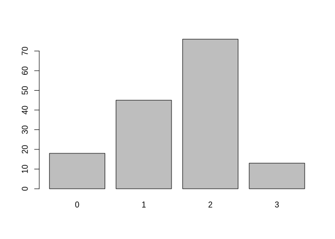<!-- -->

Number of age categories by study:

``` r
barplot(table(rowSums(catAgeConcerned)))
```

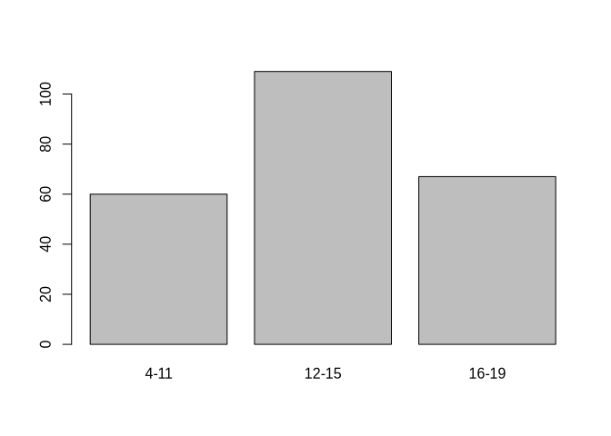<!-- -->

``` r
rangeByStudyText<-apply(catAgeConcerned,1,function(x,cat)paste(paste(cat[x],sep=""),collapse=", "),cat=colnames(catAgeConcerned))
popTot<-mapply(function(a,b)
  {
    if(is.na(a)){return(NA)}
    if(a=="Students"){return(paste0("Students (",ifelse(b=="","no age information",b),")"))}else{return(as.character(a))}
  },pop,rangeByStudyText)
par(mar=c(12,4,1,1))
unique(popTot)
```

    ##  [1] "Teachers"                      "Students (12-15, 16-19)"      
    ##  [3] "Students (12-15)"              "Students (4-11, 12-15)"       
    ##  [5] "Students (4-11)"               "Students (4-11, 12-15, 16-19)"
    ##  [7] "Pre-service teachers"          NA                             
    ##  [9] "Students (no age information)" "Students (16-19)"             
    ## [11] "Parents"

``` r
popTot<-factor(popTot,
               levels=c("Students (4-11)",
                        "Students (4-11, 12-15)",
                        "Students (4-11, 12-15, 16-19)",
                        "Students (12-15)",
                        "Students (12-15, 16-19)",
                        "Students (16-19)",
                        "Students (no age information)",
                        "Teachers",
                        "Pre-service teachers",
                        "Parents"
                        ),
               labels=c("Students (4-11)",
                        "Students (4-15)",
                        "Students (4-19)",
                        "Students (12-15)",
                        "Students (12-19)",
                        "Students (16-19)",
                        "Students (no age information)",
                        "Teachers",
                        "Pre-service teachers",
                        "Parents"
                        ))
barplot(table(popTot,useNA = "ifany"),las=2)
```

<!-- -->

``` r
catAgeConcerned_df<- data.frame(
  id=extract$id,
  idRow=rownames(extract),
  catAgeConcerned
)
```

``` r
catAgeConcerned<-cbind(catAgeConcerned,`No age information`=(apply(catAgeConcerned,1,sum)==0))
w_age<-which(catAgeConcerned,arr.ind=T)
AgeByRow<-data.frame(
  idRow=w_age[,"row"],
  ageCat=colnames(catAgeConcerned)[w_age[,"col"]]
)
```

# 7 Controversy

``` r
table(extract$Controversy,useNA="always")
```

    ## 
    ##   no   No   NO  no   yes  Yes <NA> 
    ##   30   81    4    1    6   30    0

``` r
extract$controv_clean<-NA
extract$controv_clean[grep("no",extract$Controversy,ignore.case=T)]<-"No"
extract$controv_clean[grep("yes",extract$Controversy,ignore.case=T)]<-"Yes"
#extract[c("controv_clean","Controversy")]
table(extract$controv_clean,useNA="ifany")
```

    ## 
    ##  No Yes 
    ## 116  36

``` r
controvByDoc<-tapply(extract$controv_clean,extract$id,function(x)
  {
    if(any(na.omit(x)=="Yes")){return("Yes")}else if(any(na.omit(x)=="No")){return("No")}else{return(NA)}
  })
(A<-table(countryDoc[names(controvByDoc)],factor(controvByDoc,levels=c("No","Yes")),useNA="ifany"))
```

    ##                           
    ##                            No Yes
    ##   Australia                 3   0
    ##   Austria                   5   1
    ##   Bangladesh                1   0
    ##   Belgium                   0   1
    ##   Brazil                    2   0
    ##   Canada                    5   0
    ##   China                     4   0
    ##   Czechia                   1   0
    ##   Denmark                   2   0
    ##   Finland                   2   1
    ##   France                    1   0
    ##   Germany                   6   1
    ##   Greece                    1   0
    ##   Indonesia                 3   0
    ##   Italy                     1   2
    ##   Japan                     1   0
    ##   Malaysia                  3   0
    ##   Mexico                    1   0
    ##   Multiple                  6   3
    ##   New Zealand               1   0
    ##   Norway                    2   0
    ##   Portugal                  1   0
    ##   Singapore                 0   1
    ##   South Africa              3   0
    ##   South Korea               1   0
    ##   Spain                     2   0
    ##   Sweden                    1   0
    ##   Switzerland               1   0
    ##   Taiwan                    1   0
    ##   Thailand                  2   0
    ##   Turkey                   10   0
    ##   United Kingdom            4   0
    ##   United States of America 35  24

``` r
(PercentageControversy<-A[,2]/rowSums(A))
```

    ##                Australia                  Austria               Bangladesh 
    ##                0.0000000                0.1666667                0.0000000 
    ##                  Belgium                   Brazil                   Canada 
    ##                1.0000000                0.0000000                0.0000000 
    ##                    China                  Czechia                  Denmark 
    ##                0.0000000                0.0000000                0.0000000 
    ##                  Finland                   France                  Germany 
    ##                0.3333333                0.0000000                0.1428571 
    ##                   Greece                Indonesia                    Italy 
    ##                0.0000000                0.0000000                0.6666667 
    ##                    Japan                 Malaysia                   Mexico 
    ##                0.0000000                0.0000000                0.0000000 
    ##                 Multiple              New Zealand                   Norway 
    ##                0.3333333                0.0000000                0.0000000 
    ##                 Portugal                Singapore             South Africa 
    ##                0.0000000                1.0000000                0.0000000 
    ##              South Korea                    Spain                   Sweden 
    ##                0.0000000                0.0000000                0.0000000 
    ##              Switzerland                   Taiwan                 Thailand 
    ##                0.0000000                0.0000000                0.0000000 
    ##                   Turkey           United Kingdom United States of America 
    ##                0.0000000                0.0000000                0.4067797

``` r
barplot(PercentageControversy,las=2)
```

<!-- -->

``` r
sum(controvByDoc=="Yes"&countryDoc[names(controvByDoc)]=="United States of America",na.rm = T)/sum(controvByDoc=="Yes",na.rm=T)
```

    ## [1] 0.7058824

``` r
sum(countryDoc[names(controvByDoc)]=="United States of America",na.rm=T)/length(countryDoc)
```

    ## [1] 0.4041096

``` r
sum(controvByDoc=="Yes"&countryDoc[names(controvByDoc)]=="United States of America",na.rm = T)/sum(countryDoc[names(controvByDoc)]=="United States of America",na.rm=T)
```

    ## [1] 0.4067797

``` r
par(mar=c(11,4,1,1))
barplot(t(A[order(A[,2],A[,1],decreasing=T),1:2]),beside=T,col=c("blue","red"),las=2,legend=T,args.legend = list(title="Controversy"),ylab="Number of documents")
```

<!-- -->

**Calculations for text**

``` r
A["United States of America","Yes"]/sum(A[,"Yes"])
```

    ## [1] 0.7058824

``` r
sum(A["United States of America",])/sum(A)
```

    ## [1] 0.4041096

``` r
A["United States of America",]/sum(A["United States of America",])
```

    ##        No       Yes 
    ## 0.5932203 0.4067797

``` r
A[as.logical(A[,"Yes"]),]
```

    ##                           
    ##                            No Yes
    ##   Austria                   5   1
    ##   Belgium                   0   1
    ##   Finland                   2   1
    ##   Germany                   6   1
    ##   Italy                     1   2
    ##   Multiple                  6   3
    ##   Singapore                 0   1
    ##   United States of America 35  24

``` r
docMultipleCountries <- names(countryDoc)[countryDoc=="Multiple"]
countriesMultipleCountries<-countryStudy[countryStudy$id %in% docMultipleCountries,]
kbl(data.frame(
  controversy=controvByDoc[docMultipleCountries],
  countries=tapply(countriesMultipleCountries$country,countriesMultipleCountries$id,paste,collapse=", ")[docMultipleCountries],
  row.names = docMultipleCountries
))
```

<table>

<thead>

<tr>

<th style="text-align:left;">

</th>

<th style="text-align:left;">

controversy
</th>

<th style="text-align:left;">

countries
</th>

</tr>

</thead>

<tbody>

<tr>

<td style="text-align:left;">

Arya2016
</td>

<td style="text-align:left;">

Yes
</td>

<td style="text-align:left;">

United States, China, New Zealand, Norway
</td>

</tr>

<tr>

<td style="text-align:left;">

Choi2021
</td>

<td style="text-align:left;">

Yes
</td>

<td style="text-align:left;">

South Korea, Australia
</td>

</tr>

<tr>

<td style="text-align:left;">

Deisenrieder2020
</td>

<td style="text-align:left;">

No
</td>

<td style="text-align:left;">

Germany, Austria
</td>

</tr>

<tr>

<td style="text-align:left;">

Gladwin2022
</td>

<td style="text-align:left;">

No
</td>

<td style="text-align:left;">

Brazil, Canada, Colombia, Costa Rica, Finland, Ghana, India, Indonesia,
Kenya, Kuwait, Nigeria, Oman, Peru, Philippines, Poland, Slovenia, South
Korea, Uganda
</td>

</tr>

<tr>

<td style="text-align:left;">

Harker_Schuch2013
</td>

<td style="text-align:left;">

Yes
</td>

<td style="text-align:left;">

Austria, Denmark
</td>

</tr>

<tr>

<td style="text-align:left;">

Harker_Schuch2020
</td>

<td style="text-align:left;">

No
</td>

<td style="text-align:left;">

Austria, Australia
</td>

</tr>

<tr>

<td style="text-align:left;">

Leitao2022
</td>

<td style="text-align:left;">

No
</td>

<td style="text-align:left;">

United Kingdom, Portugal
</td>

</tr>

<tr>

<td style="text-align:left;">

Levrini2021
</td>

<td style="text-align:left;">

No
</td>

<td style="text-align:left;">

Italy, Finland, Iceland
</td>

</tr>

<tr>

<td style="text-align:left;">

Miller2015
</td>

<td style="text-align:left;">

No
</td>

<td style="text-align:left;">

Greenland, Denmark, United States
</td>

</tr>

</tbody>

</table>

# 8 Mitigation/Adaptation

``` r
table(extract$`Final.mitigation/adaptation`,useNA = 'always')/sum(table(extract$`Final.mitigation/adaptation`,useNA = 'always'))
```

    ## 
    ## Adaptation       Both Mitigation    Neither       <NA> 
    ## 0.03289474 0.27631579 0.63815789 0.03947368 0.01315789

``` r
barplot(table(factor(extract$`Final.mitigation/adaptation`,levels=c("Mitigation","Adaptation","Both","Neither"))),ylab="Number of documents")
```

<!-- -->

Over time

``` r
mitadapPaper<-tapply(extract$`Final.mitigation/adaptation`,extract$id,function(x)
{
  if("Both"%in%x)return("Both")
  if(length(unique(x))>1){stop()}
  if(is.na(unique(x))){return("Neither")}
  return(unique(x))
}
  )
mitadapPaper<-mitadapPaper[names(yearPaper)]
t_ma_year<-table(mitadapPaper,yearPaper)
barplot(t_ma_year,beside=T,legend=T,col=c("red","orange","blue","black"),args.legend = list(x="topleft"))
```

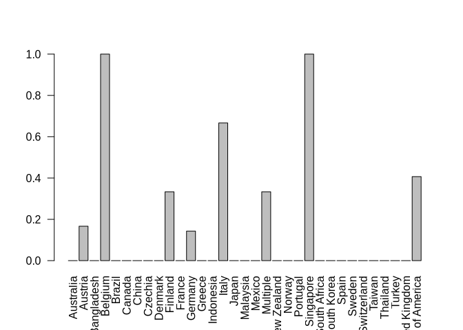<!-- -->

``` r
plot(colSums(t_ma_year[c("Adaptation","Both"),])/colSums(t_ma_year)~as.numeric(colnames(t_ma_year)))
```

<!-- -->

``` r
mitadapPaper
```

    ##           Akaygun2021   Aksel_Stenberdt2023             Aksut2016 
    ##          "Mitigation"          "Mitigation"          "Mitigation" 
    ##              Arya2016             Baker2013             Bentz2020 
    ##          "Mitigation"                "Both"          "Mitigation" 
    ##      Bhattacharya2021             Blaum2017            Bodzin2014 
    ##             "Neither"          "Mitigation"          "Mitigation" 
    ##        Bofferding2015              Boon2016          Bozdogan2011 
    ##                "Both"                "Both"          "Mitigation" 
    ##           Breslyn2019           Cebesoy2019           Cebesoy2022 
    ##          "Mitigation"                "Both"             "Neither" 
    ##             Chang2018        Chattuchai2015              Chin2016 
    ##          "Mitigation"          "Mitigation"          "Mitigation" 
    ##              Choi2021             Cibik2022          da_Rocha2020 
    ##                "Both"                "Both"                "Both" 
    ##              Dal2015a      Deisenrieder2020          DeWaters2014 
    ##                "Both"          "Mitigation"                "Both" 
    ##           Dormody2020           Dormody2021            Drewes2018 
    ##                "Both"                "Both"                "Both" 
    ##            Eggert2017             Faria2015        Feierabend2012 
    ##          "Mitigation"                "Both"             "Neither" 
    ## Feldpausch_Parker2013             Flora2014           Gladwin2022 
    ##          "Mitigation"          "Mitigation"          "Mitigation" 
    ##             Gold2015a            Goulah2017         Gutierrez2022 
    ##          "Mitigation"                "Both"          "Mitigation" 
    ##     Harker_Schuch2013     Harker_Schuch2020           Herrick2022 
    ##                "Both"          "Mitigation"          "Mitigation" 
    ##          Holthuis2014                Hu2016          Jacobson2017 
    ##                "Both"          "Mitigation"          "Mitigation" 
    ##               Jin2013             Jones2021             Kabir2015 
    ##             "Neither"                "Both"                "Both" 
    ##        Karpudewan2015       Karpudewan2015a        Karpudewan2017 
    ##          "Mitigation"          "Mitigation"          "Mitigation" 
    ##            Keller2019              Kern2017            Khadka2021 
    ##                "Both"          "Mitigation"          "Mitigation" 
    ##            Kinsey2012        Klosterman2010          Kolenaty2022 
    ##                "Both"          "Mitigation"                "Both" 
    ##           Korfgen2017          Korsager2015           Kubisch2022 
    ##                "Both"                "Both"          "Mitigation" 
    ##             Kumar2023           Lambert2012           Lambert2013 
    ##                "Both"                "Both"          "Mitigation" 
    ##           Lawson2019a            Leckey2021            Leitao2022 
    ##                "Both"                "Both"          "Mitigation" 
    ##            Lester2006           Levrini2021                Li2022 
    ##          "Mitigation"                "Both"          "Adaptation" 
    ##          Littrell2022               Liu2015          Lombardi2013 
    ##                "Both"          "Mitigation"          "Mitigation" 
    ##            Lozano2022         Markowitz2018             Mason1998 
    ##          "Mitigation"          "Mitigation"          "Mitigation" 
    ##           McGowan2022           McNeal2014a           McNeill2012 
    ##          "Mitigation"          "Mitigation"          "Mitigation" 
    ##              Meya2018            Miller2015            Monroe2016 
    ##                "Both"             "Neither"          "Mitigation" 
    ##            Muller2021           Muller2021a           Nafisah2022 
    ##          "Mitigation"                "Both"          "Mitigation" 
    ##          Nakamura2019 Nicholas_Figueroa2017            Nkoana2020 
    ##          "Mitigation"                "Both"                "Both" 
    ##          Nussbaum2015          Oberauer2023            Parant2017 
    ##                "Both"                "Both"          "Mitigation" 
    ##              Park2020             Parth2020             Pekel2019 
    ##          "Mitigation"          "Mitigation"             "Neither" 
    ##          Petersen2020            Porter2012           Pruneau2003 
    ##          "Mitigation"          "Mitigation"          "Mitigation" 
    ##           Pruneau2006          Pruneau2006a           Puttick2018 
    ##          "Mitigation"          "Mitigation"          "Mitigation" 
    ##              Raes2016           Ratinen2013         Reinfried2012 
    ##          "Mitigation"             "Neither"          "Mitigation" 
    ##            Roscoe2013      Roychoudhury2017            Ruboon2012 
    ##          "Mitigation"          "Mitigation"          "Mitigation" 
    ##       Salas_Rueda2021         Salsabila2019           Saribaş2016 
    ##          "Mitigation"          "Mitigation"          "Mitigation" 
    ##           Schrot2021a        Schubatzky2022          Schuster2008 
    ##                "Both"          "Mitigation"          "Mitigation" 
    ##          Sellmann2013         Sellmann2013a          Sellmann2015 
    ##          "Mitigation"          "Mitigation"          "Mitigation" 
    ##              Shea2016           Siegner2018             Silva2021 
    ##          "Mitigation"                "Both"          "Adaptation" 
    ##            Skains2022             Smith2019        Steffensen2022 
    ##          "Mitigation"          "Mitigation"          "Mitigation" 
    ##          Sternang2012         Stevenson2018        Stevenson2018a 
    ##          "Mitigation"          "Mitigation"                "Both" 
    ##           Sukardi2022           Sumrall2021          Sundberg2013 
    ##          "Mitigation"          "Mitigation"          "Mitigation" 
    ##            Sutela2023            Svihla2012             Taber2009 
    ##          "Mitigation"          "Mitigation"          "Mitigation" 
    ##          Tasquier2015          Tasquier2017             Tasti2021 
    ##          "Mitigation"          "Mitigation"                "Both" 
    ##            Taylor2020             Trott2019            Trott2020a 
    ##          "Mitigation"          "Mitigation"          "Mitigation" 
    ##            Trott2020b             Trott2022             Varma2012 
    ##          "Mitigation"          "Mitigation"          "Mitigation" 
    ##       Veijalainen2013           Vicente2020       Visintainer2015 
    ##          "Mitigation"                "Both"          "Mitigation" 
    ##             Walsh2018             Walsh2019              Wang2022 
    ##          "Mitigation"          "Mitigation"          "Mitigation" 
    ##             White2022          Williams2017               Xie2014 
    ##             "Neither"          "Adaptation"          "Mitigation" 
    ##             Zhong2021        Zografakis2008 
    ##          "Adaptation"          "Mitigation"

``` r
mitadapPaper<-mitadapPaper[names(incomeDoc)]
t_ma_inc<-table(mitadapPaper,incomeDoc)
barplot(t_ma_inc,beside=T,legend=T,col=c("red","orange","blue","black"),args.legend = list(x="topright"))
```

<!-- -->

``` r
colSums(t_ma_inc[c("Adaptation","Both"),])/colSums(t_ma_inc)
```

    ##           High Middle to high  Middle to low 
    ##      0.2869565      0.4000000      0.2500000

# 9 Disciplines

``` r
par(mar=c(8,4,1,1))
sort(table(extract$Disciplin_2))
```

    ## 
    ##            Other  Social Sciences          Science  Social sciences 
    ##                1                1                2                2 
    ##            STEAM        Education             STEM            Mixed 
    ##                2                3                8               16 
    ##              NA  Natural Sciences 
    ##               18               72

``` r
disciplineClean<- extract$Disciplin_2
disciplineClean[grepl("^Social",extract$Disciplin_2)]<-"Social Sciences"
disciplineClean[grepl("STEAM",extract$Disciplin_2)]<-"Mixed"
disciplineClean[grepl("NA",extract$Disciplin_2)|is.na(extract$Disciplin_2)]<-"ND"
barplot(sort(table(disciplineClean),decreasing=T), las=2)
```

<!-- -->

# 10 Luisa’s thematic groups

``` r
barplot(colSums(extract[c("NATURAL.SCIENCE","SUSTAINABILITY.AND.HUMAN.BEHAVIOR","EXTREME.EVENTS")],na.rm=T))
```

<!-- -->

``` r
themes <- extract[,c("NATURAL.SCIENCE","SUSTAINABILITY.AND.HUMAN.BEHAVIOR","EXTREME.EVENTS")]
colnames(themes)<-c("Natural sciences", "Sustainability, human behavior","Extreme events")
themes[which(is.na(themes),arr.ind = T)]<-F
mode(themes[[1]])<-"logical"
mode(themes[[2]])<-"logical"
mode(themes[[3]])<-"logical"
```

# 11 Educational framework

We’ve got a problem, most of the extracted papers just do not have the
information:

``` r
edFrameNb<-table(extract$`Normative.Climate.Change.EDUCATIONAL.framework.(global/local)`,useNA="ifany")
edFrameNb<-edFrameNb[order(edFrameNb,decreasing=T)]

tabEdFrame<-data.frame(
    EducationalFramework=names(edFrameNb),
    nb=as.numeric(edFrameNb),
    ids=sapply(names(edFrameNb),function(x,tab)paste(na.omit(tab$id[tab$`Normative.Climate.Change.EDUCATIONAL.framework.(global/local)`==x]),collapse=", "), tab=extract)
  ,row.names = NULL)
tabEdFrame[is.na(tabEdFrame$EducationalFramework),3]<-paste(extract$id[is.na(extract$`Normative.Climate.Change.EDUCATIONAL.framework.(global/local)`)],collapse=", ")
kable(tabEdFrame)
```

| EducationalFramework | nb | ids |
|:---|---:|:---|
| NA | 50 | Korfgen2017, Nicholas_Figueroa2017, Williams2017, Chang2018, Reinfried2012, Raes2016, Sutela2023, Baker2013, Cebesoy2019, Dormody2020, Harker_Schuch2020, Holthuis2014, Kinsey2012, Klosterman2010, Lambert2012, Lambert2013, Littrell2022, Lombardi2013, Markowitz2018, McGowan2022, Pekel2019, Petersen2020, Puttick2018, Salas_Rueda2021, Schubatzky2022, Sellmann2013, Shea2016, Steffensen2022, Sternang2012, Stevenson2018a, Taber2009, Varma2012, Feldpausch_Parker2013, Mason1998, Roscoe2013, Saribaş2016, Trott2019, Trott2022, Zhong2021, Harker_Schuch2013, Kolenaty2022, Kumar2023, Sellmann2013a, Skains2022, Bentz2020, Xie2014, Xie2014, Nussbaum2015, Stevenson2018, Sukardi2022 |
| Local | 34 | Visintainer2015, Vicente2020, Nafisah2022, Kern2017, Chin2016, Drewes2018, Drewes2018, Gold2015a, Herrick2022, Jin2013, Jones2021, Karpudewan2015, Leitao2022, Lozano2022, McNeill2012, Smith2019, Walsh2018, White2022, Li2022, Li2022, Pruneau2003, Salsabila2019, Sumrall2021, Trott2020b, Parth2020, Pruneau2006a, Deisenrieder2020, Flora2014, Leckey2021, Park2020, Taylor2020, Trott2020a, Eggert2017, Pruneau2006 |
| local | 13 | Faria2015, Faria2015, Bofferding2015, Breslyn2019, Dormody2021, Feierabend2012, Lester2006, Nakamura2019, Ratinen2013, Bozdogan2011, Liu2015, Goulah2017, Sellmann2015 |
| global | 12 | Aksel_Stenberdt2023, Aksut2016, Arya2016, Bhattacharya2021, Choi2021, Khadka2021, Monroe2016, Parant2017, Roychoudhury2017, Veijalainen2013, Meya2018, Gutierrez2022 |
| Global | 11 | da_Rocha2020, Kubisch2022, Cebesoy2022, Wang2022, Tasquier2017, Zografakis2008, Zografakis2008, Schrot2021a, Gladwin2022, Miller2015, Tasquier2015 |
| National | 4 | Jacobson2017, Walsh2019, Silva2021, Svihla2012 |
| both | 2 | DeWaters2014, Porter2012 |
| Both | 2 | Sundberg2013, Lawson2019a |
| Local and global | 2 | Karpudewan2015a, Ruboon2012 |
| Local/Global | 2 | Karpudewan2017, Korsager2015 |
| 2008 United Nations Children’s Fund (UNICEF) report and United Nations Educational, Scientific and Cultural Organization (UNESCO) | 1 | Muller2021a |
| Climate and Energy Awareness Network |  |  |

(CLEAN) Geography education standards project, 1994 \| 1\|McNeal2014a \|
\|Critical pegagogy \| 1\|Siegner2018 \| \|Education for Climate Action
(EfCA) \| 1\|Cibik2022 \| \|European \| 1\|Levrini2021 \| \|GEMS (Great
Explorations in Math and Science) curriculum (Hocking et al., 1990) \|
1\|Schuster2008 \| \|global \| 1\|Chattuchai2015 \| \|Global and Local
\| 1\|Nkoana2020 \| \|global; local \| 1\|Boon2016 \| \|Global/European
\| 1\|Akaygun2021 \| \|Global/local \| 1\|Lawson2019a \| \|Global/Local
\| 1\|Keller2019 \| \|In 2008 the South East Asia Regional Office of the
World Health Organization (WHO) developed a manual for school children
to promote a child-centred approach to achieve a lifestyle adaptation
for reducing the health vulnerability. \| 1\|Kabir2015 \| \|local \|
1\|Oberauer2023 \| \|Local \| 1\|Blaum2017 \| \|Local, European \|
1\|Tasti2021 \| \|NA local \| 1\|Dal2015a \| \|This is a chinese
programme, but no real educational framework is mentionned \| 1\|Hu2016
\| \|Unesco, Unicef, ESD \| 1\|Muller2021 \| \|US science education
curriculum frameworks \| 1\|Bodzin2014 \|

# 12 Monroe categories

How many include “5:target climate science misconceptions”:

``` r
sum(grepl("5",extract$`Monroe.categories.(ONLY.1,2,3,4,5,6,7)`))
```

    ## [1] 39

Which:

``` r
extract$id[grepl("5",extract$`Monroe.categories.(ONLY.1,2,3,4,5,6,7)`)]
```

    ##  [1] "da_Rocha2020"      "Reinfried2012"     "Kern2017"         
    ##  [4] "Akaygun2021"       "Bhattacharya2021"  "Bodzin2014"       
    ##  [7] "Cebesoy2019"       "Drewes2018"        "Drewes2018"       
    ## [10] "Gold2015a"         "Harker_Schuch2020" "Jin2013"          
    ## [13] "Kabir2015"         "Karpudewan2015a"   "Lambert2013"      
    ## [16] "Lawson2019a"       "Lawson2019a"       "Littrell2022"     
    ## [19] "Markowitz2018"     "McGowan2022"       "McNeal2014a"      
    ## [22] "McNeill2012"       "Pekel2019"         "Schubatzky2022"   
    ## [25] "Smith2019"         "Walsh2018"         "White2022"        
    ## [28] "Pruneau2003"       "Harker_Schuch2013" "Sellmann2013a"    
    ## [31] "Tasquier2017"      "Ratinen2013"       "Silva2021"        
    ## [34] "Taylor2020"        "Gutierrez2022"     "Nussbaum2015"     
    ## [37] "Sellmann2015"      "Svihla2012"        "Tasquier2015"

# 13 Theoretical framework

``` r
#sort(table(extract$`Theoretical.framework.(big.categories)`))
clean<-function(x)
{
  if(grepl("^ *$",x)){x<-NA}
  x<-gsub("^ +","",x)
  x<-gsub(" +$","",x)
  x<-gsub("^([a-z])","\\U\\1",x,perl=T)
  return(x)
}
extract$`Theoretical.framework.(big.categories)`<-gsub("^ ","",gsub(" $","",gsub("^([a-zA-Z])(.*)","\\U\\1\\L\\2",extract$`Theoretical.framework.(big.categories)`,perl=T),perl=T),perl=T)
listTheoBack<-lapply(strsplit(extract$`Theoretical.framework.(big.categories)`,"[,;]"),sapply,clean)
tabTheoBack<-data.frame(
  idRow=rep(rownames(extract),sapply(listTheoBack,length)),
  id=rep(extract$id,sapply(listTheoBack,length)),
           theoBack=unlist(listTheoBack)
           )
#Temporary plot
forTempPlot<-table(tabTheoBack$theoBack)
forTempPlot<-forTempPlot[order(forTempPlot,decreasing=T)]
#other<-(forTempPlot[6:nrow(forTempPlot)])
#forTempPlot<-forTempPlot[1:5]
#forTempPlot<-c(forTempPlot,other)
par(mar=c(15,4,1,1))
bp<-barplot(forTempPlot,las=2, ylab="Number of studies")
```

<!-- -->

``` r
#legend("topright",density=18,"consistent with")
#text(bp[round(nrow(forTempPlot)/4)+1],max(forTempPlot)-5,paste("To evaluate:",sum(is.na(tabTheoBack$theoBack))))

kable(sort(table(tabTheoBack$theoBack),decreasing=T))
```

| Var1                              | Freq |
|:----------------------------------|-----:|
| Learner centered approach         |   63 |
| Alternative                       |   35 |
| Teacher centered approach         |   22 |
| Professional development workshop |   18 |
| Promoting social awareness        |   10 |

## 13.1 Comparison with population

``` r
par(mar=c(15,4,1,1))
barplot(as.matrix(table(popTot,extract$`Theoretical.framework.(big.categories)`)),col=rainbow(nlevels(popTot)), las=2, legend=T)
```

<!-- -->

``` r
kable(as.matrix(table(popTot,extract$`Theoretical.framework.(big.categories)`,useNA="ifany")))
```

|  | Alternative | Learner centered approach | Professional development workshop | Promoting social awareness | Teacher centered approach | NA |
|----|---:|---:|---:|---:|---:|---:|
| Students (4-11) | 2 | 6 | 0 | 0 | 0 | 0 |
| Students (4-15) | 8 | 13 | 0 | 2 | 5 | 1 |
| Students (4-19) | 1 | 5 | 0 | 1 | 3 | 0 |
| Students (12-15) | 3 | 12 | 0 | 2 | 2 | 0 |
| Students (12-19) | 11 | 17 | 0 | 4 | 3 | 2 |
| Students (16-19) | 4 | 5 | 0 | 0 | 5 | 0 |
| Students (no age information) | 0 | 1 | 0 | 1 | 0 | 0 |
| Teachers | 1 | 2 | 11 | 0 | 2 | 1 |
| Pre-service teachers | 0 | 2 | 7 | 0 | 0 | 0 |
| Parents | 4 | 0 | 0 | 0 | 1 | 0 |
| NA | 1 | 0 | 0 | 0 | 1 | 0 |

## 13.2 Comparison with pedagogical tools

``` r
par(mar=c(15,4,1,1))
extract$Categories.type.of.intervention<-factor(extract$Categories.type.of.intervention)
barplot(table(extract$Categories.type.of.intervention,extract$`Theoretical.framework.(big.categories)`),col=rainbow(nlevels(extract$Categories.type.of.intervention)),las=2,legend=T)
```

<!-- -->

# 14 Methods & design

## 14.1 Quanti/Quali

``` r
sort(table(extract$study.type),decreasing = T)
```

    ## 
    ##  Quantitative  quantitative   Qualitative          Both         Mixed 
    ##            36            33            32            19            12 
    ##         mixed   qualitative          both  qualitative  quantitative  
    ##             5             5             4             4             2

``` r
extract$QuantQualClean<-NA
extract$QuantQualClean[grep("quantitative",ignore.case = T, extract$study.type)]<-"Quantitative"
extract$QuantQualClean[grep("qualitative",ignore.case = T, extract$study.type)]<-"Qualitative"
extract$QuantQualClean[grepl("mixed",ignore.case = T, extract$study.type) | grepl("both",ignore.case = T, extract$study.type)]<-"Both/Mixed"
sort(table(extract$QuantQualClean,useNA = "ifany"),decreasing = T)
```

    ## 
    ## Quantitative  Qualitative   Both/Mixed 
    ##           71           41           40

``` r
barplot(sort(table(extract$QuantQualClean),decreasing = T))
```

<!-- -->

``` r
require(sqldf)
```

    ## Loading required package: sqldf

    ## Loading required package: gsubfn

    ## Loading required package: proto

    ## Loading required package: RSQLite

``` r
extract$MethTypeClean<-NA
extract$MethTypeClean[grep("[Ii]nferential", extract$MethType)]<-"Inferential"
extract$MethTypeClean[grep("[Dd]escriptive", extract$MethType)]<-"Descriptive"

(res<-sqldf("SELECT QuantQualClean, MethTypeClean, count(*) nbStud, count(DISTINCT id) nbPaper
      FROM extract
      GROUP BY QuantQualClean, MethTypeClean"))
```

    ##   QuantQualClean MethTypeClean nbStud nbPaper
    ## 1     Both/Mixed   Descriptive      7       7
    ## 2     Both/Mixed   Inferential     33      33
    ## 3    Qualitative          <NA>     36      36
    ## 4    Qualitative   Inferential      5       5
    ## 5   Quantitative   Descriptive      3       3
    ## 6   Quantitative   Inferential     68      63

``` r
res$propPaper<-res$nbPaper/length(unique(extract$id))
```

## 14.2 Pre-post

``` r
table(extract$`Pre/Post`)
```

    ## 
    ##     FALSE     Falso      FAUX        no        No      TRUE     TRUE  Verdadero 
    ##        27         1         1         1         1        98         1         4 
    ## VERDADERO      VRAI       yes       Yes       YES 
    ##         4        10         1         1         1

``` r
extract$`Pre/Post`<-(grepl("true",extract$`Pre/Post`, ignore.case = T) | grepl("verdadero",extract$`Pre/Post`, ignore.case = T) | grepl("vrai",extract$`Pre/Post`, ignore.case = T) | grepl("yes",extract$`Pre/Post`, ignore.case = T))
(tabMetodosAnalyses <- table(extract$`Pre/Post`,extract$QuantQualClean,useNA="ifany"))
```

    ##        
    ##         Both/Mixed Qualitative Quantitative
    ##   FALSE          5          23            4
    ##   TRUE          35          18           67

``` r
colSums(tabMetodosAnalyses)/sum(tabMetodosAnalyses)
```

    ##   Both/Mixed  Qualitative Quantitative 
    ##    0.2631579    0.2697368    0.4671053

``` r
barplot(table(extract$`Pre/Post`,extract$QuantQualClean,useNA="ifany"), legend=T,args.legend = list(x="topleft",title="Pre/post"))
```

<!-- -->

``` r
A<-sort(table(extract$design),decreasing=T)
names(A)[nchar(names(A))>40]<-paste(substr(names(A)[nchar(names(A))>40],1,40),"...")
A
```

    ##                                     Pre-post 
    ##                                           84 
    ##                                     pre-post 
    ##                                            5 
    ##                                   Case study 
    ##                                            4 
    ##                           Pre-post + control 
    ##                                            4 
    ##                          Pre-post + control  
    ##                                            4 
    ##                            Pre-post + during 
    ##                                            3 
    ##                          Pre -post + control 
    ##                                            2 
    ##                                    Pre-post  
    ##                                            2 
    ##                  Pre-post + control + factor 
    ##                                            2 
    ##                            Pre-post + factor 
    ##                                            2 
    ## 2 (methodology: problem-based learning,  ... 
    ##                                            1 
    ##                              Action research 
    ##                                            1 
    ##               Case study, quasi-experimental 
    ##                                            1 
    ##                               cluster random 
    ##                                            1 
    ##            Computational behavioral patterns 
    ##                                            1 
    ##                                Correlational 
    ##                                            1 
    ##                                 Critical PAR 
    ##                                            1 
    ##                        Cross-sectional study 
    ##                                            1 
    ## Descriptive, follows students improvemen ... 
    ##                                            1 
    ## Design was different for each of the 3 o ... 
    ##                                            1 
    ##                           Discourse analysis 
    ##                                            1 
    ## Discourse analysis/Qualitative interpret ... 
    ##                                            1 
    ##                           Ethnographic study 
    ##                                            1 
    ## Experiment --- The experiment used a 2 D ... 
    ##                                            1 
    ##                             Factorial design 
    ##                                            1 
    ##                  Factorial design, only post 
    ##                                            1 
    ##                                 Longitudinal 
    ##                                            1 
    ##                        Mathematical modeling 
    ##                                            1 
    ##                       Mixed-methods research 
    ##                                            1 
    ## Multi-level assessment design with pre-p ... 
    ##                                            1 
    ## Music composing project. Not describe a  ... 
    ##                                            1 
    ## Observational study (they made a compari ... 
    ##                                            1 
    ##                Participatory action research 
    ##                                            1 
    ##                                    pre-post  
    ##                                            1 
    ##                          Pre-post +  control 
    ##                                            1 
    ##                Pre-post + discourse analysis 
    ##                                            1 
    ##                            pre-post + factor 
    ##                                            1 
    ##                         Pre-post + interview 
    ##                                            1 
    ## Pre-post on activity 1, with additional  ... 
    ##                                            1 
    ##                 Pre-post with two iterations 
    ##                                            1 
    ##                             pre-post+ factor 
    ##                                            1 
    ##                  Pre/post quasi-experimental 
    ##                                            1 
    ## Qualitative analysis using concept maps  ... 
    ##                                            1 
    ## Qualitative analysis, pre- post- questio ... 
    ##                                            1 
    ##                     Qualitative case studies 
    ##                                            1 
    ##                           Quasi-experimental 
    ##                                            1 
    ## Quasi-experimental design involving expe ... 
    ##                                            1 
    ## Quasi-experimental design with controlle ... 
    ##                                            1 
    ## Randomized Control Trial with 2 experime ... 
    ##                                            1 
    ##         Systematic phenomenological analysis 
    ##                                            1

``` r
extract$prepostClean<-NA
extract$`Pre/Post`[!extract$`Pre/Post`%in%c("TRUE","TRUE ","VRAI","verdadero","VERDADERO","Verdadero","Yes","yes","YES","FALSE","FALSO","FAUX","Falso","No","no")]
```

    ## logical(0)

``` r
extract$prepostClean[extract$`Pre/Post`%in%c("TRUE","TRUE ","VRAI","verdadero","VERDADERO","Verdadero","Yes","yes","YES")]<-T
extract$prepostClean[extract$`Pre/Post`%in%c("FALSE","FALSO","FAUX","Falso","No","no")]<-F

#table(extract$design[extract$prepostClean])
#table(extract$design[!extract$prepostClean])

#extract$design[grepl("pre ?-? ?post",extract$design,ignore.case = T)]
desPrePost<-grepl("pre ?-? ?post",extract$design,ignore.case = T)
pControl<-grepl("pre ?-? ?post",extract$design,ignore.case = T) & grepl("\\+",extract$design) & grepl("control",extract$design,ignore.case = T)
pFactor <-grepl("pre ?-? ?post",extract$design,ignore.case = T) & grepl("\\+",extract$design) & grepl("factor",extract$design,ignore.case = T)
pDuring <-grepl("pre ?-? ?post",extract$design,ignore.case = T) & grepl("\\+",extract$design) & grepl("during",extract$design,ignore.case = T)
designClean<-character(nrow(extract))
designClean[desPrePost &! pControl &! pFactor & !pDuring]<- "Pre-post"
designClean[desPrePost & pControl & !pFactor & !pDuring]<- "Pre-post + Control"
designClean[desPrePost & !pControl & pFactor & !pDuring]<- "Pre-post + Factor"
designClean[desPrePost & !pControl & !pFactor & pDuring]<- "Pre-post + During"
designClean[desPrePost & pControl & pFactor & !pDuring]<- "Pre-post + Factor + Control"
extract$design[desPrePost&designClean==""]
```

    ## character(0)

``` r
table(extract$design[!desPrePost])[table(extract$design[!desPrePost])>1]
```

    ## Case study 
    ##          4

``` r
designClean[designClean==""&grepl("case study",extract$design,ignore.case = T)]<-"Case study"
designClean[designClean==""&grepl("discourse analysis",extract$design,ignore.case = T)]<-"Discourse analysis"
designClean[designClean==""]<-"Other"
designClean<-factor(designClean,levels=c("Pre-post", "Pre-post + Control", "Pre-post + Factor", "Pre-post + Factor + Control", "Pre-post + During", "Case study",  "Discourse analysis", "Other"))
barplot(table(designClean),las=2)
```

<!-- -->

``` r
par(mfrow=c(1,2))
par(mar=c(11,4,1,1))
barplot(table(designClean),las=2)
barplot(sort(table(extract$QuantQualClean),decreasing = T),las=2)
```

<!-- -->

# 15 Characteristics of interventions

## 15.1 Pedagogical tools

### 15.1.1 From manuscript 1 text

``` r
par(mar=c(9,4,1,1))
barplot(c(
  `Lesson based`=40,
  `Combined strategy`=38,
  `Project based`=19,
  `Curriculum based`=15,
  `Technology/Virtual`=9,
  `Cultural based`=8,
  `Game based`=4
), las = 2
)
```

<!-- -->

### 15.1.2 From table

``` r
par(mar=c(14,4,1,1))
barplot(sort(table(extract$Categories.type.of.intervention),decreasing=T),las=2)
```

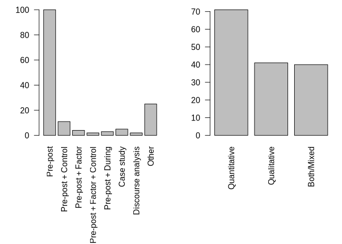<!-- -->

``` r
extract$Categories.type.of.intervention <- extract$Categories.type.of.intervention <-factor(extract$Categories.type.of.intervention, levels = names(sort(table(extract$Categories.type.of.intervention), decreasing=T)))
```

### 15.1.3 Over time

``` r
opar <- par(lwd = 0.4)
barplot(table(extract$Categories.type.of.intervention,factor(extract$datepubl,levels=min(extract$datepubl):max(extract$datepubl))),beside=T,col=rainbow(nlevels(extract$Categories.type.of.intervention)), legend=T, args.legend=list(x="topleft"), lwd=.1, cex.names=.8)
```

<!-- -->

## 15.2 Curricular/extracurricular

``` r
table(extract$`Curricular/Extracurricular`)
```

    ## 
    ##                                                                                                                                                     Curricular 
    ##                                                                                                                                                             76 
    ##                                                  Curricular[supported by teachers, it might even be part of the study plan, but that is not clear in the paper 
    ##                                                                                                                                                              1 
    ##                                                                                                                                   CurricularandExtracurricular 
    ##                                                                                                                                                              4 
    ##                                                                                                                                                Extracurricular 
    ##                                                                                                                                                             42 
    ## Extracurricular, but I have a doubt:"we introduced an educational programme for climate change that included inviting adolescents to communicate with seniors" 
    ##                                                                                                                                                              1 
    ##                                                                                                                        Portugal:Extracurricular\nUK:Curricular 
    ##                                                                                                                                                              1 
    ##                                                                                                                                        professionalDevelopment 
    ##                                                                                                                                                              2 
    ##                                                                                                                                        ProfessionalDevelopment 
    ##                                                                                                                                                             21

``` r
curExtraCur<-rep(NA,nrow(extract))
curExtraCur[extract$`Curricular/Extracurricular`%in%c("Curricular","Extracurricular")]<-extract$`Curricular/Extracurricular`[extract$`Curricular/Extracurricular`%in%c("Curricular","Extracurricular")]
curExtraCur[extract$`Curricular/Extracurricular`%in%c("CurricularandExtracurricular")] <- "Curricular/Extracurricular" 
curExtraCur[extract$`Curricular/Extracurricular`%in%c("ProfessionalDevelopment")] <- "Professional development" 
extract[c("Curricular/Extracurricular","id")][is.na(curExtraCur),][c(3,6,7),]
```

    ##                  Curricular/Extracurricular           id
    ## 56  Portugal:Extracurricular\nUK:Curricular   Leitao2022
    ## 111                                    <NA>    Parth2020
    ## 112                 professionalDevelopment Pruneau2006a

``` r
curExtraCur[extract$id=="Leitao2022"]<- c("Curricular/Extracurricular")
curExtraCur[extract$id=="Hu2016"]<-"Extracurricular"
curExtraCur[extract$id=="Korsager2015"]<-"Curricular"
par(mar=c(12,4,1,1))
barplot(table(curExtraCur,useNA="ifany"),las=2)
```

<!-- -->

## 15.3 Indoor/outdoor

``` r
extract$`Outdoor/Indoor/Both`<-gsub("^([a-zA-Z])(.*)$","\\U\\1\\L\\2",extract$`Outdoor/Indoor/Both`,perl=T)
table(extract$`Outdoor/Indoor/Both`,useNA="ifany")
```

    ## 
    ##    Both  Indoor Outdoor    <NA> 
    ##      38     105       7       2

# 16 Time variables

``` r
extract$Total.duration.of.the.intervention
```

    ##   [1] NA         "~35h"     "~14h"     "4h"       NA         "~60h"    
    ##   [7] NA         "30min"    NA         "12h30min" NA         NA        
    ##  [13] "1H15min"  NA         "3h40min"  "40h"      "12h"      "24min"   
    ##  [19] "60min"    "8h"       "6h"       NA         "~4h"      NA        
    ##  [25] "~10h"     "5h30min"  "8h30min"  "15h"      "8h"       "1h"      
    ##  [31] NA         NA         "5h"       "5h"       "60h"      NA        
    ##  [37] NA         "~7h"      "50min"    NA         NA         NA        
    ##  [43] NA         "~18h"     "~7h30min" "10h"      "12h"      NA        
    ##  [49] NA         "15h"      NA         "4h10min"  NA         NA        
    ##  [55] NA         "~1h30"    "24h"      "40h"      "1h30min"  "600min"  
    ##  [61] "~6h"      "~80h"     "9h or 7S" "~23h"     "2h45min"  "3D"      
    ##  [67] "4h10min"  "1h40min"  "4h"       "1h"       NA         "24h"     
    ##  [73] NA         NA         "2h30min"  NA         "~7h"      "64h"     
    ##  [79] NA         "2h"       "~2h"      "10min"    NA         "5h"      
    ##  [85] "6h"       "~40h"     NA         "~21h"     "~14h"     "45min"   
    ##  [91] "32H"      NA         NA         "40min"    "20h"      "~15h"    
    ##  [97] NA         NA         "~30h"     "20h"      "30h"      NA        
    ## [103] "15h"      NA         "1h"       NA         "~45min"   NA        
    ## [109] "2h30min"  "1h"       NA         "~42h"     "~8H"      "~6h"     
    ## [115] "~3h"      NA         NA         NA         "~40h"     "~21h"    
    ## [121] NA         "50min"    "150h"     "~50h"     NA         NA        
    ## [127] NA         "7h"       "15h"      NA         NA         "~20h"    
    ## [133] "~8h"      "~8h"      NA         "28h"      "~49h"     "6h"      
    ## [139] NA         "~35h"     "6h"       "1h"       NA         "~20h"    
    ## [145] NA         "50min"    NA         "~14h"     NA         NA        
    ## [151] "~10h"     "15h"

``` r
extract$Period.length
```

    ##   [1] "6M"       "5D"       "2D"       "~5D"      "5D"       "14D"     
    ##   [7] "7D"       "1H"       "1Y"       "2M"       NA         NA        
    ##  [13] "2H"       "3Y"       "1M"       "3M"       NA         "1H"      
    ##  [19] "2H"       "2M"       NA         "21D"      "2D"       "20D"     
    ##  [25] "~1M"      "14D"      "1Y"       "21D"      "1M"       "1H"      
    ##  [31] "2M"       "~21D"     "6D"       "~5M"      "1Y"       NA        
    ##  [37] NA         "1D"       "1H"       "2M"       "1Y"       "~1Y"     
    ##  [43] "1D"       "6M"       "1M7D"     "1M5D"     "1M14D"    "7D"      
    ##  [49] "1Y"       "20D"      "1Y"       "1M"       "4M"       "2Y"      
    ##  [55] "2Y"       "~2H"      "3M"       "7D"       "2D"       "10M"     
    ##  [61] "1M8D"     "2M14D"    "1M3W"     "~1M14D"   "1D"       NA        
    ##  [67] "5D"       "14D"      "14D"      "1H"       "14D"      "4D"      
    ##  [73] "2M21D"    NA         NA         NA         "1D"       "7D"      
    ##  [79] "10M"      "2H"       "2H"       "1H"       "2M"       "7D"      
    ##  [85] "~1D"      "1M14D"    "~2M"      "3D"       "2D"       "1H"      
    ##  [91] "4D"       "5M"       "5M"       "1H"       "10M"      "~1M"     
    ##  [97] NA         "~3M"      "7D"       "4D"       "1Y"       "3M13D"   
    ## [103] "4M"       "3M13D"    "14D"      NA         "1H"       "1Y"      
    ## [109] "~7M"      "1H"       "11M"      "16D"      "~8H"      "1M14D"   
    ## [115] NA         NA         "1Y"       "1Y"       "5M"       "3D"      
    ## [121] "1Y"       "1H"       "1Y"       "7D"       NA         "1Y"      
    ## [127] "1M20D"    "1M"       "5D"       "5M"       "3M"       "4M"      
    ## [133] "1D"       "1D"       "1Y"       "4M"       "7D"       NA        
    ## [139] "7M"       "49D"      "2M"       "2D"       "1M14D"    "1M"      
    ## [145] NA         "3D"       "2M"       "2D"       "6M"       NA        
    ## [151] "6 months" "1M7D"

``` r
extract$Number.of.sessions
```

    ##   [1] "6.0"  "10.0" "4.0"  "4.0"  NA     "~10"  NA     "1.0"  NA     "15.0"
    ##  [11] "4.0"  NA     "1.0"  NA     "4.0"  NA     "6.0"  "1.0"  "1.0"  "8.0" 
    ##  [21] "3.0"  "~15"  "2.0"  "20.0" "~15"  "2.0"  "5.0"  "5.0"  "4.0"  "1.0" 
    ##  [31] NA     NA     "6.0"  "5.0"  "~20"  NA     NA     "1.0"  "1.0"  NA    
    ##  [41] "3.0"  NA     NA     "24.0" "~5"   "5.0"  "6.0"  NA     NA     "7.0" 
    ##  [51] NA     "10.0" NA     NA     "~5"   "1.0"  "12.0" NA     "2.0"  "12.0"
    ##  [61] "3.0"  "5.0"  "7.0"  "11.0" "2.0"  "3.0"  "5.0"  "1.0"  "6.0"  "1.0" 
    ##  [71] "2.0"  "4.0"  NA     NA     "3.0"  NA     "1.0"  "~10"  NA     "1.0" 
    ##  [81] "1.0"  "1.0"  NA     "5.0"  "~1"   NA     NA     "~3"   "2.0"  "1.0" 
    ##  [91] "~4"   "~40"  "~40"  "1.0"  "10.0" "8.0"  "2.0"  NA     "~10"  "24.0"
    ## [101] "20.0" NA     "15.0" NA     "4.0"  NA     "~1"   NA     "5.0"  "1.0" 
    ## [111] NA     "6.0"  "1.0"  "6.0"  NA     "5.0"  NA     NA     "~40"  "6.0" 
    ## [121] NA     "1.0"  NA     "7.0"  NA     NA     NA     "3.0"  "5.0"  NA    
    ## [131] NA     "15.0" "1.0"  "1.0"  "2.0"  "14.0" "7.0"  "4.0"  NA     "~35" 
    ## [141] "3.0"  "2.0"  NA     "~10"  NA     "2.0"  NA     "2.0"  NA     "5.0" 
    ## [151] "5.0"  "5.0"

``` r
hist(as.integer(gsub("^~","",extract$Number.of.sessions)),main="",xlab="Number of sessions", ylab="Number of studies",nclass=50)
legend("topright",legend=paste(c("n="),c(sum(!is.na(extract$Number.of.sessions)))),bty = "n")
```

<!-- -->

``` r
extract$Total.duration.of.the.intervention
```

    ##   [1] NA         "~35h"     "~14h"     "4h"       NA         "~60h"    
    ##   [7] NA         "30min"    NA         "12h30min" NA         NA        
    ##  [13] "1H15min"  NA         "3h40min"  "40h"      "12h"      "24min"   
    ##  [19] "60min"    "8h"       "6h"       NA         "~4h"      NA        
    ##  [25] "~10h"     "5h30min"  "8h30min"  "15h"      "8h"       "1h"      
    ##  [31] NA         NA         "5h"       "5h"       "60h"      NA        
    ##  [37] NA         "~7h"      "50min"    NA         NA         NA        
    ##  [43] NA         "~18h"     "~7h30min" "10h"      "12h"      NA        
    ##  [49] NA         "15h"      NA         "4h10min"  NA         NA        
    ##  [55] NA         "~1h30"    "24h"      "40h"      "1h30min"  "600min"  
    ##  [61] "~6h"      "~80h"     "9h or 7S" "~23h"     "2h45min"  "3D"      
    ##  [67] "4h10min"  "1h40min"  "4h"       "1h"       NA         "24h"     
    ##  [73] NA         NA         "2h30min"  NA         "~7h"      "64h"     
    ##  [79] NA         "2h"       "~2h"      "10min"    NA         "5h"      
    ##  [85] "6h"       "~40h"     NA         "~21h"     "~14h"     "45min"   
    ##  [91] "32H"      NA         NA         "40min"    "20h"      "~15h"    
    ##  [97] NA         NA         "~30h"     "20h"      "30h"      NA        
    ## [103] "15h"      NA         "1h"       NA         "~45min"   NA        
    ## [109] "2h30min"  "1h"       NA         "~42h"     "~8H"      "~6h"     
    ## [115] "~3h"      NA         NA         NA         "~40h"     "~21h"    
    ## [121] NA         "50min"    "150h"     "~50h"     NA         NA        
    ## [127] NA         "7h"       "15h"      NA         NA         "~20h"    
    ## [133] "~8h"      "~8h"      NA         "28h"      "~49h"     "6h"      
    ## [139] NA         "~35h"     "6h"       "1h"       NA         "~20h"    
    ## [145] NA         "50min"    NA         "~14h"     NA         NA        
    ## [151] "~10h"     "15h"

``` r
extract$Total.duration.of.the.intervention[!is.na(extract$Total.duration.of.the.intervention)&!grepl("^(~)?(([0-9]+)([hH]))?(([0-9]+)(min))?",extract$Total.duration.of.the.intervention)]
```

    ## character(0)

``` r
totalDur<-data.frame(
  id=extract$id,
  raw=extract$Total.duration.of.the.intervention,
  ND=is.na(extract$Total.duration.of.the.intervention),
  approx=gsub("^(~)?(([0-9]+)([hH]))?(([0-9]+)(min))?","\\1",extract$Total.duration.of.the.intervention,perl=T)=="~",
  h=as.integer(gsub("^(~)?(([0-9]+)([hH]))?(([0-9]+)(min))?","\\3",extract$Total.duration.of.the.intervention,perl=T)),
  min=as.integer(gsub("^(~)?(([0-9]+)([hH]))?(([0-9]+)(min))?","\\6",extract$Total.duration.of.the.intervention,perl=T))
)
```

    ## Warning in data.frame(id = extract$id, raw =
    ## extract$Total.duration.of.the.intervention, : NAs introduced by coercion
    ## Warning in data.frame(id = extract$id, raw =
    ## extract$Total.duration.of.the.intervention, : NAs introduced by coercion

``` r
totalDur$totalMin=ifelse(totalDur$ND,NA,(60*ifelse(is.na(totalDur$h),0,totalDur$h))+ifelse(is.na(totalDur$min),0,totalDur$min))
kbl(totalDur[!totalDur$ND,])
```

<table>

<thead>

<tr>

<th style="text-align:left;">

</th>

<th style="text-align:left;">

id
</th>

<th style="text-align:left;">

raw
</th>

<th style="text-align:left;">

ND
</th>

<th style="text-align:left;">

approx
</th>

<th style="text-align:right;">

h
</th>

<th style="text-align:right;">

min
</th>

<th style="text-align:right;">

totalMin
</th>

</tr>

</thead>

<tbody>

<tr>

<td style="text-align:left;">

2
</td>

<td style="text-align:left;">

Faria2015
</td>

<td style="text-align:left;">

~35h
</td>

<td style="text-align:left;">

FALSE
</td>

<td style="text-align:left;">

TRUE
</td>

<td style="text-align:right;">

35
</td>

<td style="text-align:right;">

NA
</td>

<td style="text-align:right;">

2100
</td>

</tr>

<tr>

<td style="text-align:left;">

3
</td>

<td style="text-align:left;">

Faria2015
</td>

<td style="text-align:left;">

~14h
</td>

<td style="text-align:left;">

FALSE
</td>

<td style="text-align:left;">

TRUE
</td>

<td style="text-align:right;">

14
</td>

<td style="text-align:right;">

NA
</td>

<td style="text-align:right;">

840
</td>

</tr>

<tr>

<td style="text-align:left;">

4
</td>

<td style="text-align:left;">

Jacobson2017
</td>

<td style="text-align:left;">

4h
</td>

<td style="text-align:left;">

FALSE
</td>

<td style="text-align:left;">

FALSE
</td>

<td style="text-align:right;">

4
</td>

<td style="text-align:right;">

NA
</td>

<td style="text-align:right;">

240
</td>

</tr>

<tr>

<td style="text-align:left;">

6
</td>

<td style="text-align:left;">

Nicholas_Figueroa2017
</td>

<td style="text-align:left;">

~60h
</td>

<td style="text-align:left;">

FALSE
</td>

<td style="text-align:left;">

TRUE
</td>

<td style="text-align:right;">

60
</td>

<td style="text-align:right;">

NA
</td>

<td style="text-align:right;">

3600
</td>

</tr>

<tr>

<td style="text-align:left;">

8
</td>

<td style="text-align:left;">

Williams2017
</td>

<td style="text-align:left;">

30min
</td>

<td style="text-align:left;">

FALSE
</td>

<td style="text-align:left;">

FALSE
</td>

<td style="text-align:right;">

NA
</td>

<td style="text-align:right;">

30
</td>

<td style="text-align:right;">

30
</td>

</tr>

<tr>

<td style="text-align:left;">

10
</td>

<td style="text-align:left;">

Vicente2020
</td>

<td style="text-align:left;">

12h30min
</td>

<td style="text-align:left;">

FALSE
</td>

<td style="text-align:left;">

FALSE
</td>

<td style="text-align:right;">

12
</td>

<td style="text-align:right;">

30
</td>

<td style="text-align:right;">

750
</td>

</tr>

<tr>

<td style="text-align:left;">

13
</td>

<td style="text-align:left;">

Reinfried2012
</td>

<td style="text-align:left;">

1H15min
</td>

<td style="text-align:left;">

FALSE
</td>

<td style="text-align:left;">

FALSE
</td>

<td style="text-align:right;">

1
</td>

<td style="text-align:right;">

15
</td>

<td style="text-align:right;">

75
</td>

</tr>

<tr>

<td style="text-align:left;">

15
</td>

<td style="text-align:left;">

Raes2016
</td>

<td style="text-align:left;">

3h40min
</td>

<td style="text-align:left;">

FALSE
</td>

<td style="text-align:left;">

FALSE
</td>

<td style="text-align:right;">

3
</td>

<td style="text-align:right;">

40
</td>

<td style="text-align:right;">

220
</td>

</tr>

<tr>

<td style="text-align:left;">

16
</td>

<td style="text-align:left;">

Sutela2023
</td>

<td style="text-align:left;">

40h
</td>

<td style="text-align:left;">

FALSE
</td>

<td style="text-align:left;">

FALSE
</td>

<td style="text-align:right;">

40
</td>

<td style="text-align:right;">

NA
</td>

<td style="text-align:right;">

2400
</td>

</tr>

<tr>

<td style="text-align:left;">

17
</td>

<td style="text-align:left;">

Akaygun2021
</td>

<td style="text-align:left;">

12h
</td>

<td style="text-align:left;">

FALSE
</td>

<td style="text-align:left;">

FALSE
</td>

<td style="text-align:right;">

12
</td>

<td style="text-align:right;">

NA
</td>

<td style="text-align:right;">

720
</td>

</tr>

<tr>

<td style="text-align:left;">

18
</td>

<td style="text-align:left;">

Aksel_Stenberdt2023
</td>

<td style="text-align:left;">

24min
</td>

<td style="text-align:left;">

FALSE
</td>

<td style="text-align:left;">

FALSE
</td>

<td style="text-align:right;">

NA
</td>

<td style="text-align:right;">

24
</td>

<td style="text-align:right;">

24
</td>

</tr>

<tr>

<td style="text-align:left;">

19
</td>

<td style="text-align:left;">

Aksut2016
</td>

<td style="text-align:left;">

60min
</td>

<td style="text-align:left;">

FALSE
</td>

<td style="text-align:left;">

FALSE
</td>

<td style="text-align:right;">

NA
</td>

<td style="text-align:right;">

60
</td>

<td style="text-align:right;">

60
</td>

</tr>

<tr>

<td style="text-align:left;">

20
</td>

<td style="text-align:left;">

Arya2016
</td>

<td style="text-align:left;">

8h
</td>

<td style="text-align:left;">

FALSE
</td>

<td style="text-align:left;">

FALSE
</td>

<td style="text-align:right;">

8
</td>

<td style="text-align:right;">

NA
</td>

<td style="text-align:right;">

480
</td>

</tr>

<tr>

<td style="text-align:left;">

21
</td>

<td style="text-align:left;">

Baker2013
</td>

<td style="text-align:left;">

6h
</td>

<td style="text-align:left;">

FALSE
</td>

<td style="text-align:left;">

FALSE
</td>

<td style="text-align:right;">

6
</td>

<td style="text-align:right;">

NA
</td>

<td style="text-align:right;">

360
</td>

</tr>

<tr>

<td style="text-align:left;">

23
</td>

<td style="text-align:left;">

Blaum2017
</td>

<td style="text-align:left;">

~4h
</td>

<td style="text-align:left;">

FALSE
</td>

<td style="text-align:left;">

TRUE
</td>

<td style="text-align:right;">

4
</td>

<td style="text-align:right;">

NA
</td>

<td style="text-align:right;">

240
</td>

</tr>

<tr>

<td style="text-align:left;">

25
</td>

<td style="text-align:left;">

Bofferding2015
</td>

<td style="text-align:left;">

~10h
</td>

<td style="text-align:left;">

FALSE
</td>

<td style="text-align:left;">

TRUE
</td>

<td style="text-align:right;">

10
</td>

<td style="text-align:right;">

NA
</td>

<td style="text-align:right;">

600
</td>

</tr>

<tr>

<td style="text-align:left;">

26
</td>

<td style="text-align:left;">

Breslyn2019
</td>

<td style="text-align:left;">

5h30min
</td>

<td style="text-align:left;">

FALSE
</td>

<td style="text-align:left;">

FALSE
</td>

<td style="text-align:right;">

5
</td>

<td style="text-align:right;">

30
</td>

<td style="text-align:right;">

330
</td>

</tr>

<tr>

<td style="text-align:left;">

27
</td>

<td style="text-align:left;">

Cebesoy2019
</td>

<td style="text-align:left;">

8h30min
</td>

<td style="text-align:left;">

FALSE
</td>

<td style="text-align:left;">

FALSE
</td>

<td style="text-align:right;">

8
</td>

<td style="text-align:right;">

30
</td>

<td style="text-align:right;">

510
</td>

</tr>

<tr>

<td style="text-align:left;">

28
</td>

<td style="text-align:left;">

Chattuchai2015
</td>

<td style="text-align:left;">

15h
</td>

<td style="text-align:left;">

FALSE
</td>

<td style="text-align:left;">

FALSE
</td>

<td style="text-align:right;">

15
</td>

<td style="text-align:right;">

NA
</td>

<td style="text-align:right;">

900
</td>

</tr>

<tr>

<td style="text-align:left;">

29
</td>

<td style="text-align:left;">

Chin2016
</td>

<td style="text-align:left;">

8h
</td>

<td style="text-align:left;">

FALSE
</td>

<td style="text-align:left;">

FALSE
</td>

<td style="text-align:right;">

8
</td>

<td style="text-align:right;">

NA
</td>

<td style="text-align:right;">

480
</td>

</tr>

<tr>

<td style="text-align:left;">

30
</td>

<td style="text-align:left;">

Choi2021
</td>

<td style="text-align:left;">

1h
</td>

<td style="text-align:left;">

FALSE
</td>

<td style="text-align:left;">

FALSE
</td>

<td style="text-align:right;">

1
</td>

<td style="text-align:right;">

NA
</td>

<td style="text-align:right;">

60
</td>

</tr>

<tr>

<td style="text-align:left;">

33
</td>

<td style="text-align:left;">

Dormody2020
</td>

<td style="text-align:left;">

5h
</td>

<td style="text-align:left;">

FALSE
</td>

<td style="text-align:left;">

FALSE
</td>

<td style="text-align:right;">

5
</td>

<td style="text-align:right;">

NA
</td>

<td style="text-align:right;">

300
</td>

</tr>

<tr>

<td style="text-align:left;">

34
</td>

<td style="text-align:left;">

Dormody2021
</td>

<td style="text-align:left;">

5h
</td>

<td style="text-align:left;">

FALSE
</td>

<td style="text-align:left;">

FALSE
</td>

<td style="text-align:right;">

5
</td>

<td style="text-align:right;">

NA
</td>

<td style="text-align:right;">

300
</td>

</tr>

<tr>

<td style="text-align:left;">

35
</td>

<td style="text-align:left;">

Drewes2018
</td>

<td style="text-align:left;">

60h
</td>

<td style="text-align:left;">

FALSE
</td>

<td style="text-align:left;">

FALSE
</td>

<td style="text-align:right;">

60
</td>

<td style="text-align:right;">

NA
</td>

<td style="text-align:right;">

3600
</td>

</tr>

<tr>

<td style="text-align:left;">

38
</td>

<td style="text-align:left;">

Gold2015a
</td>

<td style="text-align:left;">

~7h
</td>

<td style="text-align:left;">

FALSE
</td>

<td style="text-align:left;">

TRUE
</td>

<td style="text-align:right;">

7
</td>

<td style="text-align:right;">

NA
</td>

<td style="text-align:right;">

420
</td>

</tr>

<tr>

<td style="text-align:left;">

39
</td>

<td style="text-align:left;">

Harker_Schuch2020
</td>

<td style="text-align:left;">

50min
</td>

<td style="text-align:left;">

FALSE
</td>

<td style="text-align:left;">

FALSE
</td>

<td style="text-align:right;">

NA
</td>

<td style="text-align:right;">

50
</td>

<td style="text-align:right;">

50
</td>

</tr>

<tr>

<td style="text-align:left;">

44
</td>

<td style="text-align:left;">

Kabir2015
</td>

<td style="text-align:left;">

~18h
</td>

<td style="text-align:left;">

FALSE
</td>

<td style="text-align:left;">

TRUE
</td>

<td style="text-align:right;">

18
</td>

<td style="text-align:right;">

NA
</td>

<td style="text-align:right;">

1080
</td>

</tr>

<tr>

<td style="text-align:left;">

45
</td>

<td style="text-align:left;">

Karpudewan2015
</td>

<td style="text-align:left;">

~7h30min
</td>

<td style="text-align:left;">

FALSE
</td>

<td style="text-align:left;">

TRUE
</td>

<td style="text-align:right;">

7
</td>

<td style="text-align:right;">

30
</td>

<td style="text-align:right;">

450
</td>

</tr>

<tr>

<td style="text-align:left;">

46
</td>

<td style="text-align:left;">

Karpudewan2015a
</td>

<td style="text-align:left;">

10h
</td>

<td style="text-align:left;">

FALSE
</td>

<td style="text-align:left;">

FALSE
</td>

<td style="text-align:right;">

10
</td>

<td style="text-align:right;">

NA
</td>

<td style="text-align:right;">

600
</td>

</tr>

<tr>

<td style="text-align:left;">

47
</td>

<td style="text-align:left;">

Karpudewan2017
</td>

<td style="text-align:left;">

12h
</td>

<td style="text-align:left;">

FALSE
</td>

<td style="text-align:left;">

FALSE
</td>

<td style="text-align:right;">

12
</td>

<td style="text-align:right;">

NA
</td>

<td style="text-align:right;">

720
</td>

</tr>

<tr>

<td style="text-align:left;">

50
</td>

<td style="text-align:left;">

Klosterman2010
</td>

<td style="text-align:left;">

15h
</td>

<td style="text-align:left;">

FALSE
</td>

<td style="text-align:left;">

FALSE
</td>

<td style="text-align:right;">

15
</td>

<td style="text-align:right;">

NA
</td>

<td style="text-align:right;">

900
</td>

</tr>

<tr>

<td style="text-align:left;">

52
</td>

<td style="text-align:left;">

Lambert2012
</td>

<td style="text-align:left;">

4h10min
</td>

<td style="text-align:left;">

FALSE
</td>

<td style="text-align:left;">

FALSE
</td>

<td style="text-align:right;">

4
</td>

<td style="text-align:right;">

10
</td>

<td style="text-align:right;">

250
</td>

</tr>

<tr>

<td style="text-align:left;">

56
</td>

<td style="text-align:left;">

Leitao2022
</td>

<td style="text-align:left;">

~1h30
</td>

<td style="text-align:left;">

FALSE
</td>

<td style="text-align:left;">

FALSE
</td>

<td style="text-align:right;">

130
</td>

<td style="text-align:right;">

30
</td>

<td style="text-align:right;">

7830
</td>

</tr>

<tr>

<td style="text-align:left;">

57
</td>

<td style="text-align:left;">

Lester2006
</td>

<td style="text-align:left;">

24h
</td>

<td style="text-align:left;">

FALSE
</td>

<td style="text-align:left;">

FALSE
</td>

<td style="text-align:right;">

24
</td>

<td style="text-align:right;">

NA
</td>

<td style="text-align:right;">

1440
</td>

</tr>

<tr>

<td style="text-align:left;">

58
</td>

<td style="text-align:left;">

Littrell2022
</td>

<td style="text-align:left;">

40h
</td>

<td style="text-align:left;">

FALSE
</td>

<td style="text-align:left;">

FALSE
</td>

<td style="text-align:right;">

40
</td>

<td style="text-align:right;">

NA
</td>

<td style="text-align:right;">

2400
</td>

</tr>

<tr>

<td style="text-align:left;">

59
</td>

<td style="text-align:left;">

Lombardi2013
</td>

<td style="text-align:left;">

1h30min
</td>

<td style="text-align:left;">

FALSE
</td>

<td style="text-align:left;">

FALSE
</td>

<td style="text-align:right;">

1
</td>

<td style="text-align:right;">

30
</td>

<td style="text-align:right;">

90
</td>

</tr>

<tr>

<td style="text-align:left;">

60
</td>

<td style="text-align:left;">

Lozano2022
</td>

<td style="text-align:left;">

600min
</td>

<td style="text-align:left;">

FALSE
</td>

<td style="text-align:left;">

FALSE
</td>

<td style="text-align:right;">

NA
</td>

<td style="text-align:right;">

600
</td>

<td style="text-align:right;">

600
</td>

</tr>

<tr>

<td style="text-align:left;">

61
</td>

<td style="text-align:left;">

Markowitz2018
</td>

<td style="text-align:left;">

~6h
</td>

<td style="text-align:left;">

FALSE
</td>

<td style="text-align:left;">

TRUE
</td>

<td style="text-align:right;">

6
</td>

<td style="text-align:right;">

NA
</td>

<td style="text-align:right;">

360
</td>

</tr>

<tr>

<td style="text-align:left;">

62
</td>

<td style="text-align:left;">

McGowan2022
</td>

<td style="text-align:left;">

~80h
</td>

<td style="text-align:left;">

FALSE
</td>

<td style="text-align:left;">

TRUE
</td>

<td style="text-align:right;">

80
</td>

<td style="text-align:right;">

NA
</td>

<td style="text-align:right;">

4800
</td>

</tr>

<tr>

<td style="text-align:left;">

63
</td>

<td style="text-align:left;">

McNeal2014a
</td>

<td style="text-align:left;">

9h or 7S
</td>

<td style="text-align:left;">

FALSE
</td>

<td style="text-align:left;">

FALSE
</td>

<td style="text-align:right;">

NA
</td>

<td style="text-align:right;">

NA
</td>

<td style="text-align:right;">

0
</td>

</tr>

<tr>

<td style="text-align:left;">

64
</td>

<td style="text-align:left;">

McNeill2012
</td>

<td style="text-align:left;">

~23h
</td>

<td style="text-align:left;">

FALSE
</td>

<td style="text-align:left;">

TRUE
</td>

<td style="text-align:right;">

23
</td>

<td style="text-align:right;">

NA
</td>

<td style="text-align:right;">

1380
</td>

</tr>

<tr>

<td style="text-align:left;">

65
</td>

<td style="text-align:left;">

Monroe2016
</td>

<td style="text-align:left;">

2h45min
</td>

<td style="text-align:left;">

FALSE
</td>

<td style="text-align:left;">

FALSE
</td>

<td style="text-align:right;">

2
</td>

<td style="text-align:right;">

45
</td>

<td style="text-align:right;">

165
</td>

</tr>

<tr>

<td style="text-align:left;">

66
</td>

<td style="text-align:left;">

Muller2021
</td>

<td style="text-align:left;">

3D
</td>

<td style="text-align:left;">

FALSE
</td>

<td style="text-align:left;">

FALSE
</td>

<td style="text-align:right;">

NA
</td>

<td style="text-align:right;">

NA
</td>

<td style="text-align:right;">

0
</td>

</tr>

<tr>

<td style="text-align:left;">

67
</td>

<td style="text-align:left;">

Nakamura2019
</td>

<td style="text-align:left;">

4h10min
</td>

<td style="text-align:left;">

FALSE
</td>

<td style="text-align:left;">

FALSE
</td>

<td style="text-align:right;">

4
</td>

<td style="text-align:right;">

10
</td>

<td style="text-align:right;">

250
</td>

</tr>

<tr>

<td style="text-align:left;">

68
</td>

<td style="text-align:left;">

Parant2017
</td>

<td style="text-align:left;">

1h40min
</td>

<td style="text-align:left;">

FALSE
</td>

<td style="text-align:left;">

FALSE
</td>

<td style="text-align:right;">

1
</td>

<td style="text-align:right;">

40
</td>

<td style="text-align:right;">

100
</td>

</tr>

<tr>

<td style="text-align:left;">

69
</td>

<td style="text-align:left;">

Pekel2019
</td>

<td style="text-align:left;">

4h
</td>

<td style="text-align:left;">

FALSE
</td>

<td style="text-align:left;">

FALSE
</td>

<td style="text-align:right;">

4
</td>

<td style="text-align:right;">

NA
</td>

<td style="text-align:right;">

240
</td>

</tr>

<tr>

<td style="text-align:left;">

70
</td>

<td style="text-align:left;">

Petersen2020
</td>

<td style="text-align:left;">

1h
</td>

<td style="text-align:left;">

FALSE
</td>

<td style="text-align:left;">

FALSE
</td>

<td style="text-align:right;">

1
</td>

<td style="text-align:right;">

NA
</td>

<td style="text-align:right;">

60
</td>

</tr>

<tr>

<td style="text-align:left;">

72
</td>

<td style="text-align:left;">

Puttick2018
</td>

<td style="text-align:left;">

24h
</td>

<td style="text-align:left;">

FALSE
</td>

<td style="text-align:left;">

FALSE
</td>

<td style="text-align:right;">

24
</td>

<td style="text-align:right;">

NA
</td>

<td style="text-align:right;">

1440
</td>

</tr>

<tr>

<td style="text-align:left;">

75
</td>

<td style="text-align:left;">

Salas_Rueda2021
</td>

<td style="text-align:left;">

2h30min
</td>

<td style="text-align:left;">

FALSE
</td>

<td style="text-align:left;">

FALSE
</td>

<td style="text-align:right;">

2
</td>

<td style="text-align:right;">

30
</td>

<td style="text-align:right;">

150
</td>

</tr>

<tr>

<td style="text-align:left;">

77
</td>

<td style="text-align:left;">

Sellmann2013
</td>

<td style="text-align:left;">

~7h
</td>

<td style="text-align:left;">

FALSE
</td>

<td style="text-align:left;">

TRUE
</td>

<td style="text-align:right;">

7
</td>

<td style="text-align:right;">

NA
</td>

<td style="text-align:right;">

420
</td>

</tr>

<tr>

<td style="text-align:left;">

78
</td>

<td style="text-align:left;">

Shea2016
</td>

<td style="text-align:left;">

64h
</td>

<td style="text-align:left;">

FALSE
</td>

<td style="text-align:left;">

FALSE
</td>

<td style="text-align:right;">

64
</td>

<td style="text-align:right;">

NA
</td>

<td style="text-align:right;">

3840
</td>

</tr>

<tr>

<td style="text-align:left;">

80
</td>

<td style="text-align:left;">

Steffensen2022
</td>

<td style="text-align:left;">

2h
</td>

<td style="text-align:left;">

FALSE
</td>

<td style="text-align:left;">

FALSE
</td>

<td style="text-align:right;">

2
</td>

<td style="text-align:right;">

NA
</td>

<td style="text-align:right;">

120
</td>

</tr>

<tr>

<td style="text-align:left;">

81
</td>

<td style="text-align:left;">

Sternang2012
</td>

<td style="text-align:left;">

~2h
</td>

<td style="text-align:left;">

FALSE
</td>

<td style="text-align:left;">

TRUE
</td>

<td style="text-align:right;">

2
</td>

<td style="text-align:right;">

NA
</td>

<td style="text-align:right;">

120
</td>

</tr>

<tr>

<td style="text-align:left;">

82
</td>

<td style="text-align:left;">

Stevenson2018a
</td>

<td style="text-align:left;">

10min
</td>

<td style="text-align:left;">

FALSE
</td>

<td style="text-align:left;">

FALSE
</td>

<td style="text-align:right;">

NA
</td>

<td style="text-align:right;">

10
</td>

<td style="text-align:right;">

10
</td>

</tr>

<tr>

<td style="text-align:left;">

84
</td>

<td style="text-align:left;">

Varma2012
</td>

<td style="text-align:left;">

5h
</td>

<td style="text-align:left;">

FALSE
</td>

<td style="text-align:left;">

FALSE
</td>

<td style="text-align:right;">

5
</td>

<td style="text-align:right;">

NA
</td>

<td style="text-align:right;">

300
</td>

</tr>

<tr>

<td style="text-align:left;">

85
</td>

<td style="text-align:left;">

Veijalainen2013
</td>

<td style="text-align:left;">

6h
</td>

<td style="text-align:left;">

FALSE
</td>

<td style="text-align:left;">

FALSE
</td>

<td style="text-align:right;">

6
</td>

<td style="text-align:right;">

NA
</td>

<td style="text-align:right;">

360
</td>

</tr>

<tr>

<td style="text-align:left;">

86
</td>

<td style="text-align:left;">

Walsh2018
</td>

<td style="text-align:left;">

~40h
</td>

<td style="text-align:left;">

FALSE
</td>

<td style="text-align:left;">

TRUE
</td>

<td style="text-align:right;">

40
</td>

<td style="text-align:right;">

NA
</td>

<td style="text-align:right;">

2400
</td>

</tr>

<tr>

<td style="text-align:left;">

88
</td>

<td style="text-align:left;">

White2022
</td>

<td style="text-align:left;">

~21h
</td>

<td style="text-align:left;">

FALSE
</td>

<td style="text-align:left;">

TRUE
</td>

<td style="text-align:right;">

21
</td>

<td style="text-align:right;">

NA
</td>

<td style="text-align:right;">

1260
</td>

</tr>

<tr>

<td style="text-align:left;">

89
</td>

<td style="text-align:left;">

Cebesoy2022
</td>

<td style="text-align:left;">

~14h
</td>

<td style="text-align:left;">

FALSE
</td>

<td style="text-align:left;">

TRUE
</td>

<td style="text-align:right;">

14
</td>

<td style="text-align:right;">

NA
</td>

<td style="text-align:right;">

840
</td>

</tr>

<tr>

<td style="text-align:left;">

90
</td>

<td style="text-align:left;">

Feldpausch_Parker2013
</td>

<td style="text-align:left;">

45min
</td>

<td style="text-align:left;">

FALSE
</td>

<td style="text-align:left;">

FALSE
</td>

<td style="text-align:right;">

NA
</td>

<td style="text-align:right;">

45
</td>

<td style="text-align:right;">

45
</td>

</tr>

<tr>

<td style="text-align:left;">

91
</td>

<td style="text-align:left;">

Levrini2021
</td>

<td style="text-align:left;">

32H
</td>

<td style="text-align:left;">

FALSE
</td>

<td style="text-align:left;">

FALSE
</td>

<td style="text-align:right;">

32
</td>

<td style="text-align:right;">

NA
</td>

<td style="text-align:right;">

1920
</td>

</tr>

<tr>

<td style="text-align:left;">

94
</td>

<td style="text-align:left;">

Mason1998
</td>

<td style="text-align:left;">

40min
</td>

<td style="text-align:left;">

FALSE
</td>

<td style="text-align:left;">

FALSE
</td>

<td style="text-align:right;">

NA
</td>

<td style="text-align:right;">

40
</td>

<td style="text-align:right;">

40
</td>

</tr>

<tr>

<td style="text-align:left;">

95
</td>

<td style="text-align:left;">

Pruneau2003
</td>

<td style="text-align:left;">

20h
</td>

<td style="text-align:left;">

FALSE
</td>

<td style="text-align:left;">

FALSE
</td>

<td style="text-align:right;">

20
</td>

<td style="text-align:right;">

NA
</td>

<td style="text-align:right;">

1200
</td>

</tr>

<tr>

<td style="text-align:left;">

96
</td>

<td style="text-align:left;">

Roscoe2013
</td>

<td style="text-align:left;">

~15h
</td>

<td style="text-align:left;">

FALSE
</td>

<td style="text-align:left;">

TRUE
</td>

<td style="text-align:right;">

15
</td>

<td style="text-align:right;">

NA
</td>

<td style="text-align:right;">

900
</td>

</tr>

<tr>

<td style="text-align:left;">

99
</td>

<td style="text-align:left;">

Schuster2008
</td>

<td style="text-align:left;">

~30h
</td>

<td style="text-align:left;">

FALSE
</td>

<td style="text-align:left;">

TRUE
</td>

<td style="text-align:right;">

30
</td>

<td style="text-align:right;">

NA
</td>

<td style="text-align:right;">

1800
</td>

</tr>

<tr>

<td style="text-align:left;">

100
</td>

<td style="text-align:left;">

Sumrall2021
</td>

<td style="text-align:left;">

20h
</td>

<td style="text-align:left;">

FALSE
</td>

<td style="text-align:left;">

FALSE
</td>

<td style="text-align:right;">

20
</td>

<td style="text-align:right;">

NA
</td>

<td style="text-align:right;">

1200
</td>

</tr>

<tr>

<td style="text-align:left;">

101
</td>

<td style="text-align:left;">

Tasti2021
</td>

<td style="text-align:left;">

30h
</td>

<td style="text-align:left;">

FALSE
</td>

<td style="text-align:left;">

FALSE
</td>

<td style="text-align:right;">

30
</td>

<td style="text-align:right;">

NA
</td>

<td style="text-align:right;">

1800
</td>

</tr>

<tr>

<td style="text-align:left;">

103
</td>

<td style="text-align:left;">

Trott2020b
</td>

<td style="text-align:left;">

15h
</td>

<td style="text-align:left;">

FALSE
</td>

<td style="text-align:left;">

FALSE
</td>

<td style="text-align:right;">

15
</td>

<td style="text-align:right;">

NA
</td>

<td style="text-align:right;">

900
</td>

</tr>

<tr>

<td style="text-align:left;">

105
</td>

<td style="text-align:left;">

Wang2022
</td>

<td style="text-align:left;">

1h
</td>

<td style="text-align:left;">

FALSE
</td>

<td style="text-align:left;">

FALSE
</td>

<td style="text-align:right;">

1
</td>

<td style="text-align:right;">

NA
</td>

<td style="text-align:right;">

60
</td>

</tr>

<tr>

<td style="text-align:left;">

107
</td>

<td style="text-align:left;">

Harker_Schuch2013
</td>

<td style="text-align:left;">

~45min
</td>

<td style="text-align:left;">

FALSE
</td>

<td style="text-align:left;">

TRUE
</td>

<td style="text-align:right;">

NA
</td>

<td style="text-align:right;">

45
</td>

<td style="text-align:right;">

45
</td>

</tr>

<tr>

<td style="text-align:left;">

109
</td>

<td style="text-align:left;">

Kumar2023
</td>

<td style="text-align:left;">

2h30min
</td>

<td style="text-align:left;">

FALSE
</td>

<td style="text-align:left;">

FALSE
</td>

<td style="text-align:right;">

2
</td>

<td style="text-align:right;">

30
</td>

<td style="text-align:right;">

150
</td>

</tr>

<tr>

<td style="text-align:left;">

110
</td>

<td style="text-align:left;">

Meya2018
</td>

<td style="text-align:left;">

1h
</td>

<td style="text-align:left;">

FALSE
</td>

<td style="text-align:left;">

FALSE
</td>

<td style="text-align:right;">

1
</td>

<td style="text-align:right;">

NA
</td>

<td style="text-align:right;">

60
</td>

</tr>

<tr>

<td style="text-align:left;">

112
</td>

<td style="text-align:left;">

Pruneau2006a
</td>

<td style="text-align:left;">

~42h
</td>

<td style="text-align:left;">

FALSE
</td>

<td style="text-align:left;">

TRUE
</td>

<td style="text-align:right;">

42
</td>

<td style="text-align:right;">

NA
</td>

<td style="text-align:right;">

2520
</td>

</tr>

<tr>

<td style="text-align:left;">

113
</td>

<td style="text-align:left;">

Sellmann2013a
</td>

<td style="text-align:left;">

~8H
</td>

<td style="text-align:left;">

FALSE
</td>

<td style="text-align:left;">

TRUE
</td>

<td style="text-align:right;">

8
</td>

<td style="text-align:right;">

NA
</td>

<td style="text-align:right;">

480
</td>

</tr>

<tr>

<td style="text-align:left;">

114
</td>

<td style="text-align:left;">

Siegner2018
</td>

<td style="text-align:left;">

~6h
</td>

<td style="text-align:left;">

FALSE
</td>

<td style="text-align:left;">

TRUE
</td>

<td style="text-align:right;">

6
</td>

<td style="text-align:right;">

NA
</td>

<td style="text-align:right;">

360
</td>

</tr>

<tr>

<td style="text-align:left;">

115
</td>

<td style="text-align:left;">

Skains2022
</td>

<td style="text-align:left;">

~3h
</td>

<td style="text-align:left;">

FALSE
</td>

<td style="text-align:left;">

TRUE
</td>

<td style="text-align:right;">

3
</td>

<td style="text-align:right;">

NA
</td>

<td style="text-align:right;">

180
</td>

</tr>

<tr>

<td style="text-align:left;">

119
</td>

<td style="text-align:left;">

Bentz2020
</td>

<td style="text-align:left;">

~40h
</td>

<td style="text-align:left;">

FALSE
</td>

<td style="text-align:left;">

TRUE
</td>

<td style="text-align:right;">

40
</td>

<td style="text-align:right;">

NA
</td>

<td style="text-align:right;">

2400
</td>

</tr>

<tr>

<td style="text-align:left;">

120
</td>

<td style="text-align:left;">

Dal2015a
</td>

<td style="text-align:left;">

~21h
</td>

<td style="text-align:left;">

FALSE
</td>

<td style="text-align:left;">

TRUE
</td>

<td style="text-align:right;">

21
</td>

<td style="text-align:right;">

NA
</td>

<td style="text-align:right;">

1260
</td>

</tr>

<tr>

<td style="text-align:left;">

122
</td>

<td style="text-align:left;">

Flora2014
</td>

<td style="text-align:left;">

50min
</td>

<td style="text-align:left;">

FALSE
</td>

<td style="text-align:left;">

FALSE
</td>

<td style="text-align:right;">

NA
</td>

<td style="text-align:right;">

50
</td>

<td style="text-align:right;">

50
</td>

</tr>

<tr>

<td style="text-align:left;">

123
</td>

<td style="text-align:left;">

Keller2019
</td>

<td style="text-align:left;">

150h
</td>

<td style="text-align:left;">

FALSE
</td>

<td style="text-align:left;">

FALSE
</td>

<td style="text-align:right;">

150
</td>

<td style="text-align:right;">

NA
</td>

<td style="text-align:right;">

9000
</td>

</tr>

<tr>

<td style="text-align:left;">

124
</td>

<td style="text-align:left;">

Leckey2021
</td>

<td style="text-align:left;">

~50h
</td>

<td style="text-align:left;">

FALSE
</td>

<td style="text-align:left;">

TRUE
</td>

<td style="text-align:right;">

50
</td>

<td style="text-align:right;">

NA
</td>

<td style="text-align:right;">

3000
</td>

</tr>

<tr>

<td style="text-align:left;">

128
</td>

<td style="text-align:left;">

Ratinen2013
</td>

<td style="text-align:left;">

7h
</td>

<td style="text-align:left;">

FALSE
</td>

<td style="text-align:left;">

FALSE
</td>

<td style="text-align:right;">

7
</td>

<td style="text-align:right;">

NA
</td>

<td style="text-align:right;">

420
</td>

</tr>

<tr>

<td style="text-align:left;">

129
</td>

<td style="text-align:left;">

Schrot2021a
</td>

<td style="text-align:left;">

15h
</td>

<td style="text-align:left;">

FALSE
</td>

<td style="text-align:left;">

FALSE
</td>

<td style="text-align:right;">

15
</td>

<td style="text-align:right;">

NA
</td>

<td style="text-align:right;">

900
</td>

</tr>

<tr>

<td style="text-align:left;">

132
</td>

<td style="text-align:left;">

Trott2020a
</td>

<td style="text-align:left;">

~20h
</td>

<td style="text-align:left;">

FALSE
</td>

<td style="text-align:left;">

TRUE
</td>

<td style="text-align:right;">

20
</td>

<td style="text-align:right;">

NA
</td>

<td style="text-align:right;">

1200
</td>

</tr>

<tr>

<td style="text-align:left;">

133
</td>

<td style="text-align:left;">

Xie2014
</td>

<td style="text-align:left;">

~8h
</td>

<td style="text-align:left;">

FALSE
</td>

<td style="text-align:left;">

TRUE
</td>

<td style="text-align:right;">

8
</td>

<td style="text-align:right;">

NA
</td>

<td style="text-align:right;">

480
</td>

</tr>

<tr>

<td style="text-align:left;">

134
</td>

<td style="text-align:left;">

Xie2014
</td>

<td style="text-align:left;">

~8h
</td>

<td style="text-align:left;">

FALSE
</td>

<td style="text-align:left;">

TRUE
</td>

<td style="text-align:right;">

8
</td>

<td style="text-align:right;">

NA
</td>

<td style="text-align:right;">

480
</td>

</tr>

<tr>

<td style="text-align:left;">

136
</td>

<td style="text-align:left;">

Bozdogan2011
</td>

<td style="text-align:left;">

28h
</td>

<td style="text-align:left;">

FALSE
</td>

<td style="text-align:left;">

FALSE
</td>

<td style="text-align:right;">

28
</td>

<td style="text-align:right;">

NA
</td>

<td style="text-align:right;">

1680
</td>

</tr>

<tr>

<td style="text-align:left;">

137
</td>

<td style="text-align:left;">

Liu2015
</td>

<td style="text-align:left;">

~49h
</td>

<td style="text-align:left;">

FALSE
</td>

<td style="text-align:left;">

TRUE
</td>

<td style="text-align:right;">

49
</td>

<td style="text-align:right;">

NA
</td>

<td style="text-align:right;">

2940
</td>

</tr>

<tr>

<td style="text-align:left;">

138
</td>

<td style="text-align:left;">

Eggert2017
</td>

<td style="text-align:left;">

6h
</td>

<td style="text-align:left;">

FALSE
</td>

<td style="text-align:left;">

FALSE
</td>

<td style="text-align:right;">

6
</td>

<td style="text-align:right;">

NA
</td>

<td style="text-align:right;">

360
</td>

</tr>

<tr>

<td style="text-align:left;">

140
</td>

<td style="text-align:left;">

Goulah2017
</td>

<td style="text-align:left;">

~35h
</td>

<td style="text-align:left;">

FALSE
</td>

<td style="text-align:left;">

TRUE
</td>

<td style="text-align:right;">

35
</td>

<td style="text-align:right;">

NA
</td>

<td style="text-align:right;">

2100
</td>

</tr>

<tr>

<td style="text-align:left;">

141
</td>

<td style="text-align:left;">

Gutierrez2022
</td>

<td style="text-align:left;">

6h
</td>

<td style="text-align:left;">

FALSE
</td>

<td style="text-align:left;">

FALSE
</td>

<td style="text-align:right;">

6
</td>

<td style="text-align:right;">

NA
</td>

<td style="text-align:right;">

360
</td>

</tr>

<tr>

<td style="text-align:left;">

142
</td>

<td style="text-align:left;">

Hu2016
</td>

<td style="text-align:left;">

1h
</td>

<td style="text-align:left;">

FALSE
</td>

<td style="text-align:left;">

FALSE
</td>

<td style="text-align:right;">

1
</td>

<td style="text-align:right;">

NA
</td>

<td style="text-align:right;">

60
</td>

</tr>

<tr>

<td style="text-align:left;">

144
</td>

<td style="text-align:left;">

Miller2015
</td>

<td style="text-align:left;">

~20h
</td>

<td style="text-align:left;">

FALSE
</td>

<td style="text-align:left;">

TRUE
</td>

<td style="text-align:right;">

20
</td>

<td style="text-align:right;">

NA
</td>

<td style="text-align:right;">

1200
</td>

</tr>

<tr>

<td style="text-align:left;">

146
</td>

<td style="text-align:left;">

Nussbaum2015
</td>

<td style="text-align:left;">

50min
</td>

<td style="text-align:left;">

FALSE
</td>

<td style="text-align:left;">

FALSE
</td>

<td style="text-align:right;">

NA
</td>

<td style="text-align:right;">

50
</td>

<td style="text-align:right;">

50
</td>

</tr>

<tr>

<td style="text-align:left;">

148
</td>

<td style="text-align:left;">

Sellmann2015
</td>

<td style="text-align:left;">

~14h
</td>

<td style="text-align:left;">

FALSE
</td>

<td style="text-align:left;">

TRUE
</td>

<td style="text-align:right;">

14
</td>

<td style="text-align:right;">

NA
</td>

<td style="text-align:right;">

840
</td>

</tr>

<tr>

<td style="text-align:left;">

151
</td>

<td style="text-align:left;">

Svihla2012
</td>

<td style="text-align:left;">

~10h
</td>

<td style="text-align:left;">

FALSE
</td>

<td style="text-align:left;">

TRUE
</td>

<td style="text-align:right;">

10
</td>

<td style="text-align:right;">

NA
</td>

<td style="text-align:right;">

600
</td>

</tr>

<tr>

<td style="text-align:left;">

152
</td>

<td style="text-align:left;">

Tasquier2015
</td>

<td style="text-align:left;">

15h
</td>

<td style="text-align:left;">

FALSE
</td>

<td style="text-align:left;">

FALSE
</td>

<td style="text-align:right;">

15
</td>

<td style="text-align:right;">

NA
</td>

<td style="text-align:right;">

900
</td>

</tr>

</tbody>

</table>

``` r
hist(totalDur$totalMin,nclass=50,main="",xlab="Total intervention time",ylab="Number of studies",xaxt="n")
axis(1,at=c(0,60*c(20,50,100,150)),labels=c("0","20h","50h","100h","150h"),las=1)
legend("topright",legend=paste(c("n=","approximate values:"),c(sum(!totalDur$ND),sum(totalDur$approx,na.rm = T))),bty = "n")
```

<!-- -->

``` r
extract$Period.length
```

    ##   [1] "6M"       "5D"       "2D"       "~5D"      "5D"       "14D"     
    ##   [7] "7D"       "1H"       "1Y"       "2M"       NA         NA        
    ##  [13] "2H"       "3Y"       "1M"       "3M"       NA         "1H"      
    ##  [19] "2H"       "2M"       NA         "21D"      "2D"       "20D"     
    ##  [25] "~1M"      "14D"      "1Y"       "21D"      "1M"       "1H"      
    ##  [31] "2M"       "~21D"     "6D"       "~5M"      "1Y"       NA        
    ##  [37] NA         "1D"       "1H"       "2M"       "1Y"       "~1Y"     
    ##  [43] "1D"       "6M"       "1M7D"     "1M5D"     "1M14D"    "7D"      
    ##  [49] "1Y"       "20D"      "1Y"       "1M"       "4M"       "2Y"      
    ##  [55] "2Y"       "~2H"      "3M"       "7D"       "2D"       "10M"     
    ##  [61] "1M8D"     "2M14D"    "1M3W"     "~1M14D"   "1D"       NA        
    ##  [67] "5D"       "14D"      "14D"      "1H"       "14D"      "4D"      
    ##  [73] "2M21D"    NA         NA         NA         "1D"       "7D"      
    ##  [79] "10M"      "2H"       "2H"       "1H"       "2M"       "7D"      
    ##  [85] "~1D"      "1M14D"    "~2M"      "3D"       "2D"       "1H"      
    ##  [91] "4D"       "5M"       "5M"       "1H"       "10M"      "~1M"     
    ##  [97] NA         "~3M"      "7D"       "4D"       "1Y"       "3M13D"   
    ## [103] "4M"       "3M13D"    "14D"      NA         "1H"       "1Y"      
    ## [109] "~7M"      "1H"       "11M"      "16D"      "~8H"      "1M14D"   
    ## [115] NA         NA         "1Y"       "1Y"       "5M"       "3D"      
    ## [121] "1Y"       "1H"       "1Y"       "7D"       NA         "1Y"      
    ## [127] "1M20D"    "1M"       "5D"       "5M"       "3M"       "4M"      
    ## [133] "1D"       "1D"       "1Y"       "4M"       "7D"       NA        
    ## [139] "7M"       "49D"      "2M"       "2D"       "1M14D"    "1M"      
    ## [145] NA         "3D"       "2M"       "2D"       "6M"       NA        
    ## [151] "6 months" "1M7D"

``` r
all(is.na(extract$Period.length[!grepl("^(~)?(([0-9]+)([Y]))?(([0-9]+)(M))?(([0-9]+)(D))?(([0-9]+)(H))?$",extract$Period.length)]))
```

    ## [1] FALSE

``` r
perLen<-data.frame(
  id=extract$id,
  raw=extract$Period.length,
  ND=is.na(extract$Period.length),
  approx=gsub("^(~)?([0-9]+[Y])?([0-9]+M)?([0-9]+D)?([0-9]+H)?$","\\1",extract$Period.length,perl=T)=="~",
  Y=as.integer(gsub("^(~)?(([0-9]+)([Y]))?([0-9]+M)?([0-9]+D)?([0-9]+H)?$","\\3",extract$Period.length,perl=T)),
  M=as.integer(gsub("^(~)?([0-9]+[Y])?(([0-9]+)M)?([0-9]+D)?([0-9]+H)?$","\\4",extract$Period.length,perl=T)),
  D=as.integer(gsub("^(~)?([0-9]+[Y])?([0-9]+M)?(([0-9]+)D)?([0-9]+H)?$","\\5",extract$Period.length,perl=T)),
  H=as.integer(gsub("^(~)?([0-9]+[Y])?([0-9]+M)?([0-9]+D)?(([0-9]+)H)?$","\\6",extract$Period.length,perl=T))
)
```

    ## Warning in data.frame(id = extract$id, raw = extract$Period.length, ND =
    ## is.na(extract$Period.length), : NAs introduced by coercion
    ## Warning in data.frame(id = extract$id, raw = extract$Period.length, ND =
    ## is.na(extract$Period.length), : NAs introduced by coercion
    ## Warning in data.frame(id = extract$id, raw = extract$Period.length, ND =
    ## is.na(extract$Period.length), : NAs introduced by coercion
    ## Warning in data.frame(id = extract$id, raw = extract$Period.length, ND =
    ## is.na(extract$Period.length), : NAs introduced by coercion

``` r
perLen$totalHours=ifelse(perLen$ND,NA,
                         (364*24*ifelse(is.na(perLen$Y),0,perLen$Y))
                         +(30.5*24*ifelse(is.na(perLen$M),0,perLen$M))
                         +(24*ifelse(is.na(perLen$D),0,perLen$D))
                         +(ifelse(is.na(perLen$H),0,perLen$H))
                         )
kbl(perLen[!perLen$ND,])
```

<table>

<thead>

<tr>

<th style="text-align:left;">

</th>

<th style="text-align:left;">

id
</th>

<th style="text-align:left;">

raw
</th>

<th style="text-align:left;">

ND
</th>

<th style="text-align:left;">

approx
</th>

<th style="text-align:right;">

Y
</th>

<th style="text-align:right;">

M
</th>

<th style="text-align:right;">

D
</th>

<th style="text-align:right;">

H
</th>

<th style="text-align:right;">

totalHours
</th>

</tr>

</thead>

<tbody>

<tr>

<td style="text-align:left;">

1
</td>

<td style="text-align:left;">

da_Rocha2020
</td>

<td style="text-align:left;">

6M
</td>

<td style="text-align:left;">

FALSE
</td>

<td style="text-align:left;">

FALSE
</td>

<td style="text-align:right;">

NA
</td>

<td style="text-align:right;">

6
</td>

<td style="text-align:right;">

NA
</td>

<td style="text-align:right;">

NA
</td>

<td style="text-align:right;">

4392
</td>

</tr>

<tr>

<td style="text-align:left;">

2
</td>

<td style="text-align:left;">

Faria2015
</td>

<td style="text-align:left;">

5D
</td>

<td style="text-align:left;">

FALSE
</td>

<td style="text-align:left;">

FALSE
</td>

<td style="text-align:right;">

NA
</td>

<td style="text-align:right;">

NA
</td>

<td style="text-align:right;">

5
</td>

<td style="text-align:right;">

NA
</td>

<td style="text-align:right;">

120
</td>

</tr>

<tr>

<td style="text-align:left;">

3
</td>

<td style="text-align:left;">

Faria2015
</td>

<td style="text-align:left;">

2D
</td>

<td style="text-align:left;">

FALSE
</td>

<td style="text-align:left;">

FALSE
</td>

<td style="text-align:right;">

NA
</td>

<td style="text-align:right;">

NA
</td>

<td style="text-align:right;">

2
</td>

<td style="text-align:right;">

NA
</td>

<td style="text-align:right;">

48
</td>

</tr>

<tr>

<td style="text-align:left;">

4
</td>

<td style="text-align:left;">

Jacobson2017
</td>

<td style="text-align:left;">

~5D
</td>

<td style="text-align:left;">

FALSE
</td>

<td style="text-align:left;">

TRUE
</td>

<td style="text-align:right;">

NA
</td>

<td style="text-align:right;">

NA
</td>

<td style="text-align:right;">

5
</td>

<td style="text-align:right;">

NA
</td>

<td style="text-align:right;">

120
</td>

</tr>

<tr>

<td style="text-align:left;">

5
</td>

<td style="text-align:left;">

Korfgen2017
</td>

<td style="text-align:left;">

5D
</td>

<td style="text-align:left;">

FALSE
</td>

<td style="text-align:left;">

FALSE
</td>

<td style="text-align:right;">

NA
</td>

<td style="text-align:right;">

NA
</td>

<td style="text-align:right;">

5
</td>

<td style="text-align:right;">

NA
</td>

<td style="text-align:right;">

120
</td>

</tr>

<tr>

<td style="text-align:left;">

6
</td>

<td style="text-align:left;">

Nicholas_Figueroa2017
</td>

<td style="text-align:left;">

14D
</td>

<td style="text-align:left;">

FALSE
</td>

<td style="text-align:left;">

FALSE
</td>

<td style="text-align:right;">

NA
</td>

<td style="text-align:right;">

NA
</td>

<td style="text-align:right;">

14
</td>

<td style="text-align:right;">

NA
</td>

<td style="text-align:right;">

336
</td>

</tr>

<tr>

<td style="text-align:left;">

7
</td>

<td style="text-align:left;">

Visintainer2015
</td>

<td style="text-align:left;">

7D
</td>

<td style="text-align:left;">

FALSE
</td>

<td style="text-align:left;">

FALSE
</td>

<td style="text-align:right;">

NA
</td>

<td style="text-align:right;">

NA
</td>

<td style="text-align:right;">

7
</td>

<td style="text-align:right;">

NA
</td>

<td style="text-align:right;">

168
</td>

</tr>

<tr>

<td style="text-align:left;">

8
</td>

<td style="text-align:left;">

Williams2017
</td>

<td style="text-align:left;">

1H
</td>

<td style="text-align:left;">

FALSE
</td>

<td style="text-align:left;">

FALSE
</td>

<td style="text-align:right;">

NA
</td>

<td style="text-align:right;">

NA
</td>

<td style="text-align:right;">

NA
</td>

<td style="text-align:right;">

1
</td>

<td style="text-align:right;">

1
</td>

</tr>

<tr>

<td style="text-align:left;">

9
</td>

<td style="text-align:left;">

Sundberg2013
</td>

<td style="text-align:left;">

1Y
</td>

<td style="text-align:left;">

FALSE
</td>

<td style="text-align:left;">

FALSE
</td>

<td style="text-align:right;">

1
</td>

<td style="text-align:right;">

NA
</td>

<td style="text-align:right;">

NA
</td>

<td style="text-align:right;">

NA
</td>

<td style="text-align:right;">

8736
</td>

</tr>

<tr>

<td style="text-align:left;">

10
</td>

<td style="text-align:left;">

Vicente2020
</td>

<td style="text-align:left;">

2M
</td>

<td style="text-align:left;">

FALSE
</td>

<td style="text-align:left;">

FALSE
</td>

<td style="text-align:right;">

NA
</td>

<td style="text-align:right;">

2
</td>

<td style="text-align:right;">

NA
</td>

<td style="text-align:right;">

NA
</td>

<td style="text-align:right;">

1464
</td>

</tr>

<tr>

<td style="text-align:left;">

13
</td>

<td style="text-align:left;">

Reinfried2012
</td>

<td style="text-align:left;">

2H
</td>

<td style="text-align:left;">

FALSE
</td>

<td style="text-align:left;">

FALSE
</td>

<td style="text-align:right;">

NA
</td>

<td style="text-align:right;">

NA
</td>

<td style="text-align:right;">

NA
</td>

<td style="text-align:right;">

2
</td>

<td style="text-align:right;">

2
</td>

</tr>

<tr>

<td style="text-align:left;">

14
</td>

<td style="text-align:left;">

Kern2017
</td>

<td style="text-align:left;">

3Y
</td>

<td style="text-align:left;">

FALSE
</td>

<td style="text-align:left;">

FALSE
</td>

<td style="text-align:right;">

3
</td>

<td style="text-align:right;">

NA
</td>

<td style="text-align:right;">

NA
</td>

<td style="text-align:right;">

NA
</td>

<td style="text-align:right;">

26208
</td>

</tr>

<tr>

<td style="text-align:left;">

15
</td>

<td style="text-align:left;">

Raes2016
</td>

<td style="text-align:left;">

1M
</td>

<td style="text-align:left;">

FALSE
</td>

<td style="text-align:left;">

FALSE
</td>

<td style="text-align:right;">

NA
</td>

<td style="text-align:right;">

1
</td>

<td style="text-align:right;">

NA
</td>

<td style="text-align:right;">

NA
</td>

<td style="text-align:right;">

732
</td>

</tr>

<tr>

<td style="text-align:left;">

16
</td>

<td style="text-align:left;">

Sutela2023
</td>

<td style="text-align:left;">

3M
</td>

<td style="text-align:left;">

FALSE
</td>

<td style="text-align:left;">

FALSE
</td>

<td style="text-align:right;">

NA
</td>

<td style="text-align:right;">

3
</td>

<td style="text-align:right;">

NA
</td>

<td style="text-align:right;">

NA
</td>

<td style="text-align:right;">

2196
</td>

</tr>

<tr>

<td style="text-align:left;">

18
</td>

<td style="text-align:left;">

Aksel_Stenberdt2023
</td>

<td style="text-align:left;">

1H
</td>

<td style="text-align:left;">

FALSE
</td>

<td style="text-align:left;">

FALSE
</td>

<td style="text-align:right;">

NA
</td>

<td style="text-align:right;">

NA
</td>

<td style="text-align:right;">

NA
</td>

<td style="text-align:right;">

1
</td>

<td style="text-align:right;">

1
</td>

</tr>

<tr>

<td style="text-align:left;">

19
</td>

<td style="text-align:left;">

Aksut2016
</td>

<td style="text-align:left;">

2H
</td>

<td style="text-align:left;">

FALSE
</td>

<td style="text-align:left;">

FALSE
</td>

<td style="text-align:right;">

NA
</td>

<td style="text-align:right;">

NA
</td>

<td style="text-align:right;">

NA
</td>

<td style="text-align:right;">

2
</td>

<td style="text-align:right;">

2
</td>

</tr>

<tr>

<td style="text-align:left;">

20
</td>

<td style="text-align:left;">

Arya2016
</td>

<td style="text-align:left;">

2M
</td>

<td style="text-align:left;">

FALSE
</td>

<td style="text-align:left;">

FALSE
</td>

<td style="text-align:right;">

NA
</td>

<td style="text-align:right;">

2
</td>

<td style="text-align:right;">

NA
</td>

<td style="text-align:right;">

NA
</td>

<td style="text-align:right;">

1464
</td>

</tr>

<tr>

<td style="text-align:left;">

22
</td>

<td style="text-align:left;">

Bhattacharya2021
</td>

<td style="text-align:left;">

21D
</td>

<td style="text-align:left;">

FALSE
</td>

<td style="text-align:left;">

FALSE
</td>

<td style="text-align:right;">

NA
</td>

<td style="text-align:right;">

NA
</td>

<td style="text-align:right;">

21
</td>

<td style="text-align:right;">

NA
</td>

<td style="text-align:right;">

504
</td>

</tr>

<tr>

<td style="text-align:left;">

23
</td>

<td style="text-align:left;">

Blaum2017
</td>

<td style="text-align:left;">

2D
</td>

<td style="text-align:left;">

FALSE
</td>

<td style="text-align:left;">

FALSE
</td>

<td style="text-align:right;">

NA
</td>

<td style="text-align:right;">

NA
</td>

<td style="text-align:right;">

2
</td>

<td style="text-align:right;">

NA
</td>

<td style="text-align:right;">

48
</td>

</tr>

<tr>

<td style="text-align:left;">

24
</td>

<td style="text-align:left;">

Bodzin2014
</td>

<td style="text-align:left;">

20D
</td>

<td style="text-align:left;">

FALSE
</td>

<td style="text-align:left;">

FALSE
</td>

<td style="text-align:right;">

NA
</td>

<td style="text-align:right;">

NA
</td>

<td style="text-align:right;">

20
</td>

<td style="text-align:right;">

NA
</td>

<td style="text-align:right;">

480
</td>

</tr>

<tr>

<td style="text-align:left;">

25
</td>

<td style="text-align:left;">

Bofferding2015
</td>

<td style="text-align:left;">

~1M
</td>

<td style="text-align:left;">

FALSE
</td>

<td style="text-align:left;">

TRUE
</td>

<td style="text-align:right;">

NA
</td>

<td style="text-align:right;">

1
</td>

<td style="text-align:right;">

NA
</td>

<td style="text-align:right;">

NA
</td>

<td style="text-align:right;">

732
</td>

</tr>

<tr>

<td style="text-align:left;">

26
</td>

<td style="text-align:left;">

Breslyn2019
</td>

<td style="text-align:left;">

14D
</td>

<td style="text-align:left;">

FALSE
</td>

<td style="text-align:left;">

FALSE
</td>

<td style="text-align:right;">

NA
</td>

<td style="text-align:right;">

NA
</td>

<td style="text-align:right;">

14
</td>

<td style="text-align:right;">

NA
</td>

<td style="text-align:right;">

336
</td>

</tr>

<tr>

<td style="text-align:left;">

27
</td>

<td style="text-align:left;">

Cebesoy2019
</td>

<td style="text-align:left;">

1Y
</td>

<td style="text-align:left;">

FALSE
</td>

<td style="text-align:left;">

FALSE
</td>

<td style="text-align:right;">

1
</td>

<td style="text-align:right;">

NA
</td>

<td style="text-align:right;">

NA
</td>

<td style="text-align:right;">

NA
</td>

<td style="text-align:right;">

8736
</td>

</tr>

<tr>

<td style="text-align:left;">

28
</td>

<td style="text-align:left;">

Chattuchai2015
</td>

<td style="text-align:left;">

21D
</td>

<td style="text-align:left;">

FALSE
</td>

<td style="text-align:left;">

FALSE
</td>

<td style="text-align:right;">

NA
</td>

<td style="text-align:right;">

NA
</td>

<td style="text-align:right;">

21
</td>

<td style="text-align:right;">

NA
</td>

<td style="text-align:right;">

504
</td>

</tr>

<tr>

<td style="text-align:left;">

29
</td>

<td style="text-align:left;">

Chin2016
</td>

<td style="text-align:left;">

1M
</td>

<td style="text-align:left;">

FALSE
</td>

<td style="text-align:left;">

FALSE
</td>

<td style="text-align:right;">

NA
</td>

<td style="text-align:right;">

1
</td>

<td style="text-align:right;">

NA
</td>

<td style="text-align:right;">

NA
</td>

<td style="text-align:right;">

732
</td>

</tr>

<tr>

<td style="text-align:left;">

30
</td>

<td style="text-align:left;">

Choi2021
</td>

<td style="text-align:left;">

1H
</td>

<td style="text-align:left;">

FALSE
</td>

<td style="text-align:left;">

FALSE
</td>

<td style="text-align:right;">

NA
</td>

<td style="text-align:right;">

NA
</td>

<td style="text-align:right;">

NA
</td>

<td style="text-align:right;">

1
</td>

<td style="text-align:right;">

1
</td>

</tr>

<tr>

<td style="text-align:left;">

31
</td>

<td style="text-align:left;">

Cibik2022
</td>

<td style="text-align:left;">

2M
</td>

<td style="text-align:left;">

FALSE
</td>

<td style="text-align:left;">

FALSE
</td>

<td style="text-align:right;">

NA
</td>

<td style="text-align:right;">

2
</td>

<td style="text-align:right;">

NA
</td>

<td style="text-align:right;">

NA
</td>

<td style="text-align:right;">

1464
</td>

</tr>

<tr>

<td style="text-align:left;">

32
</td>

<td style="text-align:left;">

DeWaters2014
</td>

<td style="text-align:left;">

~21D
</td>

<td style="text-align:left;">

FALSE
</td>

<td style="text-align:left;">

TRUE
</td>

<td style="text-align:right;">

NA
</td>

<td style="text-align:right;">

NA
</td>

<td style="text-align:right;">

21
</td>

<td style="text-align:right;">

NA
</td>

<td style="text-align:right;">

504
</td>

</tr>

<tr>

<td style="text-align:left;">

33
</td>

<td style="text-align:left;">

Dormody2020
</td>

<td style="text-align:left;">

6D
</td>

<td style="text-align:left;">

FALSE
</td>

<td style="text-align:left;">

FALSE
</td>

<td style="text-align:right;">

NA
</td>

<td style="text-align:right;">

NA
</td>

<td style="text-align:right;">

6
</td>

<td style="text-align:right;">

NA
</td>

<td style="text-align:right;">

144
</td>

</tr>

<tr>

<td style="text-align:left;">

34
</td>

<td style="text-align:left;">

Dormody2021
</td>

<td style="text-align:left;">

~5M
</td>

<td style="text-align:left;">

FALSE
</td>

<td style="text-align:left;">

TRUE
</td>

<td style="text-align:right;">

NA
</td>

<td style="text-align:right;">

5
</td>

<td style="text-align:right;">

NA
</td>

<td style="text-align:right;">

NA
</td>

<td style="text-align:right;">

3660
</td>

</tr>

<tr>

<td style="text-align:left;">

35
</td>

<td style="text-align:left;">

Drewes2018
</td>

<td style="text-align:left;">

1Y
</td>

<td style="text-align:left;">

FALSE
</td>

<td style="text-align:left;">

FALSE
</td>

<td style="text-align:right;">

1
</td>

<td style="text-align:right;">

NA
</td>

<td style="text-align:right;">

NA
</td>

<td style="text-align:right;">

NA
</td>

<td style="text-align:right;">

8736
</td>

</tr>

<tr>

<td style="text-align:left;">

38
</td>

<td style="text-align:left;">

Gold2015a
</td>

<td style="text-align:left;">

1D
</td>

<td style="text-align:left;">

FALSE
</td>

<td style="text-align:left;">

FALSE
</td>

<td style="text-align:right;">

NA
</td>

<td style="text-align:right;">

NA
</td>

<td style="text-align:right;">

1
</td>

<td style="text-align:right;">

NA
</td>

<td style="text-align:right;">

24
</td>

</tr>

<tr>

<td style="text-align:left;">

39
</td>

<td style="text-align:left;">

Harker_Schuch2020
</td>

<td style="text-align:left;">

1H
</td>

<td style="text-align:left;">

FALSE
</td>

<td style="text-align:left;">

FALSE
</td>

<td style="text-align:right;">

NA
</td>

<td style="text-align:right;">

NA
</td>

<td style="text-align:right;">

NA
</td>

<td style="text-align:right;">

1
</td>

<td style="text-align:right;">

1
</td>

</tr>

<tr>

<td style="text-align:left;">

40
</td>

<td style="text-align:left;">

Herrick2022
</td>

<td style="text-align:left;">

2M
</td>

<td style="text-align:left;">

FALSE
</td>

<td style="text-align:left;">

FALSE
</td>

<td style="text-align:right;">

NA
</td>

<td style="text-align:right;">

2
</td>

<td style="text-align:right;">

NA
</td>

<td style="text-align:right;">

NA
</td>

<td style="text-align:right;">

1464
</td>

</tr>

<tr>

<td style="text-align:left;">

41
</td>

<td style="text-align:left;">

Holthuis2014
</td>

<td style="text-align:left;">

1Y
</td>

<td style="text-align:left;">

FALSE
</td>

<td style="text-align:left;">

FALSE
</td>

<td style="text-align:right;">

1
</td>

<td style="text-align:right;">

NA
</td>

<td style="text-align:right;">

NA
</td>

<td style="text-align:right;">

NA
</td>

<td style="text-align:right;">

8736
</td>

</tr>

<tr>

<td style="text-align:left;">

42
</td>

<td style="text-align:left;">

Jin2013
</td>

<td style="text-align:left;">

~1Y
</td>

<td style="text-align:left;">

FALSE
</td>

<td style="text-align:left;">

TRUE
</td>

<td style="text-align:right;">

1
</td>

<td style="text-align:right;">

NA
</td>

<td style="text-align:right;">

NA
</td>

<td style="text-align:right;">

NA
</td>

<td style="text-align:right;">

8736
</td>

</tr>

<tr>

<td style="text-align:left;">

43
</td>

<td style="text-align:left;">

Jones2021
</td>

<td style="text-align:left;">

1D
</td>

<td style="text-align:left;">

FALSE
</td>

<td style="text-align:left;">

FALSE
</td>

<td style="text-align:right;">

NA
</td>

<td style="text-align:right;">

NA
</td>

<td style="text-align:right;">

1
</td>

<td style="text-align:right;">

NA
</td>

<td style="text-align:right;">

24
</td>

</tr>

<tr>

<td style="text-align:left;">

44
</td>

<td style="text-align:left;">

Kabir2015
</td>

<td style="text-align:left;">

6M
</td>

<td style="text-align:left;">

FALSE
</td>

<td style="text-align:left;">

FALSE
</td>

<td style="text-align:right;">

NA
</td>

<td style="text-align:right;">

6
</td>

<td style="text-align:right;">

NA
</td>

<td style="text-align:right;">

NA
</td>

<td style="text-align:right;">

4392
</td>

</tr>

<tr>

<td style="text-align:left;">

45
</td>

<td style="text-align:left;">

Karpudewan2015
</td>

<td style="text-align:left;">

1M7D
</td>

<td style="text-align:left;">

FALSE
</td>

<td style="text-align:left;">

FALSE
</td>

<td style="text-align:right;">

NA
</td>

<td style="text-align:right;">

1
</td>

<td style="text-align:right;">

7
</td>

<td style="text-align:right;">

NA
</td>

<td style="text-align:right;">

900
</td>

</tr>

<tr>

<td style="text-align:left;">

46
</td>

<td style="text-align:left;">

Karpudewan2015a
</td>

<td style="text-align:left;">

1M5D
</td>

<td style="text-align:left;">

FALSE
</td>

<td style="text-align:left;">

FALSE
</td>

<td style="text-align:right;">

NA
</td>

<td style="text-align:right;">

1
</td>

<td style="text-align:right;">

5
</td>

<td style="text-align:right;">

NA
</td>

<td style="text-align:right;">

852
</td>

</tr>

<tr>

<td style="text-align:left;">

47
</td>

<td style="text-align:left;">

Karpudewan2017
</td>

<td style="text-align:left;">

1M14D
</td>

<td style="text-align:left;">

FALSE
</td>

<td style="text-align:left;">

FALSE
</td>

<td style="text-align:right;">

NA
</td>

<td style="text-align:right;">

1
</td>

<td style="text-align:right;">

14
</td>

<td style="text-align:right;">

NA
</td>

<td style="text-align:right;">

1068
</td>

</tr>

<tr>

<td style="text-align:left;">

48
</td>

<td style="text-align:left;">

Khadka2021
</td>

<td style="text-align:left;">

7D
</td>

<td style="text-align:left;">

FALSE
</td>

<td style="text-align:left;">

FALSE
</td>

<td style="text-align:right;">

NA
</td>

<td style="text-align:right;">

NA
</td>

<td style="text-align:right;">

7
</td>

<td style="text-align:right;">

NA
</td>

<td style="text-align:right;">

168
</td>

</tr>

<tr>

<td style="text-align:left;">

49
</td>

<td style="text-align:left;">

Kinsey2012
</td>

<td style="text-align:left;">

1Y
</td>

<td style="text-align:left;">

FALSE
</td>

<td style="text-align:left;">

FALSE
</td>

<td style="text-align:right;">

1
</td>

<td style="text-align:right;">

NA
</td>

<td style="text-align:right;">

NA
</td>

<td style="text-align:right;">

NA
</td>

<td style="text-align:right;">

8736
</td>

</tr>

<tr>

<td style="text-align:left;">

50
</td>

<td style="text-align:left;">

Klosterman2010
</td>

<td style="text-align:left;">

20D
</td>

<td style="text-align:left;">

FALSE
</td>

<td style="text-align:left;">

FALSE
</td>

<td style="text-align:right;">

NA
</td>

<td style="text-align:right;">

NA
</td>

<td style="text-align:right;">

20
</td>

<td style="text-align:right;">

NA
</td>

<td style="text-align:right;">

480
</td>

</tr>

<tr>

<td style="text-align:left;">

51
</td>

<td style="text-align:left;">

Kubisch2022
</td>

<td style="text-align:left;">

1Y
</td>

<td style="text-align:left;">

FALSE
</td>

<td style="text-align:left;">

FALSE
</td>

<td style="text-align:right;">

1
</td>

<td style="text-align:right;">

NA
</td>

<td style="text-align:right;">

NA
</td>

<td style="text-align:right;">

NA
</td>

<td style="text-align:right;">

8736
</td>

</tr>

<tr>

<td style="text-align:left;">

52
</td>

<td style="text-align:left;">

Lambert2012
</td>

<td style="text-align:left;">

1M
</td>

<td style="text-align:left;">

FALSE
</td>

<td style="text-align:left;">

FALSE
</td>

<td style="text-align:right;">

NA
</td>

<td style="text-align:right;">

1
</td>

<td style="text-align:right;">

NA
</td>

<td style="text-align:right;">

NA
</td>

<td style="text-align:right;">

732
</td>

</tr>

<tr>

<td style="text-align:left;">

53
</td>

<td style="text-align:left;">

Lambert2013
</td>

<td style="text-align:left;">

4M
</td>

<td style="text-align:left;">

FALSE
</td>

<td style="text-align:left;">

FALSE
</td>

<td style="text-align:right;">

NA
</td>

<td style="text-align:right;">

4
</td>

<td style="text-align:right;">

NA
</td>

<td style="text-align:right;">

NA
</td>

<td style="text-align:right;">

2928
</td>

</tr>

<tr>

<td style="text-align:left;">

54
</td>

<td style="text-align:left;">

Lawson2019a
</td>

<td style="text-align:left;">

2Y
</td>

<td style="text-align:left;">

FALSE
</td>

<td style="text-align:left;">

FALSE
</td>

<td style="text-align:right;">

2
</td>

<td style="text-align:right;">

NA
</td>

<td style="text-align:right;">

NA
</td>

<td style="text-align:right;">

NA
</td>

<td style="text-align:right;">

17472
</td>

</tr>

<tr>

<td style="text-align:left;">

55
</td>

<td style="text-align:left;">

Lawson2019a
</td>

<td style="text-align:left;">

2Y
</td>

<td style="text-align:left;">

FALSE
</td>

<td style="text-align:left;">

FALSE
</td>

<td style="text-align:right;">

2
</td>

<td style="text-align:right;">

NA
</td>

<td style="text-align:right;">

NA
</td>

<td style="text-align:right;">

NA
</td>

<td style="text-align:right;">

17472
</td>

</tr>

<tr>

<td style="text-align:left;">

56
</td>

<td style="text-align:left;">

Leitao2022
</td>

<td style="text-align:left;">

~2H
</td>

<td style="text-align:left;">

FALSE
</td>

<td style="text-align:left;">

TRUE
</td>

<td style="text-align:right;">

NA
</td>

<td style="text-align:right;">

NA
</td>

<td style="text-align:right;">

NA
</td>

<td style="text-align:right;">

2
</td>

<td style="text-align:right;">

2
</td>

</tr>

<tr>

<td style="text-align:left;">

57
</td>

<td style="text-align:left;">

Lester2006
</td>

<td style="text-align:left;">

3M
</td>

<td style="text-align:left;">

FALSE
</td>

<td style="text-align:left;">

FALSE
</td>

<td style="text-align:right;">

NA
</td>

<td style="text-align:right;">

3
</td>

<td style="text-align:right;">

NA
</td>

<td style="text-align:right;">

NA
</td>

<td style="text-align:right;">

2196
</td>

</tr>

<tr>

<td style="text-align:left;">

58
</td>

<td style="text-align:left;">

Littrell2022
</td>

<td style="text-align:left;">

7D
</td>

<td style="text-align:left;">

FALSE
</td>

<td style="text-align:left;">

FALSE
</td>

<td style="text-align:right;">

NA
</td>

<td style="text-align:right;">

NA
</td>

<td style="text-align:right;">

7
</td>

<td style="text-align:right;">

NA
</td>

<td style="text-align:right;">

168
</td>

</tr>

<tr>

<td style="text-align:left;">

59
</td>

<td style="text-align:left;">

Lombardi2013
</td>

<td style="text-align:left;">

2D
</td>

<td style="text-align:left;">

FALSE
</td>

<td style="text-align:left;">

FALSE
</td>

<td style="text-align:right;">

NA
</td>

<td style="text-align:right;">

NA
</td>

<td style="text-align:right;">

2
</td>

<td style="text-align:right;">

NA
</td>

<td style="text-align:right;">

48
</td>

</tr>

<tr>

<td style="text-align:left;">

60
</td>

<td style="text-align:left;">

Lozano2022
</td>

<td style="text-align:left;">

10M
</td>

<td style="text-align:left;">

FALSE
</td>

<td style="text-align:left;">

FALSE
</td>

<td style="text-align:right;">

NA
</td>

<td style="text-align:right;">

10
</td>

<td style="text-align:right;">

NA
</td>

<td style="text-align:right;">

NA
</td>

<td style="text-align:right;">

7320
</td>

</tr>

<tr>

<td style="text-align:left;">

61
</td>

<td style="text-align:left;">

Markowitz2018
</td>

<td style="text-align:left;">

1M8D
</td>

<td style="text-align:left;">

FALSE
</td>

<td style="text-align:left;">

FALSE
</td>

<td style="text-align:right;">

NA
</td>

<td style="text-align:right;">

1
</td>

<td style="text-align:right;">

8
</td>

<td style="text-align:right;">

NA
</td>

<td style="text-align:right;">

924
</td>

</tr>

<tr>

<td style="text-align:left;">

62
</td>

<td style="text-align:left;">

McGowan2022
</td>

<td style="text-align:left;">

2M14D
</td>

<td style="text-align:left;">

FALSE
</td>

<td style="text-align:left;">

FALSE
</td>

<td style="text-align:right;">

NA
</td>

<td style="text-align:right;">

2
</td>

<td style="text-align:right;">

14
</td>

<td style="text-align:right;">

NA
</td>

<td style="text-align:right;">

1800
</td>

</tr>

<tr>

<td style="text-align:left;">

63
</td>

<td style="text-align:left;">

McNeal2014a
</td>

<td style="text-align:left;">

1M3W
</td>

<td style="text-align:left;">

FALSE
</td>

<td style="text-align:left;">

FALSE
</td>

<td style="text-align:right;">

NA
</td>

<td style="text-align:right;">

NA
</td>

<td style="text-align:right;">

NA
</td>

<td style="text-align:right;">

NA
</td>

<td style="text-align:right;">

0
</td>

</tr>

<tr>

<td style="text-align:left;">

64
</td>

<td style="text-align:left;">

McNeill2012
</td>

<td style="text-align:left;">

~1M14D
</td>

<td style="text-align:left;">

FALSE
</td>

<td style="text-align:left;">

TRUE
</td>

<td style="text-align:right;">

NA
</td>

<td style="text-align:right;">

1
</td>

<td style="text-align:right;">

14
</td>

<td style="text-align:right;">

NA
</td>

<td style="text-align:right;">

1068
</td>

</tr>

<tr>

<td style="text-align:left;">

65
</td>

<td style="text-align:left;">

Monroe2016
</td>

<td style="text-align:left;">

1D
</td>

<td style="text-align:left;">

FALSE
</td>

<td style="text-align:left;">

FALSE
</td>

<td style="text-align:right;">

NA
</td>

<td style="text-align:right;">

NA
</td>

<td style="text-align:right;">

1
</td>

<td style="text-align:right;">

NA
</td>

<td style="text-align:right;">

24
</td>

</tr>

<tr>

<td style="text-align:left;">

67
</td>

<td style="text-align:left;">

Nakamura2019
</td>

<td style="text-align:left;">

5D
</td>

<td style="text-align:left;">

FALSE
</td>

<td style="text-align:left;">

FALSE
</td>

<td style="text-align:right;">

NA
</td>

<td style="text-align:right;">

NA
</td>

<td style="text-align:right;">

5
</td>

<td style="text-align:right;">

NA
</td>

<td style="text-align:right;">

120
</td>

</tr>

<tr>

<td style="text-align:left;">

68
</td>

<td style="text-align:left;">

Parant2017
</td>

<td style="text-align:left;">

14D
</td>

<td style="text-align:left;">

FALSE
</td>

<td style="text-align:left;">

FALSE
</td>

<td style="text-align:right;">

NA
</td>

<td style="text-align:right;">

NA
</td>

<td style="text-align:right;">

14
</td>

<td style="text-align:right;">

NA
</td>

<td style="text-align:right;">

336
</td>

</tr>

<tr>

<td style="text-align:left;">

69
</td>

<td style="text-align:left;">

Pekel2019
</td>

<td style="text-align:left;">

14D
</td>

<td style="text-align:left;">

FALSE
</td>

<td style="text-align:left;">

FALSE
</td>

<td style="text-align:right;">

NA
</td>

<td style="text-align:right;">

NA
</td>

<td style="text-align:right;">

14
</td>

<td style="text-align:right;">

NA
</td>

<td style="text-align:right;">

336
</td>

</tr>

<tr>

<td style="text-align:left;">

70
</td>

<td style="text-align:left;">

Petersen2020
</td>

<td style="text-align:left;">

1H
</td>

<td style="text-align:left;">

FALSE
</td>

<td style="text-align:left;">

FALSE
</td>

<td style="text-align:right;">

NA
</td>

<td style="text-align:right;">

NA
</td>

<td style="text-align:right;">

NA
</td>

<td style="text-align:right;">

1
</td>

<td style="text-align:right;">

1
</td>

</tr>

<tr>

<td style="text-align:left;">

71
</td>

<td style="text-align:left;">

Porter2012
</td>

<td style="text-align:left;">

14D
</td>

<td style="text-align:left;">

FALSE
</td>

<td style="text-align:left;">

FALSE
</td>

<td style="text-align:right;">

NA
</td>

<td style="text-align:right;">

NA
</td>

<td style="text-align:right;">

14
</td>

<td style="text-align:right;">

NA
</td>

<td style="text-align:right;">

336
</td>

</tr>

<tr>

<td style="text-align:left;">

72
</td>

<td style="text-align:left;">

Puttick2018
</td>

<td style="text-align:left;">

4D
</td>

<td style="text-align:left;">

FALSE
</td>

<td style="text-align:left;">

FALSE
</td>

<td style="text-align:right;">

NA
</td>

<td style="text-align:right;">

NA
</td>

<td style="text-align:right;">

4
</td>

<td style="text-align:right;">

NA
</td>

<td style="text-align:right;">

96
</td>

</tr>

<tr>

<td style="text-align:left;">

73
</td>

<td style="text-align:left;">

Roychoudhury2017
</td>

<td style="text-align:left;">

2M21D
</td>

<td style="text-align:left;">

FALSE
</td>

<td style="text-align:left;">

FALSE
</td>

<td style="text-align:right;">

NA
</td>

<td style="text-align:right;">

2
</td>

<td style="text-align:right;">

21
</td>

<td style="text-align:right;">

NA
</td>

<td style="text-align:right;">

1968
</td>

</tr>

<tr>

<td style="text-align:left;">

77
</td>

<td style="text-align:left;">

Sellmann2013
</td>

<td style="text-align:left;">

1D
</td>

<td style="text-align:left;">

FALSE
</td>

<td style="text-align:left;">

FALSE
</td>

<td style="text-align:right;">

NA
</td>

<td style="text-align:right;">

NA
</td>

<td style="text-align:right;">

1
</td>

<td style="text-align:right;">

NA
</td>

<td style="text-align:right;">

24
</td>

</tr>

<tr>

<td style="text-align:left;">

78
</td>

<td style="text-align:left;">

Shea2016
</td>

<td style="text-align:left;">

7D
</td>

<td style="text-align:left;">

FALSE
</td>

<td style="text-align:left;">

FALSE
</td>

<td style="text-align:right;">

NA
</td>

<td style="text-align:right;">

NA
</td>

<td style="text-align:right;">

7
</td>

<td style="text-align:right;">

NA
</td>

<td style="text-align:right;">

168
</td>

</tr>

<tr>

<td style="text-align:left;">

79
</td>

<td style="text-align:left;">

Smith2019
</td>

<td style="text-align:left;">

10M
</td>

<td style="text-align:left;">

FALSE
</td>

<td style="text-align:left;">

FALSE
</td>

<td style="text-align:right;">

NA
</td>

<td style="text-align:right;">

10
</td>

<td style="text-align:right;">

NA
</td>

<td style="text-align:right;">

NA
</td>

<td style="text-align:right;">

7320
</td>

</tr>

<tr>

<td style="text-align:left;">

80
</td>

<td style="text-align:left;">

Steffensen2022
</td>

<td style="text-align:left;">

2H
</td>

<td style="text-align:left;">

FALSE
</td>

<td style="text-align:left;">

FALSE
</td>

<td style="text-align:right;">

NA
</td>

<td style="text-align:right;">

NA
</td>

<td style="text-align:right;">

NA
</td>

<td style="text-align:right;">

2
</td>

<td style="text-align:right;">

2
</td>

</tr>

<tr>

<td style="text-align:left;">

81
</td>

<td style="text-align:left;">

Sternang2012
</td>

<td style="text-align:left;">

2H
</td>

<td style="text-align:left;">

FALSE
</td>

<td style="text-align:left;">

FALSE
</td>

<td style="text-align:right;">

NA
</td>

<td style="text-align:right;">

NA
</td>

<td style="text-align:right;">

NA
</td>

<td style="text-align:right;">

2
</td>

<td style="text-align:right;">

2
</td>

</tr>

<tr>

<td style="text-align:left;">

82
</td>

<td style="text-align:left;">

Stevenson2018a
</td>

<td style="text-align:left;">

1H
</td>

<td style="text-align:left;">

FALSE
</td>

<td style="text-align:left;">

FALSE
</td>

<td style="text-align:right;">

NA
</td>

<td style="text-align:right;">

NA
</td>

<td style="text-align:right;">

NA
</td>

<td style="text-align:right;">

1
</td>

<td style="text-align:right;">

1
</td>

</tr>

<tr>

<td style="text-align:left;">

83
</td>

<td style="text-align:left;">

Taber2009
</td>

<td style="text-align:left;">

2M
</td>

<td style="text-align:left;">

FALSE
</td>

<td style="text-align:left;">

FALSE
</td>

<td style="text-align:right;">

NA
</td>

<td style="text-align:right;">

2
</td>

<td style="text-align:right;">

NA
</td>

<td style="text-align:right;">

NA
</td>

<td style="text-align:right;">

1464
</td>

</tr>

<tr>

<td style="text-align:left;">

84
</td>

<td style="text-align:left;">

Varma2012
</td>

<td style="text-align:left;">

7D
</td>

<td style="text-align:left;">

FALSE
</td>

<td style="text-align:left;">

FALSE
</td>

<td style="text-align:right;">

NA
</td>

<td style="text-align:right;">

NA
</td>

<td style="text-align:right;">

7
</td>

<td style="text-align:right;">

NA
</td>

<td style="text-align:right;">

168
</td>

</tr>

<tr>

<td style="text-align:left;">

85
</td>

<td style="text-align:left;">

Veijalainen2013
</td>

<td style="text-align:left;">

~1D
</td>

<td style="text-align:left;">

FALSE
</td>

<td style="text-align:left;">

TRUE
</td>

<td style="text-align:right;">

NA
</td>

<td style="text-align:right;">

NA
</td>

<td style="text-align:right;">

1
</td>

<td style="text-align:right;">

NA
</td>

<td style="text-align:right;">

24
</td>

</tr>

<tr>

<td style="text-align:left;">

86
</td>

<td style="text-align:left;">

Walsh2018
</td>

<td style="text-align:left;">

1M14D
</td>

<td style="text-align:left;">

FALSE
</td>

<td style="text-align:left;">

FALSE
</td>

<td style="text-align:right;">

NA
</td>

<td style="text-align:right;">

1
</td>

<td style="text-align:right;">

14
</td>

<td style="text-align:right;">

NA
</td>

<td style="text-align:right;">

1068
</td>

</tr>

<tr>

<td style="text-align:left;">

87
</td>

<td style="text-align:left;">

Walsh2019
</td>

<td style="text-align:left;">

~2M
</td>

<td style="text-align:left;">

FALSE
</td>

<td style="text-align:left;">

TRUE
</td>

<td style="text-align:right;">

NA
</td>

<td style="text-align:right;">

2
</td>

<td style="text-align:right;">

NA
</td>

<td style="text-align:right;">

NA
</td>

<td style="text-align:right;">

1464
</td>

</tr>

<tr>

<td style="text-align:left;">

88
</td>

<td style="text-align:left;">

White2022
</td>

<td style="text-align:left;">

3D
</td>

<td style="text-align:left;">

FALSE
</td>

<td style="text-align:left;">

FALSE
</td>

<td style="text-align:right;">

NA
</td>

<td style="text-align:right;">

NA
</td>

<td style="text-align:right;">

3
</td>

<td style="text-align:right;">

NA
</td>

<td style="text-align:right;">

72
</td>

</tr>

<tr>

<td style="text-align:left;">

89
</td>

<td style="text-align:left;">

Cebesoy2022
</td>

<td style="text-align:left;">

2D
</td>

<td style="text-align:left;">

FALSE
</td>

<td style="text-align:left;">

FALSE
</td>

<td style="text-align:right;">

NA
</td>

<td style="text-align:right;">

NA
</td>

<td style="text-align:right;">

2
</td>

<td style="text-align:right;">

NA
</td>

<td style="text-align:right;">

48
</td>

</tr>

<tr>

<td style="text-align:left;">

90
</td>

<td style="text-align:left;">

Feldpausch_Parker2013
</td>

<td style="text-align:left;">

1H
</td>

<td style="text-align:left;">

FALSE
</td>

<td style="text-align:left;">

FALSE
</td>

<td style="text-align:right;">

NA
</td>

<td style="text-align:right;">

NA
</td>

<td style="text-align:right;">

NA
</td>

<td style="text-align:right;">

1
</td>

<td style="text-align:right;">

1
</td>

</tr>

<tr>

<td style="text-align:left;">

91
</td>

<td style="text-align:left;">

Levrini2021
</td>

<td style="text-align:left;">

4D
</td>

<td style="text-align:left;">

FALSE
</td>

<td style="text-align:left;">

FALSE
</td>

<td style="text-align:right;">

NA
</td>

<td style="text-align:right;">

NA
</td>

<td style="text-align:right;">

4
</td>

<td style="text-align:right;">

NA
</td>

<td style="text-align:right;">

96
</td>

</tr>

<tr>

<td style="text-align:left;">

92
</td>

<td style="text-align:left;">

Li2022
</td>

<td style="text-align:left;">

5M
</td>

<td style="text-align:left;">

FALSE
</td>

<td style="text-align:left;">

FALSE
</td>

<td style="text-align:right;">

NA
</td>

<td style="text-align:right;">

5
</td>

<td style="text-align:right;">

NA
</td>

<td style="text-align:right;">

NA
</td>

<td style="text-align:right;">

3660
</td>

</tr>

<tr>

<td style="text-align:left;">

93
</td>

<td style="text-align:left;">

Li2022
</td>

<td style="text-align:left;">

5M
</td>

<td style="text-align:left;">

FALSE
</td>

<td style="text-align:left;">

FALSE
</td>

<td style="text-align:right;">

NA
</td>

<td style="text-align:right;">

5
</td>

<td style="text-align:right;">

NA
</td>

<td style="text-align:right;">

NA
</td>

<td style="text-align:right;">

3660
</td>

</tr>

<tr>

<td style="text-align:left;">

94
</td>

<td style="text-align:left;">

Mason1998
</td>

<td style="text-align:left;">

1H
</td>

<td style="text-align:left;">

FALSE
</td>

<td style="text-align:left;">

FALSE
</td>

<td style="text-align:right;">

NA
</td>

<td style="text-align:right;">

NA
</td>

<td style="text-align:right;">

NA
</td>

<td style="text-align:right;">

1
</td>

<td style="text-align:right;">

1
</td>

</tr>

<tr>

<td style="text-align:left;">

95
</td>

<td style="text-align:left;">

Pruneau2003
</td>

<td style="text-align:left;">

10M
</td>

<td style="text-align:left;">

FALSE
</td>

<td style="text-align:left;">

FALSE
</td>

<td style="text-align:right;">

NA
</td>

<td style="text-align:right;">

10
</td>

<td style="text-align:right;">

NA
</td>

<td style="text-align:right;">

NA
</td>

<td style="text-align:right;">

7320
</td>

</tr>

<tr>

<td style="text-align:left;">

96
</td>

<td style="text-align:left;">

Roscoe2013
</td>

<td style="text-align:left;">

~1M
</td>

<td style="text-align:left;">

FALSE
</td>

<td style="text-align:left;">

TRUE
</td>

<td style="text-align:right;">

NA
</td>

<td style="text-align:right;">

1
</td>

<td style="text-align:right;">

NA
</td>

<td style="text-align:right;">

NA
</td>

<td style="text-align:right;">

732
</td>

</tr>

<tr>

<td style="text-align:left;">

98
</td>

<td style="text-align:left;">

Saribaş2016
</td>

<td style="text-align:left;">

~3M
</td>

<td style="text-align:left;">

FALSE
</td>

<td style="text-align:left;">

TRUE
</td>

<td style="text-align:right;">

NA
</td>

<td style="text-align:right;">

3
</td>

<td style="text-align:right;">

NA
</td>

<td style="text-align:right;">

NA
</td>

<td style="text-align:right;">

2196
</td>

</tr>

<tr>

<td style="text-align:left;">

99
</td>

<td style="text-align:left;">

Schuster2008
</td>

<td style="text-align:left;">

7D
</td>

<td style="text-align:left;">

FALSE
</td>

<td style="text-align:left;">

FALSE
</td>

<td style="text-align:right;">

NA
</td>

<td style="text-align:right;">

NA
</td>

<td style="text-align:right;">

7
</td>

<td style="text-align:right;">

NA
</td>

<td style="text-align:right;">

168
</td>

</tr>

<tr>

<td style="text-align:left;">

100
</td>

<td style="text-align:left;">

Sumrall2021
</td>

<td style="text-align:left;">

4D
</td>

<td style="text-align:left;">

FALSE
</td>

<td style="text-align:left;">

FALSE
</td>

<td style="text-align:right;">

NA
</td>

<td style="text-align:right;">

NA
</td>

<td style="text-align:right;">

4
</td>

<td style="text-align:right;">

NA
</td>

<td style="text-align:right;">

96
</td>

</tr>

<tr>

<td style="text-align:left;">

101
</td>

<td style="text-align:left;">

Tasti2021
</td>

<td style="text-align:left;">

1Y
</td>

<td style="text-align:left;">

FALSE
</td>

<td style="text-align:left;">

FALSE
</td>

<td style="text-align:right;">

1
</td>

<td style="text-align:right;">

NA
</td>

<td style="text-align:right;">

NA
</td>

<td style="text-align:right;">

NA
</td>

<td style="text-align:right;">

8736
</td>

</tr>

<tr>

<td style="text-align:left;">

102
</td>

<td style="text-align:left;">

Trott2019
</td>

<td style="text-align:left;">

3M13D
</td>

<td style="text-align:left;">

FALSE
</td>

<td style="text-align:left;">

FALSE
</td>

<td style="text-align:right;">

NA
</td>

<td style="text-align:right;">

3
</td>

<td style="text-align:right;">

13
</td>

<td style="text-align:right;">

NA
</td>

<td style="text-align:right;">

2508
</td>

</tr>

<tr>

<td style="text-align:left;">

103
</td>

<td style="text-align:left;">

Trott2020b
</td>

<td style="text-align:left;">

4M
</td>

<td style="text-align:left;">

FALSE
</td>

<td style="text-align:left;">

FALSE
</td>

<td style="text-align:right;">

NA
</td>

<td style="text-align:right;">

4
</td>

<td style="text-align:right;">

NA
</td>

<td style="text-align:right;">

NA
</td>

<td style="text-align:right;">

2928
</td>

</tr>

<tr>

<td style="text-align:left;">

104
</td>

<td style="text-align:left;">

Trott2022
</td>

<td style="text-align:left;">

3M13D
</td>

<td style="text-align:left;">

FALSE
</td>

<td style="text-align:left;">

FALSE
</td>

<td style="text-align:right;">

NA
</td>

<td style="text-align:right;">

3
</td>

<td style="text-align:right;">

13
</td>

<td style="text-align:right;">

NA
</td>

<td style="text-align:right;">

2508
</td>

</tr>

<tr>

<td style="text-align:left;">

105
</td>

<td style="text-align:left;">

Wang2022
</td>

<td style="text-align:left;">

14D
</td>

<td style="text-align:left;">

FALSE
</td>

<td style="text-align:left;">

FALSE
</td>

<td style="text-align:right;">

NA
</td>

<td style="text-align:right;">

NA
</td>

<td style="text-align:right;">

14
</td>

<td style="text-align:right;">

NA
</td>

<td style="text-align:right;">

336
</td>

</tr>

<tr>

<td style="text-align:left;">

107
</td>

<td style="text-align:left;">

Harker_Schuch2013
</td>

<td style="text-align:left;">

1H
</td>

<td style="text-align:left;">

FALSE
</td>

<td style="text-align:left;">

FALSE
</td>

<td style="text-align:right;">

NA
</td>

<td style="text-align:right;">

NA
</td>

<td style="text-align:right;">

NA
</td>

<td style="text-align:right;">

1
</td>

<td style="text-align:right;">

1
</td>

</tr>

<tr>

<td style="text-align:left;">

108
</td>

<td style="text-align:left;">

Kolenaty2022
</td>

<td style="text-align:left;">

1Y
</td>

<td style="text-align:left;">

FALSE
</td>

<td style="text-align:left;">

FALSE
</td>

<td style="text-align:right;">

1
</td>

<td style="text-align:right;">

NA
</td>

<td style="text-align:right;">

NA
</td>

<td style="text-align:right;">

NA
</td>

<td style="text-align:right;">

8736
</td>

</tr>

<tr>

<td style="text-align:left;">

109
</td>

<td style="text-align:left;">

Kumar2023
</td>

<td style="text-align:left;">

~7M
</td>

<td style="text-align:left;">

FALSE
</td>

<td style="text-align:left;">

TRUE
</td>

<td style="text-align:right;">

NA
</td>

<td style="text-align:right;">

7
</td>

<td style="text-align:right;">

NA
</td>

<td style="text-align:right;">

NA
</td>

<td style="text-align:right;">

5124
</td>

</tr>

<tr>

<td style="text-align:left;">

110
</td>

<td style="text-align:left;">

Meya2018
</td>

<td style="text-align:left;">

1H
</td>

<td style="text-align:left;">

FALSE
</td>

<td style="text-align:left;">

FALSE
</td>

<td style="text-align:right;">

NA
</td>

<td style="text-align:right;">

NA
</td>

<td style="text-align:right;">

NA
</td>

<td style="text-align:right;">

1
</td>

<td style="text-align:right;">

1
</td>

</tr>

<tr>

<td style="text-align:left;">

111
</td>

<td style="text-align:left;">

Parth2020
</td>

<td style="text-align:left;">

11M
</td>

<td style="text-align:left;">

FALSE
</td>

<td style="text-align:left;">

FALSE
</td>

<td style="text-align:right;">

NA
</td>

<td style="text-align:right;">

11
</td>

<td style="text-align:right;">

NA
</td>

<td style="text-align:right;">

NA
</td>

<td style="text-align:right;">

8052
</td>

</tr>

<tr>

<td style="text-align:left;">

112
</td>

<td style="text-align:left;">

Pruneau2006a
</td>

<td style="text-align:left;">

16D
</td>

<td style="text-align:left;">

FALSE
</td>

<td style="text-align:left;">

FALSE
</td>

<td style="text-align:right;">

NA
</td>

<td style="text-align:right;">

NA
</td>

<td style="text-align:right;">

16
</td>

<td style="text-align:right;">

NA
</td>

<td style="text-align:right;">

384
</td>

</tr>

<tr>

<td style="text-align:left;">

113
</td>

<td style="text-align:left;">

Sellmann2013a
</td>

<td style="text-align:left;">

~8H
</td>

<td style="text-align:left;">

FALSE
</td>

<td style="text-align:left;">

TRUE
</td>

<td style="text-align:right;">

NA
</td>

<td style="text-align:right;">

NA
</td>

<td style="text-align:right;">

NA
</td>

<td style="text-align:right;">

8
</td>

<td style="text-align:right;">

8
</td>

</tr>

<tr>

<td style="text-align:left;">

114
</td>

<td style="text-align:left;">

Siegner2018
</td>

<td style="text-align:left;">

1M14D
</td>

<td style="text-align:left;">

FALSE
</td>

<td style="text-align:left;">

FALSE
</td>

<td style="text-align:right;">

NA
</td>

<td style="text-align:right;">

1
</td>

<td style="text-align:right;">

14
</td>

<td style="text-align:right;">

NA
</td>

<td style="text-align:right;">

1068
</td>

</tr>

<tr>

<td style="text-align:left;">

117
</td>

<td style="text-align:left;">

Zografakis2008
</td>

<td style="text-align:left;">

1Y
</td>

<td style="text-align:left;">

FALSE
</td>

<td style="text-align:left;">

FALSE
</td>

<td style="text-align:right;">

1
</td>

<td style="text-align:right;">

NA
</td>

<td style="text-align:right;">

NA
</td>

<td style="text-align:right;">

NA
</td>

<td style="text-align:right;">

8736
</td>

</tr>

<tr>

<td style="text-align:left;">

118
</td>

<td style="text-align:left;">

Zografakis2008
</td>

<td style="text-align:left;">

1Y
</td>

<td style="text-align:left;">

FALSE
</td>

<td style="text-align:left;">

FALSE
</td>

<td style="text-align:right;">

1
</td>

<td style="text-align:right;">

NA
</td>

<td style="text-align:right;">

NA
</td>

<td style="text-align:right;">

NA
</td>

<td style="text-align:right;">

8736
</td>

</tr>

<tr>

<td style="text-align:left;">

119
</td>

<td style="text-align:left;">

Bentz2020
</td>

<td style="text-align:left;">

5M
</td>

<td style="text-align:left;">

FALSE
</td>

<td style="text-align:left;">

FALSE
</td>

<td style="text-align:right;">

NA
</td>

<td style="text-align:right;">

5
</td>

<td style="text-align:right;">

NA
</td>

<td style="text-align:right;">

NA
</td>

<td style="text-align:right;">

3660
</td>

</tr>

<tr>

<td style="text-align:left;">

120
</td>

<td style="text-align:left;">

Dal2015a
</td>

<td style="text-align:left;">

3D
</td>

<td style="text-align:left;">

FALSE
</td>

<td style="text-align:left;">

FALSE
</td>

<td style="text-align:right;">

NA
</td>

<td style="text-align:right;">

NA
</td>

<td style="text-align:right;">

3
</td>

<td style="text-align:right;">

NA
</td>

<td style="text-align:right;">

72
</td>

</tr>

<tr>

<td style="text-align:left;">

121
</td>

<td style="text-align:left;">

Deisenrieder2020
</td>

<td style="text-align:left;">

1Y
</td>

<td style="text-align:left;">

FALSE
</td>

<td style="text-align:left;">

FALSE
</td>

<td style="text-align:right;">

1
</td>

<td style="text-align:right;">

NA
</td>

<td style="text-align:right;">

NA
</td>

<td style="text-align:right;">

NA
</td>

<td style="text-align:right;">

8736
</td>

</tr>

<tr>

<td style="text-align:left;">

122
</td>

<td style="text-align:left;">

Flora2014
</td>

<td style="text-align:left;">

1H
</td>

<td style="text-align:left;">

FALSE
</td>

<td style="text-align:left;">

FALSE
</td>

<td style="text-align:right;">

NA
</td>

<td style="text-align:right;">

NA
</td>

<td style="text-align:right;">

NA
</td>

<td style="text-align:right;">

1
</td>

<td style="text-align:right;">

1
</td>

</tr>

<tr>

<td style="text-align:left;">

123
</td>

<td style="text-align:left;">

Keller2019
</td>

<td style="text-align:left;">

1Y
</td>

<td style="text-align:left;">

FALSE
</td>

<td style="text-align:left;">

FALSE
</td>

<td style="text-align:right;">

1
</td>

<td style="text-align:right;">

NA
</td>

<td style="text-align:right;">

NA
</td>

<td style="text-align:right;">

NA
</td>

<td style="text-align:right;">

8736
</td>

</tr>

<tr>

<td style="text-align:left;">

124
</td>

<td style="text-align:left;">

Leckey2021
</td>

<td style="text-align:left;">

7D
</td>

<td style="text-align:left;">

FALSE
</td>

<td style="text-align:left;">

FALSE
</td>

<td style="text-align:right;">

NA
</td>

<td style="text-align:right;">

NA
</td>

<td style="text-align:right;">

7
</td>

<td style="text-align:right;">

NA
</td>

<td style="text-align:right;">

168
</td>

</tr>

<tr>

<td style="text-align:left;">

126
</td>

<td style="text-align:left;">

Oberauer2023
</td>

<td style="text-align:left;">

1Y
</td>

<td style="text-align:left;">

FALSE
</td>

<td style="text-align:left;">

FALSE
</td>

<td style="text-align:right;">

1
</td>

<td style="text-align:right;">

NA
</td>

<td style="text-align:right;">

NA
</td>

<td style="text-align:right;">

NA
</td>

<td style="text-align:right;">

8736
</td>

</tr>

<tr>

<td style="text-align:left;">

127
</td>

<td style="text-align:left;">

Park2020
</td>

<td style="text-align:left;">

1M20D
</td>

<td style="text-align:left;">

FALSE
</td>

<td style="text-align:left;">

FALSE
</td>

<td style="text-align:right;">

NA
</td>

<td style="text-align:right;">

1
</td>

<td style="text-align:right;">

20
</td>

<td style="text-align:right;">

NA
</td>

<td style="text-align:right;">

1212
</td>

</tr>

<tr>

<td style="text-align:left;">

128
</td>

<td style="text-align:left;">

Ratinen2013
</td>

<td style="text-align:left;">

1M
</td>

<td style="text-align:left;">

FALSE
</td>

<td style="text-align:left;">

FALSE
</td>

<td style="text-align:right;">

NA
</td>

<td style="text-align:right;">

1
</td>

<td style="text-align:right;">

NA
</td>

<td style="text-align:right;">

NA
</td>

<td style="text-align:right;">

732
</td>

</tr>

<tr>

<td style="text-align:left;">

129
</td>

<td style="text-align:left;">

Schrot2021a
</td>

<td style="text-align:left;">

5D
</td>

<td style="text-align:left;">

FALSE
</td>

<td style="text-align:left;">

FALSE
</td>

<td style="text-align:right;">

NA
</td>

<td style="text-align:right;">

NA
</td>

<td style="text-align:right;">

5
</td>

<td style="text-align:right;">

NA
</td>

<td style="text-align:right;">

120
</td>

</tr>

<tr>

<td style="text-align:left;">

130
</td>

<td style="text-align:left;">

Silva2021
</td>

<td style="text-align:left;">

5M
</td>

<td style="text-align:left;">

FALSE
</td>

<td style="text-align:left;">

FALSE
</td>

<td style="text-align:right;">

NA
</td>

<td style="text-align:right;">

5
</td>

<td style="text-align:right;">

NA
</td>

<td style="text-align:right;">

NA
</td>

<td style="text-align:right;">

3660
</td>

</tr>

<tr>

<td style="text-align:left;">

131
</td>

<td style="text-align:left;">

Taylor2020
</td>

<td style="text-align:left;">

3M
</td>

<td style="text-align:left;">

FALSE
</td>

<td style="text-align:left;">

FALSE
</td>

<td style="text-align:right;">

NA
</td>

<td style="text-align:right;">

3
</td>

<td style="text-align:right;">

NA
</td>

<td style="text-align:right;">

NA
</td>

<td style="text-align:right;">

2196
</td>

</tr>

<tr>

<td style="text-align:left;">

132
</td>

<td style="text-align:left;">

Trott2020a
</td>

<td style="text-align:left;">

4M
</td>

<td style="text-align:left;">

FALSE
</td>

<td style="text-align:left;">

FALSE
</td>

<td style="text-align:right;">

NA
</td>

<td style="text-align:right;">

4
</td>

<td style="text-align:right;">

NA
</td>

<td style="text-align:right;">

NA
</td>

<td style="text-align:right;">

2928
</td>

</tr>

<tr>

<td style="text-align:left;">

133
</td>

<td style="text-align:left;">

Xie2014
</td>

<td style="text-align:left;">

1D
</td>

<td style="text-align:left;">

FALSE
</td>

<td style="text-align:left;">

FALSE
</td>

<td style="text-align:right;">

NA
</td>

<td style="text-align:right;">

NA
</td>

<td style="text-align:right;">

1
</td>

<td style="text-align:right;">

NA
</td>

<td style="text-align:right;">

24
</td>

</tr>

<tr>

<td style="text-align:left;">

134
</td>

<td style="text-align:left;">

Xie2014
</td>

<td style="text-align:left;">

1D
</td>

<td style="text-align:left;">

FALSE
</td>

<td style="text-align:left;">

FALSE
</td>

<td style="text-align:right;">

NA
</td>

<td style="text-align:right;">

NA
</td>

<td style="text-align:right;">

1
</td>

<td style="text-align:right;">

NA
</td>

<td style="text-align:right;">

24
</td>

</tr>

<tr>

<td style="text-align:left;">

135
</td>

<td style="text-align:left;">

Boon2016
</td>

<td style="text-align:left;">

1Y
</td>

<td style="text-align:left;">

FALSE
</td>

<td style="text-align:left;">

FALSE
</td>

<td style="text-align:right;">

1
</td>

<td style="text-align:right;">

NA
</td>

<td style="text-align:right;">

NA
</td>

<td style="text-align:right;">

NA
</td>

<td style="text-align:right;">

8736
</td>

</tr>

<tr>

<td style="text-align:left;">

136
</td>

<td style="text-align:left;">

Bozdogan2011
</td>

<td style="text-align:left;">

4M
</td>

<td style="text-align:left;">

FALSE
</td>

<td style="text-align:left;">

FALSE
</td>

<td style="text-align:right;">

NA
</td>

<td style="text-align:right;">

4
</td>

<td style="text-align:right;">

NA
</td>

<td style="text-align:right;">

NA
</td>

<td style="text-align:right;">

2928
</td>

</tr>

<tr>

<td style="text-align:left;">

137
</td>

<td style="text-align:left;">

Liu2015
</td>

<td style="text-align:left;">

7D
</td>

<td style="text-align:left;">

FALSE
</td>

<td style="text-align:left;">

FALSE
</td>

<td style="text-align:right;">

NA
</td>

<td style="text-align:right;">

NA
</td>

<td style="text-align:right;">

7
</td>

<td style="text-align:right;">

NA
</td>

<td style="text-align:right;">

168
</td>

</tr>

<tr>

<td style="text-align:left;">

139
</td>

<td style="text-align:left;">

Gladwin2022
</td>

<td style="text-align:left;">

7M
</td>

<td style="text-align:left;">

FALSE
</td>

<td style="text-align:left;">

FALSE
</td>

<td style="text-align:right;">

NA
</td>

<td style="text-align:right;">

7
</td>

<td style="text-align:right;">

NA
</td>

<td style="text-align:right;">

NA
</td>

<td style="text-align:right;">

5124
</td>

</tr>

<tr>

<td style="text-align:left;">

140
</td>

<td style="text-align:left;">

Goulah2017
</td>

<td style="text-align:left;">

49D
</td>

<td style="text-align:left;">

FALSE
</td>

<td style="text-align:left;">

FALSE
</td>

<td style="text-align:right;">

NA
</td>

<td style="text-align:right;">

NA
</td>

<td style="text-align:right;">

49
</td>

<td style="text-align:right;">

NA
</td>

<td style="text-align:right;">

1176
</td>

</tr>

<tr>

<td style="text-align:left;">

141
</td>

<td style="text-align:left;">

Gutierrez2022
</td>

<td style="text-align:left;">

2M
</td>

<td style="text-align:left;">

FALSE
</td>

<td style="text-align:left;">

FALSE
</td>

<td style="text-align:right;">

NA
</td>

<td style="text-align:right;">

2
</td>

<td style="text-align:right;">

NA
</td>

<td style="text-align:right;">

NA
</td>

<td style="text-align:right;">

1464
</td>

</tr>

<tr>

<td style="text-align:left;">

142
</td>

<td style="text-align:left;">

Hu2016
</td>

<td style="text-align:left;">

2D
</td>

<td style="text-align:left;">

FALSE
</td>

<td style="text-align:left;">

FALSE
</td>

<td style="text-align:right;">

NA
</td>

<td style="text-align:right;">

NA
</td>

<td style="text-align:right;">

2
</td>

<td style="text-align:right;">

NA
</td>

<td style="text-align:right;">

48
</td>

</tr>

<tr>

<td style="text-align:left;">

143
</td>

<td style="text-align:left;">

Korsager2015
</td>

<td style="text-align:left;">

1M14D
</td>

<td style="text-align:left;">

FALSE
</td>

<td style="text-align:left;">

FALSE
</td>

<td style="text-align:right;">

NA
</td>

<td style="text-align:right;">

1
</td>

<td style="text-align:right;">

14
</td>

<td style="text-align:right;">

NA
</td>

<td style="text-align:right;">

1068
</td>

</tr>

<tr>

<td style="text-align:left;">

144
</td>

<td style="text-align:left;">

Miller2015
</td>

<td style="text-align:left;">

1M
</td>

<td style="text-align:left;">

FALSE
</td>

<td style="text-align:left;">

FALSE
</td>

<td style="text-align:right;">

NA
</td>

<td style="text-align:right;">

1
</td>

<td style="text-align:right;">

NA
</td>

<td style="text-align:right;">

NA
</td>

<td style="text-align:right;">

732
</td>

</tr>

<tr>

<td style="text-align:left;">

146
</td>

<td style="text-align:left;">

Nussbaum2015
</td>

<td style="text-align:left;">

3D
</td>

<td style="text-align:left;">

FALSE
</td>

<td style="text-align:left;">

FALSE
</td>

<td style="text-align:right;">

NA
</td>

<td style="text-align:right;">

NA
</td>

<td style="text-align:right;">

3
</td>

<td style="text-align:right;">

NA
</td>

<td style="text-align:right;">

72
</td>

</tr>

<tr>

<td style="text-align:left;">

147
</td>

<td style="text-align:left;">

Pruneau2006
</td>

<td style="text-align:left;">

2M
</td>

<td style="text-align:left;">

FALSE
</td>

<td style="text-align:left;">

FALSE
</td>

<td style="text-align:right;">

NA
</td>

<td style="text-align:right;">

2
</td>

<td style="text-align:right;">

NA
</td>

<td style="text-align:right;">

NA
</td>

<td style="text-align:right;">

1464
</td>

</tr>

<tr>

<td style="text-align:left;">

148
</td>

<td style="text-align:left;">

Sellmann2015
</td>

<td style="text-align:left;">

2D
</td>

<td style="text-align:left;">

FALSE
</td>

<td style="text-align:left;">

FALSE
</td>

<td style="text-align:right;">

NA
</td>

<td style="text-align:right;">

NA
</td>

<td style="text-align:right;">

2
</td>

<td style="text-align:right;">

NA
</td>

<td style="text-align:right;">

48
</td>

</tr>

<tr>

<td style="text-align:left;">

149
</td>

<td style="text-align:left;">

Stevenson2018
</td>

<td style="text-align:left;">

6M
</td>

<td style="text-align:left;">

FALSE
</td>

<td style="text-align:left;">

FALSE
</td>

<td style="text-align:right;">

NA
</td>

<td style="text-align:right;">

6
</td>

<td style="text-align:right;">

NA
</td>

<td style="text-align:right;">

NA
</td>

<td style="text-align:right;">

4392
</td>

</tr>

<tr>

<td style="text-align:left;">

151
</td>

<td style="text-align:left;">

Svihla2012
</td>

<td style="text-align:left;">

6 months
</td>

<td style="text-align:left;">

FALSE
</td>

<td style="text-align:left;">

FALSE
</td>

<td style="text-align:right;">

NA
</td>

<td style="text-align:right;">

NA
</td>

<td style="text-align:right;">

NA
</td>

<td style="text-align:right;">

NA
</td>

<td style="text-align:right;">

0
</td>

</tr>

<tr>

<td style="text-align:left;">

152
</td>

<td style="text-align:left;">

Tasquier2015
</td>

<td style="text-align:left;">

1M7D
</td>

<td style="text-align:left;">

FALSE
</td>

<td style="text-align:left;">

FALSE
</td>

<td style="text-align:right;">

NA
</td>

<td style="text-align:right;">

1
</td>

<td style="text-align:right;">

7
</td>

<td style="text-align:right;">

NA
</td>

<td style="text-align:right;">

900
</td>

</tr>

</tbody>

</table>

``` r
hist(perLen$totalHours,nclass=200,main="",xlab="Total intervention period length",ylab="Number of studies",xaxt="n")
axis(1,at=c(1,24,24*7,24*30.5,24*364,24*364*2,24*364*3),labels=c(NA,NA,"week","month","year","2 years","3 years"),las=1)
legend("topright",legend=paste(c("n=","approximate values:"),c(sum(!perLen$ND),sum(perLen$approx,na.rm = T))),bty = "n")
```

<!-- -->

## 16.1 intervention time categories

``` r
recapTempInterv <- data.frame(
id=extract$id,
nbSessions = as.integer(gsub("^~","",extract$Number.of.sessions)),
totalDur_min = totalDur$totalMin,
perLen_h = perLen$totalHours
)
kable(recapTempInterv)
```

| id                    | nbSessions | totalDur_min | perLen_h |
|:----------------------|-----------:|-------------:|---------:|
| da_Rocha2020          |          6 |           NA |     4392 |
| Faria2015             |         10 |         2100 |      120 |
| Faria2015             |          4 |          840 |       48 |
| Jacobson2017          |          4 |          240 |      120 |
| Korfgen2017           |         NA |           NA |      120 |
| Nicholas_Figueroa2017 |         10 |         3600 |      336 |
| Visintainer2015       |         NA |           NA |      168 |
| Williams2017          |          1 |           30 |        1 |
| Sundberg2013          |         NA |           NA |     8736 |
| Vicente2020           |         15 |          750 |     1464 |
| Chang2018             |          4 |           NA |       NA |
| Nafisah2022           |         NA |           NA |       NA |
| Reinfried2012         |          1 |           75 |        2 |
| Kern2017              |         NA |           NA |    26208 |
| Raes2016              |          4 |          220 |      732 |
| Sutela2023            |         NA |         2400 |     2196 |
| Akaygun2021           |          6 |          720 |       NA |
| Aksel_Stenberdt2023   |          1 |           24 |        1 |
| Aksut2016             |          1 |           60 |        2 |
| Arya2016              |          8 |          480 |     1464 |
| Baker2013             |          3 |          360 |       NA |
| Bhattacharya2021      |         15 |           NA |      504 |
| Blaum2017             |          2 |          240 |       48 |
| Bodzin2014            |         20 |           NA |      480 |
| Bofferding2015        |         15 |          600 |      732 |
| Breslyn2019           |          2 |          330 |      336 |
| Cebesoy2019           |          5 |          510 |     8736 |
| Chattuchai2015        |          5 |          900 |      504 |
| Chin2016              |          4 |          480 |      732 |
| Choi2021              |          1 |           60 |        1 |
| Cibik2022             |         NA |           NA |     1464 |
| DeWaters2014          |         NA |           NA |      504 |
| Dormody2020           |          6 |          300 |      144 |
| Dormody2021           |          5 |          300 |     3660 |
| Drewes2018            |         20 |         3600 |     8736 |
| Drewes2018            |         NA |           NA |       NA |
| Feierabend2012        |         NA |           NA |       NA |
| Gold2015a             |          1 |          420 |       24 |
| Harker_Schuch2020     |          1 |           50 |        1 |
| Herrick2022           |         NA |           NA |     1464 |
| Holthuis2014          |          3 |           NA |     8736 |
| Jin2013               |         NA |           NA |     8736 |
| Jones2021             |         NA |           NA |       24 |
| Kabir2015             |         24 |         1080 |     4392 |
| Karpudewan2015        |          5 |          450 |      900 |
| Karpudewan2015a       |          5 |          600 |      852 |
| Karpudewan2017        |          6 |          720 |     1068 |
| Khadka2021            |         NA |           NA |      168 |
| Kinsey2012            |         NA |           NA |     8736 |
| Klosterman2010        |          7 |          900 |      480 |
| Kubisch2022           |         NA |           NA |     8736 |
| Lambert2012           |         10 |          250 |      732 |
| Lambert2013           |         NA |           NA |     2928 |
| Lawson2019a           |         NA |           NA |    17472 |
| Lawson2019a           |          5 |           NA |    17472 |
| Leitao2022            |          1 |         7830 |        2 |
| Lester2006            |         12 |         1440 |     2196 |
| Littrell2022          |         NA |         2400 |      168 |
| Lombardi2013          |          2 |           90 |       48 |
| Lozano2022            |         12 |          600 |     7320 |
| Markowitz2018         |          3 |          360 |      924 |
| McGowan2022           |          5 |         4800 |     1800 |
| McNeal2014a           |          7 |            0 |        0 |
| McNeill2012           |         11 |         1380 |     1068 |
| Monroe2016            |          2 |          165 |       24 |
| Muller2021            |          3 |            0 |       NA |
| Nakamura2019          |          5 |          250 |      120 |
| Parant2017            |          1 |          100 |      336 |
| Pekel2019             |          6 |          240 |      336 |
| Petersen2020          |          1 |           60 |        1 |
| Porter2012            |          2 |           NA |      336 |
| Puttick2018           |          4 |         1440 |       96 |
| Roychoudhury2017      |         NA |           NA |     1968 |
| Ruboon2012            |         NA |           NA |       NA |
| Salas_Rueda2021       |          3 |          150 |       NA |
| Schubatzky2022        |         NA |           NA |       NA |
| Sellmann2013          |          1 |          420 |       24 |
| Shea2016              |         10 |         3840 |      168 |
| Smith2019             |         NA |           NA |     7320 |
| Steffensen2022        |          1 |          120 |        2 |
| Sternang2012          |          1 |          120 |        2 |
| Stevenson2018a        |          1 |           10 |        1 |
| Taber2009             |         NA |           NA |     1464 |
| Varma2012             |          5 |          300 |      168 |
| Veijalainen2013       |          1 |          360 |       24 |
| Walsh2018             |         NA |         2400 |     1068 |
| Walsh2019             |         NA |           NA |     1464 |
| White2022             |          3 |         1260 |       72 |
| Cebesoy2022           |          2 |          840 |       48 |
| Feldpausch_Parker2013 |          1 |           45 |        1 |
| Levrini2021           |          4 |         1920 |       96 |
| Li2022                |         40 |           NA |     3660 |
| Li2022                |         40 |           NA |     3660 |
| Mason1998             |          1 |           40 |        1 |
| Pruneau2003           |         10 |         1200 |     7320 |
| Roscoe2013            |          8 |          900 |      732 |
| Salsabila2019         |          2 |           NA |       NA |
| Saribaş2016           |         NA |           NA |     2196 |
| Schuster2008          |         10 |         1800 |      168 |
| Sumrall2021           |         24 |         1200 |       96 |
| Tasti2021             |         20 |         1800 |     8736 |
| Trott2019             |         NA |           NA |     2508 |
| Trott2020b            |         15 |          900 |     2928 |
| Trott2022             |         NA |           NA |     2508 |
| Wang2022              |          4 |           60 |      336 |
| Zhong2021             |         NA |           NA |       NA |
| Harker_Schuch2013     |          1 |           45 |        1 |
| Kolenaty2022          |         NA |           NA |     8736 |
| Kumar2023             |          5 |          150 |     5124 |
| Meya2018              |          1 |           60 |        1 |
| Parth2020             |         NA |           NA |     8052 |
| Pruneau2006a          |          6 |         2520 |      384 |
| Sellmann2013a         |          1 |          480 |        8 |
| Siegner2018           |          6 |          360 |     1068 |
| Skains2022            |         NA |          180 |       NA |
| Tasquier2017          |          5 |           NA |       NA |
| Zografakis2008        |         NA |           NA |     8736 |
| Zografakis2008        |         NA |           NA |     8736 |
| Bentz2020             |         40 |         2400 |     3660 |
| Dal2015a              |          6 |         1260 |       72 |
| Deisenrieder2020      |         NA |           NA |     8736 |
| Flora2014             |          1 |           50 |        1 |
| Keller2019            |         NA |         9000 |     8736 |
| Leckey2021            |          7 |         3000 |      168 |
| Muller2021a           |         NA |           NA |       NA |
| Oberauer2023          |         NA |           NA |     8736 |
| Park2020              |         NA |           NA |     1212 |
| Ratinen2013           |          3 |          420 |      732 |
| Schrot2021a           |          5 |          900 |      120 |
| Silva2021             |         NA |           NA |     3660 |
| Taylor2020            |         NA |           NA |     2196 |
| Trott2020a            |         15 |         1200 |     2928 |
| Xie2014               |          1 |          480 |       24 |
| Xie2014               |          1 |          480 |       24 |
| Boon2016              |          2 |           NA |     8736 |
| Bozdogan2011          |         14 |         1680 |     2928 |
| Liu2015               |          7 |         2940 |      168 |
| Eggert2017            |          4 |          360 |       NA |
| Gladwin2022           |         NA |           NA |     5124 |
| Goulah2017            |         35 |         2100 |     1176 |
| Gutierrez2022         |          3 |          360 |     1464 |
| Hu2016                |          2 |           60 |       48 |
| Korsager2015          |         NA |           NA |     1068 |
| Miller2015            |         10 |         1200 |      732 |
| Nkoana2020            |         NA |           NA |       NA |
| Nussbaum2015          |          2 |           50 |       72 |
| Pruneau2006           |         NA |           NA |     1464 |
| Sellmann2015          |          2 |          840 |       48 |
| Stevenson2018         |         NA |           NA |     4392 |
| Sukardi2022           |          5 |           NA |       NA |
| Svihla2012            |          5 |          600 |        0 |
| Tasquier2015          |          5 |          900 |      900 |

``` r
recapTempInterv$category<-NA
recapTempInterv$category[recapTempInterv$nbSessions==1&recapTempInterv$totalDur_min<=180]<-"1 session of 3h or less"
recapTempInterv$category[recapTempInterv$nbSessions>1&recapTempInterv$totalDur_min<=180]<-"multiples sessions total contact time of 3h or less"
recapTempInterv$category[is.na(recapTempInterv$category) & (recapTempInterv$perLen_h > 3 & recapTempInterv$perLen_h <= 24*7 )] <- "Total period 1 week or less"
recapTempInterv$category[is.na(recapTempInterv$category) & ( recapTempInterv$perLen_h > 7*24 & recapTempInterv$perLen_h <= 30*24)] <- "Total period span more than 1 week"
recapTempInterv$category[is.na(recapTempInterv$category) & ( recapTempInterv$perLen_h > 30*24 )] <- "Total period span more than 1 month"
recapTempInterv$category<-factor(recapTempInterv$category,levels=c(
  "1 session of 3h or less",
  "multiples sessions total contact time of 3h or less",
  "Total period 1 week or less",
  "Total period span more than 1 week",
  "Total period span more than 1 month"
), labels = c("very short unique", "very short multiple", "week period", "month period", "large period"))

table(recapTempInterv$category,useNA = "ifany")
```

    ## 
    ##   very short unique very short multiple         week period        month period 
    ##                  16                   9                  30                  10 
    ##        large period                <NA> 
    ##                  69                  18

``` r
kable(recapTempInterv[!is.na(recapTempInterv$category) & recapTempInterv$category=="very short unique",])
```

|     | id                    | nbSessions | totalDur_min | perLen_h | category          |
|-----|:----------------------|-----------:|-------------:|---------:|:------------------|
| 8   | Williams2017          |          1 |           30 |        1 | very short unique |
| 13  | Reinfried2012         |          1 |           75 |        2 | very short unique |
| 18  | Aksel_Stenberdt2023   |          1 |           24 |        1 | very short unique |
| 19  | Aksut2016             |          1 |           60 |        2 | very short unique |
| 30  | Choi2021              |          1 |           60 |        1 | very short unique |
| 39  | Harker_Schuch2020     |          1 |           50 |        1 | very short unique |
| 68  | Parant2017            |          1 |          100 |      336 | very short unique |
| 70  | Petersen2020          |          1 |           60 |        1 | very short unique |
| 80  | Steffensen2022        |          1 |          120 |        2 | very short unique |
| 81  | Sternang2012          |          1 |          120 |        2 | very short unique |
| 82  | Stevenson2018a        |          1 |           10 |        1 | very short unique |
| 90  | Feldpausch_Parker2013 |          1 |           45 |        1 | very short unique |
| 94  | Mason1998             |          1 |           40 |        1 | very short unique |
| 107 | Harker_Schuch2013     |          1 |           45 |        1 | very short unique |
| 110 | Meya2018              |          1 |           60 |        1 | very short unique |
| 122 | Flora2014             |          1 |           50 |        1 | very short unique |

``` r
kable(recapTempInterv[!is.na(recapTempInterv$category) & recapTempInterv$category=="very short multiple",])
```

|     | id              | nbSessions | totalDur_min | perLen_h | category            |
|-----|:----------------|-----------:|-------------:|---------:|:--------------------|
| 59  | Lombardi2013    |          2 |           90 |       48 | very short multiple |
| 63  | McNeal2014a     |          7 |            0 |        0 | very short multiple |
| 65  | Monroe2016      |          2 |          165 |       24 | very short multiple |
| 66  | Muller2021      |          3 |            0 |       NA | very short multiple |
| 75  | Salas_Rueda2021 |          3 |          150 |       NA | very short multiple |
| 105 | Wang2022        |          4 |           60 |      336 | very short multiple |
| 109 | Kumar2023       |          5 |          150 |     5124 | very short multiple |
| 142 | Hu2016          |          2 |           60 |       48 | very short multiple |
| 146 | Nussbaum2015    |          2 |           50 |       72 | very short multiple |

``` r
kable(recapTempInterv[!is.na(recapTempInterv$category) & recapTempInterv$category=="week period",])
```

|     | id              | nbSessions | totalDur_min | perLen_h | category    |
|-----|:----------------|-----------:|-------------:|---------:|:------------|
| 2   | Faria2015       |         10 |         2100 |      120 | week period |
| 3   | Faria2015       |          4 |          840 |       48 | week period |
| 4   | Jacobson2017    |          4 |          240 |      120 | week period |
| 5   | Korfgen2017     |         NA |           NA |      120 | week period |
| 7   | Visintainer2015 |         NA |           NA |      168 | week period |
| 23  | Blaum2017       |          2 |          240 |       48 | week period |
| 33  | Dormody2020     |          6 |          300 |      144 | week period |
| 38  | Gold2015a       |          1 |          420 |       24 | week period |
| 43  | Jones2021       |         NA |           NA |       24 | week period |
| 48  | Khadka2021      |         NA |           NA |      168 | week period |
| 58  | Littrell2022    |         NA |         2400 |      168 | week period |
| 67  | Nakamura2019    |          5 |          250 |      120 | week period |
| 72  | Puttick2018     |          4 |         1440 |       96 | week period |
| 77  | Sellmann2013    |          1 |          420 |       24 | week period |
| 78  | Shea2016        |         10 |         3840 |      168 | week period |
| 84  | Varma2012       |          5 |          300 |      168 | week period |
| 85  | Veijalainen2013 |          1 |          360 |       24 | week period |
| 88  | White2022       |          3 |         1260 |       72 | week period |
| 89  | Cebesoy2022     |          2 |          840 |       48 | week period |
| 91  | Levrini2021     |          4 |         1920 |       96 | week period |
| 99  | Schuster2008    |         10 |         1800 |      168 | week period |
| 100 | Sumrall2021     |         24 |         1200 |       96 | week period |
| 113 | Sellmann2013a   |          1 |          480 |        8 | week period |
| 120 | Dal2015a        |          6 |         1260 |       72 | week period |
| 124 | Leckey2021      |          7 |         3000 |      168 | week period |
| 129 | Schrot2021a     |          5 |          900 |      120 | week period |
| 133 | Xie2014         |          1 |          480 |       24 | week period |
| 134 | Xie2014         |          1 |          480 |       24 | week period |
| 137 | Liu2015         |          7 |         2940 |      168 | week period |
| 148 | Sellmann2015    |          2 |          840 |       48 | week period |

``` r
kable(recapTempInterv[!is.na(recapTempInterv$category) & recapTempInterv$category=="month period",])
```

|     | id                    | nbSessions | totalDur_min | perLen_h | category     |
|-----|:----------------------|-----------:|-------------:|---------:|:-------------|
| 6   | Nicholas_Figueroa2017 |         10 |         3600 |      336 | month period |
| 22  | Bhattacharya2021      |         15 |           NA |      504 | month period |
| 24  | Bodzin2014            |         20 |           NA |      480 | month period |
| 26  | Breslyn2019           |          2 |          330 |      336 | month period |
| 28  | Chattuchai2015        |          5 |          900 |      504 | month period |
| 32  | DeWaters2014          |         NA |           NA |      504 | month period |
| 50  | Klosterman2010        |          7 |          900 |      480 | month period |
| 69  | Pekel2019             |          6 |          240 |      336 | month period |
| 71  | Porter2012            |          2 |           NA |      336 | month period |
| 112 | Pruneau2006a          |          6 |         2520 |      384 | month period |

``` r
kable(recapTempInterv[!is.na(recapTempInterv$category) & recapTempInterv$category=="large period",])
```

|     | id               | nbSessions | totalDur_min | perLen_h | category     |
|-----|:-----------------|-----------:|-------------:|---------:|:-------------|
| 1   | da_Rocha2020     |          6 |           NA |     4392 | large period |
| 9   | Sundberg2013     |         NA |           NA |     8736 | large period |
| 10  | Vicente2020      |         15 |          750 |     1464 | large period |
| 14  | Kern2017         |         NA |           NA |    26208 | large period |
| 15  | Raes2016         |          4 |          220 |      732 | large period |
| 16  | Sutela2023       |         NA |         2400 |     2196 | large period |
| 20  | Arya2016         |          8 |          480 |     1464 | large period |
| 25  | Bofferding2015   |         15 |          600 |      732 | large period |
| 27  | Cebesoy2019      |          5 |          510 |     8736 | large period |
| 29  | Chin2016         |          4 |          480 |      732 | large period |
| 31  | Cibik2022        |         NA |           NA |     1464 | large period |
| 34  | Dormody2021      |          5 |          300 |     3660 | large period |
| 35  | Drewes2018       |         20 |         3600 |     8736 | large period |
| 40  | Herrick2022      |         NA |           NA |     1464 | large period |
| 41  | Holthuis2014     |          3 |           NA |     8736 | large period |
| 42  | Jin2013          |         NA |           NA |     8736 | large period |
| 44  | Kabir2015        |         24 |         1080 |     4392 | large period |
| 45  | Karpudewan2015   |          5 |          450 |      900 | large period |
| 46  | Karpudewan2015a  |          5 |          600 |      852 | large period |
| 47  | Karpudewan2017   |          6 |          720 |     1068 | large period |
| 49  | Kinsey2012       |         NA |           NA |     8736 | large period |
| 51  | Kubisch2022      |         NA |           NA |     8736 | large period |
| 52  | Lambert2012      |         10 |          250 |      732 | large period |
| 53  | Lambert2013      |         NA |           NA |     2928 | large period |
| 54  | Lawson2019a      |         NA |           NA |    17472 | large period |
| 55  | Lawson2019a      |          5 |           NA |    17472 | large period |
| 57  | Lester2006       |         12 |         1440 |     2196 | large period |
| 60  | Lozano2022       |         12 |          600 |     7320 | large period |
| 61  | Markowitz2018    |          3 |          360 |      924 | large period |
| 62  | McGowan2022      |          5 |         4800 |     1800 | large period |
| 64  | McNeill2012      |         11 |         1380 |     1068 | large period |
| 73  | Roychoudhury2017 |         NA |           NA |     1968 | large period |
| 79  | Smith2019        |         NA |           NA |     7320 | large period |
| 83  | Taber2009        |         NA |           NA |     1464 | large period |
| 86  | Walsh2018        |         NA |         2400 |     1068 | large period |
| 87  | Walsh2019        |         NA |           NA |     1464 | large period |
| 92  | Li2022           |         40 |           NA |     3660 | large period |
| 93  | Li2022           |         40 |           NA |     3660 | large period |
| 95  | Pruneau2003      |         10 |         1200 |     7320 | large period |
| 96  | Roscoe2013       |          8 |          900 |      732 | large period |
| 98  | Saribaş2016      |         NA |           NA |     2196 | large period |
| 101 | Tasti2021        |         20 |         1800 |     8736 | large period |
| 102 | Trott2019        |         NA |           NA |     2508 | large period |
| 103 | Trott2020b       |         15 |          900 |     2928 | large period |
| 104 | Trott2022        |         NA |           NA |     2508 | large period |
| 108 | Kolenaty2022     |         NA |           NA |     8736 | large period |
| 111 | Parth2020        |         NA |           NA |     8052 | large period |
| 114 | Siegner2018      |          6 |          360 |     1068 | large period |
| 117 | Zografakis2008   |         NA |           NA |     8736 | large period |
| 118 | Zografakis2008   |         NA |           NA |     8736 | large period |
| 119 | Bentz2020        |         40 |         2400 |     3660 | large period |
| 121 | Deisenrieder2020 |         NA |           NA |     8736 | large period |
| 123 | Keller2019       |         NA |         9000 |     8736 | large period |
| 126 | Oberauer2023     |         NA |           NA |     8736 | large period |
| 127 | Park2020         |         NA |           NA |     1212 | large period |
| 128 | Ratinen2013      |          3 |          420 |      732 | large period |
| 130 | Silva2021        |         NA |           NA |     3660 | large period |
| 131 | Taylor2020       |         NA |           NA |     2196 | large period |
| 132 | Trott2020a       |         15 |         1200 |     2928 | large period |
| 135 | Boon2016         |          2 |           NA |     8736 | large period |
| 136 | Bozdogan2011     |         14 |         1680 |     2928 | large period |
| 139 | Gladwin2022      |         NA |           NA |     5124 | large period |
| 140 | Goulah2017       |         35 |         2100 |     1176 | large period |
| 141 | Gutierrez2022    |          3 |          360 |     1464 | large period |
| 143 | Korsager2015     |         NA |           NA |     1068 | large period |
| 144 | Miller2015       |         10 |         1200 |      732 | large period |
| 147 | Pruneau2006      |         NA |           NA |     1464 | large period |
| 149 | Stevenson2018    |         NA |           NA |     4392 | large period |
| 152 | Tasquier2015     |          5 |          900 |      900 | large period |

``` r
kable(recapTempInterv[is.na(recapTempInterv$category),])
```

|     | id             | nbSessions | totalDur_min | perLen_h | category |
|-----|:---------------|-----------:|-------------:|---------:|:---------|
| 11  | Chang2018      |          4 |           NA |       NA | NA       |
| 12  | Nafisah2022    |         NA |           NA |       NA | NA       |
| 17  | Akaygun2021    |          6 |          720 |       NA | NA       |
| 21  | Baker2013      |          3 |          360 |       NA | NA       |
| 36  | Drewes2018     |         NA |           NA |       NA | NA       |
| 37  | Feierabend2012 |         NA |           NA |       NA | NA       |
| 56  | Leitao2022     |          1 |         7830 |        2 | NA       |
| 74  | Ruboon2012     |         NA |           NA |       NA | NA       |
| 76  | Schubatzky2022 |         NA |           NA |       NA | NA       |
| 97  | Salsabila2019  |          2 |           NA |       NA | NA       |
| 106 | Zhong2021      |         NA |           NA |       NA | NA       |
| 115 | Skains2022     |         NA |          180 |       NA | NA       |
| 116 | Tasquier2017   |          5 |           NA |       NA | NA       |
| 125 | Muller2021a    |         NA |           NA |       NA | NA       |
| 138 | Eggert2017     |          4 |          360 |       NA | NA       |
| 145 | Nkoana2020     |         NA |           NA |       NA | NA       |
| 150 | Sukardi2022    |          5 |           NA |       NA | NA       |
| 151 | Svihla2012     |          5 |          600 |        0 | NA       |

``` r
write.xlsx(recapTempInterv,file="../../extraction/timeIntervWork.xlsx")
```

``` r
extract$Intervention.time.category<-factor(extract$Intervention.time.category,levels=c("very short unique", "very short multiple", "week period", "month period", "large period"), ordered=T)
table(extract$Intervention.time.category)
```

    ## 
    ##   very short unique very short multiple         week period        month period 
    ##                  16                   7                  32                  10 
    ##        large period 
    ##                  70

## 16.2 Horizon of change

``` r
extract$Horizon.of.change<-gsub("^([a-z])" , replacement= "\\U\\1" , extract$Horizon.of.change, perl=T)
extract$Horizon.of.change<-gsub("-" , replacement= " " , extract$Horizon.of.change, perl=T)
extract$Horizon.of.change<-factor(extract$Horizon.of.change, levels=c("Very short term", "Short term", "Middle term", "Long term"))
table(extract$Horizon.of.change)
```

    ## 
    ## Very short term      Short term     Middle term       Long term 
    ##              41              53              14              19

## 16.3 Comparison

### 16.3.1 Between time aspects

``` r
kable(table(extract$Horizon.of.change,extract$Intervention.time.category,useNA = "ifany"))
```

|  | very short unique | very short multiple | week period | month period | large period | NA |
|----|---:|---:|---:|---:|---:|---:|
| Very short term | 10 | 3 | 13 | 1 | 12 | 2 |
| Short term | 4 | 3 | 15 | 6 | 18 | 7 |
| Middle term | 0 | 0 | 0 | 2 | 10 | 2 |
| Long term | 2 | 0 | 1 | 0 | 16 | 0 |
| NA | 0 | 1 | 3 | 1 | 14 | 6 |

``` r
barplot(table(extract$Horizon.of.change,extract$Intervention.time.category,useNA = "ifany"),beside = T,legend=T, args.legend = list(title="Horizon of change"))
```

<!-- -->

### 16.3.2 With outcomes

``` r
tf_outcomes <- !is.na(extract[c("knowledge","awareness","intention","emotion","action","habit","Other")])
didItWork_outcomes <- matrix(factor("Unclear",levels=c("Yes","No","Unclear")),nrow=nrow(tf_outcomes),ncol=ncol(tf_outcomes))
dimnames(didItWork_outcomes)<-dimnames(tf_outcomes)
didItWork_outcomes[which(as.matrix(extract[,didItWork_col])%in%c("Yes","yes","YES"),arr.ind=T)]<-"Yes"
didItWork_outcomes[which(as.matrix(extract[didItWork_col])%in%c("no","No","NO"),arr.ind=T)]<-"No"
didItWork_outcomes[which(!tf_outcomes,arr.ind=T)]<-NA


par(mar=c(8,4,3,1),mfrow=c(3,2))
barplot(table(didItWork_outcomes[tf_outcomes[,"knowledge"],"knowledge"],extract$Intervention.time.category[tf_outcomes[,"knowledge"]]), las=2, legend=T, args.legend = list(x="topleft"), main = "Knowledge")
barplot(table(didItWork_outcomes[tf_outcomes[,"awareness"],"awareness"],extract$Intervention.time.category[tf_outcomes[,"awareness"]]), las=2, legend=T, args.legend = list(x="topleft"), main = "Awareness")
barplot(table(didItWork_outcomes[tf_outcomes[,"intention"],"intention"],extract$Intervention.time.category[tf_outcomes[,"intention"]]), las=2, legend=T, args.legend = list(x="topleft"), main = "Intent")
barplot(table(didItWork_outcomes[tf_outcomes[,"emotion"],"emotion"],extract$Intervention.time.category[tf_outcomes[,"emotion"]]), las=2, legend=T, args.legend = list(x="topleft"), main = "Emotion")
barplot(table(didItWork_outcomes[tf_outcomes[,"action"],"action"],extract$Intervention.time.category[tf_outcomes[,"action"]]), las=2, legend=T, args.legend = list(x="topleft"), main = "Action")
barplot(table(didItWork_outcomes[tf_outcomes[,"habit"],"habit"],extract$Intervention.time.category[tf_outcomes[,"habit"]]), las=2, legend=T, args.legend = list(x="topleft"), main = "Habit")
```

<!-- -->

### 16.3.3 Simplified

``` r
simp_timeIntervention<-factor(NA,levels=c("short contact time", "days to month","> month"),ordered=T)
simp_timeIntervention[as.numeric(extract$Intervention.time.category) %in% c(1,2)] <- "short contact time"
simp_timeIntervention[as.numeric(extract$Intervention.time.category) %in% c(3,4)] <- "days to month"
simp_timeIntervention[as.numeric(extract$Intervention.time.category) == 5] <- "> month"
table(simp_timeIntervention)
```

    ## simp_timeIntervention
    ## short contact time      days to month            > month 
    ##                 23                 42                 70

``` r
tf_outcomes_bigCat<-cbind(
  cognition=tf_outcomes[,"knowledge"]|tf_outcomes[,"awareness"],
  attitude=tf_outcomes[,"emotion"]|tf_outcomes[,"intention"],
  behavior=tf_outcomes[,"action"]|tf_outcomes[,"habit"]
)
concatenateDidItWork <- function(x)
{
  x<-unique(na.omit(x))
  if(length(x)==1){return(x)}
  if(length(x)==0){return(NA)}
  if(length(x)>1){return("Unclear")}
}
didItWork_outcomes_bigCat <- cbind(
  cognition=apply(didItWork_outcomes[,c("knowledge","awareness")],1,concatenateDidItWork),
  attitude=apply(didItWork_outcomes[,c("emotion","intention")],1,concatenateDidItWork),
  behavior=apply(didItWork_outcomes[,c("action","habit")],1,concatenateDidItWork))
tf_outcomes_bigCat_vector<-rep(NA,3*nrow(tf_outcomes_bigCat))
tf_outcomes_bigCat_vector[tf_outcomes_bigCat]<-rep(colnames(tf_outcomes_bigCat),each=nrow(tf_outcomes_bigCat))[tf_outcomes_bigCat]
A<-table(data.frame(
  didItWork=as.vector(didItWork_outcomes_bigCat),
  timeIntervention=rep(simp_timeIntervention,3),
  outcome=factor(tf_outcomes_bigCat_vector,levels=c("cognition","attitude","behavior"))
           )
)
par(mfrow=c(1,3))
YLIM<-c(0,70)
barplot(A[,,1],  xlab = "Cognition", ylim=YLIM, names.arg = c("short contact\ntime", "days to\nmonth","> month"),cex.name=1.1,col=rainbow(3))
PARMAR<-par("mar")
PARMAR[2]<-1
par(mar=PARMAR)
barplot(A[,,2], xlab="Attitude", ylim=YLIM,yaxt="n",names.arg = c("short contact\ntime", "days to\nmonth","> month"),cex.name=1.1,col=rainbow(3))
barplot(A[,,3], legend=T, args.legend = list(cex=1.5, title="Effectiveness"), xlab="Behavior", ylim=YLIM,yaxt="n",names.arg = c("short contact\ntime", "days to\nmonth","> month"),cex.name=1.1, cex.axis=1.5,col=rainbow(3))
```

<!-- -->

# 17 Analisis

# 18 SQL style

``` r
tablify<-function(dfSQL, row, col, content, changeNA=T, valNA=c(row="No information",col="No information"))
{
  if(changeNA)
  {
    dfSQL[is.na(dfSQL[,row]),row]<-valNA["row"]
    dfSQL[is.na(dfSQL[,col]),col]<-valNA["col"]
  }
  res<-matrix(0,nrow=length(unique(dfSQL[,row])),ncol=length(unique(dfSQL[,col])),dimnames=list(unique(dfSQL[,row]),unique(dfSQL[,col])))
  w_SQL<-as.matrix(dfSQL[,c(row,col)])
  colnames(w_SQL)<-c("row","col")
  res[w_SQL]<-dfSQL[,content]
  return(res)
}

tf_outcomeT<-which(tf_outcomes[,1:6],arr.ind=T)
df_outcomeT<-data.frame(
  idRow=rownames(extract)[tf_outcomeT[,1]],
  outcome=factor(colnames(tf_outcomes[,1:6])[tf_outcomeT[,2]]),
  didItWork=factor(didItWork_outcomes[tf_outcomeT])
  )

byRow<-data.frame(
  idRow=rownames(extract),
  id=extract$id,
  ageMin=extract$age_min_stud,
  ageMax=extract$age_max_stud,
  person=extract$codifico,
  population=popTot,
  curri=curExtraCur,
  outIn=extract$`Outdoor/Indoor/Both`,
  pop=pop,
  timeCat=extract$Intervention.time.category,
  TheoFra=extract$`Theoretical.framework.(big.categories)`,
  mitAda=extract$`Final.mitigation/adaptation`,
  controv=ifelse(extract$controv_clean=="Yes","Controversy","No Controversy")
)
byOutcome<-df_outcomeT

require(sqldf)
byOutcomeTot<-na.omit(sqldf(
  "SELECT idRow,id,population,TheoFra,mitAda,controv,outcome,didItWork
  FROM byRow
  LEFT JOIN byOutcome USING (idRow)
  ORDER BY CAST(idRow as int)
  ",drv = "SQLite"))
byRowDIW<-sqldf(
  "SELECT idRow,id,population,TheoFra,mitAda,controv,
    CASE 
      WHEN GROUP_CONCAT(DISTINCT didItWork) LIKE '%,%' THEN 'Unclear'
      ELSE GROUP_CONCAT(DISTINCT didItWork)
    END didItWork
  FROM byRow
  LEFT JOIN byOutcome USING (idRow)
  GROUP BY idRow,population,TheoFra,mitAda,controv
  ORDER BY CAST(idRow as int)",
  drv = "SQLite")
byOutcomeTot<-sqldf(
  "SELECT idRow,id,person,population,pop,ageCat,ageMin,ageMax,timeCat,TheoFra,mitAda,controv,outcome,didItWork,curri,outIn
  FROM byRow
  LEFT JOIN byOutcome USING (idRow)
  JOIN AgeByRow USING (idRow)
  ORDER BY CAST(idRow as int)
  ",drv = "SQLite")
```

``` r
require(sqldf)
sqldf(
  "SELECT count(DISTINCT id)
  FROM extract"
  )
```

    ##   count(DISTINCT id)
    ## 1                146

``` r
sqldf(
  "
  WITH a AS(
  SELECT DISTINCT idRow,outcome
  FROM byOutcomeTot
  )
  SELECT count(*)
  FROM a
  ")
```

    ##   count(*)
    ## 1      292

``` r
barplot(tablify(sqldf("SELECT curri,population,count(DISTINCT id) nbPaper FROM byRow GROUP BY curri, population"),"curri","population","nbPaper"),las=2,legend=T)
```

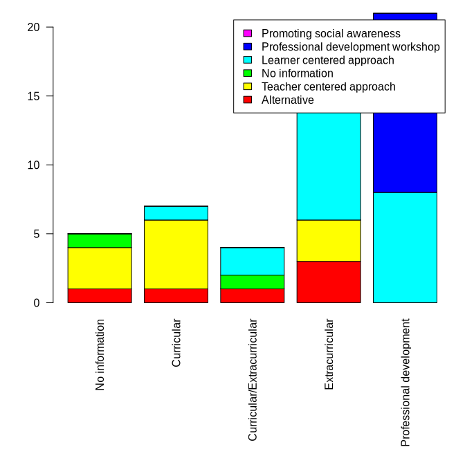<!-- -->

``` r
par(mar=c(12,4,1,1))
barplot(tablify(sqldf("SELECT TheoFra,curri,count(DISTINCT id) nbPaper FROM byRow GROUP BY curri, population"),"TheoFra","curri","nbPaper"),las=2,legend=T,col=rainbow(6))
```

<!-- -->

## 18.1 Innovative?

``` r
sqldf(
  "SELECT count(DISTINCT idRow)
  FROM byRow
  WHERE TheoFra<>'Teacher centered approach' OR outIn <> 'Indoor' OR curri <> 'Curricular'")
```

    ##   count(DISTINCT idRow)
    ## 1                   141

``` r
sqldf(
  "SELECT count(DISTINCT idRow)
  FROM byRow
  WHERE NOT (TheoFra<>'Teacher centered approach' OR outIn <> 'Indoor' OR curri <> 'Curricular')")
```

    ##   count(DISTINCT idRow)
    ## 1                     7

``` r
sqldf(
  "SELECT count(DISTINCT id)
  FROM byRow
  WHERE TheoFra='Teacher centered approach' AND outIn = 'Indoor' --AND curri = 'Curricular'")
```

    ##   count(DISTINCT id)
    ## 1                 18

``` r
sqldf(
  "SELECT count(DISTINCT idRow)
  FROM byRow"
)
```

    ##   count(DISTINCT idRow)
    ## 1                   152

## 18.2 problem profesor

``` r
sqldf(
  "SELECT GROUP_CONCAT(id, ', ')
  FROM byRow
  WHERE (TheoFra='Professional development workshop' OR pop IN ('Teachers','Pre-service teachers')) AND curri<> 'Professional development'
  "
)
```

    ##    GROUP_CONCAT(id, ', ')
    ## 1 Sutela2023, Saribaş2016

``` r
sqldf(
  "SELECT id,pop,person,TheoFra,curri
  FROM byRow
  WHERE (TheoFra='Professional development workshop' OR pop IN ('Teachers','Pre-service teachers')) AND curri<> 'Professional development'
  "
)
```

    ##            id                  pop person                           TheoFra
    ## 1  Sutela2023             Teachers   JGOP                       Alternative
    ## 2 Saribaş2016 Pre-service teachers   JGOP Professional development workshop
    ##             curri
    ## 1      Curricular
    ## 2 Extracurricular

``` r
sqldf(
  "SELECT 
  didItWork,count(*)
  FROM byOutcome
  Group by didItWork
  ")
```

    ##   didItWork count(*)
    ## 1        No       15
    ## 2   Unclear       31
    ## 3       Yes      244

``` r
sqldf(
  "SELECT 
  count(*)
  FROM byOutcome
  ")
```

    ##   count(*)
    ## 1      290

## 18.3 Ages and outcomes

``` r
popAgeSep_df<-sqldf(
  "
  WITH a AS
  (SELECT id, idRow,'4-11' AS agePopCat
  FROM catAgeConcerned_df
  LEFT JOIN byRow USING (id, idRow)
  WHERE \"X4.11\" AND pop='Students'
  UNION
  SELECT id, idRow,'12-15'
  FROM catAgeConcerned_df
  LEFT JOIN byRow USING (id, idRow)
  WHERE \"X12.15\" AND pop='Students'
  UNION
  SELECT id, idRow, '16-19'
  FROM catAgeConcerned_df
  LEFT JOIN byRow USING (id, idRow)
  WHERE \"X16.19\" AND pop='Students'
  UNION
  SELECT id, idRow, 'Teachers'
  FROM catAgeConcerned_df
  LEFT JOIN byRow USING (id, idRow)
  WHERE pop='Teachers'
  UNION
  SELECT id, idRow, 'Pre-service teachers'
  FROM catAgeConcerned_df
  LEFT JOIN byRow USING (id, idRow)
  WHERE pop='Pre-service teachers'
  UNION
  SELECT id, idRow, 'Parents'
  FROM catAgeConcerned_df
  LEFT JOIN byRow USING (id, idRow)
  WHERE pop='Parents'
  )
  SELECT DISTINCT *
  FROM a
  ORDER BY CAST(idRow AS int)
  "
)
```

``` r
(tabAgeCatOutomeTot<-tablify(sqldf(
  "SELECT outcome,agePopCat, count(DISTINCT id) nbPapers
  FROM byOutcomeTot
  LEFT JOIN popAgeSep_df USING (id, idRow)
  GROUP BY agePopCat,outcome
  "),"outcome","agePopCat","nbPapers")[c("knowledge","awareness","intention","emotion","habit","action","No information"),])
```

    ##                No information 12-15 16-19 4-11 Parents Pre-service teachers
    ## knowledge                   3    85    56   42       2                    8
    ## awareness                   1    40    26   21       1                    4
    ## intention                   1    21    17    9       2                    2
    ## emotion                     0    17    11   12       1                    2
    ## habit                       0     5     4    3       3                    1
    ## action                      0    14     8    6       2                    0
    ## No information              1     0     0    0       0                    0
    ##                Teachers
    ## knowledge            12
    ## awareness             9
    ## intention             2
    ## emotion               1
    ## habit                 1
    ## action                2
    ## No information        1

``` r
barplot(tabAgeCatOutomeTot,beside=T,col=rainbow(nrow(tabAgeCatOutomeTot)),legend=T)
```

<!-- -->

## 18.4 Effectiveness

``` r
tabPopTheoFraTot<-tablify(sqldf(
  "SELECT population, TheoFra, count(DISTINCT id) nbPapers
  FROM byOutcomeTot
  GROUP BY population,TheoFra
  "),"population","TheoFra","nbPapers")
tabPopTheoFraYes<-tablify(sqldf(
  "SELECT population, TheoFra, count(DISTINCT id) nbPapers
  FROM byOutcomeTot
  WHERE didItWork='Yes'
  GROUP BY population,TheoFra
  "),"population","TheoFra","nbPapers")
tabPopTheoFraNo<-tablify(sqldf(
  "SELECT population, TheoFra, count(DISTINCT id) nbPapers
  FROM byOutcomeTot
  WHERE didItWork='No'
  GROUP BY population,TheoFra
  "),"population","TheoFra","nbPapers")
tabPopTheoFraUnclear<-tablify(sqldf(
  "SELECT population, TheoFra, count(DISTINCT id) nbPapers
  FROM byOutcomeTot
  WHERE didItWork='Unclear'
  GROUP BY population,TheoFra
  "),"population","TheoFra","nbPapers")
colComplete<-unique(c(colnames(tabPopTheoFraYes),colnames(tabPopTheoFraUnclear),colnames(tabPopTheoFraNo)))
rowComplete<-unique(c(rownames(tabPopTheoFraYes),rownames(tabPopTheoFraUnclear),rownames(tabPopTheoFraNo)))
tabPopTheoFraYes_comp<-tabPopTheoFraNo_comp<-tabPopTheoFraUnclear_comp<-matrix(0,nrow=length(rowComplete),ncol=length(colComplete),dimnames=list(rowComplete,colComplete))
for(i in rownames(tabPopTheoFraYes_comp)){
  for(j in colnames(tabPopTheoFraYes_comp)){
    if(i %in% rownames(tabPopTheoFraYes) & j %in% colnames(tabPopTheoFraYes))
    {
      tabPopTheoFraYes_comp[i,j]<-tabPopTheoFraYes[i,j]
    }
    if(i %in% rownames(tabPopTheoFraUnclear) & j %in% colnames(tabPopTheoFraUnclear))
    {
      tabPopTheoFraUnclear_comp[i,j]<-tabPopTheoFraUnclear[i,j]
    }
    if(i %in% rownames(tabPopTheoFraNo) & j %in% colnames(tabPopTheoFraNo))
    {
      tabPopTheoFraNo_comp[i,j]<-tabPopTheoFraNo[i,j]
    }
  }
}
layout.matrix=matrix(1:4,nrow=4)
layout(layout.matrix,heights=c(1,1,1,1.7))
par(mar=c(0,4,4,1))
barplot(t(tabPopTheoFraYes_comp),beside=T,names.arg = rep("",nrow(tabPopTheoFraYes_comp)),col=rainbow(ncol(tabPopTheoFraYes_comp)),main="Yes",ylim=c(0,max(tabPopTheoFraTot)))
barplot(t(tabPopTheoFraNo_comp),beside=T,names.arg = rep("",nrow(tabPopTheoFraYes_comp)),col=rainbow(ncol(tabPopTheoFraYes_comp)),main="No",ylim=c(0,max(tabPopTheoFraTot)),legend=T,args.legend = list(x="topleft"))
barplot(t(tabPopTheoFraUnclear_comp),beside=T,names.arg = rep("",nrow(tabPopTheoFraYes_comp)),col=rainbow(ncol(tabPopTheoFraYes_comp)),main="Unclear",ylim=c(0,max(tabPopTheoFraTot)),las=2)
par(mar=c(12,4,4,1))
barplot(t(tabPopTheoFraTot),beside=T,col=rainbow(ncol(tabPopTheoFraYes_comp)),main="Total",las=2)
```

<!-- -->

``` r
tabPopoutcomeTot<-tablify(sqldf(
  "SELECT population, outcome, count(DISTINCT id) nbPapers
  FROM byOutcomeTot
  GROUP BY population,outcome
  "),"population","outcome","nbPapers")
tabPopoutcomeYes<-tablify(sqldf(
  "SELECT population, outcome, count(DISTINCT id) nbPapers
  FROM byOutcomeTot
  WHERE didItWork='Yes'
  GROUP BY population,outcome
  "),"population","outcome","nbPapers")
tabPopoutcomeNo<-tablify(sqldf(
  "SELECT population, outcome, count(DISTINCT id) nbPapers
  FROM byOutcomeTot
  WHERE didItWork='No'
  GROUP BY population,outcome
  "),"population","outcome","nbPapers")
tabPopoutcomeUnclear<-tablify(sqldf(
  "SELECT population, outcome, count(DISTINCT id) nbPapers
  FROM byOutcomeTot
  WHERE didItWork='Unclear'
  GROUP BY population,outcome
  "),"population","outcome","nbPapers")
colComplete<-unique(c(colnames(tabPopoutcomeYes),colnames(tabPopoutcomeUnclear),colnames(tabPopoutcomeNo)))
rowComplete<-unique(c(rownames(tabPopoutcomeYes),rownames(tabPopoutcomeUnclear),rownames(tabPopoutcomeNo)))
tabPopoutcomeYes_comp<-tabPopoutcomeNo_comp<-tabPopoutcomeUnclear_comp<-matrix(0,nrow=length(rowComplete),ncol=length(colComplete),dimnames=list(rowComplete,colComplete))
for(i in rownames(tabPopoutcomeYes_comp)){
  for(j in colnames(tabPopoutcomeYes_comp)){
    if(i %in% rownames(tabPopoutcomeYes) & j %in% colnames(tabPopoutcomeYes))
    {
      tabPopoutcomeYes_comp[i,j]<-tabPopoutcomeYes[i,j]
    }
    if(i %in% rownames(tabPopoutcomeUnclear) & j %in% colnames(tabPopoutcomeUnclear))
    {
      tabPopoutcomeUnclear_comp[i,j]<-tabPopoutcomeUnclear[i,j]
    }
    if(i %in% rownames(tabPopoutcomeNo) & j %in% colnames(tabPopoutcomeNo))
    {
      tabPopoutcomeNo_comp[i,j]<-tabPopoutcomeNo[i,j]
    }
  }
}
layout.matrix=matrix(1:4,nrow=4)
layout(layout.matrix,heights=c(1,1,1,1.7))
par(mar=c(0,4,4,1))
barplot(t(tabPopoutcomeYes_comp),beside=T,names.arg = rep("",nrow(tabPopoutcomeYes_comp)),col=rainbow(ncol(tabPopoutcomeYes_comp)),main="Yes",ylim=c(0,max(tabPopoutcomeTot)))
barplot(t(tabPopoutcomeNo_comp),beside=T,names.arg = rep("",nrow(tabPopoutcomeYes_comp)),col=rainbow(ncol(tabPopoutcomeYes_comp)),main="No",ylim=c(0,max(tabPopoutcomeTot)),legend=T,args.legend = list(x="topleft"))
barplot(t(tabPopoutcomeUnclear_comp),beside=T,names.arg = rep("",nrow(tabPopoutcomeYes_comp)),col=rainbow(ncol(tabPopoutcomeYes_comp)),main="Unclear",ylim=c(0,max(tabPopoutcomeTot)),las=2)
par(mar=c(12,4,4,1))
barplot(t(tabPopoutcomeTot),beside=T,col=rainbow(ncol(tabPopoutcomeYes_comp)),main="Total",las=2)
```

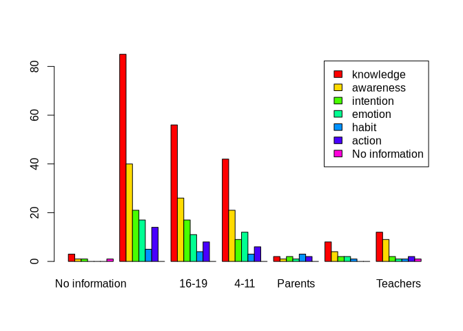<!-- -->

### 18.4.1 Young student

``` r
sqldf(
  "SELECT DISTINCT id,idRow,ageMin,ageMax,population, TheoFra,outcome,didItWork,curri,outIn
  FROM byOutcomeTot
  FULL OUTER JOIN catAgeConcerned_df USING (id,idRow)
  WHERE \"X4.11\" AND population='Students (4-11)'
  ORDER BY outcome
   --CAST(idRow AS int)
  "
)
```

    ##              id idRow ageMin ageMax      population                   TheoFra
    ## 1   Vicente2020    10     10     11 Students (4-11) Learner centered approach
    ## 2   Herrick2022    40     10     11 Students (4-11) Learner centered approach
    ## 3     Baker2013    21      8     10 Students (4-11)               Alternative
    ## 4   Herrick2022    40     10     11 Students (4-11) Learner centered approach
    ## 5     Jones2021    43      9     10 Students (4-11) Learner centered approach
    ## 6     Taber2009    83      6     10 Students (4-11) Learner centered approach
    ## 7   Herrick2022    40     10     11 Students (4-11) Learner centered approach
    ## 8  Williams2017     8      7      9 Students (4-11)               Alternative
    ## 9   Vicente2020    10     10     11 Students (4-11) Learner centered approach
    ## 10  Akaygun2021    17     10     11 Students (4-11) Learner centered approach
    ## 11    Baker2013    21      8     10 Students (4-11)               Alternative
    ## 12  Herrick2022    40     10     11 Students (4-11) Learner centered approach
    ## 13    Taber2009    83      6     10 Students (4-11) Learner centered approach
    ## 14    Mason1998    94     10     11 Students (4-11) Learner centered approach
    ##      outcome didItWork           curri   outIn
    ## 1  awareness       Yes      Curricular  Indoor
    ## 2  awareness       Yes      Curricular Outdoor
    ## 3    emotion       Yes Extracurricular  Indoor
    ## 4    emotion       Yes      Curricular Outdoor
    ## 5    emotion   Unclear      Curricular  Indoor
    ## 6    emotion       Yes Extracurricular  Indoor
    ## 7  intention       Yes      Curricular Outdoor
    ## 8  knowledge       Yes      Curricular  Indoor
    ## 9  knowledge       Yes      Curricular  Indoor
    ## 10 knowledge       Yes Extracurricular  Indoor
    ## 11 knowledge       Yes Extracurricular  Indoor
    ## 12 knowledge       Yes      Curricular Outdoor
    ## 13 knowledge        No Extracurricular  Indoor
    ## 14 knowledge       Yes      Curricular  Indoor

``` r
sqldf(
  "SELECT outcome,didItWork,count(DISTINCT id), GROUP_CONCAT(DISTINCT id)
  FROM byOutcomeTot
  FULL OUTER JOIN catAgeConcerned_df USING (id,idRow)
  WHERE \"X4.11\" AND population = 'Students (4-11)'
  GROUP BY outcome,didItWork
  ORDER BY outcome
  "
)
```

    ##     outcome didItWork count(DISTINCT id)
    ## 1 awareness       Yes                  2
    ## 2   emotion   Unclear                  1
    ## 3   emotion       Yes                  3
    ## 4 intention       Yes                  1
    ## 5 knowledge        No                  1
    ## 6 knowledge       Yes                  6
    ##                                              GROUP_CONCAT(DISTINCT id)
    ## 1                                              Vicente2020,Herrick2022
    ## 2                                                            Jones2021
    ## 3                                      Baker2013,Herrick2022,Taber2009
    ## 4                                                          Herrick2022
    ## 5                                                            Taber2009
    ## 6 Williams2017,Vicente2020,Akaygun2021,Baker2013,Herrick2022,Mason1998

``` r
sqldf(
  "SELECT min(ageMin)
  FROM byOutcomeTot
  FULL OUTER JOIN catAgeConcerned_df USING (id,idRow)
  WHERE \"X4.11\" AND population = 'Students (4-11)'
  "
)
```

    ##   min(ageMin)
    ## 1           6

``` r
sqldf(
  "SELECT id, idRow, population,ageMin,ageMax, outcome, didItWork
  FROM byOutcomeTot
  FULL OUTER JOIN catAgeConcerned_df USING (id,idRow)
  WHERE id LIKE 'Korfgen%'
  "
)
```

    ##            id idRow       population ageMin ageMax   outcome didItWork
    ## 1 Korfgen2017     5 Students (12-15)     13     15 awareness       Yes
    ## 2 Korfgen2017     5 Students (12-15)     13     15 knowledge       Yes

## 18.5 Ages percentages

Only accounting for students:

``` r
sqldf(
  "SELECT pop, ageCat, count(DISTINCT id)
  FROM byOutcomeTot
  FULL OUTER JOIN catAgeConcerned_df USING (id,idRow)
  GROUP BY pop, ageCat
  "
)
```

    ##                     pop             ageCat count(DISTINCT id)
    ## 1                  <NA>              12-15                  1
    ## 2                  <NA>               4-11                  1
    ## 3                  <NA> No age information                  1
    ## 4               Parents              12-15                  4
    ## 5               Parents              16-19                  1
    ## 6               Parents               4-11                  2
    ## 7               Parents No age information                  1
    ## 8  Pre-service teachers              12-15                  3
    ## 9  Pre-service teachers              16-19                  2
    ## 10 Pre-service teachers               4-11                  5
    ## 11 Pre-service teachers No age information                  3
    ## 12             Students              12-15                 95
    ## 13             Students              16-19                 61
    ## 14             Students               4-11                 47
    ## 15             Students No age information                  2
    ## 16             Teachers              12-15                  6
    ## 17             Teachers              16-19                  3
    ## 18             Teachers               4-11                  5
    ## 19             Teachers No age information                 11

## 18.6 Outcomes numbers

``` r
for_outcomeByDoc<- by(tf_outcomes,extract$id,function(x)apply(x,2,any))
outcomeByDoc<-Reduce(rbind,for_outcomeByDoc)
rownames(outcomeByDoc)<-names(for_outcomeByDoc)
colSums(outcomeByDoc)/146
```

    ##  knowledge  awareness  intention    emotion     action      habit      Other 
    ## 0.87671233 0.43835616 0.22602740 0.19178082 0.12328767 0.06164384 0.19863014

# 19 Exploring more (AFD requests)

## 19.1 Income group

The countries concerned are:

``` r
tapply(countryDoc,incomeDoc,function(x)sort(table(x),decreasing = T))
```

    ## $High
    ## x
    ## United States of America                  Germany                 Multiple 
    ##                       59                        7                        7 
    ##                  Austria                   Canada           United Kingdom 
    ##                        6                        5                        4 
    ##                Australia                  Finland                    Italy 
    ##                        3                        3                        3 
    ##                  Denmark                   Norway                    Spain 
    ##                        2                        2                        2 
    ##                  Belgium                  Czechia                   France 
    ##                        1                        1                        1 
    ##                   Greece                    Japan              New Zealand 
    ##                        1                        1                        1 
    ##                 Portugal                Singapore              South Korea 
    ##                        1                        1                        1 
    ##                   Sweden              Switzerland                   Taiwan 
    ##                        1                        1                        1 
    ## 
    ## $`Middle to high`
    ## x
    ##       Turkey        China     Malaysia South Africa       Brazil     Thailand 
    ##           10            4            3            3            2            2 
    ##       Mexico 
    ##            1 
    ## 
    ## $`Middle to low`
    ## x
    ##  Indonesia Bangladesh 
    ##          3          1

The studies which are concerned are:

``` r
tapply(countryDoc,incomeDoc,function(x)unique(names(x)))
```

    ## $High
    ##   [1] "Aksel_Stenberdt2023"   "Baker2013"             "Bentz2020"            
    ##   [4] "Bhattacharya2021"      "Blaum2017"             "Bodzin2014"           
    ##   [7] "Bofferding2015"        "Boon2016"              "Breslyn2019"          
    ##  [10] "Chang2018"             "Chin2016"              "Choi2021"             
    ##  [13] "Deisenrieder2020"      "DeWaters2014"          "Dormody2020"          
    ##  [16] "Dormody2021"           "Drewes2018"            "Eggert2017"           
    ##  [19] "Faria2015"             "Feierabend2012"        "Feldpausch_Parker2013"
    ##  [22] "Flora2014"             "Gold2015a"             "Goulah2017"           
    ##  [25] "Gutierrez2022"         "Harker_Schuch2013"     "Harker_Schuch2020"    
    ##  [28] "Herrick2022"           "Holthuis2014"          "Jacobson2017"         
    ##  [31] "Jin2013"               "Jones2021"             "Keller2019"           
    ##  [34] "Kern2017"              "Khadka2021"            "Kinsey2012"           
    ##  [37] "Klosterman2010"        "Kolenaty2022"          "Korfgen2017"          
    ##  [40] "Korsager2015"          "Kubisch2022"           "Kumar2023"            
    ##  [43] "Lambert2012"           "Lambert2013"           "Lawson2019a"          
    ##  [46] "Leckey2021"            "Leitao2022"            "Lester2006"           
    ##  [49] "Levrini2021"           "Littrell2022"          "Liu2015"              
    ##  [52] "Lombardi2013"          "Lozano2022"            "Markowitz2018"        
    ##  [55] "Mason1998"             "McGowan2022"           "McNeal2014a"          
    ##  [58] "McNeill2012"           "Meya2018"              "Miller2015"           
    ##  [61] "Monroe2016"            "Nakamura2019"          "Nicholas_Figueroa2017"
    ##  [64] "Nussbaum2015"          "Oberauer2023"          "Parant2017"           
    ##  [67] "Park2020"              "Parth2020"             "Petersen2020"         
    ##  [70] "Porter2012"            "Pruneau2003"           "Pruneau2006"          
    ##  [73] "Pruneau2006a"          "Puttick2018"           "Raes2016"             
    ##  [76] "Ratinen2013"           "Reinfried2012"         "Roscoe2013"           
    ##  [79] "Roychoudhury2017"      "Schrot2021a"           "Schubatzky2022"       
    ##  [82] "Schuster2008"          "Sellmann2013"          "Sellmann2013a"        
    ##  [85] "Sellmann2015"          "Shea2016"              "Siegner2018"          
    ##  [88] "Skains2022"            "Smith2019"             "Steffensen2022"       
    ##  [91] "Sternang2012"          "Stevenson2018"         "Stevenson2018a"       
    ##  [94] "Sumrall2021"           "Sundberg2013"          "Sutela2023"           
    ##  [97] "Svihla2012"            "Taber2009"             "Tasquier2015"         
    ## [100] "Tasquier2017"          "Taylor2020"            "Trott2019"            
    ## [103] "Trott2020a"            "Trott2020b"            "Trott2022"            
    ## [106] "Varma2012"             "Veijalainen2013"       "Vicente2020"          
    ## [109] "Visintainer2015"       "Walsh2018"             "Walsh2019"            
    ## [112] "White2022"             "Williams2017"          "Xie2014"              
    ## [115] "Zografakis2008"       
    ## 
    ## $`Middle to high`
    ##  [1] "Akaygun2021"     "Aksut2016"       "Bozdogan2011"    "Cebesoy2019"    
    ##  [5] "Cebesoy2022"     "Chattuchai2015"  "Cibik2022"       "da_Rocha2020"   
    ##  [9] "Dal2015a"        "Hu2016"          "Karpudewan2015"  "Karpudewan2015a"
    ## [13] "Karpudewan2017"  "Li2022"          "Muller2021"      "Muller2021a"    
    ## [17] "Nkoana2020"      "Pekel2019"       "Ruboon2012"      "Salas_Rueda2021"
    ## [21] "Saribaş2016"     "Silva2021"       "Tasti2021"       "Wang2022"       
    ## [25] "Zhong2021"      
    ## 
    ## $`Middle to low`
    ## [1] "Kabir2015"     "Nafisah2022"   "Salsabila2019" "Sukardi2022"

### 19.1.1 Evolution over time

``` r
all(names(yearPaper)==names(incomeDoc))
```

    ## [1] TRUE

``` r
(tbYearIncome<-table(incomeDoc,yearPaper))
```

    ##                 yearPaper
    ## incomeDoc        1998 1999 2000 2001 2002 2003 2004 2005 2006 2007 2008 2009
    ##   High              1    0    0    0    0    1    0    0    3    0    2    1
    ##   Middle to high    0    0    0    0    0    0    0    0    0    0    0    0
    ##   Middle to low     0    0    0    0    0    0    0    0    0    0    0    0
    ##                 yearPaper
    ## incomeDoc        2010 2011 2012 2013 2014 2015 2016 2017 2018 2019 2020 2021
    ##   High              2    0   10   10    5   11    4   13    7    9   11    9
    ##   Middle to high    0    1    1    0    1    3    3    1    0    3    3    6
    ##   Middle to low     0    0    0    0    0    1    0    0    0    1    0    0
    ##                 yearPaper
    ## incomeDoc        2022 2023
    ##   High             12    4
    ##   Middle to high    3    0
    ##   Middle to low     2    0

``` r
barplot(tbYearIncome,col=rainbow(nlevels(incomeDoc)),legend=T, args.legend=list(title="Country income",x="topleft"),las=2)
```

<!-- -->

### 19.1.2 Comparison with population

``` r
all(names(populClean)==names(incomeDoc))
```

    ## [1] TRUE

``` r
(tbPopIncome<-table(populClean,incomeDoc))
```

    ##                       incomeDoc
    ## populClean             High Middle to high Middle to low
    ##   Students               94             14             4
    ##   Teachers                8              6             0
    ##   Pre-service teachers    5              4             0
    ##   Mixed                   6              1             0
    ##   Parents                 2              0             0

``` r
barplot(tbPopIncome,col=rainbow(nlevels(populClean)),legend=T,args.legend = list(title="Population"),xlab="Country income",beside=T)
```

<!-- -->

### 19.1.3 Age of students

Note, it is not based on n=146, because one paper may have more than one
age class, and not all papers are on students

``` r
nrow(catAgeConcerned)==length(incomeDoc[extract$id])
```

    ## [1] TRUE

``` r
resAgeIncome<-by(catAgeConcerned[populClean=="Students",],incomeDoc[extract$id][populClean=="Students"],colSums)
tbAgeIncome<-as.table(as.matrix(Reduce(rbind,resAgeIncome)))
rownames(tbAgeIncome)<-levels(incomeDoc)
tbAgeIncome<-t(tbAgeIncome)
barplot(tbAgeIncome,beside=T,col=rainbow(nrow(tbAgeIncome)),legend=T,xlab="Country income", args.legend="Student ages")
```

<!-- -->

### 19.1.4 Rural/Urban

Note n=152 (6 papers with more than two populations)

``` r
(tbRururbIncome<-table(rururbClean,incomeDoc[extract$id]))
```

    ##            
    ## rururbClean High Middle to high Middle to low
    ##   Urban       68             19             3
    ##   Rural        5              1             1
    ##   Both        16              1             0
    ##   Not given   31              5             0

``` r
barplot(tbRururbIncome,beside=T,col=rainbow(nrow(tbRururbIncome)),legend=T)
```

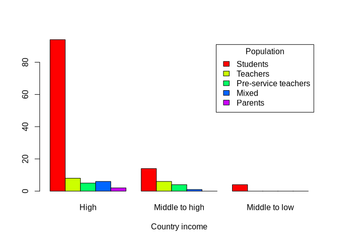<!-- -->

### 19.1.5 Comparison with Luisa’s themes

``` r
resThemesIncome<-by(themes,incomeDoc[extract$id],colSums)
tbThemesIncome<-as.table(as.matrix(Reduce(rbind,resThemesIncome)))
rownames(tbThemesIncome)<-levels(incomeDoc)
tbThemesIncome<-t(tbThemesIncome)
barplot(tbThemesIncome,beside=T,col=rainbow(nrow(tbThemesIncome)),legend=T,xlab="Country income", args.legend="Student ages")
```

<!-- -->

### 19.1.6 Comparison with controversy

``` r
all(names(controvByDoc)==names(incomeDoc))
```

    ## [1] TRUE

``` r
(tbControvIncome<-table(controvByDoc,incomeDoc))
```

    ##             incomeDoc
    ## controvByDoc High Middle to high Middle to low
    ##          No    82             25             4
    ##          Yes   33              0             0

``` r
barplot(tbControvIncome,col=c("blue","red"),legend=T,args.legend = list(title="Controversy"),xlab="Country income")
```

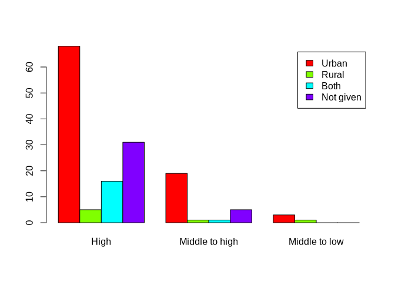<!-- -->

### 19.1.7 Comparison with mitigation/adaptation

Note n=152

``` r
(tbMitiadaptIncome <- table(extract$`Final.mitigation/adaptation`,incomeDoc[extract$id]))
```

    ##             
    ##              High Middle to high Middle to low
    ##   Adaptation    1              4             0
    ##   Both         34              7             1
    ##   Mitigation   79             13             3
    ##   Neither       5              1             0

``` r
barplot(tbMitiadaptIncome,beside=T,col=rainbow(nrow(tbMitiadaptIncome)),legend=T)
```

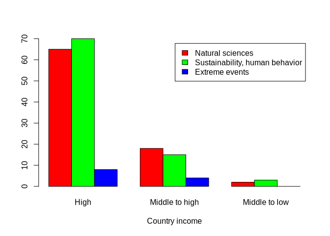<!-- -->

### 19.1.8 Comparison with curricular/extracurricular

Since one study might concern more than one type of
curricular/extracurricular, we are for these in the base n=152 instead
of n=146

``` r
kable(tbCurIncome<-table(curExtraCur,incomeDoc[extract$id]))
```

|                            | High | Middle to high | Middle to low |
|----------------------------|-----:|---------------:|--------------:|
| Curricular                 |   63 |             10 |             4 |
| Curricular/Extracurricular |    4 |              0 |             0 |
| Extracurricular            |   35 |              7 |             0 |
| Professional development   |   14 |              7 |             0 |

``` r
barplot(tbCurIncome,beside=T,col=rainbow(nlevels(factor(curExtraCur))),legend=T, xlab="Country income")
```

<!-- -->

### 19.1.9 Comparison with pedagogical tools

n=152

``` r
(tbPedtoolsIncome<-table(extract$Categories.type.of.intervention,incomeDoc[extract$id]))
```

    ##                                    
    ##                                     High Middle to high Middle to low
    ##   Lesson-based                        44             13             2
    ##   Combined strategies                 32              8             1
    ##   Curriculum-based                    11              1             1
    ##   Project-based learning               9              2             0
    ##   Technology/virtual scenario-based    8              1             0
    ##   Cultural-based                       5              1             0
    ##   Game-based                           6              0             0

``` r
barplot(tbPedtoolsIncome,beside=T,col=rainbow(nrow(tbPedtoolsIncome)),legend=T, xlab="Country income")
```

<!-- -->

### 19.1.10 Comparison with local examples in the interventions

n=152

``` r
locExample<-NA
locExample[grepl("yes",extract$`Are.local.climate.change.issues.presented.to.participants?`,ignore.case = T)]<-T
locExample[grepl("no",extract$`Are.local.climate.change.issues.presented.to.participants?`,ignore.case = T)]<-F
table(locExample,useNA="ifany")
```

    ## locExample
    ## FALSE  TRUE  <NA> 
    ##    82    66     4

``` r
(tbLocexampleIncome<-table(locExample,incomeDoc[extract$id]))
```

    ##           
    ## locExample High Middle to high Middle to low
    ##      FALSE   67             13             1
    ##      TRUE    50             13             2

``` r
barplot(tbLocexampleIncome,beside=T,col=rainbow(nrow(tbLocexampleIncome)),legend=T, xlab="Country income",args.legend = list(title="Local examples"))
```

<!-- -->

### 19.1.11 Comparison with theoretical framework

n=152

``` r
(tbTheofraIncome<-table(factor(extract$`Theoretical.framework.(big.categories)`,levels=names(sort(table(extract$`Theoretical.framework.(big.categories)`),decreasing=T))),incomeDoc[extract$id]))
```

    ##                                    
    ##                                     High Middle to high Middle to low
    ##   Learner centered approach           51              9             3
    ##   Alternative                         34              1             0
    ##   Teacher centered approach           14              6             1
    ##   Professional development workshop   12              6             0
    ##   Promoting social awareness           6              4             0

``` r
barplot(tbTheofraIncome,beside=T,col=rainbow(nrow(tbTheofraIncome)),legend=T, xlab="Country income")
```

<!-- -->

### 19.1.12 Comparison with time

``` r
tbTempIncome<-table(extract$Intervention.time.category,incomeDoc[extract$id])
barplot(tbTempIncome,beside=T,col=rainbow(nrow(tbTempIncome)),legend=T, xlab="Country income")
```

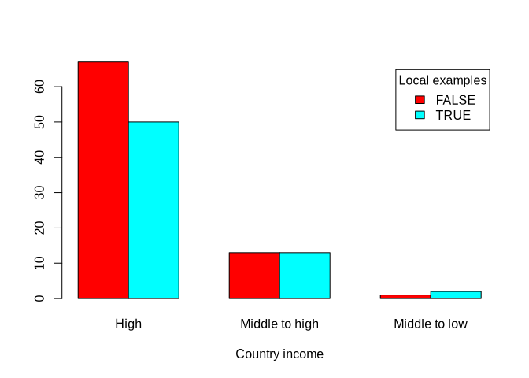<!-- -->

### 19.1.13 Comparison with outcomes and effectiveness

``` r
resOutcomeIncome<-by(tf_outcomes,incomeDoc[extract$id],colSums)
tbOutcomeIncome<-as.table(as.matrix(Reduce(rbind,resOutcomeIncome)))
rownames(tbOutcomeIncome)<-levels(incomeDoc)
(tbOutcomeIncome<-t(tbOutcomeIncome))
```

    ##           High Middle to high Middle to low
    ## knowledge  103             23             3
    ## awareness   46             17             1
    ## intention   23              9             0
    ## emotion     24              4             0
    ## action      11              8             0
    ## habit        6              5             0
    ## Other       26              3             1

``` r
resOutcomeIncome_No<-by(didItWork_outcomes,incomeDoc[extract$id],function(tab)apply(tab,2,function(x)sum(x=="No",na.rm = T)))
tbOutcomeIncome_No<-as.table(as.matrix(Reduce(rbind,resOutcomeIncome_No)))
rownames(tbOutcomeIncome_No)<-levels(incomeDoc)
(tbOutcomeIncome_No<-t(tbOutcomeIncome_No))
```

    ##           High Middle to high Middle to low
    ## knowledge    6              0             0
    ## awareness    3              0             0
    ## intention    2              0             0
    ## emotion      3              0             0
    ## action       0              0             0
    ## habit        1              0             0
    ## Other        1              0             0

``` r
resOutcomeIncome_Unclear<-by(didItWork_outcomes,incomeDoc[extract$id],function(tab)apply(tab,2,function(x)sum(x=="Unclear",na.rm = T)))
tbOutcomeIncome_Unclear<-as.table(as.matrix(Reduce(rbind,resOutcomeIncome_Unclear)))
rownames(tbOutcomeIncome_Unclear)<-levels(incomeDoc)
(tbOutcomeIncome_Unclear<-t(tbOutcomeIncome_Unclear))
```

    ##           High Middle to high Middle to low
    ## knowledge   10              2             0
    ## awareness    3              0             0
    ## intention    5              2             0
    ## emotion      3              0             0
    ## action       5              0             0
    ## habit        1              0             0
    ## Other        8              0             0

``` r
bp<-barplot(tbOutcomeIncome,beside=T,col=rainbow(nrow(tbOutcomeIncome)),legend=T,xlab="Country income", args.legend=list(x="top"))
rect(xleft=as.vector(bp)-0.5,ybottom = 0,xright = as.vector(bp)+.5,ytop = as.vector(tbOutcomeIncome_No),density=20,angle = 45)
rect(xleft=as.vector(bp)-0.5,ybottom = as.vector(tbOutcomeIncome_No),xright = as.vector(bp)+.5,ytop = as.vector(tbOutcomeIncome_No)+as.vector(tbOutcomeIncome_Unclear),density=20,angle = 90)
legend("topright",density=c(0,20,20),angle=c(0,45,90),title="Did it work?",c("Yes","No","Unclear"))
```

<!-- -->

### 19.1.14 Outcomes big groups

``` r
tf_outcomes_bigCat
```

    ##     cognition attitude behavior
    ## 1        TRUE    FALSE     TRUE
    ## 2        TRUE    FALSE    FALSE
    ## 3        TRUE    FALSE    FALSE
    ## 4        TRUE    FALSE    FALSE
    ## 5        TRUE    FALSE    FALSE
    ## 6        TRUE    FALSE    FALSE
    ## 7        TRUE    FALSE    FALSE
    ## 8        TRUE    FALSE    FALSE
    ## 9        TRUE    FALSE    FALSE
    ## 10       TRUE    FALSE    FALSE
    ## 11       TRUE    FALSE    FALSE
    ## 12       TRUE    FALSE    FALSE
    ## 13       TRUE    FALSE    FALSE
    ## 14       TRUE    FALSE    FALSE
    ## 15       TRUE    FALSE    FALSE
    ## 16       TRUE    FALSE    FALSE
    ## 17       TRUE    FALSE    FALSE
    ## 18       TRUE     TRUE    FALSE
    ## 19       TRUE     TRUE    FALSE
    ## 20       TRUE     TRUE    FALSE
    ## 21       TRUE     TRUE    FALSE
    ## 22       TRUE    FALSE    FALSE
    ## 23       TRUE    FALSE    FALSE
    ## 24       TRUE    FALSE    FALSE
    ## 25       TRUE    FALSE    FALSE
    ## 26       TRUE    FALSE    FALSE
    ## 27       TRUE    FALSE    FALSE
    ## 28       TRUE     TRUE    FALSE
    ## 29       TRUE    FALSE    FALSE
    ## 30       TRUE     TRUE    FALSE
    ## 31       TRUE    FALSE    FALSE
    ## 32       TRUE    FALSE    FALSE
    ## 33       TRUE    FALSE    FALSE
    ## 34       TRUE    FALSE    FALSE
    ## 35       TRUE    FALSE    FALSE
    ## 36       TRUE    FALSE    FALSE
    ## 37      FALSE    FALSE    FALSE
    ## 38       TRUE    FALSE    FALSE
    ## 39       TRUE    FALSE    FALSE
    ## 40       TRUE     TRUE    FALSE
    ## 41       TRUE    FALSE    FALSE
    ## 42       TRUE    FALSE    FALSE
    ## 43      FALSE     TRUE    FALSE
    ## 44       TRUE    FALSE    FALSE
    ## 45       TRUE     TRUE    FALSE
    ## 46       TRUE    FALSE    FALSE
    ## 47       TRUE     TRUE    FALSE
    ## 48       TRUE     TRUE    FALSE
    ## 49       TRUE    FALSE    FALSE
    ## 50       TRUE    FALSE    FALSE
    ## 51       TRUE     TRUE    FALSE
    ## 52       TRUE    FALSE    FALSE
    ## 53       TRUE     TRUE    FALSE
    ## 54      FALSE     TRUE    FALSE
    ## 55      FALSE     TRUE    FALSE
    ## 56       TRUE    FALSE    FALSE
    ## 57       TRUE    FALSE    FALSE
    ## 58       TRUE    FALSE    FALSE
    ## 59       TRUE    FALSE    FALSE
    ## 60       TRUE    FALSE    FALSE
    ## 61       TRUE     TRUE    FALSE
    ## 62       TRUE     TRUE     TRUE
    ## 63       TRUE    FALSE    FALSE
    ## 64       TRUE    FALSE     TRUE
    ## 65       TRUE    FALSE    FALSE
    ## 66       TRUE    FALSE     TRUE
    ## 67       TRUE     TRUE    FALSE
    ## 68       TRUE     TRUE    FALSE
    ## 69       TRUE    FALSE    FALSE
    ## 70       TRUE     TRUE    FALSE
    ## 71       TRUE    FALSE    FALSE
    ## 72       TRUE    FALSE    FALSE
    ## 73       TRUE    FALSE    FALSE
    ## 74       TRUE    FALSE     TRUE
    ## 75       TRUE    FALSE    FALSE
    ## 76       TRUE    FALSE    FALSE
    ## 77       TRUE    FALSE    FALSE
    ## 78       TRUE    FALSE    FALSE
    ## 79       TRUE    FALSE    FALSE
    ## 80       TRUE    FALSE    FALSE
    ## 81       TRUE    FALSE     TRUE
    ## 82      FALSE     TRUE    FALSE
    ## 83       TRUE     TRUE    FALSE
    ## 84       TRUE    FALSE    FALSE
    ## 85       TRUE     TRUE     TRUE
    ## 86       TRUE     TRUE    FALSE
    ## 87       TRUE     TRUE    FALSE
    ## 88       TRUE    FALSE    FALSE
    ## 89       TRUE     TRUE    FALSE
    ## 90       TRUE    FALSE    FALSE
    ## 91       TRUE     TRUE    FALSE
    ## 92       TRUE     TRUE     TRUE
    ## 93       TRUE     TRUE     TRUE
    ## 94       TRUE    FALSE    FALSE
    ## 95       TRUE     TRUE    FALSE
    ## 96       TRUE    FALSE    FALSE
    ## 97       TRUE    FALSE    FALSE
    ## 98       TRUE    FALSE    FALSE
    ## 99       TRUE    FALSE    FALSE
    ## 100      TRUE    FALSE     TRUE
    ## 101      TRUE    FALSE     TRUE
    ## 102      TRUE     TRUE     TRUE
    ## 103      TRUE     TRUE    FALSE
    ## 104     FALSE     TRUE    FALSE
    ## 105      TRUE     TRUE     TRUE
    ## 106      TRUE    FALSE    FALSE
    ## 107      TRUE    FALSE    FALSE
    ## 108      TRUE     TRUE    FALSE
    ## 109      TRUE    FALSE    FALSE
    ## 110     FALSE     TRUE    FALSE
    ## 111      TRUE     TRUE     TRUE
    ## 112     FALSE    FALSE     TRUE
    ## 113      TRUE     TRUE    FALSE
    ## 114      TRUE     TRUE    FALSE
    ## 115     FALSE     TRUE    FALSE
    ## 116      TRUE     TRUE    FALSE
    ## 117     FALSE    FALSE     TRUE
    ## 118     FALSE    FALSE     TRUE
    ## 119      TRUE     TRUE    FALSE
    ## 120      TRUE    FALSE    FALSE
    ## 121      TRUE     TRUE     TRUE
    ## 122      TRUE    FALSE     TRUE
    ## 123      TRUE    FALSE    FALSE
    ## 124      TRUE     TRUE    FALSE
    ## 125      TRUE     TRUE     TRUE
    ## 126      TRUE    FALSE    FALSE
    ## 127      TRUE     TRUE    FALSE
    ## 128      TRUE    FALSE    FALSE
    ## 129      TRUE     TRUE    FALSE
    ## 130      TRUE    FALSE    FALSE
    ## 131      TRUE    FALSE    FALSE
    ## 132      TRUE    FALSE    FALSE
    ## 133      TRUE    FALSE    FALSE
    ## 134     FALSE    FALSE    FALSE
    ## 135      TRUE     TRUE    FALSE
    ## 136      TRUE     TRUE     TRUE
    ## 137      TRUE     TRUE    FALSE
    ## 138      TRUE    FALSE    FALSE
    ## 139      TRUE     TRUE     TRUE
    ## 140      TRUE    FALSE    FALSE
    ## 141      TRUE     TRUE    FALSE
    ## 142      TRUE     TRUE    FALSE
    ## 143      TRUE    FALSE    FALSE
    ## 144      TRUE    FALSE    FALSE
    ## 145      TRUE    FALSE    FALSE
    ## 146      TRUE    FALSE    FALSE
    ## 147     FALSE     TRUE     TRUE
    ## 148      TRUE    FALSE    FALSE
    ## 149      TRUE     TRUE     TRUE
    ## 150      TRUE    FALSE    FALSE
    ## 151      TRUE    FALSE    FALSE
    ## 152      TRUE     TRUE    FALSE

``` r
resOutcomeBCIncome<-by(tf_outcomes_bigCat,incomeDoc[extract$id],colSums)
tbOutcomeBCIncome<-as.table(as.matrix(Reduce(rbind,resOutcomeBCIncome)))
rownames(tbOutcomeBCIncome)<-levels(incomeDoc)
(tbOutcomeBCIncome<-t(tbOutcomeBCIncome))
```

    ##           High Middle to high Middle to low
    ## cognition  107             26             4
    ## attitude    43             11             0
    ## behavior    14              9             0

## 19.2 Rural/urban

``` r
rururbDoc<-factor(tapply(as.character(rururbClean),extract$id,unique),levels=c("Urban","Rural","Both","Not given"))
```

### 19.2.1 Evolution over time

``` r
all(names(yearPaper)==names(rururbDoc))
```

    ## [1] TRUE

``` r
(tbYearRururb<-table(rururbDoc,yearPaper))
```

    ##            yearPaper
    ## rururbDoc   1998 1999 2000 2001 2002 2003 2004 2005 2006 2007 2008 2009 2010
    ##   Urban        1    0    0    0    0    1    0    0    2    0    1    1    1
    ##   Rural        0    0    0    0    0    0    0    0    0    0    0    0    0
    ##   Both         0    0    0    0    0    0    0    0    0    0    1    0    1
    ##   Not given    0    0    0    0    0    0    0    0    1    0    0    0    0
    ##            yearPaper
    ## rururbDoc   2011 2012 2013 2014 2015 2016 2017 2018 2019 2020 2021 2022 2023
    ##   Urban        1    7    4    5    8    6    8    5    5    9   11   10    2
    ##   Rural        0    0    0    0    1    0    2    0    1    0    1    2    0
    ##   Both         0    2    1    0    1    0    2    1    4    1    0    1    1
    ##   Not given    0    2    5    1    5    2    2    1    3    4    3    5    1

``` r
barplot(tbYearRururb,col=rainbow(nlevels(rururbDoc)),legend=T, args.legend=list(title="Rural/Urban",x="topleft"),las=2)
```

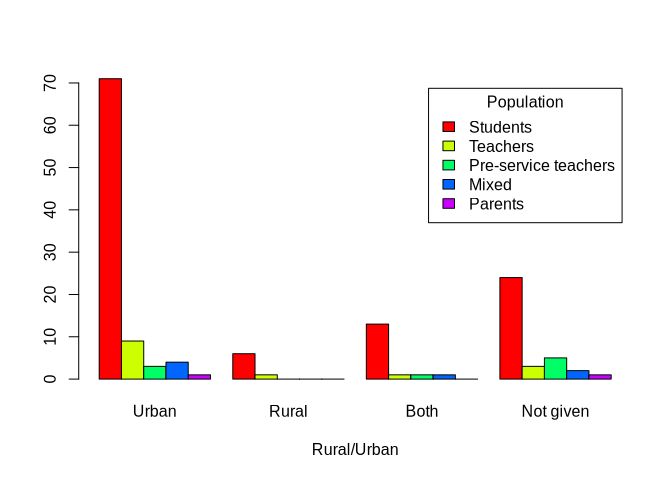<!-- -->

### 19.2.2 Comparison with population

``` r
all(names(populClean)==names(rururbDoc))
```

    ## [1] TRUE

``` r
(tbPopRururb<-table(populClean,rururbDoc))
```

    ##                       rururbDoc
    ## populClean             Urban Rural Both Not given
    ##   Students                71     6   13        24
    ##   Teachers                 9     1    1         3
    ##   Pre-service teachers     3     0    1         5
    ##   Mixed                    4     0    1         2
    ##   Parents                  1     0    0         1

``` r
barplot(tbPopRururb,col=rainbow(nlevels(populClean)),legend=T,args.legend = list(title="Population"),xlab="Rural/Urban",beside=T)
```

<!-- -->

### 19.2.3 Age of students

Note, it is not based on n=146, because one paper may have more than one
age class, and not all papers are on students

``` r
nrow(catAgeConcerned)==length(rururbDoc[extract$id])
```

    ## [1] TRUE

``` r
resAgeRururb<-by(catAgeConcerned[populClean=="Students",],rururbDoc[extract$id][populClean=="Students"],colSums)
tbAgeRururb<-as.table(as.matrix(Reduce(rbind,resAgeRururb)))
rownames(tbAgeRururb)<-levels(rururbDoc)
tbAgeRururb<-t(tbAgeRururb)
barplot(tbAgeRururb,beside=T,col=rainbow(nrow(tbAgeRururb)),legend=T,xlab="Rural/Urban", args.legend="Student ages")
```

<!-- -->

### 19.2.4 Comparison with Luisa’s themes

``` r
resThemesRururb<-by(themes,rururbDoc[extract$id],colSums)
tbThemesRururb<-as.table(as.matrix(Reduce(rbind,resThemesRururb)))
rownames(tbThemesRururb)<-levels(rururbDoc)
tbThemesRururb<-t(tbThemesRururb)
barplot(tbThemesRururb,beside=T,col=rainbow(nrow(tbThemesRururb)),legend=T,xlab="Rural/Urban")
```

<!-- -->

### 19.2.5 Comparison with controversy

``` r
all(names(controvByDoc)==names(rururbDoc))
```

    ## [1] TRUE

``` r
(tbControvRururb<-table(controvByDoc,rururbDoc))
```

    ##             rururbDoc
    ## controvByDoc Urban Rural Both Not given
    ##          No     67     3   13        29
    ##          Yes    21     4    3         6

``` r
barplot(tbControvRururb,col=c("blue","red"),legend=T,args.legend = list(title="Controversy"),xlab="Rural/Urban")
```

<!-- -->

### 19.2.6 Comparison with mitigation/adaptation

Note n=152

``` r
(tbMitiadaptRururb <- table(extract$`Final.mitigation/adaptation`,rururbDoc[extract$id]))
```

    ##             
    ##              Urban Rural Both Not given
    ##   Adaptation     4     0    0         1
    ##   Both          24     3    5        10
    ##   Mitigation    61     2   10        24
    ##   Neither        1     1    2         2

``` r
barplot(tbMitiadaptRururb,beside=T,col=rainbow(nrow(tbMitiadaptRururb)),legend=T)
```

<!-- -->

### 19.2.7 Comparison with curricular/extracurricular

Since one study might concern more than one type of
curricular/extracurricular, we are for these in the base n=152 instead
of n=146

``` r
kable(tbCurRururb<-table(curExtraCur,rururbDoc[extract$id]))
```

|                            | Urban | Rural | Both | Not given |
|----------------------------|------:|------:|-----:|----------:|
| Curricular                 |    49 |     2 |   12 |        14 |
| Curricular/Extracurricular |     0 |     0 |    2 |         3 |
| Extracurricular            |    31 |     3 |    1 |         8 |
| Professional development   |    10 |     1 |    2 |         8 |

``` r
barplot(tbCurRururb,beside=T,col=rainbow(nlevels(factor(curExtraCur))),legend=T, xlab="Rural/Urban")
```

<!-- -->

### 19.2.8 Comparison with pedagogical tools

n=152

``` r
(tbPedtoolsRururb<-table(extract$Categories.type.of.intervention,rururbDoc[extract$id]))
```

    ##                                    
    ##                                     Urban Rural Both Not given
    ##   Lesson-based                         38     4    5        13
    ##   Combined strategies                  20     3    7        11
    ##   Curriculum-based                     11     0    1         1
    ##   Project-based learning                7     0    0         4
    ##   Technology/virtual scenario-based     5     0    0         4
    ##   Cultural-based                        4     0    1         1
    ##   Game-based                            4     0    1         1

``` r
barplot(tbPedtoolsRururb,beside=T,col=rainbow(nrow(tbPedtoolsRururb)),legend=T, xlab="Rural/Urban")
```

<!-- -->

### 19.2.9 Comparison with local examples in the interventions

``` r
(tbLocexampleRururb<-table(locExample,rururbDoc[extract$id]))
```

    ##           
    ## locExample Urban Rural Both Not given
    ##      FALSE    53     2    8        19
    ##      TRUE     35     5    9        17

``` r
barplot(tbLocexampleRururb,beside=T,col=rainbow(nrow(tbLocexampleRururb)),legend=T, xlab="Rural/Urban",args.legend = list(title="Local examples"))
```

<!-- -->

### 19.2.10 Comparison with theoretical framework

n=152

``` r
(tbTheofraRururb<-table(factor(extract$`Theoretical.framework.(big.categories)`,levels=names(sort(table(extract$`Theoretical.framework.(big.categories)`),decreasing=T))),rururbDoc[extract$id]))
```

    ##                                    
    ##                                     Urban Rural Both Not given
    ##   Learner centered approach            39     1    8        15
    ##   Alternative                          22     2    4         7
    ##   Teacher centered approach            15     1    1         5
    ##   Professional development workshop     9     0    2         7
    ##   Promoting social awareness            5     1    2         2

``` r
barplot(tbTheofraRururb,beside=T,col=rainbow(nrow(tbTheofraRururb)),legend=T, xlab="Rural/Urban")
```

<!-- -->

### 19.2.11 Comparison with time

``` r
tbTempRururb<-table(extract$Intervention.time.category,rururbDoc[extract$id])
barplot(tbTempRururb,beside=T,col=rainbow(nrow(tbTempRururb)),legend=T, xlab="Rural/Urban")
```

<!-- -->

### 19.2.12 Comparison with outcomes and effectiveness

``` r
resOutcomeRururb<-by(tf_outcomes,rururbDoc[extract$id],colSums)
tbOutcomeRururb<-as.table(as.matrix(Reduce(rbind,resOutcomeRururb)))
rownames(tbOutcomeRururb)<-levels(rururbDoc)
(tbOutcomeRururb<-t(tbOutcomeRururb))
```

    ##           Urban Rural Both Not given
    ## knowledge    79     6   14        32
    ## awareness    39     3    7        16
    ## intention    26     2    2         4
    ## emotion      16     3    1         9
    ## action       14     0    3         3
    ## habit         6     0    3         2
    ## Other        19     2    2         7

``` r
resOutcomeRururb_No<-by(didItWork_outcomes,rururbDoc[extract$id],function(tab)apply(tab,2,function(x)sum(x=="No",na.rm = T)))
tbOutcomeRururb_No<-as.table(as.matrix(Reduce(rbind,resOutcomeRururb_No)))
rownames(tbOutcomeRururb_No)<-levels(rururbDoc)
(tbOutcomeRururb_No<-t(tbOutcomeRururb_No))
```

    ##           Urban Rural Both Not given
    ## knowledge     4     0    0         2
    ## awareness     0     1    0         2
    ## intention     1     0    0         1
    ## emotion       0     1    0         2
    ## action        0     0    0         0
    ## habit         0     0    0         1
    ## Other         0     0    0         1

``` r
resOutcomeRururb_Unclear<-by(didItWork_outcomes,rururbDoc[extract$id],function(tab)apply(tab,2,function(x)sum(x=="Unclear",na.rm = T)))
tbOutcomeRururb_Unclear<-as.table(as.matrix(Reduce(rbind,resOutcomeRururb_Unclear)))
rownames(tbOutcomeRururb_Unclear)<-levels(rururbDoc)
(tbOutcomeRururb_Unclear<-t(tbOutcomeRururb_Unclear))
```

    ##           Urban Rural Both Not given
    ## knowledge     6     0    3         3
    ## awareness     2     0    1         0
    ## intention     6     1    0         0
    ## emotion       2     0    0         1
    ## action        5     0    0         0
    ## habit         0     0    0         1
    ## Other         4     1    0         3

``` r
bp<-barplot(tbOutcomeRururb,beside=T,col=rainbow(nrow(tbOutcomeRururb)),legend=T,xlab="Rural/Urban", args.legend=list(x="top"))
rect(xleft=as.vector(bp)-0.5,ybottom = 0,xright = as.vector(bp)+.5,ytop = as.vector(tbOutcomeRururb_No),density=20,angle = 45)
rect(xleft=as.vector(bp)-0.5,ybottom = as.vector(tbOutcomeRururb_No),xright = as.vector(bp)+.5,ytop = as.vector(tbOutcomeRururb_No)+as.vector(tbOutcomeRururb_Unclear),density=20,angle = 90)
legend("topright",density=c(0,20,20),angle=c(0,45,90),title="Did it work?",c("Yes","No","Unclear"))
```

<!-- -->

## 19.3 Conclusions: country income and Rural/Urban

| Comparison | Country income | Rural/Urban |
|---:|:---|:---|
| Publication years | Low and middle outcome are more important in last years. Middle to low are present in 2015, 2019 and 2022 only | Rural only from 2015, both from 2008, no clear pattern |
| Population | Comparatively more students in high income, only students in low, 1 study only for mixed in middle, parents in high income only | In rural and both very few other populations than students |
| Student age | Not much to say | Very few of the youngest in in Rural, 12-15 and 16-19 comparable in Rural while more 12-15 in urban |
| Rural/Urban | Vey few studies in Rural/Both in middle and low income countries | — |
| Controversy | Controversy in only high incomes | Comparatively more controversy in rural (probably republican importance in rural USA) |
| Local examples | Less local example in high income, same in middle, more in low | More local example in Rural and both, less in Urban |
| Mitigation/adaptation | Adaptation is particularly present in Middle to high income countries (more studies than in high income countries, even though less total studies) | No adaptation in rural!!!, but more both than mitigation, contrary to Urban |
| Curricular/Extracurricular | Professional development comparatively more important in middle, only curricular in low | More extracurricular in rural, contrary to urban |
| Pedagogical tools | Not much to say, due to numbers game-based only in high income, no project-based, technology, cultural and games in low | In rural only lesson based and combined strategies. When both a bit of curriculum based, cultural based and game-based but comparatively less than in urban |
| Theoretical framework | Alternative comparatively much more important in high income countries. Teacher centered comparatively less important in high income countries (more “traditional” way to teach in lower income situations?) | Comparatively more alternative in Rural, learner-centered and teacher-centered and promoting social awareness comparable, contrary to urban where learner-centered \> alternative \> teacher centered\> professional \> promoting social awareness. In both, professional and promoting awareness go before teacher-centered |
| Intervention period | More very short unique and week periods in high income countries, only large periods in low (but missing data) | Very few very short in Rural, but comparatively less large period as well. In both, the main difference in less week period |
| Outcomes and effectiveness | Behavior more important in middle to high (comparable to attitudes), no attitude/behavior in low | In rural only cognition/attitudes (no behavior). Cognition and behavior are also more comparable. In both, behavior are more present than attitudes |
