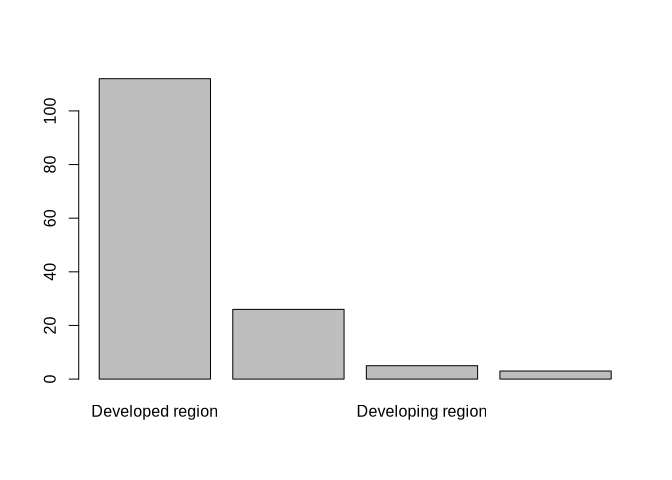
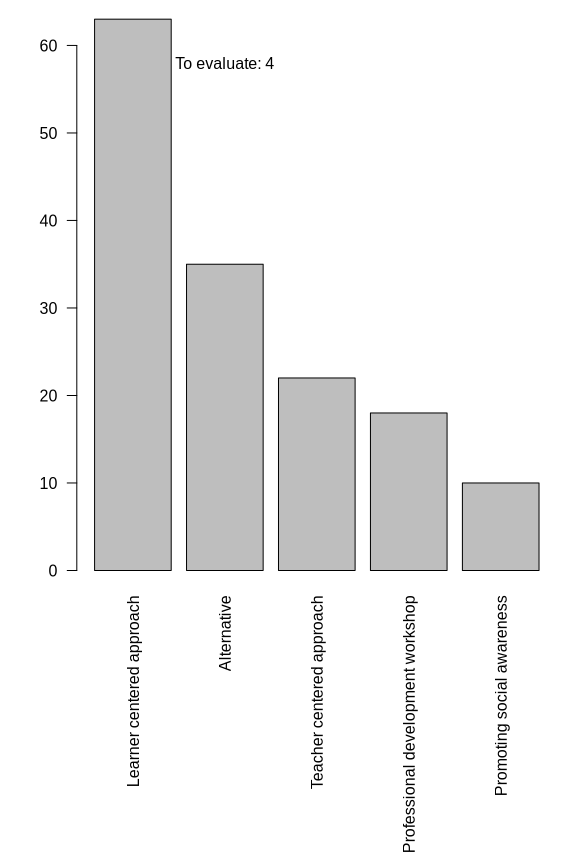

Results from the extraction: graphs and numbers
================
Marius Bottin
2023-10-09

- [1 Missing extractions](#1-missing-extractions)
- [2 Dates](#2-dates)
- [3 Countries](#3-countries)
  - [3.1 Making the map](#31-making-the-map)
- [4 Years/Region of the world](#4-yearsregion-of-the-world)
- [5 Outcomes](#5-outcomes)
- [6 Population](#6-population)
  - [6.1 Rural/urban](#61-ruralurban)
  - [6.2 categories](#62-categories)
  - [6.3 Age](#63-age)
    - [6.3.1 Adding ages from grades](#631-adding-ages-from-grades)
- [7 Controversy](#7-controversy)
- [8 Mitigation/Adaptation](#8-mitigationadaptation)
- [9 Educational framework](#9-educational-framework)
- [10 Monroe categories](#10-monroe-categories)
- [11 Theoretical framework](#11-theoretical-framework)
- [12 Methods & design](#12-methods--design)
- [13 Pedagogical tools](#13-pedagogical-tools)
- [14 Time variables](#14-time-variables)

``` r
require(openxlsx)&require(knitr)&require(kableExtra)
```

    ## Loading required package: openxlsx

    ## Loading required package: knitr

    ## Loading required package: kableExtra

    ## [1] TRUE

``` r
names(loadWorkbook("../../extraction/20231009.xlsx"))
```

    ## [1] "Guidance for search strategy" "Search strategy"             
    ## [3] "Feuille 3"                    "Inclusion-exclusion criteria"
    ## [5] "searches"                     "extraction "                 
    ## [7] "ColorCode"

``` r
rawExtract<-read.xlsx("../../extraction/20231009.xlsx",sheet = "extraction ",startRow = 2)
extract<-rawExtract
load("../../extraction/docExtract.RData")
```

# 1 Missing extractions

``` r
missin<-unlist(docExtract)[!unlist(docExtract)%in%extract$id]
missin<-missin[missin!="Saribaş2016"]
missin
```

    ##            Ana19            Ana32            Ana36         Marius10 
    ##    "Leckey2021a" "Bopardikar2021"      "Trott2020"       "Ross2021" 
    ##          Luisa11       Benjamin15 
    ##     "Turner2022"   "Schuster2018"

# 2 Dates

``` r
rawExtract$datepubl
```

    ##   [1] "2023.0"         "2016.0"         "2016.0"         "2013.0"        
    ##   [5] "2020.0"         "2021.0"         "2015.0"         "2016.0"        
    ##   [9] "2011.0"         "2018.0"         "2015.0"         "2021.0"        
    ##  [13] "2014.0"         "2021.0"         "2012.0"         "2014.0"        
    ##  [17] "2021.0"         "2012.0"         "2022.0"         "2012.0"        
    ##  [21] "2006.0"         "2015.0"         "2013.0"         "2016.0"        
    ##  [25] "2019.0"         "2017.0"         "2017.0"         "2020.0"        
    ##  [29] "2020.0"         "2018.0"         "2017.0"         "2021.0"        
    ##  [33] "2022.0"         "2012.0"         "2016.0"         "2022.0"        
    ##  [37] "2009.0"         "2012.0"         "2015.0"         "2016.0"        
    ##  [41] "2017.0"         "2022.0"         "2017.0"         "2017.0"        
    ##  [45] "2020.0"         "2015.0"         "2020.0"         "2020.0"        
    ##  [49] "2015.0"         "2022.0"         "2022.0"         "2017.0"        
    ##  [53] "January 2022"   "March 2019"     "September 2022" "2019.0"        
    ##  [57] "November 2012"  "March 2013"     "2020.0"         "2020.0"        
    ##  [61] "2022.0"         "2023.0"         "2021.0"         "2006.0"        
    ##  [65] "2021.0"         "2003.0"         "2021.0"         "1998.0"        
    ##  [69] "2013.0"         "2014.0"         "2021.0"         "2020.0"        
    ##  [73] "2022.0"         "2022.0"         "2013.0"         "2012.0"        
    ##  [77] "2021.0"         "2014.0"         "2020.0"         "2012.0"        
    ##  [81] "2015.0"         "2020.0"         "2021.0"         "2022.0"        
    ##  [85] "2020.0"         "2017.0"         "2013.0"         "2010.0"        
    ##  [89] "2019.0"         "2016.0"         "2017.0"         "2018.0"        
    ##  [93] "2020.0"         "2012.0"         "2020.0"         "2013.0"        
    ##  [97] "2019.0"         "2019.0"         "2019.0"         "2019.0"        
    ## [101] "2019.0"         "2018.0"         "2008.0"         "2018.0"        
    ## [105] "2017.0"         "2017.0"         "2012.0"         "2023.0"        
    ## [109] "2017.0"         "2012.0"         "2017.0"         "2014.0"        
    ## [113] "2014.0"         "2008.0"         "2008.0"         "2021.0"        
    ## [117] "2019.0"         "2022.0"         "2015.0"         "2019.0"        
    ## [121] "2018.0"         "2017.0"         "2014.0"         "2021.0"        
    ## [125] "2016.0"         "2022.0"         "2019.0"         "2023.0"        
    ## [129] "2010.0"         "2013.0"         "2022.0"         "2021.0"        
    ## [133] "2015.0"         "2013.0"         "2019.0"         "2015.0"        
    ## [137] "2013.0"         "2022.0"         "2021.0"         "2015.0"        
    ## [141] "2015.0"         "2006.0"         "2022.0"         "2018.0"        
    ## [145] "2022.0"         "2017.0"         "2015.0"         "2019.0"        
    ## [149] "2015.0"         "2022.0"         "2017.0"         "2022.0"        
    ## [153] "2015.0"

``` r
extract$datepubl<-as.integer(gsub("\\.0$","",gsub("^([A-Z][a-z]+ )([12][0-9]{3})","\\2",rawExtract$datepubl)))

(datesById<-tapply(extract$datepubl,extract$id,unique))
```

    ##           Akaygun2021   Aksel_Stenberdt2023             Aksut2016 
    ##                  2020                  2023                  2016 
    ##              Arya2016             Baker2013             Bentz2020 
    ##                  2016                  2013                  2020 
    ##      Bhattacharya2021             Blaum2017            Bodzin2014 
    ##                  2021                  2017                  2013 
    ##        Bofferding2015              Boon2016          Bozdogan2011 
    ##                  2015                  2016                  2011 
    ##           Breslyn2019           Cebesoy2019           Cebesoy2022 
    ##                  2019                  2019                  2020 
    ##             Chang2018        Chattuchai2015              Chin2016 
    ##                  2018                  2015                  2015 
    ##              Choi2021             Cibik2022          da_Rocha2020 
    ##                  2021                  2022                  2020 
    ##              Dal2015a      Deisenrieder2020          DeWaters2014 
    ##                  2015                  2020                  2014 
    ##           Dormody2020           Dormody2021            Drewes2018 
    ##                  2020                  2021                  2017 
    ##            Eggert2017             Faria2015        Feierabend2012 
    ##                  2017                  2017                  2012 
    ## Feldpausch_Parker2013             Flora2014           Gladwin2022 
    ##                  2013                  2014                  2022 
    ##             Gold2015a            Goulah2017         Gutierrez2022 
    ##                  2015                  2017                  2022 
    ##     Harker_Schuch2013     Harker_Schuch2020           Herrick2022 
    ##                  2013                  2019                  2022 
    ##          Holthuis2014                Hu2016          Jacobson2017 
    ##                  2014                  2016                  2017 
    ##               Jin2013             Jones2021             Kabir2015 
    ##                  2013                  2021                  2015 
    ##        Karpudewan2015       Karpudewan2015a        Karpudewan2017 
    ##                  2015                  2014                  2017 
    ##            Keller2019              Kern2017            Khadka2021 
    ##                  2019                  2017                  2021 
    ##            Kinsey2012        Klosterman2010          Kolenaty2022 
    ##                  2012                  2010                  2022 
    ##           Korfgen2017          Korsager2015           Kubisch2022 
    ##                  2017                  2015                  2022 
    ##             Kumar2023           Lambert2012           Lambert2013 
    ##                  2023                  2012                  2013 
    ##           Lawson2019a            Leckey2021            Leitao2022 
    ##                  2019                  2021                  2021 
    ##            Lester2006           Levrini2021                Li2022 
    ##                  2006                  2021                  2022 
    ##          Littrell2022               Liu2015          Lombardi2013 
    ##                  2022                  2015                  2013 
    ##            Lozano2022         Markowitz2018             Mason1998 
    ##                  2022                  2018                  1998 
    ##           McGowan2022           McNeal2014a           McNeill2012 
    ##                  2022                  2014                  2010 
    ##              Meya2018            Miller2015            Monroe2016 
    ##                  2018                  2015                  2016 
    ##            Muller2021           Muller2021a           Nafisah2022 
    ##                  2021                  2021                  2022 
    ##          Nakamura2019 Nicholas_Figueroa2017            Nkoana2020 
    ##                  2019                  2017                  2019 
    ##          Nussbaum2015          Oberauer2023            Parant2017 
    ##                  2015                  2023                  2017 
    ##              Park2020             Parth2020             Pekel2019 
    ##                  2020                  2020                  2019 
    ##          Petersen2020            Porter2012           Pruneau2003 
    ##                  2020                  2020                  2003 
    ##           Pruneau2006          Pruneau2006a           Puttick2018 
    ##                  2006                  2006                  2018 
    ##              Raes2016           Ratinen2013         Reinfried2012 
    ##                  2015                  2012                  2012 
    ##            Roscoe2013      Roychoudhury2017            Ruboon2012 
    ##                  2012                  2017                  2012 
    ##       Salas_Rueda2021         Salsabila2019          Saribaş2016  
    ##                  2021                  2019                  2016 
    ##           Schrot2021a        Schubatzky2022          Schuster2008 
    ##                  2020                  2022                  2008 
    ##          Sellmann2013         Sellmann2013a          Sellmann2015 
    ##                  2012                  2013                  2015 
    ##              Shea2016           Siegner2018             Silva2021 
    ##                  2016                  2018                  2021 
    ##            Skains2022             Smith2019        Steffensen2022 
    ##                  2022                  2019                  2022 
    ##          Sternang2012         Stevenson2018        Stevenson2018a 
    ##                  2012                  2018                  2017 
    ##           Sukardi2022           Sumrall2021          Sundberg2013 
    ##                  2022                  2021                  2013 
    ##            Sutela2023            Svihla2012             Taber2009 
    ##                  2023                  2012                  2009 
    ##          Tasquier2015          Tasquier2017             Tasti2021 
    ##                  2015                  2017                  2021 
    ##            Taylor2020             Trott2019            Trott2020a 
    ##                  2020                  2019                  2019 
    ##            Trott2020b             Trott2022             Varma2012 
    ##                  2020                  2022                  2012 
    ##       Veijalainen2013           Vicente2020       Visintainer2015 
    ##                  2013                  2020                  2015 
    ##             Walsh2018             Walsh2019              Wang2022 
    ##                  2018                  2019                  2022 
    ##             White2022          Williams2017               Xie2014 
    ##                  2022                  2016                  2014 
    ##             Zhong2021        Zografakis2008 
    ##                  2021                  2008

``` r
barplot(table(factor(datesById,levels=min(datesById):max(datesById))), las=2, main="Number of documents included in the analysis by year")
```

<!-- -->

# 3 Countries

``` r
library(stringr)
rawExtract$Countries.STUDY
```

    ##   [1] "Denmark"                                                                                                                                                               
    ##   [2] "Turkey"                                                                                                                                                                
    ##   [3] "United States; China; New Zealand;  Norway"                                                                                                                            
    ##   [4] "CANADA"                                                                                                                                                                
    ##   [5] "PORTUGAL"                                                                                                                                                              
    ##   [6] "United States"                                                                                                                                                         
    ##   [7] "United States"                                                                                                                                                         
    ##   [8] "Australia"                                                                                                                                                             
    ##   [9] "Turkey"                                                                                                                                                                
    ##  [10] "Singapore"                                                                                                                                                             
    ##  [11] "Thailand"                                                                                                                                                              
    ##  [12] "South korea, Australia"                                                                                                                                                
    ##  [13] "United States"                                                                                                                                                         
    ##  [14] "United States"                                                                                                                                                         
    ##  [15] "Germany"                                                                                                                                                               
    ##  [16] "United States"                                                                                                                                                         
    ##  [17] "United States"                                                                                                                                                         
    ##  [18] "United States"                                                                                                                                                         
    ##  [19] "Austria"                                                                                                                                                               
    ##  [20] "United States"                                                                                                                                                         
    ##  [21] "United States"                                                                                                                                                         
    ##  [22] "United States"                                                                                                                                                         
    ##  [23] "United States"                                                                                                                                                         
    ##  [24] "United States"                                                                                                                                                         
    ##  [25] "Japan"                                                                                                                                                                 
    ##  [26] "United States"                                                                                                                                                         
    ##  [27] "France"                                                                                                                                                                
    ##  [28] "Denmark"                                                                                                                                                               
    ##  [29] "Canada"                                                                                                                                                                
    ##  [30] "USA"                                                                                                                                                                   
    ##  [31] "United States"                                                                                                                                                         
    ##  [32] "Mexico"                                                                                                                                                                
    ##  [33] "Austria"                                                                                                                                                               
    ##  [34] "Germany"                                                                                                                                                               
    ##  [35] "United States"                                                                                                                                                         
    ##  [36] "Norway"                                                                                                                                                                
    ##  [37] "Australia"                                                                                                                                                             
    ##  [38] "United States"                                                                                                                                                         
    ##  [39] "United States"                                                                                                                                                         
    ##  [40] "United Kingdom"                                                                                                                                                        
    ##  [41] "Austria"                                                                                                                                                               
    ##  [42] "Brazil, Canada, Colombia, Costa Rica, Finland, Ghana, India, Indonesia, Kenya, Kuwait, Nigeria, Oman, Peru, the Philippines, Poland, Slovenia, South Korea, and Uganda"
    ##  [43] "United States"                                                                                                                                                         
    ##  [44] "United States"                                                                                                                                                         
    ##  [45] "BRASIL"                                                                                                                                                                
    ##  [46] "Turkey"                                                                                                                                                                
    ##  [47] "Spain"                                                                                                                                                                 
    ##  [48] "Turkey"                                                                                                                                                                
    ##  [49] "United States"                                                                                                                                                         
    ##  [50] "Indonesia"                                                                                                                                                             
    ##  [51] "United States"                                                                                                                                                         
    ##  [52] "Germany"                                                                                                                                                               
    ##  [53] "United States"                                                                                                                                                         
    ##  [54] "Turkey"                                                                                                                                                                
    ##  [55] "China"                                                                                                                                                                 
    ##  [56] "Indonesia"                                                                                                                                                             
    ##  [57] "Finland"                                                                                                                                                               
    ##  [58] "Finland"                                                                                                                                                               
    ##  [59] "United States"                                                                                                                                                         
    ##  [60] "Turkey"                                                                                                                                                                
    ##  [61] "Czech Republic"                                                                                                                                                        
    ##  [62] "UK"                                                                                                                                                                    
    ##  [63] "United Kingdom;Portugal"                                                                                                                                               
    ##  [64] "Canada"                                                                                                                                                                
    ##  [65] "United Kingdom"                                                                                                                                                        
    ##  [66] "Canada"                                                                                                                                                                
    ##  [67] "Italy, Finland, Iceland"                                                                                                                                               
    ##  [68] "Italy "                                                                                                                                                                
    ##  [69] "USA"                                                                                                                                                                   
    ##  [70] "USA"                                                                                                                                                                   
    ##  [71] "Puerto Rico (United States)"                                                                                                                                           
    ##  [72] "United States"                                                                                                                                                         
    ##  [73] "China"                                                                                                                                                                 
    ##  [74] "China"                                                                                                                                                                 
    ##  [75] "United States"                                                                                                                                                         
    ##  [76] "Thailand"                                                                                                                                                              
    ##  [77] "United States"                                                                                                                                                         
    ##  [78] "Malaysia"                                                                                                                                                              
    ##  [79] "New Zealand"                                                                                                                                                           
    ##  [80] "United States"                                                                                                                                                         
    ##  [81] "Belgium"                                                                                                                                                               
    ##  [82] "Austria"                                                                                                                                                               
    ##  [83] "Turkey"                                                                                                                                                                
    ##  [84] "United States"                                                                                                                                                         
    ##  [85] "Germany"                                                                                                                                                               
    ##  [86] "United States"                                                                                                                                                         
    ##  [87] "United States"                                                                                                                                                         
    ##  [88] "USA"                                                                                                                                                                   
    ##  [89] "South Africa"                                                                                                                                                          
    ##  [90] "Turkey"                                                                                                                                                                
    ##  [91] "United States"                                                                                                                                                         
    ##  [92] "Germany"                                                                                                                                                               
    ##  [93] "South Korea"                                                                                                                                                           
    ##  [94] "Switzerland"                                                                                                                                                           
    ##  [95] "Germany; Austria"                                                                                                                                                      
    ##  [96] "Germany"                                                                                                                                                               
    ##  [97] "Austria"                                                                                                                                                               
    ##  [98] "United States"                                                                                                                                                         
    ##  [99] "United States"                                                                                                                                                         
    ## [100] "United States"                                                                                                                                                         
    ## [101] "United States"                                                                                                                                                         
    ## [102] "United States"                                                                                                                                                         
    ## [103] "USA"                                                                                                                                                                   
    ## [104] "United States"                                                                                                                                                         
    ## [105] "United States"                                                                                                                                                         
    ## [106] "United States"                                                                                                                                                         
    ## [107] "Sweden"                                                                                                                                                                
    ## [108] "Finland"                                                                                                                                                               
    ## [109] "United States"                                                                                                                                                         
    ## [110] "United States"                                                                                                                                                         
    ## [111] "Australia"                                                                                                                                                             
    ## [112] "United States"                                                                                                                                                         
    ## [113] "United States"                                                                                                                                                         
    ## [114] "Greece"                                                                                                                                                                
    ## [115] "Greece"                                                                                                                                                                
    ## [116] "Brazil"                                                                                                                                                                
    ## [117] "USA"                                                                                                                                                                   
    ## [118] "USA"                                                                                                                                                                   
    ## [119] "Malaysia"                                                                                                                                                              
    ## [120] "USA"                                                                                                                                                                   
    ## [121] "United States"                                                                                                                                                         
    ## [122] "Malaysia"                                                                                                                                                              
    ## [123] "United States"                                                                                                                                                         
    ## [124] "South Africa"                                                                                                                                                          
    ## [125] "China"                                                                                                                                                                 
    ## [126] "Spain"                                                                                                                                                                 
    ## [127] "United States"                                                                                                                                                         
    ## [128] "Austria"                                                                                                                                                               
    ## [129] "United States"                                                                                                                                                         
    ## [130] "United States"                                                                                                                                                         
    ## [131] "Turkey"                                                                                                                                                                
    ## [132] "CHINA"                                                                                                                                                                 
    ## [133] "Taiwan"                                                                                                                                                                
    ## [134] "Austria; Denmark"                                                                                                                                                      
    ## [135] "Austria; Australia"                                                                                                                                                    
    ## [136] "Bangladesh"                                                                                                                                                            
    ## [137] "United States"                                                                                                                                                         
    ## [138] "United States"                                                                                                                                                         
    ## [139] "South Africa"                                                                                                                                                          
    ## [140] "Norway"                                                                                                                                                                
    ## [141] "Italy"                                                                                                                                                                 
    ## [142] "Canada"                                                                                                                                                                
    ## [143] "United Kingdom"                                                                                                                                                        
    ## [144] "United States"                                                                                                                                                         
    ## [145] "Indonesia"                                                                                                                                                             
    ## [146] "Italy"                                                                                                                                                                 
    ## [147] "Germany"                                                                                                                                                               
    ## [148] "Turkey"                                                                                                                                                                
    ## [149] "Greenland; Denmark; United States"                                                                                                                                     
    ## [150] "United States"                                                                                                                                                         
    ## [151] "United States"                                                                                                                                                         
    ## [152] "Brazil; Canada; Colombia; Costa Rica; Finland; Ghana; India; Indonesia; Kenya; Kuwait; Nigeria; Oman; Peru; Philippines; Poland; Slovenia; South Korea; Uganda"        
    ## [153] "United States"

``` r
extract$Countries.STUDY[extract$id=="Arya2016"]<-"United States;China;New Zealand;Norway"
extract$Countries.STUDY<-gsub("Puerto Rico \\(United States\\)","United States",gsub("Estados Unidos","United States",gsub("BRASIL","Brazil",gsub("UK","United Kingdom",gsub("USA","United States",extract$Countries.STUDY)))))
sepCountry <- strsplit(extract$Countries.STUDY,"[,;]")
countryStudy<-data.frame(id=rep(rawExtract$id,sapply(sepCountry,length)),
           country=unlist(sepCountry))
countryStudy$country<-str_to_title(gsub(" +$","",gsub("^and ","",gsub("^ +","",countryStudy$country))))
(nbBycountry<-sort(tapply(countryStudy$id,countryStudy$country,function(x)length(unique(x))),decreasing = T))
```

    ##   United States          Turkey         Austria         Germany          Canada 
    ##              61              10               9               8               6 
    ##       Australia           China         Finland  United Kingdom         Denmark 
    ##               5               5               5               5               4 
    ##       Indonesia           Italy          Brazil        Malaysia          Norway 
    ##               4               4               3               3               3 
    ##    South Africa     South Korea     New Zealand        Portugal           Spain 
    ##               3               3               2               2               2 
    ##        Thailand      Bangladesh         Belgium        Colombia      Costa Rica 
    ##               2               1               1               1               1 
    ##  Czech Republic          France           Ghana          Greece       Greenland 
    ##               1               1               1               1               1 
    ##         Iceland           India           Japan           Kenya          Kuwait 
    ##               1               1               1               1               1 
    ##          Mexico         Nigeria            Oman            Peru     Philippines 
    ##               1               1               1               1               1 
    ##          Poland       Singapore        Slovenia          Sweden     Switzerland 
    ##               1               1               1               1               1 
    ##          Taiwan The Philippines          Uganda 
    ##               1               1               1

## 3.1 Making the map

``` r
require(rnaturalearth)
```

    ## Loading required package: rnaturalearth

    ## The legacy packages maptools, rgdal, and rgeos, underpinning the sp package,
    ## which was just loaded, were retired in October 2023.
    ## Please refer to R-spatial evolution reports for details, especially
    ## https://r-spatial.org/r/2023/05/15/evolution4.html.
    ## It may be desirable to make the sf package available;
    ## package maintainers should consider adding sf to Suggests:.

    ## Support for Spatial objects (`sp`) will be deprecated in {rnaturalearth} and will be removed in a future release of the package. Please use `sf` objects with {rnaturalearth}. For example: `ne_download(returnclass = 'sf')`

``` r
require(sf)
```

    ## Loading required package: sf

    ## Linking to GEOS 3.11.0, GDAL 3.7.0, PROJ 9.2.1; sf_use_s2() is TRUE

``` r
worldMap_tot<-ne_countries(returnclass = "sf")
namesCountries<-names(nbBycountry)
pbs<-namesCountries[!(namesCountries%in%worldMap_tot$name_long|namesCountries%in%worldMap_tot$name)]
if(length(pbs>0)){warning("the following countries are not found and will be ignored:",pbs)}
```

    ## Warning: the following countries are not found and will be ignored:SingaporeThe
    ## Philippines

``` r
nbBycountry<-nbBycountry[!namesCountries%in%pbs]
namesCountries<-names(nbBycountry)
orderCt<-match(namesCountries,worldMap_tot$name_long)
orderCt[is.na(orderCt)]<-match(namesCountries[is.na(orderCt)],worldMap_tot$name)
#Colors
scaleNb<-rep(NA,length(nbBycountry))
scaleNb[nbBycountry==1]<-1
scaleNb[nbBycountry>1]<-2
scaleNb[nbBycountry>3]<-3
scaleNb[nbBycountry>5]<-4
scaleNb[nbBycountry>10]<-5
colorsScale<-c("#fafa6e","#f8cf55","#f6993c","#f35824","#ee0e0e")
par(mar=c(1,1,1,1))
plot(st_geometry(worldMap_tot),border="grey",lwd=0.5)
plot(st_geometry(worldMap_tot[orderCt,]),border="black",lwd=0.7,col=colorsScale[scaleNb],add=T)
legend("bottomleft",title="# Documents",fill=colorsScale,legend=c("1","2-3","4-5","5-10",">10"))
```

<!-- -->

``` r
countryStudy$FinalName<-NA
countryStudy$FinalName<-worldMap_tot[match(countryStudy$country,worldMap_tot$name),]$name
countryStudy$FinalName[is.na(countryStudy$FinalName)]<-worldMap_tot[match(countryStudy$country[is.na(countryStudy$FinalName)],worldMap_tot$name_long),]$name

countryDoc <- tapply(countryStudy$FinalName,countryStudy$id,function(x)
  {
  if(length(unique(x))==1){return(x[1])}else{return("Multiple")}
})
```

# 4 Years/Region of the world

``` r
REG<-factor(worldMap_tot$region_wb[worldMap_tot$region_wb!="Antarctica"])
plot(st_geometry(worldMap_tot[worldMap_tot$region_wb!="Antarctica",]),col=rainbow(nlevels(REG))[REG])
```

<!-- -->

``` r
countryStudy$region<-NA
countryStudy$region<-worldMap_tot[match(countryStudy$country,worldMap_tot$name_long),"region_wb"]$region_wb
countryStudy$region[is.na(countryStudy$region)]<-worldMap_tot[match(countryStudy$country[is.na(countryStudy$region)],worldMap_tot$name),"region_wb"]$region_wb
regionPapers<-factor(tapply(countryStudy$region,countryStudy$id,function(x){
  if(length(unique(x))==1){return(x[1])}else{return("Multiple")}
}),levels=c(levels(REG),"Multiple"))
yearPaper<-factor(datesById,levels=min(datesById):max(datesById))
TAB_year_region<-table(regionPapers,yearPaper[names(regionPapers)])
TAB_year_region<-TAB_year_region[as.logical(rowSums(TAB_year_region)),]
TAB_year_region<-TAB_year_region[order(rowSums(TAB_year_region),decreasing=T),]

A<-barplot(TAB_year_region,las=2,col=rainbow(nrow(TAB_year_region)),legend=T,args.legend = list(x="topleft"))
events <- c("United nations: Climate\nchange education framework","UNESCO: Climate Change\nEducation for Sustainable\nDevelopment program","Paris Agreement\nand SDG adoption")
dates <- c(1994,2010,2015)
events <-events[dates>min(as.numeric(colnames(TAB_year_region)))]
dates<-dates[dates>min(as.numeric(colnames(TAB_year_region)))]
datesOnGraph <-A[dates - as.numeric(min(as.numeric(colnames(TAB_year_region)), na.rm = T)) +1]
arrows(x0=datesOnGraph,y0=c(5,13),y1=rep(0,2),x1=datesOnGraph,length = .2,col="black", lwd=2)
text(datesOnGraph,c(6,13.5),events, cex=.7)
```

<!-- -->

# 5 Outcomes

``` r
didItWork_col<-colnames(extract)[grep("it.work",colnames(extract))]
barplot(colSums(!is.na(extract[c("knowledge","awareness","intention","emotion","action","habit","Other")])))
```

<!-- -->

``` r
withOutcome<-which(!is.na(extract[c("knowledge","awareness","intention","emotion","action","habit","Other")]),arr.ind=T)
outcomeEffect<-data.frame(id=extract$id[withOutcome[,1]],
           outcome=c("knowledge","awareness","intention","emotion","action","habit","Other")[withOutcome[,2]],
           effect=extract[didItWork_col][withOutcome]
           )
outcomeEffect$effect_simp<-NA
outcomeEffect$effect_simp[outcomeEffect$effect%in%c("yes","YES","Yes")]<-"Yes"
outcomeEffect$effect_simp[outcomeEffect$effect%in%c("no","No","NO")]<-"No"
outcomeEffect$effect_simp[is.na(outcomeEffect$effect_simp)]<-"Unclear"
barplot(t(table(factor(outcomeEffect$outcome,levels=c("knowledge","awareness","intention","emotion","action","habit","Other")),factor(outcomeEffect$effect_simp,levels=c("Yes","Unclear","No")))),las=2, legend=T, args.legend = list(title="Efficient:"))
```

<!-- -->

# 6 Population

## 6.1 Rural/urban

``` r
sort(table(extract$urban.vs.rural))
```

    ## 
    ##                                                                                          ND 
    ##                                                                                           1 
    ##                               one urban and three rural schools\nparticipated in this study 
    ##                                                                                           1 
    ## one was located in a small coastal village and the other situated in a town further inland. 
    ##                                                                                           1 
    ##                                                                                       rural 
    ##                                                                                           1 
    ##                                                     school that is located close to the sea 
    ##                                                                                           1 
    ##                                                                 Sub-urban and rural schools 
    ##                                                                                           1 
    ##                                                                                    suburban 
    ##                                                                                           1 
    ##                                                                                     Unknown 
    ##                                                                                           1 
    ##                                                                  urban, suburban, and rural 
    ##                                                                                           1 
    ##                                                                             Urban and rural 
    ##                                                                                           2 
    ##                                                                                      Urban  
    ##                                                                                           3 
    ##                                                                                        both 
    ##                                                                                           4 
    ##                                                                                       Rural 
    ##                                                                                           5 
    ##                                                                                        Both 
    ##                                                                                           8 
    ##                                                                                       urban 
    ##                                                                                          38 
    ##                                                                                       Urban 
    ##                                                                                          51

``` r
rururbClean<-factor(rep(NA,nrow(extract)),levels=c("Urban","Rural","Both","Not given"))
rururbClean[grep("^ ?urban ?$",extract$urban.vs.rural,ignore.case = T)]<-"Urban"
rururbClean[grep("^ ?rural ?$",extract$urban.vs.rural,ignore.case = T)]<-"Rural"
rururbClean[grep("^ ?both ?$",extract$urban.vs.rural,ignore.case = T)]<-"Both"
rururbClean[grepl("urban",extract$urban.vs.rural,ignore.case = T)&grepl("rural",extract$urban.vs.rural,ignore.case = T)]<-"Both"
table(extract$urban.vs.rural[is.na(rururbClean)])
```

    ## 
    ##                                                                                          ND 
    ##                                                                                           1 
    ## one was located in a small coastal village and the other situated in a town further inland. 
    ##                                                                                           1 
    ##                                                     school that is located close to the sea 
    ##                                                                                           1 
    ##                                                                                    suburban 
    ##                                                                                           1 
    ##                                                                                     Unknown 
    ##                                                                                           1

``` r
table(rururbClean,useNA="ifany")
```

    ## rururbClean
    ##     Urban     Rural      Both Not given      <NA> 
    ##        92         6        17         0        38

``` r
rururbClean[is.na(rururbClean)]<-"Not given"
barplot(table(rururbClean))
```

<!-- -->

## 6.2 categories

``` r
extract$TARGETED.SAMPLE<-gsub(" $","",extract$TARGETED.SAMPLE)
sort(table(extract$TARGETED.SAMPLE,useNA="ifany"),decreasing=T)
```

    ## 
    ##              students  Entourage (Teachers)  pre-service teachers 
    ##                   114                    16                     9 
    ##              Students   Entourage (parents)               parents 
    ##                     5                     4                     1 
    ## students and teachers    students; teachers              teachers 
    ##                     1                     1                     1 
    ## Teachers and students 
    ##                     1

``` r
#For student ages
extract$student<-extract$TARGETED.SAMPLE%in%c("Students","students")

# For population categories
extract$students<-grepl("student",extract$TARGETED.SAMPLE,ignore.case = T)
extract$teachers<-grepl("teacher",extract$TARGETED.SAMPLE,ignore.case = T)&extract$TARGETED.SAMPLE!="pre-service teachers"
extract$PS_teachers<-extract$TARGETED.SAMPLE=="pre-service teachers"
extract$parents<-grepl("parent",extract$TARGETED.SAMPLE,ignore.case = T)
resPopul<-by(extract[c("students","teachers","PS_teachers","parents")],extract$id,function(tab)
{
  popul<-apply(tab,2,any)
  if(length(popul[popul])>1){return("mixed")}else{return(names(popul)[popul])}
},simplify = T
  )
populClean<-Reduce(c,resPopul)
names(populClean)<-names(resPopul)
populClean[populClean=="students"]<-"Students"
populClean[populClean=="teachers"]<-"Teachers"
populClean[populClean=="PS_teachers"]<-"Pre-service teachers"
populClean[populClean=="parents"]<-"Parents"
populClean[populClean=="mixed"]<-"Mixed"
populClean<-factor(populClean,levels=names(sort(table(populClean),decreasing = T)))
par(mar=c(10,4,1,1))
barplot(table(populClean,useNA = "ifany"),las=2)
```

<!-- -->

## 6.3 Age

``` r
extract$age_min[extract$student]
```

    ##   [1] NA     "13.0" NA     "16.0" NA     "11.0" NA     NA     NA     NA    
    ##  [11] NA     NA     NA     "15.0" NA     "13.0" NA     NA     "13.0" "14.0"
    ##  [21] NA     NA     NA     NA     NA     NA     "15.0" "15.0" "15.0" NA    
    ##  [31] NA     NA     "7.0"  "13.0" "14.0" NA     "10.0" "10.0" NA     NA    
    ##  [41] NA     "11.0" "13.0" "16.0" NA     "12.0" "9.0"  "11.0" "9.0"  "9.0" 
    ##  [51] "13.0" "16.0" "10.0" "11.0" NA     "12.0" "10.0" NA     NA     "16.0"
    ##  [61] NA     NA     "14.0" "17.0" "15.0" NA     NA     NA     NA     "13.0"
    ##  [71] "ND"   NA     "11.0" "15.0" "13.0" "10.0" NA     NA     NA     NA    
    ##  [81] "15.0" NA     "11.0" NA     NA     "13.0" NA     "10.0" "10.0" NA    
    ##  [91] "16.0" "16.0" NA     NA     "10.0" "15.0" NA     "10.0" NA     "8.0" 
    ## [101] NA     "16.0" "12.0" NA     NA     NA     "17.0" "16.0" "12.0" "11.0"
    ## [111] NA     "16.0" "15.0" "15.0" NA     "11.0" "17.0" "14.0" NA

``` r
extract$age_max[extract$student]
```

    ##   [1] NA             "17.0"         NA             "18.0"         NA            
    ##   [6] "18.0"         NA             NA             NA             NA            
    ##  [11] NA             NA             NA             "16.0"         NA            
    ##  [16] "16.0"         NA             NA             "14.0"         "15.0"        
    ##  [21] NA             "16.0"         NA             NA             NA            
    ##  [26] NA             "18.0"         "19.0"         "16.0"         NA            
    ##  [31] NA             NA             "9.0"          "15.0"         "18.0"        
    ##  [36] NA             "11.0"         "11.0"         NA             NA            
    ##  [41] NA             "15.0"         "14.0"         "18.0"         NA            
    ##  [46] "17.0"         "14.0"         "14.0"         "17.0"         "10.0"        
    ##  [51] "14.0"         "19.0"         "11.0"         "14.0"         NA            
    ##  [56] "17.0"         "12.0"         NA             NA             "17.0"        
    ##  [61] NA             NA             "17.0"         "18.0"         "18.0"        
    ##  [66] NA             NA             NA             NA             "16.0"        
    ##  [71] "ND"           NA             "16.0"         "19.0"         "15.0"        
    ##  [76] "12.0"         NA             NA             NA             NA            
    ##  [81] "16.0"         NA             "12.0"         NA             NA            
    ##  [86] "18.0"         NA             "12.0"         "12.0"         NA            
    ##  [91] "18.0"         "16.0"         NA             NA             "13.0"        
    ##  [96] "17.0"         NA             "19.0"         NA             "12.0"        
    ## [101] NA             "17.0"         "13.0"         NA             NA            
    ## [106] NA             "17.0"         "17.0"         "15.0"         "15 and older"
    ## [111] NA             "18.0"         "19.0"         "16.0"         NA            
    ## [116] "14.0"         "17.0"         "18.0"         NA

``` r
extract$mean.age[extract$student]
```

    ##   [1] "17.68 " NA       NA       NA       NA       NA       NA       NA      
    ##   [9] NA       NA       NA       NA       NA       NA       NA       NA      
    ##  [17] NA       NA       NA       NA       NA       "16.0"   NA       NA      
    ##  [25] NA       NA       "17.0"   NA       NA       NA       NA       NA      
    ##  [33] NA       NA       NA       NA       NA       NA       "14.0"   "17.16" 
    ##  [41] NA       NA       NA       NA       NA       NA       NA       NA      
    ##  [49] NA       NA       NA       NA       NA       NA       NA       NA      
    ##  [57] "11.1"   "10.5"   "13.5"   NA       "13.5"   "12.5"   "15.55"  NA      
    ##  [65] NA       NA       "13.2"   NA       NA       "15.5"   NA       "14.0"  
    ##  [73] NA       NA       NA       NA       NA       NA       NA       NA      
    ##  [81] NA       NA       NA       "14.0"   NA       NA       NA       "11.1"  
    ##  [89] "11.1"   "11.0"   " "      "16.0"   NA       NA       NA       "16.0"  
    ##  [97] NA       NA       NA       NA       NA       NA       NA       NA      
    ## [105] NA       NA       "17.0"   NA       NA       NA       NA       NA      
    ## [113] NA       "ND"     NA       NA       "17.0"   NA       NA

``` r
extract$age_min_stud<-NA
extract$age_max_stud<-NA
extract$age_aver_stud<-NA
extract$age_stud_no_info<-NA
extract$age_min_stud[extract$student]<-as.numeric(gsub(" \\[Extracted from grade\\]","",extract$age_min[extract$student]))
```

    ## Warning: NAs introduced by coercion

``` r
extract$age_max_stud[extract$student]<-as.numeric(gsub(" \\[Extracted from grade\\]","",extract$age_max[extract$student]))
```

    ## Warning: NAs introduced by coercion

``` r
extract$age_aver_stud[extract$student]<-as.numeric(gsub("\\[Extracted from grade\\]","",extract$mean.age[extract$student]))
```

    ## Warning: NAs introduced by coercion

``` r
extract[extract$student,"age_stud_no_info"]<-apply(extract[extract$student,c("age_min_stud","age_max_stud","age_aver_stud")],1,function(x)all(is.na(x)))
extract[extract$student,"age_stud_type_info"]<-apply(extract[extract$student,c("age_min_stud","age_max_stud","age_aver_stud")],1,function(x){
    if(!is.na(x[1]) & !is.na(x[2]) & !is.na(x[3])){return("all")}
    if(!is.na(x[1]) & !is.na(x[2]) & is.na(x[3])){return("minmax")}
    if(is.na(x[1]) & is.na(x[2]) & !is.na(x[3])){return("mean")}
    if(sum(!is.na(x[1]) & !is.na(x[2]))==1 ){return("missingminmax")}else{return(NA)}
    
  })

#extract[extract$student,c("age_min","age_max","mean.age","age_min_stud","age_max_stud","age_aver_stud","age_stud_no_info","age_stud_type_info")]
table(extract$age_stud_type_info[extract$student],useNA = "always")
```

    ## 
    ##    all   mean minmax   <NA> 
    ##     10     11     50     48

``` r
age_order<- rep(NA,sum(!is.na(extract$age_stud_type_info)))
age_order[extract$age_stud_type_info[!is.na(extract$age_stud_type_info)]%in%c("all","mean")]<- extract[!is.na(extract$age_stud_type_info)&extract$age_stud_type_info%in%c("all","mean"),"age_aver_stud"]
age_order[extract$age_stud_type_info[!is.na(extract$age_stud_type_info)]%in%c("minmax")]<-rowMeans( extract[!is.na(extract$age_stud_type_info)&extract$age_stud_type_info%in%c("minmax"),c("age_min_stud","age_max_stud")])
order(age_order)
```

    ##  [1] 12 26 60 15 16 29 33 47 54 32 52 53 23 49 57 24 30 37 62 69 19 25 41  7 20
    ## [26] 27 34 36 44 65 13 17 43 46 50  4  6  8 22 31 59  2  5 11 42 48 51 68 38 14
    ## [51] 56 58 71 35 40 61 64  3  9 10 21 45 55 63 66 67 70 18 28 39  1

``` r
tabForPlot<-extract[!is.na(extract$age_stud_type_info),c("age_min_stud","age_max_stud","age_aver_stud","age_stud_no_info","age_stud_type_info")][order(age_order),]
plot(x=age_order[order(age_order)],y=1:nrow(tabForPlot),type="n",xlim=range(tabForPlot[,c("age_min_stud","age_max_stud")],na.rm=T), xlab="Age",ylab="",yaxt="n")
segments(tabForPlot$age_min_stud[tabForPlot$age_stud_type_info%in%c("minmax","all")],(1:nrow(tabForPlot))[tabForPlot$age_stud_type_info%in%c("minmax","all")], tabForPlot$age_max_stud[tabForPlot$age_stud_type_info%in%c("minmax","all")])
points(tabForPlot$age_aver_stud[tabForPlot$age_stud_type_info%in%c("mean","all")],(1:nrow(tabForPlot))[tabForPlot$age_stud_type_info%in%c("mean","all")],pch=3,cex=.5)
```

<!-- -->

### 6.3.1 Adding ages from grades

``` r
extract[is.na(extract[,"age_stud_type_info"])&!is.na(as.numeric(extract$Age_min.from.grade.))&!is.na(as.numeric(extract$Age_max.from.grade)),"age_stud_type_info"]<-"minmaxFromGrade"
```

    ## Warning in `[<-.data.frame`(`*tmp*`, is.na(extract[, "age_stud_type_info"]) & :
    ## NAs introduced by coercion

    ## Warning in `[<-.data.frame`(`*tmp*`, is.na(extract[, "age_stud_type_info"]) & :
    ## NAs introduced by coercion

``` r
tabForPlot<-rbind(
  tabForPlot,
  data.frame(age_min_stud=as.numeric(extract$Age_min.from.grade.[!is.na(extract$age_stud_type_info)&extract$age_stud_type_info=="minmaxFromGrade"]),
             age_max_stud=as.numeric(extract$Age_max.from.grade[!is.na(extract$age_stud_type_info)&extract$age_stud_type_info=="minmaxFromGrade"]),
             age_aver_stud=NA,
             age_stud_no_info=T,
             age_stud_type_info="minmaxFromGrade")
)
tabForPlot$age_min_stud<-as.integer(tabForPlot$age_min_stud)
tabForPlot$age_max_stud<-as.integer(tabForPlot$age_max_stud)

age_order<- rep(NA,sum(!is.na(tabForPlot$age_stud_type_info)))
age_order[tabForPlot$age_stud_type_info[!is.na(tabForPlot$age_stud_type_info)]%in%c("all","mean")]<- tabForPlot[!is.na(tabForPlot$age_stud_type_info)&tabForPlot$age_stud_type_info%in%c("all","mean"),"age_aver_stud"]
age_order[tabForPlot$age_stud_type_info[!is.na(tabForPlot$age_stud_type_info)]%in%c("minmax","minmaxFromGrade")]<-rowMeans( tabForPlot[!is.na(tabForPlot$age_stud_type_info)&tabForPlot$age_stud_type_info%in%c("minmax","minmaxFromGrade"),c("age_min_stud","age_max_stud")])
order(age_order)
```

    ##   [1] 130   1  91 108 111  72 102   2   3   4   5   6   7  97   8   9  87  95
    ##  [19]  98  10  11  12  13  14  15 115 116 117 119 120 128  78  79  80  81  88
    ##  [37]  90  92  93 100 112 122 123  16  17  18  19  20  82  86 125 132 133 134
    ##  [55]  21  22  23  24  25  26  27  28  29  30  85  96  99 105 106  31  32  33
    ##  [73]  34  35 129  36  37  38  39  40  41  84 103 104 131  42  74  75  77  43
    ##  [91]  44  45  46  47  48  83  89  94 109 110 121  49  50  51  52  53  73 101
    ## [109] 107 113 118 124 126  54  55  56  57  76  58  59  60  61  62  63  64  65
    ## [127]  66  67 114 127 135  68  69  70  71

``` r
tabForPlot<-tabForPlot[order(age_order),]
plot(x=age_order[order(age_order)],y=1:nrow(tabForPlot),type="n",xlim=range(tabForPlot[,c("age_min_stud","age_max_stud")],na.rm=T), xlab="Age",ylab="",yaxt="n")
segments(
  x0=tabForPlot$age_min_stud[tabForPlot$age_stud_type_info%in%c("minmax","all")],
  y0=(1:nrow(tabForPlot))[tabForPlot$age_stud_type_info%in%c("minmax","all")],
  x1=tabForPlot$age_max_stud[tabForPlot$age_stud_type_info%in%c("minmax","all")])
segments(
  x0=tabForPlot$age_min_stud[tabForPlot$age_stud_type_info%in%c("minmaxFromGrade")],
  y0=(1:nrow(tabForPlot))[tabForPlot$age_stud_type_info%in%c("minmaxFromGrade")],
  x1=tabForPlot$age_max_stud[tabForPlot$age_stud_type_info%in%c("minmaxFromGrade")],lty=3,lwd=.5)

points(tabForPlot$age_aver_stud[tabForPlot$age_stud_type_info%in%c("mean","all")],(1:nrow(tabForPlot))[tabForPlot$age_stud_type_info%in%c("mean","all")],pch=3,cex=.5)
legend("topleft",lwd=c(1,.5,NA),lty=c(1,3,NA),pch=c(NA,NA,3),legend=c("Range given","Range from grades","Average given"))
```

<!-- -->

# 7 Controversy

``` r
table(extract$Controversy,useNA="always")
```

    ## 
    ##   no   No   NO  no   yes  Yes <NA> 
    ##   31   79    4    1    5   30    3

``` r
extract$controv_clean<-NA
extract$controv_clean[grep("no",extract$Controversy,ignore.case=T)]<-"No"
extract$controv_clean[grep("yes",extract$Controversy,ignore.case=T)]<-"Yes"
#extract[c("controv_clean","Controversy")]
table(extract$controv_clean,useNA="ifany")
```

    ## 
    ##   No  Yes <NA> 
    ##  115   35    3

``` r
controvByDoc<-tapply(extract$controv_clean,extract$id,function(x)
  {
    if(any(na.omit(x)=="Yes")){return("Yes")}else if(any(na.omit(x)=="No")){return("No")}else{return(NA)}
  })
(A<-table(countryDoc[names(controvByDoc)],factor(controvByDoc,levels=c("No","Yes")),useNA="ifany"))
```

    ##                           
    ##                            No Yes <NA>
    ##   Australia                 3   0    0
    ##   Austria                   5   1    0
    ##   Bangladesh                1   0    0
    ##   Belgium                   0   1    0
    ##   Brazil                    2   0    0
    ##   Canada                    5   0    0
    ##   China                     4   0    0
    ##   Czechia                   1   0    0
    ##   Denmark                   2   0    0
    ##   Finland                   2   1    0
    ##   France                    1   0    0
    ##   Germany                   6   0    1
    ##   Greece                    1   0    0
    ##   Indonesia                 3   0    0
    ##   Italy                     1   2    0
    ##   Japan                     1   0    0
    ##   Malaysia                  3   0    0
    ##   Mexico                    1   0    0
    ##   Multiple                  6   3    0
    ##   New Zealand               1   0    0
    ##   Norway                    2   0    0
    ##   Portugal                  1   0    0
    ##   South Africa              3   0    0
    ##   South Korea               1   0    0
    ##   Spain                     2   0    0
    ##   Sweden                    1   0    0
    ##   Switzerland               1   0    0
    ##   Taiwan                    1   0    0
    ##   Thailand                  2   0    0
    ##   Turkey                   10   0    0
    ##   United Kingdom            4   0    0
    ##   United States of America 34  24    1
    ##   <NA>                      0   1    0

``` r
(PercentageControversy<-A[,2]/rowSums(A))
```

    ##                Australia                  Austria               Bangladesh 
    ##                0.0000000                0.1666667                0.0000000 
    ##                  Belgium                   Brazil                   Canada 
    ##                1.0000000                0.0000000                0.0000000 
    ##                    China                  Czechia                  Denmark 
    ##                0.0000000                0.0000000                0.0000000 
    ##                  Finland                   France                  Germany 
    ##                0.3333333                0.0000000                0.0000000 
    ##                   Greece                Indonesia                    Italy 
    ##                0.0000000                0.0000000                0.6666667 
    ##                    Japan                 Malaysia                   Mexico 
    ##                0.0000000                0.0000000                0.0000000 
    ##                 Multiple              New Zealand                   Norway 
    ##                0.3333333                0.0000000                0.0000000 
    ##                 Portugal             South Africa              South Korea 
    ##                0.0000000                0.0000000                0.0000000 
    ##                    Spain                   Sweden              Switzerland 
    ##                0.0000000                0.0000000                0.0000000 
    ##                   Taiwan                 Thailand                   Turkey 
    ##                0.0000000                0.0000000                0.0000000 
    ##           United Kingdom United States of America                     <NA> 
    ##                0.0000000                0.4067797                1.0000000

``` r
barplot(PercentageControversy,las=2)
```

<!-- -->

``` r
sum(controvByDoc=="Yes"&countryDoc[names(controvByDoc)]=="United States of America",na.rm = T)/sum(controvByDoc=="Yes",na.rm=T)
```

    ## [1] 0.7272727

``` r
sum(countryDoc[names(controvByDoc)]=="United States of America",na.rm=T)/length(countryDoc)
```

    ## [1] 0.4041096

``` r
sum(controvByDoc=="Yes"&countryDoc[names(controvByDoc)]=="United States of America",na.rm = T)/sum(countryDoc[names(controvByDoc)]=="United States of America",na.rm=T)
```

    ## [1] 0.4067797

``` r
par(mar=c(11,4,1,1))
barplot(t(A[order(A[,2],A[,1],decreasing=T),1:2]),beside=T,col=c("blue","red"),las=2,legend=T,args.legend = list(title="Controversy"))
```

<!-- -->

# 8 Mitigation/Adaptation

``` r
table(extract$`Final.mitigation/adaptation`,useNA = 'always')/sum(table(extract$`Final.mitigation/adaptation`,useNA = 'always'))
```

    ## 
    ##  Adaptation        Both  mitigation  Mitigation     Neither        <NA> 
    ## 0.032679739 0.267973856 0.006535948 0.620915033 0.039215686 0.032679739

``` r
barplot(table(factor(extract$`Final.mitigation/adaptation`,levels=c("Mitigation","Adaptation","Both","Neither"))))
```

<!-- -->
\# Disciplines

``` r
par(mar=c(8,4,1,1))
sort(table(extract$Disciplin_2))
```

    ## 
    ##            Other  Social Sciences          Science  Social sciences 
    ##                1                1                2                2 
    ##            STEAM        Education             STEM            Mixed 
    ##                2                3                8               15 
    ##              NA  Natural Sciences 
    ##               18               70

``` r
disciplineClean<- extract$Disciplin_2
disciplineClean[grepl("^Social",extract$Disciplin_2)]<-"Social Sciences"
disciplineClean[grepl("STEAM",extract$Disciplin_2)]<-"Mixed"
disciplineClean[grepl("NA",extract$Disciplin_2)|is.na(extract$Disciplin_2)]<-"ND"
barplot(sort(table(disciplineClean),decreasing=T), las=2)
```

<!-- -->

# 9 Educational framework

We’ve got a problem, most of the extracted papers just do not have the
information:

``` r
edFrameNb<-table(extract$`Normative.Climate.Change.EDUCATIONAL.framework.(global/local)`,useNA="ifany")
edFrameNb<-edFrameNb[order(edFrameNb,decreasing=T)]

tabEdFrame<-data.frame(
    EducationalFramework=names(edFrameNb),
    nb=as.numeric(edFrameNb),
    ids=sapply(names(edFrameNb),function(x,tab)paste(na.omit(tab$id[tab$`Normative.Climate.Change.EDUCATIONAL.framework.(global/local)`==x]),collapse=", "), tab=extract)
  ,row.names = NULL)
tabEdFrame[is.na(tabEdFrame$EducationalFramework),3]<-paste(extract$id[is.na(extract$`Normative.Climate.Change.EDUCATIONAL.framework.(global/local)`)],collapse=", ")
kable(tabEdFrame)
```

<table>
<thead>
<tr>
<th style="text-align:left;">

EducationalFramework

</th>
<th style="text-align:right;">

nb

</th>
<th style="text-align:left;">

ids

</th>
</tr>
</thead>
<tbody>
<tr>
<td style="text-align:left;">

NA

</td>
<td style="text-align:right;">

51

</td>
<td style="text-align:left;">

Baker2013, Bentz2020, Bozdogan2011, Chang2018, Holthuis2014, Kinsey2012,
Lambert2012, Lombardi2013, Nicholas_Figueroa2017, Petersen2020,
Puttick2018, Salas_Rueda2021, Schubatzky2022, Sellmann2013, Shea2016,
Steffensen2022, Taber2009, Varma2012, Williams2017, Korfgen2017,
Cebesoy2019, Dormody2020, Kolenaty2022, Kumar2023, Mason1998,
Feldpausch_Parker2013, Roscoe2013, Raes2016, McGowan2022,
Klosterman2010, Saribaş2016 , Reinfried2012, Sellmann2013a,
Sternang2012, Sutela2023, Stevenson2018a, Xie2014, Xie2014, Trott2019,
Trott2022, Markowitz2018, Zhong2021, Harker_Schuch2013,
Harker_Schuch2020, Lambert2013, Littrell2022, Skains2022, Stevenson2018,
Sukardi2022, Pekel2019, Nussbaum2015

</td>
</tr>
<tr>
<td style="text-align:left;">

Local

</td>
<td style="text-align:right;">

34

</td>
<td style="text-align:left;">

Visintainer2015, Vicente2020, Gold2015a, Nafisah2022, White2022,
Eggert2017, Herrick2022, Salsabila2019, Leitao2022, Pruneau2006,
Jones2021, Pruneau2003, Flora2014, Leckey2021, Trott2020b, Li2022,
Li2022, Sumrall2021, Taylor2020, Parth2020, Jin2013, Kern2017, Park2020,
Deisenrieder2020, Trott2020a, Walsh2018, Drewes2018, Drewes2018,
Karpudewan2015, Lozano2022, Smith2019, McNeill2012, Chin2016,
Pruneau2006a

</td>
</tr>
<tr>
<td style="text-align:left;">

global

</td>
<td style="text-align:right;">

14

</td>
<td style="text-align:left;">

Aksel_Stenberdt2023, Aksut2016, Arya2016, Bhattacharya2021, Boon2016,
Choi2021, Khadka2021, Monroe2016, Parant2017, Roychoudhury2017,
Gladwin2022, Veijalainen2013, Meya2018, Gutierrez2022

</td>
</tr>
<tr>
<td style="text-align:left;">

local

</td>
<td style="text-align:right;">

12

</td>
<td style="text-align:left;">

Bofferding2015, Dormody2021, Feierabend2012, Lester2006, Liu2015,
Nakamura2019, Faria2015, Faria2015, Ratinen2013, Breslyn2019,
Sellmann2015, Goulah2017

</td>
</tr>
<tr>
<td style="text-align:left;">

Global

</td>
<td style="text-align:right;">

11

</td>
<td style="text-align:left;">

Kubisch2022, da_Rocha2020, Wang2022, Cebesoy2022, Schrot2021a,
Zografakis2008, Zografakis2008, Tasquier2015, Tasquier2017, Miller2015,
Gladwin2022

</td>
</tr>
<tr>
<td style="text-align:left;">

National

</td>
<td style="text-align:right;">

4

</td>
<td style="text-align:left;">

Svihla2012, Jacobson2017, Silva2021, Walsh2019

</td>
</tr>
<tr>
<td style="text-align:left;">

both

</td>
<td style="text-align:right;">

2

</td>
<td style="text-align:left;">

DeWaters2014, Porter2012

</td>
</tr>
<tr>
<td style="text-align:left;">

Both

</td>
<td style="text-align:right;">

2

</td>
<td style="text-align:left;">

Sundberg2013, Lawson2019a

</td>
</tr>
<tr>
<td style="text-align:left;">

Local and global

</td>
<td style="text-align:right;">

2

</td>
<td style="text-align:left;">

Ruboon2012, Karpudewan2015a

</td>
</tr>
<tr>
<td style="text-align:left;">

Local/Global

</td>
<td style="text-align:right;">

2

</td>
<td style="text-align:left;">

Karpudewan2017, Korsager2015

</td>
</tr>
<tr>
<td style="text-align:left;">

2008 United Nations Children’s Fund (UNICEF) report and United Nations
Educational, Scientific and Cultural Organization (UNESCO)

</td>
<td style="text-align:right;">

1

</td>
<td style="text-align:left;">

Muller2021a

</td>
</tr>
<tr>
<td style="text-align:left;">

Critical pegagogy

</td>
<td style="text-align:right;">

1

</td>
<td style="text-align:left;">

Siegner2018

</td>
</tr>
<tr>
<td style="text-align:left;">

Education for Climate Action (EfCA)

</td>
<td style="text-align:right;">

1

</td>
<td style="text-align:left;">

Cibik2022

</td>
</tr>
<tr>
<td style="text-align:left;">

European

</td>
<td style="text-align:right;">

1

</td>
<td style="text-align:left;">

Levrini2021

</td>
</tr>
<tr>
<td style="text-align:left;">

GEMS (Great Explorations in Math and Science) curriculum (Hocking et
al., 1990)

</td>
<td style="text-align:right;">

1

</td>
<td style="text-align:left;">

Schuster2008

</td>
</tr>
<tr>
<td style="text-align:left;">

Geography education standards project, 1994

</td>
<td style="text-align:right;">

1

</td>
<td style="text-align:left;">

McNeal2014a

</td>
</tr>
<tr>
<td style="text-align:left;">

global

</td>
<td style="text-align:right;">

1

</td>
<td style="text-align:left;">

Chattuchai2015

</td>
</tr>
<tr>
<td style="text-align:left;">

Global and Local

</td>
<td style="text-align:right;">

1

</td>
<td style="text-align:left;">

Nkoana2020

</td>
</tr>
<tr>
<td style="text-align:left;">

Global/European

</td>
<td style="text-align:right;">

1

</td>
<td style="text-align:left;">

Akaygun2021

</td>
</tr>
<tr>
<td style="text-align:left;">

Global/local

</td>
<td style="text-align:right;">

1

</td>
<td style="text-align:left;">

Lawson2019a

</td>
</tr>
<tr>
<td style="text-align:left;">

Global/Local

</td>
<td style="text-align:right;">

1

</td>
<td style="text-align:left;">

Keller2019

</td>
</tr>
<tr>
<td style="text-align:left;">

In 2008 the South East Asia Regional Office of the World Health
Organization (WHO) developed a manual for school children to promote a
child-centred approach to achieve a lifestyle adaptation for reducing
the health vulnerability.

</td>
<td style="text-align:right;">

1

</td>
<td style="text-align:left;">

Kabir2015

</td>
</tr>
<tr>
<td style="text-align:left;">

local

</td>
<td style="text-align:right;">

1

</td>
<td style="text-align:left;">

Oberauer2023

</td>
</tr>
<tr>
<td style="text-align:left;">

Local

</td>
<td style="text-align:right;">

1

</td>
<td style="text-align:left;">

Blaum2017

</td>
</tr>
<tr>
<td style="text-align:left;">

Local, European

</td>
<td style="text-align:right;">

1

</td>
<td style="text-align:left;">

Tasti2021

</td>
</tr>
<tr>
<td style="text-align:left;">

NA local

</td>
<td style="text-align:right;">

1

</td>
<td style="text-align:left;">

Dal2015a

</td>
</tr>
<tr>
<td style="text-align:left;">

This is a chinese programme, but no real educational framework is
mentionned

</td>
<td style="text-align:right;">

1

</td>
<td style="text-align:left;">

Hu2016

</td>
</tr>
<tr>
<td style="text-align:left;">

Unesco, Unicef, ESD

</td>
<td style="text-align:right;">

1

</td>
<td style="text-align:left;">

Muller2021

</td>
</tr>
<tr>
<td style="text-align:left;">

US science education curriculum frameworks

</td>
<td style="text-align:right;">

1

</td>
<td style="text-align:left;">

Bodzin2014

</td>
</tr>
</tbody>
</table>

# 10 Monroe categories

How many include “5:target climate science misconceptions”:

``` r
sum(grepl("5",extract$`Monroe.categories.(ONLY.1,2,3,4,5,6,7)`))
```

    ## [1] 38

Which:

``` r
extract$id[grepl("5",extract$`Monroe.categories.(ONLY.1,2,3,4,5,6,7)`)]
```

    ##  [1] "Bhattacharya2021"  "Schubatzky2022"    "da_Rocha2020"     
    ##  [4] "Akaygun2021"       "Gold2015a"         "White2022"        
    ##  [7] "Cebesoy2019"       "Ratinen2013"       "Pruneau2003"      
    ## [10] "Karpudewan2015a"   "Taylor2020"        "McGowan2022"      
    ## [13] "Jin2013"           "Kern2017"          "Reinfried2012"    
    ## [16] "Sellmann2013a"     "Lawson2019a"       "Lawson2019a"      
    ## [19] "Walsh2018"         "Drewes2018"        "Drewes2018"       
    ## [22] "Svihla2012"        "Silva2021"         "Markowitz2018"    
    ## [25] "Smith2019"         "McNeill2012"       "Bodzin2014"       
    ## [28] "Harker_Schuch2013" "Harker_Schuch2020" "Kabir2015"        
    ## [31] "Lambert2013"       "Littrell2022"      "Tasquier2015"     
    ## [34] "Tasquier2017"      "Sellmann2015"      "Pekel2019"        
    ## [37] "Gutierrez2022"     "Nussbaum2015"

# 11 Theoretical framework

``` r
#sort(table(extract$`Theoretical.framework.(big.categories)`))
clean<-function(x)
{
  if(grepl("^ *$",x)){x<-NA}
  x<-gsub("^ +","",x)
  x<-gsub(" +$","",x)
  x<-gsub("^([a-z])","\\U\\1",x,perl=T)
  return(x)
}
listTheoBack<-lapply(strsplit(extract$`Theoretical.framework.(big.categories)`,";"),sapply,clean)
tabTheoBack<-data.frame(id=rep(extract$id,sapply(listTheoBack,length)),
           theoBack=unlist(listTheoBack)
           )
tabTheoBack$consistentWith[grepl("consistent with",tabTheoBack$theoBack)]<-T
tabTheoBack$consistentWith[!grepl("consistent with",tabTheoBack$theoBack)]<-F
tabTheoBack$theoBack<-gsub(" \\(consistent with\\)","",tabTheoBack$theoBack)
#sort(table(tabTheoBack$theoBack,useNA="ifany"))

#Temporary plot
forTempPlot<-table(tabTheoBack$theoBack,tabTheoBack$consistentWith)
forTempPlot<-forTempPlot[order(rowSums(forTempPlot),decreasing=T),]
other<-colSums(forTempPlot[6:nrow(forTempPlot),])
forTempPlot<-forTempPlot[1:5,]
forTempPlot<-rbind(forTempPlot,other)
par(mar=c(15,4,1,1))
bp<-barplot(t(forTempPlot),las=2, density=c(0,20))
legend("topleft",density=18,"consistent with")
text(bp[round(nrow(forTempPlot)/2)+1],max(forTempPlot),paste("To evaluate:",sum(is.na(tabTheoBack$theoBack))))
```

<!-- -->

# 12 Methods & design

``` r
sort(table(extract$study.type),decreasing = T)
```

    ## 
    ##  Quantitative  quantitative   Qualitative          Both         Mixed 
    ##            36            33            31            19            12 
    ##   qualitative          both         mixed  qualitative  quantitative  
    ##             6             5             4             4             2 
    ##            ND 
    ##             1

``` r
extract$QuantQualClean<-NA
extract$QuantQualClean[grep("quantitative",ignore.case = T, extract$study.type)]<-"Quantitative"
extract$QuantQualClean[grep("qualitative",ignore.case = T, extract$study.type)]<-"Qualitative"
extract$QuantQualClean[grepl("mixed",ignore.case = T, extract$study.type) | grepl("both",ignore.case = T, extract$study.type)]<-"Both/Mixed"
sort(table(extract$QuantQualClean,useNA = "ifany"),decreasing = T)
```

    ## 
    ## Quantitative  Qualitative   Both/Mixed         <NA> 
    ##           71           41           40            1

``` r
barplot(sort(table(extract$QuantQualClean),decreasing = T))
```

<!-- -->

``` r
A<-sort(table(extract$design),decreasing=T)
names(A)[nchar(names(A))>40]<-paste(substr(names(A)[nchar(names(A))>40],1,40),"...")
A
```

    ##                                     Pre-post 
    ##                                           82 
    ##                                   Case study 
    ##                                            5 
    ##                                     pre-post 
    ##                                            5 
    ##                          Pre-post + control  
    ##                                            4 
    ##                            Pre-post + factor 
    ##                                            4 
    ##                                    Pre-post  
    ##                                            3 
    ##                           Pre-post + control 
    ##                                            3 
    ##                            Pre-post + during 
    ##                                            3 
    ##                          Pre -post + control 
    ##                                            2 
    ##                  Pre-post + control + factor 
    ##                                            2 
    ## 2 (methodology: problem-based learning,  ... 
    ##                                            1 
    ##                              Action research 
    ##                                            1 
    ##               Case study, quasi-experimental 
    ##                                            1 
    ##                               cluster random 
    ##                                            1 
    ##            Computational behavioral patterns 
    ##                                            1 
    ##                                Correlational 
    ##                                            1 
    ##                                 Critical PAR 
    ##                                            1 
    ##                        Cross-sectional study 
    ##                                            1 
    ## Descriptive, follows students improvemen ... 
    ##                                            1 
    ## Design was different for each of the 3 o ... 
    ##                                            1 
    ##                           Discourse analysis 
    ##                                            1 
    ## Discourse analysis/Qualitative interpret ... 
    ##                                            1 
    ##                           Ethnographic study 
    ##                                            1 
    ## Experiment --- The experiment used a 2 D ... 
    ##                                            1 
    ##                             Factorial design 
    ##                                            1 
    ##                  Factorial design, only post 
    ##                                            1 
    ##                                 Longitudinal 
    ##                                            1 
    ##                        Mathematical modeling 
    ##                                            1 
    ##                       Mixed-methods research 
    ##                                            1 
    ## Multi-level assessment design with pre-p ... 
    ##                                            1 
    ## Music composing project. Not describe a  ... 
    ##                                            1 
    ## Observational study (they made a compari ... 
    ##                                            1 
    ##                Participatory action research 
    ##                                            1 
    ##                                    pre-post  
    ##                                            1 
    ##                          Pre-post +  control 
    ##                                            1 
    ##                Pre-post + discourse analysis 
    ##                                            1 
    ##                            pre-post + factor 
    ##                                            1 
    ##                         Pre-post + interview 
    ##                                            1 
    ## Pre-post on activity 1, with additional  ... 
    ##                                            1 
    ##                   Pre-post quasiexperimental 
    ##                                            1 
    ##                 Pre-post with two iterations 
    ##                                            1 
    ##                             pre-post+ factor 
    ##                                            1 
    ##                  Pre/post quasi-experimental 
    ##                                            1 
    ## Qualitative analysis using concept maps  ... 
    ##                                            1 
    ## Qualitative analysis, pre- post- questio ... 
    ##                                            1 
    ##                     Qualitative case studies 
    ##                                            1 
    ## Quasi-experimental design involving expe ... 
    ##                                            1 
    ## Quasi-experimental design with controlle ... 
    ##                                            1 
    ## Randomized Control Trial with 2 experime ... 
    ##                                            1 
    ##         Systematic phenomenological analysis 
    ##                                            1

``` r
extract$prepostClean<-NA
extract$`Pre/Post`[!extract$`Pre/Post`%in%c("TRUE","TRUE ","VRAI","verdadero","VERDADERO","Verdadero","Yes","yes","YES","FALSE","FALSO","FAUX","Falso","No","no")]
```

    ## [1] "Not sure... (see previous cell)"                                                                             
    ## [2] "Not exactly. more like a follow-up in several moments of the intervention but no baseline, pre-intervention."
    ## [3] "(see problem previous cell)"                                                                                 
    ## [4] "FALSE - Only post!!"                                                                                         
    ## [5] "True (but there is no info on when the pre and post measures were taken)"                                    
    ## [6] "See previous cell"                                                                                           
    ## [7] NA

``` r
extract$prepostClean[extract$`Pre/Post`%in%c("TRUE","TRUE ","VRAI","verdadero","VERDADERO","Verdadero","Yes","yes","YES")]<-T
extract$prepostClean[extract$`Pre/Post`%in%c("FALSE","FALSO","FAUX","Falso","No","no")]<-F

#table(extract$design[extract$prepostClean])
#table(extract$design[!extract$prepostClean])

#extract$design[grepl("pre ?-? ?post",extract$design,ignore.case = T)]
desPrePost<-grepl("pre ?-? ?post",extract$design,ignore.case = T)
pControl<-grepl("pre ?-? ?post",extract$design,ignore.case = T) & grepl("\\+",extract$design) & grepl("control",extract$design,ignore.case = T)
pFactor <-grepl("pre ?-? ?post",extract$design,ignore.case = T) & grepl("\\+",extract$design) & grepl("factor",extract$design,ignore.case = T)
pDuring <-grepl("pre ?-? ?post",extract$design,ignore.case = T) & grepl("\\+",extract$design) & grepl("during",extract$design,ignore.case = T)
designClean<-character(nrow(extract))
designClean[desPrePost &! pControl &! pFactor & !pDuring]<- "Pre-post"
designClean[desPrePost & pControl & !pFactor & !pDuring]<- "Pre-post + Control"
designClean[desPrePost & !pControl & pFactor & !pDuring]<- "Pre-post + Factor"
designClean[desPrePost & !pControl & !pFactor & pDuring]<- "Pre-post + During"
designClean[desPrePost & pControl & pFactor & !pDuring]<- "Pre-post + Factor + Control"
extract$design[desPrePost&designClean==""]
```

    ## character(0)

``` r
table(extract$design[!desPrePost])[table(extract$design[!desPrePost])>1]
```

    ## Case study 
    ##          5

``` r
designClean[designClean==""&grepl("case study",extract$design,ignore.case = T)]<-"Case study"
designClean[designClean==""&grepl("discourse analysis",extract$design,ignore.case = T)]<-"Discourse analysis"
designClean[designClean==""]<-"Other"
designClean<-factor(designClean,levels=c("Pre-post", "Pre-post + Control", "Pre-post + Factor", "Pre-post + Factor + Control", "Pre-post + During", "Case study",  "Discourse analysis", "Other"))
barplot(table(designClean),las=2)
```

<!-- -->

``` r
par(mfrow=c(1,2))
par(mar=c(11,4,1,1))
barplot(table(designClean),las=2)
barplot(sort(table(extract$QuantQualClean),decreasing = T),las=2)
```

<!-- -->

# 13 Pedagogical tools

``` r
par(mar=c(9,4,1,1))
barplot(c(
  `Lesson based`=40,
  `Combined strategy`=38,
  `Project based`=19,
  `Curriculum based`=15,
  `Technology/Virtual`=9,
  `Cultural based`=8,
  `Game based`=4
), las = 2
)
```

<!-- -->

# 14 Time variables

``` r
extract$Total.duration.of.the.intervention
```

    ##   [1] "24min"    NA         NA         "6h"       NA         NA        
    ##   [7] NA         NA         "28h"      NA         NA         NA        
    ##  [13] NA         "5h"       NA         NA         NA         NA        
    ##  [19] NA         NA         "24h"      NA         "1h30min"  "2h35min" 
    ##  [25] "50min"    NA         "1h40min"  "50min"    NA         "2h"      
    ##  [31] NA         "2h30min"  NA         NA         NA         NA        
    ##  [37] NA         NA         NA         NA         NA         NA        
    ##  [43] "~35h"     "~14h"     NA         "~21h"     "12h30min" "12h"     
    ##  [49] "~7h"      NA         "~21h"     "6h"       NA         "8h30min" 
    ##  [55] "1h"       NA         "2h15min"  "6h"       "5h"       "~14h"    
    ##  [61] NA         "2h30min"  "~1h30"    NA         NA         "20h"     
    ##  [67] "32H"      "40min"    "45min"    "50min"    "~50h"     "15h"     
    ##  [73] NA         NA         NA         NA         "20h"      "10h"     
    ##  [79] NA         "~15h"     "3h40min"  "15h"      "30h"      "~80h"    
    ##  [85] NA         "~4h"      NA         "15h"      NA         NA        
    ##  [91] NA         "1h"       NA         "1H15min"  NA         "~8H"     
    ##  [97] "150h"     "~20h"     "5h30min"  NA         NA         "40h"     
    ## [103] "~30h"     "~6h"      "60h"      NA         "~2h"      "40h"     
    ## [109] "10min"    "~10h"     "4h"       "~8h"      "~8h"      NA        
    ## [115] NA         NA         NA         NA         "~7h30min" NA        
    ## [121] NA         "12h"      NA         NA         "1h"       NA        
    ## [127] NA         NA         "~22.5 h"  "ND"       "ND"       NA        
    ## [133] "8h"       "45min"    "50min"    "~18h"     "ND"       NA        
    ## [139] NA         NA         "15h"      "~42h"     "~3h"      NA        
    ## [145] NA         NA         "~14h"     "4h"       "~20h"     "6h"      
    ## [151] NA         NA         "50min"

``` r
extract$Period.length
```

    ##   [1] "1H"     NA       "2M"     NA       "5M"     "21D"    "1Y"     NA      
    ##   [9] "4M"     NA       NA       NA       "1Y"     NA       NA       "1Y"    
    ##  [17] "7D"     "1Y"     "1Y"     "7D"     "3M"     "2D"     NA       NA      
    ##  [25] NA       "14D"    "2H"     "1H"     "14D"    "4D"     "2M21D"  NA      
    ##  [33] "1D"     "1D"     "1D"     "1D"     "1D"     "7D"     "7D"     "7D"    
    ##  [41] "5D"     "7M"     "5D"     "2D"     "6M"     "3D"     "2M"     NA      
    ##  [49] "1D"     NA       "3D"     NA       "2M"     "1Y"     "14D"    NA      
    ##  [57] "1M"     "~1D"    NA       "2D"     "1Y"     "~7M"    "~2H"    "2M"    
    ##  [65] "1D"     "10M"    "4D"     "1H"     "1H"     "1H"     "7D"     "4M"    
    ##  [73] "5M"     "5M"     "1Y"     NA       "4D"     "1M5D"   "3M"     "~1M"   
    ##  [81] "1M"     "5D"     "1Y"     "2M14D"  "11M"    "2D"     "~1Y"    "20D"   
    ##  [89] NA       "~3M"    "3Y"     "1H"     "1M20D"  "2H"     "1Y"     "~8H"   
    ##  [97] "1Y"     "4M"     "14D"    "2Y"     "2Y"     "1M14D"  "7D"     "1M14D" 
    ## [105] "1Y"     NA       "2H"     "3M"     "1H"     NA       "~5D"    "1D"    
    ## [113] "1D"     "1Y"     "1Y"     "5M"     "3M13D"  "3M13D"  "1M7D"   "~2M"   
    ## [121] "1M20D"  "1M14D"  NA       NA       "2D"     NA       NA       "1Y"    
    ## [129] "~1M14D" "20D"    "2M"     NA       "1M"     "1H"     "1H"     "6M"    
    ## [137] "4M"     NA       NA       "1M14D"  "1M7D"   "16D"    NA       "6M"    
    ## [145] NA       NA       "2D"     "14D"    "1M"     "2M"     "49D"    "7M"    
    ## [153] "3D"

``` r
extract$Number.of.sessions
```

    ##   [1] "1.0"  "1.0"  "8.0"  "3.0"  NA     NA     NA     NA     "14.0" NA    
    ##  [11] "5.0"  NA     NA     "6.0"  NA     NA     NA     NA     NA     NA    
    ##  [21] "12.0" NA     "2.0"  "2.0"  NA     NA     "1.0"  "1.0"  NA     "4.0" 
    ##  [31] NA     "3.0"  NA     NA     NA     NA     NA     NA     NA     NA    
    ##  [41] NA     NA     "10.0" "4.0"  "6.0"  "6.0"  "15.0" "6.0"  "1.0"  NA    
    ##  [51] "~3"   "4.0"  NA     "5.0"  "4.0"  "4.0"  "3.0"  "~1"   "6.0"  "2.0" 
    ##  [61] NA     "5.0"  "1.0"  NA     NA     "10.0" "~4"   "1.0"  "1.0"  "1.0" 
    ##  [71] "7.0"  "15.0" "~40"  "~40"  NA     NA     "24.0" "5.0"  NA     "8.0" 
    ##  [81] "4.0"  "5.0"  "20.0" "5.0"  NA     "2.0"  NA     "7.0"  NA     NA    
    ##  [91] NA     "1.0"  NA     "1.0"  NA     "1.0"  NA     "15.0" "2.0"  NA    
    ## [101] NA     NA     "~10"  "6.0"  "~20"  NA     "1.0"  NA     "1.0"  "5.0" 
    ## [111] "4.0"  "1.0"  "1.0"  NA     NA     NA     NA     NA     "~5"   NA    
    ## [121] NA     "6.0"  NA     NA     "2.0"  "12.0" NA     NA     "11.0" "20.0"
    ## [131] "ND"   NA     "4.0"  "1.0"  "1.0"  "24.0" "ND"   NA     NA     NA    
    ## [141] "5.0"  "6.0"  NA     NA     NA     "5.0"  "2.0"  "6.0"  "~10"  "3.0" 
    ## [151] "~35"  NA     "2.0"

``` r
hist(as.integer(gsub("^~","",extract$Number.of.sessions)),main="",xlab="Number of sessions", ylab="Number of studies",nclass=50)
```

    ## Warning in hist(as.integer(gsub("^~", "", extract$Number.of.sessions)), : NAs
    ## introduced by coercion

``` r
legend("topright",legend=paste(c("n="),c(sum(!is.na(extract$Number.of.sessions)))),bty = "n")
```

<!-- -->

``` r
extract$Total.duration.of.the.intervention
```

    ##   [1] "24min"    NA         NA         "6h"       NA         NA        
    ##   [7] NA         NA         "28h"      NA         NA         NA        
    ##  [13] NA         "5h"       NA         NA         NA         NA        
    ##  [19] NA         NA         "24h"      NA         "1h30min"  "2h35min" 
    ##  [25] "50min"    NA         "1h40min"  "50min"    NA         "2h"      
    ##  [31] NA         "2h30min"  NA         NA         NA         NA        
    ##  [37] NA         NA         NA         NA         NA         NA        
    ##  [43] "~35h"     "~14h"     NA         "~21h"     "12h30min" "12h"     
    ##  [49] "~7h"      NA         "~21h"     "6h"       NA         "8h30min" 
    ##  [55] "1h"       NA         "2h15min"  "6h"       "5h"       "~14h"    
    ##  [61] NA         "2h30min"  "~1h30"    NA         NA         "20h"     
    ##  [67] "32H"      "40min"    "45min"    "50min"    "~50h"     "15h"     
    ##  [73] NA         NA         NA         NA         "20h"      "10h"     
    ##  [79] NA         "~15h"     "3h40min"  "15h"      "30h"      "~80h"    
    ##  [85] NA         "~4h"      NA         "15h"      NA         NA        
    ##  [91] NA         "1h"       NA         "1H15min"  NA         "~8H"     
    ##  [97] "150h"     "~20h"     "5h30min"  NA         NA         "40h"     
    ## [103] "~30h"     "~6h"      "60h"      NA         "~2h"      "40h"     
    ## [109] "10min"    "~10h"     "4h"       "~8h"      "~8h"      NA        
    ## [115] NA         NA         NA         NA         "~7h30min" NA        
    ## [121] NA         "12h"      NA         NA         "1h"       NA        
    ## [127] NA         NA         "~22.5 h"  "ND"       "ND"       NA        
    ## [133] "8h"       "45min"    "50min"    "~18h"     "ND"       NA        
    ## [139] NA         NA         "15h"      "~42h"     "~3h"      NA        
    ## [145] NA         NA         "~14h"     "4h"       "~20h"     "6h"      
    ## [151] NA         NA         "50min"

``` r
extract$Total.duration.of.the.intervention[!is.na(extract$Total.duration.of.the.intervention)&!grepl("^(~)?(([0-9]+)([hH]))?(([0-9]+)(min))?",extract$Total.duration.of.the.intervention)]
```

    ## character(0)

``` r
totalDur<-data.frame(
  id=extract$id,
  raw=extract$Total.duration.of.the.intervention,
  ND=is.na(extract$Total.duration.of.the.intervention),
  approx=gsub("^(~)?(([0-9]+)([hH]))?(([0-9]+)(min))?","\\1",extract$Total.duration.of.the.intervention,perl=T)=="~",
  h=as.integer(gsub("^(~)?(([0-9]+)([hH]))?(([0-9]+)(min))?","\\3",extract$Total.duration.of.the.intervention,perl=T)),
  min=as.integer(gsub("^(~)?(([0-9]+)([hH]))?(([0-9]+)(min))?","\\6",extract$Total.duration.of.the.intervention,perl=T))
)
```

    ## Warning in data.frame(id = extract$id, raw =
    ## extract$Total.duration.of.the.intervention, : NAs introduced by coercion

    ## Warning in data.frame(id = extract$id, raw =
    ## extract$Total.duration.of.the.intervention, : NAs introduced by coercion

``` r
totalDur$totalMin=ifelse(totalDur$ND,NA,(60*ifelse(is.na(totalDur$h),0,totalDur$h))+ifelse(is.na(totalDur$min),0,totalDur$min))
kbl(totalDur[!totalDur$ND,])
```

<table>
<thead>
<tr>
<th style="text-align:left;">
</th>
<th style="text-align:left;">

id

</th>
<th style="text-align:left;">

raw

</th>
<th style="text-align:left;">

ND

</th>
<th style="text-align:left;">

approx

</th>
<th style="text-align:right;">

h

</th>
<th style="text-align:right;">

min

</th>
<th style="text-align:right;">

totalMin

</th>
</tr>
</thead>
<tbody>
<tr>
<td style="text-align:left;">

1

</td>
<td style="text-align:left;">

Aksel_Stenberdt2023

</td>
<td style="text-align:left;">

24min

</td>
<td style="text-align:left;">

FALSE

</td>
<td style="text-align:left;">

FALSE

</td>
<td style="text-align:right;">

NA

</td>
<td style="text-align:right;">

24

</td>
<td style="text-align:right;">

24

</td>
</tr>
<tr>
<td style="text-align:left;">

4

</td>
<td style="text-align:left;">

Baker2013

</td>
<td style="text-align:left;">

6h

</td>
<td style="text-align:left;">

FALSE

</td>
<td style="text-align:left;">

FALSE

</td>
<td style="text-align:right;">

6

</td>
<td style="text-align:right;">

NA

</td>
<td style="text-align:right;">

360

</td>
</tr>
<tr>
<td style="text-align:left;">

9

</td>
<td style="text-align:left;">

Bozdogan2011

</td>
<td style="text-align:left;">

28h

</td>
<td style="text-align:left;">

FALSE

</td>
<td style="text-align:left;">

FALSE

</td>
<td style="text-align:right;">

28

</td>
<td style="text-align:right;">

NA

</td>
<td style="text-align:right;">

1680

</td>
</tr>
<tr>
<td style="text-align:left;">

14

</td>
<td style="text-align:left;">

Dormody2021

</td>
<td style="text-align:left;">

5h

</td>
<td style="text-align:left;">

FALSE

</td>
<td style="text-align:left;">

FALSE

</td>
<td style="text-align:right;">

5

</td>
<td style="text-align:right;">

NA

</td>
<td style="text-align:right;">

300

</td>
</tr>
<tr>
<td style="text-align:left;">

21

</td>
<td style="text-align:left;">

Lester2006

</td>
<td style="text-align:left;">

24h

</td>
<td style="text-align:left;">

FALSE

</td>
<td style="text-align:left;">

FALSE

</td>
<td style="text-align:right;">

24

</td>
<td style="text-align:right;">

NA

</td>
<td style="text-align:right;">

1440

</td>
</tr>
<tr>
<td style="text-align:left;">

23

</td>
<td style="text-align:left;">

Lombardi2013

</td>
<td style="text-align:left;">

1h30min

</td>
<td style="text-align:left;">

FALSE

</td>
<td style="text-align:left;">

FALSE

</td>
<td style="text-align:right;">

1

</td>
<td style="text-align:right;">

30

</td>
<td style="text-align:right;">

90

</td>
</tr>
<tr>
<td style="text-align:left;">

24

</td>
<td style="text-align:left;">

Monroe2016

</td>
<td style="text-align:left;">

2h35min

</td>
<td style="text-align:left;">

FALSE

</td>
<td style="text-align:left;">

FALSE

</td>
<td style="text-align:right;">

2

</td>
<td style="text-align:right;">

35

</td>
<td style="text-align:right;">

155

</td>
</tr>
<tr>
<td style="text-align:left;">

25

</td>
<td style="text-align:left;">

Nakamura2019

</td>
<td style="text-align:left;">

50min

</td>
<td style="text-align:left;">

FALSE

</td>
<td style="text-align:left;">

FALSE

</td>
<td style="text-align:right;">

NA

</td>
<td style="text-align:right;">

50

</td>
<td style="text-align:right;">

50

</td>
</tr>
<tr>
<td style="text-align:left;">

27

</td>
<td style="text-align:left;">

Parant2017

</td>
<td style="text-align:left;">

1h40min

</td>
<td style="text-align:left;">

FALSE

</td>
<td style="text-align:left;">

FALSE

</td>
<td style="text-align:right;">

1

</td>
<td style="text-align:right;">

40

</td>
<td style="text-align:right;">

100

</td>
</tr>
<tr>
<td style="text-align:left;">

28

</td>
<td style="text-align:left;">

Petersen2020

</td>
<td style="text-align:left;">

50min

</td>
<td style="text-align:left;">

FALSE

</td>
<td style="text-align:left;">

FALSE

</td>
<td style="text-align:right;">

NA

</td>
<td style="text-align:right;">

50

</td>
<td style="text-align:right;">

50

</td>
</tr>
<tr>
<td style="text-align:left;">

30

</td>
<td style="text-align:left;">

Puttick2018

</td>
<td style="text-align:left;">

2h

</td>
<td style="text-align:left;">

FALSE

</td>
<td style="text-align:left;">

FALSE

</td>
<td style="text-align:right;">

2

</td>
<td style="text-align:right;">

NA

</td>
<td style="text-align:right;">

120

</td>
</tr>
<tr>
<td style="text-align:left;">

32

</td>
<td style="text-align:left;">

Salas_Rueda2021

</td>
<td style="text-align:left;">

2h30min

</td>
<td style="text-align:left;">

FALSE

</td>
<td style="text-align:left;">

FALSE

</td>
<td style="text-align:right;">

2

</td>
<td style="text-align:right;">

30

</td>
<td style="text-align:right;">

150

</td>
</tr>
<tr>
<td style="text-align:left;">

43

</td>
<td style="text-align:left;">

Faria2015

</td>
<td style="text-align:left;">

~35h

</td>
<td style="text-align:left;">

FALSE

</td>
<td style="text-align:left;">

TRUE

</td>
<td style="text-align:right;">

35

</td>
<td style="text-align:right;">

NA

</td>
<td style="text-align:right;">

2100

</td>
</tr>
<tr>
<td style="text-align:left;">

44

</td>
<td style="text-align:left;">

Faria2015

</td>
<td style="text-align:left;">

~14h

</td>
<td style="text-align:left;">

FALSE

</td>
<td style="text-align:left;">

TRUE

</td>
<td style="text-align:right;">

14

</td>
<td style="text-align:right;">

NA

</td>
<td style="text-align:right;">

840

</td>
</tr>
<tr>
<td style="text-align:left;">

46

</td>
<td style="text-align:left;">

Dal2015a

</td>
<td style="text-align:left;">

~21h

</td>
<td style="text-align:left;">

FALSE

</td>
<td style="text-align:left;">

TRUE

</td>
<td style="text-align:right;">

21

</td>
<td style="text-align:right;">

NA

</td>
<td style="text-align:right;">

1260

</td>
</tr>
<tr>
<td style="text-align:left;">

47

</td>
<td style="text-align:left;">

Vicente2020

</td>
<td style="text-align:left;">

12h30min

</td>
<td style="text-align:left;">

FALSE

</td>
<td style="text-align:left;">

FALSE

</td>
<td style="text-align:right;">

12

</td>
<td style="text-align:right;">

30

</td>
<td style="text-align:right;">

750

</td>
</tr>
<tr>
<td style="text-align:left;">

48

</td>
<td style="text-align:left;">

Akaygun2021

</td>
<td style="text-align:left;">

12h

</td>
<td style="text-align:left;">

FALSE

</td>
<td style="text-align:left;">

FALSE

</td>
<td style="text-align:right;">

12

</td>
<td style="text-align:right;">

NA

</td>
<td style="text-align:right;">

720

</td>
</tr>
<tr>
<td style="text-align:left;">

49

</td>
<td style="text-align:left;">

Gold2015a

</td>
<td style="text-align:left;">

~7h

</td>
<td style="text-align:left;">

FALSE

</td>
<td style="text-align:left;">

TRUE

</td>
<td style="text-align:right;">

7

</td>
<td style="text-align:right;">

NA

</td>
<td style="text-align:right;">

420

</td>
</tr>
<tr>
<td style="text-align:left;">

51

</td>
<td style="text-align:left;">

White2022

</td>
<td style="text-align:left;">

~21h

</td>
<td style="text-align:left;">

FALSE

</td>
<td style="text-align:left;">

TRUE

</td>
<td style="text-align:right;">

21

</td>
<td style="text-align:right;">

NA

</td>
<td style="text-align:right;">

1260

</td>
</tr>
<tr>
<td style="text-align:left;">

52

</td>
<td style="text-align:left;">

Eggert2017

</td>
<td style="text-align:left;">

6h

</td>
<td style="text-align:left;">

FALSE

</td>
<td style="text-align:left;">

FALSE

</td>
<td style="text-align:right;">

6

</td>
<td style="text-align:right;">

NA

</td>
<td style="text-align:right;">

360

</td>
</tr>
<tr>
<td style="text-align:left;">

54

</td>
<td style="text-align:left;">

Cebesoy2019

</td>
<td style="text-align:left;">

8h30min

</td>
<td style="text-align:left;">

FALSE

</td>
<td style="text-align:left;">

FALSE

</td>
<td style="text-align:right;">

8

</td>
<td style="text-align:right;">

30

</td>
<td style="text-align:right;">

510

</td>
</tr>
<tr>
<td style="text-align:left;">

55

</td>
<td style="text-align:left;">

Wang2022

</td>
<td style="text-align:left;">

1h

</td>
<td style="text-align:left;">

FALSE

</td>
<td style="text-align:left;">

FALSE

</td>
<td style="text-align:right;">

1

</td>
<td style="text-align:right;">

NA

</td>
<td style="text-align:right;">

60

</td>
</tr>
<tr>
<td style="text-align:left;">

57

</td>
<td style="text-align:left;">

Ratinen2013

</td>
<td style="text-align:left;">

2h15min

</td>
<td style="text-align:left;">

FALSE

</td>
<td style="text-align:left;">

FALSE

</td>
<td style="text-align:right;">

2

</td>
<td style="text-align:right;">

15

</td>
<td style="text-align:right;">

135

</td>
</tr>
<tr>
<td style="text-align:left;">

58

</td>
<td style="text-align:left;">

Veijalainen2013

</td>
<td style="text-align:left;">

6h

</td>
<td style="text-align:left;">

FALSE

</td>
<td style="text-align:left;">

FALSE

</td>
<td style="text-align:right;">

6

</td>
<td style="text-align:right;">

NA

</td>
<td style="text-align:right;">

360

</td>
</tr>
<tr>
<td style="text-align:left;">

59

</td>
<td style="text-align:left;">

Dormody2020

</td>
<td style="text-align:left;">

5h

</td>
<td style="text-align:left;">

FALSE

</td>
<td style="text-align:left;">

FALSE

</td>
<td style="text-align:right;">

5

</td>
<td style="text-align:right;">

NA

</td>
<td style="text-align:right;">

300

</td>
</tr>
<tr>
<td style="text-align:left;">

60

</td>
<td style="text-align:left;">

Cebesoy2022

</td>
<td style="text-align:left;">

~14h

</td>
<td style="text-align:left;">

FALSE

</td>
<td style="text-align:left;">

TRUE

</td>
<td style="text-align:right;">

14

</td>
<td style="text-align:right;">

NA

</td>
<td style="text-align:right;">

840

</td>
</tr>
<tr>
<td style="text-align:left;">

62

</td>
<td style="text-align:left;">

Kumar2023

</td>
<td style="text-align:left;">

2h30min

</td>
<td style="text-align:left;">

FALSE

</td>
<td style="text-align:left;">

FALSE

</td>
<td style="text-align:right;">

2

</td>
<td style="text-align:right;">

30

</td>
<td style="text-align:right;">

150

</td>
</tr>
<tr>
<td style="text-align:left;">

63

</td>
<td style="text-align:left;">

Leitao2022

</td>
<td style="text-align:left;">

~1h30

</td>
<td style="text-align:left;">

FALSE

</td>
<td style="text-align:left;">

FALSE

</td>
<td style="text-align:right;">

130

</td>
<td style="text-align:right;">

30

</td>
<td style="text-align:right;">

7830

</td>
</tr>
<tr>
<td style="text-align:left;">

66

</td>
<td style="text-align:left;">

Pruneau2003

</td>
<td style="text-align:left;">

20h

</td>
<td style="text-align:left;">

FALSE

</td>
<td style="text-align:left;">

FALSE

</td>
<td style="text-align:right;">

20

</td>
<td style="text-align:right;">

NA

</td>
<td style="text-align:right;">

1200

</td>
</tr>
<tr>
<td style="text-align:left;">

67

</td>
<td style="text-align:left;">

Levrini2021

</td>
<td style="text-align:left;">

32H

</td>
<td style="text-align:left;">

FALSE

</td>
<td style="text-align:left;">

FALSE

</td>
<td style="text-align:right;">

32

</td>
<td style="text-align:right;">

NA

</td>
<td style="text-align:right;">

1920

</td>
</tr>
<tr>
<td style="text-align:left;">

68

</td>
<td style="text-align:left;">

Mason1998

</td>
<td style="text-align:left;">

40min

</td>
<td style="text-align:left;">

FALSE

</td>
<td style="text-align:left;">

FALSE

</td>
<td style="text-align:right;">

NA

</td>
<td style="text-align:right;">

40

</td>
<td style="text-align:right;">

40

</td>
</tr>
<tr>
<td style="text-align:left;">

69

</td>
<td style="text-align:left;">

Feldpausch_Parker2013

</td>
<td style="text-align:left;">

45min

</td>
<td style="text-align:left;">

FALSE

</td>
<td style="text-align:left;">

FALSE

</td>
<td style="text-align:right;">

NA

</td>
<td style="text-align:right;">

45

</td>
<td style="text-align:right;">

45

</td>
</tr>
<tr>
<td style="text-align:left;">

70

</td>
<td style="text-align:left;">

Flora2014

</td>
<td style="text-align:left;">

50min

</td>
<td style="text-align:left;">

FALSE

</td>
<td style="text-align:left;">

FALSE

</td>
<td style="text-align:right;">

NA

</td>
<td style="text-align:right;">

50

</td>
<td style="text-align:right;">

50

</td>
</tr>
<tr>
<td style="text-align:left;">

71

</td>
<td style="text-align:left;">

Leckey2021

</td>
<td style="text-align:left;">

~50h

</td>
<td style="text-align:left;">

FALSE

</td>
<td style="text-align:left;">

TRUE

</td>
<td style="text-align:right;">

50

</td>
<td style="text-align:right;">

NA

</td>
<td style="text-align:right;">

3000

</td>
</tr>
<tr>
<td style="text-align:left;">

72

</td>
<td style="text-align:left;">

Trott2020b

</td>
<td style="text-align:left;">

15h

</td>
<td style="text-align:left;">

FALSE

</td>
<td style="text-align:left;">

FALSE

</td>
<td style="text-align:right;">

15

</td>
<td style="text-align:right;">

NA

</td>
<td style="text-align:right;">

900

</td>
</tr>
<tr>
<td style="text-align:left;">

77

</td>
<td style="text-align:left;">

Sumrall2021

</td>
<td style="text-align:left;">

20h

</td>
<td style="text-align:left;">

FALSE

</td>
<td style="text-align:left;">

FALSE

</td>
<td style="text-align:right;">

20

</td>
<td style="text-align:right;">

NA

</td>
<td style="text-align:right;">

1200

</td>
</tr>
<tr>
<td style="text-align:left;">

78

</td>
<td style="text-align:left;">

Karpudewan2015a

</td>
<td style="text-align:left;">

10h

</td>
<td style="text-align:left;">

FALSE

</td>
<td style="text-align:left;">

FALSE

</td>
<td style="text-align:right;">

10

</td>
<td style="text-align:right;">

NA

</td>
<td style="text-align:right;">

600

</td>
</tr>
<tr>
<td style="text-align:left;">

80

</td>
<td style="text-align:left;">

Roscoe2013

</td>
<td style="text-align:left;">

~15h

</td>
<td style="text-align:left;">

FALSE

</td>
<td style="text-align:left;">

TRUE

</td>
<td style="text-align:right;">

15

</td>
<td style="text-align:right;">

NA

</td>
<td style="text-align:right;">

900

</td>
</tr>
<tr>
<td style="text-align:left;">

81

</td>
<td style="text-align:left;">

Raes2016

</td>
<td style="text-align:left;">

3h40min

</td>
<td style="text-align:left;">

FALSE

</td>
<td style="text-align:left;">

FALSE

</td>
<td style="text-align:right;">

3

</td>
<td style="text-align:right;">

40

</td>
<td style="text-align:right;">

220

</td>
</tr>
<tr>
<td style="text-align:left;">

82

</td>
<td style="text-align:left;">

Schrot2021a

</td>
<td style="text-align:left;">

15h

</td>
<td style="text-align:left;">

FALSE

</td>
<td style="text-align:left;">

FALSE

</td>
<td style="text-align:right;">

15

</td>
<td style="text-align:right;">

NA

</td>
<td style="text-align:right;">

900

</td>
</tr>
<tr>
<td style="text-align:left;">

83

</td>
<td style="text-align:left;">

Tasti2021

</td>
<td style="text-align:left;">

30h

</td>
<td style="text-align:left;">

FALSE

</td>
<td style="text-align:left;">

FALSE

</td>
<td style="text-align:right;">

30

</td>
<td style="text-align:right;">

NA

</td>
<td style="text-align:right;">

1800

</td>
</tr>
<tr>
<td style="text-align:left;">

84

</td>
<td style="text-align:left;">

McGowan2022

</td>
<td style="text-align:left;">

~80h

</td>
<td style="text-align:left;">

FALSE

</td>
<td style="text-align:left;">

TRUE

</td>
<td style="text-align:right;">

80

</td>
<td style="text-align:right;">

NA

</td>
<td style="text-align:right;">

4800

</td>
</tr>
<tr>
<td style="text-align:left;">

86

</td>
<td style="text-align:left;">

Blaum2017

</td>
<td style="text-align:left;">

~4h

</td>
<td style="text-align:left;">

FALSE

</td>
<td style="text-align:left;">

TRUE

</td>
<td style="text-align:right;">

4

</td>
<td style="text-align:right;">

NA

</td>
<td style="text-align:right;">

240

</td>
</tr>
<tr>
<td style="text-align:left;">

88

</td>
<td style="text-align:left;">

Klosterman2010

</td>
<td style="text-align:left;">

15h

</td>
<td style="text-align:left;">

FALSE

</td>
<td style="text-align:left;">

FALSE

</td>
<td style="text-align:right;">

15

</td>
<td style="text-align:right;">

NA

</td>
<td style="text-align:right;">

900

</td>
</tr>
<tr>
<td style="text-align:left;">

92

</td>
<td style="text-align:left;">

Meya2018

</td>
<td style="text-align:left;">

1h

</td>
<td style="text-align:left;">

FALSE

</td>
<td style="text-align:left;">

FALSE

</td>
<td style="text-align:right;">

1

</td>
<td style="text-align:right;">

NA

</td>
<td style="text-align:right;">

60

</td>
</tr>
<tr>
<td style="text-align:left;">

94

</td>
<td style="text-align:left;">

Reinfried2012

</td>
<td style="text-align:left;">

1H15min

</td>
<td style="text-align:left;">

FALSE

</td>
<td style="text-align:left;">

FALSE

</td>
<td style="text-align:right;">

1

</td>
<td style="text-align:right;">

15

</td>
<td style="text-align:right;">

75

</td>
</tr>
<tr>
<td style="text-align:left;">

96

</td>
<td style="text-align:left;">

Sellmann2013a

</td>
<td style="text-align:left;">

~8H

</td>
<td style="text-align:left;">

FALSE

</td>
<td style="text-align:left;">

TRUE

</td>
<td style="text-align:right;">

8

</td>
<td style="text-align:right;">

NA

</td>
<td style="text-align:right;">

480

</td>
</tr>
<tr>
<td style="text-align:left;">

97

</td>
<td style="text-align:left;">

Keller2019

</td>
<td style="text-align:left;">

150h

</td>
<td style="text-align:left;">

FALSE

</td>
<td style="text-align:left;">

FALSE

</td>
<td style="text-align:right;">

150

</td>
<td style="text-align:right;">

NA

</td>
<td style="text-align:right;">

9000

</td>
</tr>
<tr>
<td style="text-align:left;">

98

</td>
<td style="text-align:left;">

Trott2020a

</td>
<td style="text-align:left;">

~20h

</td>
<td style="text-align:left;">

FALSE

</td>
<td style="text-align:left;">

TRUE

</td>
<td style="text-align:right;">

20

</td>
<td style="text-align:right;">

NA

</td>
<td style="text-align:right;">

1200

</td>
</tr>
<tr>
<td style="text-align:left;">

99

</td>
<td style="text-align:left;">

Breslyn2019

</td>
<td style="text-align:left;">

5h30min

</td>
<td style="text-align:left;">

FALSE

</td>
<td style="text-align:left;">

FALSE

</td>
<td style="text-align:right;">

5

</td>
<td style="text-align:right;">

30

</td>
<td style="text-align:right;">

330

</td>
</tr>
<tr>
<td style="text-align:left;">

102

</td>
<td style="text-align:left;">

Walsh2018

</td>
<td style="text-align:left;">

40h

</td>
<td style="text-align:left;">

FALSE

</td>
<td style="text-align:left;">

FALSE

</td>
<td style="text-align:right;">

40

</td>
<td style="text-align:right;">

NA

</td>
<td style="text-align:right;">

2400

</td>
</tr>
<tr>
<td style="text-align:left;">

103

</td>
<td style="text-align:left;">

Schuster2008

</td>
<td style="text-align:left;">

~30h

</td>
<td style="text-align:left;">

FALSE

</td>
<td style="text-align:left;">

TRUE

</td>
<td style="text-align:right;">

30

</td>
<td style="text-align:right;">

NA

</td>
<td style="text-align:right;">

1800

</td>
</tr>
<tr>
<td style="text-align:left;">

104

</td>
<td style="text-align:left;">

Siegner2018

</td>
<td style="text-align:left;">

~6h

</td>
<td style="text-align:left;">

FALSE

</td>
<td style="text-align:left;">

TRUE

</td>
<td style="text-align:right;">

6

</td>
<td style="text-align:right;">

NA

</td>
<td style="text-align:right;">

360

</td>
</tr>
<tr>
<td style="text-align:left;">

105

</td>
<td style="text-align:left;">

Drewes2018

</td>
<td style="text-align:left;">

60h

</td>
<td style="text-align:left;">

FALSE

</td>
<td style="text-align:left;">

FALSE

</td>
<td style="text-align:right;">

60

</td>
<td style="text-align:right;">

NA

</td>
<td style="text-align:right;">

3600

</td>
</tr>
<tr>
<td style="text-align:left;">

107

</td>
<td style="text-align:left;">

Sternang2012

</td>
<td style="text-align:left;">

~2h

</td>
<td style="text-align:left;">

FALSE

</td>
<td style="text-align:left;">

TRUE

</td>
<td style="text-align:right;">

2

</td>
<td style="text-align:right;">

NA

</td>
<td style="text-align:right;">

120

</td>
</tr>
<tr>
<td style="text-align:left;">

108

</td>
<td style="text-align:left;">

Sutela2023

</td>
<td style="text-align:left;">

40h

</td>
<td style="text-align:left;">

FALSE

</td>
<td style="text-align:left;">

FALSE

</td>
<td style="text-align:right;">

40

</td>
<td style="text-align:right;">

NA

</td>
<td style="text-align:right;">

2400

</td>
</tr>
<tr>
<td style="text-align:left;">

109

</td>
<td style="text-align:left;">

Stevenson2018a

</td>
<td style="text-align:left;">

10min

</td>
<td style="text-align:left;">

FALSE

</td>
<td style="text-align:left;">

FALSE

</td>
<td style="text-align:right;">

NA

</td>
<td style="text-align:right;">

10

</td>
<td style="text-align:right;">

10

</td>
</tr>
<tr>
<td style="text-align:left;">

110

</td>
<td style="text-align:left;">

Svihla2012

</td>
<td style="text-align:left;">

~10h

</td>
<td style="text-align:left;">

FALSE

</td>
<td style="text-align:left;">

TRUE

</td>
<td style="text-align:right;">

10

</td>
<td style="text-align:right;">

NA

</td>
<td style="text-align:right;">

600

</td>
</tr>
<tr>
<td style="text-align:left;">

111

</td>
<td style="text-align:left;">

Jacobson2017

</td>
<td style="text-align:left;">

4h

</td>
<td style="text-align:left;">

FALSE

</td>
<td style="text-align:left;">

FALSE

</td>
<td style="text-align:right;">

4

</td>
<td style="text-align:right;">

NA

</td>
<td style="text-align:right;">

240

</td>
</tr>
<tr>
<td style="text-align:left;">

112

</td>
<td style="text-align:left;">

Xie2014

</td>
<td style="text-align:left;">

~8h

</td>
<td style="text-align:left;">

FALSE

</td>
<td style="text-align:left;">

TRUE

</td>
<td style="text-align:right;">

8

</td>
<td style="text-align:right;">

NA

</td>
<td style="text-align:right;">

480

</td>
</tr>
<tr>
<td style="text-align:left;">

113

</td>
<td style="text-align:left;">

Xie2014

</td>
<td style="text-align:left;">

~8h

</td>
<td style="text-align:left;">

FALSE

</td>
<td style="text-align:left;">

TRUE

</td>
<td style="text-align:right;">

8

</td>
<td style="text-align:right;">

NA

</td>
<td style="text-align:right;">

480

</td>
</tr>
<tr>
<td style="text-align:left;">

119

</td>
<td style="text-align:left;">

Karpudewan2015

</td>
<td style="text-align:left;">

~7h30min

</td>
<td style="text-align:left;">

FALSE

</td>
<td style="text-align:left;">

TRUE

</td>
<td style="text-align:right;">

7

</td>
<td style="text-align:right;">

30

</td>
<td style="text-align:right;">

450

</td>
</tr>
<tr>
<td style="text-align:left;">

122

</td>
<td style="text-align:left;">

Karpudewan2017

</td>
<td style="text-align:left;">

12h

</td>
<td style="text-align:left;">

FALSE

</td>
<td style="text-align:left;">

FALSE

</td>
<td style="text-align:right;">

12

</td>
<td style="text-align:right;">

NA

</td>
<td style="text-align:right;">

720

</td>
</tr>
<tr>
<td style="text-align:left;">

125

</td>
<td style="text-align:left;">

Hu2016

</td>
<td style="text-align:left;">

1h

</td>
<td style="text-align:left;">

FALSE

</td>
<td style="text-align:left;">

FALSE

</td>
<td style="text-align:right;">

1

</td>
<td style="text-align:right;">

NA

</td>
<td style="text-align:right;">

60

</td>
</tr>
<tr>
<td style="text-align:left;">

129

</td>
<td style="text-align:left;">

McNeill2012

</td>
<td style="text-align:left;">

~22.5 h

</td>
<td style="text-align:left;">

FALSE

</td>
<td style="text-align:left;">

FALSE

</td>
<td style="text-align:right;">

NA

</td>
<td style="text-align:right;">

NA

</td>
<td style="text-align:right;">

0

</td>
</tr>
<tr>
<td style="text-align:left;">

130

</td>
<td style="text-align:left;">

Bodzin2014

</td>
<td style="text-align:left;">

ND

</td>
<td style="text-align:left;">

FALSE

</td>
<td style="text-align:left;">

FALSE

</td>
<td style="text-align:right;">

NA

</td>
<td style="text-align:right;">

NA

</td>
<td style="text-align:right;">

0

</td>
</tr>
<tr>
<td style="text-align:left;">

131

</td>
<td style="text-align:left;">

Cibik2022

</td>
<td style="text-align:left;">

ND

</td>
<td style="text-align:left;">

FALSE

</td>
<td style="text-align:left;">

FALSE

</td>
<td style="text-align:right;">

NA

</td>
<td style="text-align:right;">

NA

</td>
<td style="text-align:right;">

0

</td>
</tr>
<tr>
<td style="text-align:left;">

133

</td>
<td style="text-align:left;">

Chin2016

</td>
<td style="text-align:left;">

8h

</td>
<td style="text-align:left;">

FALSE

</td>
<td style="text-align:left;">

FALSE

</td>
<td style="text-align:right;">

8

</td>
<td style="text-align:right;">

NA

</td>
<td style="text-align:right;">

480

</td>
</tr>
<tr>
<td style="text-align:left;">

134

</td>
<td style="text-align:left;">

Harker_Schuch2013

</td>
<td style="text-align:left;">

45min

</td>
<td style="text-align:left;">

FALSE

</td>
<td style="text-align:left;">

FALSE

</td>
<td style="text-align:right;">

NA

</td>
<td style="text-align:right;">

45

</td>
<td style="text-align:right;">

45

</td>
</tr>
<tr>
<td style="text-align:left;">

135

</td>
<td style="text-align:left;">

Harker_Schuch2020

</td>
<td style="text-align:left;">

50min

</td>
<td style="text-align:left;">

FALSE

</td>
<td style="text-align:left;">

FALSE

</td>
<td style="text-align:right;">

NA

</td>
<td style="text-align:right;">

50

</td>
<td style="text-align:right;">

50

</td>
</tr>
<tr>
<td style="text-align:left;">

136

</td>
<td style="text-align:left;">

Kabir2015

</td>
<td style="text-align:left;">

~18h

</td>
<td style="text-align:left;">

FALSE

</td>
<td style="text-align:left;">

TRUE

</td>
<td style="text-align:right;">

18

</td>
<td style="text-align:right;">

NA

</td>
<td style="text-align:right;">

1080

</td>
</tr>
<tr>
<td style="text-align:left;">

137

</td>
<td style="text-align:left;">

Lambert2013

</td>
<td style="text-align:left;">

ND

</td>
<td style="text-align:left;">

FALSE

</td>
<td style="text-align:left;">

FALSE

</td>
<td style="text-align:right;">

NA

</td>
<td style="text-align:right;">

NA

</td>
<td style="text-align:right;">

0

</td>
</tr>
<tr>
<td style="text-align:left;">

141

</td>
<td style="text-align:left;">

Tasquier2015

</td>
<td style="text-align:left;">

15h

</td>
<td style="text-align:left;">

FALSE

</td>
<td style="text-align:left;">

FALSE

</td>
<td style="text-align:right;">

15

</td>
<td style="text-align:right;">

NA

</td>
<td style="text-align:right;">

900

</td>
</tr>
<tr>
<td style="text-align:left;">

142

</td>
<td style="text-align:left;">

Pruneau2006a

</td>
<td style="text-align:left;">

~42h

</td>
<td style="text-align:left;">

FALSE

</td>
<td style="text-align:left;">

TRUE

</td>
<td style="text-align:right;">

42

</td>
<td style="text-align:right;">

NA

</td>
<td style="text-align:right;">

2520

</td>
</tr>
<tr>
<td style="text-align:left;">

143

</td>
<td style="text-align:left;">

Skains2022

</td>
<td style="text-align:left;">

~3h

</td>
<td style="text-align:left;">

FALSE

</td>
<td style="text-align:left;">

TRUE

</td>
<td style="text-align:right;">

3

</td>
<td style="text-align:right;">

NA

</td>
<td style="text-align:right;">

180

</td>
</tr>
<tr>
<td style="text-align:left;">

147

</td>
<td style="text-align:left;">

Sellmann2015

</td>
<td style="text-align:left;">

~14h

</td>
<td style="text-align:left;">

FALSE

</td>
<td style="text-align:left;">

TRUE

</td>
<td style="text-align:right;">

14

</td>
<td style="text-align:right;">

NA

</td>
<td style="text-align:right;">

840

</td>
</tr>
<tr>
<td style="text-align:left;">

148

</td>
<td style="text-align:left;">

Pekel2019

</td>
<td style="text-align:left;">

4h

</td>
<td style="text-align:left;">

FALSE

</td>
<td style="text-align:left;">

FALSE

</td>
<td style="text-align:right;">

4

</td>
<td style="text-align:right;">

NA

</td>
<td style="text-align:right;">

240

</td>
</tr>
<tr>
<td style="text-align:left;">

149

</td>
<td style="text-align:left;">

Miller2015

</td>
<td style="text-align:left;">

~20h

</td>
<td style="text-align:left;">

FALSE

</td>
<td style="text-align:left;">

TRUE

</td>
<td style="text-align:right;">

20

</td>
<td style="text-align:right;">

NA

</td>
<td style="text-align:right;">

1200

</td>
</tr>
<tr>
<td style="text-align:left;">

150

</td>
<td style="text-align:left;">

Gutierrez2022

</td>
<td style="text-align:left;">

6h

</td>
<td style="text-align:left;">

FALSE

</td>
<td style="text-align:left;">

FALSE

</td>
<td style="text-align:right;">

6

</td>
<td style="text-align:right;">

NA

</td>
<td style="text-align:right;">

360

</td>
</tr>
<tr>
<td style="text-align:left;">

153

</td>
<td style="text-align:left;">

Nussbaum2015

</td>
<td style="text-align:left;">

50min

</td>
<td style="text-align:left;">

FALSE

</td>
<td style="text-align:left;">

FALSE

</td>
<td style="text-align:right;">

NA

</td>
<td style="text-align:right;">

50

</td>
<td style="text-align:right;">

50

</td>
</tr>
</tbody>
</table>

``` r
hist(totalDur$totalMin,nclass=50,main="",xlab="Total intervention time",ylab="Number of studies",xaxt="n")
axis(1,at=c(0,60*c(20,50,100,150)),labels=c("0","20h","50h","100h","150h"),las=1)
legend("topright",legend=paste(c("n=","approximate values:"),c(sum(!totalDur$ND),sum(totalDur$approx,na.rm = T))),bty = "n")
```

<!-- -->

``` r
extract$Period.length
```

    ##   [1] "1H"     NA       "2M"     NA       "5M"     "21D"    "1Y"     NA      
    ##   [9] "4M"     NA       NA       NA       "1Y"     NA       NA       "1Y"    
    ##  [17] "7D"     "1Y"     "1Y"     "7D"     "3M"     "2D"     NA       NA      
    ##  [25] NA       "14D"    "2H"     "1H"     "14D"    "4D"     "2M21D"  NA      
    ##  [33] "1D"     "1D"     "1D"     "1D"     "1D"     "7D"     "7D"     "7D"    
    ##  [41] "5D"     "7M"     "5D"     "2D"     "6M"     "3D"     "2M"     NA      
    ##  [49] "1D"     NA       "3D"     NA       "2M"     "1Y"     "14D"    NA      
    ##  [57] "1M"     "~1D"    NA       "2D"     "1Y"     "~7M"    "~2H"    "2M"    
    ##  [65] "1D"     "10M"    "4D"     "1H"     "1H"     "1H"     "7D"     "4M"    
    ##  [73] "5M"     "5M"     "1Y"     NA       "4D"     "1M5D"   "3M"     "~1M"   
    ##  [81] "1M"     "5D"     "1Y"     "2M14D"  "11M"    "2D"     "~1Y"    "20D"   
    ##  [89] NA       "~3M"    "3Y"     "1H"     "1M20D"  "2H"     "1Y"     "~8H"   
    ##  [97] "1Y"     "4M"     "14D"    "2Y"     "2Y"     "1M14D"  "7D"     "1M14D" 
    ## [105] "1Y"     NA       "2H"     "3M"     "1H"     NA       "~5D"    "1D"    
    ## [113] "1D"     "1Y"     "1Y"     "5M"     "3M13D"  "3M13D"  "1M7D"   "~2M"   
    ## [121] "1M20D"  "1M14D"  NA       NA       "2D"     NA       NA       "1Y"    
    ## [129] "~1M14D" "20D"    "2M"     NA       "1M"     "1H"     "1H"     "6M"    
    ## [137] "4M"     NA       NA       "1M14D"  "1M7D"   "16D"    NA       "6M"    
    ## [145] NA       NA       "2D"     "14D"    "1M"     "2M"     "49D"    "7M"    
    ## [153] "3D"

``` r
all(is.na(extract$Period.length[!grepl("^(~)?(([0-9]+)([Y]))?(([0-9]+)(M))?(([0-9]+)(D))?(([0-9]+)(H))?$",extract$Period.length)]))
```

    ## [1] TRUE

``` r
perLen<-data.frame(
  id=extract$id,
  raw=extract$Period.length,
  ND=is.na(extract$Period.length),
  approx=gsub("^(~)?([0-9]+[Y])?([0-9]+M)?([0-9]+D)?([0-9]+H)?$","\\1",extract$Period.length,perl=T)=="~",
  Y=as.integer(gsub("^(~)?(([0-9]+)([Y]))?([0-9]+M)?([0-9]+D)?([0-9]+H)?$","\\3",extract$Period.length,perl=T)),
  M=as.integer(gsub("^(~)?([0-9]+[Y])?(([0-9]+)M)?([0-9]+D)?([0-9]+H)?$","\\4",extract$Period.length,perl=T)),
  D=as.integer(gsub("^(~)?([0-9]+[Y])?([0-9]+M)?(([0-9]+)D)?([0-9]+H)?$","\\5",extract$Period.length,perl=T)),
  H=as.integer(gsub("^(~)?([0-9]+[Y])?([0-9]+M)?([0-9]+D)?(([0-9]+)H)?$","\\6",extract$Period.length,perl=T))
)
perLen$totalHours=ifelse(perLen$ND,NA,
                         (364*24*ifelse(is.na(perLen$Y),0,perLen$Y))
                         +(30.5*24*ifelse(is.na(perLen$M),0,perLen$M))
                         +(24*ifelse(is.na(perLen$D),0,perLen$D))
                         +(ifelse(is.na(perLen$H),0,perLen$H))
                         )
kbl(perLen[!perLen$ND,])
```

<table>
<thead>
<tr>
<th style="text-align:left;">
</th>
<th style="text-align:left;">

id

</th>
<th style="text-align:left;">

raw

</th>
<th style="text-align:left;">

ND

</th>
<th style="text-align:left;">

approx

</th>
<th style="text-align:right;">

Y

</th>
<th style="text-align:right;">

M

</th>
<th style="text-align:right;">

D

</th>
<th style="text-align:right;">

H

</th>
<th style="text-align:right;">

totalHours

</th>
</tr>
</thead>
<tbody>
<tr>
<td style="text-align:left;">

1

</td>
<td style="text-align:left;">

Aksel_Stenberdt2023

</td>
<td style="text-align:left;">

1H

</td>
<td style="text-align:left;">

FALSE

</td>
<td style="text-align:left;">

FALSE

</td>
<td style="text-align:right;">

NA

</td>
<td style="text-align:right;">

NA

</td>
<td style="text-align:right;">

NA

</td>
<td style="text-align:right;">

1

</td>
<td style="text-align:right;">

1

</td>
</tr>
<tr>
<td style="text-align:left;">

3

</td>
<td style="text-align:left;">

Arya2016

</td>
<td style="text-align:left;">

2M

</td>
<td style="text-align:left;">

FALSE

</td>
<td style="text-align:left;">

FALSE

</td>
<td style="text-align:right;">

NA

</td>
<td style="text-align:right;">

2

</td>
<td style="text-align:right;">

NA

</td>
<td style="text-align:right;">

NA

</td>
<td style="text-align:right;">

1464

</td>
</tr>
<tr>
<td style="text-align:left;">

5

</td>
<td style="text-align:left;">

Bentz2020

</td>
<td style="text-align:left;">

5M

</td>
<td style="text-align:left;">

FALSE

</td>
<td style="text-align:left;">

FALSE

</td>
<td style="text-align:right;">

NA

</td>
<td style="text-align:right;">

5

</td>
<td style="text-align:right;">

NA

</td>
<td style="text-align:right;">

NA

</td>
<td style="text-align:right;">

3660

</td>
</tr>
<tr>
<td style="text-align:left;">

6

</td>
<td style="text-align:left;">

Bhattacharya2021

</td>
<td style="text-align:left;">

21D

</td>
<td style="text-align:left;">

FALSE

</td>
<td style="text-align:left;">

FALSE

</td>
<td style="text-align:right;">

NA

</td>
<td style="text-align:right;">

NA

</td>
<td style="text-align:right;">

21

</td>
<td style="text-align:right;">

NA

</td>
<td style="text-align:right;">

504

</td>
</tr>
<tr>
<td style="text-align:left;">

7

</td>
<td style="text-align:left;">

Bofferding2015

</td>
<td style="text-align:left;">

1Y

</td>
<td style="text-align:left;">

FALSE

</td>
<td style="text-align:left;">

FALSE

</td>
<td style="text-align:right;">

1

</td>
<td style="text-align:right;">

NA

</td>
<td style="text-align:right;">

NA

</td>
<td style="text-align:right;">

NA

</td>
<td style="text-align:right;">

8736

</td>
</tr>
<tr>
<td style="text-align:left;">

9

</td>
<td style="text-align:left;">

Bozdogan2011

</td>
<td style="text-align:left;">

4M

</td>
<td style="text-align:left;">

FALSE

</td>
<td style="text-align:left;">

FALSE

</td>
<td style="text-align:right;">

NA

</td>
<td style="text-align:right;">

4

</td>
<td style="text-align:right;">

NA

</td>
<td style="text-align:right;">

NA

</td>
<td style="text-align:right;">

2928

</td>
</tr>
<tr>
<td style="text-align:left;">

13

</td>
<td style="text-align:left;">

DeWaters2014

</td>
<td style="text-align:left;">

1Y

</td>
<td style="text-align:left;">

FALSE

</td>
<td style="text-align:left;">

FALSE

</td>
<td style="text-align:right;">

1

</td>
<td style="text-align:right;">

NA

</td>
<td style="text-align:right;">

NA

</td>
<td style="text-align:right;">

NA

</td>
<td style="text-align:right;">

8736

</td>
</tr>
<tr>
<td style="text-align:left;">

16

</td>
<td style="text-align:left;">

Holthuis2014

</td>
<td style="text-align:left;">

1Y

</td>
<td style="text-align:left;">

FALSE

</td>
<td style="text-align:left;">

FALSE

</td>
<td style="text-align:right;">

1

</td>
<td style="text-align:right;">

NA

</td>
<td style="text-align:right;">

NA

</td>
<td style="text-align:right;">

NA

</td>
<td style="text-align:right;">

8736

</td>
</tr>
<tr>
<td style="text-align:left;">

17

</td>
<td style="text-align:left;">

Khadka2021

</td>
<td style="text-align:left;">

7D

</td>
<td style="text-align:left;">

FALSE

</td>
<td style="text-align:left;">

FALSE

</td>
<td style="text-align:right;">

NA

</td>
<td style="text-align:right;">

NA

</td>
<td style="text-align:right;">

7

</td>
<td style="text-align:right;">

NA

</td>
<td style="text-align:right;">

168

</td>
</tr>
<tr>
<td style="text-align:left;">

18

</td>
<td style="text-align:left;">

Kinsey2012

</td>
<td style="text-align:left;">

1Y

</td>
<td style="text-align:left;">

FALSE

</td>
<td style="text-align:left;">

FALSE

</td>
<td style="text-align:right;">

1

</td>
<td style="text-align:right;">

NA

</td>
<td style="text-align:right;">

NA

</td>
<td style="text-align:right;">

NA

</td>
<td style="text-align:right;">

8736

</td>
</tr>
<tr>
<td style="text-align:left;">

19

</td>
<td style="text-align:left;">

Kubisch2022

</td>
<td style="text-align:left;">

1Y

</td>
<td style="text-align:left;">

FALSE

</td>
<td style="text-align:left;">

FALSE

</td>
<td style="text-align:right;">

1

</td>
<td style="text-align:right;">

NA

</td>
<td style="text-align:right;">

NA

</td>
<td style="text-align:right;">

NA

</td>
<td style="text-align:right;">

8736

</td>
</tr>
<tr>
<td style="text-align:left;">

20

</td>
<td style="text-align:left;">

Lambert2012

</td>
<td style="text-align:left;">

7D

</td>
<td style="text-align:left;">

FALSE

</td>
<td style="text-align:left;">

FALSE

</td>
<td style="text-align:right;">

NA

</td>
<td style="text-align:right;">

NA

</td>
<td style="text-align:right;">

7

</td>
<td style="text-align:right;">

NA

</td>
<td style="text-align:right;">

168

</td>
</tr>
<tr>
<td style="text-align:left;">

21

</td>
<td style="text-align:left;">

Lester2006

</td>
<td style="text-align:left;">

3M

</td>
<td style="text-align:left;">

FALSE

</td>
<td style="text-align:left;">

FALSE

</td>
<td style="text-align:right;">

NA

</td>
<td style="text-align:right;">

3

</td>
<td style="text-align:right;">

NA

</td>
<td style="text-align:right;">

NA

</td>
<td style="text-align:right;">

2196

</td>
</tr>
<tr>
<td style="text-align:left;">

22

</td>
<td style="text-align:left;">

Liu2015

</td>
<td style="text-align:left;">

2D

</td>
<td style="text-align:left;">

FALSE

</td>
<td style="text-align:left;">

FALSE

</td>
<td style="text-align:right;">

NA

</td>
<td style="text-align:right;">

NA

</td>
<td style="text-align:right;">

2

</td>
<td style="text-align:right;">

NA

</td>
<td style="text-align:right;">

48

</td>
</tr>
<tr>
<td style="text-align:left;">

26

</td>
<td style="text-align:left;">

Nicholas_Figueroa2017

</td>
<td style="text-align:left;">

14D

</td>
<td style="text-align:left;">

FALSE

</td>
<td style="text-align:left;">

FALSE

</td>
<td style="text-align:right;">

NA

</td>
<td style="text-align:right;">

NA

</td>
<td style="text-align:right;">

14

</td>
<td style="text-align:right;">

NA

</td>
<td style="text-align:right;">

336

</td>
</tr>
<tr>
<td style="text-align:left;">

27

</td>
<td style="text-align:left;">

Parant2017

</td>
<td style="text-align:left;">

2H

</td>
<td style="text-align:left;">

FALSE

</td>
<td style="text-align:left;">

FALSE

</td>
<td style="text-align:right;">

NA

</td>
<td style="text-align:right;">

NA

</td>
<td style="text-align:right;">

NA

</td>
<td style="text-align:right;">

2

</td>
<td style="text-align:right;">

2

</td>
</tr>
<tr>
<td style="text-align:left;">

28

</td>
<td style="text-align:left;">

Petersen2020

</td>
<td style="text-align:left;">

1H

</td>
<td style="text-align:left;">

FALSE

</td>
<td style="text-align:left;">

FALSE

</td>
<td style="text-align:right;">

NA

</td>
<td style="text-align:right;">

NA

</td>
<td style="text-align:right;">

NA

</td>
<td style="text-align:right;">

1

</td>
<td style="text-align:right;">

1

</td>
</tr>
<tr>
<td style="text-align:left;">

29

</td>
<td style="text-align:left;">

Porter2012

</td>
<td style="text-align:left;">

14D

</td>
<td style="text-align:left;">

FALSE

</td>
<td style="text-align:left;">

FALSE

</td>
<td style="text-align:right;">

NA

</td>
<td style="text-align:right;">

NA

</td>
<td style="text-align:right;">

14

</td>
<td style="text-align:right;">

NA

</td>
<td style="text-align:right;">

336

</td>
</tr>
<tr>
<td style="text-align:left;">

30

</td>
<td style="text-align:left;">

Puttick2018

</td>
<td style="text-align:left;">

4D

</td>
<td style="text-align:left;">

FALSE

</td>
<td style="text-align:left;">

FALSE

</td>
<td style="text-align:right;">

NA

</td>
<td style="text-align:right;">

NA

</td>
<td style="text-align:right;">

4

</td>
<td style="text-align:right;">

NA

</td>
<td style="text-align:right;">

96

</td>
</tr>
<tr>
<td style="text-align:left;">

31

</td>
<td style="text-align:left;">

Roychoudhury2017

</td>
<td style="text-align:left;">

2M21D

</td>
<td style="text-align:left;">

FALSE

</td>
<td style="text-align:left;">

FALSE

</td>
<td style="text-align:right;">

NA

</td>
<td style="text-align:right;">

2

</td>
<td style="text-align:right;">

21

</td>
<td style="text-align:right;">

NA

</td>
<td style="text-align:right;">

1968

</td>
</tr>
<tr>
<td style="text-align:left;">

33

</td>
<td style="text-align:left;">

Schubatzky2022

</td>
<td style="text-align:left;">

1D

</td>
<td style="text-align:left;">

FALSE

</td>
<td style="text-align:left;">

FALSE

</td>
<td style="text-align:right;">

NA

</td>
<td style="text-align:right;">

NA

</td>
<td style="text-align:right;">

1

</td>
<td style="text-align:right;">

NA

</td>
<td style="text-align:right;">

24

</td>
</tr>
<tr>
<td style="text-align:left;">

34

</td>
<td style="text-align:left;">

Sellmann2013

</td>
<td style="text-align:left;">

1D

</td>
<td style="text-align:left;">

FALSE

</td>
<td style="text-align:left;">

FALSE

</td>
<td style="text-align:right;">

NA

</td>
<td style="text-align:right;">

NA

</td>
<td style="text-align:right;">

1

</td>
<td style="text-align:right;">

NA

</td>
<td style="text-align:right;">

24

</td>
</tr>
<tr>
<td style="text-align:left;">

35

</td>
<td style="text-align:left;">

Shea2016

</td>
<td style="text-align:left;">

1D

</td>
<td style="text-align:left;">

FALSE

</td>
<td style="text-align:left;">

FALSE

</td>
<td style="text-align:right;">

NA

</td>
<td style="text-align:right;">

NA

</td>
<td style="text-align:right;">

1

</td>
<td style="text-align:right;">

NA

</td>
<td style="text-align:right;">

24

</td>
</tr>
<tr>
<td style="text-align:left;">

36

</td>
<td style="text-align:left;">

Steffensen2022

</td>
<td style="text-align:left;">

1D

</td>
<td style="text-align:left;">

FALSE

</td>
<td style="text-align:left;">

FALSE

</td>
<td style="text-align:right;">

NA

</td>
<td style="text-align:right;">

NA

</td>
<td style="text-align:right;">

1

</td>
<td style="text-align:right;">

NA

</td>
<td style="text-align:right;">

24

</td>
</tr>
<tr>
<td style="text-align:left;">

37

</td>
<td style="text-align:left;">

Taber2009

</td>
<td style="text-align:left;">

1D

</td>
<td style="text-align:left;">

FALSE

</td>
<td style="text-align:left;">

FALSE

</td>
<td style="text-align:right;">

NA

</td>
<td style="text-align:right;">

NA

</td>
<td style="text-align:right;">

1

</td>
<td style="text-align:right;">

NA

</td>
<td style="text-align:right;">

24

</td>
</tr>
<tr>
<td style="text-align:left;">

38

</td>
<td style="text-align:left;">

Varma2012

</td>
<td style="text-align:left;">

7D

</td>
<td style="text-align:left;">

FALSE

</td>
<td style="text-align:left;">

FALSE

</td>
<td style="text-align:right;">

NA

</td>
<td style="text-align:right;">

NA

</td>
<td style="text-align:right;">

7

</td>
<td style="text-align:right;">

NA

</td>
<td style="text-align:right;">

168

</td>
</tr>
<tr>
<td style="text-align:left;">

39

</td>
<td style="text-align:left;">

Visintainer2015

</td>
<td style="text-align:left;">

7D

</td>
<td style="text-align:left;">

FALSE

</td>
<td style="text-align:left;">

FALSE

</td>
<td style="text-align:right;">

NA

</td>
<td style="text-align:right;">

NA

</td>
<td style="text-align:right;">

7

</td>
<td style="text-align:right;">

NA

</td>
<td style="text-align:right;">

168

</td>
</tr>
<tr>
<td style="text-align:left;">

40

</td>
<td style="text-align:left;">

Williams2017

</td>
<td style="text-align:left;">

7D

</td>
<td style="text-align:left;">

FALSE

</td>
<td style="text-align:left;">

FALSE

</td>
<td style="text-align:right;">

NA

</td>
<td style="text-align:right;">

NA

</td>
<td style="text-align:right;">

7

</td>
<td style="text-align:right;">

NA

</td>
<td style="text-align:right;">

168

</td>
</tr>
<tr>
<td style="text-align:left;">

41

</td>
<td style="text-align:left;">

Korfgen2017

</td>
<td style="text-align:left;">

5D

</td>
<td style="text-align:left;">

FALSE

</td>
<td style="text-align:left;">

FALSE

</td>
<td style="text-align:right;">

NA

</td>
<td style="text-align:right;">

NA

</td>
<td style="text-align:right;">

5

</td>
<td style="text-align:right;">

NA

</td>
<td style="text-align:right;">

120

</td>
</tr>
<tr>
<td style="text-align:left;">

42

</td>
<td style="text-align:left;">

Gladwin2022

</td>
<td style="text-align:left;">

7M

</td>
<td style="text-align:left;">

FALSE

</td>
<td style="text-align:left;">

FALSE

</td>
<td style="text-align:right;">

NA

</td>
<td style="text-align:right;">

7

</td>
<td style="text-align:right;">

NA

</td>
<td style="text-align:right;">

NA

</td>
<td style="text-align:right;">

5124

</td>
</tr>
<tr>
<td style="text-align:left;">

43

</td>
<td style="text-align:left;">

Faria2015

</td>
<td style="text-align:left;">

5D

</td>
<td style="text-align:left;">

FALSE

</td>
<td style="text-align:left;">

FALSE

</td>
<td style="text-align:right;">

NA

</td>
<td style="text-align:right;">

NA

</td>
<td style="text-align:right;">

5

</td>
<td style="text-align:right;">

NA

</td>
<td style="text-align:right;">

120

</td>
</tr>
<tr>
<td style="text-align:left;">

44

</td>
<td style="text-align:left;">

Faria2015

</td>
<td style="text-align:left;">

2D

</td>
<td style="text-align:left;">

FALSE

</td>
<td style="text-align:left;">

FALSE

</td>
<td style="text-align:right;">

NA

</td>
<td style="text-align:right;">

NA

</td>
<td style="text-align:right;">

2

</td>
<td style="text-align:right;">

NA

</td>
<td style="text-align:right;">

48

</td>
</tr>
<tr>
<td style="text-align:left;">

45

</td>
<td style="text-align:left;">

da_Rocha2020

</td>
<td style="text-align:left;">

6M

</td>
<td style="text-align:left;">

FALSE

</td>
<td style="text-align:left;">

FALSE

</td>
<td style="text-align:right;">

NA

</td>
<td style="text-align:right;">

6

</td>
<td style="text-align:right;">

NA

</td>
<td style="text-align:right;">

NA

</td>
<td style="text-align:right;">

4392

</td>
</tr>
<tr>
<td style="text-align:left;">

46

</td>
<td style="text-align:left;">

Dal2015a

</td>
<td style="text-align:left;">

3D

</td>
<td style="text-align:left;">

FALSE

</td>
<td style="text-align:left;">

FALSE

</td>
<td style="text-align:right;">

NA

</td>
<td style="text-align:right;">

NA

</td>
<td style="text-align:right;">

3

</td>
<td style="text-align:right;">

NA

</td>
<td style="text-align:right;">

72

</td>
</tr>
<tr>
<td style="text-align:left;">

47

</td>
<td style="text-align:left;">

Vicente2020

</td>
<td style="text-align:left;">

2M

</td>
<td style="text-align:left;">

FALSE

</td>
<td style="text-align:left;">

FALSE

</td>
<td style="text-align:right;">

NA

</td>
<td style="text-align:right;">

2

</td>
<td style="text-align:right;">

NA

</td>
<td style="text-align:right;">

NA

</td>
<td style="text-align:right;">

1464

</td>
</tr>
<tr>
<td style="text-align:left;">

49

</td>
<td style="text-align:left;">

Gold2015a

</td>
<td style="text-align:left;">

1D

</td>
<td style="text-align:left;">

FALSE

</td>
<td style="text-align:left;">

FALSE

</td>
<td style="text-align:right;">

NA

</td>
<td style="text-align:right;">

NA

</td>
<td style="text-align:right;">

1

</td>
<td style="text-align:right;">

NA

</td>
<td style="text-align:right;">

24

</td>
</tr>
<tr>
<td style="text-align:left;">

51

</td>
<td style="text-align:left;">

White2022

</td>
<td style="text-align:left;">

3D

</td>
<td style="text-align:left;">

FALSE

</td>
<td style="text-align:left;">

FALSE

</td>
<td style="text-align:right;">

NA

</td>
<td style="text-align:right;">

NA

</td>
<td style="text-align:right;">

3

</td>
<td style="text-align:right;">

NA

</td>
<td style="text-align:right;">

72

</td>
</tr>
<tr>
<td style="text-align:left;">

53

</td>
<td style="text-align:left;">

Herrick2022

</td>
<td style="text-align:left;">

2M

</td>
<td style="text-align:left;">

FALSE

</td>
<td style="text-align:left;">

FALSE

</td>
<td style="text-align:right;">

NA

</td>
<td style="text-align:right;">

2

</td>
<td style="text-align:right;">

NA

</td>
<td style="text-align:right;">

NA

</td>
<td style="text-align:right;">

1464

</td>
</tr>
<tr>
<td style="text-align:left;">

54

</td>
<td style="text-align:left;">

Cebesoy2019

</td>
<td style="text-align:left;">

1Y

</td>
<td style="text-align:left;">

FALSE

</td>
<td style="text-align:left;">

FALSE

</td>
<td style="text-align:right;">

1

</td>
<td style="text-align:right;">

NA

</td>
<td style="text-align:right;">

NA

</td>
<td style="text-align:right;">

NA

</td>
<td style="text-align:right;">

8736

</td>
</tr>
<tr>
<td style="text-align:left;">

55

</td>
<td style="text-align:left;">

Wang2022

</td>
<td style="text-align:left;">

14D

</td>
<td style="text-align:left;">

FALSE

</td>
<td style="text-align:left;">

FALSE

</td>
<td style="text-align:right;">

NA

</td>
<td style="text-align:right;">

NA

</td>
<td style="text-align:right;">

14

</td>
<td style="text-align:right;">

NA

</td>
<td style="text-align:right;">

336

</td>
</tr>
<tr>
<td style="text-align:left;">

57

</td>
<td style="text-align:left;">

Ratinen2013

</td>
<td style="text-align:left;">

1M

</td>
<td style="text-align:left;">

FALSE

</td>
<td style="text-align:left;">

FALSE

</td>
<td style="text-align:right;">

NA

</td>
<td style="text-align:right;">

1

</td>
<td style="text-align:right;">

NA

</td>
<td style="text-align:right;">

NA

</td>
<td style="text-align:right;">

732

</td>
</tr>
<tr>
<td style="text-align:left;">

58

</td>
<td style="text-align:left;">

Veijalainen2013

</td>
<td style="text-align:left;">

~1D

</td>
<td style="text-align:left;">

FALSE

</td>
<td style="text-align:left;">

TRUE

</td>
<td style="text-align:right;">

NA

</td>
<td style="text-align:right;">

NA

</td>
<td style="text-align:right;">

1

</td>
<td style="text-align:right;">

NA

</td>
<td style="text-align:right;">

24

</td>
</tr>
<tr>
<td style="text-align:left;">

60

</td>
<td style="text-align:left;">

Cebesoy2022

</td>
<td style="text-align:left;">

2D

</td>
<td style="text-align:left;">

FALSE

</td>
<td style="text-align:left;">

FALSE

</td>
<td style="text-align:right;">

NA

</td>
<td style="text-align:right;">

NA

</td>
<td style="text-align:right;">

2

</td>
<td style="text-align:right;">

NA

</td>
<td style="text-align:right;">

48

</td>
</tr>
<tr>
<td style="text-align:left;">

61

</td>
<td style="text-align:left;">

Kolenaty2022

</td>
<td style="text-align:left;">

1Y

</td>
<td style="text-align:left;">

FALSE

</td>
<td style="text-align:left;">

FALSE

</td>
<td style="text-align:right;">

1

</td>
<td style="text-align:right;">

NA

</td>
<td style="text-align:right;">

NA

</td>
<td style="text-align:right;">

NA

</td>
<td style="text-align:right;">

8736

</td>
</tr>
<tr>
<td style="text-align:left;">

62

</td>
<td style="text-align:left;">

Kumar2023

</td>
<td style="text-align:left;">

~7M

</td>
<td style="text-align:left;">

FALSE

</td>
<td style="text-align:left;">

TRUE

</td>
<td style="text-align:right;">

NA

</td>
<td style="text-align:right;">

7

</td>
<td style="text-align:right;">

NA

</td>
<td style="text-align:right;">

NA

</td>
<td style="text-align:right;">

5124

</td>
</tr>
<tr>
<td style="text-align:left;">

63

</td>
<td style="text-align:left;">

Leitao2022

</td>
<td style="text-align:left;">

~2H

</td>
<td style="text-align:left;">

FALSE

</td>
<td style="text-align:left;">

TRUE

</td>
<td style="text-align:right;">

NA

</td>
<td style="text-align:right;">

NA

</td>
<td style="text-align:right;">

NA

</td>
<td style="text-align:right;">

2

</td>
<td style="text-align:right;">

2

</td>
</tr>
<tr>
<td style="text-align:left;">

64

</td>
<td style="text-align:left;">

Pruneau2006

</td>
<td style="text-align:left;">

2M

</td>
<td style="text-align:left;">

FALSE

</td>
<td style="text-align:left;">

FALSE

</td>
<td style="text-align:right;">

NA

</td>
<td style="text-align:right;">

2

</td>
<td style="text-align:right;">

NA

</td>
<td style="text-align:right;">

NA

</td>
<td style="text-align:right;">

1464

</td>
</tr>
<tr>
<td style="text-align:left;">

65

</td>
<td style="text-align:left;">

Jones2021

</td>
<td style="text-align:left;">

1D

</td>
<td style="text-align:left;">

FALSE

</td>
<td style="text-align:left;">

FALSE

</td>
<td style="text-align:right;">

NA

</td>
<td style="text-align:right;">

NA

</td>
<td style="text-align:right;">

1

</td>
<td style="text-align:right;">

NA

</td>
<td style="text-align:right;">

24

</td>
</tr>
<tr>
<td style="text-align:left;">

66

</td>
<td style="text-align:left;">

Pruneau2003

</td>
<td style="text-align:left;">

10M

</td>
<td style="text-align:left;">

FALSE

</td>
<td style="text-align:left;">

FALSE

</td>
<td style="text-align:right;">

NA

</td>
<td style="text-align:right;">

10

</td>
<td style="text-align:right;">

NA

</td>
<td style="text-align:right;">

NA

</td>
<td style="text-align:right;">

7320

</td>
</tr>
<tr>
<td style="text-align:left;">

67

</td>
<td style="text-align:left;">

Levrini2021

</td>
<td style="text-align:left;">

4D

</td>
<td style="text-align:left;">

FALSE

</td>
<td style="text-align:left;">

FALSE

</td>
<td style="text-align:right;">

NA

</td>
<td style="text-align:right;">

NA

</td>
<td style="text-align:right;">

4

</td>
<td style="text-align:right;">

NA

</td>
<td style="text-align:right;">

96

</td>
</tr>
<tr>
<td style="text-align:left;">

68

</td>
<td style="text-align:left;">

Mason1998

</td>
<td style="text-align:left;">

1H

</td>
<td style="text-align:left;">

FALSE

</td>
<td style="text-align:left;">

FALSE

</td>
<td style="text-align:right;">

NA

</td>
<td style="text-align:right;">

NA

</td>
<td style="text-align:right;">

NA

</td>
<td style="text-align:right;">

1

</td>
<td style="text-align:right;">

1

</td>
</tr>
<tr>
<td style="text-align:left;">

69

</td>
<td style="text-align:left;">

Feldpausch_Parker2013

</td>
<td style="text-align:left;">

1H

</td>
<td style="text-align:left;">

FALSE

</td>
<td style="text-align:left;">

FALSE

</td>
<td style="text-align:right;">

NA

</td>
<td style="text-align:right;">

NA

</td>
<td style="text-align:right;">

NA

</td>
<td style="text-align:right;">

1

</td>
<td style="text-align:right;">

1

</td>
</tr>
<tr>
<td style="text-align:left;">

70

</td>
<td style="text-align:left;">

Flora2014

</td>
<td style="text-align:left;">

1H

</td>
<td style="text-align:left;">

FALSE

</td>
<td style="text-align:left;">

FALSE

</td>
<td style="text-align:right;">

NA

</td>
<td style="text-align:right;">

NA

</td>
<td style="text-align:right;">

NA

</td>
<td style="text-align:right;">

1

</td>
<td style="text-align:right;">

1

</td>
</tr>
<tr>
<td style="text-align:left;">

71

</td>
<td style="text-align:left;">

Leckey2021

</td>
<td style="text-align:left;">

7D

</td>
<td style="text-align:left;">

FALSE

</td>
<td style="text-align:left;">

FALSE

</td>
<td style="text-align:right;">

NA

</td>
<td style="text-align:right;">

NA

</td>
<td style="text-align:right;">

7

</td>
<td style="text-align:right;">

NA

</td>
<td style="text-align:right;">

168

</td>
</tr>
<tr>
<td style="text-align:left;">

72

</td>
<td style="text-align:left;">

Trott2020b

</td>
<td style="text-align:left;">

4M

</td>
<td style="text-align:left;">

FALSE

</td>
<td style="text-align:left;">

FALSE

</td>
<td style="text-align:right;">

NA

</td>
<td style="text-align:right;">

4

</td>
<td style="text-align:right;">

NA

</td>
<td style="text-align:right;">

NA

</td>
<td style="text-align:right;">

2928

</td>
</tr>
<tr>
<td style="text-align:left;">

73

</td>
<td style="text-align:left;">

Li2022

</td>
<td style="text-align:left;">

5M

</td>
<td style="text-align:left;">

FALSE

</td>
<td style="text-align:left;">

FALSE

</td>
<td style="text-align:right;">

NA

</td>
<td style="text-align:right;">

5

</td>
<td style="text-align:right;">

NA

</td>
<td style="text-align:right;">

NA

</td>
<td style="text-align:right;">

3660

</td>
</tr>
<tr>
<td style="text-align:left;">

74

</td>
<td style="text-align:left;">

Li2022

</td>
<td style="text-align:left;">

5M

</td>
<td style="text-align:left;">

FALSE

</td>
<td style="text-align:left;">

FALSE

</td>
<td style="text-align:right;">

NA

</td>
<td style="text-align:right;">

5

</td>
<td style="text-align:right;">

NA

</td>
<td style="text-align:right;">

NA

</td>
<td style="text-align:right;">

3660

</td>
</tr>
<tr>
<td style="text-align:left;">

75

</td>
<td style="text-align:left;">

Sundberg2013

</td>
<td style="text-align:left;">

1Y

</td>
<td style="text-align:left;">

FALSE

</td>
<td style="text-align:left;">

FALSE

</td>
<td style="text-align:right;">

1

</td>
<td style="text-align:right;">

NA

</td>
<td style="text-align:right;">

NA

</td>
<td style="text-align:right;">

NA

</td>
<td style="text-align:right;">

8736

</td>
</tr>
<tr>
<td style="text-align:left;">

77

</td>
<td style="text-align:left;">

Sumrall2021

</td>
<td style="text-align:left;">

4D

</td>
<td style="text-align:left;">

FALSE

</td>
<td style="text-align:left;">

FALSE

</td>
<td style="text-align:right;">

NA

</td>
<td style="text-align:right;">

NA

</td>
<td style="text-align:right;">

4

</td>
<td style="text-align:right;">

NA

</td>
<td style="text-align:right;">

96

</td>
</tr>
<tr>
<td style="text-align:left;">

78

</td>
<td style="text-align:left;">

Karpudewan2015a

</td>
<td style="text-align:left;">

1M5D

</td>
<td style="text-align:left;">

FALSE

</td>
<td style="text-align:left;">

FALSE

</td>
<td style="text-align:right;">

NA

</td>
<td style="text-align:right;">

1

</td>
<td style="text-align:right;">

5

</td>
<td style="text-align:right;">

NA

</td>
<td style="text-align:right;">

852

</td>
</tr>
<tr>
<td style="text-align:left;">

79

</td>
<td style="text-align:left;">

Taylor2020

</td>
<td style="text-align:left;">

3M

</td>
<td style="text-align:left;">

FALSE

</td>
<td style="text-align:left;">

FALSE

</td>
<td style="text-align:right;">

NA

</td>
<td style="text-align:right;">

3

</td>
<td style="text-align:right;">

NA

</td>
<td style="text-align:right;">

NA

</td>
<td style="text-align:right;">

2196

</td>
</tr>
<tr>
<td style="text-align:left;">

80

</td>
<td style="text-align:left;">

Roscoe2013

</td>
<td style="text-align:left;">

~1M

</td>
<td style="text-align:left;">

FALSE

</td>
<td style="text-align:left;">

TRUE

</td>
<td style="text-align:right;">

NA

</td>
<td style="text-align:right;">

1

</td>
<td style="text-align:right;">

NA

</td>
<td style="text-align:right;">

NA

</td>
<td style="text-align:right;">

732

</td>
</tr>
<tr>
<td style="text-align:left;">

81

</td>
<td style="text-align:left;">

Raes2016

</td>
<td style="text-align:left;">

1M

</td>
<td style="text-align:left;">

FALSE

</td>
<td style="text-align:left;">

FALSE

</td>
<td style="text-align:right;">

NA

</td>
<td style="text-align:right;">

1

</td>
<td style="text-align:right;">

NA

</td>
<td style="text-align:right;">

NA

</td>
<td style="text-align:right;">

732

</td>
</tr>
<tr>
<td style="text-align:left;">

82

</td>
<td style="text-align:left;">

Schrot2021a

</td>
<td style="text-align:left;">

5D

</td>
<td style="text-align:left;">

FALSE

</td>
<td style="text-align:left;">

FALSE

</td>
<td style="text-align:right;">

NA

</td>
<td style="text-align:right;">

NA

</td>
<td style="text-align:right;">

5

</td>
<td style="text-align:right;">

NA

</td>
<td style="text-align:right;">

120

</td>
</tr>
<tr>
<td style="text-align:left;">

83

</td>
<td style="text-align:left;">

Tasti2021

</td>
<td style="text-align:left;">

1Y

</td>
<td style="text-align:left;">

FALSE

</td>
<td style="text-align:left;">

FALSE

</td>
<td style="text-align:right;">

1

</td>
<td style="text-align:right;">

NA

</td>
<td style="text-align:right;">

NA

</td>
<td style="text-align:right;">

NA

</td>
<td style="text-align:right;">

8736

</td>
</tr>
<tr>
<td style="text-align:left;">

84

</td>
<td style="text-align:left;">

McGowan2022

</td>
<td style="text-align:left;">

2M14D

</td>
<td style="text-align:left;">

FALSE

</td>
<td style="text-align:left;">

FALSE

</td>
<td style="text-align:right;">

NA

</td>
<td style="text-align:right;">

2

</td>
<td style="text-align:right;">

14

</td>
<td style="text-align:right;">

NA

</td>
<td style="text-align:right;">

1800

</td>
</tr>
<tr>
<td style="text-align:left;">

85

</td>
<td style="text-align:left;">

Parth2020

</td>
<td style="text-align:left;">

11M

</td>
<td style="text-align:left;">

FALSE

</td>
<td style="text-align:left;">

FALSE

</td>
<td style="text-align:right;">

NA

</td>
<td style="text-align:right;">

11

</td>
<td style="text-align:right;">

NA

</td>
<td style="text-align:right;">

NA

</td>
<td style="text-align:right;">

8052

</td>
</tr>
<tr>
<td style="text-align:left;">

86

</td>
<td style="text-align:left;">

Blaum2017

</td>
<td style="text-align:left;">

2D

</td>
<td style="text-align:left;">

FALSE

</td>
<td style="text-align:left;">

FALSE

</td>
<td style="text-align:right;">

NA

</td>
<td style="text-align:right;">

NA

</td>
<td style="text-align:right;">

2

</td>
<td style="text-align:right;">

NA

</td>
<td style="text-align:right;">

48

</td>
</tr>
<tr>
<td style="text-align:left;">

87

</td>
<td style="text-align:left;">

Jin2013

</td>
<td style="text-align:left;">

~1Y

</td>
<td style="text-align:left;">

FALSE

</td>
<td style="text-align:left;">

TRUE

</td>
<td style="text-align:right;">

1

</td>
<td style="text-align:right;">

NA

</td>
<td style="text-align:right;">

NA

</td>
<td style="text-align:right;">

NA

</td>
<td style="text-align:right;">

8736

</td>
</tr>
<tr>
<td style="text-align:left;">

88

</td>
<td style="text-align:left;">

Klosterman2010

</td>
<td style="text-align:left;">

20D

</td>
<td style="text-align:left;">

FALSE

</td>
<td style="text-align:left;">

FALSE

</td>
<td style="text-align:right;">

NA

</td>
<td style="text-align:right;">

NA

</td>
<td style="text-align:right;">

20

</td>
<td style="text-align:right;">

NA

</td>
<td style="text-align:right;">

480

</td>
</tr>
<tr>
<td style="text-align:left;">

90

</td>
<td style="text-align:left;">

Saribaş2016

</td>
<td style="text-align:left;">

~3M

</td>
<td style="text-align:left;">

FALSE

</td>
<td style="text-align:left;">

TRUE

</td>
<td style="text-align:right;">

NA

</td>
<td style="text-align:right;">

3

</td>
<td style="text-align:right;">

NA

</td>
<td style="text-align:right;">

NA

</td>
<td style="text-align:right;">

2196

</td>
</tr>
<tr>
<td style="text-align:left;">

91

</td>
<td style="text-align:left;">

Kern2017

</td>
<td style="text-align:left;">

3Y

</td>
<td style="text-align:left;">

FALSE

</td>
<td style="text-align:left;">

FALSE

</td>
<td style="text-align:right;">

3

</td>
<td style="text-align:right;">

NA

</td>
<td style="text-align:right;">

NA

</td>
<td style="text-align:right;">

NA

</td>
<td style="text-align:right;">

26208

</td>
</tr>
<tr>
<td style="text-align:left;">

92

</td>
<td style="text-align:left;">

Meya2018

</td>
<td style="text-align:left;">

1H

</td>
<td style="text-align:left;">

FALSE

</td>
<td style="text-align:left;">

FALSE

</td>
<td style="text-align:right;">

NA

</td>
<td style="text-align:right;">

NA

</td>
<td style="text-align:right;">

NA

</td>
<td style="text-align:right;">

1

</td>
<td style="text-align:right;">

1

</td>
</tr>
<tr>
<td style="text-align:left;">

93

</td>
<td style="text-align:left;">

Park2020

</td>
<td style="text-align:left;">

1M20D

</td>
<td style="text-align:left;">

FALSE

</td>
<td style="text-align:left;">

FALSE

</td>
<td style="text-align:right;">

NA

</td>
<td style="text-align:right;">

1

</td>
<td style="text-align:right;">

20

</td>
<td style="text-align:right;">

NA

</td>
<td style="text-align:right;">

1212

</td>
</tr>
<tr>
<td style="text-align:left;">

94

</td>
<td style="text-align:left;">

Reinfried2012

</td>
<td style="text-align:left;">

2H

</td>
<td style="text-align:left;">

FALSE

</td>
<td style="text-align:left;">

FALSE

</td>
<td style="text-align:right;">

NA

</td>
<td style="text-align:right;">

NA

</td>
<td style="text-align:right;">

NA

</td>
<td style="text-align:right;">

2

</td>
<td style="text-align:right;">

2

</td>
</tr>
<tr>
<td style="text-align:left;">

95

</td>
<td style="text-align:left;">

Deisenrieder2020

</td>
<td style="text-align:left;">

1Y

</td>
<td style="text-align:left;">

FALSE

</td>
<td style="text-align:left;">

FALSE

</td>
<td style="text-align:right;">

1

</td>
<td style="text-align:right;">

NA

</td>
<td style="text-align:right;">

NA

</td>
<td style="text-align:right;">

NA

</td>
<td style="text-align:right;">

8736

</td>
</tr>
<tr>
<td style="text-align:left;">

96

</td>
<td style="text-align:left;">

Sellmann2013a

</td>
<td style="text-align:left;">

~8H

</td>
<td style="text-align:left;">

FALSE

</td>
<td style="text-align:left;">

TRUE

</td>
<td style="text-align:right;">

NA

</td>
<td style="text-align:right;">

NA

</td>
<td style="text-align:right;">

NA

</td>
<td style="text-align:right;">

8

</td>
<td style="text-align:right;">

8

</td>
</tr>
<tr>
<td style="text-align:left;">

97

</td>
<td style="text-align:left;">

Keller2019

</td>
<td style="text-align:left;">

1Y

</td>
<td style="text-align:left;">

FALSE

</td>
<td style="text-align:left;">

FALSE

</td>
<td style="text-align:right;">

1

</td>
<td style="text-align:right;">

NA

</td>
<td style="text-align:right;">

NA

</td>
<td style="text-align:right;">

NA

</td>
<td style="text-align:right;">

8736

</td>
</tr>
<tr>
<td style="text-align:left;">

98

</td>
<td style="text-align:left;">

Trott2020a

</td>
<td style="text-align:left;">

4M

</td>
<td style="text-align:left;">

FALSE

</td>
<td style="text-align:left;">

FALSE

</td>
<td style="text-align:right;">

NA

</td>
<td style="text-align:right;">

4

</td>
<td style="text-align:right;">

NA

</td>
<td style="text-align:right;">

NA

</td>
<td style="text-align:right;">

2928

</td>
</tr>
<tr>
<td style="text-align:left;">

99

</td>
<td style="text-align:left;">

Breslyn2019

</td>
<td style="text-align:left;">

14D

</td>
<td style="text-align:left;">

FALSE

</td>
<td style="text-align:left;">

FALSE

</td>
<td style="text-align:right;">

NA

</td>
<td style="text-align:right;">

NA

</td>
<td style="text-align:right;">

14

</td>
<td style="text-align:right;">

NA

</td>
<td style="text-align:right;">

336

</td>
</tr>
<tr>
<td style="text-align:left;">

100

</td>
<td style="text-align:left;">

Lawson2019a

</td>
<td style="text-align:left;">

2Y

</td>
<td style="text-align:left;">

FALSE

</td>
<td style="text-align:left;">

FALSE

</td>
<td style="text-align:right;">

2

</td>
<td style="text-align:right;">

NA

</td>
<td style="text-align:right;">

NA

</td>
<td style="text-align:right;">

NA

</td>
<td style="text-align:right;">

17472

</td>
</tr>
<tr>
<td style="text-align:left;">

101

</td>
<td style="text-align:left;">

Lawson2019a

</td>
<td style="text-align:left;">

2Y

</td>
<td style="text-align:left;">

FALSE

</td>
<td style="text-align:left;">

FALSE

</td>
<td style="text-align:right;">

2

</td>
<td style="text-align:right;">

NA

</td>
<td style="text-align:right;">

NA

</td>
<td style="text-align:right;">

NA

</td>
<td style="text-align:right;">

17472

</td>
</tr>
<tr>
<td style="text-align:left;">

102

</td>
<td style="text-align:left;">

Walsh2018

</td>
<td style="text-align:left;">

1M14D

</td>
<td style="text-align:left;">

FALSE

</td>
<td style="text-align:left;">

FALSE

</td>
<td style="text-align:right;">

NA

</td>
<td style="text-align:right;">

1

</td>
<td style="text-align:right;">

14

</td>
<td style="text-align:right;">

NA

</td>
<td style="text-align:right;">

1068

</td>
</tr>
<tr>
<td style="text-align:left;">

103

</td>
<td style="text-align:left;">

Schuster2008

</td>
<td style="text-align:left;">

7D

</td>
<td style="text-align:left;">

FALSE

</td>
<td style="text-align:left;">

FALSE

</td>
<td style="text-align:right;">

NA

</td>
<td style="text-align:right;">

NA

</td>
<td style="text-align:right;">

7

</td>
<td style="text-align:right;">

NA

</td>
<td style="text-align:right;">

168

</td>
</tr>
<tr>
<td style="text-align:left;">

104

</td>
<td style="text-align:left;">

Siegner2018

</td>
<td style="text-align:left;">

1M14D

</td>
<td style="text-align:left;">

FALSE

</td>
<td style="text-align:left;">

FALSE

</td>
<td style="text-align:right;">

NA

</td>
<td style="text-align:right;">

1

</td>
<td style="text-align:right;">

14

</td>
<td style="text-align:right;">

NA

</td>
<td style="text-align:right;">

1068

</td>
</tr>
<tr>
<td style="text-align:left;">

105

</td>
<td style="text-align:left;">

Drewes2018

</td>
<td style="text-align:left;">

1Y

</td>
<td style="text-align:left;">

FALSE

</td>
<td style="text-align:left;">

FALSE

</td>
<td style="text-align:right;">

1

</td>
<td style="text-align:right;">

NA

</td>
<td style="text-align:right;">

NA

</td>
<td style="text-align:right;">

NA

</td>
<td style="text-align:right;">

8736

</td>
</tr>
<tr>
<td style="text-align:left;">

107

</td>
<td style="text-align:left;">

Sternang2012

</td>
<td style="text-align:left;">

2H

</td>
<td style="text-align:left;">

FALSE

</td>
<td style="text-align:left;">

FALSE

</td>
<td style="text-align:right;">

NA

</td>
<td style="text-align:right;">

NA

</td>
<td style="text-align:right;">

NA

</td>
<td style="text-align:right;">

2

</td>
<td style="text-align:right;">

2

</td>
</tr>
<tr>
<td style="text-align:left;">

108

</td>
<td style="text-align:left;">

Sutela2023

</td>
<td style="text-align:left;">

3M

</td>
<td style="text-align:left;">

FALSE

</td>
<td style="text-align:left;">

FALSE

</td>
<td style="text-align:right;">

NA

</td>
<td style="text-align:right;">

3

</td>
<td style="text-align:right;">

NA

</td>
<td style="text-align:right;">

NA

</td>
<td style="text-align:right;">

2196

</td>
</tr>
<tr>
<td style="text-align:left;">

109

</td>
<td style="text-align:left;">

Stevenson2018a

</td>
<td style="text-align:left;">

1H

</td>
<td style="text-align:left;">

FALSE

</td>
<td style="text-align:left;">

FALSE

</td>
<td style="text-align:right;">

NA

</td>
<td style="text-align:right;">

NA

</td>
<td style="text-align:right;">

NA

</td>
<td style="text-align:right;">

1

</td>
<td style="text-align:right;">

1

</td>
</tr>
<tr>
<td style="text-align:left;">

111

</td>
<td style="text-align:left;">

Jacobson2017

</td>
<td style="text-align:left;">

~5D

</td>
<td style="text-align:left;">

FALSE

</td>
<td style="text-align:left;">

TRUE

</td>
<td style="text-align:right;">

NA

</td>
<td style="text-align:right;">

NA

</td>
<td style="text-align:right;">

5

</td>
<td style="text-align:right;">

NA

</td>
<td style="text-align:right;">

120

</td>
</tr>
<tr>
<td style="text-align:left;">

112

</td>
<td style="text-align:left;">

Xie2014

</td>
<td style="text-align:left;">

1D

</td>
<td style="text-align:left;">

FALSE

</td>
<td style="text-align:left;">

FALSE

</td>
<td style="text-align:right;">

NA

</td>
<td style="text-align:right;">

NA

</td>
<td style="text-align:right;">

1

</td>
<td style="text-align:right;">

NA

</td>
<td style="text-align:right;">

24

</td>
</tr>
<tr>
<td style="text-align:left;">

113

</td>
<td style="text-align:left;">

Xie2014

</td>
<td style="text-align:left;">

1D

</td>
<td style="text-align:left;">

FALSE

</td>
<td style="text-align:left;">

FALSE

</td>
<td style="text-align:right;">

NA

</td>
<td style="text-align:right;">

NA

</td>
<td style="text-align:right;">

1

</td>
<td style="text-align:right;">

NA

</td>
<td style="text-align:right;">

24

</td>
</tr>
<tr>
<td style="text-align:left;">

114

</td>
<td style="text-align:left;">

Zografakis2008

</td>
<td style="text-align:left;">

1Y

</td>
<td style="text-align:left;">

FALSE

</td>
<td style="text-align:left;">

FALSE

</td>
<td style="text-align:right;">

1

</td>
<td style="text-align:right;">

NA

</td>
<td style="text-align:right;">

NA

</td>
<td style="text-align:right;">

NA

</td>
<td style="text-align:right;">

8736

</td>
</tr>
<tr>
<td style="text-align:left;">

115

</td>
<td style="text-align:left;">

Zografakis2008

</td>
<td style="text-align:left;">

1Y

</td>
<td style="text-align:left;">

FALSE

</td>
<td style="text-align:left;">

FALSE

</td>
<td style="text-align:right;">

1

</td>
<td style="text-align:right;">

NA

</td>
<td style="text-align:right;">

NA

</td>
<td style="text-align:right;">

NA

</td>
<td style="text-align:right;">

8736

</td>
</tr>
<tr>
<td style="text-align:left;">

116

</td>
<td style="text-align:left;">

Silva2021

</td>
<td style="text-align:left;">

5M

</td>
<td style="text-align:left;">

FALSE

</td>
<td style="text-align:left;">

FALSE

</td>
<td style="text-align:right;">

NA

</td>
<td style="text-align:right;">

5

</td>
<td style="text-align:right;">

NA

</td>
<td style="text-align:right;">

NA

</td>
<td style="text-align:right;">

3660

</td>
</tr>
<tr>
<td style="text-align:left;">

117

</td>
<td style="text-align:left;">

Trott2019

</td>
<td style="text-align:left;">

3M13D

</td>
<td style="text-align:left;">

FALSE

</td>
<td style="text-align:left;">

FALSE

</td>
<td style="text-align:right;">

NA

</td>
<td style="text-align:right;">

3

</td>
<td style="text-align:right;">

13

</td>
<td style="text-align:right;">

NA

</td>
<td style="text-align:right;">

2508

</td>
</tr>
<tr>
<td style="text-align:left;">

118

</td>
<td style="text-align:left;">

Trott2022

</td>
<td style="text-align:left;">

3M13D

</td>
<td style="text-align:left;">

FALSE

</td>
<td style="text-align:left;">

FALSE

</td>
<td style="text-align:right;">

NA

</td>
<td style="text-align:right;">

3

</td>
<td style="text-align:right;">

13

</td>
<td style="text-align:right;">

NA

</td>
<td style="text-align:right;">

2508

</td>
</tr>
<tr>
<td style="text-align:left;">

119

</td>
<td style="text-align:left;">

Karpudewan2015

</td>
<td style="text-align:left;">

1M7D

</td>
<td style="text-align:left;">

FALSE

</td>
<td style="text-align:left;">

FALSE

</td>
<td style="text-align:right;">

NA

</td>
<td style="text-align:right;">

1

</td>
<td style="text-align:right;">

7

</td>
<td style="text-align:right;">

NA

</td>
<td style="text-align:right;">

900

</td>
</tr>
<tr>
<td style="text-align:left;">

120

</td>
<td style="text-align:left;">

Walsh2019

</td>
<td style="text-align:left;">

~2M

</td>
<td style="text-align:left;">

FALSE

</td>
<td style="text-align:left;">

TRUE

</td>
<td style="text-align:right;">

NA

</td>
<td style="text-align:right;">

2

</td>
<td style="text-align:right;">

NA

</td>
<td style="text-align:right;">

NA

</td>
<td style="text-align:right;">

1464

</td>
</tr>
<tr>
<td style="text-align:left;">

121

</td>
<td style="text-align:left;">

Markowitz2018

</td>
<td style="text-align:left;">

1M20D

</td>
<td style="text-align:left;">

FALSE

</td>
<td style="text-align:left;">

FALSE

</td>
<td style="text-align:right;">

NA

</td>
<td style="text-align:right;">

1

</td>
<td style="text-align:right;">

20

</td>
<td style="text-align:right;">

NA

</td>
<td style="text-align:right;">

1212

</td>
</tr>
<tr>
<td style="text-align:left;">

122

</td>
<td style="text-align:left;">

Karpudewan2017

</td>
<td style="text-align:left;">

1M14D

</td>
<td style="text-align:left;">

FALSE

</td>
<td style="text-align:left;">

FALSE

</td>
<td style="text-align:right;">

NA

</td>
<td style="text-align:right;">

1

</td>
<td style="text-align:right;">

14

</td>
<td style="text-align:right;">

NA

</td>
<td style="text-align:right;">

1068

</td>
</tr>
<tr>
<td style="text-align:left;">

125

</td>
<td style="text-align:left;">

Hu2016

</td>
<td style="text-align:left;">

2D

</td>
<td style="text-align:left;">

FALSE

</td>
<td style="text-align:left;">

FALSE

</td>
<td style="text-align:right;">

NA

</td>
<td style="text-align:right;">

NA

</td>
<td style="text-align:right;">

2

</td>
<td style="text-align:right;">

NA

</td>
<td style="text-align:right;">

48

</td>
</tr>
<tr>
<td style="text-align:left;">

128

</td>
<td style="text-align:left;">

Oberauer2023

</td>
<td style="text-align:left;">

1Y

</td>
<td style="text-align:left;">

FALSE

</td>
<td style="text-align:left;">

FALSE

</td>
<td style="text-align:right;">

1

</td>
<td style="text-align:right;">

NA

</td>
<td style="text-align:right;">

NA

</td>
<td style="text-align:right;">

NA

</td>
<td style="text-align:right;">

8736

</td>
</tr>
<tr>
<td style="text-align:left;">

129

</td>
<td style="text-align:left;">

McNeill2012

</td>
<td style="text-align:left;">

~1M14D

</td>
<td style="text-align:left;">

FALSE

</td>
<td style="text-align:left;">

TRUE

</td>
<td style="text-align:right;">

NA

</td>
<td style="text-align:right;">

1

</td>
<td style="text-align:right;">

14

</td>
<td style="text-align:right;">

NA

</td>
<td style="text-align:right;">

1068

</td>
</tr>
<tr>
<td style="text-align:left;">

130

</td>
<td style="text-align:left;">

Bodzin2014

</td>
<td style="text-align:left;">

20D

</td>
<td style="text-align:left;">

FALSE

</td>
<td style="text-align:left;">

FALSE

</td>
<td style="text-align:right;">

NA

</td>
<td style="text-align:right;">

NA

</td>
<td style="text-align:right;">

20

</td>
<td style="text-align:right;">

NA

</td>
<td style="text-align:right;">

480

</td>
</tr>
<tr>
<td style="text-align:left;">

131

</td>
<td style="text-align:left;">

Cibik2022

</td>
<td style="text-align:left;">

2M

</td>
<td style="text-align:left;">

FALSE

</td>
<td style="text-align:left;">

FALSE

</td>
<td style="text-align:right;">

NA

</td>
<td style="text-align:right;">

2

</td>
<td style="text-align:right;">

NA

</td>
<td style="text-align:right;">

NA

</td>
<td style="text-align:right;">

1464

</td>
</tr>
<tr>
<td style="text-align:left;">

133

</td>
<td style="text-align:left;">

Chin2016

</td>
<td style="text-align:left;">

1M

</td>
<td style="text-align:left;">

FALSE

</td>
<td style="text-align:left;">

FALSE

</td>
<td style="text-align:right;">

NA

</td>
<td style="text-align:right;">

1

</td>
<td style="text-align:right;">

NA

</td>
<td style="text-align:right;">

NA

</td>
<td style="text-align:right;">

732

</td>
</tr>
<tr>
<td style="text-align:left;">

134

</td>
<td style="text-align:left;">

Harker_Schuch2013

</td>
<td style="text-align:left;">

1H

</td>
<td style="text-align:left;">

FALSE

</td>
<td style="text-align:left;">

FALSE

</td>
<td style="text-align:right;">

NA

</td>
<td style="text-align:right;">

NA

</td>
<td style="text-align:right;">

NA

</td>
<td style="text-align:right;">

1

</td>
<td style="text-align:right;">

1

</td>
</tr>
<tr>
<td style="text-align:left;">

135

</td>
<td style="text-align:left;">

Harker_Schuch2020

</td>
<td style="text-align:left;">

1H

</td>
<td style="text-align:left;">

FALSE

</td>
<td style="text-align:left;">

FALSE

</td>
<td style="text-align:right;">

NA

</td>
<td style="text-align:right;">

NA

</td>
<td style="text-align:right;">

NA

</td>
<td style="text-align:right;">

1

</td>
<td style="text-align:right;">

1

</td>
</tr>
<tr>
<td style="text-align:left;">

136

</td>
<td style="text-align:left;">

Kabir2015

</td>
<td style="text-align:left;">

6M

</td>
<td style="text-align:left;">

FALSE

</td>
<td style="text-align:left;">

FALSE

</td>
<td style="text-align:right;">

NA

</td>
<td style="text-align:right;">

6

</td>
<td style="text-align:right;">

NA

</td>
<td style="text-align:right;">

NA

</td>
<td style="text-align:right;">

4392

</td>
</tr>
<tr>
<td style="text-align:left;">

137

</td>
<td style="text-align:left;">

Lambert2013

</td>
<td style="text-align:left;">

4M

</td>
<td style="text-align:left;">

FALSE

</td>
<td style="text-align:left;">

FALSE

</td>
<td style="text-align:right;">

NA

</td>
<td style="text-align:right;">

4

</td>
<td style="text-align:right;">

NA

</td>
<td style="text-align:right;">

NA

</td>
<td style="text-align:right;">

2928

</td>
</tr>
<tr>
<td style="text-align:left;">

140

</td>
<td style="text-align:left;">

Korsager2015

</td>
<td style="text-align:left;">

1M14D

</td>
<td style="text-align:left;">

FALSE

</td>
<td style="text-align:left;">

FALSE

</td>
<td style="text-align:right;">

NA

</td>
<td style="text-align:right;">

1

</td>
<td style="text-align:right;">

14

</td>
<td style="text-align:right;">

NA

</td>
<td style="text-align:right;">

1068

</td>
</tr>
<tr>
<td style="text-align:left;">

141

</td>
<td style="text-align:left;">

Tasquier2015

</td>
<td style="text-align:left;">

1M7D

</td>
<td style="text-align:left;">

FALSE

</td>
<td style="text-align:left;">

FALSE

</td>
<td style="text-align:right;">

NA

</td>
<td style="text-align:right;">

1

</td>
<td style="text-align:right;">

7

</td>
<td style="text-align:right;">

NA

</td>
<td style="text-align:right;">

900

</td>
</tr>
<tr>
<td style="text-align:left;">

142

</td>
<td style="text-align:left;">

Pruneau2006a

</td>
<td style="text-align:left;">

16D

</td>
<td style="text-align:left;">

FALSE

</td>
<td style="text-align:left;">

FALSE

</td>
<td style="text-align:right;">

NA

</td>
<td style="text-align:right;">

NA

</td>
<td style="text-align:right;">

16

</td>
<td style="text-align:right;">

NA

</td>
<td style="text-align:right;">

384

</td>
</tr>
<tr>
<td style="text-align:left;">

144

</td>
<td style="text-align:left;">

Stevenson2018

</td>
<td style="text-align:left;">

6M

</td>
<td style="text-align:left;">

FALSE

</td>
<td style="text-align:left;">

FALSE

</td>
<td style="text-align:right;">

NA

</td>
<td style="text-align:right;">

6

</td>
<td style="text-align:right;">

NA

</td>
<td style="text-align:right;">

NA

</td>
<td style="text-align:right;">

4392

</td>
</tr>
<tr>
<td style="text-align:left;">

147

</td>
<td style="text-align:left;">

Sellmann2015

</td>
<td style="text-align:left;">

2D

</td>
<td style="text-align:left;">

FALSE

</td>
<td style="text-align:left;">

FALSE

</td>
<td style="text-align:right;">

NA

</td>
<td style="text-align:right;">

NA

</td>
<td style="text-align:right;">

2

</td>
<td style="text-align:right;">

NA

</td>
<td style="text-align:right;">

48

</td>
</tr>
<tr>
<td style="text-align:left;">

148

</td>
<td style="text-align:left;">

Pekel2019

</td>
<td style="text-align:left;">

14D

</td>
<td style="text-align:left;">

FALSE

</td>
<td style="text-align:left;">

FALSE

</td>
<td style="text-align:right;">

NA

</td>
<td style="text-align:right;">

NA

</td>
<td style="text-align:right;">

14

</td>
<td style="text-align:right;">

NA

</td>
<td style="text-align:right;">

336

</td>
</tr>
<tr>
<td style="text-align:left;">

149

</td>
<td style="text-align:left;">

Miller2015

</td>
<td style="text-align:left;">

1M

</td>
<td style="text-align:left;">

FALSE

</td>
<td style="text-align:left;">

FALSE

</td>
<td style="text-align:right;">

NA

</td>
<td style="text-align:right;">

1

</td>
<td style="text-align:right;">

NA

</td>
<td style="text-align:right;">

NA

</td>
<td style="text-align:right;">

732

</td>
</tr>
<tr>
<td style="text-align:left;">

150

</td>
<td style="text-align:left;">

Gutierrez2022

</td>
<td style="text-align:left;">

2M

</td>
<td style="text-align:left;">

FALSE

</td>
<td style="text-align:left;">

FALSE

</td>
<td style="text-align:right;">

NA

</td>
<td style="text-align:right;">

2

</td>
<td style="text-align:right;">

NA

</td>
<td style="text-align:right;">

NA

</td>
<td style="text-align:right;">

1464

</td>
</tr>
<tr>
<td style="text-align:left;">

151

</td>
<td style="text-align:left;">

Goulah2017

</td>
<td style="text-align:left;">

49D

</td>
<td style="text-align:left;">

FALSE

</td>
<td style="text-align:left;">

FALSE

</td>
<td style="text-align:right;">

NA

</td>
<td style="text-align:right;">

NA

</td>
<td style="text-align:right;">

49

</td>
<td style="text-align:right;">

NA

</td>
<td style="text-align:right;">

1176

</td>
</tr>
<tr>
<td style="text-align:left;">

152

</td>
<td style="text-align:left;">

Gladwin2022

</td>
<td style="text-align:left;">

7M

</td>
<td style="text-align:left;">

FALSE

</td>
<td style="text-align:left;">

FALSE

</td>
<td style="text-align:right;">

NA

</td>
<td style="text-align:right;">

7

</td>
<td style="text-align:right;">

NA

</td>
<td style="text-align:right;">

NA

</td>
<td style="text-align:right;">

5124

</td>
</tr>
<tr>
<td style="text-align:left;">

153

</td>
<td style="text-align:left;">

Nussbaum2015

</td>
<td style="text-align:left;">

3D

</td>
<td style="text-align:left;">

FALSE

</td>
<td style="text-align:left;">

FALSE

</td>
<td style="text-align:right;">

NA

</td>
<td style="text-align:right;">

NA

</td>
<td style="text-align:right;">

3

</td>
<td style="text-align:right;">

NA

</td>
<td style="text-align:right;">

72

</td>
</tr>
</tbody>
</table>

``` r
hist(perLen$totalHours,nclass=200,main="",xlab="Total intervention period length",ylab="Number of studies",xaxt="n")
axis(1,at=c(1,24,24*7,24*30.5,24*364,24*364*2,24*364*3),labels=c(NA,NA,"week","month","year","2 years","3 years"),las=1)
legend("topright",legend=paste(c("n=","approximate values:"),c(sum(!perLen$ND),sum(perLen$approx,na.rm = T))),bty = "n")
```

<!-- -->
